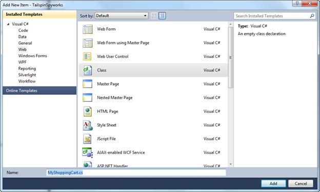
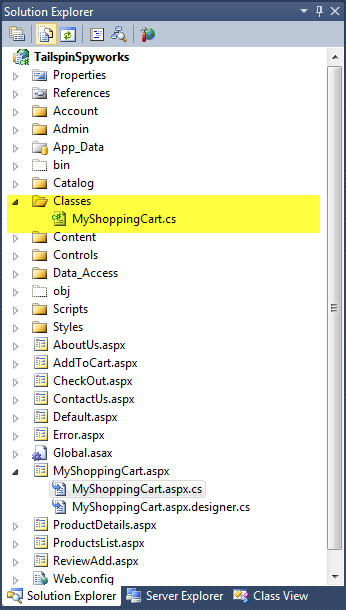
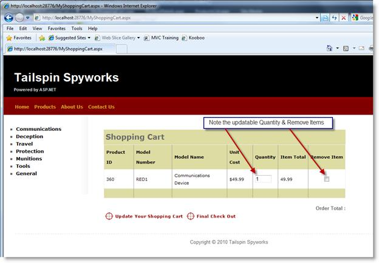
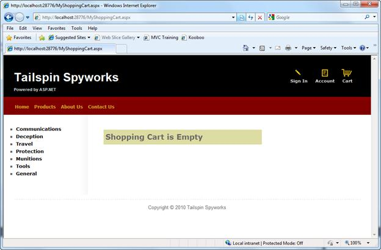
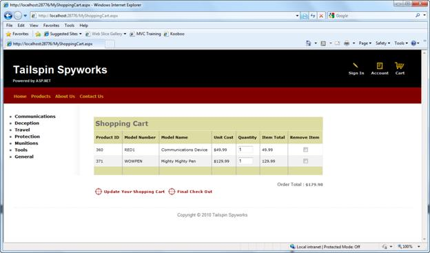

Part 5: Business Logic
====================
by [Joe Stagner](https://github.com/JoeStagner)

> Tailspin Spyworks demonstrates how extraordinarily simple it is to create powerful, scalable applications for the .NET platform. It shows off how to use the great new features in ASP.NET 4 to build an online store, including shopping, checkout, and administration.
> 
> This tutorial series details all of the steps taken to build the Tailspin Spyworks sample application. Part 5 adds some business logic.

##   Adding Some Business Logic

We want our shopping experience to be available whenever someone visits our web site. Visitors will be able to browse and add items to the shopping cart even if they are not registered or logged in. When they are ready to check out they will be given the option to authenticate and if they are not yet members they will be able to create an account.

This means that we will need to implement the logic to convert the shopping cart from an anonymous state to a "Registered User" state.

Let's create a directory named "Classes" then Right-Click on the folder and create a new "Class" file named MyShoppingCart.cs

As previously mentioned we will be extending the class that implements the MyShoppingCart.aspx page and we will do this using .NET's powerful "Partial Class" construct.

The generated call for our MyShoppingCart.aspx.cf file looks like this.

[!code-csharp[Main](tailspin-spyworks-part-5/samples/sample1.cs)]

Note the use of the "partial" keyword.

The class file that we just generated looks like this.

[!code-csharp[Main](tailspin-spyworks-part-5/samples/sample2.cs)]

We will merge our implementations by adding the partial keyword to this file as well.

Our new class file now looks like this.

[!code-csharp[Main](tailspin-spyworks-part-5/samples/sample3.cs)]

The first method that we will add to our class is the "AddItem" method. This is the method that will ultimately be called when the user clicks on the "Add to Art" links on the Product List and Product Details pages.

Append the following to the using statements at the top of the page.

[!code-csharp[Main](tailspin-spyworks-part-5/samples/sample4.cs)]

And add this method to the MyShoppingCart class.

[!code-csharp[Main](tailspin-spyworks-part-5/samples/sample5.cs)]

We are using LINQ to Entities to see if the item is already in the cart. If so, we update the order quantity of the item, otherwise we create a new entry for the selected item

In order to call this method we will implement an AddToCart.aspx page that not only class this method but then displayed the current shopping a=cart after the item has been added.

Right-Click on the solution name in the solution explorer and add and new page named AddToCart.aspx as we have done previously.

While we could use this page to display interim results like low stock issues, etc, in our implementation, the page will not actually render, but rather call the "Add" logic and redirect.

To accomplish this we'll add the following code to the Page\_Load event.

[!code-csharp[Main](tailspin-spyworks-part-5/samples/sample6.cs)]

Note that we are retrieving the product to add to the shopping cart from a QueryString parameter and calling the AddItem method of our class.

Assuming no errors are encountered control is passed to the SHoppingCart.aspx page which we will fully implement next. If there should be an error we throw an exception.

Currently we have not yet implemented a global error handler so this exception would go unhandled by our application but we will remedy this shortly.

Note also the use of the statement Debug.Fail() (available via `using System.Diagnostics;)`

Is the application is running inside the debugger, this method will display a detailed dialog with information about the applications state along with the error message that we specify.

When running in production the Debug.Fail() statement is ignored.

You will note in the code above a call to a method in our shopping cart class names "GetShoppingCartId".

Add the code to implement the method as follows.

Note that we've also added update and checkout buttons and a label where we can display the cart "total".

[!code-csharp[Main](tailspin-spyworks-part-5/samples/sample7.cs)]

We can now add items to our shopping cart but we have not implemented the logic to display the cart after a product has been added.

So, in the MyShoppingCart.aspx page we'll add an EntityDataSource control and a GridVire control as follows.

[!code-aspx[Main](tailspin-spyworks-part-5/samples/sample8.aspx)]

Call up the form in the designer so that you can double click on the Update Cart button and generate the click event handler that is specified in the declaration in the markup.

We'll implement the details later but doing this will let us build and run our application without errors.

When you run the application and add an item to the shopping cart you will see this.

Note that we have deviated from the "default" grid display by implementing three custom columns.

The first is an Editable, "Bound" field for the Quantity:

[!code-aspx[Main](tailspin-spyworks-part-5/samples/sample9.aspx)]

The next is a "calculated" column that displays the line item total (the item cost times the quantity to be ordered):

[!code-aspx[Main](tailspin-spyworks-part-5/samples/sample10.aspx)]

Lastly we have a custom column that contains a CheckBox control that the user will use to indicate that the item should be removed from the shopping chart.

[!code-aspx[Main](tailspin-spyworks-part-5/samples/sample11.aspx)]

As you can see, the Order Total line is empty so let's add some logic to calculate the Order Total.

We'll first implement a "GetTotal" method to our MyShoppingCart Class.

In the MyShoppingCart.cs file add the following code.

[!code-csharp[Main](tailspin-spyworks-part-5/samples/sample12.cs)]

Then in the Page\_Load event handler we'll can call our GetTotal method. At the same time we'll add a test to see if the shopping cart is empty and adjust the display accordingly if it is.

Now if the shopping cart is empty we get this:

And if not, we see our total.

However, this page is not yet complete.

We will need additional logic to recalculate the shopping cart by removing items marked for removal and by determining new quantity values as some may have been changed in the grid by the user.

Lets add a "RemoveItem" method to our shopping cart class in MyShoppingCart.cs to handle the case when a user marks an item for removal.

[!code-csharp[Main](tailspin-spyworks-part-5/samples/sample13.cs)]

Now let's ad a method to handle the circumstance when a user simply changes the quality to be ordered in the GridView.

[!code-csharp[Main](tailspin-spyworks-part-5/samples/sample14.cs)]

With the basic Remove and Update features in place we can implement the logic that actually updates the shopping cart in the database. (In MyShoppingCart.cs)

[!code-csharp[Main](tailspin-spyworks-part-5/samples/sample15.cs)]

You'll note that this method expects two parameters. One is the shopping cart Id and the other is an array of objects of user defined type.

So as to minimize the dependency of our logic on user interface specifics, we've defined a data structure that we can use to pass the shopping cart items to our code without our method needing to directly access the GridView control.

[!code-csharp[Main](tailspin-spyworks-part-5/samples/sample16.cs)]

In our MyShoppingCart.aspx.cs file we can use this structure in our Update Button Click Event handler as follows. Note that in addition to updating the cart we will update the cart total as well.

[!code-csharp[Main](tailspin-spyworks-part-5/samples/sample17.cs)]

Note with particular interest this line of code:

[!code-javascript[Main](tailspin-spyworks-part-5/samples/sample18.js)]

GetValues() is a special helper function that we will implement in MyShoppingCart.aspx.cs as follows.

[!code-csharp[Main](tailspin-spyworks-part-5/samples/sample19.cs)]

This provides a clean way to access the values of the bound elements in our GridView control. Since our "Remove Item" CheckBox Control is not bound we'll access it via the FindControl() method.

At this stage in your project's development we are getting ready to implement the checkout process.

Before doing so let's use Visual Studio to generate the membership database and add a user to the membership repository.

>[!div class="step-by-step"]
[Previous](tailspin-spyworks-part-4.md)
[Next](tailspin-spyworks-part-6.md)