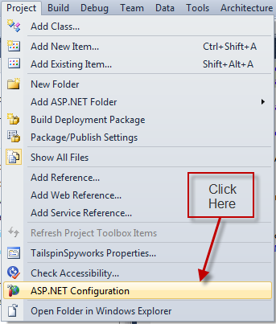
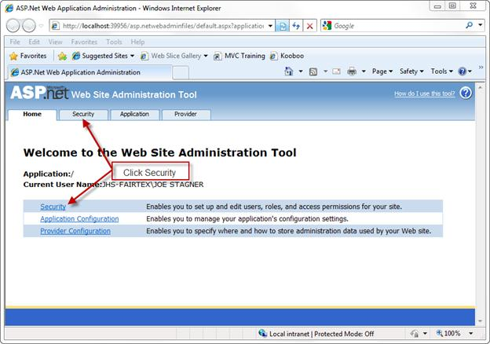
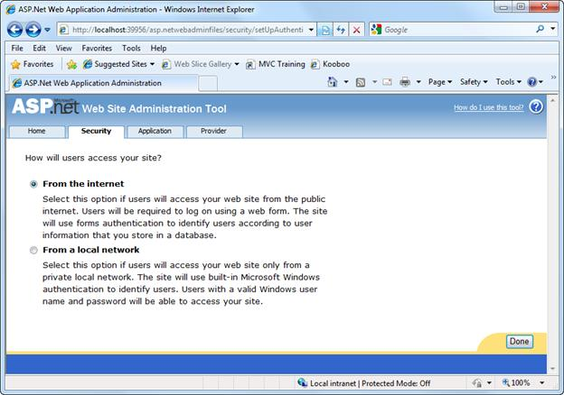
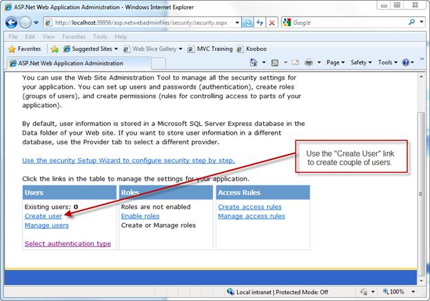

Part 6: ASP.NET Membership
====================
by [Joe Stagner](https://github.com/JoeStagner)

> Tailspin Spyworks demonstrates how extraordinarily simple it is to create powerful, scalable applications for the .NET platform. It shows off how to use the great new features in ASP.NET 4 to build an online store, including shopping, checkout, and administration.
> 
> This tutorial series details all of the steps taken to build the Tailspin Spyworks sample application. Part 6 adds ASP.NET Membership.

##   Working with ASP.NET Membership

Click Security

Make sure that we are using forms authentication.

Use the "Create User" link to create a couple of users.

When done, refer to the Solution Explorer window and refresh the view.

Note that the ASPNETDB.MDF fine has been created. This file contains the tables to support the core ASP.NET services like membership.

Now we can begin implementing the checkout process.

Begin by creating a CheckOut.aspx page.

The CheckOut.aspx page should only be available to users who are logged in so we will restrict access to logged in users and redirect users who are not logged in to the LogIn page.

To do this we'll add the following to the configuration section of our web.config file.

[!code-xml[Main](tailspin-spyworks-part-6/samples/sample1.xml)]

The template for ASP.NET Web Forms applications automatically added an authentication section to our web.config file and established the default login page.

[!code-xml[Main](tailspin-spyworks-part-6/samples/sample2.xml)]

We must modify the Login.aspx code behind file to migrate an anonymous shopping cart when the user logs in. Change the Page\_Load event as follows.

[!code-csharp[Main](tailspin-spyworks-part-6/samples/sample3.cs)]

Then add a "LoggedIn" event handler like this to set the session name to the newly logged in user and change the temporary session id in the shopping cart to that of the user by calling the MigrateCart method in our MyShoppingCart class. (Implemented in the .cs file)

[!code-csharp[Main](tailspin-spyworks-part-6/samples/sample4.cs)]

Implement the MigrateCart() method like this.

[!code-csharp[Main](tailspin-spyworks-part-6/samples/sample5.cs)]

In checkout.aspx we'll use an EntityDataSource and a GridView in our check out page much as we did in our shopping cart page.

[!code-aspx[Main](tailspin-spyworks-part-6/samples/sample6.aspx)]

Note that our GridView control specifies an "ondatabound" event handler named MyList\_RowDataBound so let's implement that event handler like this.

[!code-csharp[Main](tailspin-spyworks-part-6/samples/sample7.cs)]

This method keeps a running total of the shopping cart as each row is bound and updates the bottom row of the GridView.

At this stage we have implemented a "review" presentation of the order to be placed.

Let's handle an empty cart scenario by adding a few lines of code to our Page\_Load event:

[!code-csharp[Main](tailspin-spyworks-part-6/samples/sample8.cs)]

When the user clicks on the "Submit" button we will execute the following code in the Submit Button Click Event handler.

[!code-csharp[Main](tailspin-spyworks-part-6/samples/sample9.cs)]

The "meat" of the order submission process is to be implemented in the SubmitOrder() method of our MyShoppingCart class.

SubmitOrder will:

- Take all the line items in the shopping cart and use them to create a new Order Record and the associated OrderDetails records.
- Calculate Shipping Date.
- Clear the shopping cart.

[!code-csharp[Main](tailspin-spyworks-part-6/samples/sample10.cs)]

For the purposes of this sample application we'll calculate a ship date by simply adding two days to the current date.

[!code-csharp[Main](tailspin-spyworks-part-6/samples/sample11.cs)]

Running the application now will permit us to test the shopping process from start to finish.

>[!div class="step-by-step"]
[Previous](tailspin-spyworks-part-5.md)
[Next](tailspin-spyworks-part-7.md)