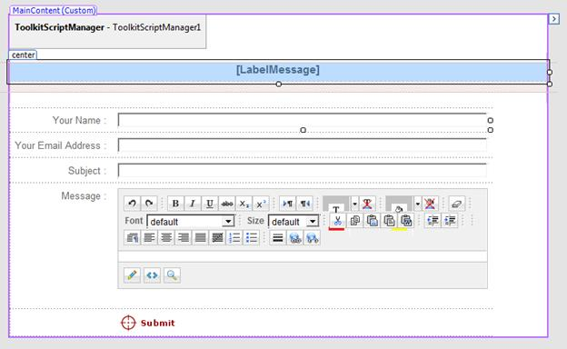
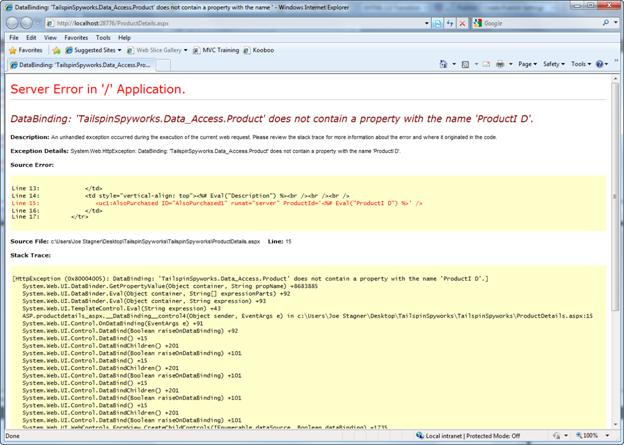

Part 8: Final Pages, Exception Handling, and Conclusion
====================
by [Joe Stagner](https://github.com/JoeStagner)

> Tailspin Spyworks demonstrates how extraordinarily simple it is to create powerful, scalable applications for the .NET platform. It shows off how to use the great new features in ASP.NET 4 to build an online store, including shopping, checkout, and administration.
> 
> This tutorial series details all of the steps taken to build the Tailspin Spyworks sample application. Part 8 adds a contact page, about page, and exception handling. This is the conclusion of the series.

##   Contact Page (Sending email from ASP.NET)

Create a new page named ContactUs.aspx

Using the designer, create the following form taking special note to include the ToolkitScriptManager and the Editor control from the AjaxdControlToolkit. .

Double click on the "Submit" button to generate a click event handler in the code behind file and implement a method to send the contact information as an email.

[!code-csharp[Main](tailspin-spyworks-part-8/samples/sample1.cs)]

This code requires that your web.config file contain an entry in the configuration section that specifies the SMTP server to use for sending mail.

[!code-xml[Main](tailspin-spyworks-part-8/samples/sample2.xml)]

##   About Page

Create a page named AboutUs.aspx and add whatever content you like.

##   Global Exception Handler

Lastly, throughout the application we have thrown exceptions and there are unforeseen circumstances that cold also cause unhandled exceptions in our web application.

We never want an unhandled exception to be displayed to a web site visitor.

Apart from being a terrible user experience unhandled exceptions can also be a security problem.

To solve this problem we will implement a global exception handler.

To do this, open the Global.asax file and note the following pre-generated event handler.

[!code-csharp[Main](tailspin-spyworks-part-8/samples/sample3.cs)]

Add code to implement the Application\_Error handler as follows.

[!code-csharp[Main](tailspin-spyworks-part-8/samples/sample4.cs)]

Then add a page named Error.aspx to the solution and add this markup snippet.

[!code-aspx[Main](tailspin-spyworks-part-8/samples/sample5.aspx)]

Now in the Page\_Load event handler extract the error messages from the Request Object.

[!code-csharp[Main](tailspin-spyworks-part-8/samples/sample6.cs)]

##   Conclusion

We've seen that that ASP.NET WebForms makes it easy to create a sophisticated website with database access, membership, AJAX, etc. pretty quickly.

Hopefully this tutorial has given you the tools you need to get started building your own ASP.NET WebForms applications!

>[!div class="step-by-step"]
[Previous](tailspin-spyworks-part-7.md)