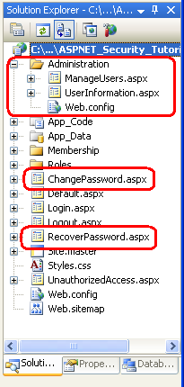
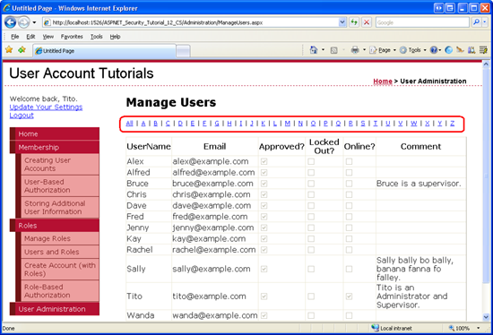
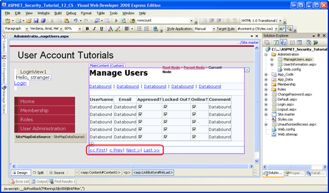
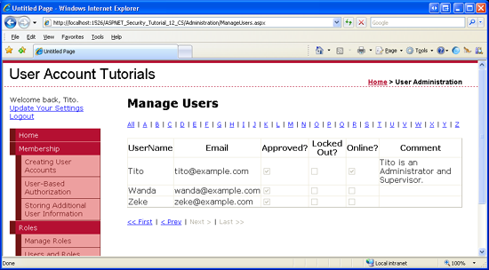

Building an Interface to Select One User Account from Many (C#)
====================
by [Scott Mitchell](https://twitter.com/ScottOnWriting)

[Download Code](http://download.microsoft.com/download/6/0/e/60e1bd94-e5f9-4d5a-a079-f23c98f4f67d/CS.12.zip) or [Download PDF](http://download.microsoft.com/download/6/0/e/60e1bd94-e5f9-4d5a-a079-f23c98f4f67d/aspnet_tutorial12_SelectUser_cs.pdf)

> In this tutorial we will build a user interface with a paged, filterable grid. In particular, our user interface will consist of a series of LinkButtons for filtering the results based on the starting letter of the username, and a GridView control to show the matching users. We'll start by listing all of the user accounts in a GridView. Then, in Step 3, we will add the filter LinkButtons. Step 4 looks at paging the filtered results. The interface constructed in Steps 2 through 4 will be used in the subsequent tutorials to perform administrative tasks for a particular user account.

## Introduction

In the [*Assigning Roles to Users*](../roles/assigning-roles-to-users-cs.md) tutorial, we created a rudimentary interface for an administrator to select a user and manage her roles. Specifically, the interface presented the administrator with a drop-down list of all of the users. Such an interface is suitable when there are but a dozen or so user accounts, but is unwieldy for sites with hundreds or thousands of accounts. A paged, filterable grid is more suitable user interface for websites with large user bases.

In this tutorial we will build such a user interface. In particular, our user interface will consist of a series of LinkButtons for filtering the results based on the starting letter of the username, and a GridView control to show the matching users. We'll start by listing all of the user accounts in a GridView. Then, in Step 3, we will add the filter LinkButtons. Step 4 looks at paging the filtered results. The interface constructed in Steps 2 through 4 will be used in the subsequent tutorials to perform administrative tasks for a particular user account.

Let's get started!

## Step 1: Adding New ASP.NET Pages

In this tutorial and the next two we will be examining various administration-related functions and capabilities. We will need a series of ASP.NET pages to implement the topics examined throughout these tutorials. Let's create these pages and update the site map.

Start by creating a new folder in the project named `Administration`. Next, add two new ASP.NET pages to the folder, linking each page with the `Site.master` master page. Name the pages:

- `ManageUsers.aspx`
- `UserInformation.aspx`

Also add two pages to the website's root directory: `ChangePassword.aspx` and `RecoverPassword.aspx`.

These four pages should, at this point, have two Content controls, one for each of the master page's ContentPlaceHolders: `MainContent` and `LoginContent`.

[!code-aspx[Main](building-an-interface-to-select-one-user-account-from-many-cs/samples/sample1.aspx)]

We want to show the master page's default markup for the `LoginContent` ContentPlaceHolder for these pages. Therefore, remove the declarative markup for the `Content2` Content control. After doing so, the pages' markup should contain just one Content control.

The ASP.NET pages in the `Administration` folder are intended solely for administrative users. We added an Administrators role to the system in the [*Creating and Managing Roles*](../roles/creating-and-managing-roles-cs.md) tutorial; restrict access to these two pages to this role. To accomplish this, add a `Web.config` file to the `Administration` folder and configure its `<authorization>` element to admit users in the Administrators role and to deny all others.

[!code-xml[Main](building-an-interface-to-select-one-user-account-from-many-cs/samples/sample2.xml)]

At this point your project's Solution Explorer should look similar to the screen shot shown in Figure 1.

**Figure 1**: Four New Pages and a `Web.config` File Have Been Added to the Website  ([Click to view full-size image](building-an-interface-to-select-one-user-account-from-many-cs/_static/image3.png))

Finally, update the site map (`Web.sitemap`) to include an entry to the `ManageUsers.aspx` page. Add the following XML after the `<siteMapNode>` we added for the Roles tutorials.

[!code-xml[Main](building-an-interface-to-select-one-user-account-from-many-cs/samples/sample3.xml)]

With the site map updated, visit the site through a browser. As Figure 2 shows, the navigation on the left now includes items for the Administration tutorials.

**Figure 2**: The Site Map Includes a Node Titled User Administration  ([Click to view full-size image](building-an-interface-to-select-one-user-account-from-many-cs/_static/image6.png))

## Step 2: Listing All User Accounts in a GridView

Our end goal for this tutorial is to create a paged, filterable grid through which an administrator can select a user account to manage. Let's start by listing *all* users in a GridView. Once this is complete, we will add the filtering and paging interfaces and functionality.

Open the `ManageUsers.aspx` page in the `Administration` folder and add a GridView, setting its `ID` to `UserAccounts`. In a moment, we will write code to bind the set of user accounts to the GridView using the `Membership` class's `GetAllUsers` method. As discussed in earlier tutorials, the GetAllUsers method returns a `MembershipUserCollection` object, which is a collection of `MembershipUser` objects. Each `MembershipUser` in the collection includes properties like `UserName`, `Email`, `IsApproved`, and so on.

In order to display the desired user account information in the GridView, set the GridView's `AutoGenerateColumns` property to False and add BoundFields for the `UserName`, `Email`, and `Comment` properties and CheckBoxFields for the `IsApproved`, `IsLockedOut`, and `IsOnline` properties. This configuration can be applied through the control's declarative markup or via the Fields dialog box. Figure 3 shows a screen shot of the Fields dialog box after the Auto-generate fields checkbox has been unchecked and the BoundFields and CheckBoxFields have been added and configured.

**Figure 3**: Add Three BoundFields and Three CheckBoxFields to the GridView  ([Click to view full-size image](building-an-interface-to-select-one-user-account-from-many-cs/_static/image9.png))

After configuring your GridView, ensure that its declarative markup resembles the following:

[!code-aspx[Main](building-an-interface-to-select-one-user-account-from-many-cs/samples/sample4.aspx)]

Next, we need to write code that binds the user accounts to the GridView. Create a method named `BindUserAccounts` to perform this task and then call it from the `Page_Load` event handler on the first page visit.

[!code-csharp[Main](building-an-interface-to-select-one-user-account-from-many-cs/samples/sample5.cs)]

Take a moment to test the page through a browser. As Figure 4 shows, the `UserAccounts` GridView lists the username, email address, and other pertinent account information for all users in the system.

**Figure 4**: The User Accounts are Listed in the GridView  ([Click to view full-size image](building-an-interface-to-select-one-user-account-from-many-cs/_static/image12.png))

## Step 3: Filtering the Results by the First Letter of the Username

Currently the `UserAccounts` GridView shows *all* of the user accounts. For websites with hundreds or thousands of user accounts, it is imperative that user be able to quickly pare down the displayed accounts. This can be accomplished by adding filtering LinkButtons to the page. Let's add 27 LinkButtons to the page: one titled All along with one LinkButton for each letter of the alphabet. If a visitor clicks the All LinkButton, the GridView will show all of the users. If they click a particular letter, only those users whose username starts with the selected letter will be displayed.

Our first task is to add the 27 LinkButton controls. One option would be to create the 27 LinkButtons declaratively, one at a time. A more flexible approach is to use a Repeater control with an `ItemTemplate` that renders a LinkButton and then binds the filtering options to the Repeater as a `string` array.

Start by adding a Repeater control to the page above the `UserAccounts` GridView. Set the Repeater's `ID` property to `FilteringUI`. Configure the Repeater's templates so that its `ItemTemplate` renders a LinkButton whose `Text` and `CommandName` properties are bound to the current array element. As we saw in the [*Assigning Roles to Users*](../roles/assigning-roles-to-users-cs.md) tutorial, this can be accomplished using the `Container.DataItem` databinding syntax. Use the Repeater's `SeparatorTemplate` to display a vertical line between each link.

[!code-aspx[Main](building-an-interface-to-select-one-user-account-from-many-cs/samples/sample6.aspx)]

To populate this Repeater with the desired filtering options, create a method named `BindFilteringUI`. Be sure to call this method from the `Page_Load` event handler on the first page load.

[!code-csharp[Main](building-an-interface-to-select-one-user-account-from-many-cs/samples/sample7.cs)]

This method specifies the filtering options as elements in the `string` array `filterOptions`. For each element in the array, the Repeater will render a LinkButton with its `Text` and `CommandName` properties assigned to the value of the array element.

Figure 5 shows the `ManageUsers.aspx` page when viewed through a browser.

**Figure 5**: The Repeater Lists 27 Filtering LinkButtons  ([Click to view full-size image](building-an-interface-to-select-one-user-account-from-many-cs/_static/image15.png))

> [!NOTE]
> Usernames may start with any character, including numbers and punctuation. In order to view these accounts, the administrator will have to use the All LinkButton option. Alternatively, you could add a LinkButton to return all user accounts that start with a number. I leave this as an exercise for the reader.

Clicking any of the filtering LinkButtons causes a postback and raises the Repeater's `ItemCommand` event, but there's no change in the grid because we've yet to write any code to filter the results. The `Membership` class includes a [`FindUsersByName` method](https://technet.microsoft.com/en-us/library/system.web.security.membership.findusersbyname.aspx) that returns those user accounts whose username matches a specified search pattern. We can use this method to retrieve just those user accounts whose usernames start with the letter specified by the `CommandName` of the filtered LinkButton that was clicked.

Start by updating the `ManageUser.aspx` page's code-behind class so that it includes a property named `UsernameToMatch`. This property persists the username filter string across postbacks:

[!code-csharp[Main](building-an-interface-to-select-one-user-account-from-many-cs/samples/sample8.cs)]

The `UsernameToMatch` property stores its value it is assigned into the `ViewState` collection using the key UsernameToMatch. When this property's value is read, it checks to see if a value exists in the `ViewState` collection; if not, it returns the default value, an empty string. The `UsernameToMatch` property exhibits a common pattern, namely persisting a value to view state so that any changes to the property are persisted across postbacks. For more information on this pattern, read [Understanding ASP.NET View State](https://msdn.microsoft.com/en-us/library/ms972976.aspx).

Next, update the `BindUserAccounts` method so that instead of calling `Membership.GetAllUsers`, it calls `Membership.FindUsersByName`, passing in the value of the `UsernameToMatch` property appended with the SQL wildcard character, %.

[!code-csharp[Main](building-an-interface-to-select-one-user-account-from-many-cs/samples/sample9.cs)]

To display just those users whose username starts with the letter A, set the `UsernameToMatch` property to A and then call `BindUserAccounts`. This would result in a call to `Membership.FindUsersByName("A%")`, which will return all users whose username starts with A. Likewise, to return *all* users, assign an empty string to the `UsernameToMatch` property so that the `BindUserAccounts` method will invoke `Membership.FindUsersByName("%")`, thereby returning all user accounts.

Create an event handler for the Repeater's `ItemCommand` event. This event is raised whenever one of the filter LinkButtons is clicked; it is passed the clicked LinkButton's `CommandName` value through the `RepeaterCommandEventArgs` object. We need to assign the appropriate value to the `UsernameToMatch` property and then call the `BindUserAccounts` method. If the `CommandName` is All, assign an empty string to `UsernameToMatch` so that all user accounts are displayed. Otherwise, assign the `CommandName` value to `UsernameToMatch`.

[!code-csharp[Main](building-an-interface-to-select-one-user-account-from-many-cs/samples/sample10.cs)]

With this code in place, test out the filtering functionality. When the page is first visited, all user accounts are displayed (refer back to Figure 5). Clicking the A LinkButton causes a postback and filters the results, displaying only those user accounts that start with A .

**Figure 6**: Use the Filtering LinkButtons to Display those Users Whose Username Starts with a Certain Letter  ([Click to view full-size image](building-an-interface-to-select-one-user-account-from-many-cs/_static/image18.png))

## Step 4: Updating the GridView to Use Paging

The GridView shown in Figures 5 and 6 lists all of the records returned from the `FindUsersByName` method. If there are hundreds or thousands of user accounts this can lead to information overload when viewing all of the accounts (as is the case when clicking the All LinkButton or when initially visiting the page). To help present the user accounts in more manageable chunks, let's configure the GridView to display 10 user accounts at a time.

The GridView control offers two types of paging:

- **Default paging** - easy to implement, but inefficient. In a nutshell, with default paging the GridView expects *all* of the records from its data source. It then only displays the appropriate page of records.
- **Custom paging** - requires more work to implement, but is more efficient than default paging because with custom paging the data source returns only the precise set of records to display.

The performance difference between default and custom paging can be quite substantial when paging through thousands of records. Because we are building this interface assuming that there may be hundreds or thousands of user accounts, let's use custom paging.

> [!NOTE]
> For a more thorough discussion on the differences between default and custom paging, as well as the challenges involved in implementing custom paging, refer to [Efficiently Paging Through Large Amounts of Data](https://asp.net/learn/data-access/tutorial-25-cs.aspx). For some analysis of the performance difference between default and custom paging, see [Custom Paging in ASP.NET with SQL Server 2005](http://aspnet.4guysfromrolla.com/articles/031506-1.aspx).

To implement custom paging we first need some mechanism by which to retrieve the precise subset of records being displayed by the GridView. The good news is that the `Membership` class's `FindUsersByName` method has an overload that allows us to specify the page index and page size, and returns only those user accounts that fall within that range of records.

In particular, this overload has the following signature: [`FindUsersByName(usernameToMatch, pageIndex, pageSize, totalRecords)`](https://msdn.microsoft.com/en-us/library/fa5st8b2.aspx).

The *pageIndex* parameter specifies the page of user accounts to return; *pageSize* indicates how many records to display per page. The *totalRecords* parameter is an `out` parameter that returns the number of total user accounts in the user store.

> [!NOTE]
> The data returned by `FindUsersByName` is sorted by username; the sort criteria cannot be customized.

The GridView can be configured to utilize custom paging, but only when bound to an ObjectDataSource control. For the ObjectDataSource control to implement custom paging, it requires two methods: one that is passed a start row index and the maximum number of records to display, and returns the precise subset of records that fall within that span; and a method that returns the total number of records being paged through. The `FindUsersByName` overload accepts a page index and page size, and returns the total number of records through an `out` parameter. So there is an interface mismatch here.

One option would be to create a proxy class that exposes the interface the ObjectDataSource expects, and then internally calls the `FindUsersByName` method. Another option - and the one we'll use for this article - is to create our own paging interface and use that instead of the GridView's built-in paging interface.

### Creating a First, Previous, Next, Last Paging Interface

Let's build a paging interface with First, Previous, Next, and Last LinkButtons. The First LinkButton, when clicked, will take the user to the first page of data, whereas Previous will return him to the previous page. Likewise, Next and Last will move the user to the next and last page, respectively. Add the four LinkButton controls beneath the `UserAccounts` GridView.

[!code-aspx[Main](building-an-interface-to-select-one-user-account-from-many-cs/samples/sample11.aspx)]

Next, create an event handler for each of the LinkButton's `Click` events.

Figure 7 shows the four LinkButtons when viewed through the Visual Web Developer Design view.

**Figure 7**: Add First, Previous, Next, and Last LinkButtons Beneath the GridView  ([Click to view full-size image](building-an-interface-to-select-one-user-account-from-many-cs/_static/image21.png))

### Keeping Track of the Current Page Index

When a user first visits the `ManageUsers.aspx` page or clicks one of the filtering buttons, we want to display the first page of data in the GridView. When the user clicks one of the navigation LinkButtons, however, we need to update the page index. To maintain the page index and the number of records to display per page, add the following two properties to the page's code-behind class:

[!code-csharp[Main](building-an-interface-to-select-one-user-account-from-many-cs/samples/sample12.cs)]

Like the `UsernameToMatch` property, the `PageIndex` property persists its value to view state. The read-only `PageSize` property returns a hard-coded value, 10. I invite the interested reader to update this property to use the same pattern as `PageIndex`, and then to augment the `ManageUsers.aspx` page such that the person visiting the page can specify how many user accounts to display per page.

### Retrieving Just the Current Page's Records, Updating the Page Index, and Enabling and Disabling the Paging Interface LinkButtons

With the paging interface in place and the `PageIndex` and `PageSize` properties added, we are ready to update the `BindUserAccounts` method so that it uses the appropriate `FindUsersByName` overload. Additionally, we need to have this method enable or disable the paging interface depending on what page is being displayed. When viewing the first page of data, the First and Previous links should be disabled; Next and Last should be disabled when viewing the last page.

Update the `BindUserAccounts` method with the following code:

[!code-csharp[Main](building-an-interface-to-select-one-user-account-from-many-cs/samples/sample13.cs)]

Note that the total number of records being paged through is determined by the last parameter of the `FindUsersByName` method. This is an `out` parameter, so we need to first declare a variable to hold this value (`totalRecords`) and then prefix it with the `out` keyword.

After the specified page of user accounts are returned, the four LinkButtons are either enabled or disabled, depending on whether the first or last page of data is being viewed.

The last step is to write the code for the four LinkButtons' `Click` event handlers. These event handlers need to update the `PageIndex` property and then rebind the data to the GridView via a call to `BindUserAccounts`. The First, Previous, and Next event handlers are very simple. The `Click` event handler for the Last LinkButton, however, is a bit more complex because we need to determine how many records are being displayed in order to determine the last page index.

[!code-csharp[Main](building-an-interface-to-select-one-user-account-from-many-cs/samples/sample14.cs)]

Figures 8 and 9 show the custom paging interface in action. Figure 8 shows the `ManageUsers.aspx` page when viewing the first page of data for all user accounts. Note that only 10 of the 13 accounts are displayed. Clicking the Next or Last link causes a postback, updates the `PageIndex` to 1, and binds the second page of user accounts to the grid (see Figure 9).

**Figure 8**: The First 10 User Accounts are Displayed  ([Click to view full-size image](building-an-interface-to-select-one-user-account-from-many-cs/_static/image24.png))

**Figure 9**: Clicking the Next Link Displays the Second Page of User Accounts  ([Click to view full-size image](building-an-interface-to-select-one-user-account-from-many-cs/_static/image27.png))

## Summary

Administrators often need to select a user from the list of accounts. In previous tutorials we looked at using a drop-down list populated with the users, but this approach does not scale well. In this tutorial we explored a better alternative: a filterable interface whose results are displayed in a paged GridView. With this user interface, administrators can quickly and efficiently locate and select one user account among thousands.

Happy Programming!

### Further Reading

For more information on the topics discussed in this tutorial, refer to the following resources:

- [Custom Paging in ASP.NET with SQL Server 2005](http://aspnet.4guysfromrolla.com/articles/031506-1.aspx)
- [Efficiently Paging Through Large Amounts of Data](https://asp.net/learn/data-access/tutorial-25-cs.aspx)
- [Rolling Your Own Website Administration Tool](http://aspnet.4guysfromrolla.com/articles/052307-1.aspx)

### About the Author

Scott Mitchell, author of multiple ASP/ASP.NET books and founder of 4GuysFromRolla.com, has been working with Microsoft Web technologies since 1998. Scott works as an independent consultant, trainer, and writer. His latest book is *[Sams Teach Yourself ASP.NET 2.0 in 24 Hours](https://www.amazon.com/exec/obidos/ASIN/0672327384/4guysfromrollaco)*. Scott can be reached at [mitchell@4guysfromrolla.com](mailto:mitchell@4guysfromrolla.com) or via his blog at [http://ScottOnWriting.NET](http://scottonwriting.net/).

### Special Thanks To

This tutorial series was reviewed by many helpful reviewers. Lead reviewer for this tutorial was Alicja Maziarz. Interested in reviewing my upcoming MSDN articles? If so, drop me a line at [mitchell@4GuysFromRolla.com](mailto:mitchell@4GuysFromRolla.com)

>[!div class="step-by-step"]
[Next](recovering-and-changing-passwords-cs.md)