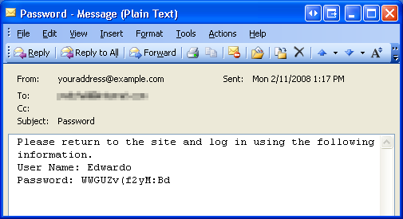
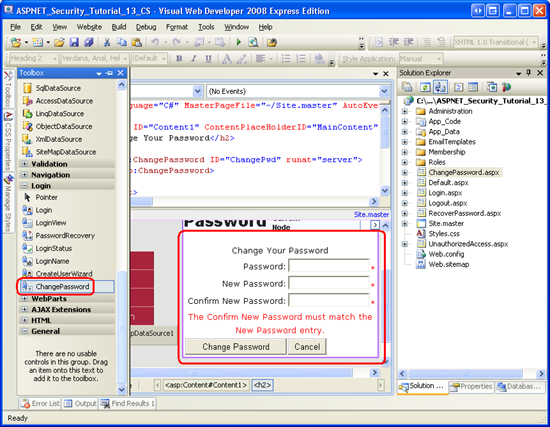

Recovering and Changing Passwords (C#)
====================
by [Scott Mitchell](https://twitter.com/ScottOnWriting)

[Download Code](http://download.microsoft.com/download/6/0/e/60e1bd94-e5f9-4d5a-a079-f23c98f4f67d/CS.13.zip) or [Download PDF](http://download.microsoft.com/download/6/0/e/60e1bd94-e5f9-4d5a-a079-f23c98f4f67d/aspnet_tutorial13_ChangingPasswords_cs.pdf)

> ASP.NET includes two Web controls for assisting with recovering and changing passwords. The PasswordRecovery control enables a visitor to recover his lost password. The ChangePassword control allows the user to update his password. Like the other Login-related Web controls we've seen throughout this tutorial series, the PasswordRecovery and ChangePassword controls work with the Membership framework behind the scenes to reset or modify users' passwords.

## Introduction

Between the websites for my bank, utility company, phone company, email accounts, and personalized web portals, I, like most people, have dozens of different passwords to remember. With so many credentials to memorize these days, it's not uncommon for people to forget their password. To account for this, websites that offer user accounts need to include a way for a user to recover his password. This process typically involves generating a new, random password and emailing it to the user's email address on file. After receiving their new password most users return to the site and change their password from the randomly generated one to a more memorable one.

ASP.NET includes two Web controls for assisting with recovering and changing passwords. The PasswordRecovery control enables a visitor to recover his lost password. The ChangePassword control allows the user to update his password. Like the other Login-related Web controls we've seen throughout this tutorial series, the PasswordRecovery and ChangePassword controls work with the Membership framework behind the scenes to reset or modify users' passwords.

In this tutorial we will examine using these two controls. We will also see how to programmatically change and reset a user's password via the `MembershipUser` class's `ChangePassword` and `ResetPassword` methods.

## Step 1: Helping Users Recover Lost Passwords

All websites that support user accounts need to provide users with some mechanism for recovering their forgotten passwords. The good news is that implementing such functionality in ASP.NET is a breeze thanks to the PasswordRecovery Web control. The PasswordRecovery control renders an interface that prompts the user for their username and, if needed, the answer to their security question. It then emails the user their password.

> [!NOTE]
> Because email messages are transmitted over the wire in plain-text there are security risks involved with sending a user's password via email.

The PasswordRecovery control consists of three views:

- **UserName** - prompts the visitor for their username. This is the initial view.
- **Question**- displays the user's username and security question as text, along with a TextBox for the user to enter the answer to his security question.
- **Success**- displays a message informing the user that his password has been emailed.

The views displayed and actions performed by the PasswordRecovery control depend upon the following Membership configuration settings:

- `RequiresQuestionAndAnswer`
- `EnablePasswordRetrieval`
- `EnablePasswordReset`

The Membership framework's `RequiresQuestionAndAnswer` setting indicates whether users must specify a security question and answer when registering for an account. As we discussed in the [*Creating User Accounts*](../membership/creating-user-accounts-cs.md) tutorial, if `RequiresQuestionAndAnswer` is True (the default) then the CreateUserWizard's interface includes TextBox controls for the new user's security question and answer; if `RequiresQuestionAndAnswer` is False, no such information is collected. Similarly, if `RequiresQuestionAndAnswer` is True, then the PasswordRecovery control displays the Question view after the user has entered their username; the password is recovered only if the user enters the correct security answer. If `RequiresQuestionAndAnswer` is False, however, the PasswordRecovery control moves straight from the UserName view to the Success view.

After the user has provided his username - or his username and security answer, if `RequiresQuestionAndAnswer` is True - the PasswordRecovery emails the user his password. If the `EnablePasswordRetrieval` option is set to True, then the user is emailed their current password. If it is set to False and `EnablePasswordReset` is set to True, then the PasswordRecovery control generates a new, random password for the user, and emails this new password to them. If both `EnablePasswordRetrieval` and `EnablePasswordReset` are False, the PasswordRecovery control throws an exception.

> [!NOTE]
> Recall that the `SqlMembershipProvider` stores users' passwords in one of three formats: Clear, Hashed (the default), or Encrypted. The storage mechanism used depends on the Membership configuration settings; the demo application uses the Hashed password format. When using the Hashed password format the `EnablePasswordRetrieval` option must be set to False because the system cannot determine the user's actual password from the hashed version stored in the database.

Figure 1 illustrates how the PasswordRecovery's interface and behavior is influenced by the Membership configuration.

**Figure 1**: The `RequiresQuestionAndAnswer`, `EnablePasswordRetrieval`, and `EnablePasswordReset` Influence the PasswordRecovery control's Appearance and Behavior  ([Click to view full-size image](recovering-and-changing-passwords-cs/_static/image3.png))

> [!NOTE]
> In the [*Creating the Membership Schema in SQL Server*](../membership/creating-the-membership-schema-in-sql-server-cs.md) tutorial we configured the Membership provider by setting `RequiresQuestionAndAnswer` to True, `EnablePasswordRetrieval` to False, and `EnablePasswordReset` to True.

### Using the PasswordRecovery Control

Let's look at using the PasswordRecovery control in an ASP.NET page. Open `RecoverPassword.aspx` and drag and drop a PasswordRecovery control from the Toolbox onto the Designer; set its `ID` to `RecoverPwd`. Like the Login and CreateUserWizard Web controls, the PasswordRecovery control's views render a rich composite interface that includes Labels, TextBoxes, Buttons, and validation controls. You can customize the appearance of the views through the control's style properties or by converting the views into templates. I leave this as an exercise for the interested reader.

When a user visits this page she will enter her username and click the Submit button. Because we have set the `RequiresQuestionAndAnswer` property to True in our Membership configuration settings, the PasswordRecovery control will then display the Question view. After the user enters her correct security answer and clicks Submit, the PasswordRecovery control will update the user's password to a randomly-generated one, and email this password to the email address on file. All of this was possible without us having to write a single line of code!

Before you test this page, there's one final piece of configuration to tend to: we need to specify the mail delivery settings in `Web.config`. The PasswordRecovery control relies on these settings for sending the email.

The mail delivery configuration is specified through the [`<system.net>` element](https://msdn.microsoft.com/en-us/library/6484zdc1.aspx)'s [`<mailSettings>` element](https://msdn.microsoft.com/en-us/library/w355a94k.aspx). Use the [`<smtp>` element](https://msdn.microsoft.com/en-us/library/ms164240.aspx) to indicate the delivery method and the default From address. The following markup configures mail settings to use a network SMTP server named `smtp.example.com` on port 25 and with username/password credentials of username and password.

> [!NOTE]
> `<system.net>` is a child element of the root `<configuration>` element and a sibling of `<system.web>`. Therefore, do not put the `<system.net>` element within the `<system.web>` element; instead, put it at the same level.

[!code-xml[Main](recovering-and-changing-passwords-cs/samples/sample1.xml)]

In addition to using an SMTP server on the network, you can alternatively specify a pickup directory where email messages to be sent should be deposited.

Once you have configured the SMTP settings, visit the `RecoverPassword.aspx` page through a browser. First try entering a username that doesn't exist in the user store. As Figure 2 shows, the PasswordRecovery control displays a message indicating that the user information could not be accessed. The text of the message can be customized through the control's [`UserNameFailureText` property](https://msdn.microsoft.com/en-us/library/system.web.ui.webcontrols.passwordrecovery.usernamefailuretext.aspx).

**Figure 2**: An Error Message is Displayed if an Invalid Username is Entered  ([Click to view full-size image](recovering-and-changing-passwords-cs/_static/image6.png))

Now enter a username. Use the username of an account in the system with an email address that you can access and whose security answer you know. After entering the username and clicking Submit, the PasswordRecovery control displays its Question view. As with the UserName view, if you enter an incorrect answer the PasswordRecovery control displays an error message (see Figure 3). Use the [`QuestionFailureText` property](https://msdn.microsoft.com/en-us/library/system.web.ui.webcontrols.passwordrecovery.questionfailuretext.aspx) to customize this error message.

**Figure 3**: An Error Message is Displayed if the User Enters an Invalid Security Answer  ([Click to view full-size image](recovering-and-changing-passwords-cs/_static/image9.png))

Finally, enter the correct security answer and click Submit. Behind the scenes, the PasswordRecovery control generates a random password, assigns it to the user account, sends an email informing the user of their new password (see Figure 4), and then displays the Success view.

**Figure 4**: The User is Sent an Email with His New Password  ([Click to view full-size image](recovering-and-changing-passwords-cs/_static/image12.png))

### Customizing the Email

The default email sent by the PasswordRecovery control is rather dull (see Figure 4). The message is sent from the account specified in the `<smtp>` element's `from` attribute with the subject Password and the plain-text body:

Please return to the site and log in using the following information.

User Name: *username*

Password: *password*

This message can be customized programmatically through an event handler for the PasswordRecovery control's [`SendingMail` event](https://msdn.microsoft.com/en-us/library/system.web.ui.webcontrols.passwordrecovery.sendingmail.aspx), or declaratively through the [`MailDefinition` property](https://msdn.microsoft.com/en-us/library/system.web.ui.webcontrols.passwordrecovery.maildefinition.aspx). Let's explore both of these options.

The `SendingMail` event is fired right before the email message is sent and is our last chance to programmatically adjust the email message. When this event is raised, the event handler is passed an object of type [`MailMessageEventArgs`](https://msdn.microsoft.com/en-us/library/system.web.ui.webcontrols.mailmessageeventargs.aspx), whose `Message` property contains a reference to the email about to be sent.

Create an event handler for the `SendingMail` event and add the following code, which programmatically adds `webmaster@example.com` to the CC list.

[!code-csharp[Main](recovering-and-changing-passwords-cs/samples/sample2.cs)]

The email message can also be configured through declarative means. The PasswordRecovery's `MailDefinition` property is an object of type [`MailDefinition`](https://msdn.microsoft.com/en-us/library/system.web.ui.webcontrols.maildefinition.aspx). The `MailDefinition` class offers a host of email-related properties, including `From`, `CC`, `Priority`, `Subject`, `IsBodyHtml`, `BodyFileName`, and others. For starters, set the [`Subject` property](https://msdn.microsoft.com/en-us/library/system.web.ui.webcontrols.maildefinition.subject.aspx) to something more descriptive than the one used by default ( Password ), such as Your password has been reset...

To customize the body of the email message we need to create a separate email template file that contains the body's contents. Start by creating a new folder in the website named `EmailTemplates`. Next, add a new text file to this folder named `PasswordRecovery.txt` and add the following content:

[!code-aspx[Main](recovering-and-changing-passwords-cs/samples/sample3.aspx)]

Note the use of the placeholders `<%UserName%>` and `<%Password%>`. The PasswordRecovery control automatically replaces these two placeholders with the user's username and recovered password prior to sending the email.

Lastly, point the `MailDefinition`'s [`BodyFileName` property](https://msdn.microsoft.com/en-us/library/system.web.ui.webcontrols.maildefinition.bodyfilename.aspx) to the email template we just created (`~/EmailTemplates/PasswordRecovery.txt`).

After making these changes revisit the `RecoverPassword.aspx` page and enter your username and security answer. You receive should an email that looks like the one in Figure 5. Note that `webmaster@example.com` has been CC'd and that the subject and body have been updated.

**Figure 5**: The Subject, Body, and CC List Have Been Updated  ([Click to view full-size image](recovering-and-changing-passwords-cs/_static/image15.png))

To send an HTML-formatted email set [`IsBodyHtml`](https://msdn.microsoft.com/en-us/library/system.web.ui.webcontrols.maildefinition.isbodyhtml.aspx) to True (the default is False) and update the email template to include HTML.

The `MailDefinition` property is not unique to the PasswordRecovery class. As we will see in Step 2, the ChangePassword control also offers a `MailDefinition` property. Moreover, the CreateUserWizard control includes such a property that you can configure to automatically send a welcome email message to new users.

> [!NOTE]
> Currently there are no links in the left-hand navigation for reaching the `RecoverPassword.aspx` page. A user would only be interested in visiting this page if she was unable to successfully log on to the site. Therefore, update the `Login.aspx` page to include a link to the `RecoverPassword.aspx` page.

### Programmatically Resetting a User's Password

When resetting a user's password the PasswordRecovery control calls the `MembershipUser` object's [`ResetPassword` method](https://msdn.microsoft.com/en-us/library/system.web.security.membershipuser.resetpassword.aspx). This method has two overloads:

- **[`ResetPassword`](https://msdn.microsoft.com/en-us/library/d94bdzz2.aspx)** - resets a user's password. Use this overload if `RequiresQuestionAndAnswer` is False.
- **[`ResetPassword(securityAnswer)`](https://msdn.microsoft.com/en-us/library/d90zte4w.aspx)** - resets a user's password only if the supplied *securityAnswer* is correct. Use this overload if `RequiresQuestionAndAnswer` is True.

Both overloads return the new, randomly-generated password.

Like with the other methods in the Membership framework, the `ResetPassword` method delegates to the configured provider. The `SqlMembershipProvider` invokes the `aspnet_Membership_ResetPassword` stored procedure, passing in the user's username, the new password, and the supplied password answer, among other fields. The stored procedure ensures that the password answer matches and then updates the user's password.

A couple of low-level implementation notes:

- A locked out user cannot reset her password. However, an unapproved user may. We will discuss the locked out and approved states in more detail in the [*Unlocking and Approving User*](unlocking-and-approving-user-accounts-cs.md) Accounts tutorial.
- If the password answer is incorrect, the user's failed password answer attempt count is incremented. If a specified number of invalid security answer attempts occur within a specified time window, the user is locked out.

### A Word on How the Random Passwords are Generated

The randomly-generated passwords shown in the email messages in Figures 4 and 5 are created by the Membership class's [`GeneratePassword` method](https://msdn.microsoft.com/en-us/library/system.web.security.membership.generatepassword.aspx). This method accepts two integer input paramters - *length* and *numberOfNonAlphanumericCharacters* - and returns a string at least *length* characters long with at least *numberOfNonAlphanumericCharacters* number of non-alphanumeric characters. When this method is called from within the Membership classes or Login-related Web controls, the values for these two parameters are determined by the Membership configuration's `MinRequiredPasswordLength` and `MinRequiredNonalphanumericCharacters` properties, which we set to 7 and 1, respectively.

The `GeneratePassword` method uses a cryptographically strong random number generator to ensure that there is no bias in what random characters are selected. Furthermore, `GeneratePassword` is `public`, meaning that you can use it directly from your ASP.NET application if you need to generate random strings or passwords.

> [!NOTE]
> The `SqlMembershipProvider` class always generates a random password at least 14 characters long, so if `MinRequiredPasswordLength` is less than 14 then its value is ignored.

## Step 2: Changing Passwords

The randomly-generated passwords are difficult to remember. Consider the password shown in Figure 4: `WWGUZv(f2yM:Bd`. Try committing that to memory! Needless to say, after a user is sent a randomly-generated password of this sort, she'll want to change the password to something more memorable.

Use the ChangePassword control to create an interface for a user to change her password. Much like the PasswordRecovery control, the ChangePassword control consists of two views: Change Password and Success. The Change Password view prompts the user for their old and new passwords. Upon supplying the correct old password and a new password that meets the minimum length and non-alphanumeric character requirements, the ChangePassword control updates the user's password and displays the Success view.

> [!NOTE]
> The ChangePassword control modifies the user's password by invoking the `MembershipUser` object's [`ChangePassword` method](https://msdn.microsoft.com/en-us/library/system.web.security.membershipuser.changepassword.aspx). The ChangePassword method accepts two `string` input parameters - *oldPassword* and *newPassword*- and updates the user's account with the *newPassword*, assuming the supplied *oldPassword* is correct.

Open the `ChangePassword.aspx` page and add a ChangePassword control to the page, naming it `ChangePwd`. At this point, the Design view should show the Change Password view (see Figure 6). Like with the PasswordRecovery control, you can toggle between the views via the control's Smart Tag. Furthermore, these views' appearances are customizable through the assorted style properties or by converting them to a template.

**Figure 6**: Add a ChangePassword Control to the Page  ([Click to view full-size image](recovering-and-changing-passwords-cs/_static/image18.png))

The ChangePassword control can update the currently logged in user's password *or* the password of another, specified user. As Figure 6 shows, the default Change Password view renders just three TextBox controls: one for the old password and two for the new password. This default interface is used to update the currently logged on user's password.

To use the ChangePassword control to update another user's password, set the control's [`DisplayUserName` property](https://msdn.microsoft.com/en-us/library/system.web.ui.webcontrols.changepassword.displayusername.aspx) to True. Doing so adds a fourth TextBox to the page, prompting for the username of the user whose password to change.

Setting `DisplayUserName` to True is useful if you want to let a logged out user change her password without having to log in. Personally, I think there's nothing wrong with requiring a user to login before allowing her to change her password. Therefore, leave `DisplayUserName` set to False (its default). In making this decision, however, we essentially are barring anonymous users from reaching this page. Update the site's URL authorization rules so as to deny anonymous users from visiting `ChangePassword.aspx`. If you need to refresh your memory on the URL authorization rule syntax, refer back to the [*User-Based Authorization*](../membership/user-based-authorization-cs.md) tutorial.

> [!NOTE]
> It may seem that the `DisplayUserName` property is useful for allowing administrators to change other users' passwords. However, even when `DisplayUserName` is set to True the correct old password must be known and entered. We will talk about techniques for allowing administrators to change users' passwords in Step 3.

Visit the `ChangePassword.aspx` page through a browser and change your password. Note that an error message is displayed if you enter a new password that fails to meet the password length and non-alphanumeric character requirements specified in the Membership configuration (see Figure 7).

**Figure 7**: Add a ChangePassword Control to the Page  ([Click to view full-size image](recovering-and-changing-passwords-cs/_static/image21.png))

Upon entering the correct old password and a valid new password, the logged on user's password is changed and the Success view displayed.

### Sending a Confirmation Email

By default, the ChangePassword control does not send an email message to the user whose password was just updated. If you'd like to send an email, simply configure the control's `MailDefinition` property. Let's configure the ChangePassword control so that the user is sent an HTML-formatted email that contains their new password.

Start by creating a new file in the `EmailTemplates` folder named `ChangePassword.htm`. Add the following markup:

[!code-html[Main](recovering-and-changing-passwords-cs/samples/sample4.html)]

Next, set the ChangePassword control's `MailDefinition` property's `BodyFileName`, `IsBodyHtml`, and `Subject` properties to ~/EmailTemplates/ChangePassword.htm, True, and Your password has changed!, respectively.

After making these changes, revisit the page and change your password again. This time, the ChangePassword control sends a customized, HTML-formatted email to the user's email address on file (see Figure 8).

**Figure 8**: An Email Message Informs the User That Their Password has Changed  ([Click to view full-size image](recovering-and-changing-passwords-cs/_static/image24.png))

## Step 3: Allowing Administrators to Change Users' Passwords

A common feature in applications that support user accounts is the ability for an administrative user to change other users' passwords. Sometimes this functionality is required because the system lacks the ability for users to change their own passwords. In such a case, the only way for a user to recover their forgotten password would be for the administrator to assign them a new password. With the PasswordRecovery and ChangePassword controls, however, administrative users need not busy themselves with changing users' passwords, as users are capable of doing this themselves.

But what if your client insists that administrative users should be able to change other users' passwords? Unfortunately, adding this functionality can be a bit of work. To change a user's password, both the old and new password must be supplied to the `MembershipUser` object's `ChangePassword` method, but an administrator shouldn't have to know a user's password in order to modify it.

One workaround is to first reset the user's password and then change it to the new password using code like the following:

[!code-aspx[Main](recovering-and-changing-passwords-cs/samples/sample5.aspx)]

This code starts by retrieving information about *username*, which is the user whose password the administrator wishes to change. Next, the `ResetPassword` method is invoked, which assigns and the user a new, random password. This randomly-generated password is returned by the method and stored in the variable `resetPwd`. Now that we know the user's password, we can change it via a call to `ChangePassword`.

The problem is that this code only works if the Membership system configuration is set such that `RequiresQuestionAndAnswer` is False. If `RequiresQuestionAndAnswer` is True, as it is with our application, then the `ResetPassword` method needs to be passed the security answer, otherwise it will throw an exception.

If the Membership framework is configured to require a security question and answer, and yet your client insists that administrators be able to change users' passwords, you have three options:

- Throw your hands in the air and tell your client that this is just one thing that cannot be done.
- Set `RequiresQuestionAndAnswer` to False. This results in a less secure application. Imagine that a nefarious user has gained access to another user's email inbox. Perhaps the compromised user has left their desk to go to lunch and didn't lock their workstation, or maybe they accessed their email from a public terminal and didn't sign out. In either case, the nefarious user can visit the `RecoverPassword.aspx` page and enter the user's username. The system will then email the recovered password without prompting for the security answer.
- Bypass the abstraction layer created by the Membership framework and work directly with the SQL Server database. The Membership schema includes a stored procedure named `aspnet_Membership_SetPassword` that sets a user's password and does not require the security answer or old password in order to accomplish its task.

None of these options are particularly appealing, but that's how the life of a developer goes sometimes.

I went ahead and implemented the third approach, writing code that bypasses the `Membership` and `MembershipUser` classes and operates directly against the `SecurityTutorials` database.

> [!NOTE]
> By working directly with the database, the encapsulation provided by the Membership framework is shattered. This decision ties us to the `SqlMembershipProvider`, making our code less portable. Furthermore, this code may not work as expected in future versions of ASP.NET if the Membership schema changes. This approach is a workaround and, like most workarounds, is not an example of best practices.

The code has some unattractive bits and is quite lengthy. Therefore, I don't want to clutter this tutorial with an in-depth examination of it. If you are interested in learning more, download the code for this tutorial and visit the `~/Administration/ManageUsers.aspx` page. This page, which we created in the [preceding tutorial](building-an-interface-to-select-one-user-account-from-many-cs.md), lists each user. I've updated the GridView to include a link to the `UserInformation.aspx` page, passing the selected user's username through the querystring. The `UserInformation.aspx` page displays information about the selected user and TextBoxes for changing their password (see Figure 9).

After entering the new password, confirming it in the second TextBox, and clicking the Update User Button, a postback ensues and the `aspnet_Membership_SetPassword` stored procedure is invoked, updating the user's password. I encourage those readers interested in this functionality to become more familiar with the code and try extending the functionality to include sending an email to the user whose password was changed.

**Figure 9**: An Administrator May Change a User's Password  ([Click to view full-size image](recovering-and-changing-passwords-cs/_static/image27.png))

> [!NOTE]
> The `UserInformation.aspx` page currently only works if the Membership framework is configured to store passwords in Clear or Hashed format. It lacks the code to encrypt the new password, although you are invited to add this functionality. The way I recommend adding the necessary code is to use a decompiler like [Reflector](http://www.aisto.com/roeder/dotnet/) to examine the source code for methods in the .NET Framework; start by examining the `SqlMembershipProvider` class's `ChangePassword` method. This is the technique I used to write the code for creating a hash of the password.

## Summary

ASP.NET offers two controls to help users manage their password. The PasswordRecovery control is useful for those who have forgotten their passwords. Depending on the Membership framework's configuration, the user is either emailed their existing password or a new, randomly-generated password. The ChangePassword control enables a user to update their password.

Like the Login and CreateUserWizard controls, the PasswordRecovery and ChangePassword controls render a rich user interface without having to write a lick of declarative markup or line of code. If the default user interface doesn't meet your needs, you can customize it through a variety of style properties. Alternatively, the controls' interfaces may be converted into templates, for an even finer degree of control. Behind the scenes these controls use the Membership API, invoking the `MembershipUser` object's `ResetPassword` and `ChangePassword` methods.

Happy Programming!

### Further Reading

For more information on the topics discussed in this tutorial, refer to the following resources:

- [ChangePassword Control QuickStarts](https://quickstarts.asp.net/QuickStartv20/aspnet/doc/ctrlref/login/changepassword.aspx)
- [PasswordRecovery Control QuickStarts](https://quickstarts.asp.net/QuickStartv20/aspnet/doc/ctrlref/login/passwordrecovery.aspx)
- [Sending Email in ASP.NET](http://aspnet.4guysfromrolla.com/articles/072606-1.aspx)
- [`System.Net.Mail` FAQs](http://www.systemnetmail.com/)

### About the Author

Scott Mitchell, author of multiple ASP/ASP.NET books and founder of 4GuysFromRolla.com, has been working with Microsoft Web technologies since 1998. Scott works as an independent consultant, trainer, and writer. His latest book is *[Sams Teach Yourself ASP.NET 2.0 in 24 Hours](https://www.amazon.com/exec/obidos/ASIN/0672327384/4guysfromrollaco)*. Scott can be reached at [mitchell@4guysfromrolla.com](mailto:mitchell@4guysfromrolla.com) or via his blog at [http://ScottOnWriting.NET](http://scottonwriting.net/).

### Special Thanks To

This tutorial series was reviewed by many helpful reviewers. Lead reviewers for this tutorial include Michael Emmings and Suchi Banerjee. Interested in reviewing my upcoming MSDN articles? If so, drop me a line at [mitchell@4GuysFromRolla.com](mailto:mitchell@4GuysFromRolla.com)

>[!div class="step-by-step"]
[Previous](building-an-interface-to-select-one-user-account-from-many-cs.md)
[Next](unlocking-and-approving-user-accounts-cs.md)