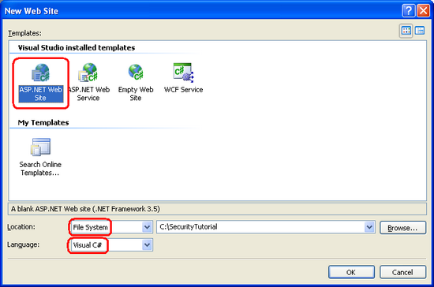
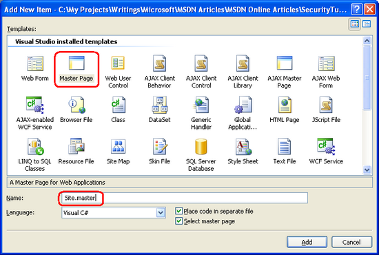
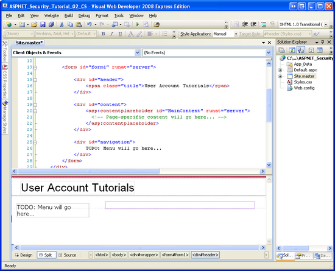
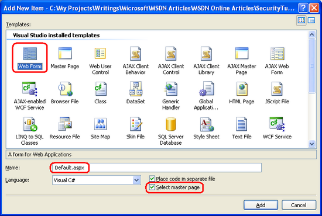
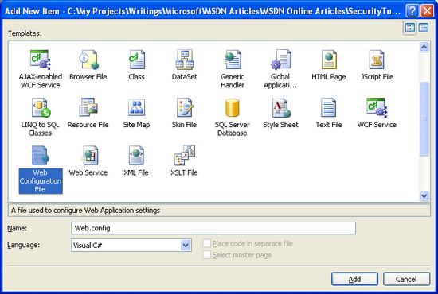
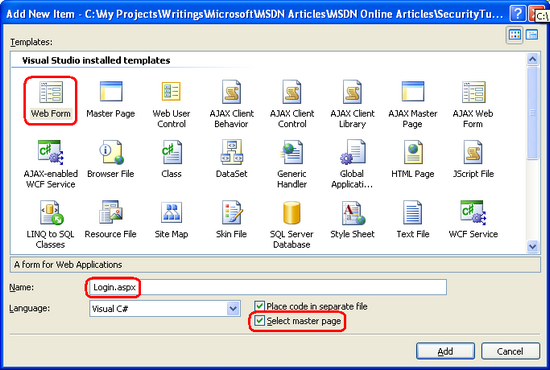
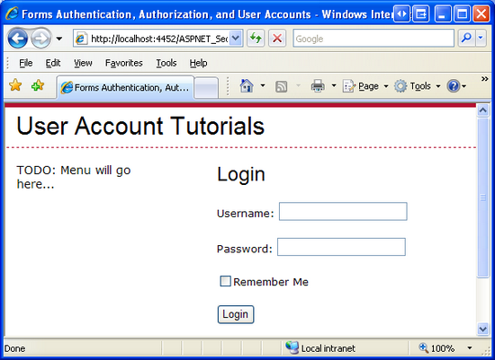

An Overview of Forms Authentication (C#)
====================
by [Scott Mitchell](https://twitter.com/ScottOnWriting)

[Download Code](http://download.microsoft.com/download/2/F/7/2F705A34-F9DE-4112-BBDE-60098089645E/ASPNET_Security_Tutorial_02_CS.zip) or [Download PDF](http://download.microsoft.com/download/2/F/7/2F705A34-F9DE-4112-BBDE-60098089645E/aspnet_tutorial02_FormsAuth_cs.pdf)

> In this tutorial we will turn from mere discussion to implementation; in particular, we will look at implementing forms authentication. The web application we start constructing in this tutorial will continue to be built upon in subsequent tutorials, as we move from simple forms authentication to membership and roles.
> 
> Please see this video for more information on this topic: [Using Basic Forms Authentication in ASP.NET](# "using-basic-forms-authentication-in-aspnet").

## Introduction

In the [preceding tutorial](security-basics-and-asp-net-support-cs.md) we discussed the various authentication, authorization, and user account options provided by ASP.NET. In this tutorial we will turn from mere discussion to implementation; in particular, we will look at implementing forms authentication. The web application we start constructing in this tutorial will continue to be built upon in subsequent tutorials, as we move from simple forms authentication to membership and roles.

This tutorial begins with an in-depth look at the forms authentication workflow, a topic we touched upon in the previous tutorial. Following that, we will create an ASP.NET website through which to demo the concepts of forms authentication. Next, we will configure the site to use forms authentication, create a simple login page, and see how to determine, in code, whether a user is authenticated and, if so, the username they logged in with.

Understanding the forms authentication workflow, enabling it in a web application, and creating the login and logoff pages are all vital steps in building an ASP.NET application that supports user accounts and authenticates users through a web page. Because of this – and because these tutorials build upon one another - I would encourage you to work through this tutorial in full before moving on to the next one even if you already have had experience configuring forms authentication in past projects.

## Understanding the Forms Authentication Workflow

When the ASP.NET runtime processes a request for an ASP.NET resource, such as an ASP.NET page or ASP.NET Web service, the request raises a number of events during its lifecycle. There are events raised at the very beginning and very end of the request, ones raised when the request is being authenticated and authorized, an event raised in the case of an unhandled exception, and so forth. To see a complete listing of the events, refer to the [HttpApplication object's events](https://msdn.microsoft.com/en-us/library/system.web.httpapplication_events.aspx).

*HTTP Modules* are managed classes whose code is executed in response to a particular event in the request lifecycle. ASP.NET ships with a number of HTTP Modules that perform essential tasks behind the scenes. Two built-in HTTP Modules that are especially relevant to our discussion are:

- **[`FormsAuthenticationModule`](https://msdn.microsoft.com/en-us/library/system.web.security.formsauthenticationmodule.aspx)** – authenticates the user by inspecting the forms authentication ticket, which is typically included in the user's cookies collection. If no forms authentication ticket is present, the user is anonymous.
- **[`UrlAuthorizationModule`](https://msdn.microsoft.com/en-us/library/system.web.security.urlauthorizationmodule.aspx)** – determines whether or not the current user is authorized to access the requested URL. This module determines the authority by consulting the authorization rules specified in the application's configuration files. ASP.NET also includes the [`FileAuthorizationModule`](https://msdn.microsoft.com/en-us/library/system.web.security.fileauthorizationmodule.aspx) that determines authority by consulting the requested file(s) ACLs.

The `FormsAuthenticationModule` attempts to authenticate the user prior to the `UrlAuthorizationModule` (and `FileAuthorizationModule`) executing. If the user making the request is not authorized to access the requested resource, the authorization module terminates the request and returns an [HTTP 401 Unauthorized](http://www.checkupdown.com/status/E401.html) status. In Windows authentication scenarios, the HTTP 401 status is returned to the browser. This status code causes the browser to prompt the user for their credentials via a modal dialog box. With forms authentication, however, the HTTP 401 Unauthorized status is never sent to the browser because the FormsAuthenticationModule detects this status and modifies it to redirect the user to the login page instead (via an [HTTP 302 Redirect](http://www.checkupdown.com/status/E302.html) status).

The login page's responsibility is to determine if the user's credentials are valid and, if so, to create a forms authentication ticket and redirect the user back to the page they were attempting to visit. The authentication ticket is included in subsequent requests to the pages on the website, which the `FormsAuthenticationModule` uses to identify the user.

**Figure 1**: The Forms Authentication Workflow

### Remembering the Authentication Ticket Across Page Visits

After logging in, the forms authentication ticket must be sent back to the web server on each request so that the user remains logged in as they browse the site. This is typically accomplished by placing the authentication ticket in the user's cookies collection. [Cookies](http://en.wikipedia.org/wiki/HTTP_cookie) are small text files that reside on the user's computer and are transmitted in the HTTP headers on each request to the website that created the cookie. Therefore, once the forms authentication ticket has been created and stored in the browser's cookies, each subsequent visit to that site sends the authentication ticket along with the request, thereby identifying the user.

One aspect of cookies is their expiration, which is the date and time at which the browser discards the cookie. When the forms authentication cookie expires, the user can no longer be authenticated and therefore become anonymous. When a user is visiting from a public terminal, chances are they want their authentication ticket to expire when they close their browser. When visiting from home, however, that same user might want the authentication ticket to be remembered across browser restarts so that they do not have to re-log in each time they visit the site. This decision is often made by the user in the form of a "Remember me" checkbox on the login page. In Step 3 we will examine how to implement a "Remember me" checkbox in the login page. The following tutorial addresses the authentication ticket timeout settings in detail.

> [!NOTE]
> It is possible that the user agent used to log on to the website may not support cookies. In such a case, ASP.NET can use cookieless forms authentication tickets. In this mode, the authentication ticket is encoded into the URL. We will look at when cookieless authentication tickets are used and how they are created and managed in the next tutorial.

### The Scope of Forms Authentication

The `FormsAuthenticationModule` is managed code that is part of the ASP.NET runtime. Prior to version 7 of Microsoft's [Internet Information Services (IIS)](https://www.iis.net/) web server, there was a distinct barrier between IIS's HTTP pipeline and the ASP.NET runtime's pipeline. In short, in IIS 6 and earlier, the `FormsAuthenticationModule` only executes when a request is delegated from IIS to the ASP.NET runtime. By default, IIS processes static content itself – like HTML pages and CSS and image files – and only hands off requests to the ASP.NET runtime when a page with an extension of .aspx, .asmx, or .ashx is requested.

IIS 7, however, allows for integrated IIS and ASP.NET pipelines. With a few configuration settings you can setup IIS 7 to invoke the FormsAuthenticationModule for *all* requests. Furthermore, with IIS 7 you can define URL authorization rules for files of any type. For more information, see [Changes Between IIS6 and IIS7 Security](https://www.iis.net/learn/get-started/whats-new-in-iis-7/changes-in-security-between-iis-60-and-iis-7-and-above), [Your Web Platform Security](https://www.iis.net/learn/get-started/whats-new-in-iis-7/iis7-and-above-security-improvements), and [Understanding IIS7 URL Authorization](https://www.iis.net/articles/view.aspx/IIS7/Managing-IIS7/Configuring-Security/URL-Authorization/Understanding-IIS7-URL-Authorization).

Long story short, in versions prior to IIS 7, you can only use forms authentication to protect resources handled by the ASP.NET runtime. Likewise, URL authorization rules are only applied to resources handled by the ASP.NET runtime. But with IIS 7 it is possible to integrate the FormsAuthenticationModule and UrlAuthorizationModule into IIS's HTTP pipeline, thereby extending this functionality to all requests.

## Step 1: Creating an ASP.NET Website for this Tutorial Series

In order to reach the widest possible audience, the ASP.NET website we will be building throughout this series will be created with Microsoft's free version of Visual Studio 2008, [Visual Web Developer 2008](https://www.microsoft.com/express/vwd/). We will implement the `SqlMembershipProvider` user store in a [Microsoft SQL Server 2005 Express Edition](https://msdn.microsoft.com/en-us/sql/Aa336346.aspx) database. If you are using Visual Studio 2005 or a different edition of Visual Studio 2008 or SQL Server, don't worry - the steps will be nearly identical and any non-trivial differences will be pointed out.

> [!NOTE]
> The demo web application used in each tutorial is available as a download. This downloadable application was created with Visual Web Developer 2008 targeted for the .NET Framework version 3.5. Since the application is targeted for .NET 3.5, its Web.config file includes additional, 3.5-specific configuration elements. Long story short, if you have yet to install .NET 3.5 on your computer then the downloadable web application will not work without first removing the 3.5-specific markup from Web.config.

Before we can configure forms authentication, we first need an ASP.NET website. Start by creating a new file system-based ASP.NET website. To accomplish this, launch Visual Web Developer and then go to the File menu and choose New Web Site, displaying the New Web Site dialog box. Choose the ASP.NET Web Site template, set the Location drop-down list to File System, choose a folder to place the web site, and set the language to C#. This will create a new web site with a Default.aspx ASP.NET page, an App\_Data folder, and a Web.config file.

> [!NOTE]
> Visual Studio supports two modes of project management: Web Site Projects and Web Application Projects. Web Site Projects lack a project file, whereas Web Application Projects mimic the project architecture in Visual Studio .NET 2002/2003 – they include a project file and compile the project's source code into a single assembly, which is placed in the /bin folder. Visual Studio 2005 initially only supported Web Site Projects, although the Web Application Project model was reintroduced with Service Pack 1; Visual Studio 2008 offers both project models. The Visual Web Developer 2005 and 2008 editions, however, only support Web Site Projects. I will be using the Web Site Project model. If you are using a non-Express edition and want to use the [Web Application Project model](https://msdn.microsoft.com/en-us/library/aa730880%28vs.80%29.aspx) instead, feel free to do so but be aware that there may be some discrepancies between what you see on your screen and the steps you must take versus the screen shots shown and instructions provided in these tutorials.

**Figure 2**: Create a New File System-Based Web Site ([Click to view full-size image](an-overview-of-forms-authentication-cs/_static/image4.png))

### Adding a Master Page

Next, add a new Master Page to the site in the root directory named Site.master. [Master pages](https://msdn.microsoft.com/en-us/library/wtxbf3hh.aspx) enable a page developer to define a site-wide template that can be applied to ASP.NET pages. The main benefit of master pages is that the site's overall appearance can be defined in a single location, thereby making it easy to update or tweak the site's layout.

**Figure 3**: Add a Master Page Named Site.master to the Website ([Click to view full-size image](an-overview-of-forms-authentication-cs/_static/image7.png))

Define the site-wide page layout here in the master page. You can use the Design view and add whatever Layout or Web controls you need, or you can manually add the markup by hand in the Source view. I structured my master page's layout to mimic the layout used in my *[Working with Data in ASP.NET 2.0](../../data-access/index.md)* tutorial series (see Figure 4). The master page uses [cascading style sheets](http://www.w3schools.com/css/default.asp) for positioning and styles with the CSS settings defined in the file Style.css (which is included in this tutorial's associated download). While you cannot tell from the markup shown below, the CSS rules are defined such that the navigation &lt;div&gt;'s content is absolutely positioned so that it appears on the left and has a fixed width of 200 pixels.

[!code-aspx[Main](an-overview-of-forms-authentication-cs/samples/sample1.aspx)]

A master page defines both the static page layout and the regions that can be edited by the ASP.NET pages that use the master page. These content editable regions are indicated by the `ContentPlaceHolder` control, which can be seen within the content &lt;div&gt;. Our master page has a single `ContentPlaceHolder` (MainContent), but master page's may have multiple ContentPlaceHolders.

With the markup entered above, switching to the Design view shows the master page's layout. Any ASP.NET pages that use this master page will have this uniform layout, with the ability to specify the markup for the `MainContent` region.

**Figure 4**: The Master Page, When Viewed Through the Design View ([Click to view full-size image](an-overview-of-forms-authentication-cs/_static/image10.png))

### Creating Content Pages

At this point we have a Default.aspx page in our website, but it does not use the master page we just created. While it is possible to manipulate the declarative markup of a web page to use a master page, if the page doesn't contain any content yet it is easier to just delete the page and re-add it to the project, specifying the master page to use. Therefore, start by deleting Default.aspx from the project.

Next, right-click on the project name in the Solution Explorer and choose to add a new Web Form named Default.aspx. This time, check the "Select master page" checkbox and choose the Site.master master page from the list.

**Figure 5**: Add a New Default.aspx Page Choosing to Select a Master Page ([Click to view full-size image](an-overview-of-forms-authentication-cs/_static/image13.png))

**Figure 6**: Use the Site.master Master Page

> [!NOTE]
> If you are using the Web Application Project Model the Add New Item dialog box does not include a "Select master page" checkbox. Instead, you need to add an item of type "Web Content Form." After choosing the "Web Content Form" option and clicking Add, Visual Studio will display the same Select a Master dialog box shown in Figure 6.

The new Default.aspx page's declarative markup includes just a @Page directive specifying the path to the master page file and a Content control for the master page's MainContent ContentPlaceHolder.

[!code-aspx[Main](an-overview-of-forms-authentication-cs/samples/sample2.aspx)]

For now, leave Default.aspx empty. We will return to it later in this tutorial to add content.

> [!NOTE]
> Our master page includes a section for a menu or some other navigation interface. We will create such an interface in a future tutorial.

## Step 2: Enabling Forms Authentication

With the ASP.NET website created, our next task is to enable forms authentication. The application's authentication configuration is specified through the [`<authentication>` element](https://msdn.microsoft.com/en-us/library/532aee0e.aspx) in Web.config. The `<authentication>` element contains a single attribute named mode that specifies the authentication model used by the application. This attribute can have one of the following four values:

- **Windows** – as discussed in the preceding tutorial, when an application uses Windows authentication it is the web server's responsibility to authenticate the visitor, and this is usually done through Basic, Digest, or Integrated Windows authentication.
- **Forms**– users are authenticated via a form on a web page.
- **Passport**– users are authenticated using Microsoft's Passport Network.
- **None**– no authentication model is used; all visitors are anonymous.

By default, ASP.NET applications use Windows authentication. To change the authentication type to forms authentication, then, we need to modify the `<authentication>` element's mode attribute to Forms.

If your project does not yet contain a Web.config file, add one now by right-clicking on the project name in the Solution Explorer, choosing Add New Item, and then adding a Web Configuration file.

**Figure 7**: If Your Project Does Not Yet Include Web.config, Add It Now ([Click to view full-size image](an-overview-of-forms-authentication-cs/_static/image17.png))

Next, locate the `<authentication>` element and update it to use forms authentication. After this change, your Web.config file's markup should look similar to the following:

[!code-xml[Main](an-overview-of-forms-authentication-cs/samples/sample3.xml)]

> [!NOTE]
> Since Web.config is an XML file, casing is important. Make sure that you set the mode attribute to Forms, with a capital "F". If you use a different casing, such as "forms", you'll receive a configuration error when visiting the site through a browser.

The `<authentication>` element may optionally include a `<forms>` child element that contains forms authentication-specific settings. For now, let's just use the default forms authentication settings. We will explore the `<forms>` child element in more detail in the next tutorial.

## Step 3: Building the Login Page

In order to support forms authentication our website needs a login page. As discussed in the "Understanding the Forms Authentication Workflow" section, the `FormsAuthenticationModule` will automatically redirect the user to the login page if they attempt to access a page that they are not authorized to view. There are also ASP.NET Web controls that will display a link to the login page to anonymous users. This begs the question, "What is the URL of the login page?"

By default, the forms authentication system expects the login page to be named Login.aspx and placed in the root directory of the web application. If you want to use a different login page URL, you can do so by specifying it in Web.config. We will see how to do this in the subsequent tutorial.

The login page has three responsibilities:

1. Provide an interface that allows the visitor to enter their credentials.
2. Determine if the submitted credentials are valid.
3. "Log in" the user by creating the forms authentication ticket.

### Creating the Login Page's User Interface

Let's get started with the first task. Add a new ASP.NET page to the site's root directory named Login.aspx and associate it with the Site.master master page.

**Figure 8**: Add a New ASP.NET Page Named Login.aspx ([Click to view full-size image](an-overview-of-forms-authentication-cs/_static/image20.png))

The typical login page interface consists of two textboxes – one for the user's name, one for their password – and a button to submit the form. Websites oftentimes include a "Remember me" checkbox that, if checked, persists the resulting authentication ticket across browser restarts.

Add two TextBoxes to Login.aspx and set their `ID` properties to UserName and Password, respectively. Also set Password's `TextMode` property to Password. Next, add a CheckBox control, setting its `ID` property to RememberMe and its `Text` property to "Remember Me". Following that, add a Button named LoginButton whose `Text` property is set to "Login". And finally, add a Label Web control and set its `ID` property to InvalidCredentialsMessage, its `Text` property to "Your username or password is invalid. Please try again.", its `ForeColor` property to Red, and its `Visible` property to False.

At this point your screen should look similar to the screen shot in Figure 9, and your page's declarative syntax should like the following:

[!code-aspx[Main](an-overview-of-forms-authentication-cs/samples/sample4.aspx)]

**Figure 9**: The Login Page Contains Two TextBoxes, a CheckBox, a Button, and a Label ([Click to view full-size image](an-overview-of-forms-authentication-cs/_static/image23.png))

Finally, create an event handler for the LoginButton's Click event. From the Designer, simply double-click the Button control to create this event handler.

### Determining If the Supplied Credentials are Valid

We now need to implement task 2 in the Button's Click event handler – determining whether the supplied credentials are valid. In order to do this there needs to be a user store that holds all of the users' credentials so that we can determine if the supplied credentials match up with any known credentials.

Prior to ASP.NET 2.0, developers were responsible for implementing both their own user stores and writing the code to validate the supplied credentials against the store. Most developers would implement the user store in a database, creating a table named Users with columns like UserName, Password, Email, LastLoginDate, and so forth. This table, then, would have one record per user account. Verifying a user's supplied credentials would involve querying the database for a matching username and then ensuring that the password in the database corresponded to the supplied password.

With ASP.NET 2.0, developers should use one of the Membership providers to manage the user store. In this tutorial series we will be using the SqlMembershipProvider, which uses a SQL Server database for the user store. When using the SqlMembershipProvider we need to implement a specific database schema that includes the tables, views, and stored procedures expected by the provider. We will examine how to implement this schema in the ***Creating the Membership Schema in SQL Server*** tutorial. With the Membership provider in place, validating the user's credentials is as simple as calling the [Membership class](https://msdn.microsoft.com/en-us/library/system.web.security.membership.aspx)'s [ValidateUser(*username*, *password*) method](https://msdn.microsoft.com/en-us/library/system.web.security.membership.validateuser.aspx), which returns a Boolean value indicating whether the validity of the *username* and *password* combination. Seeing as we have not yet implemented the SqlMembershipProvider's user store, we cannot use the Membership class's ValidateUser method at this time.

Rather than take the time to build our own custom Users database table (which would be obsolete once we implemented the SqlMembershipProvider), let's instead hard-code the valid credentials within the login page itself. In the LoginButton's Click event handler, add the following code:

[!code-csharp[Main](an-overview-of-forms-authentication-cs/samples/sample5.cs)]

As you can see, there are three valid user accounts – Scott, Jisun, and Sam – and all three have the same password ("password"). The code loops through the users and passwords arrays looking for a valid username and password match. If both the username and password are valid, we need to login the user and then redirect them to the appropriate page. If the credentials are invalid, then we display the InvalidCredentialsMessage Label.

When a user enters valid credentials, I mentioned that they are then redirected to the "appropriate page." What is the appropriate page, though? Recall that when a user visits a page they are not authorized to view, the FormsAuthenticationModule automatically redirects them to the login page. In doing so, it includes the requested URL in the querystring via the ReturnUrl parameter. That is, if a user attempted to visit ProtectedPage.aspx, and they were not authorized to do so, the FormsAuthenticationModule would redirect them to:

Login.aspx?ReturnUrl=ProtectedPage.aspx

Upon successfully logging in, the user should be redirected back to ProtectedPage.aspx. Alternatively, users may visit the login page on their own volition. In that case, after logging in the user they should be sent to the root folder's Default.aspx page.

### Logging In the User

Assuming that the supplied credentials are valid, we need to create a forms authentication ticket, thereby logging in the user to the site. The [FormsAuthentication class](https://msdn.microsoft.com/en-us/library/system.web.security.formsauthentication.aspx) in the [System.Web.Security namespace](https://msdn.microsoft.com/en-us/library/system.web.security.aspx) provides assorted methods for logging in and logging out users via the forms authentication system. While there are several methods in the FormsAuthentication class, the three we are interested in at this juncture are:

- [GetAuthCookie(*username*, *persistCookie*)](https://msdn.microsoft.com/en-us/library/system.web.security.formsauthentication.getauthcookie.aspx) – creates a forms authentication ticket for the supplied name *username*. Next, this method creates and returns an HttpCookie object that holds the contents of the authentication ticket. If *persistCookie* is true, a persistent cookie is created.
- [SetAuthCookie(*username*, *persistCookie*)](https://msdn.microsoft.com/en-us/library/system.web.security.formsauthentication.setauthcookie.aspx) – calls the GetAuthCookie(*username*, *persistCookie*) method to generate the forms authentication cookie. This method then adds the cookie returned by GetAuthCookie to the Cookies collection (assuming cookies-based forms authentication is being used; otherwise, this method calls an internal class that handles the cookieless ticket logic).
- [RedirectFromLoginPage(*username*, *persistCookie*)](https://msdn.microsoft.com/en-us/library/system.web.security.formsauthentication.redirectfromloginpage.aspx) – this method calls SetAuthCookie(*username*, *persistCookie*), and then redirects the user to the appropriate page.

GetAuthCookie is handy when you need to modify the authentication ticket before writing the cookie out to the Cookies collection. SetAuthCookie is useful if you want to create the forms authentication ticket and add it to the Cookies collection, but do not want to redirect the user to the appropriate page. Perhaps you want to keep them on the login page or send them to some alternate page.

Since we want to log in the user and redirect them to the appropriate page, let's use RedirectFromLoginPage. Update the LoginButton's Click event handler, replacing the two commented TODO lines with the following line of code:

FormsAuthentication.RedirectFromLoginPage(UserName.Text, RememberMe.Checked);

When creating the forms authentication ticket we use the UserName TextBox's Text property for the forms authentication ticket *username* parameter, and the checked state of the RememberMe CheckBox for the *persistCookie* parameter.

To test the login page, visit it in a browser. Start by entering invalid credentials, such as a username of "Nope" and a password of "wrong". Upon clicking the Login button a postback will occur and the InvalidCredentialsMessage Label will be displayed.

**Figure 10**: The InvalidCredentialsMessage Label is Displayed When Entering Invalid Credentials ([Click to view full-size image](an-overview-of-forms-authentication-cs/_static/image26.png))

Next, enter valid credentials and click the Login button. This time when the postback occurs a forms authentication ticket is created and you are automatically redirected back to Default.aspx. At this point you have logged in to the website, although there are no visual cues to indicate that you are currently logged in. In Step 4 we will see how to programmatically determine whether a user is logged in or not as well as how to identify the user visiting the page.

Step 5 examines techniques for logging a user out of the website.

### Securing the Login Page

When the user enters her credentials and submits the login page form, the credentials – including her password – are transmitted over the Internet to the web server in *plain text*. That means any hacker sniffing the network traffic can see the username and password. To prevent this, it is essential to encrypt the network traffic by using [Secure Socket Layers (SSL)](http://en.wikipedia.org/wiki/Secure_Sockets_Layer). This will ensure that the credentials (as well as the entire page's HTML markup) are encrypted from the moment they leave the browser until they are received by the web server.

Unless your website contains sensitive information, you will only need to use SSL on the login page and on other pages where the user's password would otherwise be sent over the wire in plain text. You do not need to worry about securing the forms authentication ticket since, by default, it is both encrypted and digitally signed (to prevent tampering). A more thorough discussion on forms authentication ticket security is presented in the following tutorial.

> [!NOTE]
> Many financial and medical websites are configured to use SSL on *all* pages accessible to authenticated users. If you are building such a website you can configure the forms authentication system so that the forms authentication ticket is only transmitted over a secure connection. We will look at the various forms authentication configuration options in the next tutorial, *[Forms Authentication Configuration and Advanced Topics](forms-authentication-configuration-and-advanced-topics-cs.md)*.

## Step 4: Detecting Authenticated Visitors and Determining Their Identity

At this point we have enabled forms authentication and created a rudimentary login page, but we have yet to examine how we can determine whether a user is authenticated or anonymous. In certain scenarios we may wish to display different data or information depending on whether an authenticated or anonymous user is visiting the page. Moreover, we oftentimes need to know the identity of the authenticated user.

Let's augment the existing Default.aspx page to illustrate these techniques. In Default.aspx add two Panel controls, one named AuthenticatedMessagePanel and another named AnonymousMessagePanel. Add a Label control named WelcomeBackMessage in the first Panel. In the second Panel add a HyperLink control, set its Text property to "Log In" and its NavigateUrl property to "~/Login.aspx". At this point the declarative markup for Default.aspx should look similar to the following:

[!code-aspx[Main](an-overview-of-forms-authentication-cs/samples/sample6.aspx)]

As you have probably guessed by now, the idea here is to display just the AuthenticatedMessagePanel to authenticated visitors and just the AnonymousMessagePanel to anonymous visitors. To accomplish this we need to set these Panels' Visible properties depending on whether the user is logged in or not.

The [Request.IsAuthenticated property](https://msdn.microsoft.com/en-us/library/system.web.httprequest.isauthenticated.aspx) returns a Boolean value indicating whether the request has been authenticated. Enter the following code into the Page\_Load event handler code:

[!code-csharp[Main](an-overview-of-forms-authentication-cs/samples/sample7.cs)]

With this code in place, visit Default.aspx through a browser. Assuming that you have yet to log in, you will see a link to the login page (see Figure 11). Click this link and log in to the site. As we saw in Step 3, after entering your credentials you will be returned to Default.aspx, but this time the page shows the "Welcome back!" message (see Figure 12).

**Figure 11**: When Visiting Anonymously, a Log In Link is Displayed

**Figure 12**: Authenticated Users are Shown the "Welcome back!" Message

We can determine the currently logged on user's identity via the [HttpContext object](https://msdn.microsoft.com/en-us/library/system.web.httpcontext.aspx)'s [User property](https://msdn.microsoft.com/en-us/library/system.web.httpcontext.user.aspx). The HttpContext object represents information about the current request, and is the home for such common ASP.NET objects as Response, Request, and Session, among others. The User property represents the security context of the current HTTP request and implements the [IPrincipal interface](https://msdn.microsoft.com/en-us/library/system.security.principal.iprincipal.aspx).

The User property is set by the FormsAuthenticationModule. Specifically, when the FormsAuthenticationModule finds a forms authentication ticket in the incoming request, it creates a new GenericPrincipal object and assigns it to the User property.

Principal objects (like GenericPrincipal) provide information on the user's identity and the roles to which they belong. The IPrincipal interface defines two members:

- [IsInRole(*roleName*)](https://msdn.microsoft.com/en-us/library/system.security.principal.iprincipal.isinrole.aspx) – a method that returns a Boolean value indicating if the principal belongs to the specified role.
- [Identity](https://msdn.microsoft.com/en-us/library/system.security.principal.iprincipal.identity.aspx) – a property that returns an object that implements the [IIdentity interface](https://msdn.microsoft.com/en-us/library/system.security.principal.iidentity.aspx). The IIdentity interface defines three properties: [AuthenticationType](https://msdn.microsoft.com/en-us/library/system.security.principal.iidentity.authenticationtype.aspx), [IsAuthenticated](https://msdn.microsoft.com/en-us/library/system.security.principal.iidentity.isauthenticated.aspx), and [Name](https://msdn.microsoft.com/en-us/library/system.security.principal.iidentity.name.aspx).

We can determine the name of the current visitor using the following code:

string currentUsersName = User.Identity.Name;

When using forms authentication, a [FormsIdentity object](https://msdn.microsoft.com/en-us/library/system.web.security.formsidentity.aspx) is created for the GenericPrincipal's Identity property. The FormsIdentity class always returns the string "Forms" for its AuthenticationType property and true for its IsAuthenticated property. The Name property returns the username specified when creating the forms authentication ticket. In addition to these three properties, FormsIdentity includes access to the underlying authentication ticket via its [Ticket property](https://msdn.microsoft.com/en-us/library/system.web.security.formsidentity.ticket.aspx). The Ticket property returns an object of type [FormsAuthenticationTicket](https://msdn.microsoft.com/en-us/library/system.web.security.formsauthenticationticket.aspx), which has properties like Expiration, IsPersistent, IssueDate, Name, and so on.

The important point to take away here is that the *username* parameter specified in the FormsAuthentication.GetAuthCookie(*username*, *persistCookie*), FormsAuthentication.SetAuthCookie(*username*, *persistCookie*), and FormsAuthentication.RedirectFromLoginPage(*username*, *persistCookie*) methods is the same value returned by User.Identity.Name. Moreover, the authentication ticket created by these methods is available by casting User.Identity to a FormsIdentity object and then accessing the Ticket property:

[!code-csharp[Main](an-overview-of-forms-authentication-cs/samples/sample8.cs)]

Let's provide a more personalized message in Default.aspx. Update the Page\_Load event handler so that the WelcomeBackMessage Label's Text property is assigned the string "Welcome back, *username*!"

WelcomeBackMessage.Text = "Welcome back, " + User.Identity.Name + "!";

Figure 13 shows the effect of this modification (when logging in as user Scott).

**Figure 13**: The Welcome Message Includes the Currently Logged In User's Name

### Using the LoginView and LoginName Controls

Displaying different content to authenticated and anonymous users is a common requirement; so is displaying the name of the currently logged on user. For that reason, ASP.NET includes two Web controls that provide the same functionality shown in Figure 13, but without the need to write a single line of code.

The [LoginView control](https://msdn.microsoft.com/en-us/library/system.web.ui.webcontrols.loginview.aspx) is a template-based Web control that makes it easy to display different data to authenticated and anonymous users. The LoginView includes two predefined templates:

- AnonymousTemplate – any markup added to this template is only displayed to anonymous visitors.
- LoggedInTemplate – this template's markup is shown only to authenticated users.

Let's add the LoginView control to our site's master page, Site.master. Rather than adding just the LoginView control, though, let's add both a new ContentPlaceHolder control and then put the LoginView control within that new ContentPlaceHolder. The rationale for this decision will become apparent shortly.

> [!NOTE]
> In addition to the AnonymousTemplate and LoggedInTemplate, the LoginView control can include role-specific templates. Role-specific templates show markup only to those users that belong to a specified role. We will examine the role-based features of the LoginView control in a future tutorial.

Start by adding a ContentPlaceHolder named LoginContent into the master page within the navigation &lt;div&gt; element. You can simply drag a ContentPlaceHolder control from the Toolbox onto the Source view, placing the resulting markup right above the "TODO: Menu will go here…" text.

[!code-aspx[Main](an-overview-of-forms-authentication-cs/samples/sample9.aspx)]

Next, add a LoginView control within the LoginContent ContentPlaceHolder. Content placed into the master page's ContentPlaceHolder controls are considered *default content* for the ContentPlaceHolder. That is, ASP.NET pages that use this master page can specify their own content for each ContentPlaceHolder or use the master page's default content.

The LoginView and other login-related controls are located in the Toolbox's Login tab.

**Figure 14**: The LoginView Control in the Toolbox

Next, add two &lt;br /&gt; elements immediately after the LoginView control, but still within the ContentPlaceHolder. At this point, the navigation &lt;div&gt; element's markup should look like the following:

[!code-aspx[Main](an-overview-of-forms-authentication-cs/samples/sample10.aspx)]

The LoginView's templates can be defined from the Designer or the declarative markup. From Visual Studio's Designer, expand the LoginView's smart tag, which lists the configured templates in a drop-down list. Type in the text "Hello, stranger" into the AnonymousTemplate; next, add a HyperLink control and set its Text and NavigateUrl properties to "Log In" and "~/Login.aspx", respectively.

After configuring the AnonymousTemplate, switch to the LoggedInTemplate and enter the text, "Welcome back, ". Then drag a LoginName control from the Toolbox into the LoggedInTemplate, placing it immediately after the "Welcome back, " text. The [LoginName control](https://msdn.microsoft.com/en-us/library/system.web.ui.webcontrols.loginname.aspx), as its name implies, displays the name of the currently logged in user. Internally, the LoginName control simply outputs the User.Identity.Name property

After making these additions to the LoginView's templates, the markup should look similar to the following:

[!code-aspx[Main](an-overview-of-forms-authentication-cs/samples/sample11.aspx)]

With this addition to the Site.master master page, each page in our website will display a different message depending on whether the user is authenticated. Figure 15 shows the Default.aspx page when visited through a browser by user Jisun. The "Welcome back, Jisun" message is repeated twice: once in the master page's navigation section on the left (via the LoginView control we just added) and once in the Default.aspx's content area (via Panel controls and programmatic logic).

**Figure 15**: The LoginView Control Displays "Welcome back, Jisun."

Because we added the LoginView to the master page, it can appear in every page on our site. However, there may be web pages where we don't want to show this message. One such page is the login page, since a link to the login page seems out of place there. Since we placed the LoginView control in a ContentPlaceHolder in the master page, we can override this default markup in our content page. Open Login.aspx and go to the Designer. Since we have not explicitly defined a Content control in Login.aspx for the LoginContent ContentPlaceHolder in the master page, the login page will show the master page's default markup for this ContentPlaceHolder. You can see this through the Designer – the LoginContent ContentPlaceHolder shows the default markup (the LoginView control).

**Figure 16**: The Login Page Shows the Default Content for the Master Page's LoginContent ContentPlaceHolder ([Click to view full-size image](an-overview-of-forms-authentication-cs/_static/image34.png))

To override the default markup for the LoginContent ContentPlaceHolder, simply right-click on the region in the Designer and choose the Create Custom Content option from the context menu. (When using Visual Studio 2008 the ContentPlaceHolder includes a smart tag that, when selected, offers the same option.) This adds a new Content control to the page's markup and thereby allows us to define custom content for this page. You could add a custom message here, such as "Please log in…", but let's just leave this blank.

> [!NOTE]
> In Visual Studio 2005, creating custom content creates an empty Content control in the ASP.NET page. In Visual Studio 2008, however, creating custom content copies the master page's default content into the newly created Content control. If you are using Visual Studio 2008, then, after creating the new Content control make sure to clear out the content copied over from the master page.

Figure 17 shows the Login.aspx page when visited from a browser after making this change. Note that there is no "Hello, stranger" or "Welcome back, *username*" message in the left navigation &lt;div&gt; as there is when visiting Default.aspx.

**Figure 17**: The Login Page Hides the Default LoginContent ContentPlaceHolder's Markup ([Click to view full-size image](an-overview-of-forms-authentication-cs/_static/image37.png))

## Step 5: Logging Out

In Step 3 we looked at building a login page to log a user in to the site, but we have yet to see how to log a user out. In addition to methods for logging a user in, the FormsAuthentication class also provides a [SignOut method](https://msdn.microsoft.com/en-us/library/system.web.security.formsauthentication.signout.aspx). The SignOut method simply destroys the forms authentication ticket, thereby logging the user out of the site.

Offering a log out link is such a common feature that ASP.NET includes a control specifically designed to log a user out. The [LoginStatus control](https://msdn.microsoft.com/en-us/library/system.web.ui.webcontrols.loginstatus.aspx) displays either a "Login" LinkButton or a "Logout" LinkButton, depending on the user's authentication status. A "Login" LinkButton is rendered for anonymous users, whereas a "Logout" LinkButton is displayed to authenticated users. The text for the "Login" and "Logout" LinkButtons can be configured via the LoginStatus's LoginText and LogoutText properties.

Clicking the "Login" LinkButton causes a postback, from which a redirect is issued to the login page. Clicking the "Logout" LinkButton causes the LoginStatus control to invoke the FormsAuthentication.SignOff method and then redirects the user to a page. The page the logged off user is redirected to depends on the LogoutAction property, which can be assigned to one of the three following values:

- Refresh – the default; redirects the user to the page they were just visiting. If the page they were just visiting does not allow anonymous users, then the FormsAuthenticationModule will automatically redirect the user to the login page.

You may be curious as to why a redirect is performed here. If the user wants to remain on the same page, why the need for the explicit redirect? The reason is because when the "Logoff" LinkButton is clicked, the user still has the forms authentication ticket in their cookies collection. Consequently, the postback request is an authenticated request. The LoginStatus control calls the SignOut method, but that happens after the FormsAuthenticationModule has authenticated the user. Therefore, an explicit redirect causes the browser to re-request the page. By the time the browser re-requests the page, the forms authentication ticket has been removed and therefore the incoming request is anonymous.

- Redirect – the user is redirected to the URL specified by the LoginStatus's LogoutPageUrl property.
- RedirectToLoginPage – the user is redirected to the login page.

Let's add a LoginStatus control to the master page and configure it to use the Redirect option to send the user to a page that displays a message confirming that they have been signed out. Start by creating a page in the root directory named Logout.aspx. Don't forget to associate this page with the Site.master master page. Next, enter a message in the page's markup explaining to the user that they have been logged out.

Next, return to the Site.master master page and add a LoginStatus control beneath the LoginView in the LoginContent ContentPlaceHolder. Set the LoginStatus control's LogoutAction property to Redirect and its LogoutPageUrl property to "~/Logout.aspx".

[!code-aspx[Main](an-overview-of-forms-authentication-cs/samples/sample12.aspx)]

Since the LoginStatus is outside of the LoginView control, it will appear for both anonymous and authenticated users, but that's OK because the LoginStatus will correctly display a "Login" or "Logout" LinkButton. With the addition of the LoginStatus control, the "Log In" HyperLink in the AnonymousTemplate is superfluous, so remove it.

Figure 18 shows Default.aspx when Jisun visits. Note that the left column displays the message, "Welcome back, Jisun" along with a link to log out. Clicking the log out LinkButton causes a postback, signs Jisun out of the system, and then redirects her to Logout.aspx. As Figure 19 shows, by the time Jisun reaches Logout.aspx she has already been signed out and is therefore anonymous. Consequently, the left column shows the text "Welcome, stranger" and a link to the login page.

**Figure 18**: Default.aspx Shows "Welcome Back, Jisun" Along with a "Logout" LinkButton ([Click to view full-size image](an-overview-of-forms-authentication-cs/_static/image40.png))

**Figure 19**: Logout.aspx Shows "Welcome, stranger" Along with a "Login" LinkButton ([Click to view full-size image](an-overview-of-forms-authentication-cs/_static/image43.png))

> [!NOTE]
> I encourage you to customize the Logout.aspx page to hide the master page's LoginContent ContentPlaceHolder (like we did for Login.aspx in Step 4). The reason is because the "Login" LinkButton rendered by the LoginStatus control (the one beneath "Hello, stranger") sends the user to the login page passing the current URL in the ReturnUrl querystring parameter. In short, if a user who has logged out clicks this LoginStatus's "Login" LinkButton, and then logs in, they will be redirected back to Logout.aspx, which could easily confuse the user.

## Summary

In this tutorial we started with an examination of the forms authentication workflow and then turned to implementing forms authentication in an ASP.NET application. Forms authentication is powered by the FormsAuthenticationModule, which has two responsibilities: identifying users based on their forms authentication ticket, and redirecting unauthorized users to the login page.

The .NET Framework's FormsAuthentication class includes methods for creating, inspecting, and removing forms authentication tickets. The Request.IsAuthenticated property and User object provide additional programmatic support for determining whether a request is authenticated and information about the user's identity. There are also the LoginView, LoginStatus, and LoginName Web controls, which give developers a quick, code-free way for performing many common login-related tasks. We will examine these and other login-related Web controls in greater detail in future tutorials.

This tutorial provided a cursory overview of forms authentication. We did not examine the assorted configuration options, look at how cookieless forms authentication tickets work, or explore how ASP.NET protects the contents of the forms authentication ticket. We will discuss these topics and more in the [next tutorial](forms-authentication-configuration-and-advanced-topics-cs.md).

Happy Programming!

### Further Reading

For more information on the topics discussed in this tutorial, refer to the following resources:

- [Changes Between IIS6 and IIS7 Security](https://www.iis.net/articles/view.aspx/IIS7/Managing-IIS7/Configuring-Security/Changes-between-IIS6-and-IIS7-Security)
- [Login ASP.NET Controls](https://msdn.microsoft.com/en-us/library/d51ttbhx.aspx)
- [Professional ASP.NET 2.0 Security, Membership, and Role Management](http://www.wrox.com/WileyCDA/WroxTitle/productCd-0764596985.html) (ISBN: 978-0-7645-9698-8)
- [The `<authentication>` Element](https://msdn.microsoft.com/en-us/library/532aee0e.aspx)
- [The `<forms>` Element for `<authentication>`](https://msdn.microsoft.com/en-us/library/1d3t3c61.aspx)

### Video Training on Topics Contained in this Tutorial

- [Using Basic Forms Authentication in ASP.NET](../../../videos/authentication/using-basic-forms-authentication-in-aspnet.md)

## About the Author

[Scott Mitchell](http://www.4guysfromrolla.com/ScottMitchell.shtml), author of seven ASP/ASP.NET books and founder of [4GuysFromRolla.com](http://www.4guysfromrolla.com), has been working with Microsoft Web technologies since 1998. Scott works as an independent consultant, trainer, and writer. His latest book is [*Sams Teach Yourself ASP.NET 2.0 in 24 Hours*](https://www.amazon.com/exec/obidos/ASIN/0672327384/4guysfromrollaco). He can be reached at [mitchell@4GuysFromRolla.com.](mailto:mitchell@4GuysFromRolla.com) or via his blog, which can be found at [http://ScottOnWriting.NET](http://ScottOnWriting.NET).

## Special Thanks To…

This tutorial series was reviewed by many helpful reviewers. Lead reviewer for this tutorial was This tutorial series was reviewed by many helpful reviewers. Lead reviewers for this tutorial include Alicja Maziarz, John Suru, and Teresa Murphy. Interested in reviewing my upcoming MSDN articles? If so, drop me a line at [mitchell@4GuysFromRolla.com.](mailto:mitchell@4GuysFromRolla.com)

>[!div class="step-by-step"]
[Previous](security-basics-and-asp-net-support-cs.md)
[Next](forms-authentication-configuration-and-advanced-topics-cs.md)