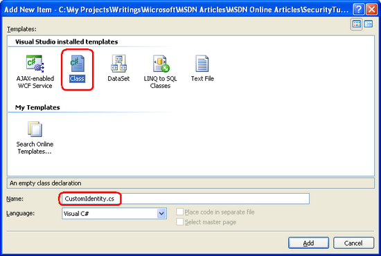
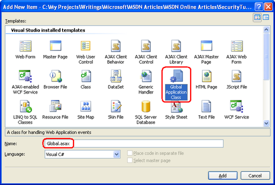

Forms Authentication Configuration and Advanced Topics (C#)
====================
by [Scott Mitchell](https://twitter.com/ScottOnWriting)

[Download Code](http://download.microsoft.com/download/2/F/7/2F705A34-F9DE-4112-BBDE-60098089645E/ASPNET_Security_Tutorial_03_CS.zip) or [Download PDF](http://download.microsoft.com/download/2/F/7/2F705A34-F9DE-4112-BBDE-60098089645E/aspnet_tutorial03_AuthAdvanced_cs.pdf)

> In this tutorial we will examine the various forms authentication settings and see how to modify them through the forms element. This will entail a detailed look at customizing the forms authentication ticket's timeout value, using a login page with a custom URL (like SignIn.aspx instead of Login.aspx), and cookieless forms authentication tickets.

## Introduction

In the [previous tutorial](an-overview-of-forms-authentication-cs.md) we looked at the steps necessary for implementing forms authentication in an ASP.NET application, from specifying configuration settings in Web.config to creating a log in page to displaying different content for authenticated and anonymous users. Recall that we configured the website to use forms authentication by setting the mode attribute of the &lt;authentication&gt; element to Forms. The &lt;authentication&gt; element may optionally include a &lt;forms&gt; child element, through which an assortment of forms authentication settings may be specified.

In this tutorial we will examine the various forms authentication settings and see how to modify them through the &lt;forms&gt; element. This will entail a detailed look at customizing the forms authentication ticket's timeout value, using a login page with a custom URL (like SignIn.aspx instead of Login.aspx), and cookieless forms authentication tickets. We will also examine the makeup of the forms authentication ticket more closely and see the precautions ASP.NET takes to ensure that the ticket's data is secure from inspection and tampering. Finally, we will look at how to store extra user data in the forms authentication ticket and how to model this data through a custom principal object.

## Step 1: Examining the &lt;forms&gt; Configuration Settings

The forms authentication system in ASP.NET offers a number of configuration settings that can be customized on an application-by-application basis. This includes settings like: the lifetime of the forms authentication ticket; what sort of protection is applied to the ticket; under what conditions cookieless authentication tickets are used; the path to the login page; and other information. To modify the default values, add a [&lt;forms&gt; element](https://msdn.microsoft.com/en-us/library/1d3t3c61.aspx) as a child of the [&lt;authentication&gt; element](https://msdn.microsoft.com/en-us/library/532aee0e.aspx), specifying those property values you want to customize as XML attributes like so:

[!code-xml[Main](forms-authentication-configuration-and-advanced-topics-cs/samples/sample1.xml)]

Table 1 summarizes the properties that can be customized through the &lt;forms&gt; element. Since Web.config is an XML file, the attribute names in the left column are case-sensitive.

| **Attribute** | **Description** |
| --- | --- |
| cookieless | This attribute specifies under what conditions the authentication ticket is stored in a cookie versus being embedded in the URL. Allowable values are: UseCookies; UseUri; AutoDetect; and UseDeviceProfile (the default). Step 2 examines this setting in more detail. |
| defaultUrl | Indicates the URL that users are redirected to after signing in from the login page if there is no RedirectUrl value specified in the querystring. The default value is default.aspx. |
| domain | When using cookie-based authentication tickets, this setting specifies the cookie's domain value. The default value is an empty string, which causes the browser to use the domain from which it was issued (such as www.yourdomain.com). In this case, the cookie will **not** be sent when making requests to subdomains, such as admin.yourdomain.com. If you want the cookie to be passed to all subdomains you need to customize the domain attribute setting it to yourdomain.com. |
| enableCrossAppRedirects | A Boolean value indicating whether authenticated users are remembered when redirected to URLs in other web applications on the same server. The default is false. |
| loginUrl | The URL of the login page. The default value is login.aspx. |
| name | When using cookie-based authentication tickets, the name of the cookie. The default is .ASPXAUTH. |
| path | When using cookie-based authentication tickets, this setting specifies the cookie's path attribute. The path attribute enables a developer to limit the scope of a cookie to a particular directory hierarchy. The default value is /, which informs the browser to send the authentication ticket cookie to any request made to the domain. |
| protection | Indicates what techniques are used to protect the forms authentication ticket. The allowable values are: All (the default); Encryption; None; and Validation. These settings are discussed in detail in Step 3. |
| requireSSL | A Boolean value that indicates whether an SSL connection is required to transmit the authentication cookie. The default value is false. |
| slidingExpiration | A Boolean value that indicates whether the authentication cookie's timeout is reset each time the user visits the site during a single session. The default value is true. The authentication ticket timeout policy is discussed in more detail in the Specifying the Ticket's Timeout Value section. |
| timeout | Specifies the time, in minutes, after which the authentication ticket cookie expires. The default value is 30. The authentication ticket timeout policy is discussed in more detail in the Specifying the Ticket's Timeout Value section. |

**Table 1**: A Summary of the &lt;forms&gt; Element's Attributes

In ASP.NET 2.0 and beyond, the default forms authentication values are hard-coded in the FormsAuthenticationConfiguration class in the .NET Framework. Any modifications must be applied on an application-by-application basis in the Web.config file. This differs from ASP.NET 1.x, where the default forms authentication values were stored in the machine.config file (and could therefore be modified via editing machine.config). While on the topic of ASP.NET 1.x, it is worthwhile to mention that a number of the forms authentication system settings have different default values in ASP.NET 2.0 and beyond than in ASP.NET 1.x. If you are migrating your application from an ASP.NET 1.x environment, it is important to be aware of these differences. Consult [the &lt;forms&gt; element technical documentation](https://msdn.microsoft.com/en-us/library/1d3t3c61.aspx) for a list of the differences.

> [!NOTE]
> Several forms authentication settings, such as the timeout, domain, and path, specify details for the resulting forms authentication ticket cookie. For more information on cookies, how they work, and their various properties, read [this Cookies tutorial](http://www.quirksmode.org/js/cookies.html).

### Specifying the Ticket's Timeout Value

The forms authentication ticket is a token that represents an identity. With cookie-based authentication tickets, this token is held in the form of a cookie and sent to the web server on each request. Possession of the token, in essence, declares, I am *username*, I have already logged in, and is used so that a user's identity can be remembered across page visits.

The forms authentication ticket not only includes the user's identity, but also contains information to help ensure the integrity and security of the token. After all, we don't want a nefarious user to be able to create a counterfeit token, or to modify a legit token in some underhanded way.

One such bit of information included in the ticket is an *expiry*, which is the date and time the ticket is no longer valid. Each time the FormsAuthenticationModule inspects an authentication ticket, it ensures that the ticket's expiry has not yet passed. If it has, it disregards the ticket and identifies the user as being anonymous. This safeguard helps protect against replay attacks. Without an expiry, if a hacker was able to get her hands on a user's valid authentication ticket - perhaps by gaining physical access to their computer and rooting through their cookies - they could send a request to the server with this stolen authentication ticket and gain entry. While the expiry doesn't prevent this scenario, it does limit the window during which such an attack can succeed.

> [!NOTE]
> Step 3 details additional techniques used by the forms authentication system to protect the authentication ticket.

When creating the authentication ticket, the forms authentication system determines its expiry by consulting the timeout setting. As noted in Table 1, the timeout setting defaults to 30 minutes, meaning that when the forms authentication ticket is created its expiry is set to a date and time 30 minutes in the future.

The expiry defines an absolute time in the future when the forms authentication ticket expires. But usually developers want to implement a sliding expiry, one that is reset every time the user revisits the site. This behavior is determined by the slidingExpiration settings. If set to true (the default), each time the FormsAuthenticationModule authenticates a user, it updates the ticket's expiry. If set to false, the expiry is not updated on each request, thereby causing the ticket to expire exactly timeout number of minutes past when the ticket was first created.

> [!NOTE]
> The expiry stored in the authentication ticket is an absolute date and time value, like August 2, 2008 11:34 AM. Moreover, the date and time are relative to the web server's local time. This design decision can have some interesting side effects around Daylight Saving Time (DST), which is when clocks in the United States are moved ahead one hour (assuming the web server is hosted in a locale where Daylight Saving Time is observed). Consider what would happen for an ASP.NET website with a 30 minute expiry near the time that DST begins (which is at 2:00 AM). Imagine a visitor signs on to the site on March 11, 2008 at 1:55 AM. This would generate a forms authentication ticket that expires at March 11, 2008 at 2:25 AM (30 minutes in the future). However, once 2:00 AM rolls around, the clock jumps to 3:00 AM because of DST. When the user loads a new page six minutes after signing in (at 3:01 AM), the FormsAuthenticationModule notes that the ticket has expired and redirects the user to the login page. For a more thorough discussion on this and other authentication ticket timeout oddities, as well as workarounds, pick up a copy of Stefan Schackow's *Professional ASP.NET 2.0 Security, Membership, and Role Management* (ISBN: 978-0-7645-9698-8).

Figure 1 illustrates the workflow when slidingExpiration is set to false and timeout is set to 30. Note that the authentication ticket generated at login contains the expiration date, and this value is not updated on subsequent requests. If the FormsAuthenticationModule finds that the ticket has expired, it discards it and treats the request as anonymous.

**Figure 01**: A Graphical Representation of the Forms Authentication Ticket's Expiry When slidingExpiration is false([Click to view full-size image](forms-authentication-configuration-and-advanced-topics-cs/_static/image3.png))

Figure 2 shows the workflow when slidingExpiration is set to true and timeout is set to 30. When an authenticated request is received (with a non-expired ticket) its expiry is updated to timeout number of minutes in the future.

**Figure 02**: A Graphical Representation of the Forms Authentication Ticket's When slidingExpiration is true  ([Click to view full-size image](forms-authentication-configuration-and-advanced-topics-cs/_static/image6.png))

When using cookie-based authentication tickets (the default), this discussion becomes a little more confusing because cookies can also have their own expiries specified. A cookie's expiry (or lack thereof) instructs the browser when the cookie should be destroyed. If the cookie lacks an expiry, it is destroyed when the browser shuts down. If an expiry is present, however, the cookie remains stored on the user's computer until the date and time specified in the expiry has passed. When a cookie is destroyed by the browser, it is no longer sent to the web server. Therefore, the destruction of a cookie is analogous to the user logging out of the site.

> [!NOTE]
> Of course, a user may proactively remove any cookies stored on their computer. In Internet Explorer 7, you would go to Tools, Options, and click the Delete button in the Browsing history section. From there, click the Delete cookies button.

The forms authentication system creates session-based or expiry-based cookies depending on the value passed in to the *persistCookie* parameter. Recall that the FormsAuthentication class's GetAuthCookie, SetAuthCookie, and RedirectFromLoginPage methods take in two input parameters: *username* and *persistCookie*. The login page we created in the preceding tutorial included a Remember me CheckBox, which determined whether a persistent cookie was created. Persistent cookies are expiry-based; non-persistent cookies are session-based.

The timeout and slidingExpiration concepts already discussed apply the same to both session- and expiry-based cookies. There is only one minor difference in execution: when using expiry-based cookies with slidingTimeout set to true, the cookie's expiry is only updated when more than half of the specified time has elapsed.

Let's update our website's authentication ticket timeout policies so that tickets timeout after one hour (60 minutes), using a sliding expiration. To effect this change, update the Web.config file, adding a &lt;forms&gt; element to the &lt;authentication&gt; element with the following markup:

[!code-xml[Main](forms-authentication-configuration-and-advanced-topics-cs/samples/sample2.xml)]

### Using an Login Page URL Other than Login.aspx

Since the FormsAuthenticationModule automatically redirects unauthorized users to the login page, it needs to know the login page's URL. This URL is specified by the loginUrl attribute in the &lt;forms&gt; element and defaults to login.aspx. If you are porting over an existing website, you may already have a login page with a different URL, one that has already been bookmarked and indexed by search engines. Rather than renaming your existing login page to login.aspx and breaking links and users' bookmarks, you can instead modify the loginUrl attribute to point to your login page.

For example, if your login page was named SignIn.aspx and was located in the Users directory, you could point the loginUrl configuration setting to ~/Users/SignIn.aspx like so:

[!code-xml[Main](forms-authentication-configuration-and-advanced-topics-cs/samples/sample3.xml)]

Since our current application already has a login page named Login.aspx, there's no need to specify a custom value in the &lt;forms&gt; element.

## Step 2: Using Cookieless Forms Authentication Tickets

By default the forms authentication system determines whether to store its authentication tickets in the cookies collection or embed them in the URL based on the user agent visiting the site. All mainstream desktop browsers like Internet Explorer, Firefox, Opera, and Safari, support cookies, but not all mobile devices do.

The cookie policy used by the forms authentication system depends on the cookieless setting in the &lt;forms&gt; element, which can be assigned one of four values:

- UseCookies - specifies that cookie-based authentication tickets will always be used.
- UseUri - indicates that cookie-based authentication tickets will never be used.
- AutoDetect - if the device profile does not support cookies, cookie-based authentication tickets are not used; if the device profile supports cookies, a probing mechanism is used to determine if cookies are enabled.
- UseDeviceProfile - the default; uses cookie-based authentication tickets only if the device profile supports cookies. No probing mechanism is used.

The AutoDetect and UseDeviceProfile settings rely on a *device profile* in ascertaining whether to use cookie-based or cookieless authentication tickets. ASP.NET maintains a database of various devices and their capabilities, such as whether they support cookies, what version of JavaScript they support, and so on. Each time a device requests a web page from a web server it sends along a *user-agent* HTTP header that identifies the device type. ASP.NET automatically matches the supplied user-agent string with the corresponding profile specified in its database.

> [!NOTE]
> This database of device capabilities is stored in a number of XML files that adhere to the [Browser Definition File schema](https://msdn.microsoft.com/en-us/library/ms228122.aspx). The default device profile files are located in %WINDIR%\Microsoft.Net\Framework\v2.0.50727\CONFIG\Browsers. You can also add custom files to your application's App\_Browsers folder. For more information, see [How To: Detect Browser Types in ASP.NET Web Pages](https://msdn.microsoft.com/en-us/library/3yekbd5b.aspx).

Because the default setting is UseDeviceProfile, cookieless forms authentication tickets will be used when the site is visited by a device whose profile reports that it does not support cookies.

### Encoding the Authentication Ticket in the URL

Cookies are a natural medium for including information from the browser in each request to a particular website, which is why the default forms authentication settings use cookies if the visiting device supports them. If cookies are not supported, an alternate means for passing the authentication ticket from the client to the server must be employed. A common workaround used in cookieless environments is to encode the cookie data in the URL.

The best way to see how such information can be embedded within the URL is to force the site to use cookieless authentication tickets. This can be accomplished by setting the cookieless configuration setting to UseUri:

[!code-xml[Main](forms-authentication-configuration-and-advanced-topics-cs/samples/sample4.xml)]

Once you have made this change, visit the site through a browser. When visiting as an anonymous user, the URLs will look exactly like they did before. For example, when visiting Default.aspx page my browser's address bar shows the following URL:

`http://localhost:2448/ASPNET\_Security\_Tutorial\_03\_CS/default.aspx`

However, upon logging in, the forms authentication ticket is embedded into the URL. For example, after visiting the login page and logging in as Sam, I am returned to the Default.aspx page, but the URL this time is:

`http://localhost:2448/ASPNET\_Security\_Tutorial\_03\_CS/(F(jaIOIDTJxIr12xYS-VVgkqKCVAuIoW30Bu0diWi6flQC-FyMaLXJfow\_Vd9GZkB2Cv-rfezq0gKadKX0YPZCkA2))/default.aspx`

The forms authentication ticket has been embedded within the URL. The string (F(jaIOIDTJxIr12xYS-VVgkqKCVAuIoW30Bu0diWi6flQC-FyMaLXJfow\_Vd9GZkB2Cv-rfezq0gKadKX0YPZCkA2) represents the hex-encoded authentication ticket information, and is the same data that is usually stored within a cookie.

In order for cookieless authentication tickets to work, the system must encode all URLs on the page to include the authentication ticket data, otherwise the authentication ticket will be lost when the user clicks on a link. Thankfully, this embedding logic is performed automatically. To demonstrate this functionality, open the Default.aspx page and add a HyperLink control, setting its Text and NavigateUrl properties to Test Link and SomePage.aspx, respectively. It doesn't matter that there really isn't a page in our project named SomePage.aspx.

Save the changes to Default.aspx and then visit it through a browser. Log on to the site so that the forms authentication ticket is embedded in the URL. Next, from Default.aspx, click the Test Link link. What happened? If no page named SomePage.aspx exists, then a 404 error occurred, but that's not what's important here. Instead, focus on the Address bar in your browser. Note that it includes the forms authentication ticket in the URL!

`http://localhost:2448/ASPNET\_Security\_Tutorial\_03\_CS/(F(jaIOIDTJxIr12xYS-VVgkqKCVAuIoW30Bu0diWi6flQC-FyMaLXJfow\_Vd9GZkB2Cv-rfezq0gKadKX0YPZCkA2))/SomePage.aspx`

The URL SomePage.aspx in the link was automatically converted into a URL that included the authentication ticket - we didn't have to write a lick of code! The form authentication ticket will automatically be embedded in the URL for any hyperlinks that do not start with http:// or /. It doesn't matter if the hyperlink appears in a call to Response.Redirect, in a HyperLink control, or in an anchor HTML element (i.e., &lt;a href="..."&gt;...&lt;/a&gt;). As long as the URL isn't something like http://www.someserver.com/SomePage.aspx or /SomePage.aspx, the forms authentication ticket will be embedded for us.

> [!NOTE]
> Cookieless forms authentication tickets adhere to the same timeout policies as cookie-based authentication tickets. However, cookieless authentication tickets are more prone to replay attacks since the authentication ticket is embedded directly in the URL. Imagine a user who visits a website, logs in, and then pastes the URL in an email to a colleague. If the colleague clicks on that link before the expiry is reached, they will be logged in as the user who sent the email!

## Step 3: Securing the Authentication Ticket

The forms authentication ticket is transmitted over the wire either in a cookie or embedded directly within the URL. In addition to identity information, the authentication ticket can also include user data (as we will see in Step 4). Consequently, it is important that the ticket's data is encrypted from prying eyes and (even more importantly) that the forms authentication system can guarantee that the ticket was not tampered with.

To ensure the privacy of the ticket's data, the forms authentication system can encrypt the ticket data. Failure to encrypt the ticket data sends potentially sensitive information over the wire in plain-text.

To guarantee a ticket's authenticity, the forms authentication system must *validate* the ticket. Validation is the act of ensuring that a particular piece of data has not been modified, and is accomplished via a *[message authentication code (MAC)](http://en.wikipedia.org/wiki/Message_authentication_code)*. In a nutshell, the MAC is a small piece of information that identifies the data that needs to be validated (in this case, the ticket). If the data represented by the MAC is modified, then the MAC and the data will not match up. Moreover, it is computationally hard for a hacker to both modify the data and generate his own MAC to correspond with the modified data.

When creating (or modifying) a ticket, the forms authentication system creates a MAC and attaches it to the ticket's data. When a subsequent request arrives, the forms authentication system compares the MAC and ticket data to validate the authenticity of the ticket data. Figure 3 illustrates this workflow graphically.

**Figure 03**: The Ticket's Authenticity is Ensured through a MAC ([Click to view full-size image](forms-authentication-configuration-and-advanced-topics-cs/_static/image9.png))

What security measures are applied to the authentication ticket depends on the protection setting in the &lt;forms&gt; element. The protection setting may be assigned to one of the following three values:

- All - the ticket is both encrypted and digitally signed (the default).
- Encryption - only encryption is applied - no MAC is generated.
- None - the ticket is neither encrypted nor digitally signed.
- Validation - a MAC is generated, but the ticket data is sent over the wire in plain-text.

Microsoft strongly recommends using the All setting.

### Setting the Validation and Decryption Keys

The encryption and hashing algorithms used by the forms authentication system to encrypt and validate the authentication ticket are customizable through the [&lt;machineKey&gt; element](https://msdn.microsoft.com/en-us/library/w8h3skw9.aspx) in Web.config. Table 2 outlines the &lt;machineKey&gt; element's attributes and their possible values.

| **Attribute** | **Description** |
| --- | --- |
| decryption | Indicates the algorithm used for encryption. This attribute can have one of the following four values: - Auto - the default; determines the algorithm based on the length of the decryptionKey attribute. - AES - uses the [Advanced Encryption Standard (AES)](http://en.wikipedia.org/wiki/Advanced_Encryption_Standard) algorithm. - DES - uses the [Data Encryption Standard (DES)](http://en.wikipedia.org/wiki/Data_Encryption_Standard) This algorithm is considered computationally weak and should not be used. - 3DES - uses the [Triple DES](http://en.wikipedia.org/wiki/Triple_DES) algorithm, which works by applying the DES algorithm three times. |
| decryptionKey | The secret key used by the encryption algorithm. This value must either be a hexadecimal string of the appropriate length (based on the value in decryption), AutoGenerate, or either value appended with,IsolateApps. Adding IsolateApps instructs ASP.NET to use a unique value for each application. The default is AutoGenerate,IsolateApps. |
| validation | Indicates the algorithm used for validation. This attribute can have one of the following four values: - AES - uses the Advanced Encryption Standard (AES) algorithm. - MD5 - uses the [Message-Digest 5 (MD5)](http://en.wikipedia.org/wiki/MD5) algorithm. - SHA1 - uses the [SHA1](http://en.wikipedia.org/wiki/Sha1) algorithm (the default). - 3DES - uses the Triple DES algorithm. |
| validationKey | The secret key used by the validation algorithm. This value must either be a hexadecimal string of the appropriate length (based on the value in validation), AutoGenerate, or either value appended with,IsolateApps. Adding IsolateApps instructs ASP.NET to use a unique value for each application. The default is AutoGenerate,IsolateApps. |

**Table 2**: The &lt;machineKey&gt; Element Attributes

A thorough discussion of these encryption and validation options, and the pros and cons of the various algorithms, is beyond the scope of this tutorial. For an in-depth look at these issues, including guidance on what encryption and validation algorithms to use, what key lengths to use, and how best to generate these keys, refer to *Professional ASP.NET 2.0 Security, Membership, and Role Management*.

By default, the keys used for encryption and validation are generated automatically for each application, and these keys are stored in the Local Security Authority (LSA). In short, the default settings guarantee unique keys on a web server-by-web server and application-by-application basis. Consequently, this default behavior will not work for the two following scenarios:

- **Web Farms** - in a [web farm](http://en.wikipedia.org/wiki/Web_farm) scenario, a single web application is hosted on multiple web servers for purposes of scalability and redundancy. Each incoming request is dispatched to a server in the farm, meaning that over the lifetime of a user's session, different servers may be used to handle his various requests. Consequently, each server must use the same encryption and validation keys so that the forms authentication ticket created, encrypted, and validated on one server can be decrypted and validated on a different server in the farm.
- **Cross Application Ticket Sharing** - a single web server may host multiple ASP.NET applications. If you need for these different applications to share a single forms authentication ticket, it is imperative that their encryption and validation keys match up.

When working in a web farm setting or sharing authentication tickets across applications on the same server, you will need to configure the &lt;machineKey&gt; element in the affected applications so that their decryptionKey and validationKey values match up.

While neither of the above scenarios applies to our sample application, we can still specify explicit decryptionKey and validationKey values and define the algorithms to be used. Add a &lt;machineKey&gt; setting to the Web.config file:

[!code-xml[Main](forms-authentication-configuration-and-advanced-topics-cs/samples/sample5.xml)]

For more information check out [How To: Configure MachineKey in ASP.NET 2.0](https://msdn.microsoft.com/en-us/library/ms998288.aspx).

> [!NOTE]
> The decryptionKey and validationKey values were taken from [Steve Gibson](http://www.grc.com/stevegibson.htm)'s [Perfect Passwords web page](https://www.grc.com/passwords.htm), which generates 64 random hexadecimal characters on each page visit. To lessen the likelihood of these keys making their way into your production applications, you are encouraged to replace the above keys with randomly generated ones from the Perfect Passwords page.

## Step 4: Storing Additional User Data in the Ticket

Many web applications display information about or base the page's display on the currently logged on user. For example, a web page might show the user's name and the date she last logged on in the upper corner of every page. The forms authentication ticket stores the currently logged on user's username, but when any other information is needed, the page must go to the user store - typically a database - to lookup the information not stored in the authentication ticket.

With a little bit of code we can store additional user information in the forms authentication ticket. Such data can be expressed through the [FormsAuthenticationTicket class](https://msdn.microsoft.com/en-us/library/system.web.security.formsauthenticationticket.aspx)'s [UserData property](https://msdn.microsoft.com/en-us/library/system.web.security.formsauthenticationticket.userdata.aspx). This is a useful place to put small amounts of information about the user that is commonly needed. The value specified in the UserData property is included as part of the authentication ticket cookie and, like the other ticket fields, is encrypted and validated based on the forms authentication system's configuration. By default, UserData is an empty string.

In order to store user data in the authentication ticket, we need to write a bit of code in the login page that grabs the user-specific information and stores it in the ticket. Since UserData is a property of type string, the data stored in it must be properly serialized as a string. For example, imagine that our user store included each user's date of birth and the name of their employer, and we wanted to store these two property values in the authentication ticket. We could serialize these values into a string by concatenating the user's date of birth's string with a pipe ( | ), followed by the employer name. For a user born on August 15, 1974 that works for Northwind Traders, we would assign the UserData property the string: 1974-08-15|Northwind Traders .

Whenever we need to access the data stored in the ticket, we can do so by grabbing the current request's FormsAuthenticationTicket and deserializing the UserData property. In the case of the date of birth and employer name example, we would split the UserData string into two substrings based on the delimiter ( | ).

**Figure 04**: Additional User Information Can Be Stored in the Authentication Ticket ([Click to view full-size image](forms-authentication-configuration-and-advanced-topics-cs/_static/image12.png))

### Writing Information to UserData

Unfortunately, adding user-specific information to a forms authentication ticket is not as straightforward as one might expect. The UserData property of the FormsAuthenticationTicket class is read-only and can only be specified through the FormsAuthenticationTicket class constructor. When specifying the UserData property in the constructor, we also need to provide the ticket's other values: the username, the issue date, the expiration, and so on. When we created the login page in the preceding tutorial, this was all handled for us by the FormsAuthentication class. When adding UserData to the FormsAuthenticationTicket, we will need to write code to replicate much of the functionality already provided by the FormsAuthentication class.

Let's explore the necessary code for working with UserData by updating the Login.aspx page to record additional information about the user to the authentication ticket. Pretend that our user store contains information about the company the user works for and their title, and that we want to capture this information in the authentication ticket. Update the Login.aspx page's LoginButton Click event handler so that the code looks like the following:

[!code-csharp[Main](forms-authentication-configuration-and-advanced-topics-cs/samples/sample6.cs)]

Let's step through this code one line at a time. The method starts by defining four string arrays: users, passwords, companyName, and titleAtCompany. These arrays hold the usernames, passwords, company names, and titles for the user accounts in the system, of which there are three: Scott, Jisun, and Sam. In a real application, these values would be queried from the user store, not hard-coded in the page's source code.

In the previous tutorial, if the supplied credentials were valid we simply called FormsAuthentication.RedirectFromLoginPage(UserName.Text, RememberMe.Checked), which performed the following steps:

1. Created the forms authentication ticket
2. Wrote the ticket to the appropriate store. For cookies-based authentication tickets, the browser's cookies collection is used; for cookieless authentication tickets, the ticket data is serialized into the URL
3. Redirected the user to the appropriate page

These steps are replicated in the code above. First, the string we will eventually store in the UserData property is formed by combining the company name and the title, delimiting the two values with a pipe character ( | ).

string userDataString = string.Concat(companyName[i], "|", titleAtCompany[i]);

Next, the FormsAuthentication.GetAuthCookie method is invoked, which creates the authentication ticket, encrypts and validates it according to the configuration settings, and places it in an HttpCookie object.

HttpCookie authCookie = FormsAuthentication.GetAuthCookie(UserName.Text, RememberMe.Checked);

In order to work with the FormAuthenticationTicket embedded within the cookie, we need to call the FormAuthentication class's [Decrypt method](https://msdn.microsoft.com/en-us/library/system.web.security.formsauthentication.decrypt.aspx), passing in the cookie value.

FormsAuthenticationTicket ticket = FormsAuthentication.Decrypt(authCookie.Value);

We then create a *new* FormsAuthenticationTicket instance based on the existing FormsAuthenticationTicket's values. However, this new ticket includes the user-specific information (userDataString).

FormsAuthenticationTicket newTicket = new FormsAuthenticationTicket(ticket.Version, ticket.Name, ticket.IssueDate, ticket.Expiration, ticket.IsPersistent, userDataString);

We then encrypt (and validate) the new FormsAuthenticationTicket instance by calling the [Encrypt method](https://msdn.microsoft.com/en-us/library/system.web.security.formsauthentication.encrypt.aspx), and put this encrypted (and validated) data back into authCookie.

authCookie.Value = FormsAuthentication.Encrypt(newTicket);

Finally, authCookie is added to the Response.Cookies collection and the GetRedirectUrl method is called to determine the appropriate page to send the user.

[!code-csharp[Main](forms-authentication-configuration-and-advanced-topics-cs/samples/sample7.cs)]

All of this code is needed because the UserData property is read-only and the FormsAuthentication class does not provide any methods for specifying UserData information in its GetAuthCookie, SetAuthCookie, or RedirectFromLoginPage methods.

> [!NOTE]
> The code we just examined stores user-specific information in a cookies-based authentication ticket. The classes responsible for serializing the forms authentication ticket to the URL are internal to the .NET Framework. Long story short, you cannot store user data in a cookieless forms authentication ticket.

### Accessing the UserData Information

At this point each user's company name and title is stored in the forms authentication ticket's UserData property when they log in. This information can be accessed from the authentication ticket on any page without requiring a trip to the user store. To illustrate how this information can be retrieved from the UserData property, let's update Default.aspx so that its welcome message includes not only the user's name, but also the company they work for and their title.

Currently, Default.aspx contains an AuthenticatedMessagePanel Panel with a Label control named WelcomeBackMessage. This Panel is only displayed to authenticated users. Update the code in Default.aspx's Page\_Load event handler so that it looks like the following:

[!code-csharp[Main](forms-authentication-configuration-and-advanced-topics-cs/samples/sample8.cs)]

If Request.IsAuthenticated is true, then the WelcomeBackMessage's Text property is first set to Welcome back, *username*. Then, the User.Identity property is cast to a FormsIdentity object so that we can access the underlying FormsAuthenticationTicket. Once we have the FormsAuthenticationTicket, we deserialize the UserData property into the company name and title. This is accomplished by splitting the string on the pipe character. The company name and title are then displayed in the WelcomeBackMessage Label.

Figure 5 shows a screenshot of this display in action. Logging in as Scott displays a welcome back message that includes Scott's company and title.

**Figure 05**: The Currently Logged On User's Company and Title are Displayed ([Click to view full-size image](forms-authentication-configuration-and-advanced-topics-cs/_static/image15.png))

> [!NOTE]
> The authentication ticket's UserData property serves as a cache for the user store. Like any cache, it needs to be updated when the underlying data is modified. For example, if there is a web page from which users can update their profile, the fields cached in the UserData property must be refreshed to reflect the changes made by the user.

## Step 5: Using a Custom Principal

On each incoming request the FormsAuthenticationModule attempts to authenticate the user. If a non-expired authentication ticket is present, the FormsAuthenticationModule assigns the HttpContext.User property to a new GenericPrincipal object. This GenericPrincipal object has an Identity of type FormsIdentity, which includes a reference to the forms authentication ticket. The GenericPrincipal class contains the bare minimum functionality needed by a class that implements IPrincipal - it just has an Identity property and an IsInRole method.

The principal object has two responsibilities: to indicate what roles the user belongs to and to provide identity information. This is accomplished through the IPrincipal interface's IsInRole(*roleName*) method and Identity property, respectively. The GenericPrincipal class allows for a string array of role names to be specified via its constructor; its IsInRole(*roleName*) method merely checks to see if the passed in *roleName* exists within the string array. When the FormsAuthenticationModule creates the GenericPrincipal, it passes in an empty string array to the GenericPrincipal's constructor. Consequently, any call to IsInRole will always return false.

The GenericPrincipal class meets the needs for most forms based authentication scenarios where roles are not used. For those situations where the default role handling is insufficient or when you need to associate a custom IIdentity object with the user, you can create a custom IPrincipal object during the authentication workflow and assign it to the HttpContext.User property.

> [!NOTE]
> As we will see in future tutorials, when ASP.NET's Roles framework is enabled it creates a custom principal object of type [RolePrincipal](https://msdn.microsoft.com/en-us/library/system.web.security.roleprincipal.aspx) and overwrites the forms authentication-created GenericPrincipal object. It does this in order to customize the principal's IsInRole method to interface with the Roles framework's API.

Since we have not concerned ourselves with roles yet, the only reason we would have for creating a custom principal at this juncture would be to associate a custom IIdentity object to the principal. In Step 4 we looked at storing additional user information in the authentication ticket's UserData property, in particular the user's company name and their title. However, the UserData information is only accessible through the authentication ticket and only then as a serialized string, meaning that anytime we want to view the user information stored in the ticket we need to parse the UserData property.

We can improve the developer experience by creating a class that implements IIdentity and includes CompanyName and Title properties. That way, a developer can access the currently logged on user's company name and title directly through the CompanyName and Title properties without needed to know how to parse the UserData property.

### Creating the Custom Identity and Principal Classes

For this tutorial, let's create the custom principal and identity objects in the App\_Code folder. Start by adding an App\_Code folder to your project - right-click on the project name in Solution Explorer, select the Add ASP.NET Folder option, and choose App\_Code. The App\_Code folder is a special ASP.NET folder that holds class files specific to the website.

> [!NOTE]
> The App\_Code folder should only be used when managing your project through the Website Project Model. If you are using the [Web Application Project Model](https://msdn.microsoft.com/en-us/asp.net/Aa336618.aspx), create a standard folder and add the classes to that. For example, you could add a new folder named Classes, and place your code there.

Next, add two new class files to the App\_Code folder, one named CustomIdentity.cs and one named CustomPrincipal.cs.

**Figure 06**: Add the CustomIdentity and CustomPrincipal Classes to Your Project ([Click to view full-size image](forms-authentication-configuration-and-advanced-topics-cs/_static/image18.png))

The CustomIdentity class is responsible for implementing the IIdentity interface, which defines the AuthenticationType, IsAuthenticated, and Name properties. In addition to those required properties, we are interested in exposing the underlying forms authentication ticket as well as properties for the user's company name and title. Enter the following code into the CustomIdentity class.

[!code-csharp[Main](forms-authentication-configuration-and-advanced-topics-cs/samples/sample9.cs)]

Note that the class includes a FormsAuthenticationTicket member variable (\_ticket) and that this ticket information must be supplied through the constructor. This ticket data is used in returning the identity's Name; its UserData property is parsed to return the values for the CompanyName and Title properties.

Next, create the CustomPrincipal class. Since we are not concerned with roles at this juncture, the CustomPrincipal class's constructor accepts only a CustomIdentity object; its IsInRole method always returns false.

[!code-csharp[Main](forms-authentication-configuration-and-advanced-topics-cs/samples/sample10.cs)]

### Assigning a CustomPrincipal Object to the Incoming Request's Security Context

We now have a class that extends the default IIdentity specification to include CompanyName and Title properties, as well as a custom principal class that uses the custom identity. We are ready to step into the ASP.NET pipeline and assign our custom principal object to the incoming request's security context.

The ASP.NET pipeline takes an incoming request and processes it through a number of steps. At each step, a particular event is raised, making it possible for developers to tap into the ASP.NET pipeline and modify the request at certain points in its lifecycle. The FormsAuthenticationModule, for example, waits for ASP.NET to raise the [AuthenticateRequest event](https://msdn.microsoft.com/en-us/library/system.web.httpapplication.authenticaterequest.aspx), at which point it inspects the incoming request for an authentication ticket. If an authentication ticket is found, a GenericPrincipal object is created and assigned to the HttpContext.User property.

After the AuthenticateRequest event, the ASP.NET pipeline raises the [PostAuthenticateRequest event](https://msdn.microsoft.com/en-us/library/system.web.httpapplication.postauthenticaterequest.aspx), which is where we can replace the GenericPrincipal object created by the FormsAuthenticationModule with an instance of our CustomPrincipal object. Figure 7 depicts this workflow.

**Figure 07**: The GenericPrincipal is Replaced by a CustomPrincipal in the PostAuthenticationRequest Event ([Click to view full-size image](forms-authentication-configuration-and-advanced-topics-cs/_static/image21.png))

In order to execute code in response to an ASP.NET pipeline event, we can either create the appropriate event handler in Global.asax or create our own HTTP Module. For this tutorial let's create the event handler in Global.asax. Start by adding Global.asax to your website. Right-click on the project name in Solution Explorer and add an item of type Global Application Class named Global.asax.

**Figure 08**: Add a Global.asax File to Your Website ([Click to view full-size image](forms-authentication-configuration-and-advanced-topics-cs/_static/image24.png))

The default Global.asax template includes event handlers for a number of the ASP.NET pipeline events, including the Start, End and [Error event](https://msdn.microsoft.com/en-us/library/system.web.httpapplication.error.aspx), among others. Feel free to remove these event handlers, as we do not need them for this application. The event we are interested in is PostAuthenticateRequest. Update your Global.asax file so its markup looks similar to the following:

[!code-aspx[Main](forms-authentication-configuration-and-advanced-topics-cs/samples/sample11.aspx)]

The Application\_OnPostAuthenticateRequest method executes each time the ASP.NET runtime raises the PostAuthenticateRequest event, which happens once on each incoming page request. The event handler starts by checking to see if the user is authenticated and was authenticated via forms authentication. If so, a new CustomIdentity object is created and passed the current request's authentication ticket in its constructor. Following that, a CustomPrincipal object is created and passed the just-created CustomIdentity object in its constructor. Finally, the current request's security context is assigned to the newly created CustomPrincipal object.

Note that the last step - associating the CustomPrincipal object with the request's security context - assigns the principal to two properties: HttpContext.User and Thread.CurrentPrincipal. These two assignments are necessary because of the way security contexts are handled in ASP.NET. The .NET Framework associates a security context with each running thread; this information is available as an IPrincipal object through the [Thread object](https://msdn.microsoft.com/en-us/library/system.threading.thread.aspx)'s [CurrentPrincipal property](https://msdn.microsoft.com/en-us/library/system.threading.thread.currentcontext.aspx). What is a confusing is that ASP.NET has its own security context information (HttpContext.User).

In certain scenarios, the Thread.CurrentPrincipal property is examined when determining the security context; in other scenarios, HttpContext.User is used. For example, there are security features in .NET that allow developers to declaratively state what users or roles can instantiate a class or invoke specific methods (see [Adding Authorization Rules to Business and Data Layers Using PrincipalPermissionAttributes](https://weblogs.asp.net/scottgu/archive/2006/10/04/Tip_2F00_Trick_3A00_-Adding-Authorization-Rules-to-Business-and-Data-Layers-using-PrincipalPermissionAttributes.aspx)). Underneath the covers, these declarative techniques determine the security context via the Thread.CurrentPrincipal property.

In other scenarios, the HttpContext.User property is used. For example, in the previous tutorial we used this property to display the currently logged on user's username. Clearly, then, it is imperative that the security context information in the Thread.CurrentPrincipal and HttpContext.User properties match up.

The ASP.NET runtime automatically syncs these property values for us. However, this synchronization occurs after the AuthenticateRequest event, but *before* the PostAuthenticateRequest event. Consequently, when adding a custom principal in the PostAuthenticateRequest event we need to be certain to manually assign the Thread.CurrentPrincipal or else Thread.CurrentPrincipal and HttpContext.User will be out of sync. See [Context.User vs. Thread.CurrentPrincipal](http://leastprivilege.com/2005/11/23/context-user-vs-thread-currentprincipal/) for a more detailed discussion on this issue.

### Accessing the CompanyName and Title Properties

Whenever a request arrives and is dispatched to the ASP.NET engine, the Application\_OnPostAuthenticateRequest event handler in Global.asax will fire. If the request has been successfully authenticated by the FormsAuthenticationModule, the event handler will create a new CustomPrincipal object with a CustomIdentity object based on the forms authentication ticket. With this logic in place, accessing information about the currently logged on user's company name and title is incredibly straightforward.

Return to the Page\_Load event handler in Default.aspx, where in Step 4 we wrote code to retrieve the form authentication ticket and parse the UserData property in order to display the user's company name and title. With the CustomPrincipal and CustomIdentity objects in use now, there's no need to parse the values out of the ticket's UserData property. Instead, simply get a reference to the CustomIdentity object and use its CompanyName and Title properties:

[!code-csharp[Main](forms-authentication-configuration-and-advanced-topics-cs/samples/sample12.cs)]

## Summary

In this tutorial we examined how to customize the forms authentication system's settings via Web.config. We looked at how the authentication ticket's expiration is handled and how the encryption and validation safeguards are used to protect the ticket from inspection and modification. Finally, we discussed using the authentication ticket's UserData property to store additional user information in the ticket itself, and how to use custom principal and identity objects to expose this information in a more developer-friendly manner.

This tutorial concludes our examination of forms authentication in ASP.NET. The next tutorial starts our journey into the Membership framework.

Happy Programming!

### Further Reading

For more information on the topics discussed in this tutorial, refer to the following resources:

- [Dissecting Forms Authentication](http://aspnet.4guysfromrolla.com/articles/072005-1.aspx)
- [Explained: Forms Authentication in ASP.NET 2.0](https://msdn.microsoft.com/en-us/library/aa480476.aspx)
- [How To: Protect Forms Authentication in ASP.NET 2.0](https://msdn.microsoft.com/en-us/library/ms998310.aspx)
- [Professional ASP.NET 2.0 Security, Membership, and Role Management](http://www.wrox.com/WileyCDA/WroxTitle/productCd-0764596985.html) (ISBN: 978-0-7645-9698-8)
- [Securing Login Controls](https://msdn.microsoft.com/en-us/library/ms178346.aspx)
- [The &lt;authentication&gt; Element](https://msdn.microsoft.com/en-us/library/532aee0e.aspx)
- [The &lt;forms&gt; Element for &lt;authentication&gt;](https://msdn.microsoft.com/en-us/library/1d3t3c61.aspx)
- [The &lt;machineKey&gt; Element](https://msdn.microsoft.com/en-us/library/w8h3skw9.aspx)
- [Understanding the Forms Authentication Ticket and Cookie](https://support.microsoft.com/kb/910443)

### Video Training on Topics Contained in this Tutorial

- [How to Change the Forms Authentication Properties](../../../videos/authentication/how-to-change-the-forms-authentication-properties.md)
- [How to Setup and Use Cookie-less Authentication in an ASP.NET Application](../../../videos/authentication/how-to-setup-and-use-cookie-less-authentication-in-an-aspnet-application.md)
- [ASP Forms Login Relocation](../../../videos/authentication/asp-forms-login-relocation.md)
- [Forms Login Custom Key Configuration](../../../videos/authentication/forms-login-custom-key-configuration.md)
- [Add Custom Data to the Authentication Method](../../../videos/authentication/add-custom-data-to-the-authentication-method.md)
- [Use Custom Principal Objects](../../../videos/authentication/use-custom-principal-objects.md)

### About the Author

Scott Mitchell, author of multiple ASP/ASP.NET books and founder of 4GuysFromRolla.com, has been working with Microsoft Web technologies since 1998. Scott works as an independent consultant, trainer, and writer. His latest book is *[Sams Teach Yourself ASP.NET 2.0 in 24 Hours](https://www.amazon.com/exec/obidos/ASIN/0672327384/4guysfromrollaco)*. Scott can be reached at [mitchell@4guysfromrolla.com](mailto:mitchell@4guysfromrolla.com) or via his blog at [http://ScottOnWriting.NET](http://scottonwriting.net/).

### Special Thanks To

This tutorial series was reviewed by many helpful reviewers. Lead reviewer for this tutorial was Alicja Maziarz. Interested in reviewing my upcoming MSDN articles? If so, drop me a line at [mitchell@4GuysFromRolla.com](mailto:mitchell@4guysfromrolla.com).

>[!div class="step-by-step"]
[Previous](an-overview-of-forms-authentication-cs.md)
[Next](security-basics-and-asp-net-support-vb.md)