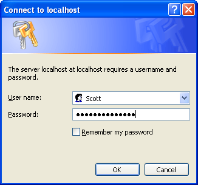
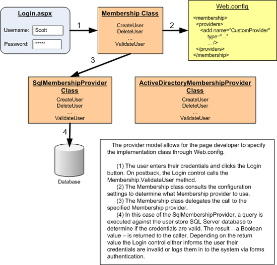

Security Basics and ASP.NET Support (VB)
====================
by [Scott Mitchell](https://twitter.com/ScottOnWriting)

[Download PDF](http://download.microsoft.com/download/2/F/7/2F705A34-F9DE-4112-BBDE-60098089645E/aspnet_tutorial01_Basics_vb.pdf)

> This is the first tutorial in a series of tutorials that will explore techniques for authenticating visitors through a web form, authorizing access to particular pages and functionality, and managing user accounts in an ASP.NET application.

## Introduction

What is the one thing forums, eCommerce sites, online email websites, portal websites, and social network sites all have in common? They all offer *user accounts*. Sites that offer user accounts must provide a number of services. At a minimum, new visitors need to be able to create an account and returning visitors must be able to log in. Such web applications can make decisions based on the logged in user: some pages or actions might be restricted to only logged in users, or to a certain subset of users; other pages might show information specific to the logged in user, or might show more or less information, depending on what user is viewing the page.

This is the first tutorial in a series of tutorials that will explore techniques for authenticating visitors through a web form, authorizing access to particular pages and functionality, and managing user accounts in an ASP.NET application. Over the course of these tutorials we will examine how to:

- Identify and log users in to a website
- Use ASP.NET's Membership framework to manage user accounts
- Create, update, and delete user accounts
- Limit access to a web page, directory, or specific functionality based on the logged in user
- Use ASP.NET's Roles framework to associate user accounts with roles
- Manage user roles
- Limit access to a web page, directory, or specific functionality based on the logged in user's role
- Customize and extend ASP.NET's security Web controls

These tutorials are geared to be concise and provide step-by-step instructions with plenty of screen shots to walk you through the process visually. Each tutorial is available in C# and Visual Basic versions and includes a download of the complete code used. (This first tutorial focuses on security concepts from a high-level viewpoint and therefore does not contain any associated code.)

In this tutorial we will discuss important security concepts and what facilities are available in ASP.NET to assist in implementing forms authentication, authorization, user accounts, and roles. Let's get started!

> [!NOTE]
> Security is an important aspect of any application that spans physical, technological, and policy decisions and requires a high degree of planning and domain knowledge. This tutorial series is not intended as a guide for developing secure web applications. Rather, it focuses specifically on forms authentication, authorization, user accounts, and roles. While some security concepts revolving around these issues are discussed in this series, others are left unexplored.

## Authentication, Authorization, User Accounts, and Roles

Authentication, authorization, user accounts, and roles are four terms that will be used very often throughout this tutorial series, so I'd like to take a quick moment to define these terms within the context of web security. In a client-server model, such as the Internet, there are many scenarios in which the server needs to identify the client making the request. *Authentication* is the process of ascertaining the client's identity. A client who has been successfully identified is said to be *authenticated*. An unidentified client is said to be *unauthenticated* or *anonymous*.

Secure authentication systems involve at least one of the following three facets: [something you know, something you have, or something you are](http://www.cs.cornell.edu/Courses/cs513/2005fa/NNLauthPeople.html). Most web applications rely on something the client knows, such as a password or a PIN. The information used to identify a user - her username and password, for example - are referred to as *credentials*. This tutorial series focuses on *forms authentication*, which is an authentication model where users log in to the site by providing their credentials in a web page form. We have all experienced this type of authentication before. Go to any eCommerce site. When you are ready to check out you are asked to log in by entering your username and password into textboxes on a web page.

In addition to identifying clients, a server may need to limit what resources or functionalities are accessible depending on the client making the request. *Authorization* is the process of determining whether a particular user has the authority to access a specific resource or functionality.

A *user account* is a store for persisting information about a particular user. User accounts must minimally include information that uniquely identifies the user, such as the user's login name and password. Along with this essential information, user accounts may include things like: the user's email address; the date and time the account was created; the date and time they last logged in; first and last name; phone number; and mailing address. When using forms authentication, user account information is typically stored in a relational database like Microsoft SQL Server.

Web applications that support user accounts may optionally group users into *roles*. A role is simply a label that is applied to a user and provides an abstraction for defining authorization rules and page-level functionality. For example, a website might include an Administrator role with authorization rules that prohibit anyone but an Administrator to access a particular set of web pages. Moreover, a variety of pages that are accessible to all users (including non-Administrators) might display additional data or offer extra functionality when visited by users in the Administrators role. Using roles, we can define these authorization rules on a role-by-role basis rather than user-by-user.

## Authenticating Users in an ASP.NET Application

When a user enters a URL into their browser's address window or clicks on a link, the browser makes a [Hypertext Transfer Protocol (HTTP)](http://en.wikipedia.org/wiki/HTTP) request to the web server for the specified content, be it an ASP.NET page, an image, a JavaScript file, or any other type of content. The web server is tasked with returning the requested content. In doing so, it must determine a number of things about the request, including who made the request and whether the identity is authorized to retrieve the requested content.

By default, browsers send HTTP requests that lack any sort of identification information. But if the browser does include authentication information then the web server starts the authentication workflow, which attempts to identify the client making the request. The steps of the authentication workflow depend on the type of authentication being used by the web application. ASP.NET supports three types of authentication: Windows, Passport, and forms. This tutorial series focuses on forms authentication, but let's take a minute to compare and contrast Windows authentication user stores and workflow.

### Authentication via Windows Authentication

The Windows authentication workflow uses one of the following authentication techniques:

- Basic authentication
- Digest authentication
- Windows Integrated Authentication

All three techniques work in roughly the same way: when an unauthorized, anonymous request arrives, the web server sends back an HTTP response that indicates that authorization is required to continue. The browser then displays a modal dialog box that prompts the user for their username and password (see Figure 1). This information is then sent back to the web server via an HTTP header.

**Figure 1**: A Modal Dialog Box Prompts the User for His Credentials

The supplied credentials are validated against the web server's Windows User Store. This means that each authenticated user in your web application must have a Windows account in your organization. This is commonplace in intranet scenarios. In fact, when using Windows Integrated Authentication in an intranet setting, the browser automatically provides the web server with the credentials used to log on to the network, thereby suppressing the dialog box shown in Figure 1. While Windows authentication is great for intranet applications, it is usually unfeasible for Internet applications since you do not want to create Windows accounts for each and every user who signs up at your site.

### Authentication via Forms Authentication

Forms authentication, on the other hand, is ideal for Internet web applications. Recall that forms authentication identifies the user by prompting them to enter their credentials through a web form. Consequently, when a user attempts to access an unauthorized resource, they are automatically redirected to the login page where they can enter their credentials. The submitted credentials are then validated against a custom user store - usually a database.

After verifying the submitted credentials, a *forms authentication ticket* is created for the user. This ticket indicates that the user has been authenticated and includes identifying information, such as the username. The forms authentication ticket is (typically) stored as a cookie on the client computer. Therefore, subsequent visits to the website include the forms authentication ticket in the HTTP request, thereby enabling the web application to identify the user once they have logged in.

Figure 2 illustrates the forms authentication workflow from a high-level vantage point. Notice how the authentication and authorization pieces in ASP.NET act as two separate entities. The forms authentication system identifies the user (or reports that they are anonymous). The authorization system is what determines whether the user has access to the requested resource. If the user is unauthorized (as they are in Figure 2 when attempting to anonymously visit ProtectedPage.aspx), the authorization system reports that the user is denied, causing the forms authentication system to automatically redirect the user to the login page.

Once the user has successfully logged in, subsequent HTTP requests include the forms authentication ticket. The forms authentication system merely identifies the user - it is the authorization system that determines whether the user can access the requested resource.

**Figure 2**: The Forms Authentication Workflow

We will dig into forms authentication in much greater detail in the next two tutorials,[An Overview of Forms Authentication](an-overview-of-forms-authentication-vb.md) and [Forms Authentication Configuration and Advanced Topics](forms-authentication-configuration-and-advanced-topics-vb.md). For more on ASP.NET's authentication options, see [ASP.NET Authentication](https://msdn.microsoft.com/en-us/library/eeyk640h.aspx).

## Limiting Access to Web Pages, Directories, and Page Functionality

ASP.NET includes two ways to determine whether a particular user has authority to access a specific file or directory:

- **File authorization** - since ASP.NET pages and web services are implemented as files that reside on the web server's file system, access to these files can be specified through Access Control Lists (ACLs). File authorization is most commonly used with Windows authentication because ACLs are permissions that apply to Windows accounts. When using forms authentication, all operating system- and file system-level requests are executed by the same Windows account, regardless of the user visiting the site.
- **URL authorization**- with URL authorization, the page developer specifies authorization rules in Web.config. These authorization rules specify what users or roles are allowed to access or are denied from accessing certain pages or directories in the application.

File authorization and URL authorization define authorization rules for accessing a particular ASP.NET page or for all ASP.NET pages in a particular directory. Using these techniques we can instruct ASP.NET to deny requests to a particular page for a particular user, or allow access to a set of users and deny access to everyone else. What about scenarios where all of the users can access the page, but the page's functionality depends on the user? For example, many sites that support user accounts have pages that display different content or data for authenticated users versus anonymous users. An anonymous user might see a link to log in to the site, whereas an authenticated user would instead see a message like, Welcome back, *Username* along with a link to log out. Another example: when viewing an item at an auction site you see different information depending on whether you are a bidder or the one auctioning the item.

Such page-level adjustments can be accomplished declaratively or programmatically. To show different content for anonymous than authenticated users, simply drag a [LoginView control](https://msdn.microsoft.com/en-us/library/system.web.ui.webcontrols.loginview.aspx) onto your page and enter the appropriate content into its AnonymousTemplate and LoggedInTemplate templates. Alternatively, you can programmatically determine whether the current request is authenticated, who the user is, and what roles they belong to (if any). You can use this information to then show or hide columns in a grid or Panels on the page.

This series includes three tutorials that focus on authorization. ***User-Based Authorization***examines how to limit access to a page or pages in a directory for specific user accounts; ***Role-Based Authorization*** looks at supplying authorization rules at the role level; lastly, the ***Displaying Content Based on the Currently Logged In User*** tutorial explores modifying a particular page's content and functionality based on the user visiting the page. For more on ASP.NET's authorization options, see [ASP.NET Authorization](https://msdn.microsoft.com/en-us/library/wce3kxhd.aspx).

## User Accounts and Roles

ASP.NET's forms authentication provides an infrastructure for users to log in to a site and have their authenticated state remembered across page visits. And URL authorization offers a framework for limiting access to specific files or folders in an ASP.NET application. Neither feature, however, supplies a means for storing user account information or managing roles.

Prior to ASP.NET 2.0, developers were responsible for creating their own user and role stores. They were also on the hook for designing the user interfaces and writing the code for essential user account-related pages like the login page and the page to create a new account, among others. Without any built-in user account framework in ASP.NET, each developer implementing user accounts had to arrive at his own design decisions on questions like, How do I store passwords or other sensitive information? and What guidelines should I impose regarding password length and strength?

Today, implementing user accounts in an ASP.NET application is much simpler thanks to the *Membership framework* and the built-in Login Web controls. The Membership framework is a handful of classes in the [System.Web.Security namespace](https://msdn.microsoft.com/en-us/library/system.web.security.aspx) that provide functionality for performing essential user account-related tasks. The key class in the Membership framework is the [Membership class](https://msdn.microsoft.com/en-us/library/system.web.security.membership.aspx), which has methods like:

- CreateUser
- DeleteUser
- GetAllUsers
- GetUser
- UpdateUser
- ValidateUser

The Membership framework uses the [provider model](http://aspnet.4guysfromrolla.com/articles/101905-1.aspx), which cleanly separates the Membership framework's API from its implementation. This enables developers to use a common API, but empowers them to use an implementation that meets their application's custom needs. In short, the Membership class defines the essential functionality of the framework (the methods, properties, and events), but does not actually supply any implementation details. Instead, the methods of the Membership class invoke the configured provider, which is what performs the actual work. For example, when the Membership class's CreateUser method is invoked, the Membership class doesn't know the details of the user store. It doesn't know if users are being maintained in a database or in an XML file or in some other store. The Membership class examines the web application's configuration to determine what provider to delegate the call to, and that provider class is responsible for actually creating the new user account in the appropriate user store. This interaction is illustrated in Figure 3.

Microsoft ships two Membership provider classes in the .NET Framework:

- [ActiveDirectoryMembershipProvider](https://msdn.microsoft.com/en-us/library/system.web.security.activedirectorymembershipprovider.aspx) - implements the Membership API in Active Directory and Active Directory Application Mode (ADAM) servers.
- [SqlMembershipProvider](https://msdn.microsoft.com/en-us/library/system.web.security.sqlmembershipprovider.aspx) - implements the Membership API in a SQL Server database.

This tutorial series focuses exclusively on the SqlMembershipProvider.

**Figure 03**: The Provider Model Enables Different Implementations to be Seamlessly Plugged Into the Framework ([Click to view full-size image](security-basics-and-asp-net-support-vb/_static/image5.png))

The benefit of the provider model is that alternative implementations can be developed by Microsoft, third-party vendors, or individual developers and seamlessly plugged into the Membership framework. For example, Microsoft has released [a Membership provider for Microsoft Access databases](https://download.microsoft.com/download/5/5/b/55bc291f-4316-4fd7-9269-dbf9edbaada8/sampleaccessproviders.vsi). For more information on the Membership providers, refer to the [Provider Toolkit](https://msdn.microsoft.com/en-us/asp.net/aa336558.aspx), which includes a walkthrough of the Membership providers, sample custom providers, over 100 pages of documentation on the provider model, and the complete source code for the built-in Membership providers (namely, ActiveDirectoryMembershipProvider and SqlMembershipProvider).

ASP.NET 2.0 also introduced the Roles framework. Like the Membership framework, the Roles framework is built atop the provider model. Its API is exposed via the [Roles class](https://msdn.microsoft.com/en-us/library/system.web.security.roles.aspx) and the .NET Framework ships with three provider classes:

- [AuthorizationStoreRoleProvider](https://msdn.microsoft.com/en-us/library/system.web.security.authorizationstoreroleprovider.aspx) - manages role information in an authorization-manager policy store, such as Active Directory or ADAM.
- [SqlRoleProvider](https://msdn.microsoft.com/en-us/library/system.web.security.sqlroleprovider.aspx) - implements roles in a SQL Server database.
- [WindowsTokenRoleProvider](https://msdn.microsoft.com/en-us/library/system.web.security.windowstokenroleprovider.aspx) - associates role information based on the visitor's Windows group. This method is typically used with Windows authentication.

This tutorial series focuses exclusively on the SqlRoleProvider.

Since the provider model includes a single forward-facing API (the Membership and Roles classes), it is possible to build functionality around that API without having to worry about the implementation details - those are handled by the providers selected by the page developer. This unified API allows for Microsoft and third-party vendors to build Web controls that interface with the Membership and Roles frameworks. ASP.NET ships with a number of [Login Web controls](https://msdn.microsoft.com/en-us/library/ms178329.aspx) for implementing common user account user interfaces. For example, the [Login control](https://msdn.microsoft.com/en-us/library/system.web.ui.webcontrols.login.aspx) prompts a user for their credentials, validates them, and then logs them in via forms authentication. The [LoginView control](https://msdn.microsoft.com/en-us/library/system.web.ui.webcontrols.loginview.aspx) offers templates for displaying different markup to anonymous users versus authenticated users, or different markup based on the user's role. And the [CreateUserWizard control](https://msdn.microsoft.com/en-us/library/system.web.ui.webcontrols.createuserwizard.aspx) provides a step-by-step user interface for creating a new user account.

Underneath the covers the various Login controls interact with the Membership and Roles frameworks. Most Login controls can be implemented without having to write a single line of code. We will examine these controls in greater detail in future tutorials, including techniques for extending and customizing their functionality.

## Summary

All web applications that support user accounts require similar features, such as: the ability for users to log in and have their log in status remembered across page visits; a web page for new visitors to create an account; and the ability to the page developer to specify what resource, data, and functionality are available to what users or roles. The tasks of authenticating and authorizing users and of managing user accounts and roles is remarkably easy to accomplish in ASP.NET applications thanks to forms authentication, URL authorization, and the Membership and Roles frameworks.

Over the course of the next several tutorials we will examine these aspects by building a working web application from the ground up in a step-by-step fashion. In the next two tutorial we will explore forms authentication in detail. We will see the forms authentication workflow in action, dissect the forms authentication ticket, discuss security concerns, and see how to configure the forms authentication system - all while building a web application that allows visitors to log in and log out.

Happy Programming!

### Further Reading

For more information on the topics discussed in this tutorial, refer to the following resources:

- [ASP.NET 2.0 Membership, Roles, Forms Authentication, and Security Resources](https://weblogs.asp.net/scottgu/ASP.NET-2.0-Membership_2C00_-Roles_2C00_-Forms-Authentication_2C00_-and-Security-Resources-)
- [ASP.NET 2.0 Security Guidelines](https://msdn.microsoft.com/en-us/library/ms998258.aspx)
- [ASP.NET Authentication](https://msdn.microsoft.com/en-us/library/eeyk640h.aspx)
- [ASP.NET Authorization](https://msdn.microsoft.com/en-us/library/wce3kxhd.aspx)
- [ASP.NET Login Controls Overview](https://msdn.microsoft.com/en-us/library/ms178329.aspx)
- [Examining ASP.NET 2.0's Membership, Roles, and Profile](http://aspnet.4guysfromrolla.com/articles/120705-1.aspx)
- [How Do I: Secure My Site Using Membership and Roles?](https://asp.net/learn/videos/video-45.aspx) (Video)
- [Introduction to Membership](https://msdn.microsoft.com/en-us/library/yh26yfzy.aspx)
- [MSDN Security Developer Center](https://msdn.microsoft.com/en-us/security/default.aspx)
- [Professional ASP.NET 2.0 Security, Membership, and Role Management](http://www.wrox.com/WileyCDA/WroxTitle/productCd-0764596985.html) (ISBN: 978-0-7645-9698-8)
- [Provider Toolkit](https://msdn.microsoft.com/en-us/asp.net/aa336558.aspx)

## About the Author

[Scott Mitchell](http://www.4guysfromrolla.com/ScottMitchell.shtml), author of seven ASP/ASP.NET books and founder of [4GuysFromRolla.com](http://www.4guysfromrolla.com), has been working with Microsoft Web technologies since 1998. Scott works as an independent consultant, trainer, and writer. His latest book is [*Sams Teach Yourself ASP.NET 2.0 in 24 Hours*](https://www.amazon.com/exec/obidos/ASIN/0672327384/4guysfromrollaco). He can be reached at [mitchell@4GuysFromRolla.com.](mailto:mitchell@4GuysFromRolla.com) or via his blog, which can be found at [http://ScottOnWriting.NET](http://ScottOnWriting.NET).

## Special Thanks To

This tutorial series was reviewed by many helpful reviewers. Lead reviewer for this tutorial was This tutorial series was reviewed by many helpful reviewers. Lead reviewers for this tutorial include Alicja Maziarz, John Suru, and Teresa Murphy. Interested in reviewing my upcoming MSDN articles? If so, drop me a line at [mitchell@4GuysFromRolla.com.](mailto:mitchell@4GuysFromRolla.com)

>[!div class="step-by-step"]
[Previous](forms-authentication-configuration-and-advanced-topics-cs.md)
[Next](an-overview-of-forms-authentication-vb.md)