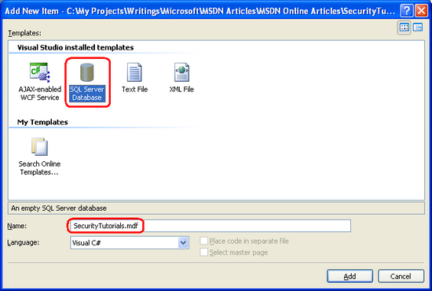
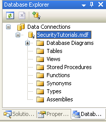
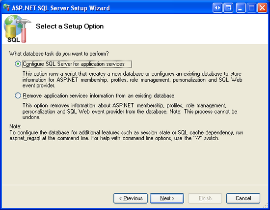
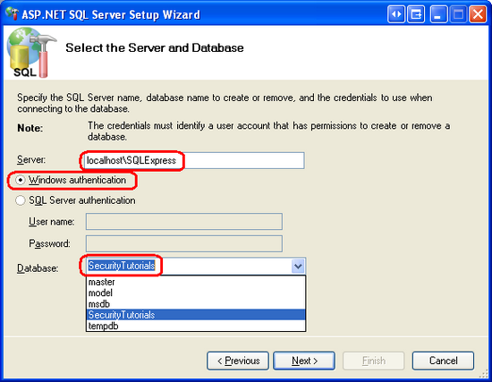

Creating the Membership Schema in SQL Server (VB)
====================
by [Scott Mitchell](https://twitter.com/ScottOnWriting)

[Download Code](http://download.microsoft.com/download/3/f/5/3f5a8605-c526-4b34-b3fd-a34167117633/ASPNET_Security_Tutorial_04_VB.zip) or [Download PDF](http://download.microsoft.com/download/3/f/5/3f5a8605-c526-4b34-b3fd-a34167117633/aspnet_tutorial04_MembershipSetup_vb.pdf)

> This tutorial starts by examining techniques for adding the necessary schema to the database in order to use the SqlMembershipProvider. Following that, we will examine the key tables in the schema and discuss their purpose and importance. This tutorial ends with a look at how to tell an ASP.NET application which provider the Membership framework should use.

## Introduction

The previous two tutorials examined using forms authentication to identify website visitors. The forms authentication framework makes it easy for developers to log a user into a website and to remember them across page visits through the use of authentication tickets. The `FormsAuthentication` class includes methods for generating the ticket and adding it to the visitor's cookies. The `FormsAuthenticationModule` examines all incoming requests and, for those with a valid authentication ticket, creates and associates a `GenericPrincipal` and a `FormsIdentity` object with the current request. Forms authentication is merely a mechanism for granting an authentication ticket to a visitor when logging in and, on subsequent requests, parsing that ticket to determine the user's identity. For a web application to support user accounts, we still need to implement a user store and add functionality to validate credentials, register new users, and the myriad of other user account-related tasks.

Prior to ASP.NET 2.0, developers were on the hook for implementing all of these user account-related tasks. Fortunately the ASP.NET team recognized this shortcoming and introduced the Membership framework with ASP.NET 2.0. The Membership framework is a set of classes in the .NET Framework that provide a programmatic interface for accomplishing core user account-related tasks. This framework is built atop the [provider model](http://aspnet.4guysfromrolla.com/articles/101905-1.aspx), which allows developers to plug a customized implementation into a standardized API.

As discussed in the [*Security Basics and ASP.NET Support*](../introduction/security-basics-and-asp-net-support-vb.md) tutorial, the .NET Framework ships with two built-in Membership providers: [`ActiveDirectoryMembershipProvider`](https://msdn.microsoft.com/en-us/library/system.web.security.activedirectorymembershipprovider.aspx) and [`SqlMembershipProvider`](https://msdn.microsoft.com/en-us/library/system.web.security.sqlmembershipprovider.aspx). As its name implies, the `SqlMembershipProvider` uses a Microsoft SQL Server database as the user store. In order to use this provider in an application, we need to tell the provider what database to use as the store. As you might imagine, the `SqlMembershipProvider` expects the user store database to have certain database tables, views, and stored procedures. We need to add this expected schema to the selected database.

This tutorial starts by examining techniques for adding the necessary schema to the database in order to use the `SqlMembershipProvider`. Following that, we will examine the key tables in the schema and discuss their purpose and importance. This tutorial ends with a look at how to tell an ASP.NET application which provider the Membership framework should use.

Let's get started!

## Step 1: Deciding Where to Place the User Store

An ASP.NET application's data is commonly stored in a number of tables in a database. When implementing the `SqlMembershipProvider` database schema we must decide whether to place the Membership schema in the same database as the application data or in an alternate database.

I recommend locating the Membership schema in the same database as the application data for the following reasons:

- **Maintainability** � an application whose data is encapsulated in one database is easier to understand, maintain, and deploy than an application that has two separate databases.
- **Relational Integrity** � by locating the Membership-related tables in the same database as the application tables it is possible to establish [foreign key constraints](http://en.wikipedia.org/wiki/Foreign_key) between the primary keys in the Membership-related tables and related application tables.

Decoupling the user store and application data into separate databases only makes sense if you have multiple applications that each use separate databases, but need to share a common user store.

### Creating a Database

The application we have been building since the second tutorial has not yet needed a database. We need one now, however, for the user store. Let's create one and then add to it the schema required by the `SqlMembershipProvider` provider (see Step 2).

> [!NOTE]
> Throughout this tutorial series we will be using a [Microsoft SQL Server 2005 Express Edition](https://msdn.microsoft.com/en-us/sql/Aa336346.aspx) database to store our application tables and the `SqlMembershipProvider` schema. This decision was made for two reasons: first, due to its cost - free - the Express Edition is the most readably accessible version of SQL Server 2005; second, SQL Server 2005 Express Edition databases can be placed directly in the web application's `App_Data` folder, making it a cinch to package the database and web application together in one ZIP file and to redeploy it without any special setup instructions or configuration options. If you'd prefer to follow along using a non-Express Edition version of SQL Server, feel free. The steps are virtually identical. The `SqlMembershipProvider` schema will work with any version of Microsoft SQL Server 2000 and up.

From the Solution Explorer, right-click on the `App_Data` folder and choose to Add New Item. (If you do not see an `App_Data` folder in your project, right-click on the project in Solution Explorer, select Add ASP.NET Folder, and pick `App_Data`.) From the Add New Item dialog box, choose to add a new SQL Database named `SecurityTutorials.mdf`. In this tutorial we will add the `SqlMembershipProvider` schema to this database; in subsequent tutorials we will create additional tables to capture our application data.

**Figure 1**: Add a New SQL Database Named `SecurityTutorials.mdf` Database to the `App_Data` Folder ([Click to view full-size image](creating-the-membership-schema-in-sql-server-vb/_static/image3.png))

Adding a database to the `App_Data` folder automatically includes it in the Database Explorer view. (In the non-Express Edition version of Visual Studio, the Database Explorer is called the Server Explorer.) Go to the Database Explorer and expand the just-added `SecurityTutorials` database. If you do not see the Database Explorer on screen, go to the View menu and choose Database Explorer, or hit Ctrl+Alt+S. As Figure 2 shows, the `SecurityTutorials` database is empty - it contains no tables, no views, and no stored procedures.

**Figure 2**: The `SecurityTutorials` Database is Currently Empty ([Click to view full-size image](creating-the-membership-schema-in-sql-server-vb/_static/image6.png))

## Step 2: Adding the`SqlMembershipProvider`Schema to the Database

The `SqlMembershipProvider` requires a particular set of tables, views, and stored procedures to be installed in the user store database. These requisite database objects can be added using the [`aspnet_regsql.exe` tool](https://msdn.microsoft.com/en-us/library/ms229862.aspx). This file is located in the `%WINDIR%\Microsoft.Net\Framework\v2.0.50727\` folder.

> [!NOTE]
> The `aspnet_regsql.exe` tool offers both command line functionality and a graphical user interface. The graphical interface is more user friendly and is what we will examine in this tutorial. The command line interface is useful when the addition of the `SqlMembershipProvider` schema needs to be automated, such as in build scripts or automated testing scenarios.

The `aspnet_regsql.exe` tool is used to add or remove *ASP.NET application services* to a specified SQL Server database. The ASP.NET application services encompass the schemas for the `SqlMembershipProvider` and `SqlRoleProvider`, along with the schemas for the SQL-based providers for other ASP.NET 2.0 frameworks. We need to provide two bits of information to the `aspnet_regsql.exe` tool:

- Whether we want to add or remove application services, and
- The database from which to add or remove the application services schema

In prompting for the database to use, the `aspnet_regsql.exe` tool asks us to provide the name of the server the database resides on, the security credentials for connecting to the database, and the database name. If you are using the non-Express Edition of SQL Server, you should already know this information, as it is the same information you must provide through a connection string when working with the database through an ASP.NET web page. Determining the server and database name when using a SQL Server 2005 Express Edition database in the `App_Data` folder, however, is a bit more involved.

The following section examines a straightforward way for specifying the server and database name for a SQL Server 2005 Express Edition database in the `App_Data` folder. If you are not using SQL Server 2005 Express Edition feel free to skip ahead to the Installing the Application Services section.

### Determining the Server and Database Name for a SQL Server 2005 Express Edition Database in the`App_Data`Folder

In order to use the `aspnet_regsql.exe` tool we need to know the server and database names. The server name is `localhost\InstanceName`. Most likely, the *InstanceName* is `SQLExpress`. However, if you installed SQL Server 2005 Express Edition manually (that is, you did not install it automatically while installing Visual Studio), then it is possible that you selected a different instance name.

The database name is a bit trickier to determine. Databases in the `App_Data` folder typically have a database name that includes a [globally unique identifier](http://en.wikipedia.org/wiki/Globally_Unique_Identifier) along with the path to the database file. We need to determine this database name in order to add the application services schema through `aspnet_regsql.exe`.

The easiest way to ascertain the database name is to examine it through SQL Server Management Studio. SQL Server Management Studio provides a graphical interface for managing SQL Server 2005 databases, but it does not ship with the Express Edition of SQL Server 2005. The good news is that [you can download](https://www.microsoft.com/downloads/details.aspx?FamilyId=C243A5AE-4BD1-4E3D-94B8-5A0F62BF7796&amp;displaylang=en) the free Express Edition of SQL Server Management Studio.

> [!NOTE]
> If you also have a non-Express Edition version of SQL Server 2005 installed on your desktop then the full version of Management Studio is likely installed. You can use the full version to determine the database name, following the same steps as outlined below for the Express Edition.

Start by closing Visual Studio to ensure that any locks imposed by Visual Studio on the database file are closed. Next, launch SQL Server Management Studio and connect to the `localhost\InstanceName` database for SQL Server 2005 Express Edition. As noted earlier, chances are the instance name is `SQLExpress`. For the Authentication option, select Windows Authentication.

**Figure 3**: Connect to the SQL Server 2005 Express Edition Instance ([Click to view full-size image](creating-the-membership-schema-in-sql-server-vb/_static/image9.png))

After connecting to the SQL Server 2005 Express Edition instance, Management Studio displays folders for the Databases, the Security settings, the Server Objects, and so on. If you expand the Databases tab you will see that the `SecurityTutorials.mdf` database is *not* registered in the database instance - we need to attach the database first.

Right-click on the Databases folder and choose Attach from the context menu. This will display the Attach Databases dialog box. From here, click the Add button, browse to the `SecurityTutorials.mdf` database, and click OK. Figure 4 shows the Attach Databases dialog box after the `SecurityTutorials.mdf` database has been selected. Figure 5 shows Management Studio's Object Explorer after the database has been successfully attached.

**Figure 4**: Attach the `SecurityTutorials.mdf` Database ([Click to view full-size image](creating-the-membership-schema-in-sql-server-vb/_static/image12.png))

**Figure 5**: The `SecurityTutorials.mdf` Database Appears in the Databases Folder ([Click to view full-size image](creating-the-membership-schema-in-sql-server-vb/_static/image15.png))

As Figure 5 shows, the `SecurityTutorials.mdf` database has a rather abstruse name. Let's change it to a more memorable (and easier to type) name. Right-click on the database, choose Rename from the context menu, and rename it `SecurityTutorialsDatabase`. This does not change the filename, just the name the database uses to identify itself to SQL Server.

**Figure 6**: Rename the Database to `SecurityTutorialsDatabase`([Click to view full-size image](creating-the-membership-schema-in-sql-server-vb/_static/image18.png))

At this point we know the server and database names for the `SecurityTutorials.mdf` database file: `localhost\InstanceName` and `SecurityTutorialsDatabase`, respectively. We are now ready to install the application services through the `aspnet_regsql.exe` tool.

### Installing the Application Services

To launch the `aspnet_regsql.exe` tool, go to the start menu and choose Run. Enter `%WINDIR%\Microsoft.Net\Framework\v2.0.50727\aspnet_regsql.exe` into the textbox and click OK. Alternatively, you can use Windows Explorer to drill down to the appropriate folder and double-click the `aspnet_regsql.exe` file. Either approach will net the same results.

Running the `aspnet_regsql.exe` tool without any command line arguments launches the ASP.NET SQL Server Setup Wizard graphical user interface. The wizard makes it easy to add or remove the ASP.NET application services on a specified database. The first screen of the wizard, shown in Figure 7, describes the purpose of the tool.

**Figure 7**: Use the ASP.NET SQL Server Setup Wizard Makes to Add the Membership Schema ([Click to view full-size image](creating-the-membership-schema-in-sql-server-vb/_static/image21.png))

The second step in the wizard asks us whether we want to add the application services or remove them. Since we want to add the tables, views, and stored procedures necessary for the `SqlMembershipProvider`, choose the Configure SQL Server for application services option. Later, if you want to remove this schema from your database, re-run this wizard, but instead choose the Remove application services information from an existing database option.

**Figure 8**: Choose the Configure SQL Server for Application Services Option ([Click to view full-size image](creating-the-membership-schema-in-sql-server-vb/_static/image24.png))

The third step prompts for the database information: the server name, authentication information, and the database name. If you have been following along with this tutorial and have added the `SecurityTutorials.mdf` database to `App_Data`, attached it to `localhost\InstanceName`, and renamed it to `SecurityTutorialsDatabase`, then use the following values:

- Server: `localhost\InstanceName`
- Windows authentication
- Database: `SecurityTutorialsDatabase`

**Figure 9**: Enter the Database Information ([Click to view full-size image](creating-the-membership-schema-in-sql-server-vb/_static/image27.png))

After entering the database information, click Next. The final step summarizes the steps that will be taken. Click Next to install the application services and then Finish to complete the wizard.

> [!NOTE]
> If you used Management Studio to attach the database and rename the database file, be sure to detach the database and close Management Studio before reopening Visual Studio. To detach the `SecurityTutorialsDatabase` database, right-click on the database name and, from the Tasks menu, choose Detach.

Upon completion of the wizard, return to Visual Studio and navigate to the Database Explorer. Expand the Tables folder. You should see a series of tables whose names start with the prefix `aspnet_`. Likewise, a variety of views and stored procedures can be found under the Views and Stored Procedures folders. These database objects make up the application services schema. We will examine the membership- and role-specific database objects in Step 3.

**Figure 10**: A Variety of Tables, Views, and Stored Procedures Have Been Added to the Database ([Click to view full-size image](creating-the-membership-schema-in-sql-server-vb/_static/image30.png))

> [!NOTE]
> The `aspnet_regsql.exe` tool's graphical user interface installs the entire application services schema. But when executing `aspnet_regsql.exe` from the command-line you can specify what particular application services components to install (or remove). Therefore, if you want to add just the tables, views, and stored procedures necessary for the `SqlMembershipProvider` and `SqlRoleProvider` providers, run `aspnet_regsql.exe` from the command-line. Alternatively, you can manually run the appropriate subset of T-SQL create scripts used by `aspnet_regsql.exe`. These scripts are located in the `WINDIR%\Microsoft.Net\Framework\v2.0.50727\` folder with names like `InstallCommon.sql`, `InstallMembership.sql`, `InstallRoles.sql`, `InstallProfile.sql`, `InstallSqlState.sql`, and so on.

At this point we have created the database objects needed by the `SqlMembershipProvider`. However, we still need to instruct the Membership framework that it should use the `SqlMembershipProvider` (versus, say, the `ActiveDirectoryMembershipProvider`) and that the `SqlMembershipProvider` should use the `SecurityTutorials` database. We'll look at how to specify what provider to use and how to customize the selected provider's settings in Step 4. But first, let's take a deeper look at the database objects that were just created.

## Step 3: A Look at the Schema's Core Tables

When working with the Membership and Roles frameworks in an ASP.NET application, the implementation details are encapsulated by the provider. In future tutorials we will interface with these frameworks via the .NET Framework's `Membership` and `Roles` classes. When using these high-level APIs we do not need to concern ourselves with the low-level details, like what queries are executed or what tables are modified by the `SqlMembershipProvider` and `SqlRoleProvider`.

Given this, we could confidently use the Membership and Roles frameworks without having explored the database schema created in Step 2. However, when creating the tables to store application data we may need to create entities that relate to users or roles. It helps to have a familiarity with the `SqlMembershipProvider` and `SqlRoleProvider` schemas when establishing foreign key constraints between the application data tables and those tables created in Step 2. Moreover, in certain rare circumstances we may need to interface with the user and role stores directly at the database level (instead of through the `Membership` or `Roles` classes).

### Partitioning the User Store Into Applications

The Membership and Roles frameworks are designed such that a single user and role store can be shared among many different applications. An ASP.NET application that uses the Membership or Roles frameworks must specify what application partition to use. In short, multiple web applications can use the same user and role stores. Figure 11 depicts user and role stores that are partitioned into three applications: HRSite, CustomerSite, and SalesSite. These three web applications each have their own unique users and roles, yet they all physically store their user account and role information in the same database tables.

**Figure 11**: User Accounts May Be Partitioned Across Multiple Applications ([Click to view full-size image](creating-the-membership-schema-in-sql-server-vb/_static/image33.png))

The `aspnet_Applications` table is what defines these partitions. Each application that uses the database to store user account information is represented by a row in this table. The `aspnet_Applications` table has four columns: `ApplicationId`, `ApplicationName`, `LoweredApplicationName`, and `Description`.`ApplicationId` is of type [`uniqueidentifier`](https://msdn.microsoft.com/en-us/library/ms187942.aspx) and is the table's primary key; `ApplicationName` provides a unique human-friendly name for each application.

The other Membership- and Role-related tables link back to the `ApplicationId` field in `aspnet_Applications`. For example, the `aspnet_Users` table, which contains a record for each user account, has an `ApplicationId` foreign key field; ditto for the `aspnet_Roles` table. The `ApplicationId` field in these tables specifies the application partition the user account or role belongs to.

### Storing User Account Information

User account information is housed in two tables: `aspnet_Users` and `aspnet_Membership`. The `aspnet_Users` table contains fields that hold the essential user account information. The three most pertinent columns are:

- `UserId`
- `UserName`
- `ApplicationId`

`UserId` is the primary key (and of type `uniqueidentifier`). `UserName` is of type `nvarchar(256)` and, along with the password, makes up the user's credentials. (A user's password is stored in the `aspnet_Membership` table.) `ApplicationId` links the user account to a particular application in `aspnet_Applications`. There is a composite [`UNIQUE` constraint](https://msdn.microsoft.com/en-us/library/ms191166.aspx) on the `UserName` and `ApplicationId` columns. This ensures that in a given application each UserName is unique, yet it allows for the same `UserName` to be used in different applications.

The `aspnet_Membership` table includes additional user account information, like the user's password, email address, the last login date and time, and so forth. There is a one-to-one correspondence between records in the `aspnet_Users` and `aspnet_Membership` tables. This relationship is ensured by the `UserId` field in `aspnet_Membership`, which serves as the table's primary key. Like the `aspnet_Users` table, `aspnet_Membership` includes an `ApplicationId` field that ties this information to a particular application partition.

### Securing Passwords

Password information is stored in the `aspnet_Membership` table. The `SqlMembershipProvider` allows for passwords to be stored in the database using one of the following three techniques:

- **Clear** - the password is stored in the database as plain-text. I strongly discourage using this option. If the database is compromised - be it by a hacker who finds a back door or a disgruntled employee who has database access - every single user's credentials are there for the taking.
- **Hashed** - passwords are hashed using a one-way hash algorithm and a randomly generated salt value. This hashed value (along with the salt) is stored in the database.
- **Encrypted** - an encrypted version of the password is stored in the database.

The password storage technique used depends on the `SqlMembershipProvider` settings specified in `Web.config`. We will look at customizing the `SqlMembershipProvider` settings in Step 4. The default behavior is to store the hash of the password.

The columns responsible for storing the password are `Password`, `PasswordFormat`, and `PasswordSalt`. `PasswordFormat` is a field of type `int` whose value indicates the technique used for storing the password: 0 for Clear; 1 for Hashed; 2 for Encrypted. `PasswordSalt` is assigned a randomly generated string regardless of the password storage technique used; the value of `PasswordSalt` is only used when computing the hash of the password. Finally, the `Password` column contains the actual password data, be it the plain-text password, the hash of the password, or the encrypted password.

Table 1 illustrates what these three columns might look like for the various storage techniques when storing the password MySecret! .

| **Storage Technique&lt;\_o3a\_p /&gt;** | **Password&lt;\_o3a\_p /&gt;** | **PasswordFormat&lt;\_o3a\_p /&gt;** | **PasswordSalt&lt;\_o3a\_p /&gt;** |
| --- | --- | --- | --- |
| Clear | MySecret! | 0 | tTnkPlesqissc2y2SMEygA== |
| Hashed | 2oXm6sZHWbTHFgjgkGQsc2Ec9ZM= | 1 | wFgjUfhdUFOCKQiI61vtiQ== |
| Encrypted | 62RZgDvhxykkqsMchZ0Yly7HS6onhpaoCYaRxV8g0F4CW56OXUU3e7Inza9j9BKp | 2 | LSRzhGS/aa/oqAXGLHJNBw== |

**Table 1**: Example Values for the Password-Related Fields When Storing the Password MySecret!

> [!NOTE]
> The particular encryption or hashing algorithm used by the `SqlMembershipProvider` is determined by the settings in the `<machineKey>` element. We discussed this configuration element in Step 3 of the [*Forms Authentication Configuration and Advanced Topics*](../introduction/forms-authentication-configuration-and-advanced-topics-vb.md) tutorial.

### Storing Roles and Role Associations

The Roles framework allows developers to define a set of roles and specify what users belong to what roles. This information is captured in the database through two tables: `aspnet_Roles` and `aspnet_UsersInRoles`. Each record in the `aspnet_Roles` table represents a role for a particular application. Much like the `aspnet_Users` table, the `aspnet_Roles` table has three columns pertinent to our discussion:

- `RoleId`
- `RoleName`
- `ApplicationId`

`RoleId` is the primary key (and of type `uniqueidentifier`). `RoleName` is of type `nvarchar(256)`. And `ApplicationId` links the user account to a particular application in `aspnet_Applications`. There is a composite `UNIQUE` constraint on the `RoleName` and `ApplicationId` columns, ensuring that in a given application each role name is unique.

The `aspnet_UsersInRoles` table serves as a mapping between users and roles. There are only two columns - `UserId` and `RoleId` - and together they make up a composite primary key.

## Step 4: Specifying the Provider and Customizing Its Settings

All of the frameworks that support the provider model - such as the Membership and Roles frameworks - lack implementation details themselves and instead delegate that responsibility to a provider class. In the case of the Membership framework, the `Membership` class defines the API for managing user accounts, but it does not interact directly with any user store. Rather, the `Membership` class's methods hand off the request to the configured provider - we will be using the `SqlMembershipProvider`. When we invoke one of the methods in the `Membership` class, how does the Membership framework know to delegate the call to the `SqlMembershipProvider`?

The `Membership` class has a [`Providers` property](https://msdn.microsoft.com/en-us/library/system.web.security.membership.providers.aspx) that contains a reference to all of the registered provider classes available for use by the Membership framework. Each registered provider has an associated name and type. The name offers a human-friendly way to reference a particular provider in the `Providers` collection, while the type identifies the provider class. Moreover, each registered provider may include configuration settings. Configuration settings for the Membership framework include `PasswordFormat` and `requiresUniqueEmail`, among many others. See Table 2 for a complete list of configuration settings used by the `SqlMembershipProvider`.

The `Providers` property's contents are specified through the web application's configuration settings. By default, all web applications have a provider named `AspNetSqlMembershipProvider` of type `SqlMembershipProvider`. This default Membership provider is registered in `machine.config` (located at `%WINDIR%\Microsoft.Net\Framework\v2.0.50727\CONFIG`):

[!code-xml[Main](creating-the-membership-schema-in-sql-server-vb/samples/sample1.xml)]

As the markup above shows, the [`<membership>` element](https://msdn.microsoft.com/en-us/library/1b9hw62f.aspx) defines the configuration settings for the Membership framework while the [`<providers>` child element](https://msdn.microsoft.com/en-us/library/6d4936ht.aspx) specifies the registered providers. Providers may be added or removed using the [`<add>`](https://msdn.microsoft.com/en-us/library/whae3t94.aspx) or [`<remove>`](https://msdn.microsoft.com/en-us/library/aykw9a6d.aspx) elements; use the [`<clear>`](https://msdn.microsoft.com/en-us/library/t062y6yc.aspx) element to remove all currently registered providers. As the markup above shows, `machine.config` adds a provider named `AspNetSqlMembershipProvider` of type `SqlMembershipProvider`.

In addition to the `name` and `type` attributes, the `<add>` element contains attributes that define the values for various configuring settings. Table 2 lists the available `SqlMembershipProvider`-specific configuration settings, along with a description of each.

> [!NOTE]
> Any default values noted in Table 2 refer to the default values defined in the `SqlMembershipProvider` class. Note that not all of the configuration settings in `AspNetSqlMembershipProvider` correspond to the default values of the `SqlMembershipProvider` class. For example, if not specified in a Membership provider, the `requiresUniqueEmail` setting defaults to true. However, the `AspNetSqlMembershipProvider` overrides this default value by explicitly specifying a value of `false`.

| **Setting&lt;\_o3a\_p /&gt;** | **Description&lt;\_o3a\_p /&gt;** |
| --- | --- |
| `ApplicationName` | Recall that the Membership framework allows for a single user store to be partitioned across multiple applications. This setting indicates the name of the application partition used by the Membership provider. If this value is not explicitly specified, it is set, at runtime, to the value of the application's virtual root path. |
| `commandTimeout` | Specifies the SQL command timeout value (in seconds). The default value is 30. |
| `connectionStringName` | The name of the connection string in the `<connectionStrings>` element to use to connect to the user store database. This value is required. |
| `description` | Provides a human-friendly description of the registered provider. |
| `enablePasswordRetrieval` | Specifies whether users may retrieve their forgotten password. The default value is `false`. |
| `enablePasswordReset` | Indicates whether users are allowed to reset their password. Defaults to `true`. |
| `maxInvalidPasswordAttempts` | The maximum number of unsuccessful login attempts that may occur for a given user during the specified `passwordAttemptWindow` before the user is locked out. The default value is 5. |
| `minRequiredNonalphanumericCharacters` | The minimum number of non-alphanumeric characters that must appear in a user's password. This value must be between 0 and 128; the default is 1. |
| `minRequiredPasswordLength` | The minimum number of characters required in a password. This value must be between 0 and 128; the default is 7. |
| `name` | The name of the registered provider. This value is required. |
| `passwordAttemptWindow` | The number of minutes during which failed login attempts are tracked. If a user supplies invalid login credentials `maxInvalidPasswordAttempts` times within this specified window, they are locked out. The default value is 10. |
| `PasswordFormat` | The password storage format: `Clear`, `Hashed`, or `Encrypted`. The default is `Hashed`. |
| `passwordStrengthRegularExpression` | If provided, this regular expression is used to evaluate the strength of the user's selected password when creating a new account or when changing their password. The default value is an empty string. |
| `requiresQuestionAndAnswer` | Specifies whether a user must answer his security question when retrieving or resetting his password. The default value is `true`. |
| `requiresUniqueEmail` | Indicates whether all user accounts in a given application partition must have a unique email address. The default value is `true`. |
| `type` | Specifies the type of the provider. This value is required. |

**Table 2**: Membership and `SqlMembershipProvider` Configuration Settings

In addition to `AspNetSqlMembershipProvider`, other Membership providers may be registered on an application-by-application basis by adding similar markup to the `Web.config` file.

> [!NOTE]
> The Roles framework works in much the same way: there is a default registered role provider in `machine.config` and the registered providers may be customized on an application-by-application basis in `Web.config`. We will examine the Roles framework and its configuration markup in detail in a future tutorial.

### Customizing the`SqlMembershipProvider`Settings

The default `SqlMembershipProvider` (`AspNetSqlMembershipProvider`) has its `connectionStringName` attribute set to `LocalSqlServer`. Like the `AspNetSqlMembershipProvider` provider, the connection string name `LocalSqlServer` is defined in `machine.config`.

[!code-xml[Main](creating-the-membership-schema-in-sql-server-vb/samples/sample2.xml)]

As you can see, this connection string defines a SQL 2005 Express Edition database located at |DataDirectory|aspnetdb.mdf. The string |DataDirectory| is translated at runtime to point to the `~/App_Data/` directory, so the database path |DataDirectory|aspnetdb.mdf translates to `~/App_Data`/`aspnet.mdf`.

If we did not specify any Membership provider information in our application's `Web.config` file, the application uses the default registered Membership provider, `AspNetSqlMembershipProvider`. If the `~/App_Data/aspnet.mdf` database does not exist, the ASP.NET runtime will automatically create it and add the application services schema. However, we don't want to use the `aspnet.mdf` database; rather, we want to use the `SecurityTutorials.mdf` database we created in Step 2. This modification can be accomplished in one of two ways:

- **Specify a value for the****`LocalSqlServer`****connection string name in****`Web.config`****.** By overwriting the `LocalSqlServer` connection string name value in `Web.config`, we can use the default registered Membership provider (`AspNetSqlMembershipProvider`) and have it correctly work with the `SecurityTutorials.mdf` database. This approach is fine if you are content with the configuration settings specified by `AspNetSqlMembershipProvider`. For more information on this technique, see [Scott Guthrie](https://weblogs.asp.net/scottgu/)'s blog post, [Configuring ASP.NET 2.0 Application Services to Use SQL Server 2000 or SQL Server 2005](https://weblogs.asp.net/scottgu/archive/2005/08/25/423703.aspx).
- **Add a new registered provider of type****`SqlMembershipProvider`****and configure its****`connectionStringName`****setting to point to the****`SecurityTutorials.mdf`****database.** This approach is useful in scenarios where you want to customize other configuration properties in addition to the database connection string. In my own projects I always use this approach because of its flexibility and readability.

Before we can add a new registered provider that references the `SecurityTutorials.mdf` database, we first need to add an appropriate connection string value in the `<connectionStrings>` section in `Web.config`. The following markup adds a new connection string named `SecurityTutorialsConnectionString` that references the SQL Server 2005 Express Edition `SecurityTutorials.mdf` database in the `App_Data` folder.

[!code-xml[Main](creating-the-membership-schema-in-sql-server-vb/samples/sample3.xml)]

> [!NOTE]
> If you are using an alternate database file, update the connection string as needed. For more information on forming the correct connection string, refer to [ConnectionStrings.com](http://www.connectionstrings.com/).

Next, add the following Membership configuration markup to the `Web.config` file. This markup registers a new provider named `SecurityTutorialsSqlMembershipProvider`.

[!code-xml[Main](creating-the-membership-schema-in-sql-server-vb/samples/sample4.xml)]

In addition to registering the `SecurityTutorialsSqlMembershipProvider` provider, the above markup defines the `SecurityTutorialsSqlMembershipProvider` as the default provider (via the `defaultProvider` attribute in the `<membership>` element). Recall that the Membership framework can have multiple registered providers. Since `AspNetSqlMembershipProvider` is registered as the first provider in `machine.config`, it serves as the default provider unless we indicate otherwise.

Currently, our application has two registered providers: `AspNetSqlMembershipProvider` and `SecurityTutorialsSqlMembershipProvider`. However, before registering the `SecurityTutorialsSqlMembershipProvider` provider we could have cleared out all previously registered providers by adding a [`<clear />` element](https://msdn.microsoft.com/en-us/library/t062y6yc.aspx) immediately before our `<add>` element. This would clear out the `AspNetSqlMembershipProvider` from the list of registered providers, meaning that the `SecurityTutorialsSqlMembershipProvider` would be the only registered Membership provider. If we used this approach, then we would not need to mark the `SecurityTutorialsSqlMembershipProvider` as the default provider, since it would be the only registered Membership provider. For more information on using `<clear />`, see [Using `<clear />` When Adding providers](https://weblogs.asp.net/scottgu/archive/2006/11/20/common-gotcha-don-t-forget-to-clear-when-adding-providers.aspx).

Note that the `SecurityTutorialsSqlMembershipProvider`'s `connectionStringName` setting references the just-added `SecurityTutorialsConnectionString` connection string name, and that its `applicationName` setting has been set to a value of SecurityTutorials. Additionally, the `requiresUniqueEmail` setting has been set to `true`. All other configuration options are identical to the values in `AspNetSqlMembershipProvider`. Feel free to make any configuration modifications here, if you wish. For example, you could tighten the password strength by requiring two non-alphanumeric characters instead of one, or by increasing the password length to eight characters instead of seven.

> [!NOTE]
> Recall that the Membership framework allows for a single user store to be partitioned across multiple applications. The Membership provider's `applicationName` setting indicates what application the provider uses when working with the user store. It is important that you explicitly set a value for the `applicationName` configuration setting because if the `applicationName` is not explicitly set, it is assigned to the web application's virtual root path at runtime. This works fine as long as the application's virtual root path doesn't change, but if you move the application to a different path, the `applicationName` setting will change too. When this happens, the Membership provider will start working with a different application partition than was previously used. User accounts created prior to the move will reside in a different application partition and those users will no longer be able to log into the site. For a more in-depth discussion on this matter, see [Always Set the `applicationName` Property When Configuring ASP.NET 2.0 Membership and Other providers](https://weblogs.asp.net/scottgu/443634).

## Summary

At this point we have a database with the configured application services (`SecurityTutorials.mdf`) and have configured our web application so that the Membership framework uses the `SecurityTutorialsSqlMembershipProvider` provider we just registered. This registered provider is of type `SqlMembershipProvider` and has its `connectionStringName` set to the appropriate connection string (`SecurityTutorialsConnectionString`) and its `applicationName` value explicitly set.

We are now ready to use the Membership framework from our application. In the next tutorial we will examine how to create new user accounts. Following that we will explore authenticating users, performing user-based authorization, and storing additional user-related information in the database.

Happy Programming!

### Further Reading

For more information on the topics discussed in this tutorial, refer to the following resources:

- [Always Set the `applicationName` Property When Configuring ASP.NET 2.0 Membership and Other providers](https://weblogs.asp.net/scottgu/443634)
- [Configuring ASP.NET 2.0 Application Services to Use SQL Server 2000 or SQL Server 2005](https://weblogs.asp.net/scottgu/archive/2005/08/25/423703.aspx)
- [Download SQL Server Management Studio Express Edition](https://www.microsoft.com/downloads/details.aspx?FamilyId=C243A5AE-4BD1-4E3D-94B8-5A0F62BF7796&amp;displaylang=en)
- [Examining ASP.NET 2.0�s Membership, Roles, and Profile](http://aspnet.4guysfromrolla.com/articles/120705-1.aspx)
- [The `<add>` Element for providers for Membership](https://msdn.microsoft.com/en-us/library/whae3t94.aspx)
- [The `<membership>` Element](https://msdn.microsoft.com/en-us/library/1b9hw62f.aspx)
- [The `<providers>` Element for Membership](https://msdn.microsoft.com/en-us/library/6d4936ht.aspx)
- [Using `<clear />` When Adding providers](https://weblogs.asp.net/scottgu/archive/2006/11/20/common-gotcha-don-t-forget-to-clear-when-adding-providers.aspx)
- [Working Directly with the `SqlMembershipProvider`](http://aspnet.4guysfromrolla.com/articles/091207-1.aspx)

### Video Training on Topics Contained in this Tutorial

- [Understanding ASP.NET Memberships](../../../videos/authentication/understanding-aspnet-memberships.md)
- [Configuring SQL To Work with Membership Schemas](../../../videos/authentication/configuring-sql-to-work-with-membership-schemas.md)
- [Changing Membership Settings in the Default Membership Schema](../../../videos/authentication/changing-membership-settings-in-the-default-membership-schema.md)

### About the Author

Scott Mitchell, author of multiple ASP/ASP.NET books and founder of 4GuysFromRolla.com, has been working with Microsoft Web technologies since 1998. Scott works as an independent consultant, trainer, and writer. His latest book is *[Sams Teach Yourself ASP.NET 2.0 in 24 Hours](https://www.amazon.com/exec/obidos/ASIN/0672327384/4guysfromrollaco)*. Scott can be reached at [mitchell@4guysfromrolla.com](mailto:mitchell@4guysfromrolla.com) or via his blog at [http://ScottOnWriting.NET](http://scottonwriting.net/).

### Special Thanks To

This tutorial series was reviewed by many helpful reviewers. Lead reviewer for this tutorial was Alicja Maziarz. Interested in reviewing my upcoming MSDN articles? If so, drop me a line at [mitchell@4GuysFromRolla.com](mailto:mitchell@4GuysFromRolla.com).

>[!div class="step-by-step"]
[Previous](storing-additional-user-information-cs.md)
[Next](creating-user-accounts-vb.md)