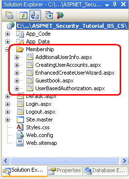
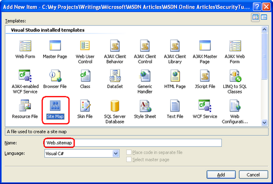
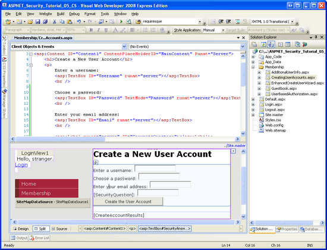
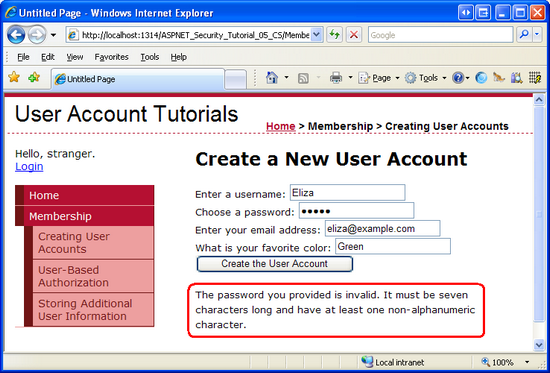
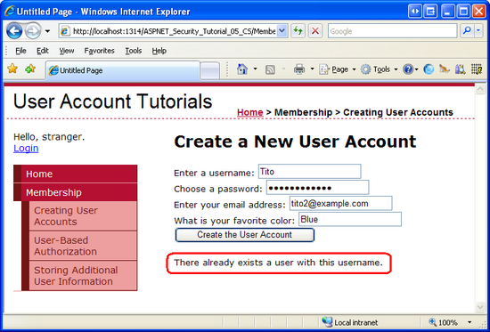
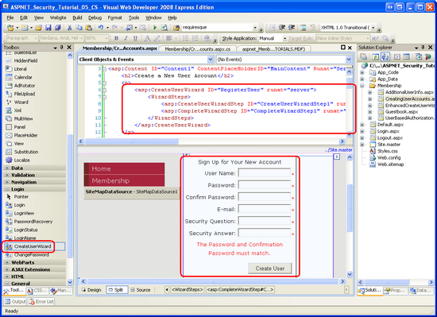
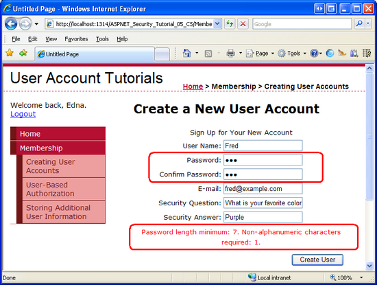
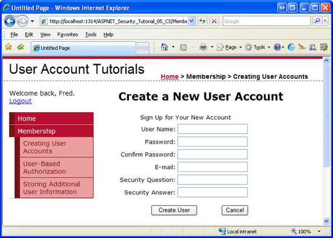

Creating User Accounts (C#)
====================
by [Scott Mitchell](https://twitter.com/ScottOnWriting)

[Download Code](http://download.microsoft.com/download/3/f/5/3f5a8605-c526-4b34-b3fd-a34167117633/ASPNET_Security_Tutorial_05_CS.zip) or [Download PDF](http://download.microsoft.com/download/3/f/5/3f5a8605-c526-4b34-b3fd-a34167117633/aspnet_tutorial05_CreatingUsers_cs.pdf)

> In this tutorial we will explore using the Membership framework (via the SqlMembershipProvider) to create new user accounts. We will see how to create new users programmatically and through ASP.NET's built-in CreateUserWizard control.

## Introduction

In the [preceding tutorial](creating-the-membership-schema-in-sql-server-cs.md) we installed the application services schema in a database, which added the tables, views, and stored procedures needed by the `SqlMembershipProvider` and `SqlRoleProvider`. This created the infrastructure we will need for the remainder of the tutorials in this series. In this tutorial we will explore using the Membership framework (via the `SqlMembershipProvider`) to create new user accounts. We will see how to create new users programmatically and through ASP.NET's built-in CreateUserWizard control.

In addition to learning how to create new user accounts, we will also need to update the demo website we first created in the *[An Overview of Forms Authentication](../introduction/an-overview-of-forms-authentication-cs.md)* tutorial and then enhanced in the *[Forms Authentication Configuration and Advanced Topics](#_msocom_3)* tutorial. Our demo web application has a login page that validates users' credentials against hard-coded username/password pairs. Moreover, `Global.asax` includes code that creates custom `IPrincipal` and `IIdentity` objects for authenticated users. We will update the login page to validate users' credentials against the Membership framework and remove the custom principal and identity logic.

Let's get started!

## The Forms Authentication and Membership Checklist

Before we begin working with the Membership framework, let's take a moment to review the important steps we have taken to reach this point. When using the Membership framework with the `SqlMembershipProvider` in a forms-based authentication scenario, the following steps need to be performed prior to implementing Membership functionality in your web application:

1. **Enable forms-based authentication.** As we discussed in *[An Overview of Forms Authentication](../introduction/an-overview-of-forms-authentication-cs.md)*, forms authentication is enabled by editing `Web.config` and setting the `<authentication>` element's `mode` attribute to `Forms`. With forms authentication enabled, each incoming request is examined for a *forms authentication ticket*, which, if present, identifies the requestor.
2. **Add the application services schema to the appropriate database.** When using the `SqlMembershipProvider` we need to install the application services schema to a database. Usually this schema is added to the same database that holds the application's data model. The *[Creating the Membership Schema in SQL Server](creating-the-membership-schema-in-sql-server-cs.md)* tutorial looked at using the `aspnet_regsql.exe` tool to accomplish this.
3. **Customize the Web Application's Settings to reference the database from step 2.** The *Creating the Membership Schema in SQL Server* tutorial showed two ways to configure the web application so that the `SqlMembershipProvider` would use the database selected in step 2: by modifying the `LocalSqlServer` connection string name; or by adding a new registered provider to the list of Membership framework providers and customizing that new provider to use the database from step 2.

When building a web application that uses the `SqlMembershipProvider` and forms-based authentication, you will need to perform these three steps before using the `Membership` class or the ASP.NET Login Web controls. Since we already performed these steps in previous tutorials, we are ready to start using the Membership framework!

## Step 1: Adding New ASP.NET Pages

In this tutorial and the next three we will be examining various Membership-related functions and capabilities. We will need a series of ASP.NET pages to implement the topics examined throughout these tutorials. Let's create those pages and then a site map file `(Web.sitemap)`.

Start by creating a new folder in the project named `Membership`. Next, add five new ASP.NET pages to the `Membership` folder, linking each page with the `Site.master` master page. Name the pages:

- `CreatingUserAccounts.aspx`
- `UserBasedAuthorization.aspx`
- `EnhancedCreateUserWizard.aspx`
- `AdditionalUserInfo.aspx`
- `Guestbook.aspx`

At this point your project's Solution Explorer should look similar to the screen shot shown in Figure 1.

**Figure 1**: Five New Pages Have Been Added to the `Membership` Folder  ([Click to view full-size image](creating-user-accounts-cs/_static/image3.png))

Each page should, at this point, have the two Content controls, one for each of the master page's ContentPlaceHolders: `MainContent` and `LoginContent`.

[!code-aspx[Main](creating-user-accounts-cs/samples/sample1.aspx)]

Recall that the `LoginContent` ContentPlaceHolder's default markup displays a link to log on or log off the site, depending on whether the user is authenticated. The presence of the `Content2` Content control, however, overrides the master page's default markup. As we discussed in *[An Overview of Forms Authentication](../introduction/an-overview-of-forms-authentication-cs.md)* tutorial, this is useful in pages where we do not want to display login-related options in the left column.

For these five pages, however, we want to show the master page's default markup for the `LoginContent` ContentPlaceHolder. Therefore, remove the declarative markup for the `Content2` Content control. After doing so, each of the five page's markup should contain just one Content control.

## Step 2: Creating the Site Map

All but the most trivial websites need to implement some form of a navigational user interface. The navigation user interface may be a simple list of links to the various sections of the site. Alternatively, these links may be arranged into menus or tree views. As page developers, creating the navigational user interface is only half of the story. We also need some means to define the site's logical structure in a maintainable and updateable fashion. As new pages are added or existing pages removed, we want to be able to update a single source – the site map – and have those modifications reflected across the site's navigational user interface.

These two tasks – defining the site map and implementing a navigational user interface based on the site map – are easy to accomplish thanks to the Site Map framework and the Navigation Web controls added in ASP.NET version 2.0. The Site Map framework allows for a developer to define a site map and then to access it through a programmatic API (the [`SiteMap` class](https://msdn.microsoft.com/en-us/library/system.web.sitemap.aspx)). The built-in Navigation Web controls include a [Menu control](https://msdn.microsoft.com/en-us/library/bz09dy46.aspx), the [TreeView control](https://msdn.microsoft.com/en-us/library/3eafky27.aspx), and the [SiteMapPath control](https://msdn.microsoft.com/en-us/library/3eafky27.aspx).

Like the Membership and Roles frameworks, the Site Map framework is built atop the [provider model](http://aspnet.4guysfromrolla.com/articles/101905-1.aspx). The job of the Site Map provider class is to generate the in-memory structure used by the `SiteMap` class from a persistent data store, such as an XML file or a database table. The .NET Framework ships with a default Site Map provider that reads the site map data from an XML file ([`XmlSiteMapProvider`](https://msdn.microsoft.com/en-us/library/system.web.xmlsitemapprovider.aspx)), and this is the provider we will be using in this tutorial. For some alternate Site Map provider implementations, refer to the Further Readings section at the end of this tutorial.

The default Site Map provider expects a properly-formatted XML file named `Web.sitemap` to exist the root directory. Since we are using this default provider, we need to add such a file and define the site map's structure in the appropriate XML format. To add the file, right-click on the project name in Solution Explorer and choose Add New Item. From the dialog box, opt to add a file of type Site Map named `Web.sitemap`.

**Figure 2**: Add a File Named `Web.sitemap` to the Project's Root Directory  ([Click to view full-size image](creating-user-accounts-cs/_static/image6.png))

The XML site map file defines the website's structure as a hierarchy. This hierarchical relationship is modeled in the XML file via the ancestry of the `<siteMapNode>` elements. The `Web.sitemap` must start with a `<siteMap>` parent node that has precisely one `<siteMapNode>` child. This top-level `<siteMapNode>` element represents the root of the hierarchy, and may have an arbitrary number of descendent nodes. Each `<siteMapNode>` element must include a `title` attribute and may optionally include `url` and `description` attributes, among others; each non-empty `url` attribute must be unique.

Enter the following XML into the `Web.sitemap` file:

[!code-xml[Main](creating-user-accounts-cs/samples/sample2.xml)]

The above site map markup defines the hierarchy shown in Figure 3.

**Figure 3**: The Site Map Represents a Hierarchical Navigational Structure  ([Click to view full-size image](creating-user-accounts-cs/_static/image9.png))

## Step 3: Updating the Master Page to Include a Navigational User Interface

ASP.NET includes a number of navigation-related Web controls for designing a user interface. These include the Menu, TreeView, and the SiteMapPath controls. The Menu and TreeView controls render the site map structure in a menu or a tree, respectively, whereas the SiteMapPath displays a breadcrumb that shows the current node being visited as well as its ancestors. The site map data can be bound to other data Web controls using the SiteMapDataSource and can be accessed programmatically via the `SiteMap` class.

Since a thorough discussion of the Site Map framework and the Navigation controls is beyond the scope of this tutorial series, rather than spend time crafting our own navigational user interface let's instead borrow the one used in my *[Working with Data in ASP.NET 2.0](../../data-access/index.md)* tutorial series, which uses a Repeater control to display a two-deep bulleted list of navigation links, as shown in Figure 4.

### Adding a Two-Level List of Links in the Left Column

To create this interface, add the following declarative markup to the `Site.master` master page's left column where the text "TODO: Menu will go here..." currently resides.

[!code-aspx[Main](creating-user-accounts-cs/samples/sample3.aspx)]

The above markup binds a Repeater control named `menu` to a SiteMapDataSource, which returns the site map hierarchy defined in `Web.sitemap`. Since the SiteMapDataSource control's [`ShowStartingNode` property](https://msdn.microsoft.com/en-us/library/system.web.ui.webcontrols.sitemapdatasource.showstartingnode.aspx) is set to False it starts returning the site map's hierarchy starting with the descendents of the "Home" node. The Repeater displays each of these nodes (currently just "Membership") in an `<li>` element. Another, inner Repeater then displays the current node's children in a nested unordered list.

Figure 4 shows the above markup's rendered output with the site map structure we created in Step 2. The Repeater renders vanilla unordered list markup; the cascading style sheet rules defined in `Styles.css` are responsible for the aesthetically-pleasing layout. For a more detailed description of how the above markup works, refer to the [Master Pages and Site Navigation](https://asp.net/learn/data-access/tutorial-03-cs.aspx) tutorial.

**Figure 4**: The Navigational User Interface is Rendered Using Nested Unordered Lists  ([Click to view full-size image](creating-user-accounts-cs/_static/image12.png))

### Adding Breadcrumb Navigation

In addition to the list of links in the left column, let's also have each page display a [breadcrumb](http://en.wikipedia.org/wiki/Breadcrumb_%28navigation%29). A breadcrumb is a navigational user interface element that quickly shows users their current position within the site hierarchy. The SiteMapPath control uses the Site Map framework to determine the current page's location in the site map and then displays a breadcrumb based on this information.

Specifically, add a `` element to the master page's header `
` element, and set the new `` element's `class` attribute to "breadcrumb". (The `Styles.css` class contains a rule for a "breadcrumb" class.) Next, add a SiteMapPath to this new `` element.

[!code-aspx[Main](creating-user-accounts-cs/samples/sample4.aspx)]

Figure 5 shows the output of the SiteMapPath when visiting `~/Membership/CreatingUserAccounts.aspx`.

**Figure 5**: The Breadcrumb Displays the Current Page and its Ancestors in the Site Map  ([Click to view full-size image](creating-user-accounts-cs/_static/image15.png))

## Step 4: Removing the Custom Principal and Identity Logic

In the *[Forms Authentication Configuration and Advanced Topics](../introduction/forms-authentication-configuration-and-advanced-topics-cs.md)* tutorial we saw how to associate custom principal and identity objects to the authenticated user. We accomplished this by creating an event handler in `Global.asax` for the application's `PostAuthenticateRequest` event, which fires after the `FormsAuthenticationModule` has authenticated the user. In this event handler we replaced the `GenericPrincipal` and `FormsIdentity` objects added by the `FormsAuthenticationModule` with the `CustomPrincipal` and `CustomIdentity` objects we created in that tutorial.

While custom principal and identity objects are useful in certain scenarios, in most cases the `GenericPrincipal` and `FormsIdentity` objects are sufficient. Consequently, I think it would be worthwhile to return to the default behavior. Make this change by either removing or commenting out the `PostAuthenticateRequest` event handler or by deleting the `Global.asax` file entirely.

## Step 5: Programmatically Creating a New User

To create a new user account through the Membership framework use the `Membership` class's [`CreateUser` method](https://msdn.microsoft.com/En-US/library/system.web.security.membership.createuser.aspx). This method has input parameters for the username, password, and other user-related fields. On invocation, it delegates the creation of the new user account to the configured Membership provider and then returns a [`MembershipUser` object](https://msdn.microsoft.com/en-us/library/system.web.security.membershipuser.aspx) representing the just-created user account.

The `CreateUser` method has four overloads, each accepting a different number of input parameters:

- [`CreateUser(username, password)`](https://msdn.microsoft.com/En-US/library/d8t4h2es.aspx)
- [`CreateUser(username, password, email)`](https://msdn.microsoft.com/En-US/library/t8yy6w3h.aspx)
- [`CreateUser(username, password, email, passwordQuestion, passwordAnswer, isApproved, MembershipCreateStatus)`](https://msdn.microsoft.com/En-US/library/82xx2e62.aspx)
- [`CreateUser(username, password, email, passwordQuestion, passwordAnswer, isApproved, providerUserKey, MembershipCreateStatus)`](https://msdn.microsoft.com/En-US/library/ms152012.aspx)

These four overloads differ on the amount of information that is collected. The first overload, for example, requires just the username and password for the new user account, whereas the second one also requires the user's email address.

These overloads exist because the information needed to create a new user account depends on the Membership provider's configuration settings. In the *[Creating the Membership Schema in SQL Server](creating-the-membership-schema-in-sql-server-cs.md)* tutorial we examined specifying Membership provider configuration settings in `Web.config`. Table 2 included a complete list of the configuration settings.

One such Membership provider configuration setting that impacts what `CreateUser` overloads may be used is the `requiresQuestionAndAnswer` setting. If `requiresQuestionAndAnswer` is set to `true` (the default), then when creating a new user account we must specify a security question and answer. This information is later used if the user needs to reset or change their password. Specifically, at that time they are shown the security question and they must enter the correct answer in order to reset or change their password. Consequently, if the `requiresQuestionAndAnswer` is set to `true` then calling either of the first two `CreateUser` overloads results in an exception because the security question and answer are missing. Since our application is currently configured to require a security question and answer, we will need to use one of the latter two overloads when creating user's programmatically.

To illustrate using the `CreateUser` method, let's create a user interface where we prompt the user for their name, password, email, and an answer to a pre-defined security question. Open the `CreatingUserAccounts.aspx` page in the `Membership` folder and add the following Web controls to the Content control:

- A TextBox named `Username`
- A TextBox named `Password`, whose `TextMode` property is set to `Password`
- A TextBox named `Email`
- A Label named `SecurityQuestion` with its `Text` property cleared out
- A TextBox named `SecurityAnswer`
- A Button named `CreateAccountButton` whose Text property is set to "Create the User Account"
- A Label control named `CreateAccountResults` with its `Text` property cleared out

At this point your screen should look similar to the screen shot shown in Figure 6.

**Figure 6**: Add the Various Web Controls to the `CreatingUserAccounts.aspx` Page  ([Click to view full-size image](creating-user-accounts-cs/_static/image18.png))

The `SecurityQuestion` Label and `SecurityAnswer` TextBox are intended to display a pre-defined security question and collect the user's answer. Note that both the security question and answer are stored on a user-by-user basis, so it is possible to allow each user to define their own security question. However, for this example I have decided to use a universal security question, namely: "What is your favorite color?"

To implement this pre-defined security question, add a constant to the page's code-behind class named `passwordQuestion`, assigning it the security question. Then, in the `Page_Load` event handler, assign this constant to the `SecurityQuestion` Label's `Text` property:

[!code-csharp[Main](creating-user-accounts-cs/samples/sample5.cs)]

Next, create an event handler for the `CreateAccountButton`'s `Click` event and add the following code:

[!code-csharp[Main](creating-user-accounts-cs/samples/sample6.cs)]

The `Click` event handler starts by defining a variable named `createStatus` of type [`MembershipCreateStatus`](https://msdn.microsoft.com/En-US/library/system.web.security.membershipcreatestatus.aspx). `MembershipCreateStatus` is an enumeration that indicates the status of the `CreateUser` operation. For example, if the user account is created successfully, the resulting `MembershipCreateStatus` instance will be set to a value of `Success`; on the other hand, if the operation fails because there already exists a user with the same username, it will be set to a value of `DuplicateUserName`. In the `CreateUser` overload we use, we need to pass a `MembershipCreateStatus` instance into the method as an `out` parameter. This parameter is set to the appropriate value within the `CreateUser` method, and we can examine its value after the method call to determine whether the user account was successfully created.

After calling `CreateUser`, passing in `createStatus`, a `switch` statement is used to output an appropriate message depending on the value assigned to `createStatus`. Figures 7 shows the output when a new user has successfully been created. Figures 8 and 9 show the output when the user account is not created. In Figure 8, the visitor entered a five-letter password, which does not meet the password strength requirements spelled out in the Membership provider's configuration settings. In Figure 9, the visitor is attempting to create a user account with an existing username (the one created in Figure 7).

**Figure 7**: A New User Account is Successfully Created  ([Click to view full-size image](creating-user-accounts-cs/_static/image21.png))

**Figure 8**: The User Account is Not Created Because the Supplied Password is Too Weak  ([Click to view full-size image](creating-user-accounts-cs/_static/image24.png))

**Figure 9**: The User Account is Not Created Because the Username is Already in Use  ([Click to view full-size image](creating-user-accounts-cs/_static/image27.png))

> [!NOTE]
> You may be wondering how to determine success or failure when using one of the first two `CreateUser` method overloads, neither of which has a parameter of type `MembershipCreateStatus`. These first two overloads throw a [`MembershipCreateUserException` exception](https://msdn.microsoft.com/en-us/library/system.web.security.membershipcreateuserexception.aspx) in the face of a failure, which includes a [`StatusCode` property](https://msdn.microsoft.com/en-us/library/system.web.security.membershipcreateuserexception.statuscode.aspx) of type `MembershipCreateStatus`.

After creating a few user accounts, verify that the accounts have been created by listing the contents of the `aspnet_Users` and `aspnet_Membership` tables in the `SecurityTutorials.mdf` database. As Figure 10 shows, I have added two users via the `CreatingUserAccounts.aspx` page: Tito and Bruce.

**Figure 10**: There are Two Users in the Membership User Store: Tito and Bruce  ([Click to view full-size image](creating-user-accounts-cs/_static/image30.png))

While the Membership user store now includes Bruce and Tito's account information, we have yet to implement functionality that allows for Bruce or Tito to log on to the site. Currently, `Login.aspx` validates the user's credentials against a hard-coded set of username/password pairs – it does *not* validate the supplied credentials against the Membership framework. For now seeing the new user accounts in the `aspnet_Users` and `aspnet_Membership` tables will have to suffice. In the next tutorial, *[Validating User Credentials Against the Membership User Store](validating-user-credentials-against-the-membership-user-store-cs.md)*, we will update the login page to validate against the Membership store.

> [!NOTE]
> If you do not see any users in your `SecurityTutorials.mdf` database, it may be because your web application is using the default Membership provider, `AspNetSqlMembershipProvider`, which uses the `ASPNETDB.mdf` database as its user store. To determine if this is the problem, click the Refresh button in the Solution Explorer. If a database named `ASPNETDB.mdf` has been added to the `App_Data` folder, this is the problem. Return to Step 4 of the *[Creating the Membership Schema in SQL Server](creating-the-membership-schema-in-sql-server-cs.md)* tutorial for instructions on how to properly configure the Membership provider.

In most create user account scenarios, the visitor is presented with some interface to enter their username, password, email, and other essential information, at which point a new account is created. In this step we looked at building such an interface by hand and then saw how to use the `Membership.CreateUser` method to programmatically add the new user account based on the user's inputs. Our code, however, just created the new user account. It did not perform any follow up actions, like logging in the user to the site under the just-created user account, or sending a confirmation email to the user. These additional steps would require additional code in the Button's `Click` event handler.

ASP.NET ships with the CreateUserWizard control, which is designed to handle the user account creation process, from rendering a user interface for creating new user accounts, to creating the account in the Membership framework and performing post-account creation tasks, such as sending a confirmation email and logging the just-created user into the site. Using the CreateUserWizard control is as simple as dragging the CreateUserWizard control from the Toolbox onto a page, and then setting a few properties. In most cases, you won't need to write a single line of code. We will explore this nifty control in detail in Step 6.

If new user accounts are only created through a typical Create Account web page, it is unlikely that you will ever need to write code that uses the `CreateUser` method, as the CreateUserWizard control will likely meet your needs. However, the `CreateUser` method is handy in scenarios where you need a highly customized Create Account user experience or when you need to programmatically create new user accounts through an alternative interface. For example, you might have a page that allows a user to upload an XML file that contains user information from some other application. The page might parses the contents of the uploaded XML file and create a new account for each user represented in the XML by calling the `CreateUser` method.

## Step 6: Creating a New User with the CreateUserWizard Control

ASP.NET ships with a number of Login Web controls. These controls aid in many common user account- and login-related scenarios. The [CreateUserWizard control](https://quickstarts.asp.net/QuickStartv20/aspnet/doc/ctrlref/login/createuserwizard.aspx) is one such control that is designed to present a user interface for adding a new user account to the Membership framework.

Like many of the other Login-related Web controls, the CreateUserWizard can be used without writing a single line of code. It intuitively provides a user interface based on the Membership provider's configuration settings and internally calls the `Membership` class's `CreateUser` method after the user enters the necessary information and clicks the "Create User" button. The CreateUserWizard control is extremely customizable. There are a host of events that fire during various stages of the account creation process. We can create event handlers, as needed, to inject custom logic into the account creation workflow. Furthermore, the CreateUserWizard's appearance is very flexible. There are a number of properties that define the appearance of the default interface; if necessary, the control can be converted into a template or additional user registration "steps" may be added.

Let's start with a look at using the CreateUserWizard control's default interface and behavior. We'll then explore how to customize the appearance via the control's properties and events.

### Examining the CreateUserWizard's Default Interface and Behavior

Return to the `CreatingUserAccounts.aspx` page in the `Membership` folder, switch to the Design or Split mode, and then add a CreateUserWizard control to the top of the page. The CreateUserWizard control is filed under the Toolbox's Login controls section. After adding the control, set its `ID` property to `RegisterUser`. As the screen shot in Figure 11 shows, the CreateUserWizard renders an interface with textboxes for the new user's username, password, email address, and security question and answer.

**Figure 11**: The CreateUserWizard Control Renders a Generic Create User Interface  ([Click to view full-size image](creating-user-accounts-cs/_static/image33.png))

Let's take a moment to compare the default user interface generated by the CreateUserWizard control with the interface we created in Step 5. For starters, the CreateUserWizard control allows the visitor to specify both the security question and answer, whereas our manually-created interface used a pre-defined security question. The CreateUserWizard control's interface also includes validation controls, whereas we had yet to implement validation on our interface's form fields. And the CreateUserWizard control interface includes a "Confirm Password" textbox (along with a CompareValidator to ensure that the text entered the "Password" and "Compare Password" textboxes are equal).

What's interesting is that the CreateUserWizard control consults the Membership provider's configuration settings when rendering its user interface. For example, the security question and answer textboxes are only displayed if `requiresQuestionAndAnswer` is set to True. Likewise, CreateUserWizard automatically adds a RegularExpressionValidator control to ensure that the password strength requirements are met, and sets its `ErrorMessage` and `ValidationExpression` properties based on the `minRequiredPasswordLength`, `minRequiredNonalphanumericCharacters`, and `passwordStrengthRegularExpression` configuration settings.

The CreateUserWizard control, as its name implies, is derived from the [Wizard control](https://msdn.microsoft.com/en-us/library/s2etd1ek.aspx). Wizard controls are designed to provide an interface for completing multi-step tasks. A Wizard control may have an arbitrary number of `WizardSteps`, each of which is a template that defines the HTML and Web controls for that step. The Wizard control initially displays the first `WizardStep`, along with navigation controls that permit the user to proceed from one step to the next, or to return to previous steps.

As the declarative markup in Figure 11 shows, the CreateUserWizard control's default interface includes two `WizardSteps:`

- [`CreateUserWizardStep`](https://msdn.microsoft.com/en-us/library/system.web.ui.webcontrols.createuserwizardstep.aspx) – renders the interface to collect information for creating the new user account. This is the step shown in Figure 11.
- [`CompleteWizardStep`](https://msdn.microsoft.com/en-us/library/system.web.ui.webcontrols.completewizardstep.aspx) – renders a message indicating that the account has successfully been created.

The CreateUserWizard's appearance and behavior can be modified by converting either of these steps to templates, or by adding your own `WizardSteps`. We will look at adding a `WizardStep` to the registration interface in the *Storing Additional User Information* tutorial.

Let's see the CreateUserWizard control in action. Visit the `CreatingUserAccounts.aspx` page through a browser. Start by entering some invalid values into the CreateUserWizard's interface. Try entering a password that doesn't conform to the password strength requirements, or leaving the "User Name" textbox empty. The CreateUserWizard will display an appropriate error message. Figure 12 shows the output when attempting to create a user with an insufficiently strong password.

**Figure 12**: The CreateUserWizard Automatically Injects Validation Controls  ([Click to view full-size image](creating-user-accounts-cs/_static/image36.png))

Next, enter appropriate values into the CreateUserWizard and click the "Create User" button. Assuming the required fields have been entered and the password's strength is sufficient, the CreateUserWizard will create a new user account through the Membership framework and then display the `CompleteWizardStep`'s interface (see Figure 13). Behind the scenes, the CreateUserWizard calls the `Membership.CreateUser` method, just like we did in Step 5.

**Figure 13**: A New User Account has Successfully Been Created  ([Click to view full-size image](creating-user-accounts-cs/_static/image39.png))

> [!NOTE]
> As Figure 13 shows, the `CompleteWizardStep`'s interface includes a Continue button. However, at this point clicking it just performs a postback, leaving the visitor on the same page. In the "Customizing the CreateUserWizard's Appearance and Behavior Through Its Properties" section we will look at how you can have this button send the visitor to `Default.aspx` (or some other page).

After creating a new user account, return to Visual Studio and examine the `aspnet_Users` and `aspnet_Membership` tables like we did in Figure 10 to verify that the account was successfully created.

### Customizing the CreateUserWizard's Behavior and Appearance Through Its Properties

The CreateUserWizard can be customized in a variety of ways, through properties, `WizardSteps`, and event handlers. In this section we will look at how to customize the control's appearance through its properties; the next section looks at extending the control's behavior through event handlers.

Virtually all of the text displayed in the CreateUserWizard control's default user interface can be customized through its plethora of properties. For example, the "User Name", "Password", "Confirm Password", "E-mail", "Security Question", and "Security Answer" labels displayed to the left of the textboxes can be customized by the [`UserNameLabelText`](https://msdn.microsoft.com/en-us/library/system.web.ui.webcontrols.createuserwizard.usernamelabeltext.aspx), [`PasswordLabelText`](https://msdn.microsoft.com/en-us/library/system.web.ui.webcontrols.createuserwizard.passwordlabeltext.aspx), [`ConfirmPasswordLabelText`](https://msdn.microsoft.com/en-us/library/system.web.ui.webcontrols.createuserwizard.confirmpasswordlabeltext.aspx), [`EmailLabelText`](https://msdn.microsoft.com/en-us/library/system.web.ui.webcontrols.createuserwizard.emaillabeltext.aspx), [`QuestionLabelText`](https://msdn.microsoft.com/en-us/library/system.web.ui.webcontrols.createuserwizard.questionlabeltext.aspx), and [`AnswerLabelText`](https://msdn.microsoft.com/en-us/library/system.web.ui.webcontrols.createuserwizard.answerlabeltext.aspx) properties, respectively. Likewise, there are properties for specifying the text for the "Create User" and "Continue" buttons in the `CreateUserWizardStep` and `CompleteWizardStep`, as well as if these buttons are rendered as Buttons, LinkButtons, or ImageButtons.

The colors, borders, fonts, and other visual elements are configurable through a host of style properties. The CreateUserWizard control itself has the common Web control style properties – `BackColor`, `BorderStyle`, `CssClass`, `Font`, and so on – and there are a number of style properties for defining the appearance for particular sections of the CreateUserWizard's interface. The [`TextBoxStyle` property](https://msdn.microsoft.com/en-us/library/system.web.ui.webcontrols.createuserwizard.textboxstyle.aspx), for instance, defines the styles for the textboxes in the `CreateUserWizardStep`, while the [`TitleTextStyle` property](https://msdn.microsoft.com/en-us/library/system.web.ui.webcontrols.createuserwizard.titletextstyle.aspx) defines the style for the title ("Sign Up for Your New Account").

In addition to the appearance-related properties, there are a number of properties that affect the CreateUserWizard control's behavior. The [`DisplayCancelButton` property](https://msdn.microsoft.com/en-us/library/system.web.ui.webcontrols.wizard.displaycancelbutton.aspx), if set to True, displays a Cancel button next to the "Create User" button (the default value is False). If you display the Cancel button, be sure to also set the [`CancelDestinationPageUrl` property](https://msdn.microsoft.com/en-us/library/system.web.ui.webcontrols.createuserwizard.continuedestinationpageurl.aspx), which specifies the page the user is sent to after clicking Cancel. As noted in the previous section, the Continue button in the `CompleteWizardStep`'s interface causes a postback, but leaves the visitor on the same page. To send the visitor to some other page after clicking the Continue button, simply specify the URL in the [`ContinueDestinationPageUrl` property](https://msdn.microsoft.com/en-us/library/system.web.ui.webcontrols.createuserwizard.continuedestinationpageurl.aspx).

Let's update the `RegisterUser` CreateUserWizard control to show a Cancel button and to send the visitor to `Default.aspx` when the Cancel or Continue buttons are clicked. To accomplish this, set the `DisplayCancelButton` property to True and both the `CancelDestinationPageUrl` and `ContinueDestinationPageUrl` properties to "~/Default.aspx". Figure 14 shows the updated CreateUserWizard when viewed through a browser.

**Figure 14**: The `CreateUserWizardStep` Includes a Cancel Button  ([Click to view full-size image](creating-user-accounts-cs/_static/image42.png))

When a visitor enters a username, password, email address, and security question and answer and clicks "Create User," a new user account is created and the visitor is logged in as that newly created user. Assuming that the person visiting the page is creating a new account for themselves, this is likely the desired behavior. However, you may want to allow Administrators to add new user accounts. In doing so, the user account would be created, but the Administrator would remain logged in as an Administrator (and not as the newly created account). This behavior can be modified through the Boolean [`LoginCreatedUser` property](https://msdn.microsoft.com/en-us/library/system.web.ui.webcontrols.createuserwizard.logincreateduser.aspx).

User accounts in the Membership framework contain an approved flag; users who are not approved are unable to log into the site. By default, a newly created account is marked as approved, allowing the user to log into the site immediately. It is possible, however, to have new user accounts marked as unapproved. Perhaps you want an Administrator to manually approve new users before they can log in; or maybe you want to verify that the email address entered at signup is valid before permitting a user to log on. Whatever the case may be, you can have the newly created user account marked as unapproved by setting the CreateUserWizard control's [`DisableCreatedUser` property](https://msdn.microsoft.com/en-us/library/system.web.ui.webcontrols.createuserwizard.disablecreateduser.aspx) to True (the default is False).

Other behavior-related properties of note include `AutoGeneratePassword` and `MailDefinition`. If the [`AutoGeneratePassword` property](https://msdn.microsoft.com/en-us/library/system.web.ui.webcontrols.createuserwizard.autogeneratepassword.aspx) is set to True, the `CreateUserWizardStep` does not display the "Password" and "Confirm Password" textboxes; instead, the newly-created user's password is automatically generated using the `Membership` class's [`GeneratePassword` method](https://msdn.microsoft.com/en-us/library/system.web.security.membership.generatepassword.aspx). The `GeneratePassword` method constructs a password of a specified length and with a sufficient number of non-alphanumeric characters to satisfy the configured password strength requirements.

The [`MailDefinition` property](https://msdn.microsoft.com/en-us/library/system.web.ui.webcontrols.createuserwizard.maildefinition.aspx) is useful if you want to send an email to the email address specified during the account creation process. The `MailDefinition` property includes a series of subproperties for defining information about the constructed email message. These subproperties include options like `Subject`, `Priority`, `IsBodyHtml`, `From`, `CC`, and `BodyFileName`. The [`BodyFileName` property](https://msdn.microsoft.com/en-us/library/system.web.ui.webcontrols.maildefinition.bodyfilename.aspx) points to a text or HTML file that contains the body for the email message. The body supports two pre-defined placeholders: `<%UserName%>` and `<%Password%>`. These placeholders, if present in the `BodyFileName` file, will be replaced with the just-created user's name and password.

> [!NOTE]
> The `CreateUserWizard` control's `MailDefinition` property just specifies details about the email message that is sent when a new account is created. It does not include any details on how the email message is actually sent (that is, whether an SMTP server or mail drop directory is used, any authentication information, and so on). These low-level details need to be defined in the `<system.net>` section in `Web.config`. For more information on these configuration settings and on sending email from ASP.NET 2.0 in general, refer to the [FAQs at SystemNetMail.com](http://www.systemnetmail.com/) and my article, [Sending Email in ASP.NET 2.0](http://aspnet.4guysfromrolla.com/articles/072606-1.aspx).

### Extending the CreateUserWizard's Behavior Using Event Handlers

The CreateUserWizard control raises a number of events during its workflow. For example, after a visitor enters their username, password, and other pertinent information and clicks the "Create User" button, the CreateUserWizard control raises its [`CreatingUser` event](https://msdn.microsoft.com/en-us/library/system.web.ui.webcontrols.createuserwizard.creatinguser.aspx). If there is a problem during the create process, the [`CreateUserError` event](https://msdn.microsoft.com/en-us/library/system.web.ui.webcontrols.createuserwizard.createusererror.aspx) is fired; however, if the user is successfully created, then the [`CreatedUser` event](https://msdn.microsoft.com/en-us/library/system.web.ui.webcontrols.createuserwizard.createduser.aspx) is raised. There are additional CreateUserWizard control events that get raised, but these are the three most germane ones.

In certain scenarios we may want to tap into the CreateUserWizard workflow, which we can do by creating an event handler for the appropriate event. To illustrate this, let's enhance the `RegisterUser` CreateUserWizard control to include some custom validation on the username and password. In particular, let's enhance our CreateUserWizard so that usernames cannot contain leading or trailing spaces and the username cannot appear anywhere in the password. In short, we want to prevent someone from creating a username like "Scott ", or having a username/password combination like "Scott" and "Scott.1234".

To accomplish this we will create an event handler for the `CreatingUser` event to perform our extra validation checks. If the supplied data is not valid we need to cancel the creation process. We also need to add a Label Web control to the page to display a message explaining that the username or password is invalid. Start by adding a Label control beneath the CreateUserWizard control, setting its `ID` property to `InvalidUserNameOrPasswordMessage` and its `ForeColor` property to `Red`. Clear out its `Text` property and set its `EnableViewState` and `Visible` properties to False.

[!code-aspx[Main](creating-user-accounts-cs/samples/sample7.aspx)]

Next, create an event handler for the CreateUserWizard control's `CreatingUser` event. To create an event handler, select the control in the Designer and then go to the Properties window. From there, click on the lightning bolt icon and then double-click the appropriate event to create the event handler.

Add the following code to the `CreatingUser` event handler:

[!code-csharp[Main](creating-user-accounts-cs/samples/sample8.cs)]

Note that the username and password entered into the CreateUserWizard control are available through its [`UserName`](https://msdn.microsoft.com/en-us/library/system.web.ui.webcontrols.createuserwizard.username.aspx) and [`Password` properties](https://msdn.microsoft.com/en-us/library/system.web.ui.webcontrols.createuserwizard.password.aspx), respectively. We use these properties in the above event handler to determine whether the supplied username contains leading or trailing spaces and whether the username is found within the password. If either of these conditions is met, an error message is displayed in the `InvalidUserNameOrPasswordMessage` Label and the event handler's `e.Cancel` property is set to `true`. If `e.Cancel` is set to `true`, the CreateUserWizard short-circuits its workflow, effectively cancelling the user account creation process.

Figure 15 shows a screen shot of `CreatingUserAccounts.aspx` when the user enters a username with leading spaces.

**Figure 15**: Usernames with Leading or Trailing Spaces are not Permitted  ([Click to view full-size image](creating-user-accounts-cs/_static/image45.png))

> [!NOTE]
> We will see an example of using the CreateUserWizard control's `CreatedUser` event in the *[Storing Additional User Information](storing-additional-user-information-cs.md)* tutorial.

## Summary

The `Membership` class's `CreateUser` method creates a new user account in the Membership framework. It does so by delegating the call to the configured Membership provider. In the case of the `SqlMembershipProvider`, the `CreateUser` method adds a record to the `aspnet_Users` and `aspnet_Membership` database tables.

While new user accounts can be created programmatically (as we saw in Step 5), a faster and easier approach is to use the CreateUserWizard control. This control renders a multi-step user interface for collecting user information and creating a new user in the Membership framework. Underneath the covers, this control uses the same `Membership.CreateUser` method as examined in Step 5, but the control creates the user interface, validation controls, and responds to user account creation errors without having to write a lick of code.

At this point we have the functionality in place to create new user accounts. However, the login page still is validating against those hard-coded credentials we specified back in the second tutorial. In the [next tutorial](validating-user-credentials-against-the-membership-user-store-cs.md) we will update `Login.aspx` to validate the user's supplied credentials against the Membership framework.

Happy Programming!

### Further Reading

For more information on the topics discussed in this tutorial, refer to the following resources:

- [`CreateUser` Technical Documentation](https://msdn.microsoft.com/En-US/library/system.web.security.membershipprovider.createuser.aspx)
- [CreateUserWizard Control Overview](https://quickstarts.asp.net/QuickStartv20/aspnet/doc/ctrlref/login/createuserwizard.aspx)
- [Creating a File System-Based Site Map Provider](http://aspnet.4guysfromrolla.com/articles/020106-1.aspx)
- [Creating a Step-by-Step User Interface with the ASP.NET 2.0 Wizard Control](http://aspnet.4guysfromrolla.com/articles/061406-1.aspx)
- [Examining ASP.NET 2.0's Site Navigation](http://aspnet.4guysfromrolla.com/articles/111605-1.aspx)
- [Master Pages and Site Navigation](https://asp.net/learn/data-access/tutorial-03-vb.aspx)
- [The SQL Site Map Provider You've Been Waiting For](https://msdn.microsoft.com/msdnmag/issues/06/02/WickedCode/default.aspx)

### About the Author

Scott Mitchell, author of multiple ASP/ASP.NET books and founder of 4GuysFromRolla.com, has been working with Microsoft Web technologies since 1998. Scott works as an independent consultant, trainer, and writer. His latest book is *[Sams Teach Yourself ASP.NET 2.0 in 24 Hours](https://www.amazon.com/exec/obidos/ASIN/0672327384/4guysfromrollaco)*. Scott can be reached at [mitchell@4guysfromrolla.com](mailto:mitchell@4guysfromrolla.com) or via his blog at [http://ScottOnWriting.NET](http://scottonwriting.net/).

### Special Thanks To…

This tutorial series was reviewed by many helpful reviewers. Lead reviewer for this tutorial was Teresa Murphy. Interested in reviewing my upcoming MSDN articles? If so, drop me a line at [mitchell@4GuysFromRolla.com](mailto:mitchell@4GuysFromRolla.com).

>[!div class="step-by-step"]
[Previous](creating-the-membership-schema-in-sql-server-cs.md)
[Next](validating-user-credentials-against-the-membership-user-store-cs.md)