Storing Additional User Information (C#)
====================
by [Scott Mitchell](https://twitter.com/ScottOnWriting)

[Download Code](http://download.microsoft.com/download/3/f/5/3f5a8605-c526-4b34-b3fd-a34167117633/ASPNET_Security_Tutorial_08_CS.zip) or [Download PDF](http://download.microsoft.com/download/3/f/5/3f5a8605-c526-4b34-b3fd-a34167117633/aspnet_tutorial08_ExtraUserInfo_cs.pdf)

> In this tutorial we will answer this question by building a very rudimentary guestbook application. In doing so, we will look at different options for modeling user information in a database, and then see how to associate this data with the user accounts created by the Membership framework.

## Introduction

ASP.NET's Membership framework offers a flexible interface for managing users. The Membership API includes methods for validating credentials, retrieving information about the currently logged on user, creating a new user account, and deleting a user account, among others. Each user account in the Membership framework contains only the properties needed for validating credentials and performing essential user account-related tasks. This is evidenced by the methods and properties of the [`MembershipUser` class](https://msdn.microsoft.com/en-us/library/system.web.security.membershipuser.aspx), which models a user account in the Membership framework. This class has properties like [`UserName`](https://msdn.microsoft.com/en-us/library/system.web.security.membershipuser.username.aspx), [`Email`](https://msdn.microsoft.com/en-us/library/system.web.security.membershipuser.email.aspx), and [`IsLockedOut`](https://msdn.microsoft.com/en-us/library/system.web.security.membershipuser.islockedout.aspx), and methods like [`GetPassword`](https://msdn.microsoft.com/en-us/library/system.web.security.membershipuser.getpassword.aspx) and [`UnlockUser`](https://msdn.microsoft.com/en-us/library/system.web.security.membershipuser.unlockuser.aspx).

Oftentimes, applications need to store additional user information not included in the Membership framework. For example, an online retailer might need to let each user store her shipping and billing addresses, payment information, delivery preferences, and contact phone number. Furthermore, each order in the system is associated with a particular user account.

The `MembershipUser` class does not include properties like `PhoneNumber` or `DeliveryPreferences` or `PastOrders`. So how do we track the user information needed by the application and have it integrate with the Membership framework? In this tutorial we will answer this question by building a very rudimentary guestbook application. In doing so, we will look at different options for modeling user information in a database, and then see how to associate this data with the user accounts created by the Membership framework. Let's get started!

## Step 1: Creating the Guestbook Application's Data Model

There are a variety of techniques that can be employed to capture user information in a database and associate it with the user accounts created by the Membership framework. In order to illustrate these techniques, we will need to augment the tutorial web application so that it captures some sort of user-related data. (Currently, the application's data model contains only the application services tables needed by the `SqlMembershipProvider`.)

Let's create a very simple guestbook application where an authenticated user can leave a comment. In addition to storing guestbook comments, let's allow each user to store his home town, homepage, and signature. If provided, the user's home town, homepage, and signature will appear on each message he has left in the guestbook.

### Adding the`GuestbookComments`Table

In order to capture the guestbook comments, we need to create a database table named `GuestbookComments` that has columns like `CommentId`, `Subject`, `Body`, and `CommentDate`. We also need to have each record in the `GuestbookComments` table reference the user who left the comment.

To add this table to our database, go to the Database Explorer in Visual Studio and drill down into the `SecurityTutorials` database. Right-click on the Tables folder and choose Add New Table. This brings up an interface that allows us to define the columns for the new table.

[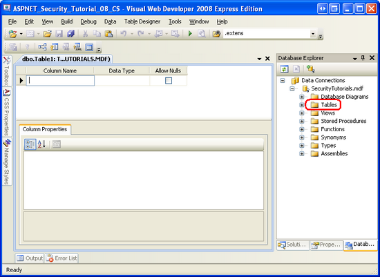](storing-additional-user-information-cs/_static/image1.png)

**Figure 1**: Add a New Table to the `SecurityTutorials` Database  ([Click to view full-size image](storing-additional-user-information-cs/_static/image3.png))

Next, define the `GuestbookComments`'s columns. Start by adding a column named `CommentId` of type `uniqueidentifier`. This column will uniquely identify each comment in the guestbook, so disallow `NULL` s and mark it as the table's primary key. Rather than providing a value for the `CommentId` field on each `INSERT`, we can indicate that a new `uniqueidentifier` value should be automatically generated for this field on `INSERT` by setting the column's default value to `NEWID()`. After adding this first field, marking it as the primary key, and settings its default value, your screen should look similar to the screen shot shown in Figure 2.

[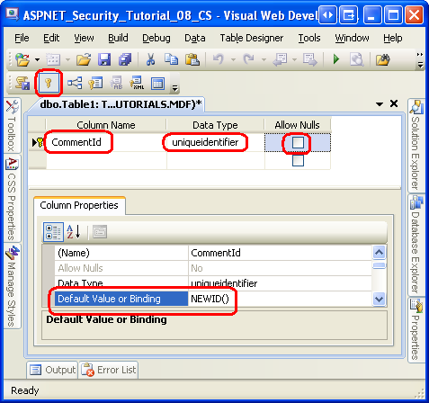](storing-additional-user-information-cs/_static/image4.png)

**Figure 2**: Add a Primary Column Named `CommentId` ([Click to view full-size image](storing-additional-user-information-cs/_static/image6.png))

Next, add a column named `Subject` of type `nvarchar(50)` and a column named `Body` of type `nvarchar(MAX)`, disallowing `NULL` s in both columns. Following that, add a column named `CommentDate` of type `datetime`. Disallow `NULL` s and set the `CommentDate` column's default value to `getdate()`.

All that remains is to add a column that associates a user account with each guestbook comment. One option would be to add a column named `UserName` of type `nvarchar(256)`. This is a suitable choice when using a Membership provider other than the `SqlMembershipProvider`. But when using the `SqlMembershipProvider`, as we are in this tutorial series, the `UserName` column in the `aspnet_Users` table is not guaranteed to be unique. The `aspnet_Users` table's primary key is `UserId` and is of type `uniqueidentifier`. Therefore, the `GuestbookComments` table needs a column named `UserId` of type `uniqueidentifier` (disallowing `NULL` values). Go ahead and add this column.

> [!NOTE]
> As we discussed in the [*Creating the Membership Schema in SQL Server*](creating-the-membership-schema-in-sql-server-cs.md) tutorial, the Membership framework is designed to enable multiple web applications with different user accounts to share the same user store. It does this by partitioning user accounts into different applications. And while each username is guaranteed to be unique within an application, the same username may be used in different applications using the same user store. There is a composite `UNIQUE` constraint in the `aspnet_Users` table on the `UserName` and `ApplicationId` fields, but not one on just the `UserName` field. Consequently, it is possible for the aspnet\_Users table to have two (or more) records with the same `UserName` value. There is, however, a `UNIQUE` constraint on the `aspnet_Users` table's `UserId` field (since it is the primary key). A `UNIQUE` constraint is important because without it we cannot establish a foreign key constraint between the `GuestbookComments` and `aspnet_Users` tables.

After adding the `UserId` column, save the table by clicking on the Save icon in the Toolbar. Name the new table `GuestbookComments`.

We have one last issue to attend to with the `GuestbookComments` table: we need to create a [foreign key constraint](https://msdn.microsoft.com/en-us/library/ms175464.aspx) between the `GuestbookComments.UserId` column and the `aspnet_Users.UserId` column. To achieve this, click the Relationship icon in the Toolbar to launch the Foreign Key Relationships dialog box. (Alternatively, you can launch this dialog box by going to the Table Designer menu and choosing Relationships.)

Click the Add button in the lower left corner of the Foreign Key Relationships dialog box. This will add a new foreign key constraint, although we still need to define the tables that participate in the relationship.

[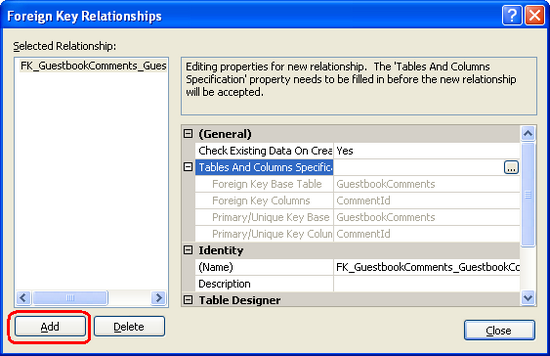](storing-additional-user-information-cs/_static/image7.png)

**Figure 3**: Use the Foreign Key Relationships Dialog Box to Manage a Table's Foreign Key Constraints  ([Click to view full-size image](storing-additional-user-information-cs/_static/image9.png))

Next, click the ellipses icon in the "Table and Columns Specifications" row on the right. This will launch the Tables and Columns dialog box, from which we can specify the primary key table and column and the foreign key column from the `GuestbookComments` table. In particular, select `aspnet_Users` and `UserId` as the primary key table and column, and `UserId` from the `GuestbookComments` table as the foreign key column (see Figure 4). After defining the primary and foreign key tables and columns, click OK to return to the Foreign Key Relationships dialog box.

**Figure 4**: Establish a Foreign Key Constraint Between the `aspnet_Users` and `GuesbookComments` Tables  ([Click to view full-size image](storing-additional-user-information-cs/_static/image12.png))

At this point the foreign key constraint has been established. The presence of this constraint ensures [relational integrity](http://en.wikipedia.org/wiki/Referential_integrity) between the two tables by guaranteeing that there will never be a guestbook entry referring to a non-existent user account. By default, a foreign key constraint will disallow a parent record to be deleted if there are corresponding child records. That is, if a user makes one or more guestbook comments, and then we attempt to delete that user account, the delete will fail unless his guestbook comments are deleted first.

Foreign key constraints can be configured to automatically delete the associated child records when a parent record is deleted. In other words, we can setup this foreign key constraint so that a user's guestbook entries are automatically deleted when her user account is deleted. To accomplish this, expand the "INSERT And UPDATE Specification" section and set the "Delete Rule" property to Cascade.

[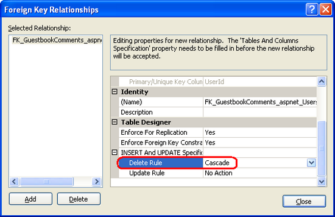](storing-additional-user-information-cs/_static/image13.png)

**Figure 5**: Configure the Foreign Key Constraint to Cascade Deletes  ([Click to view full-size image](storing-additional-user-information-cs/_static/image15.png))

To save the foreign key constraint, click the Close button to exit out of the Foreign Key Relationships. Then click the Save icon in the Toolbar to save the table and the this relationship.

### Storing the User's Home Town, Homepage, and Signature

The `GuestbookComments` table illustrates how to store information that shares a one-to-many relationship with user accounts. Since each user account may have an arbitrary number of associated comments, this relationship is modeled by creating a table to hold the set of comments that includes a column that links back each comment to a particular user. When using the `SqlMembershipProvider`, this link is best established by creating a column named `UserId` of type `uniqueidentifier` and a foreign key constraint between this column and `aspnet_Users.UserId`.

We now need to associate three columns with each user account to store the user's home town, homepage, and signature, which will appear in his guestbook comments. There are number of different ways to accomplish this:

- **Add new columns to the****`aspnet_Users`****or****`aspnet_Membership`****tables.** I would not recommend this approach because it modifies the schema used by the `SqlMembershipProvider`. This decision may come back to haunt you down the road. For example, what if a future version of ASP.NET uses a different `SqlMembershipProvider` schema. Microsoft may include a tool to migrate the ASP.NET 2.0 `SqlMembershipProvider` data to the new schema, but if you have modified the ASP.NET 2.0 `SqlMembershipProvider` schema, such a conversion may not be possible.

- **Use ASP.NET's Profile framework, defining a profile property for the home town, homepage, and signature.** ASP.NET includes a Profile framework that is designed to store additional user-specific data. Like the Membership framework, the Profile framework is built atop the provider model. The .NET Framework ships with a `SqlProfileProvider` sthat stores profile data in a SQL Server database. In fact, our database already has the table used by the `SqlProfileProvider` (`aspnet_Profile`), as it was added when we added the application services back in the [*Creating the Membership Schema in SQL Server*](creating-the-membership-schema-in-sql-server-cs.md) tutorial.   
 The main benefit of the Profile framework is that it allows for developers to define the profile properties in `Web.config` – no code needs to be written to serialize the profile data to and from the underlying data store. In short, it is incredibly easy to define a set of profile properties and to work with them in code. However, the Profile system leaves a lot to be desired when it comes to versioning, so if you have an application where you expect new user-specific properties to be added at a later time, or existing ones to be removed or modified, then the Profile framework may not be the best option. Moreover, the `SqlProfileProvider` stores the profile properties in a highly denormalized fashion, making it next to impossible to run queries directly against the profile data (such as, how many users have a home town of New York).   
 For more information on the Profile framework, consult the "Further Readings" section at the end of this tutorial.

- **Add these three columns to a new table in the database and establish a one-to-one relationship between this table and****`aspnet_Users`****.** This approach involves a bit more work than with the Profile framework, but offers maximum flexibility in how the additional user properties are modeled in the database. This is the option we will use in this tutorial.

We will create a new table called `UserProfiles` to save the home town, homepage, and signature for each user. Right-click on the Tables folder in the Database Explorer window and choose to create a new table. Name the first column `UserId` and set its type to `uniqueidentifier`. Disallow `NULL` values and mark the column as a primary key. Next, add columns named: `HomeTown` of type `nvarchar(50)`; `HomepageUrl` of type `nvarchar(100)`; and Signature of type `nvarchar(500)`. Each of these three columns can accept a `NULL` value.

**Figure 6**: Create the `UserProfiles` Table  ([Click to view full-size image](storing-additional-user-information-cs/_static/image18.png))

Save the table and name it `UserProfiles`. Lastly, establish a foreign key constraint between the `UserProfiles` table's `UserId` field and the `aspnet_Users.UserId` field. As we did with the foreign key constraint between the `GuestbookComments` and `aspnet_Users` tables, have this constraint cascade deletes. Since the `UserId` field in `UserProfiles` is the primary key, this ensures that there will be no more than one record in the `UserProfiles` table for each user account. This type of relationship is referred to as one-to-one.

Now that we have the data model created, we are ready to use it. In Steps 2 and 3 we will look at how the currently logged on user can view and edit their home town, homepage, and signature information. In Step 4 we will create the interface for authenticated users to submit new comments to the guestbook and view the existing ones.

## Step 2: Displaying the User's Home Town, Homepage, and Signature

There are a variety of ways to allow the currently logged on user to view and edit his home town, homepage, and signature information. We could manually create the user interface with TextBox and Label controls or we could use one of the data Web controls, such as the DetailsView control. To perform the database `SELECT` and `UPDATE` statements we could write ADO.NET code in our page's code-behind class or, alternatively, employ a declarative approach with the SqlDataSource. Ideally our application would contain a tiered architecture, which we could either invoke programmatically from the page's code-behind class or declaratively via the ObjectDataSource control.

Since this tutorial series focuses on forms authentication, authorization, user accounts, and roles, there will not be a thorough discussion of these different data access options or why a tiered architecture is preferred over executing SQL statements directly from the ASP.NET page. I am going to walk through using a DetailsView and SqlDataSource – the quickest and easiest option – but the concepts discussed can certainly be applied to alternative Web controls and data access logic. For more information on working with data in ASP.NET, refer to my *[Working with Data in ASP.NET 2.0](../../data-access/index.md)* tutorial series.

Open the `AdditionalUserInfo.aspx` page in the `Membership` folder and add a DetailsView control to the page, setting its `ID` property to `UserProfile` and clearing out its `Width` and `Height` properties. Expand the DetailsView's Smart Tag and choose to bind it to a new data source control. This will launch the DataSource Configuration Wizard (see Figure 7). The first step asks you to specify the data source type. Since we are going to connect directly to the `SecurityTutorials` database, choose the Database icon, specifying the `ID` as `UserProfileDataSource`.

**Figure 7**: Add a New SqlDataSource Control Named `UserProfileDataSource` ([Click to view full-size image](storing-additional-user-information-cs/_static/image21.png))

The next screen prompts for the database to use. We have already defined a connection string in `Web.config` for the `SecurityTutorials` database. This connection string name – `SecurityTutorialsConnectionString` – should be in the drop-down list. Select this option and click Next.

**Figure 8**: Choose `SecurityTutorialsConnectionString` from the Drop-Down List  ([Click to view full-size image](storing-additional-user-information-cs/_static/image24.png))

The subsequent screen asks us to specify the table and columns to query. Choose the `UserProfiles` table from the drop-down list and check all of the columns.

**Figure 9**: Bring Back All of the Columns from the `UserProfiles` Table  ([Click to view full-size image](storing-additional-user-information-cs/_static/image27.png))

The current query in Figure 9 returns *all* of the records in `UserProfiles`, but we are only interested in the currently logged on user's record. To add a `WHERE` clause, click the `WHERE` button to bring up the Add `WHERE` Clause dialog box (see Figure 10). Here you can select the column to filter on, the operator, and the source of the filter parameter. Select `UserId` as the column and "=" as the Operator.

Unfortunately there is no built-in parameter source to return the currently logged on user's `UserId` value. We will need to grab this value programmatically. Therefore, set the Source drop-down list to "None," click the Add button to add the parameter, and then click OK.

[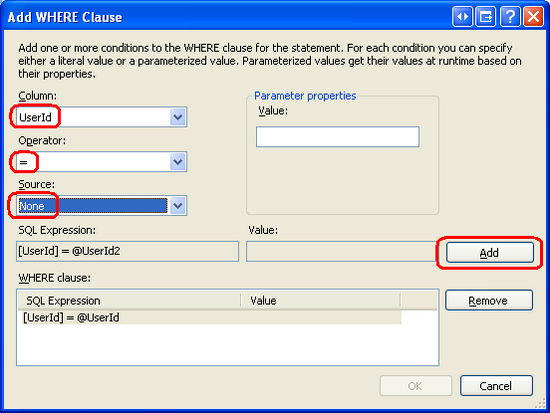](storing-additional-user-information-cs/_static/image28.png)

**Figure 10**: Add a Filter Parameter on the `UserId` Column  ([Click to view full-size image](storing-additional-user-information-cs/_static/image30.png))

After clicking OK you will be returned to the screen shown in Figure 9. This time, however, the SQL query at the bottom of the screen should include a `WHERE` clause. Click Next to move on to the "Test Query" screen. Here you can run the query and see the results. Click Finish to complete the wizard.

Upon completing the DataSource Configuration Wizard, Visual Studio creates the SqlDataSource control based on the settings specified in the wizard. Moreover, it manually adds BoundFields to the DetailsView for each column returned by the SqlDataSource's `SelectCommand`. There's no need to show the `UserId` field in the DetailsView, since the user does not need to know this value. You can remove this field directly from the DetailsView control's declarative markup or by clicking the "Edit Fields" link from its Smart Tag.

At this point your page's declarative markup should look similar to the following:

[!code-aspx[Main](storing-additional-user-information-cs/samples/sample1.aspx)]

We need to programmatically set the SqlDataSource control's `UserId` parameter to the currently logged in user's `UserId` before the data is selected. This can be accomplished by creating an event handler for the SqlDataSource's `Selecting` event and adding the following code there:

[!code-csharp[Main](storing-additional-user-information-cs/samples/sample2.cs)]

The above code starts by obtaining a reference to the currently logged on user by calling the `Membership` class's `GetUser` method. This returns a `MembershipUser` object, whose `ProviderUserKey` property contains the `UserId`. The `UserId` value is then assigned to the SqlDataSource's `@UserId` parameter.

> [!NOTE]
> The `Membership.GetUser()` method returns information about the currently logged on user. If an anonymous user is visiting the page, it will return a value of `null`. In such a case, this will lead to a `NullReferenceException` on the following line of code when attempting to read the `ProviderUserKey` property. Of course, we don't have to worry about `Membership.GetUser()` returning a `null` value in the `AdditionalUserInfo.aspx` page because we configured URL authorization in a previous tutorial so that only authenticated users could access the ASP.NET resources in this folder. If you need to access information about the currently logged on user in a page where anonymous access is permitted, make sure to check that a non-`null MembershipUser` object is returned from the `GetUser()` method before referencing its properties.

If you visit the `AdditionalUserInfo.aspx` page through a browser you will see a blank page because we have yet to add any rows to the `UserProfiles` table. In Step 6 we will look at how to customize the CreateUserWizard control to automatically add a new row to the `UserProfiles` table when a new user account is created. For now, however, we will need to manually create a record in the table.

Navigate to the Database Explorer in Visual Studio and expand the Tables folder. Right-click on the `aspnet_Users` table and choose "Show Table Data" to see the records in the table; do the same thing for the `UserProfiles` table. Figure 11 shows these results when tiled vertically. In my database there are currently `aspnet_Users` records for Bruce, Fred, and Tito, but no records in the `UserProfiles` table.

[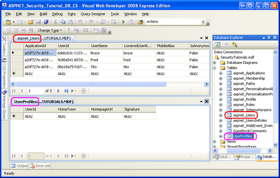](storing-additional-user-information-cs/_static/image31.png)

**Figure 11**: The Contents of the `aspnet_Users` and `UserProfiles` Tables are Displayed  ([Click to view full-size image](storing-additional-user-information-cs/_static/image33.png))

Add a new record to the `UserProfiles` table by manually typing in values for the `HomeTown`, `HomepageUrl`, and `Signature` fields. The easiest way to get a valid `UserId` value in the new `UserProfiles` record is to select the `UserId` field from a particular user account in the `aspnet_Users` table and copy and paste it into the `UserId` field in `UserProfiles`. Figure 12 shows the `UserProfiles` table after a new record has been added for Bruce.

[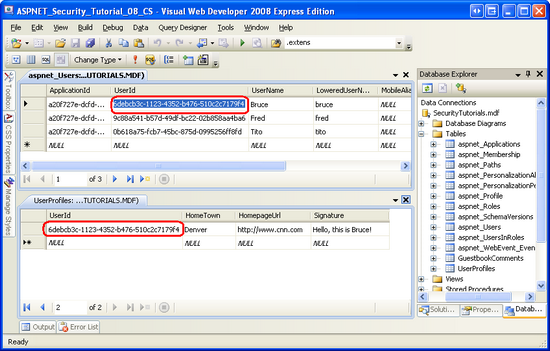](storing-additional-user-information-cs/_static/image34.png)

**Figure 12**: A Record was Added to `UserProfiles` for Bruce  ([Click to view full-size image](storing-additional-user-information-cs/_static/image36.png))

Return to the `AdditionalUserInfo.aspx` page, logged in as Bruce. As Figure 13 shows, Bruce's settings are displayed.

**Figure 13**: The Currently Visiting User is Shown His Settings  ([Click to view full-size image](storing-additional-user-information-cs/_static/image39.png))

> [!NOTE]
> Go ahead and manually add records in the `UserProfiles` table for each Membership user. In Step 6 we will look at how to customize the CreateUserWizard control to automatically add a new row to the `UserProfiles` table when a new user account is created.

## Step 3: Allowing the User to Edit His Home Town, Homepage, and Signature

At this point the currently logged in user can view their home town, homepage, and signature setting, but they cannot yet modify them. Let's update the DetailsView control so that the data can be edited.

The first thing we need to do is add an `UpdateCommand` for the SqlDataSource, specifying the `UPDATE` statement to execute and its corresponding parameters. Select the SqlDataSource and, from the Properties window, click on the ellipses next to the UpdateQuery property to bring up the Command and Parameter Editor dialog box. Enter the following `UPDATE` statement into the textbox:

[!code-sql[Main](storing-additional-user-information-cs/samples/sample3.sql)]

Next, click the "Refresh Parameters" button, which will create a parameter in the SqlDataSource control's `UpdateParameters` collection for each of the parameters in the `UPDATE` statement. Leave the source for all of the parameters set to None and click the OK button to complete the dialog box.

**Figure 14**: Specify the SqlDataSource's `UpdateCommand` and `UpdateParameters` ([Click to view full-size image](storing-additional-user-information-cs/_static/image42.png))

Due to the additions we made to the SqlDataSource control, the DetailsView control can now support editing. From the DetailsView's Smart Tag, check the "Enable Editing" checkbox. This adds a CommandField to the control's `Fields` collection with its `ShowEditButton` property set to True. This renders an Edit button when the DetailsView is displayed in read-only mode and Update and Cancel buttons when displayed in edit mode. Rather than requiring the user to click Edit, though, we can have the DetailsView render in an "always editable" state by setting the DetailsView control's [`DefaultMode` property](https://msdn.microsoft.com/en-us/library/system.web.ui.webcontrols.detailsview.defaultmode.aspx) to `Edit`.

With these changes, your DetailsView control's declarative markup should look similar to the following:

[!code-aspx[Main](storing-additional-user-information-cs/samples/sample4.aspx)]

Note the addition of the CommandField and the `DefaultMode` property.

Go ahead and test this page through a browser. When visiting with a user that has a corresponding record in `UserProfiles`, the user's settings are displayed in an editable interface.

**Figure 15**: The DetailsView Renders an Editable Interface  ([Click to view full-size image](storing-additional-user-information-cs/_static/image45.png))

Try changing the values and clicking the Update button. It appears as if nothing happens. There is a postback and the values are saved to the database, but there's no visual feedback that the save occurred.

To remedy this, return to Visual Studio and add a Label control above the DetailsView. Set its `ID` to `SettingsUpdatedMessage`, its `Text` property to "Your settings have been updated," and its `Visible` and `EnableViewState` properties to `false`.

[!code-aspx[Main](storing-additional-user-information-cs/samples/sample5.aspx)]

We need to display the `SettingsUpdatedMessage` Label whenever the DetailsView is updated. To accomplish this, create an event handler for the DetailsView's `ItemUpdated` event and add the following code:

[!code-csharp[Main](storing-additional-user-information-cs/samples/sample6.cs)]

Return to the `AdditionalUserInfo.aspx` page through a browser and update the data. This time, a helpful status message is displayed.

[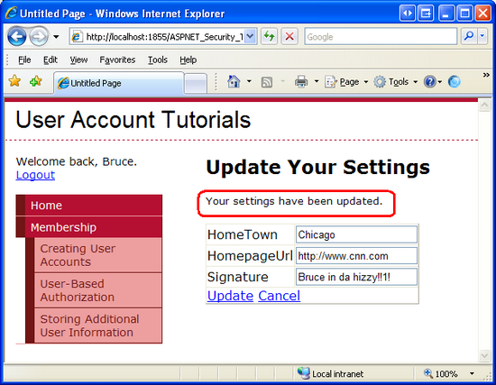](storing-additional-user-information-cs/_static/image46.png)

**Figure 16**: A Short Message is Displayed When the Settings are Updated  ([Click to view full-size image](storing-additional-user-information-cs/_static/image48.png))

> [!NOTE]
> The DetailsView control's editing interface leaves a lot to be desired. It uses standard-sized textboxes, but the Signature field should probably be a multi-line textbox. A RegularExpressionValidator should be used to ensure that the homepage URL, if entered, starts with "http://" or "https://". Moreover, since the DetailsView control has its `DefaultMode` property set to `Edit`, the Cancel button does not do anything. It should either be removed or, when clicked, redirect the user to some other page (such as `~/Default.aspx`). I leave these enhancements as an exercise for the reader.

### Adding a Link to the`AdditionalUserInfo.aspx`Page in the Master Page

Currently, the website does not provide any links to the `AdditionalUserInfo.aspx` page. The only way to reach it is to enter the page's URL directly into the browser's Address bar. Let's add a link to this page in the `Site.master` master page.

Recall that the master page contains a LoginView Web control in its `LoginContent` ContentPlaceHolder that displays different markup for authenticated and anonymous visitors. Update the LoginView control's `LoggedInTemplate` to include a link to the `AdditionalUserInfo.aspx` page. After making these changes the LoginView control's declarative markup should look similar to the following:

[!code-aspx[Main](storing-additional-user-information-cs/samples/sample7.aspx)]

Note the addition of the `lnkUpdateSettings` HyperLink control to the `LoggedInTemplate`. With this link in place, authenticated users can quickly jump to the page to view and modify their home town, homepage, and signature settings.

## Step 4: Adding New Guestbook Comments

The `Guestbook.aspx` page is where authenticated users can view the guestbook and leave a comment. Let's start with creating the interface to add new guestbook comments.

Open the `Guestbook.aspx` page in Visual Studio and construct a user interface consisting of two TextBox controls, one for the new comment's subject and one for its body. Set the first TextBox control's `ID` property to `Subject` and its `Columns` property to 40; set second's `ID` to `Body`, its `TextMode` to `MultiLine`, and its `Width` and `Rows` properties to "95%" and 8, respectively. To complete the user interface, add a Button Web control named `PostCommentButton` and set its `Text` property to "Post Your Comment".

Since each guestbook comment requires a subject and body, add a RequiredFieldValidator for each of the TextBoxes. Set the `ValidationGroup` property of these controls to "EnterComment"; likewise, set the `PostCommentButton` control's `ValidationGroup` property to "EnterComment". For more information on ASP.NET's validation controls, check out [Form Validation in ASP.NET](http://www.4guysfromrolla.com/webtech/090200-1.shtml), [Dissecting the Validation Controls in ASP.NET 2.0](http://aspnet.4guysfromrolla.com/articles/112305-1.aspx), and the [Validation Server Controls Tutorial](http://www.w3schools.com/aspnet/aspnet_refvalidationcontrols.asp) on [W3Schools](http://www.w3schools.com/).

After crafting the user interface your page's declarative markup should look something like the following:

[!code-aspx[Main](storing-additional-user-information-cs/samples/sample8.aspx)]

With the user interface complete, our next task is to insert a new record into the `GuestbookComments` table when the `PostCommentButton` is clicked. This can be accomplished in a number of ways: we can write ADO.NET code in the Button's `Click` event handler; we can add a SqlDataSource control to the page, configure its `InsertCommand`, and then call its `Insert` method from the `Click` event handler; or we could build a middle tier that was responsible for inserting new guestbook comments, and invoke this functionality from the `Click` event handler. Since we looked at using a SqlDataSource in Step 3, let's use ADO.NET code here.

> [!NOTE]
> The ADO.NET classes used to programmatically access data from a Microsoft SQL Server database are located in the `System.Data.SqlClient` namespace. You may need to import this namespace into your page's code-behind class (i.e., `using System.Data.SqlClient;`).

Create an event handler for the `PostCommentButton`'s `Click` event and add the following code:

[!code-csharp[Main](storing-additional-user-information-cs/samples/sample9.cs)]

The `Click` event handler starts by checking that the user-supplied data is valid. If it is not, the event handler exits before inserting a record. Assuming the supplied data is valid, the currently logged on user's `UserId` value is retrieved and stored in the `currentUserId` local variable. This value is needed because we must supply a `UserId` value when inserting a record into `GuestbookComments`.

Following that, the connection string for the `SecurityTutorials` database is retrieved from `Web.config` and the `INSERT` SQL statement is specified. A `SqlConnection` object is then created and opened. Next, a `SqlCommand` object is constructed and the values for the parameters used in the `INSERT` query are assigned. The `INSERT` statement is then executed and the connection closed. At the end of the event handler, the `Subject` and `Body` TextBoxes' `Text` properties are cleared out so that the user's values are not persisted across the postback.

Go ahead and test out this page in a browser. Since this page is in the `Membership` folder it is not accessible to anonymous visitors. Therefore, you will need to first log on (if you have not already). Enter a value into the `Subject` and `Body` TextBoxes and click the `PostCommentButton` button. This will cause a new record to be added to `GuestbookComments`. On postback, the subject and body you provided are wiped from the TextBoxes.

After clicking the `PostCommentButton` button there is no visual feedback that the comment was added to the guestbook. We still need to update this page to display the existing guestbook comments, which we will do in Step 5. Once we accomplish that, the just-added comment will appear in the list of comments, providing adequate visual feedback. For now, confirm that your guestbook comment was saved by examining the contents of the `GuestbookComments` table.

Figure 17 shows the contents of the `GuestbookComments` table after two comments have been left.

[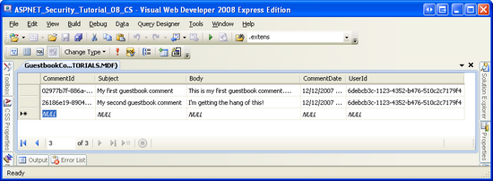](storing-additional-user-information-cs/_static/image49.png)

**Figure 17**: You Can See the Guestbook Comments in the `GuestbookComments` Table  ([Click to view full-size image](storing-additional-user-information-cs/_static/image51.png))

> [!NOTE]
> If a user attempts to insert a guestbook comment that contains potentially dangerous markup – such as HTML – ASP.NET will throw an `HttpRequestValidationException`. To learn more about this exception, why it's thrown, and how to permit users to submit potentially dangerous values, consult the [Request Validation Whitepaper](../../../../whitepapers/request-validation.md).

## Step 5: Listing the Existing Guestbook Comments

In addition to leaving comments, a user visiting the `Guestbook.aspx` page should also be able to view the guestbook's existing comments. To accomplish this, add a ListView control named `CommentList` to the bottom of the page.

> [!NOTE]
> The ListView control is new to ASP.NET version 3.5. It is designed to display a list of items in a very customizable and flexible layout, yet still offer built-in editing, inserting, deleting, paging, and sorting functionality like the GridView. If you are using ASP.NET 2.0, you will need to use the DataList or Repeater control instead. For more information on using the ListView, see [Scott Guthrie](https://weblogs.asp.net/scottgu/)'s blog entry, [The asp:ListView Control](https://weblogs.asp.net/scottgu/archive/2007/08/10/the-asp-listview-control-part-1-building-a-product-listing-page-with-clean-css-ui.aspx), and my article, [Displaying Data with the ListView Control](http://aspnet.4guysfromrolla.com/articles/122607-1.aspx).

Open the ListView's Smart Tag and, from the Choose Data Source drop-down list, bind the control to a new data source. As we saw in Step 2, this will launch the Data Source Configuration Wizard. Select the Database icon, name the resulting SqlDataSource `CommentsDataSource`, and click OK. Next, select the `SecurityTutorialsConnectionString` connection string from the drop-down list and click Next.

At this point in Step 2 we specified the data to query by picking the `UserProfiles` table from the drop-down list and selecting the columns to return (refer back to Figure 9). This time, however, we want to craft a SQL statement that pulls back not only the records from `GuestbookComments`, but also the commenter's home town, homepage, signature, and username. Therefore, select the "Specify a custom SQL statement or stored procedure" radio button and click Next.

This will bring up the "Define Custom Statements or Stored Procedures" screen. Click the Query Builder button to graphically build the query. The Query Builder starts by prompting us to specify the tables we want to query from. Select the `GuestbookComments`, `UserProfiles`, and `aspnet_Users` tables and click OK. This will add all three tables to the design surface. Since there are foreign key constraints amongst the `GuestbookComments`, `UserProfiles`, and `aspnet_Users` tables, the Query Builder automatically `JOIN` s these tables.

All that remains is to specify the columns to return. From the `GuestbookComments` table select the `Subject`, `Body`, and `CommentDate` columns; return the `HomeTown`, `HomepageUrl`, and `Signature` columns from the `UserProfiles` table; and return `UserName` from `aspnet_Users`. Also, add "`ORDER BY CommentDate DESC`" to the end of the `SELECT` query so that the most recent posts are returned first. After making these selections, your Query Builder interface should look similar to the screen shot in Figure 18.

[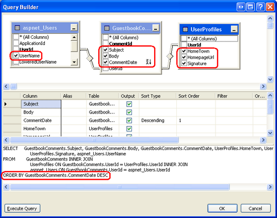](storing-additional-user-information-cs/_static/image52.png)

**Figure 18**: The Constructed Query `JOIN` s the `GuestbookComments`, `UserProfiles`, and `aspnet_Users` Tables  ([Click to view full-size image](storing-additional-user-information-cs/_static/image54.png))

Click OK to close the Query Builder window and return to the "Define Custom Statements or Stored Procedures" screen. Click Next to advance to the "Test Query" screen, where you may view the query results by clicking the Test Query button. When you're ready, click Finish to complete the Configure Data Source wizard.

When we completed the Configure Data Source wizard in Step 2, the associated DetailsView control's `Fields` collection was updated to include a BoundField for each column returned by the `SelectCommand`. The ListView, however, remains unchanged; we still need to define its layout. The ListView's layout can be constructed manually through its declarative markup or from the "Configure ListView" option in its Smart Tag. I usually prefer defining the markup by hand, but use whatever method is most natural to you.

I ended up using the following `LayoutTemplate`, `ItemTemplate`, and `ItemSeparatorTemplate` for my ListView control:

[!code-aspx[Main](storing-additional-user-information-cs/samples/sample10.aspx)]

The `LayoutTemplate` defines the markup emitted by the control, while the `ItemTemplate` renders each item returned by the SqlDataSource. The `ItemTemplate`'s resulting markup is placed in the `LayoutTemplate`'s `itemPlaceholder` control. In addition to the `itemPlaceholder`, the `LayoutTemplate` includes a DataPager control, which limits the ListView to showing just 10 guestbook comments per page (the default) and renders a paging interface.

My `ItemTemplate` displays each guestbook comment's subject in an `<h4>` element with the body situated below the subject. Note that that syntax used for displaying the body takes the data returned by the `Eval("Body")` databinding statement, converts it to a string, and replaces line breaks with the ` ` element. This conversion is needed in order to show the line breaks entered when submitting the comment since whitespace is ignored by HTML. The user's signature is displayed beneath the body in italics, followed by the user's home town, a link to his homepage, the date and time the comment was made, and the username of the person who left the comment.

Take a moment to view the page through a browser. You should see the comments that you added to the guestbook in Step 5 displayed here.

**Figure 19**: `Guestbook.aspx` Now Displays the Guestbook's Comments  ([Click to view full-size image](storing-additional-user-information-cs/_static/image57.png))

Try adding a new comment to the guestbook. Upon clicking the `PostCommentButton` button the page posts back and the comment is added to the database, but the ListView control is not updated to show the new comment. This can be fixed by either:

- Updating the `PostCommentButton` button's `Click` event handler so that it invokes the ListView control's `DataBind()` method after inserting the new comment into the database, or
- Setting the ListView control's `EnableViewState` property to `false`. This approach works because by disabling the control's view state, it must rebind to the underlying data on every postback.

The tutorial website downloadable from this tutorial illustrates both techniques. The ListView control's `EnableViewState` property to `false` and the code needed to programmatically rebind the data to the ListView is present in the `Click` event handler, but is commented out.

> [!NOTE]
> Currently the `AdditionalUserInfo.aspx` page allows the user to view and edit their home town, homepage, and signature settings. It might be nice to update `AdditionalUserInfo.aspx` to display the logged in user's guestbook comments. That is, in addition to examining and modifying her information, a user can visit the `AdditionalUserInfo.aspx` page to see what guestbook comments she's made in the past. I leave this as an exercise for the interested reader.

## Step 6: Customizing the CreateUserWizard Control to Include an Interface for the Home Town, Homepage, and Signature

The `SELECT` query used by the `Guestbook.aspx` page uses an `INNER JOIN` to combine the related records amongst the `GuestbookComments`, `UserProfiles`, and `aspnet_Users` tables. If a user that has no record in `UserProfiles` makes a guestbook comment, the comment won't be displayed in the ListView because the `INNER JOIN` only returns `GuestbookComments` records when there are matching records in `UserProfiles` and `aspnet_Users`. And as we saw in Step 3, if a user does not have a record in `UserProfiles` she cannot view or edit her settings in the `AdditionalUserInfo.aspx` page.

Needless to say, due to our design decisions it is important that every user account in the Membership system have a matching record in the `UserProfiles` table. What we want is for a corresponding record to be added to `UserProfiles` whenever a new Membership user account is created through the CreateUserWizard.

As discussed in the [*Creating User Accounts*](creating-user-accounts-cs.md) tutorial, after the new Membership user account is created the CreateUserWizard control raises its [`CreatedUser` event](https://msdn.microsoft.com/en-us/library/system.web.ui.webcontrols.createuserwizard.createduser.aspx). We can create an event handler for this event, get the UserId for the just-created user, and then insert a record into the `UserProfiles` table with default values for the `HomeTown`, `HomepageUrl`, and `Signature` columns. What's more, it is possible to prompt the user for these values by customizing the CreateUserWizard control's interface to include additional TextBoxes.

Let's first look at how to add a new row to the `UserProfiles` table in the `CreatedUser` event handler with default values. Following that, we will see how to customize the CreateUserWizard control's user interface to include additional form fields to collect the new user's home town, homepage, and signature.

### Adding a Default Row to`UserProfiles`

In the [*Creating User Accounts*](creating-user-accounts-cs.md) tutorial we added a CreateUserWizard control to the `CreatingUserAccounts.aspx` page in the `Membership` folder. In order to have the CreateUserWizard control add a record to `UserProfiles` table upon user account creation, we need to update the CreateUserWizard control's functionality. Rather than making these changes to the `CreatingUserAccounts.aspx` page, let's instead add a new CreateUserWizard control to `EnhancedCreateUserWizard.aspx` page and make the modifications for this tutorial there.

Open the `EnhancedCreateUserWizard.aspx` page in Visual Studio and drag a CreateUserWizard control from the Toolbox onto the page. Set the CreateUserWizard control's `ID` property to `NewUserWizard`. As we discussed in the [*Creating User Accounts*](creating-user-accounts-cs.md) tutorial, the CreateUserWizard's default user interface prompts the visitor for the necessary information. Once this information has been supplied, the control internally creates a new user account in the Membership framework, all without us having to write a single line of code.

The CreateUserWizard control raises a number of events during its workflow. After a visitor supplies the request information and submits the form, the CreateUserWizard control initially fires its [`CreatingUser` event](https://msdn.microsoft.com/en-us/library/system.web.ui.webcontrols.createuserwizard.creatinguser.aspx). If there is a problem during the create process, the [`CreateUserError` event](https://msdn.microsoft.com/en-us/library/system.web.ui.webcontrols.createuserwizard.createusererror.aspx) is fired; however, if the user is successfully created, then the [`CreatedUser` event](https://msdn.microsoft.com/en-us/library/system.web.ui.webcontrols.createuserwizard.createduser.aspx) is raised. In the [*Creating User Accounts*](creating-user-accounts-cs.md) tutorial we created an event handler for the `CreatingUser` event to ensure that the supplied username did not contain any leading or trailing spaces, and that the username did not appear anywhere in the password.

In order to add a row in the `UserProfiles` table for the just-created user, we need to create an event handler for the `CreatedUser` event. By the time the `CreatedUser` event has fired, the user account has already been created in the Membership framework, enabling us to retrieve the account's UserId value.

Create an event handler for the `NewUserWizard`'s `CreatedUser` event and add the following code:

[!code-csharp[Main](storing-additional-user-information-cs/samples/sample11.cs)]

The above code beings by retrieving the UserId of the just-added user account. This is accomplished by using the `Membership.GetUser(username)` method to return information about a particular user, and then using the `ProviderUserKey` property to retrieve their UserId. The username entered by the user in the CreateUserWizard control is available via its [`UserName` property](https://msdn.microsoft.com/en-us/library/system.web.ui.webcontrols.createuserwizard.username.aspx).

Next, the connection string is retrieved from `Web.config` and the `INSERT` statement is specified. The necessary ADO.NET objects are instantiated and the command executed. The code assigns a [`DBNull`](https://msdn.microsoft.com/en-us/library/system.dbnull.aspx) instance to the `@HomeTown`, `@HomepageUrl`, and `@Signature` parameters, which has the effect of inserting database `NULL` values for the `HomeTown`, `HomepageUrl`, and `Signature` fields.

Visit the `EnhancedCreateUserWizard.aspx` page through a browser and create a new user account. After doing so, return to Visual Studio and examine the contents of the `aspnet_Users` and `UserProfiles` tables (like we did back in Figure 12). You should see the new user account in `aspnet_Users` and a corresponding `UserProfiles` row (with `NULL` values for `HomeTown`, `HomepageUrl`, and `Signature`).

[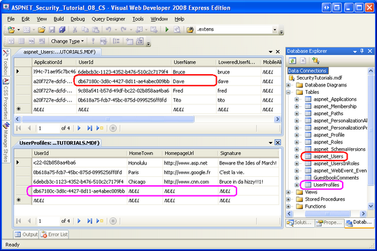](storing-additional-user-information-cs/_static/image58.png)

**Figure 20**: A New User Account and `UserProfiles` Record Have Been Added  ([Click to view full-size image](storing-additional-user-information-cs/_static/image60.png))

After the visitor has supplied his new account information and clicked the "Create User" button, the user account is created and a row added to the `UserProfiles` table. The CreateUserWizard then displays its `CompleteWizardStep`, which displays a success message and a Continue button. Clicking the Continue button causes a postback, but no action is taken, leaving the user stuck on the `EnhancedCreateUserWizard.aspx` page.

We can specify a URL to send the user to when the Continue button is clicked via the CreateUserWizard control's [`ContinueDestinationPageUrl` property](https://msdn.microsoft.com/en-us/library/system.web.ui.webcontrols.createuserwizard.continuedestinationpageurl.aspx). Set the `ContinueDestinationPageUrl` property to "~/Membership/AdditionalUserInfo.aspx". This takes the new user to `AdditionalUserInfo.aspx`, where they can view and update their settings.

### Customizing the CreateUserWizard's Interface to Prompt for the New User's Home Town, Homepage, and Signature

The CreateUserWizard control's default interface is sufficient for simple account creation scenarios where only core user account information like username, password, and email need be collected. But what if we wanted to prompt the visitor to enter her home town, homepage, and signature while creating her account? It is possible to customize the CreateUserWizard control's interface to collect additional information at signup, and this information may be used in the `CreatedUser` event handler to insert additional records into the underlying database.

The CreateUserWizard control extends the ASP.NET Wizard control, which is a control that allows a page developer to define a series of ordered `WizardSteps`. The Wizard control renders the active step and provides a navigation interface that allows the visitor to move through these steps. The Wizard control is ideal for breaking down a long task into several short steps. For more information on the Wizard control, see [Creating a Step-by-Step User Interface with the ASP.NET 2.0 Wizard Control](http://aspnet.4guysfromrolla.com/articles/061406-1.aspx).

The CreateUserWizard control's default markup defines two `WizardSteps`: `CreateUserWizardStep` and `CompleteWizardStep`.

[!code-aspx[Main](storing-additional-user-information-cs/samples/sample12.aspx)]

The first `WizardStep`, `CreateUserWizardStep`, renders the interface that prompts for the username, password, email, and so on. After the visitor supplies this information and clicks "Create User", she is shown the `CompleteWizardStep`, which shows the success message and a Continue button.

To customize the CreateUserWizard control's interface to include additional form fields, we can:

- **Create one or more new****`WizardStep`****s to contain the additional user interface elements**. To add a new `WizardStep` to the CreateUserWizard, click the "Add/Remove `WizardSteps`" link from its Smart Tag to launch the `WizardStep` Collection Editor. From there you can add, remove, or reorder the steps in the wizard. This is the approach we will use for this tutorial.

- **Convert the****`CreateUserWizardStep`****into an editable****`WizardStep`****.** This replaces the `CreateUserWizardStep` with an equivalent `WizardStep` whose markup defines a user interface that matches the `CreateUserWizardStep`'s. By converting the `CreateUserWizardStep` into a `WizardStep` we can reposition the controls or add additional user interface elements to this step. To convert the `CreateUserWizardStep` or `CompleteWizardStep` into an editable `WizardStep`, click the "Customize Create User Step" or "Customize Complete Step" link from the control's Smart Tag.

- **Use some combination of the above two options.**

One important thing to keep in mind is that the CreateUserWizard control executes its user account creation process when the "Create User" button is clicked from within its `CreateUserWizardStep`. It doesn't matter if there are additional `WizardStep` s after the `CreateUserWizardStep` or not.

When adding a custom `WizardStep` to the CreateUserWizard control to collect additional user input, the custom `WizardStep` can be placed before or after the `CreateUserWizardStep`. If it comes before the `CreateUserWizardStep` then the additional user input collected from the custom `WizardStep` is available for the `CreatedUser` event handler. However, if the custom `WizardStep` comes after `CreateUserWizardStep` then by the time the custom `WizardStep` is displayed the new user account has already been created and the `CreatedUser` event has already fired.

Figure 21 shows the workflow when the added `WizardStep` precedes the `CreateUserWizardStep`. Since the additional user information has been collected by the time the `CreatedUser` event fires, all we have to do is update the `CreatedUser` event handler to retrieve these inputs and use those for the `INSERT` statement's parameter values (rather than `DBNull.Value`).

**Figure 21**: The CreateUserWizard Workflow When an Additional `WizardStep` Precedes the `CreateUserWizardStep` ([Click to view full-size image](storing-additional-user-information-cs/_static/image63.png))

If the custom `WizardStep` is placed *after* the `CreateUserWizardStep`, however, the create user account process occurs before the user has had a chance to enter her home town, homepage, or signature. In such a case, this additional information needs to be inserted into the database after the user account has been created, as Figure 22 illustrates.

[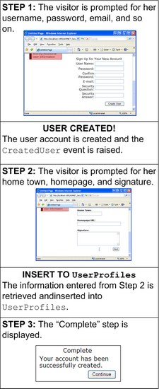](storing-additional-user-information-cs/_static/image64.png)

**Figure 22**: The CreateUserWizard Workflow When an Additional `WizardStep` Comes After the `CreateUserWizardStep` ([Click to view full-size image](storing-additional-user-information-cs/_static/image66.png))

The workflow shown in Figure 22 waits to insert a record into the `UserProfiles` table until after Step 2 completes. If the visitor closes her browser after step 1, however, we will have reached a state where a user account was created, but no record was added to `UserProfiles`. One workaround is to have a record with `NULL` or default values inserted into `UserProfiles` in the `CreatedUser` event handler (which fires after step 1), and then update this record after step 2 completes. This ensures that a `UserProfiles` record will be added for the user account even if the user quits the registration process midway through.

For this tutorial let's create a new `WizardStep` that occurs after the `CreateUserWizardStep` but before the `CompleteWizardStep`. Let's first get the WizardStep in place and configured and then we'll look at the code.

From the CreateUserWizard control's Smart Tag, select the "Add/Remove `WizardStep` s", which brings up the `WizardStep` Collection Editor dialog. Add a new `WizardStep`, setting its `ID` to `UserSettings`, its `Title` to "Your Settings" and its `StepType` to `Step`. Then position it so that it comes after the `CreateUserWizardStep` ("Sign Up for Your New Account") and before the `CompleteWizardStep` ("Complete"), as shown in Figure 23.

**Figure 23**: Add a New `WizardStep` to the CreateUserWizard Control  ([Click to view full-size image](storing-additional-user-information-cs/_static/image69.png))

Click OK to close the `WizardStep` Collection Editor dialog. The new `WizardStep` is evidenced by the CreateUserWizard control's updated declarative markup:

[!code-aspx[Main](storing-additional-user-information-cs/samples/sample13.aspx)]

Note the new `<asp:WizardStep>` element. We need to add the user interface to collect the new user's home town, homepage, and signature here. You can enter this content in the declarative syntax or through the Designer. To use the Designer, select the "Your Settings" step from the drop-down list in the Smart Tag to see the step in the Designer.

> [!NOTE]
> Selecting a step through the Smart Tag's drop-down list updates the CreateUserWizard control's [`ActiveStepIndex` property](https://msdn.microsoft.com/en-us/library/system.web.ui.webcontrols.createuserwizard.activestepindex.aspx), which specifies the index of the starting step. Therefore, if you use this drop-down list to edit the "Your Settings" step in the Designer, be sure to set it back to "Sign Up for Your New Account" so that this step is shown when users first visit the `EnhancedCreateUserWizard.aspx` page.

Create a user interface within the "Your Settings" step that contains three TextBox controls named `HomeTown`, `HomepageUrl`, and `Signature`. After constructing this interface, the CreateUserWizard's declarative markup should look similar to the following:

[!code-aspx[Main](storing-additional-user-information-cs/samples/sample14.aspx)]

Go ahead and visit this page through a browser and create a new user account, specifying values for the home town, homepage, and signature. After completing the `CreateUserWizardStep` the user account is created in the Membership framework and the `CreatedUser` event handler runs, which adds a new row to `UserProfiles`, but with a database `NULL` value for `HomeTown`, `HomepageUrl`, and `Signature`. The values entered for the home town, homepage, and signature are never used. The net result is a new user account with a `UserProfiles` record whose `HomeTown`, `HomepageUrl`, and `Signature` fields have yet to be specified.

We need to execute code after the "Your Settings" step that takes the home town, honepage, and signature values entered by the user and updates the appropriate `UserProfiles` record. Each time the user moves between steps in a Wizard control, the Wizard's [`ActiveStepChanged` event](https://msdn.microsoft.com/en-us/library/system.web.ui.webcontrols.wizard.activestepchanged.aspx) fires. We can create an event handler for this event and update the `UserProfiles` table when the "Your Settings" step has completed.

Add an event handler for the CreateUserWizard's `ActiveStepChanged` event and add the following code:

[!code-csharp[Main](storing-additional-user-information-cs/samples/sample15.cs)]

The above code starts by determining if we have just reached the "Complete" step. Since the "Complete" step occurs immediately after the "Your Settings" step, then when the visitor reaches "Complete" step that means she just finished the "Your Settings" step.

In such a case, we need to programmatically reference the TextBox controls within the `UserSettings WizardStep`. This is accomplished by first using the `FindControl` method to programmatically referencing the `UserSettings WizardStep`, and then again to reference the TextBoxes from within the `WizardStep`. Once the TextBoxes have been referenced, we're ready to execute the `UPDATE` statement. The `UPDATE` statement has the same number of parameters as the `INSERT` statement in the `CreatedUser` event handler, but here we use the home town, homepage, and signature values supplied by the user.

With this event handler in place, visit the `EnhancedCreateUserWizard.aspx` page through a browser and create a new user account specifying values for the home town, homepage, and signature. After creating the new account you should be redirected to the `AdditionalUserInfo.aspx` page, where the just-entered home town, homepage, and signature information is displayed.

> [!NOTE]
> Our website currently has two pages from which a visitor can create a new account: `CreatingUserAccounts.aspx` and `EnhancedCreateUserWizard.aspx`. The website's sitemap and login page point to the `CreatingUserAccounts.aspx` page, but the `CreatingUserAccounts.aspx` page does not prompt the user for their home town, homepage, and signature information and does not add a corresponding row to `UserProfiles`. Therefore, either update the `CreatingUserAccounts.aspx` page so that it offers this functionality or update the sitemap and login page to reference `EnhancedCreateUserWizard.aspx` instead of `CreatingUserAccounts.aspx`. If you choose the latter option, be sure to update the `Membership` folder's `Web.config` file so as to allow anonymous users access to the `EnhancedCreateUserWizard.aspx` page.

## Summary

In this tutorial we looked at techniques for modeling data that is related to user accounts within the Membership framework. In particular, we looked at modeling entities that share a one-to-many relationship with user accounts as well as data that shares a one-to-one relationship. Furthermore, we saw how this related information could be displayed, inserted, and updated, with some examples using the SqlDataSource control and others using ADO.NET code.

This tutorial completes our look at user accounts. Starting with the next tutorial we will turn our attention to roles. Over the next several tutorials we will look at the Roles framework, see how to create new roles, how to assign roles to users, how to determine what roles a user belongs to, and how to apply role-based authorization.

Happy Programming!

### Further Reading

For more information on the topics discussed in this tutorial, refer to the following resources:

- [Accessing and Updating Data in ASP.NET 2.0](http://aspnet.4guysfromrolla.com/articles/011106-1.aspx)
- [ASP.NET 2.0 Wizard Control](https://weblogs.asp.net/scottgu/archive/2006/02/21/438732.aspx)
- [Creating a Step-by-Step User Interface with the ASP.NET 2.0 Wizard Control](http://aspnet.4guysfromrolla.com/articles/061406-1.aspx)
- [Creating Custom DataSource Control Parameters](http://aspnet.4guysfromrolla.com/articles/110106-1.aspx)
- [Customizing the CreateUserWizard Control](http://aspnet.4guysfromrolla.com/articles/070506-1.aspx)
- [DetailsView Control QuickStarts](https://quickstarts.asp.net/QuickStartv20/aspnet/doc/ctrlref/data/detailsview.aspx)
- [Displaying Data with the ListView Control](http://aspnet.4guysfromrolla.com/articles/122607-1.aspx)
- [Dissecting the Validation Controls in ASP.NET 2.0](http://aspnet.4guysfromrolla.com/articles/112305-1.aspx)
- [Editing Insert and Deleting Data](../../data-access/editing-inserting-and-deleting-data/an-overview-of-inserting-updating-and-deleting-data-cs.md)
- [Form Validation in ASP.NET](http://www.4guysfromrolla.com/webtech/090200-1.shtml)
- [Gathering Custom User Registration Information](https://weblogs.asp.net/scottgu/archive/2006/07/05/Tip_2F00_Trick_3A00_-Gathering-Custom-User-Registration-Information.aspx)
- [Profiles in ASP.NET 2.0](http://www.odetocode.com/Articles/440.aspx)
- [The asp:ListView Control](https://weblogs.asp.net/scottgu/archive/2007/08/10/the-asp-listview-control-part-1-building-a-product-listing-page-with-clean-css-ui.aspx)
- [User Profiles QuickStart](https://quickstarts.asp.net/QuickStartv20/aspnet/doc/profile/default.aspx)

### About the Author

Scott Mitchell, author of multiple ASP/ASP.NET books and founder of 4GuysFromRolla.com, has been working with Microsoft Web technologies since 1998. Scott works as an independent consultant, trainer, and writer. His latest book is *[Sams Teach Yourself ASP.NET 2.0 in 24 Hours](https://www.amazon.com/exec/obidos/ASIN/0672327384/4guysfromrollaco)*. Scott can be reached at [mitchell@4guysfromrolla.com](mailto:mitchell@4guysfromrolla.com) or via his blog at [http://ScottOnWriting.NET](http://scottonwriting.net/).

### Special Thanks To…

This tutorial series was reviewed by many helpful reviewers. Interested in reviewing my upcoming MSDN articles? If so, drop me a line at [mitchell@4GuysFromRolla.com](mailto:mitchell@4GuysFromRolla.com).

>[!div class="step-by-step"]
[Previous](user-based-authorization-cs.md)
[Next](creating-the-membership-schema-in-sql-server-vb.md)