User-Based Authorization (C#)
====================
by [Scott Mitchell](https://twitter.com/ScottOnWriting)

[Download Code](http://download.microsoft.com/download/3/f/5/3f5a8605-c526-4b34-b3fd-a34167117633/ASPNET_Security_Tutorial_07_CS.zip) or [Download PDF](http://download.microsoft.com/download/3/f/5/3f5a8605-c526-4b34-b3fd-a34167117633/aspnet_tutorial07_UserAuth_cs.pdf)

> In this tutorial we will look at limiting access to pages and restricting page-level functionality through a variety of techniques.

## Introduction

Most web applications that offer user accounts do so in part to restrict certain visitors from accessing certain pages within the site. In most online messageboard sites, for example, all users - anonymous and authenticated - are able to view the messageboard's posts, but only authenticated users can visit the web page to create a new post. And there may be administrative pages that are only accessible to a particular user (or a particular set of users). Moreover, page-level functionality can differ on a user-by-user basis. When viewing a list of posts, authenticated users are shown an interface for rating each post, whereas this interface is not available to anonymous visitors.

ASP.NET makes it easy to define user-based authorization rules. With just a bit of markup in `Web.config`, specific web pages or entire directories can be locked down so that they are only accessible to a specified subset of users. Page-level functionality can be turned on or off based on the currently logged in user through programmatic and declarative means.

In this tutorial we will look at limiting access to pages and restricting page-level functionality through a variety of techniques. Let's get started!

## A Look at the URL Authorization Workflow

As discussed in the [*An Overview of Forms Authentication*](../introduction/an-overview-of-forms-authentication-cs.md) tutorial, when the ASP.NET runtime processes a request for an ASP.NET resource the request raises a number of events during its lifecycle. *HTTP Modules* are managed classes whose code is executed in response to a particular event in the request lifecycle. ASP.NET ships with a number of HTTP Modules that perform essential tasks behind the scenes.

One such HTTP Module is [`FormsAuthenticationModule`](https://msdn.microsoft.com/en-us/library/system.web.security.formsauthenticationmodule.aspx). As discussed in previous tutorials, the primary function of the `FormsAuthenticationModule` is to determine the identity of the current request. This is accomplished by inspecting the forms authentication ticket, which is either located in a cookie or embedded within the URL. This identification takes place during the [`AuthenticateRequest` event](https://msdn.microsoft.com/en-us/library/system.web.httpapplication.authenticaterequest.aspx).

Another important HTTP Module is the [`UrlAuthorizationModule`](https://msdn.microsoft.com/en-us/library/system.web.security.urlauthorizationmodule.aspx), which is raised in response to the [`AuthorizeRequest` event](https://msdn.microsoft.com/en-us/library/system.web.httpapplication.authorizerequest.aspx) (which happens after the `AuthenticateRequest` event). The `UrlAuthorizationModule` examines configuration markup in `Web.config` to determine whether the current identity has authority to visit the specified page. This process is referred to as *URL authorization*.

We'll examine the syntax for the URL authorization rules in Step 1, but first let's look at what the `UrlAuthorizationModule` does depending on whether the request is authorized or not. If the `UrlAuthorizationModule` determines that the request is authorized, then it does nothing, and the request continues through its lifecycle. However, if the request is *not* authorized, then the `UrlAuthorizationModule` aborts the lifecycle and instructs the `Response` object to return an [HTTP 401 Unauthorized](http://www.checkupdown.com/status/E401.html) status. When using forms authentication this HTTP 401 status is never returned to the client because if the `FormsAuthenticationModule` detects an HTTP 401 status is modifies it to an [HTTP 302 Redirect](http://www.checkupdown.com/status/E302.html) to the login page.

Figure 1 illustrates the workflow of the ASP.NET pipeline, the `FormsAuthenticationModule`, and the `UrlAuthorizationModule` when an unauthorized request arrives. In particular, Figure 1 shows a request by an anonymous visitor for `ProtectedPage.aspx`, which is a page that denies access to anonymous users. Since the visitor is anonymous, the `UrlAuthorizationModule` aborts the request and returns an HTTP 401 Unauthorized status. The `FormsAuthenticationModule` then converts the 401 status into a 302 Redirect to login page. After the user is authenticated via the login page, he is redirected to `ProtectedPage.aspx`. This time the `FormsAuthenticationModule` identifies the user based on his authentication ticket. Now that the visitor is authenticated, the `UrlAuthorizationModule` permits access to the page.

**Figure 1**: The Forms Authentication and URL Authorization Workflow  ([Click to view full-size image](user-based-authorization-cs/_static/image3.png))

Figure 1 depicts the interaction that occurs when an anonymous visitor attempts to access a resource that is not available to anonymous users. In such a case, the anonymous visitor is redirected to the login page with the page she attempted to visit specified in the querystring. Once the user has successfully logged on, she will be automatically redirected back to the resource she was initially attempting to view.

When the unauthorized request is made by an anonymous user, this workflow is straightforward and is easy for the visitor to understand what has happened and why. But keep in mind that the `FormsAuthenticationModule` will redirect *any* unauthorized user to the login page, even if the request is made by an authenticated user. This can result in a confusing user experience if an authenticated user attempts to visit a page for which she lacks authority.

Imagine that our website had its URL authorization rules configured such that the ASP.NET page `OnlyTito.aspx` was accessibly only to Tito. Now, imagine that Sam visits the site, logs on, and then attempts to visit `OnlyTito.aspx`. The `UrlAuthorizationModule` will halt the request lifecycle and return an HTTP 401 Unauthorized status, which the `FormsAuthenticationModule` will detect and then redirect Sam to the login page. Since Sam has already logged in, though, she may wonder why she has been sent back to the login page. She might reason that her login credentials were lost somehow, or that she entered invalid credentials. If Sam reenters her credentials from the login page she will be logged on (again) and redirected to `OnlyTito.aspx`. The `UrlAuthorizationModule` will detect that Sam cannot visit this page and she will be returned to the login page.

Figure 2 depicts this confusing workflow.

[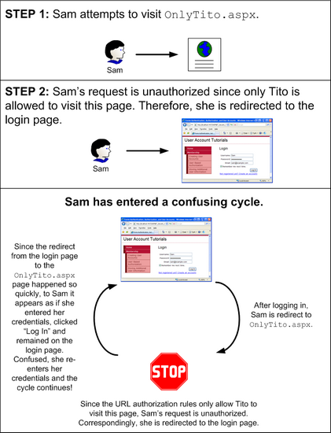](user-based-authorization-cs/_static/image4.png)

**Figure 2**: The Default Workflow Can Lead to a Confusing Cycle  ([Click to view full-size image](user-based-authorization-cs/_static/image6.png))

The workflow illustrated in Figure 2 can quickly befuddle even the most computer savvy visitor. We will look at ways to prevent this confusing cycle in Step 2.

> [!NOTE]
> ASP.NET uses two mechanisms to determine whether the current user can access a particular web page: URL authorization and file authorization. File authorization is implemented by the [`FileAuthorizationModule`](https://msdn.microsoft.com/en-us/library/system.web.security.fileauthorizationmodule.aspx), which determines authority by consulting the requested file(s) ACLs. File authorization is most commonly used with Windows authentication because ACLs are permissions that apply to Windows accounts. When using forms authentication, all operating system- and file system-level requests are executed by the same Windows account, regardless of the user visiting the site. Since this tutorial series focuses on forms authentication, we will not be discussing file authorization.

### The Scope of URL Authorization

The `UrlAuthorizationModule` is managed code that is part of the ASP.NET runtime. Prior to version 7 of Microsoft's [Internet Information Services (IIS)](https://www.iis.net/) web server, there was a distinct barrier between IIS's HTTP pipeline and the ASP.NET runtime's pipeline. In short, in IIS 6 and earlier, ASP.NET's `UrlAuthorizationModule` only executes when a request is delegated from IIS to the ASP.NET runtime. By default, IIS processes static content itself - like HTML pages and CSS, JavaScript, and image files - and only hands off requests to the ASP.NET runtime when a page with an extension of `.aspx`, `.asmx`, or `.ashx` is requested.

IIS 7, however, allows for integrated IIS and ASP.NET pipelines. With a few configuration settings you can setup IIS 7 to invoke the `UrlAuthorizationModule` for *all* requests, meaning that URL authorization rules can be defined for files of any type. Additionally, IIS 7 includes its own URL authorization engine. For more information on ASP.NET integration and IIS 7's native URL authorization functionality, see [Understanding IIS7 URL Authorization](https://www.iis.net/articles/view.aspx/IIS7/Managing-IIS7/Configuring-Security/URL-Authorization/Understanding-IIS7-URL-Authorization). For a more in-depth look at ASP.NET and IIS 7 integration, pick up a copy of Shahram Khosravi's book, *Professional IIS 7 and ASP.NET Integrated Programming* (ISBN: 978-0470152539).

In a nutshell, in versions prior to IIS 7, URL authorization rules are only applied to resources handled by the ASP.NET runtime. But with IIS 7 it is possible to use IIS's native URL authorization feature or to integrate ASP.NET's `UrlAuthorizationModule` into IIS's HTTP pipeline, thereby extending this functionality to all requests.

> [!NOTE]
> There are some subtle yet important differences in how ASP.NET's `UrlAuthorizationModule` and IIS 7's URL authorization feature process the authorization rules. This tutorial does not examine IIS 7's URL authorization functionality or the differences in how it parses authorization rules compared to the `UrlAuthorizationModule`. For more information on these topics, refer to the IIS 7 documentation on MSDN or at [www.iis.net](https://www.iis.net/).

## Step 1: Defining URL Authorization Rules in`Web.config`

The `UrlAuthorizationModule` determines whether to grant or deny access to a requested resource for a particular identity based on the URL authorization rules defined in the application's configuration. The authorization rules are spelled out in the [`<authorization>` element](https://msdn.microsoft.com/en-us/library/8d82143t.aspx) in the form of `<allow>` and `<deny>` child elements. Each `<allow>` and `<deny>` child element can specify:

- A particular user
- A comma-delimited list of users
- All anonymous users, denoted by a question mark (?)
- All users, denoted by an asterisk (\*)

The following markup illustrates how to use the URL authorization rules to allow users Tito and Scott and deny all others:

[!code-xml[Main](user-based-authorization-cs/samples/sample1.xml)]

The `<allow>` element defines what users are permitted - Tito and Scott - while the `<deny>` element instructs that *all* users are denied.

> [!NOTE]
> The `<allow>` and `<deny>` elements can also specify authorization rules for roles. We will examine role-based authorization in a future tutorial.

The following setting grants access to anyone other than Sam (including anonymous visitors):

[!code-xml[Main](user-based-authorization-cs/samples/sample2.xml)]

To allow only authenticated users, use the following configuration, which denies access to all anonymous users:

[!code-xml[Main](user-based-authorization-cs/samples/sample3.xml)]

The authorization rules are defined within the `<system.web>` element in `Web.config` and apply to all of the ASP.NET resources in the web application. Oftentimes, an application has different authorization rules for different sections. For example, at an eCommerce site, all visitors may peruse the products, see product reviews, search the catalog, and so on. However, only authenticated users may reach the checkout or the pages to manage one's shipping history. Moreover, there may be portions of the site that are only accessible by select users, such as site administrators.

ASP.NET makes it easy to define different authorization rules for different files and folders in the site. The authorization rules specified in the root folder's `Web.config` file apply to all ASP.NET resources in the site. However, these default authorization settings can be overridden for a particular folder by adding a `Web.config` with an `<authorization>` section.

Let's update our website so that only authenticated users can visit the ASP.NET pages in the `Membership` folder. To accomplish this we need to add a `Web.config` file to the `Membership` folder and set its authorization settings to deny anonymous users. Right-click the `Membership` folder in the Solution Explorer, choose the Add New Item menu from the context menu, and add a new Web Configuration File named `Web.config`.

[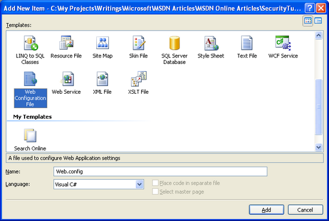](user-based-authorization-cs/_static/image7.png)

**Figure 3**: Add a `Web.config` File to the `Membership` Folder  ([Click to view full-size image](user-based-authorization-cs/_static/image9.png))

At this point your project should contain two `Web.config` files: one in the root directory and one in the `Membership` folder.

**Figure 4**: Your Application Should Now Contain Two `Web.config` Files  ([Click to view full-size image](user-based-authorization-cs/_static/image12.png))

Update the configuration file in the `Membership` folder so that it prohibits access to anonymous users.

[!code-xml[Main](user-based-authorization-cs/samples/sample4.xml)]

That's all there is to it!

To test out this change, visit the homepage in a browser and make sure you are logged out. Since the default behavior of an ASP.NET application is to allow all visitors, and since we didn't make any authorization modifications to the root directory's `Web.config` file, we are able to visit the files in the root directory as an anonymous visitor.

Click on the Creating User Accounts link found in the left column. This will take you to the `~/Membership/CreatingUserAccounts.aspx`. Since the `Web.config` file in the `Membership` folder defines authorization rules to prohibit anonymous access, the `UrlAuthorizationModule` aborts the request and returns an HTTP 401 Unauthorized status. The `FormsAuthenticationModule` modifies this to a 302 Redirect status, sending us to the login page. Note that the page we were attempting to access (`CreatingUserAccounts.aspx`) is passed to the login page via the `ReturnUrl` querystring parameter.

**Figure 5**: Since the URL Authorization Rules Prohibit Anonymous Access, We are Redirected to the Login Page  ([Click to view full-size image](user-based-authorization-cs/_static/image15.png))

Upon successfully logging in, we are redirected to the `CreatingUserAccounts.aspx` page. This time the `UrlAuthorizationModule` permits access to the page because we are no longer anonymous.

### Applying URL Authorization Rules to a Specific Location

The authorization settings defined in the `<system.web>` section of `Web.config` apply to all of the ASP.NET resources in that directory and its subdirectories (until otherwise overridden by another `Web.config` file). In some cases, though, we may want all ASP.NET resources in a given directory to have a particular authorization configuration except for one or two specific pages. This can be achieved by adding a `<location>` element in `Web.config`, pointing it to the file whose authorization rules differ, and defining its unique authorization rules therein.

To illustrate using the `<location>` element to override the configuration settings for a specific resource, let's customize the authorization settings so that only Tito can visit `CreatingUserAccounts.aspx`. To accomplish this, add a `<location>` element to the `Membership` folder's `Web.config` file and update its markup so that it looks like the following:

[!code-xml[Main](user-based-authorization-cs/samples/sample5.xml)]

The `<authorization>` element in `<system.web>` defines the default URL authorization rules for ASP.NET resources in the `Membership` folder and its subfolders. The `<location>` element allows us to override these rules for a particular resource. In the above markup the `<location>` element references the `CreatingUserAccounts.aspx` page and specifies its authorization rules such as to allow Tito, but deny everyone else.

To test out this authorization change, start by visiting the website as an anonymous user. If you attempt to visit any page in the `Membership` folder, such as `UserBasedAuthorization.aspx`, the `UrlAuthorizationModule` will deny the request and you will be redirected to the login page. After logging in as, say, Scott, you can visit any page in the `Membership` folder *except* for `CreatingUserAccounts.aspx`. Attempting to visit `CreatingUserAccounts.aspx` logged on as anyone but Tito will result in an unauthorized access attempt, redirecting you back to the login page.

> [!NOTE]
> The `<location>` element must appear outside of the configuration's `<system.web>` element. You need to use a separate `<location>` element for each resource whose authorization settings you want to override.

### A Look at How the`UrlAuthorizationModule`Uses the Authorization Rules to Grant or Deny Access

The `UrlAuthorizationModule` determines whether to authorize a particular identity for a particular URL by analyzing the URL authorization rules one at a time, starting from the first one and working its way down. As soon as a match is found, the user is granted or denied access, depending on if the match was found in an `<allow>` or `<deny>` element. **If no match is found, the user is granted access.** Consequently, if you want to restrict access, it is imperative that you use a `<deny>` element as the last element in the URL authorization configuration. **If you omit a****`<deny>`****element, all users will be granted access.**

To better understand the process used by the `UrlAuthorizationModule` to determine authority, consider the example URL authorization rules we looked at earlier in this step. The first rule is an `<allow>` element that allows access to Tito and Scott. The second rules is a `<deny>` element that denies access to everyone. If an anonymous user visits, the `UrlAuthorizationModule` starts by asking, Is anonymous either Scott or Tito? The answer, obviously, is No, so it proceeds to the second rule. Is anonymous in the set of everybody? Since the answer here is Yes, the `<deny>` rule is put in effect and the visitor is redirected to the login page. Similarly, if Jisun is visiting, the `UrlAuthorizationModule` starts by asking, Is Jisun either Scott or Tito? Since she is not, the `UrlAuthorizationModule` proceeds to the second question, Is Jisun in the set of everybody? She is, so she, too, is denied access. Finally, if Tito visits, the first question posed by the `UrlAuthorizationModule` is an affirmative answer, so Tito is granted access.

Since the `UrlAuthorizationModule` processes the authorization rules from the top down, stopping at any match, it is important to have the more specific rules come before the less specific ones. That is, to define authorization rules that forbid Jisun and anonymous users, but allow all other authenticated users, you would start with the most specific rule - the one impacting Jisun - and then proceed to the less specific rules - those allowing all other authenticated users, but denying all anonymous users. The following URL authorization rules implements this policy by first denying Jisun, and then denying any anonymous user. Any authenticated user other than Jisun will be granted access because neither of these `<deny>` statements will match.

[!code-xml[Main](user-based-authorization-cs/samples/sample6.xml)]

## Step 2: Fixing the Workflow for Unauthorized, Authenticated Users

As we discussed earlier in this tutorial in the A Look at the URL Authorization Workflow section, anytime an unauthorized request transpires, the `UrlAuthorizationModule` aborts the request and returns an HTTP 401 Unauthorized status. This 401 status is modified by the `FormsAuthenticationModule` into a 302 Redirect status that sends the user to the login page. This workflow occurs on any unauthorized request, even if the user is authenticated.

Returning an authenticated user to the login page is likely to confuse them since they have already logged into the system. With a little bit of work we can improve this workflow by redirecting authenticated users who make unauthorized requests to a page that explains that they have attempted to access a restricted page.

Start by creating a new ASP.NET page in the web application's root folder named `UnauthorizedAccess.aspx`; don't forget to associate this page with the `Site.master` master page. After creating this page, remove the Content control that references the `LoginContent` ContentPlaceHolder so that the master page's default content will be displayed. Next, add a message that explains the situation, namely that the user attempted to access a protected resource. After adding such a message, the `UnauthorizedAccess.aspx` page's declarative markup should look similar to the following:

[!code-aspx[Main](user-based-authorization-cs/samples/sample7.aspx)]

We now need to alter the workflow so that if an unauthorized request is performed by an authenticated user they are sent to the `UnauthorizedAccess.aspx` page instead of the login page. The logic that redirects unauthorized requests to the login page is buried within a private method of the `FormsAuthenticationModule` class, so we cannot customize this behavior. What we can do, however, is add our own logic to the login page that redirects the user to `UnauthorizedAccess.aspx`, if needed.

When the `FormsAuthenticationModule` redirects an unauthorized visitor to the login page it appends the requested, unauthorized URL to the querystring with the name `ReturnUrl`. For example, if an unauthorized user attempted to visit `OnlyTito.aspx`, the `FormsAuthenticationModule` would redirect them to `Login.aspx?ReturnUrl=OnlyTito.aspx`. Therefore, if the login page is reached by an authenticated user with a querystring that includes the `ReturnUrl` parameter, then we know that this unauthenticated user just attempted to visit a page she is not authorized to view. In such a case, we want to redirect her to `UnauthorizedAccess.aspx`.

To accomplish this, add the following code to the login page's `Page_Load` event handler:

[!code-csharp[Main](user-based-authorization-cs/samples/sample8.cs)]

The above code redirects authenticated, unauthorized users to the `UnauthorizedAccess.aspx` page. To see this logic in action, visit the site as an anonymous visitor and click on the Creating User Accounts link in the left column. This will take you to the `~/Membership/CreatingUserAccounts.aspx` page, which in Step 1 we configured to only permit access to Tito. Since anonymous users are prohibited, the `FormsAuthenticationModule` redirects us back to the login page.

At this point we are anonymous, so `Request.IsAuthenticated` returns `false` and we are not redirected to `UnauthorizedAccess.aspx`. Instead, the login page is displayed. Log in as a user other than Tito, such as Bruce. After entering the appropriate credentials, the login page redirects us back to `~/Membership/CreatingUserAccounts.aspx`. However, since this page is only accessible to Tito, we are unauthorized to view it and are promptly returned to the login page. This time, however, `Request.IsAuthenticated` returns `true` (and the `ReturnUrl` querystring parameter exists), so we are redirected to the `UnauthorizedAccess.aspx` page.

[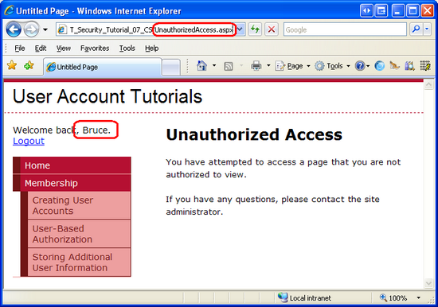](user-based-authorization-cs/_static/image16.png)

**Figure 6**: Authenticated, Unauthorized Users are Redirected to `UnauthorizedAccess.aspx` ([Click to view full-size image](user-based-authorization-cs/_static/image18.png))

This customized workflow presents a more sensible and straightforward user experience by short circuiting the cycle depicted in Figure 2.

## Step 3: Limiting Functionality Based on the Currently Logged In User

URL authorization makes it easy to specify coarse authorization rules. As we saw in Step 1, with URL authorization we can succinctly state what identities are permitted and which ones are denied from viewing a particular page or all pages in a folder. In certain scenarios, however, we may want to allow all users to visit a page, but limit the page's functionality based on the user visiting it.

Consider the case of an eCommerce website that allows authenticated visitors to review their products. When an anonymous user visits a product's page, they would see just the product information and would not be given the opportunity to leave a review. However, an authenticated user visiting the same page would see the reviewing interface. If the authenticated user had not yet reviewed this product, the interface would enable them to submit a review; otherwise it would show them their previously-submitted review. To take this scenario a step further, the product page might show additional information and offer extended features for those users that work for the eCommerce company. For example, the product page might list the inventory in stock and include options to edit the product's price and description when visited by an employee.

Such fine grain authorization rules can be implemented either declaratively or programmatically (or through some combination of the two). In the next section we will see how to implement fine grain authorization via the LoginView control. Following that, we will explore programmatic techniques. Before we can look at applying fine grain authorization rules, however, we first need to create a page whose functionality depends on the user visiting it.

Let's create a page that lists the files in a particular directory within a GridView. Along with listing each file's name, size, and other information, the GridView will include two columns of LinkButtons: one titled View and one titled Delete. If the View LinkButton is clicked, the contents of the selected file will be displayed; if the Delete LinkButton is clicked, the file will be deleted. Let's initially create this page such that its view and delete functionality is available to all users. In the Using the LoginView Control and Programmatically Limiting Functionality sections we will see how to enable or disable these features based on the user visiting the page.

> [!NOTE]
> The ASP.NET page we are about to build uses a GridView control to display a list of files. Since this tutorial series focuses on forms authentication, authorization, user accounts, and roles, I do not want to spend too much time discussing the inner workings of the GridView control. While this tutorial provides specific step-by-step instructions for setting up this page, it does not delve into the details of why certain choices were made, or what effect particular properties have on the rendered output. For a thorough examination of the GridView control, consult my *[Working with Data in ASP.NET 2.0](../../data-access/index.md)* tutorial series.

Start by opening the `UserBasedAuthorization.aspx` file in the `Membership` folder and adding a GridView control to the page named `FilesGrid`. From the GridView's Smart Tag, click the Edit Columns link to launch the Fields dialog box. From here, uncheck the Auto-generate fields checkbox in the lower left corner. Next, add a Select button, a Delete button, and two BoundFields from the upper left corner (the Select and Delete buttons can be found under the CommandField type). Set the Select button's `SelectText` property to View and the first BoundField's `HeaderText` and `DataField` properties to Name. Set the second BoundField's `HeaderText` property to Size in Bytes, its `DataField` property to Length, its `DataFormatString` property to {0:N0} and its `HtmlEncode` property to False.

After configuring the GridView's columns, click OK to close the Fields dialog box. From the Properties window, set the GridView's `DataKeyNames` property to `FullName`. At this point the GridView's declarative markup should look like the following:

[!code-aspx[Main](user-based-authorization-cs/samples/sample9.aspx)]

With the GridView's markup created, we're ready to write the code that will retrieve the files in a particular directory and bind them to the GridView. Add the following code to the page's `Page_Load` event handler:

[!code-csharp[Main](user-based-authorization-cs/samples/sample10.cs)]

The above code uses the [`DirectoryInfo` class](https://msdn.microsoft.com/en-us/library/system.io.directoryinfo.aspx) to obtain a list of the files in the application's root folder. The [`GetFiles()` method](https://msdn.microsoft.com/en-us/library/system.io.directoryinfo.getfiles.aspx) returns all of the files in the directory as an array of [`FileInfo` objects](https://msdn.microsoft.com/en-us/library/system.io.fileinfo.aspx), which is then bound to the GridView. The `FileInfo` object has an assortment of properties, such as `Name`, `Length`, and `IsReadOnly`, among others. As you can see from its declarative markup, the GridView displays just the `Name` and `Length` properties.

> [!NOTE]
> The `DirectoryInfo` and `FileInfo` classes are found in the [`System.IO` namespace](https://msdn.microsoft.com/en-us/library/system.io.aspx). Therefore, you will either need to preface these class names with their namespace names or have the namespace imported into the class file (via `using System.IO`).

Take a moment to visit this page through a browser. It will display the list of files residing in the application's root directory. Clicking any of the View or Delete LinkButtons will cause a postback, but no action will occur because we've yet to create the necessary event handlers.

[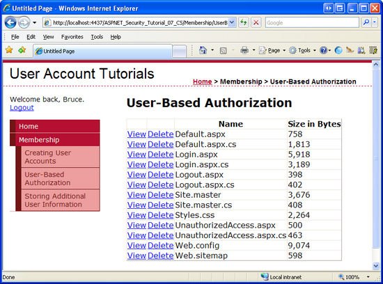](user-based-authorization-cs/_static/image19.png)

**Figure 7**: The GridView Lists the Files in the Web Application's Root Directory  ([Click to view full-size image](user-based-authorization-cs/_static/image21.png))

We need a means to display the contents of the selected file. Return to Visual Studio and add a TextBox named `FileContents` above the GridView. Set its `TextMode` property to `MultiLine` and its `Columns` and `Rows` properties to 95% and 10, respectively.

[!code-aspx[Main](user-based-authorization-cs/samples/sample11.aspx)]

Next, create an event handler for the GridView's [`SelectedIndexChanged` event](https://msdn.microsoft.com/en-us/library/system.web.ui.webcontrols.gridview.selectedindexchanged.aspx) and add the following code:

[!code-csharp[Main](user-based-authorization-cs/samples/sample12.cs)]

This code uses the GridView's `SelectedValue` property to determine the full file name of the selected file. Internally, the `DataKeys` collection is referenced in order to obtain the `SelectedValue`, so it is imperative that you set the GridView's `DataKeyNames` property to Name, as described earlier in this step. The [`File` class](https://msdn.microsoft.com/en-us/library/system.io.file.aspx) is used to read the selected file's contents into a string, which is then assigned to the `FileContents` TextBox's `Text` property, thereby displaying the contents of the selected file on the page.

[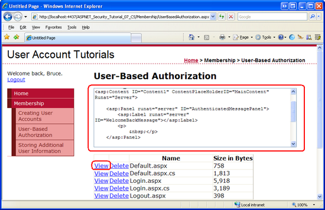](user-based-authorization-cs/_static/image22.png)

**Figure 8**: The Selected File's Contents are Displayed in the TextBox  ([Click to view full-size image](user-based-authorization-cs/_static/image24.png))

> [!NOTE]
> If you view the contents of a file that contains HTML markup, and then attempt to view or delete a file, you will receive an `HttpRequestValidationException` error. This occurs because on postback the TextBox's contents are sent back to the web server. By default, ASP.NET raises an `HttpRequestValidationException` error whenever potentially dangerous postback content, such as HTML markup, is detected. To disable this error from occurring, turn off request validation for the page by adding `ValidateRequest="false"` to the `@Page` directive. For more information on the benefits of request validation as well as what precautions you should take when disabling it, read [Request Validation - Preventing Script Attacks](https://asp.net/learn/whitepapers/request-validation/).

Finally, add an event handler with the following code for the GridView's [`RowDeleting` event](https://msdn.microsoft.com/en-us/library/system.web.ui.webcontrols.gridview.rowdeleting.aspx):

[!code-csharp[Main](user-based-authorization-cs/samples/sample13.cs)]

The code simply displays the full name of the file to delete in the `FileContents` TextBox *without* actually deleting the file.

[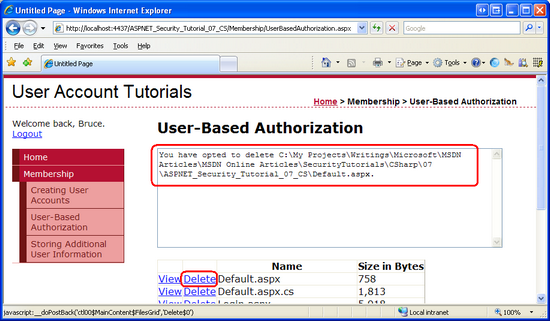](user-based-authorization-cs/_static/image25.png)

**Figure 9**: Clicking the Delete Button Does Not Actually Delete the File  ([Click to view full-size image](user-based-authorization-cs/_static/image27.png))

In Step 1 we configured the URL authorization rules to prohibit anonymous users from viewing the pages in the `Membership` folder. In order to better exhibit fine grain authentication, let's allow anonymous users to visit the `UserBasedAuthorization.aspx` page, but with limited functionality. To open this page up to be accessed by all users, add the following `<location>` element to the `Web.config` file in the `Membership` folder:

[!code-xml[Main](user-based-authorization-cs/samples/sample14.xml)]

After adding this `<location>` element, test the new URL authorization rules by logging out of the site. As an anonymous user you should be permitted to visit the `UserBasedAuthorization.aspx` page.

Currently, any authenticated or anonymous user can visit the `UserBasedAuthorization.aspx` page and view or delete files. Let's make it so that only authenticated users can view contents of a file and only Tito can delete a file. Such fine grain authorization rules can be applied declaratively, programmatically, or through a combination of both methods. Let's use the declarative approach to limit who can view the contents of a file; we'll use the programmatic approach to limit who can delete a file.

### Using the LoginView Control

As we've seen in past tutorials, the LoginView control is useful for displaying different interfaces for authenticated and anonymous users, and offers an easy way to hide functionality that is not accessible to anonymous users. Since anonymous users cannot view or delete files, we only need to show the `FileContents` TextBox when the page is visited by an authenticated user. To achieve this, add a LoginView control to the page, name it `LoginViewForFileContentsTextBox`, and move the `FileContents` TextBox's declarative markup into the LoginView control's `LoggedInTemplate`.

[!code-aspx[Main](user-based-authorization-cs/samples/sample15.aspx)]

The Web controls in the LoginView's templates are no longer directly accessible from the code-behind class. For example, the `FilesGrid` GridView's `SelectedIndexChanged` and `RowDeleting` event handlers currently reference the `FileContents` TextBox control with code like:

[!code-csharp[Main](user-based-authorization-cs/samples/sample16.cs)]

However, this code is no longer valid. By moving the `FileContents` TextBox into the `LoggedInTemplate` the TextBox cannot be directly accessed. Instead, we must use the `FindControl("controlId")` method to programmatically reference the control. Update the `FilesGrid` event handlers to reference the TextBox like so:

[!code-csharp[Main](user-based-authorization-cs/samples/sample17.cs)]

After moving the TextBox to the LoginView's `LoggedInTemplate` and updating the page's code to reference the TextBox using the `FindControl("controlId")` pattern, visit the page as an anonymous user. As Figure 10 shows, the `FileContents` TextBox is not displayed. However, the View LinkButton is still displayed.

[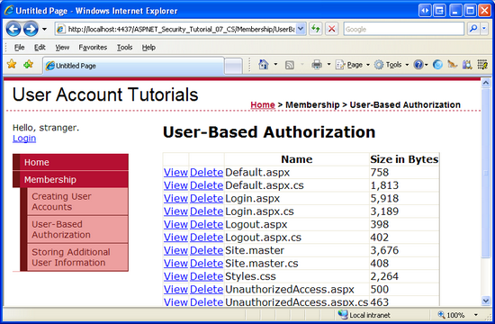](user-based-authorization-cs/_static/image28.png)

**Figure 10**: The LoginView Control Only Renders the `FileContents` TextBox for Authenticated Users  ([Click to view full-size image](user-based-authorization-cs/_static/image30.png))

One way to hide the View button for anonymous users is to convert the GridView field into a TemplateField. This will generate a template that contains the declarative markup for the View LinkButton. We can then add a LoginView control to the TemplateField and place the LinkButton within the LoginView's `LoggedInTemplate`, thereby hiding the View button from anonymous visitors. To accomplish this, click on the Edit Columns link from the GridView's Smart Tag to launch the Fields dialog box. Next, select the Select button from the list in the lower left corner and then click the Convert this field to a TemplateField link. Doing so will modify the field's declarative markup from:

[!code-aspx[Main](user-based-authorization-cs/samples/sample18.aspx)]

 To: 

[!code-aspx[Main](user-based-authorization-cs/samples/sample19.aspx)]

At this point, we can add a LoginView to the TemplateField. The following markup displays the View LinkButton only for authenticated users.

[!code-aspx[Main](user-based-authorization-cs/samples/sample20.aspx)]

As Figure 11 shows, the end result is not that pretty as the View column is still displayed even though the View LinkButtons within the column are hidden. We will look at how to hide the entire GridView column (and not just the LinkButton) in the next section.

[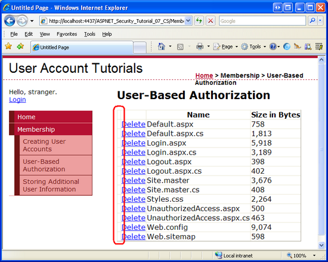](user-based-authorization-cs/_static/image31.png)

**Figure 11**: The LoginView Control Hides the View LinkButtons for Anonymous Visitors  ([Click to view full-size image](user-based-authorization-cs/_static/image33.png))

### Programmatically Limiting Functionality

In some circumstances, declarative techniques are insufficient for limiting functionality to a page. For example, the availability of certain page functionality may be dependent on criteria beyond whether the user visiting the page is anonymous or authenticated. In such cases, the various user interface elements can be displayed or hidden through programmatic means.

In order to limit the functionality programmatically, we need to perform two tasks:

1. Determine whether the user visiting the page can access the functionality, and
2. Programmatically modify the user interface based on whether the user has access to the functionality in question.

To demonstrate the application of these two tasks, let's only allow Tito to delete files from the GridView. Our first task, then, is to determine whether it is Tito visiting the page. Once that has been determined, we need to hide (or show) the GridView's Delete column. The GridView's columns are accessible through its `Columns` property; a column is only rendered if its `Visible` property is set to `true` (the default).

Add the following code to the `Page_Load` event handler prior to binding the data to the GridView:

[!code-csharp[Main](user-based-authorization-cs/samples/sample21.cs)]

As we discussed in the [*An Overview of Forms Authentication*](../introduction/an-overview-of-forms-authentication-cs.md) tutorial, `User.Identity.Name` returns the identity's name. This corresponds to the username entered in the Login control. If it is Tito visiting the page, the GridView's second column's `Visible` property is set to `true`; otherwise, it is set to `false`. The net result is that when someone other than Tito visits the page, either another authenticated user or an anonymous user, the Delete column is not rendered (see Figure 12); however, when Tito visits the page, the Delete column is present (see Figure 13).

[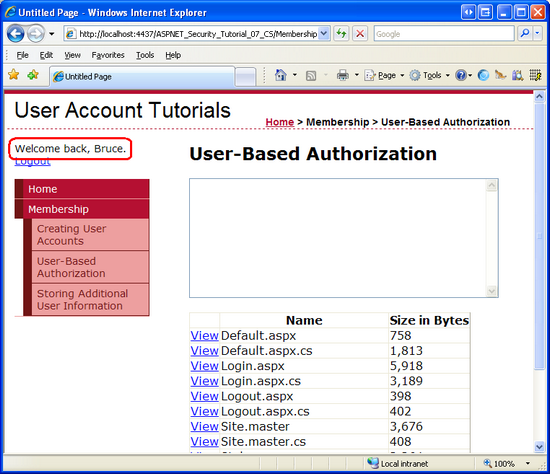](user-based-authorization-cs/_static/image34.png)

**Figure 12**: The Delete Column is Not Rendered When Visited By Someone Other Than Tito (Such as Bruce)  ([Click to view full-size image](user-based-authorization-cs/_static/image36.png))

[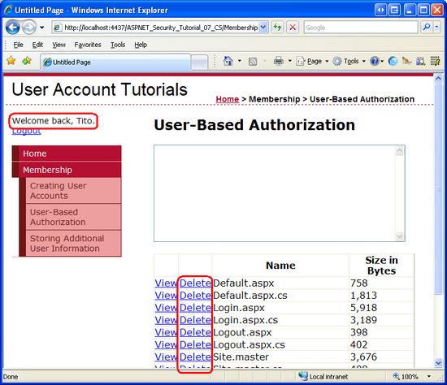](user-based-authorization-cs/_static/image37.png)

**Figure 13**: The Delete Column is Rendered for Tito  ([Click to view full-size image](user-based-authorization-cs/_static/image39.png))

## Step 4: Applying Authorization Rules to Classes and Methods

In Step 3 we disallowed anonymous users from viewing a file's contents and prohibited all users but Tito from deleting files. This was accomplished by hiding the associated user interface elements for unauthorized visitors through declarative and programmatic techniques. For our simple example, properly hiding the user interface elements was straightforward, but what about more complex sites where there may be many different ways to perform the same functionality? In limiting that functionality to unauthorized users, what happens if we forget to hide or disable all of the applicable user interface elements?

An easy way to ensure that a particular piece of functionality cannot be accessed by an unauthorized user is to decorate that class or method with the [`PrincipalPermission` attribute](https://msdn.microsoft.com/en-us/library/system.security.permissions.principalpermissionattribute.aspx). When the .NET runtime uses a class or executes one of its methods, it checks to ensure that the current security context has permission to use the class or execute the method. The `PrincipalPermission` attribute provides a mechanism through which we can define these rules.

Let's demonstrate using the `PrincipalPermission` attribute on the GridView's `SelectedIndexChanged` and `RowDeleting` event handlers to prohibit execution by anonymous users and users other than Tito, respectively. All we need to do is add the appropriate attribute atop each function definition:

[!code-csharp[Main](user-based-authorization-cs/samples/sample22.cs)]

The attribute for the `SelectedIndexChanged` event handler dictates that only authenticated users can execute the event handler, where as the attribute on the `RowDeleting` event handler limits the execution to Tito.

If, somehow, a user other than Tito attempts to execute the `RowDeleting` event handler or a non-authenticated user attempts to execute the `SelectedIndexChanged` event handler, the .NET runtime will raise a `SecurityException`.

[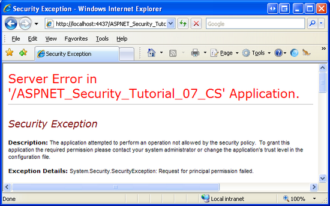](user-based-authorization-cs/_static/image40.png)

**Figure 14**: If the Security Context is not Authorized to Execute the Method, a `SecurityException` is Thrown  ([Click to view full-size image](user-based-authorization-cs/_static/image42.png))

> [!NOTE]
> To allow multiple security contexts to access a class or method, decorate the class or method with a `PrincipalPermission` attribute for each security context. That is, to allow both Tito and Bruce to execute the `RowDeleting` event handler, add *two* `PrincipalPermission` attributes:

[!code-csharp[Main](user-based-authorization-cs/samples/sample23.cs)]

In addition to ASP.NET pages, many applications also have an architecture that includes various layers, such as Business Logic and Data Access Layers. These layers are typically implemented as Class Libraries and offer classes and methods for performing business logic- and data-related functionality. The `PrincipalPermission` attribute is useful for applying authorization rules to these layers.

For more information on using the `PrincipalPermission` attribute to define authorization rules on classes and methods, refer to [Scott Guthrie](https://weblogs.asp.net/scottgu/)'s blog entry [Adding Authorization Rules to Business and Data Layers Using `PrincipalPermissionAttributes`](https://weblogs.asp.net/scottgu/archive/2006/10/04/Tip_2F00_Trick_3A00_-Adding-Authorization-Rules-to-Business-and-Data-Layers-using-PrincipalPermissionAttributes.aspx).

## Summary

In this tutorial we looked at how to apply user-based authorization rules. We started with a look at ASP.NET's URL authorization framework. On each request, the ASP.NET engine's `UrlAuthorizationModule` inspects the URL authorization rules defined in the application's configuration to determine whether the identity is authorized to access the requested resource. In short, URL authorization makes it easy to specify authorization rules for a specific page or for all pages in a particular directory.

The URL authorization framework applies authorization rules on a page-by-page basis. With URL authorization, either the requesting identity is authorized to access a particular resource or not. Many scenarios, however, call for more fine grain authorization rules. Rather than defining who is permitted to access a page, we may need to let everyone access a page, but to show different data or offer different functionality depending on the user visiting the page. Page-level authorization usually involves hiding specific user interface elements in order to prevent unauthorized users from accessing prohibited functionality. Additionally, it is possible to use attributes to restrict access to classes and execution of its methods for certain users.

Happy Programming!

### Further Reading

For more information on the topics discussed in this tutorial, refer to the following resources:

- [Adding Authorization Rules to Business and Data Layers Using `PrincipalPermissionAttributes`](https://weblogs.asp.net/scottgu/archive/2006/10/04/Tip_2F00_Trick_3A00_-Adding-Authorization-Rules-to-Business-and-Data-Layers-using-PrincipalPermissionAttributes.aspx)
- [ASP.NET Authorization](https://msdn.microsoft.com/en-us/library/wce3kxhd.aspx)
- [Changes Between IIS6 and IIS7 Security](https://www.iis.net/articles/view.aspx/IIS7/Managing-IIS7/Configuring-Security/Changes-between-IIS6-and-IIS7-Security)
- [Configuring Specific Files and Subdirectories](https://msdn.microsoft.com/en-us/library/6hbkh9s7.aspx)
- [Limiting Data Modification Functionality Based on the User](../../data-access/editing-inserting-and-deleting-data/limiting-data-modification-functionality-based-on-the-user-cs.md)
- [LoginView Control QuickStarts](https://quickstarts.asp.net/QuickStartv20/aspnet/doc/ctrlref/login/loginview.aspx)
- [Understanding IIS7 URL Authorization](https://www.iis.net/articles/view.aspx/IIS7/Managing-IIS7/Configuring-Security/URL-Authorization/Understanding-IIS7-URL-Authorization)
- [`UrlAuthorizationModule` Technical Documentation](https://msdn.microsoft.com/en-us/library/system.web.security.urlauthorizationmodule.aspx)
- [Working with Data in ASP.NET 2.0](../../data-access/index.md)

### About the Author

Scott Mitchell, author of multiple ASP/ASP.NET books and founder of 4GuysFromRolla.com, has been working with Microsoft Web technologies since 1998. Scott works as an independent consultant, trainer, and writer. His latest book is *[Sams Teach Yourself ASP.NET 2.0 in 24 Hours](https://www.amazon.com/exec/obidos/ASIN/0672327384/4guysfromrollaco)*. Scott can be reached at [mitchell@4guysfromrolla.com](mailto:mitchell@4guysfromrolla.com) or via his blog at [http://ScottOnWriting.NET](http://scottonwriting.net/).

### Special Thanks To

This tutorial series was reviewed by many helpful reviewers. Interested in reviewing my upcoming MSDN articles? If so, drop me a line at [mitchell@4GuysFromRolla.com](mailto:mitchell@4GuysFromRolla.com).

>[!div class="step-by-step"]
[Previous](validating-user-credentials-against-the-membership-user-store-cs.md)
[Next](storing-additional-user-information-cs.md)