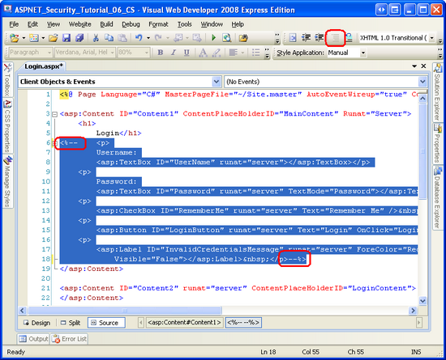
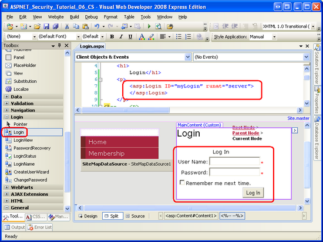
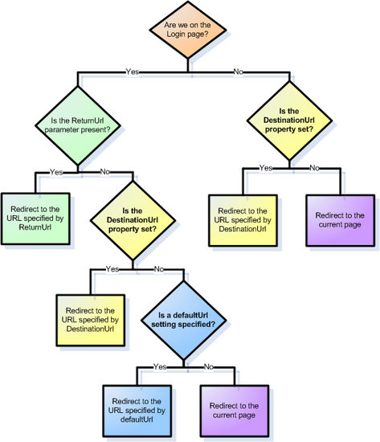
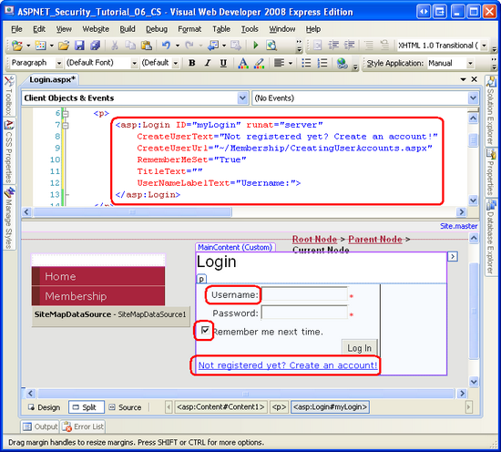
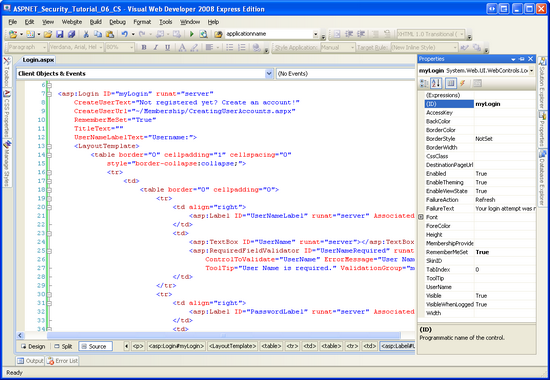
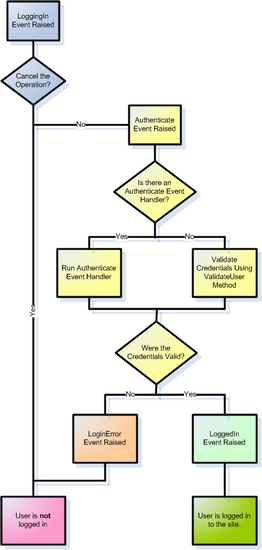

Validating User Credentials Against the Membership User Store (VB)
====================
by [Scott Mitchell](https://twitter.com/ScottOnWriting)

[Download Code](http://download.microsoft.com/download/3/f/5/3f5a8605-c526-4b34-b3fd-a34167117633/ASPNET_Security_Tutorial_06_VB.zip) or [Download PDF](http://download.microsoft.com/download/3/f/5/3f5a8605-c526-4b34-b3fd-a34167117633/aspnet_tutorial06_LoggingIn_vb.pdf)

> In this tutorial we will examine how to validate a user's credentials against the Membership user store using both programmatic means and the Login control. We will also look at how to customize the login control's appearance and behavior.

## Introduction

In the [preceding tutorial](creating-user-accounts-vb.md) we looked at how to create a new user account in the Membership framework. We first looked at programmatically creating user accounts via the `Membership` class's `CreateUser` method, and then examined using the CreateUserWizard Web control. However, the login page currently validates the supplied credentials against a hard-coded list of username and password pairs. We need to update the login page's logic so that it validates credentials against the Membership framework's user store.

Much like with creating user accounts, credentials can be validated programmatically or declaratively. The Membership API includes a method for programmatically validating a user's credentials against the user store. And ASP.NET ships with the Login Web control, which renders a user interface with textboxes for the username and password and a button to log in.

In this tutorial we will examine how to validate a user's credentials against the Membership user store using both programmatic means and the Login control. We will also look at how to customize the login control's appearance and behavior. Let's get started!

## Step 1: Validating Credentials Against the Membership User Store

For web sites that use forms authentication, a user logs on to the website by visiting a login page and entering their credentials. These credentials are then compared against the user store. If they are valid, then the user is granted a forms authentication ticket, which is a security token that indicates the identity and authenticity of the visitor.

To validate a user against the Membership framework, use the `Membership` class's [`ValidateUser` method](https://msdn.microsoft.com/en-us/library/system.web.security.membership.validateuser.aspx). The `ValidateUser` method takes in two input parameters - `username` and `password` - and returns a Boolean value indicating whether the credentials were valid. Like with the `CreateUser` method we examined in the previous tutorial, the `ValidateUser` method delegates the actual validation to the configured Membership provider.

The `SqlMembershipProvider` validates the supplied credentials by obtaining the specified user's password via the `aspnet_Membership_GetPasswordWithFormat` stored procedure. Recall that the `SqlMembershipProvider` stores users' passwords using one of three formats: clear, encrypted, or hashed. The `aspnet_Membership_GetPasswordWithFormat` stored procedure returns the password in its raw format. For encrypted or hashed passwords, the `SqlMembershipProvider` transforms the `password` value passed into the `ValidateUser` method into its equivalent encrypted or hashed state and then compares it with what was returned from the database. If the password stored in the database matches the formatted password entered by the user, the credentials are valid.

Let's update our login page (~/`Login.aspx`) so that it validates the supplied credentials against the Membership framework user store. We created this login page back in the [*An Overview of Forms Authentication*](../introduction/an-overview-of-forms-authentication-vb.md) tutorial, creating an interface with two TextBoxes for the username and password, a Remember Me checkbox, and a Login button (see Figure 1). The code validates the entered credentials against a hard-coded list of username and password pairs (Scott/password, Jisun/password, and Sam/password). In the [*Forms Authentication Configuration and Advanced Topics*](../introduction/forms-authentication-configuration-and-advanced-topics-vb.md) tutorial we updated the login page's code to store additional information in the forms authentication ticket's `UserData` property.

**Figure 1**: The Login Page's Interface Includes Two TextBoxes, a CheckBoxList, and a Button  ([Click to view full-size image](validating-user-credentials-against-the-membership-user-store-vb/_static/image3.png))

The login page's user interface can remain unchanged, but we need to replace the Login button's `Click` event handler with code that validates the user against the Membership framework user store. Update the event handler so that its code appears as follows:

[!code-vb[Main](validating-user-credentials-against-the-membership-user-store-vb/samples/sample1.vb)]

This code is remarkably simple. We start by calling the `Membership.ValidateUser` method, passing in the supplied username and password. If that method returns True, then the user is signed into the site via the `FormsAuthentication` class's RedirectFromLoginPage method. (As we discussed in the [*An Overview of Forms Authentication*](../introduction/an-overview-of-forms-authentication-vb.md) tutorial, the `FormsAuthentication.RedirectFromLoginPage` creates the forms authentication ticket and then redirects the user to the appropriate page.) If the credentials are invalid, however, the `InvalidCredentialsMessage` Label is displayed, informing the user that their username or password was incorrect.

That's all there is to it!

To test that the login page works as expected, attempt to login with one of the user accounts you created in the preceding tutorial. Or, if you have not yet created an account, go ahead and create one from the `~/Membership/CreatingUserAccounts.aspx` page.

> [!NOTE]
> When the user enters her credentials and submits the login page form, the credentials, including her password, are transmitted over the Internet to the web server in *plain text*. That means any hacker sniffing the network traffic can see the username and password. To prevent this, it is essential to encrypt the network traffic by using [Secure Socket Layers (SSL)](http://en.wikipedia.org/wiki/Secure_Sockets_Layer). This will ensure that the credentials (as well as the entire page's HTML markup) are encrypted from the moment they leave the browser until they are received by the web server.

### How the Membership Framework Handles Invalid Login Attempts

When a visitor reaches the login page and submits their credentials, their browser makes an HTTP request to the login page. If the credentials are valid, the HTTP response includes the authentication ticket in a cookie. Therefore, a hacker attempting to break into your site could create a program that exhaustively sends HTTP requests to the login page with a valid username and a guess at the password. If the password guess is correct, the login page will return the authentication ticket cookie, at which point the program knows it has stumbled upon a valid username/password pair. Through brute force, such a program might be able to stumble upon a user's password, especially if the password is weak.

To prevent such brute force attacks, the Membership framework locks out a user if there are a certain number of unsuccessful login attempts within a certain period of time. The exact parameters are configurable through the following two Membership provider configuration settings:

- `maxInvalidPasswordAttempts` - specifies how many invalid password attempts are allowed for the user within the time period before the account is locked out. The default value is 5.
- `passwordAttemptWindow` - indicates the time period in minutes during which the specified number of invalid login attempts will cause the account to be locked out. The default value is 10.

If a user has been locked out, she cannot login until an administrator unlocks her account. When a user is locked out, the `ValidateUser` method will *always* return `False`, even if valid credentials are supplied. While this behavior lessens the likelihood that a hacker will break into your site through brute force methods, it can end up locking out a valid user who has simply forgotten her password or accidentally has the Caps Lock on or is having a bad typing day.

Unfortunately, there is no built-in tool for unlocking a user account. In order to unlock an account, you can modify the database directly - change the `IsLockedOut` field in the `aspnet_Membership` table for the appropriate user account - or create a web-based interface that lists locked out accounts with options to unlock them. We will examine creating administrative interfaces for accomplishing common user account- and role-related tasks in a future tutorial.

> [!NOTE]
> One downside of the `ValidateUser` method is that when the supplied credentials are invalid, it does not provide any explanation as to why. The credentials may be invalid because there is no matching username/password pair in the user store, or because the user has not yet been approved, or because the user has been locked out. In Step 4 we will see how to show a more detailed message to the user when their login attempt fails.

## Step 2: Collecting Credentials through the Login Web Control

The [Login Web control](https://msdn.microsoft.com/en-us/library/system.web.ui.webcontrols.login.aspx) renders a default user interface very similar to the one we created back in the [*An Overview of Forms Authentication*](../introduction/an-overview-of-forms-authentication-vb.md) tutorial. Using the Login control saves us the work of having to create the interface to collect the visitor's credentials. Moreover, the Login control automatically signs in the user (assuming the submitted credentials are valid), thereby saving us from having to write any code.

Let's update `Login.aspx`, replacing the manually created interface and code with a Login control. Start by removing the existing markup and code in `Login.aspx`. You may delete it outright, or simply comment it out. To comment out declarative markup, surround it with the `<%--` and `--%>` delimiters. You can enter these delimiters manually, or, as Figure 2 shows, you may select the text to comment out and then click the Comment out the selected lines icon in the Toolbar. Similarly, you can use the Comment out the selected lines icon to comment out the selected code in the code-behind class.

**Figure 2**: Comment Out the Existing Declarative Markup and Source Code in Login.aspx  ([Click to view full-size image](validating-user-credentials-against-the-membership-user-store-vb/_static/image6.png))

> [!NOTE]
> The Comment out the selected lines icon is not available when viewing the declarative markup in Visual Studio 2005. If you are not using Visual Studio 2008 you will need to manually add the `<%--` and `--%>` delimiters.

Next, drag a Login control from the Toolbox on to the page and set its `ID` property to `myLogin`. At this point your screen should look similar to Figure 3. Note that the Login control's default interface includes TextBox controls for the username and password, a Remember me next time CheckBox, and a Log In Button. There are also `RequiredFieldValidator` controls for the two TextBoxes.

**Figure 3**: Add a Login Control to the Page  ([Click to view full-size image](validating-user-credentials-against-the-membership-user-store-vb/_static/image9.png))

And we're done! When the Login control's Log In button is clicked, a postback will occur and the Login control will call the `Membership.ValidateUser` method, passing in the entered username and password. If the credentials are invalid, the Login control displays a message stating such. If, however, the credentials are valid, then the Login control creates the forms authentication ticket and redirects the user to the appropriate page.

The Login control uses four factors to determine the appropriate page to redirect the user to upon a successful login:

- Whether the Login control is on the login page as defined by `loginUrl` setting in the forms authentication configuration; this setting's default value is `Login.aspx`
- The presence of a `ReturnUrl` querystring parameter
- The value of the Login control's [`DestinationUrl` property](https://msdn.microsoft.com/en-us/library/system.web.ui.webcontrols.login.destinationpageurl.aspx)
- The `defaultUrl` value specified in the forms authentication configuration settings; this setting's default value is Default.aspx

Figure 4 depicts the how the Login control uses these four parameters to arrive at its appropriate page decision.

**Figure 4**: Add a Login Control to the Page  ([Click to view full-size image](validating-user-credentials-against-the-membership-user-store-vb/_static/image12.png))

Take a moment to test out the Login control by visiting the site through a browser and logging in as an existing user in the Membership framework.

The Login control's rendered interface is highly configurable. There are a number of properties that influence its appearance; what's more, the Login control can be converted into a template for precise control over the layout the user interface elements. The remainder of this step examines how to customize the appearance and layout.

### Customizing the Login Control's Appearance

The Login control's default property settings render a user interface with a title ( Log In ), TextBox and Label controls for the username and password inputs, a Remember me next time CheckBox, and a Log In button. The appearances of these elements are all configurable through the Login control's numerous properties. Furthermore, additional user interface elements - such as a link to a page to create a new user account - can be added by setting a property or two.

Let's spend a few moments to gussy up the appearance of our Login control. Since the `Login.aspx` page already has text at the top of the page that says Login, the Login control's title is superfluous. Therefore, clear out the [`TitleText` property](https://msdn.microsoft.com/en-us/library/system.web.ui.webcontrols.login.titletext.aspx) value in order to remove the Login control's title.

The User Name: and Password: Labels to the left of the two TextBox controls can be customized through the [`UserNameLabelText`](https://msdn.microsoft.com/en-us/library/system.web.ui.webcontrols.login.usernamelabeltext.aspx) and [`PasswordLabelText` properties](https://msdn.microsoft.com/en-us/library/system.web.ui.webcontrols.login.passwordlabeltext.aspx), respectively. Let's change the User Name: Label to read Username:. The Label and TextBox styles are configurable through the [`LabelStyle`](https://msdn.microsoft.com/en-us/library/system.web.ui.webcontrols.login.labelstyle.aspx) and [`TextBoxStyle` properties](https://msdn.microsoft.com/en-us/library/system.web.ui.webcontrols.login.textboxstyle.aspx), respectively.

The Remember me next time CheckBox's Text property can be set through the Login control's [`RememberMeText` property](https://msdn.microsoft.com/en-us/library/system.web.ui.webcontrols.login.remembermetext.aspx), and its default checked state is configurable through the [`RememberMeSet` property](https://msdn.microsoft.com/en-us/library/system.web.ui.webcontrols.login.remembermeset.aspx) (which defaults to False). Go ahead and set the `RememberMeSet` property to True so that the Remember me next time CheckBox will be checked by default.

The Login control offers two properties for adjusting the layout of its user interface controls. The [`TextLayout` property](https://msdn.microsoft.com/en-us/library/system.web.ui.webcontrols.login.textlayout.aspx) indicates whether the Username: and Password: Labels appear to the left of their corresponding TextBoxes (the default), or above them. The [`Orientation` property](https://msdn.microsoft.com/en-us/library/system.web.ui.webcontrols.login.orientation.aspx) indicates whether the username and password inputs are situated vertically (one above the other) or horizontally. I am going to leave these two properties set to their defaults, but I encourage you to try setting these two properties to their non-default values to see the resulting effect.

> [!NOTE]
> In the next section, Configuring the Login Control's Layout, we will look at using templates to define the precise layout of the Layout control's user interface elements.

Wrap up the Login control's property settings by setting the [`CreateUserText`](https://msdn.microsoft.com/en-us/library/system.web.ui.webcontrols.login.createusertext.aspx) and [`CreateUserUrl` properties](https://msdn.microsoft.com/en-us/library/system.web.ui.webcontrols.login.createuserurl.aspx) to Not registered yet? Create an account! and `~/Membership/CreatingUserAccounts.aspx`, respectively. This adds a hyperlink to the Login control's interface pointing to the page we created in the [preceding tutorial](creating-user-accounts-vb.md). The Login control's [`HelpPageText`](https://msdn.microsoft.com/en-us/library/system.web.ui.webcontrols.login.helppagetext.aspx) and [`HelpPageUrl` properties](https://msdn.microsoft.com/en-us/library/system.web.ui.webcontrols.login.helppageurl.aspx) and [`PasswordRecoveryText`](https://msdn.microsoft.com/en-us/library/system.web.ui.webcontrols.login.passwordrecoverytext.aspx) and [`PasswordRecoveryUrl` properties](https://msdn.microsoft.com/en-us/library/system.web.ui.webcontrols.login.passwordrecoveryurl.aspx) work in the same manner, rendering links to a help page and a password recovery page.

After making these property changes, your Login control's declarative markup and appearance should look similar to that shown in Figure 5.

**Figure 5**: The Login Control's Properties' Values Dictate Its Appearance  ([Click to view full-size image](validating-user-credentials-against-the-membership-user-store-vb/_static/image15.png))

### Configuring the Login Control's Layout

The Login Web control's default user interface lays out the interface in an HTML `<table>`. But what if we need finer control over the rendered output? Maybe we want to replace the `<table>` with a series of `
` tags. Or what if our application requires additional credentials for authentication? Many financial websites, for instance, require users to supply not only a username and password, but also a Personal Identification Number (PIN), or other identifying information. Whatever the reasons may be, it is possible to convert the Login control into a template, from which we can explicitly define the interface's declarative markup.

We need to do two things in order to update the Login control to collect additional credentials:

1. Update the Login control's interface to include Web control(s) to collect the additional credentials.
2. Override the Login control's internal authentication logic so that a user is only authenticated if their username and password is valid and their additional credentials are valid, too.

To accomplish the first task, we need to convert the Login control into a template and add the necessary Web controls. As for the second task, the Login control's authentication logic can be superseded by creating an event handler for the control's [`Authenticate` event](https://msdn.microsoft.com/en-us/library/system.web.ui.webcontrols.login.authenticate.aspx).

Let's update the Login control so that it prompts users for their username, password, and email address and only authenticates the user if the email address supplied matches their email address on file. We first need to convert the Login control's interface to a template. From the Login control's Smart Tag, choose the Convert to template option.

**Figure 6**: Convert the Login Control to a Template  ([Click to view full-size image](validating-user-credentials-against-the-membership-user-store-vb/_static/image18.png))

> [!NOTE]
> To revert the Login control to its pre-template version, click the Reset link from the control's Smart Tag.

Converting the Login control to a template adds a `LayoutTemplate` to the control's declarative markup with HTML elements and Web controls defining the user interface. As Figure 7 shows, converting the control to a template removes a number of properties from the Properties window, such as `TitleText`, `CreateUserUrl`, and so forth, since these property values are ignored when using a template.

**Figure 7**: Fewer Properties are Available When the Login Control is Converted to a Template  ([Click to view full-size image](validating-user-credentials-against-the-membership-user-store-vb/_static/image21.png))

The HTML markup in the `LayoutTemplate` may be modified as needed. Likewise, feel free to add any new Web controls to the template. However, it is important that Login control's core Web controls remain in the template and keep their assigned `ID` values. In particular, do not remove or rename the `UserName` or `Password` TextBoxes, the `RememberMe` CheckBox, the `LoginButton` Button, the `FailureText` Label, or the `RequiredFieldValidator` controls.

To collect the visitor's email address, we need to add a TextBox to the template. Add the following declarative markup between the table row (`<tr>`) that contains the `Password` TextBox and the table row that holds the Remember me next time CheckBox:

[!code-aspx[Main](validating-user-credentials-against-the-membership-user-store-vb/samples/sample2.aspx)]

After adding the `Email` TextBox, visit the page through a browser. As Figure 8 shows, the Login control's user interface now includes a third textbox.

**Figure 8**: The Login Control Now Includes a Textbox for the User's Email Address  ([Click to view full-size image](validating-user-credentials-against-the-membership-user-store-vb/_static/image24.png))

At this point, the Login control is still using the `Membership.ValidateUser` method to validate the supplied credentials. Correspondingly, the value entered into the `Email` TextBox has no bearing on whether the user can log in. In Step 3 we will look at how to override the Login control's authentication logic so that the credentials are only considered valid if the username and password are valid and the supplied email address matches up with the email address on file.

## Step 3: Modifying the Login Control's Authentication Logic

When a visitor supplies her credentials and clicks the Log In button, a postback ensues and the Login control progresses through its authentication workflow. The workflow starts by raising the [`LoggingIn` event](https://msdn.microsoft.com/en-us/library/system.web.ui.webcontrols.login.loggingin.aspx). Any event handlers associated with this event may cancel the log in operation by setting the `e.Cancel` property to `True`.

If the log in operation is not cancelled, the workflow progresses by raising the [`Authenticate` event](https://msdn.microsoft.com/en-us/library/system.web.ui.webcontrols.login.authenticate.aspx). If there is an event handler for the `Authenticate` event, then it is responsible for determining whether the supplied credentials are valid or not. If no event handler is specified, the Login control uses the `Membership.ValidateUser` method to determine the validity of the credentials.

If the supplied credentials are valid, then the forms authentication ticket is created, the [`LoggedIn` event](https://msdn.microsoft.com/en-us/library/system.web.ui.webcontrols.login.loggedin.aspx) is raised, and the user is redirected to the appropriate page. If, however, the credentials are deemed invalid, then the [`LoginError` event](https://msdn.microsoft.com/en-us/library/system.web.ui.webcontrols.login.loginerror.aspx) is raised and a message is displayed informing the user that their credentials were invalid. By default, on failure the Login control simply sets its `FailureText` Label control's Text property to a failure message ( Your login attempt was not successful. Please try again ). However, if the Login control's [`FailureAction` property](https://msdn.microsoft.com/en-us/library/system.web.ui.webcontrols.login.failureaction.aspx) is set to `RedirectToLoginPage`, then the Login control issues a `Response.Redirect` to the login page appending the querystring parameter `loginfailure=1` (which causes the Login control to display the failure message).

Figure 9 offers a flow chart of the authentication workflow.

**Figure 9**: The Login Control's Authentication Workflow  ([Click to view full-size image](validating-user-credentials-against-the-membership-user-store-vb/_static/image27.png))

> [!NOTE]
> If you are wondering when you would use the `FailureAction`'s `RedirectToLogin` page option, consider the following scenario. Right now our `Site.master` master page currently has the text, Hello, stranger displayed in the left column when visited by an anonymous user, but imagine that we wanted to replace that text with a Login control. This would allow an anonymous user to log in from any page on the site, instead of requiring them to visit the login page directly. However, if a user was unable to log in via the Login control rendered by the master page, it might make sense to redirect them to the login page (`Login.aspx`) because that page likely includes additional instructions, links, and other help - such as links to create a new account or retrieve a lost password - that were not added to the master page.

### Creating the`Authenticate`Event Handler

In order to plug in our custom authentication logic, we need to create an event handler for the Login control's `Authenticate` event. Creating an event handler for the `Authenticate` event will generate the following event handler definition:

[!code-vb[Main](validating-user-credentials-against-the-membership-user-store-vb/samples/sample3.vb)]

As you can see, the `Authenticate` event handler is passed an object of type [`AuthenticateEventArgs`](https://msdn.microsoft.com/en-us/library/system.web.ui.webcontrols.authenticateeventargs.aspx) as its second input parameter. The `AuthenticateEventArgs` class contains a Boolean property named `Authenticated` that is used to specify whether the supplied credentials are valid. Our task, then, is to write code here that determines whether the supplied credentials are valid or not, and to set the `e.Authenticate` property accordingly.

### Determining and Validating the Supplied Credentials

Use the Login control's [`UserName`](https://msdn.microsoft.com/en-us/library/system.web.ui.webcontrols.login.username.aspx) and [`Password` properties](https://msdn.microsoft.com/en-us/library/system.web.ui.webcontrols.login.password.aspx) to determine the username and password credentials entered by the user. In order to determine the values entered into any additional Web controls (such as the `Email` TextBox we added in the previous step), use `LoginControlID.FindControl`("*`controlID`*") to obtain a programmatic reference to the Web control in the template whose `ID` property is equal to *`controlID`*. For example, to get a reference to the `Email` TextBox, use the following code:

`Dim EmailTextBox As TextBox = CType(myLogin.FindControl("Email"), TextBox)`

In order to validate the user's credentials we need to do two things:

1. Ensure that the provided username and password are valid
2. Ensure that email address entered matches the email address on file for the user attempting to log in

To accomplish the first check we can simply use the `Membership.ValidateUser` method like we saw in Step 1. For the second check, we need to determine the user's email address so that we can compare it to the email address they entered into the TextBox control. To get information about a particular user, use the `Membership` class's [`GetUser` method](https://msdn.microsoft.com/en-us/library/system.web.security.membership.getuser.aspx).

The `GetUser` method has a number of overloads. If used without passing in any parameters, it returns information about the currently logged in user. To get information about a particular user, call `GetUser` passing in their username. Either way, `GetUser` returns a [`MembershipUser` object](https://msdn.microsoft.com/en-us/library/system.web.security.membershipuser.aspx), which has properties like `UserName`, `Email`, `IsApproved`, `IsOnline`, and so on.

The following code implements these two checks. If both pass, then `e.Authenticate` is set to `True`, otherwise it is assigned `False`.

[!code-vb[Main](validating-user-credentials-against-the-membership-user-store-vb/samples/sample4.vb)]

With this code in place, attempt to log in as a valid user, entering the correct username, password, and email address. Try it again, but this time purposefully use an incorrect email address (see Figure 10). Finally, try it a third time using a non-existent username. In the first case you should be successfully logged on to the site, but in the last two cases you should see the Login control's invalid credentials message.

**Figure 10**: Tito Cannot Log In When Supplying an Incorrect Email Address  ([Click to view full-size image](validating-user-credentials-against-the-membership-user-store-vb/_static/image30.png))

> [!NOTE]
> As discussed in the How the Membership Framework Handles Invalid Login Attempts section in Step 1, when the `Membership.ValidateUser` method is called and passed invalid credentials, it keeps track of the invalid login attempt and locks out the user if they exceed a certain threshold of invalid attempts within a specified time window. Since our custom authentication logic calls the `ValidateUser` method, an incorrect password for a valid username will increment the invalid login attempt counter, but this counter is not incremented in the case where the username and password are valid, but the email address is incorrect. Chances are, this behavior is suitable, since it's unlikely that a hacker will know the username and password, but have to use brute force techniques to determine the user's email address.

## Step 4: Improving the Login Control's Invalid Credentials Message

When a user attempts to log on with invalid credentials, the Login control displays a message explaining that the login attempt was unsuccessful. In particular, the control displays the message specified by its [`FailureText` property](https://msdn.microsoft.com/en-us/library/system.web.ui.webcontrols.login.failuretext.aspx), which has a default value of Your login attempt was not successful. Please try again.

Recall that there are many reasons why a user's credentials may be invalid:

- The username may not exist
- The username exists, but the password is invalid
- The username and password are valid, but the user is not yet approved
- The username and password are valid, but the user is locked out (most likely because they exceeded the number of invalid login attempts within the specified time frame)

And there may be other reasons when using custom authentication logic. For example, with the code we wrote in Step 3, the username and password may be valid, but the email address may be incorrect.

Regardless of why the credentials are invalid, the Login control displays the same error message. This lack of feedback can be confusing for a user whose account has not yet been approved or who has been locked out. With a little bit of work, though, we can have the Login control display a more appropriate message.

Whenever a user attempts to login with invalid credentials the Login control raises its `LoginError` event. Go ahead and create an event handler for this event, and add the following code:

[!code-vb[Main](validating-user-credentials-against-the-membership-user-store-vb/samples/sample5.vb)]

The above code starts by setting the Login control's `FailureText` property to the default value ( Your login attempt was not successful. Please try again ). It then checks to see if the username supplied maps to an existing user account. If so, it consults the resulting `MembershipUser` object's `IsLockedOut` and `IsApproved` properties to determine if the account has been locked out or has not yet been approved. In either case, the `FailureText` property is updated to a corresponding value.

To test this code, purposefully attempt to log in as an existing user, but use an incorrect password. Do this five times in a row within a 10 minute time frame and the account will be locked out. As Figure 11 shows, subsequent login attempts will always fail (even with the correct password), but will now display the more descriptive Your account has been locked out because of too many invalid login attempts. Please contact the administrator to have your account unlocked message.

**Figure 11**: Tito Performed Too Many Invalid Login Attempts and Has Been Locked Out  ([Click to view full-size image](validating-user-credentials-against-the-membership-user-store-vb/_static/image33.png))

## Summary

Prior this tutorial, our login page validated the supplied credentials against a hard-coded list of username/password pairs. In this tutorial, we updated the page to validate credentials against the Membership framework. In Step 1 we looked at using the `Membership.ValidateUser` method programmatically. In Step 2 we replaced our manually created user interface and code with the Login control.

The Login control renders a standard login user interface and automatically validates the user's credentials against the Membership framework. Moreover, in the event of valid credentials, the Login control signs the user in via forms authentication. In short, a fully functional login user experience is available by simply dragging the Login control onto a page, no extra declarative markup or code necessary. What's more, the Login control is highly customizable, allowing for a fine degree of control over both the rendered user interface and authentication logic.

At this point visitors to our website can create a new user account and log into the site, but we have yet to look at restricting access to pages based on the authenticated user. Currently, any user, authenticated or anonymous, can view any page on our site. Along with controlling access to our site's pages on a user-by-user basis, we might have certain pages whose functionality depends on the user. The next tutorial looks at how to limit access and in-page functionality based on the logged in user.

Happy Programming!

### Further Reading

For more information on the topics discussed in this tutorial, refer to the following resources:

- [Displaying Custom Messages to Locked Out and Non-Approved Users](http://aspnet.4guysfromrolla.com/articles/050306-1.aspx)
- [Examining ASP.NET 2.0's Membership, Roles, and Profile](http://aspnet.4guysfromrolla.com/articles/120705-1.aspx)
- [How To: Create an ASP.NET Login Page](https://msdn.microsoft.com/en-us/library/ms178331.aspx)
- [Login Control Technical Documentation](https://msdn.microsoft.com/en-us/library/system.web.ui.webcontrols.login.aspx)
- [Using the Login Controls](https://quickstarts.asp.net/QuickStartv20/aspnet/doc/security/login.aspx)

### About the Author

Scott Mitchell, author of multiple ASP/ASP.NET books and founder of 4GuysFromRolla.com, has been working with Microsoft Web technologies since 1998. Scott works as an independent consultant, trainer, and writer. His latest book is *[Sams Teach Yourself ASP.NET 2.0 in 24 Hours](https://www.amazon.com/exec/obidos/ASIN/0672327384/4guysfromrollaco)*. Scott can be reached at [mitchell@4guysfromrolla.com](mailto:mitchell@4guysfromrolla.com) or via his blog at [http://ScottOnWriting.NET](http://scottonwriting.net/).

### Special Thanks To

This tutorial series was reviewed by many helpful reviewers. Lead reviewers for this tutorial were Teresa Murphy and Michael Olivero. Interested in reviewing my upcoming MSDN articles? If so, drop me a line at [mitchell@4GuysFromRolla.com](mailto:mitchell@4GuysFromRolla.com).

>[!div class="step-by-step"]
[Previous](creating-user-accounts-vb.md)
[Next](user-based-authorization-vb.md)