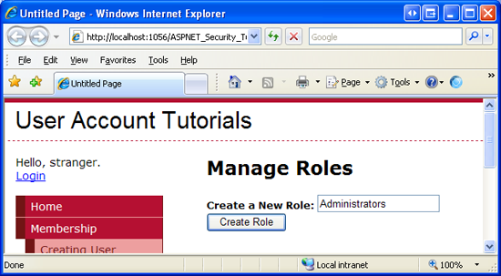
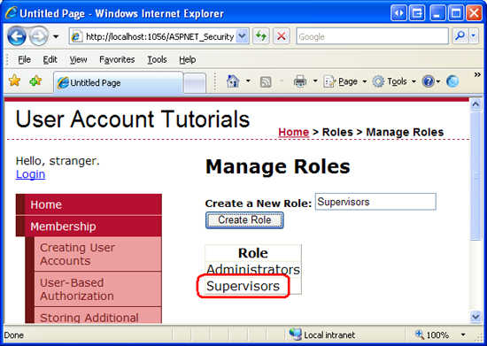
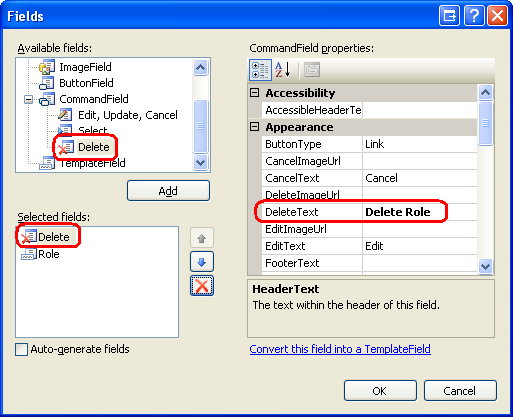

Creating and Managing Roles (C#)
====================
by [Scott Mitchell](https://twitter.com/ScottOnWriting)

[Download Code](http://download.microsoft.com/download/6/0/3/6032582f-360d-4739-b935-38721fdb86ea/CS.09.zip) or [Download PDF](http://download.microsoft.com/download/6/0/3/6032582f-360d-4739-b935-38721fdb86ea/aspnet_tutorial09_CreatingRoles_cs.pdf)

> This tutorial examines the steps necessary for configuring the Roles framework. Following that, we will build web pages to create and delete roles.

## Introduction

In the [*User-Based Authorization*](../membership/user-based-authorization-cs.md) tutorial we looked at using URL authorization to restrict certain users from a set of pages and explored declarative and programmatic techniques for adjusting an ASP.NET page's functionality based on the visiting user. Granting permission for page access or functionality on a user-by-user basis, however, can become a maintenance nightmare in scenarios where there are many user accounts or when users' privileges change often. Any time a user gains or loses authorization to perform a particular task, the administrator needs to update the appropriate URL authorization rules, declarative markup, and code.

It usually helps to classify users into groups or *roles* and then to apply permissions on a role-by-role basis. For example, most web applications have a certain set of pages or tasks that are reserved only for administrative users. Using the techniques learned in the *User-Based Authorization* tutorial, we would add the appropriate URL authorization rules, declarative markup, and code to allow the specified user accounts to perform administrative tasks. But if a new administrator was added or if an existing administrator needed to have her administration rights revoked, we would have to return and update the configuration files and web pages. With roles, however, we could create a role called Administrators and assign those trusted users to the Administrators role. Next, we would add the appropriate URL authorization rules, declarative markup, and code to allow the Administrators role to perform the various administrative tasks. With this infrastructure in place, adding new administrators to the site or removing existing ones is as simple as including or removing the user from the Administrators role. No configuration, declarative markup, or code changes are necessary.

ASP.NET offers a Roles framework for defining roles and associating them with user accounts. With the Roles framework we can create and delete roles, add users to or remove users from a role, determine the set of users that belong to a particular role, and tell whether a user belongs to a particular role. Once the Roles framework has been configured, we can limit access to pages on a role-by-role basis through URL authorization rules and show or hide additional information or functionality on a page based on the currently logged on user's roles.

This tutorial examines the steps necessary for configuring the Roles framework. Following that, we will build web pages to create and delete roles. In the [*Assigning Roles to Users*](assigning-roles-to-users-cs.md) tutorial we will look at how to add and remove users from roles. And in the [*Role-Based Authorization*](role-based-authorization-cs.md) tutorial we will see how to limit access to pages on a role-by-role basis along with how to adjust page functionality depending on the visiting user's role. Let's get started!

## Step 1: Adding New ASP.NET Pages

In this tutorial and the next two we will be examining various roles-related functions and capabilities. We will need a series of ASP.NET pages to implement the topics examined throughout these tutorials. Let's create these pages and update the site map.

Start by creating a new folder in the project named `Roles`. Next, add four new ASP.NET pages to the `Roles` folder, linking each page with the `Site.master` master page. Name the pages:

- `ManageRoles.aspx`
- `UsersAndRoles.aspx`
- `CreateUserWizardWithRoles.aspx`
- `RoleBasedAuthorization.aspx`

At this point your project's Solution Explorer should look similar to the screen shot shown in Figure 1.

**Figure 1**: Four New Pages Have Been Added to the `Roles` Folder  ([Click to view full-size image](creating-and-managing-roles-cs/_static/image3.png))

Each page should, at this point, have the two Content controls, one for each of the master page's ContentPlaceHolders: `MainContent` and `LoginContent`.

[!code-aspx[Main](creating-and-managing-roles-cs/samples/sample1.aspx)]

Recall that the `LoginContent` ContentPlaceHolder's default markup displays a link to log on or log off the site, depending on whether the user is authenticated. The presence of the `Content2` Content control in the ASP.NET page, however, overrides the master page's default markup. As we discussed in [*An Overview of Forms Authentication*](../introduction/an-overview-of-forms-authentication-cs.md) tutorial, overriding the default markup is useful in pages where we do not want to display login-related options in the left column.

For these four pages, however, we want to show the master page's default markup for the `LoginContent` ContentPlaceHolder. Therefore, remove the declarative markup for the `Content2` Content control. After doing so, each of the four page's markup should contain just one Content control.

Finally, let's update the site map (`Web.sitemap`) to include these new web pages. Add the following XML after the `<siteMapNode>` we added for the Membership tutorials.

[!code-xml[Main](creating-and-managing-roles-cs/samples/sample2.xml)]

With the site map updated, visit the site through a browser. As Figure 2 shows, the navigation on the left now includes items for the Roles tutorials.

**Figure 2**: Four New Pages Have Been Added to the `Roles` Folder  ([Click to view full-size image](creating-and-managing-roles-cs/_static/image6.png))

## Step 2: Specifying and Configuring the Roles Framework Provider

Like the Membership framework, the Roles framework is built atop the provider model. As discussed in the [*Security Basics and ASP.NET Support*](../introduction/security-basics-and-asp-net-support-cs.md) tutorial, the .NET Framework ships with three built-in Roles providers: [`AuthorizationStoreRoleProvider`](https://msdn.microsoft.com/en-us/library/system.web.security.authorizationstoreroleprovider.aspx), [`WindowsTokenRoleProvider`](https://msdn.microsoft.com/en-us/library/system.web.security.windowstokenroleprovider.aspx), and [`SqlRoleProvider`](https://msdn.microsoft.com/en-us/library/system.web.security.sqlroleprovider.aspx). This tutorial series focuses on the `SqlRoleProvider`, which uses a Microsoft SQL Server database as the role store.

Underneath the covers the Roles framework and `SqlRoleProvider` work just like the Membership framework and `SqlMembershipProvider`. The .NET Framework contains a `Roles` class that serves as the API to the Roles framework. The `Roles` class has static methods like `CreateRole`, `DeleteRole`, `GetAllRoles`, `AddUserToRole`, `IsUserInRole`, and so forth. When one of these methods is invoked, the `Roles` class delegates the call to the configured provider. The `SqlRoleProvider` works with the role-specific tables (`aspnet_Roles` and `aspnet_UsersInRoles`) in response.

In order to use the `SqlRoleProvider` provider in our application, we need to specify what database to use as the store. The `SqlRoleProvider` expects the specified role store to have certain database tables, views, and stored procedures. These requisite database objects can be added using the [`aspnet_regsql.exe` tool](https://msdn.microsoft.com/en-us/library/ms229862.aspx). At this point we already have a database with the schema necessary for the `SqlRoleProvider`. Back in the [*Creating the Membership Schema in SQL Server*](../membership/creating-the-membership-schema-in-sql-server-cs.md) tutorial we created a database named `SecurityTutorials.mdf` and used `aspnet_regsql.exe` to add the application services, which included the database objects required by the `SqlRoleProvider`. Therefore we just need to tell the Roles framework to enable role support and to use the `SqlRoleProvider` with the `SecurityTutorials.mdf` database as the role store.

The Roles framework is configured via the &lt;`roleManager`&gt; element in the application's `Web.config` file. By default, role support is disabled. To enable it, you must set the [&lt;`roleManager`&gt;](https://msdn.microsoft.com/en-us/library/ms164660.aspx) element's `enabled` attribute to `true` like so:

[!code-xml[Main](creating-and-managing-roles-cs/samples/sample3.xml)]

By default, all web applications have a Roles provider named `AspNetSqlRoleProvider` of type `SqlRoleProvider`. This default provider is registered in `machine.config` (located at `%WINDIR%\Microsoft.Net\Framework\v2.0.50727\CONFIG`):

[!code-xml[Main](creating-and-managing-roles-cs/samples/sample4.xml)]

The provider's `connectionStringName` attribute specifies the role store that is used. The `AspNetSqlRoleProvider` provider sets this attribute to `LocalSqlServer`, which is also defined in `machine.config` and points, by default, to a SQL Server 2005 Express Edition database in the `App_Data` folder named `aspnet.mdf`.

Consequently, if we simply enable the Roles framework without specifying any provider information in our application's `Web.config` file, the application uses the default registered Roles provider, `AspNetSqlRoleProvider`. If the `~/App_Data/aspnet.mdf` database does not exist, the ASP.NET runtime will automatically create it and add the application services schema. However, we don't want to use the `aspnet.mdf` database; rather, we want to use the `SecurityTutorials.mdf` database that we have already created and added the application services schema to. This modification can be accomplished in one of two ways:

- **Specify a value for the****`LocalSqlServer`****connection string name in****`Web.config`****.** By overwriting the `LocalSqlServer` connection string name value in `Web.config`, we can use the default registered Roles provider (`AspNetSqlRoleProvider`) and have it correctly work with the `SecurityTutorials.mdf` database. For more information on this technique, see [Scott Guthrie](https://weblogs.asp.net/scottgu/)'s blog post, [Configuring ASP.NET 2.0 Application Services to Use SQL Server 2000 or SQL Server 2005](https://weblogs.asp.net/scottgu/archive/2005/08/25/423703.aspx).
- **Add a new registered provider of type****`SqlRoleProvider`****and configure its****`connectionStringName`****setting to point to the****`SecurityTutorials.mdf`****database.** This is the approach I recommended and used in the [*Creating the Membership Schema in SQL Server*](../membership/creating-the-membership-schema-in-sql-server-cs.md) tutorial, and it is the approach I will use in this tutorial as well.

Add the following Roles configuration markup to the `Web.config` file. This markup registers a new provider named `SecurityTutorialsSqlRoleProvider`.

[!code-xml[Main](creating-and-managing-roles-cs/samples/sample5.xml)]

The above markup defines the `SecurityTutorialsSqlRoleProvider` as the default provider (via the `defaultProvider` attribute in the `<roleManager>` element). It also sets the `SecurityTutorialsSqlRoleProvider`'s `applicationName` setting to `SecurityTutorials`, which is the same `applicationName` setting used by the Membership provider (`SecurityTutorialsSqlMembershipProvider`). While not shown here, the [`<add>` element](https://msdn.microsoft.com/en-us/library/ms164662.aspx) for the `SqlRoleProvider` may also contain a `commandTimeout` attribute to specify the database timeout duration, in seconds. The default value is 30.

With this configuration markup in place, we are ready to start using role functionality within our application.

> [!NOTE]
> The above configuration markup illustrates using the &lt;`roleManager`&gt; element's `enabled` and `defaultProvider` attributes. There are a number of other attributes that affect how the Roles framework associates role information on a user-by-user basis. We will examine these settings in the [*Role-Based Authorization*](role-based-authorization-cs.md) tutorial.

## Step 3: Examining the Roles API

The Roles framework's functionality is exposed via the [`Roles` class](https://msdn.microsoft.com/en-us/library/system.web.security.roles.aspx), which contains thirteen static methods for performing role-based operations. When we look at creating and deleting roles in Steps 4 and 6 we will use the [`CreateRole`](https://msdn.microsoft.com/en-us/library/system.web.security.roles.createrole.aspx) and [`DeleteRole`](https://msdn.microsoft.com/en-us/library/system.web.security.roles.deleterole.aspx) methods, which add or remove a role from the system.

To get a list of all of the roles in the system, use the [`GetAllRoles` method](https://msdn.microsoft.com/en-us/library/system.web.security.roles.getallroles.aspx) (see Step 5). The [`RoleExists` method](https://msdn.microsoft.com/en-us/library/system.web.security.roles.roleexists.aspx) returns a Boolean value indicating whether a specified role exists.

In the next tutorial we will examine how to associate users with roles. The `Roles` class's [`AddUserToRole`](https://msdn.microsoft.com/en-us/library/system.web.security.roles.addusertorole.aspx), [`AddUserToRoles`](https://msdn.microsoft.com/en-us/library/system.web.security.roles.addusertoroles.aspx), [`AddUsersToRole`](https://msdn.microsoft.com/en-us/library/system.web.security.roles.adduserstorole.aspx), and [`AddUsersToRoles`](https://msdn.microsoft.com/en-us/library/system.web.security.roles.adduserstoroles.aspx) methods add one or more users to one or more roles. To remove users from roles, use the [`RemoveUserFromRole`](https://msdn.microsoft.com/en-us/library/system.web.security.roles.removeuserfromrole.aspx), [`RemoveUserFromRoles`](https://msdn.microsoft.com/en-us/library/system.web.security.roles.removeuserfromroles.aspx), [`RemoveUsersFromRole`](https://msdn.microsoft.com/en-us/library/system.web.security.roles.removeusersfromrole.aspx), or [`RemoveUsersFromRoles`](https://msdn.microsoft.com/en-us/library/system.web.security.roles.removeusersfromroles.aspx) methods.

In the [*Role-Based Authorization*](role-based-authorization-cs.md) tutorial we will look at ways to programmatically show or hide functionality based on the currently logged in user's role. To accomplish this, we can use the `Role` class's [`FindUsersInRole`](https://msdn.microsoft.com/en-us/library/system.web.security.roles.findusersinrole.aspx), [`GetRolesForUser`](https://msdn.microsoft.com/en-us/library/system.web.security.roles.getrolesforuser.aspx), [`GetUsersInRole`](https://msdn.microsoft.com/en-us/library/system.web.security.roles.getusersinrole.aspx), or [`IsUserInRole`](https://msdn.microsoft.com/en-us/library/system.web.security.roles.isuserinrole.aspx) methods.

> [!NOTE]
> Keep in mind that any time one of these methods is invoked, the `Roles` class delegates the call to the configured provider. In our case, this means that the call is being sent to the `SqlRoleProvider`. The `SqlRoleProvider` then performs the appropriate database operation based on the invoked method. For example, the code `Roles.CreateRole("Administrators")` results in the `SqlRoleProvider` executing the `aspnet_Roles_CreateRole` stored procedure, which inserts a new record into the `aspnet_Roles` table named Administrators .

The remainder of this tutorial looks at using the `Roles` class's `CreateRole`, `GetAllRoles`, and `DeleteRole` methods to manage the roles in the system.

## Step 4: Creating New Roles

Roles offer a way to arbitrarily group users, and most commonly this grouping is used for a more convenient way to apply authorization rules. But in order to use roles as an authorization mechanism we first need to define what roles exist in the application. Unfortunately, ASP.NET does not include a CreateRoleWizard control. In order to add new roles we need to create a suitable user interface and invoke the Roles API ourselves. The good news is that this is very easy to accomplish.

> [!NOTE]
> While there is no CreateRoleWizard Web control, there is the [ASP.NET Web Site Administration Tool](https://msdn.microsoft.com/en-us/library/ms228053.aspx), which is a local ASP.NET application designed to assist with viewing and managing your web application's configuration. However, I am not a big fan of the ASP.NET Web Site Administration Tool for two reasons. First, it is a bit buggy and the user experience leaves a lot to be desired. Second, the ASP.NET Web Site Administration Tool is designed to only work locally, meaning that you will have to build your own role management web pages if you need to manage roles on a live site remotely. For these two reasons, this tutorial and the next will focus on building the necessary role management tools in a web page rather than relying on the ASP.NET Web Site Administration Tool.

Open the `ManageRoles.aspx` page in the `Roles` folder and add a TextBox and a Button Web control to the page. Set the TextBox control's `ID` property to `RoleName` and the Button's `ID` and `Text` properties to `CreateRoleButton` and Create Role, respectively. At this point, your page's declarative markup should look similar to the following:

[!code-aspx[Main](creating-and-managing-roles-cs/samples/sample6.aspx)]

Next, double-click the `CreateRoleButton` Button control in the Designer to create a `Click` event handler and then add the following code:

[!code-csharp[Main](creating-and-managing-roles-cs/samples/sample7.cs)]

The above code starts by assigning the trimmed role name entered in the `RoleName` TextBox to the `newRoleName` variable. Next, the `Roles` class's `RoleExists` method is called to determine if the role `newRoleName` already exists in the system. If the role does not exist, it is created via a call to the `CreateRole` method. If the `CreateRole` method is passed a role name that already exists in the system, a `ProviderException` exception is thrown. This is why the code first checks to ensure that the role does not already exist in the system before calling `CreateRole`. The `Click` event handler concludes by clearing out the `RoleName` TextBox's `Text` property.

> [!NOTE]
> You may be wondering what will happen if the user doesn't enter any value into the `RoleName` TextBox. If the value passed into the `CreateRole` method is `null` or an empty string, an exception is raised. Likewise, if the role name contains a comma an exception is raised. Consequently, the page should contain validation controls to ensure that the user enters a role and that it does not contain any commas. I leave as an exercise for the reader.

Let's create a role named Administrators. Visit the `ManageRoles.aspx` page through a browser, type in Administrators into the textbox (see Figure 3), and then click the Create Role button.

**Figure 3**: Create an Administrators Role  ([Click to view full-size image](creating-and-managing-roles-cs/_static/image9.png))

What happens? A postback occurs, but there's no visual cue that the role has actually been added to the system. We will update this page in Step 5 to include visual feedback. For now, however, you can verify that the role was created by going to the `SecurityTutorials.mdf` database and displaying the data from the `aspnet_Roles` table. As Figure 4 shows, the `aspnet_Roles` table contains a record for the just-added Administrators roles.

**Figure 4**: The `aspnet_Roles` Table has a Row for the Administrators  ([Click to view full-size image](creating-and-managing-roles-cs/_static/image12.png))

## Step 5: Displaying the Roles in the System

Let's augment the `ManageRoles.aspx` page to include a list of the current roles in the system. To accomplish this, add a GridView control to the page and set its `ID` property to `RoleList`. Next, add a method to the page's code-behind class named `DisplayRolesInGrid` using the following code:

[!code-csharp[Main](creating-and-managing-roles-cs/samples/sample8.cs)]

The `Roles` class's `GetAllRoles` method returns all of the roles in the system as an array of strings. This string array is then bound to the GridView. In order to bind the list of roles to the GridView when the page is first loaded, we need to call the `DisplayRolesInGrid` method from the page's `Page_Load` event handler. The following code calls this method when the page is first visited, but not on subsequent postbacks.

[!code-csharp[Main](creating-and-managing-roles-cs/samples/sample9.cs)]

With this code in place, visit the page through a browser. As Figure 5 shows, you should see a grid with a single column labeled Item. The grid includes a row for the Administrators role we added in Step 4.

**Figure 5**: The GridView Displays the Roles in a Single Column  ([Click to view full-size image](creating-and-managing-roles-cs/_static/image15.png))

The GridView displays a lone column labeled Item because the GridView's `AutoGenerateColumns` property is set to True (the default), which causes the GridView to automatically create a column for each property in its `DataSource`. An array has a single property that represents the elements in the array, hence the single column in the GridView.

When displaying data with a GridView, I prefer to explicitly define my columns rather than have them implicitly generated by the GridView. By explicitly defining the columns it is much easier to format the data, rearrange the columns, and perform other common tasks. Therefore, let's update the GridView's declarative markup so that its columns are explicitly defined.

Start by setting the GridView's `AutoGenerateColumns` property to False. Next, add a TemplateField to the grid, set its `HeaderText` property to Roles, and configure its `ItemTemplate` so that it displays the contents of the array. To accomplish this, add a Label Web control named `RoleNameLabel` to the `ItemTemplate` and bind its `Text` property to `Container.DataItem`.

These properties and the `ItemTemplate`'s contents can be set declaratively or through the GridView's Fields dialog box and Edit Templates interface. To reach the Fields dialog box, click the Edit Columns link in the GridView's Smart Tag. Next, uncheck the Auto-generate fields checkbox to set the `AutoGenerateColumns` property to False, and add a TemplateField to the GridView, setting its `HeaderText` property to Role. To define the `ItemTemplate`'s contents, choose the Edit Templates option from the GridView's Smart Tag. Drag a Label Web control onto the `ItemTemplate`, set its `ID` property to `RoleNameLabel`, and configure its databinding settings so that its `Text` property is bound to `Container.DataItem`.

Regardless of what approach you use, the GridView's resulting declarative markup should look similar to the following when you are done.

[!code-aspx[Main](creating-and-managing-roles-cs/samples/sample10.aspx)]

> [!NOTE]
> The array's contents are displayed using the databinding syntax `<%# Container.DataItem %>`. A thorough description of why this syntax is used when displaying the contents of an array bound to the GridView is beyond the scope of this tutorial. For more information on this matter, refer to [Binding a Scalar Array to a Data Web Control](http://aspnet.4guysfromrolla.com/articles/082504-1.aspx).

Currently, the `RoleList` GridView is only bound to the list of roles when the page is first visited. We need to refresh the grid whenever a new role is added. To accomplish this, update the `CreateRoleButton` Button's `Click` event handler so that it calls the `DisplayRolesInGrid` method if a new role is created.

[!code-csharp[Main](creating-and-managing-roles-cs/samples/sample11.cs)]

Now when the user adds a new role the `RoleList` GridView shows the just-added role on postback, providing visual feedback that the role was successfully created. To illustrate this, visit the `ManageRoles.aspx` page through a browser and add a role named Supervisors. Upon clicking the Create Role button, a postback will ensue and the grid will update to include Administrators as well as the new role, Supervisors.

**Figure 6**: The Supervisors Role has Been Added  ([Click to view full-size image](creating-and-managing-roles-cs/_static/image18.png))

## Step 6: Deleting Roles

At this point a user can create a new role and view all existing roles from the `ManageRoles.aspx` page. Let's allow users to also delete roles. The `Roles.DeleteRole` method has two overloads:

- [`DeleteRole(roleName)`](https://msdn.microsoft.com/en-us/library/ek4sywc0.aspx) - deletes the role *roleName*. An exception is thrown if the role contains one or more members.
- [`DeleteRole(roleName, throwOnPopulatedRole)`](https://msdn.microsoft.com/en-us/library/38h6wf59.aspx) - deletes the role *roleName*. If *throwOnPopulateRole* is `true`, then an exception is thrown if the role contains one or more members. If *throwOnPopulateRole* is `false`, then the role is deleted whether it contains any members or not. Internally, the `DeleteRole(roleName)` method calls `DeleteRole(roleName, true)`.

The `DeleteRole` method will also throw an exception if *roleName* is `null` or an empty string or if *roleName* contains a comma. If *roleName* does not exist in the system, `DeleteRole` fails silently, without raising an exception.

Let's augment the GridView in `ManageRoles.aspx` to include a Delete button that, when clicked, deletes the selected role. Start by adding a Delete button to the GridView by going to the Fields dialog box and adding a Delete button, which is located under the CommandField option. Make the Delete button the far left column and set its `DeleteText` property to Delete Role .

**Figure 7**: Add a Delete Button to the `RoleList` GridView  ([Click to view full-size image](creating-and-managing-roles-cs/_static/image21.png))

After adding the Delete button, your GridView's declarative markup should look similar to the following:

[!code-aspx[Main](creating-and-managing-roles-cs/samples/sample12.aspx)]

Next, create an event handler for the GridView's `RowDeleting` event. This is the event that is raised on postback when the Delete Role button is clicked. Add the following code to the event handler.

[!code-csharp[Main](creating-and-managing-roles-cs/samples/sample13.cs)]

The code starts by programmatically referencing the `RoleNameLabel` Web control in the row whose Delete Role button was clicked. The `Roles.DeleteRole` method is then invoked, passing in the `Text` of the `RoleNameLabel` and `false`, thereby deleting the role regardless of whether there are any users associated with the role. Finally, the `RoleList` GridView is refreshed so that the just-deleted role no longer appears in the grid.

> [!NOTE]
> The Delete Role button does not require any sort of confirmation from the user before deleting the role. One of the easiest ways to confirm an action is through a client-side confirm dialog box. For more information on this technique, see [Adding Client-Side Confirmation When Deleting](https://asp.net/learn/data-access/tutorial-42-cs.aspx).

## Summary

Many web applications have certain authorization rules or page-level functionality that is only available to certain classes of users. For example, there may be a set of web pages that only administrators can access. Rather than defining these authorization rules on a user-by-user basis, oftentimes it is more useful to define the rules based on a role. That is, rather than explicitly allowing users Scott and Jisun to access the administrative web pages, a more maintainable approach is to permit members of the Administrators role to access these pages, and then to denote Scott and Jisun as users belonging to the Administrators role.

The Roles framework makes it easy to create and manage roles. In this tutorial we examined how to configure the Roles framework to use the `SqlRoleProvider`, which uses a Microsoft SQL Server database as the role store. We also created a web page that lists the existing roles in the system and allows for new roles to be created and existing ones to be deleted. In subsequent tutorials we will see how to assign users to roles and how to apply role-based authorization.

Happy Programming!

### Further Reading

For more information on the topics discussed in this tutorial, refer to the following resources:

- [Examining ASP.NET 2.0's Membership, Roles, and Profile](http://aspnet.4guysfromrolla.com/articles/120705-1.aspx)
- [How To: Use Role Manager in ASP.NET 2.0](https://msdn.microsoft.com/en-us/library/ms998314.aspx)
- [Role Providers](https://msdn.microsoft.com/en-us/library/aa478950.aspx)
- [Rolling Your Own Website Administration Tool](http://aspnet.4guysfromrolla.com/articles/052307-1.aspx)
- [Technical documentation for the `<roleManager>` Element](https://msdn.microsoft.com/en-us/library/ms164660.aspx)
- [Using the Membership and Role Manager APIs](https://quickstarts.asp.net/QuickStartv20/aspnet/doc/security/membership.aspx)

### About the Author

Scott Mitchell, author of multiple ASP/ASP.NET books and founder of 4GuysFromRolla.com, has been working with Microsoft Web technologies since 1998. Scott works as an independent consultant, trainer, and writer. His latest book is *[Sams Teach Yourself ASP.NET 2.0 in 24 Hours](https://www.amazon.com/exec/obidos/ASIN/0672327384/4guysfromrollaco)*. Scott can be reached at [mitchell@4guysfromrolla.com](mailto:mitchell@4guysfromrolla.com) or via his blog at [http://ScottOnWriting.NET](http://scottonwriting.net/).

### Special Thanks To

This tutorial series was reviewed by many helpful reviewers. Lead reviewers for this tutorial include Alicja Maziarz, Suchi Banerjee, and Teresa Murphy. Interested in reviewing my upcoming MSDN articles? If so, drop me a line at [mitchell@4GuysFromRolla.com](mailto:mitchell@4GuysFromRolla.com)

>[!div class="step-by-step"]
[Next](assigning-roles-to-users-cs.md)