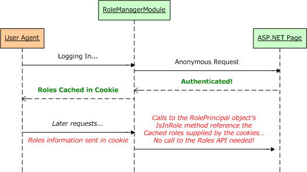
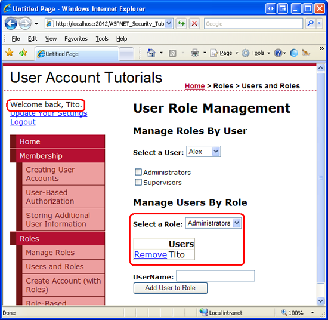
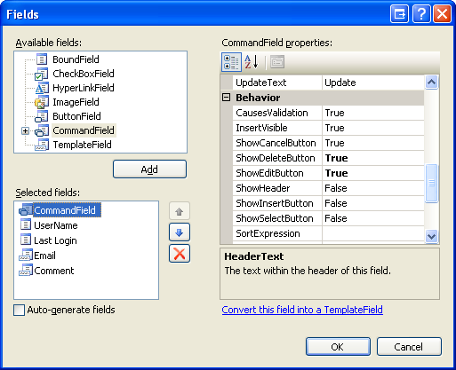
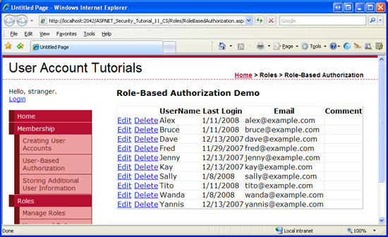
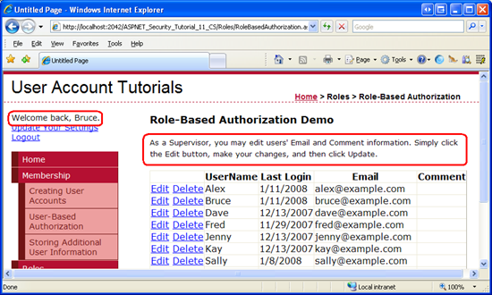
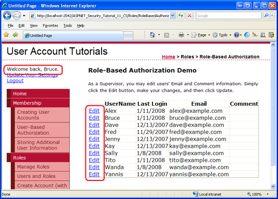
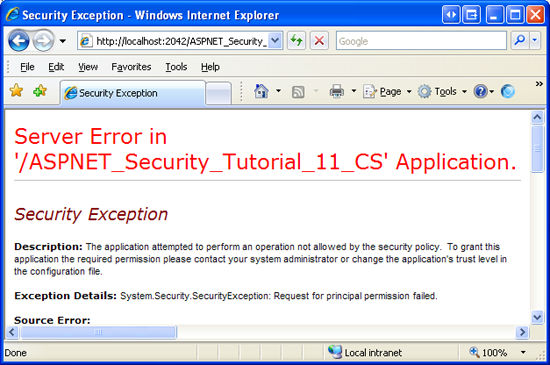

Role-Based Authorization (VB)
====================
by [Scott Mitchell](https://twitter.com/ScottOnWriting)

[Download Code](http://download.microsoft.com/download/6/0/3/6032582f-360d-4739-b935-38721fdb86ea/VB.11.zip) or [Download PDF](http://download.microsoft.com/download/6/0/3/6032582f-360d-4739-b935-38721fdb86ea/aspnet_tutorial11_RoleAuth_vb.pdf)

> This tutorial starts with a look at how the Roles framework associates a user's roles with his security context. It then examines how to apply role-based URL authorization rules. Following that, we will look at using declarative and programmatic means for altering the data displayed and the functionality offered by an ASP.NET page.

## Introduction

In the [*User-Based Authorization*](../membership/user-based-authorization-vb.md) tutorial we saw how to use URL authorization to specify what users could visit a particular set of pages. With just a little bit of markup in `Web.config`, we could instruct ASP.NET to allow only authenticated users to visit a page. Or we could dictate that only users Tito and Bob were allowed, or indicate that all authenticated users except for Sam were permitted.

In addition to URL authorization, we also looked at declarative and programmatic techniques for controlling the data displayed and the functionality offered by a page based on the user visiting. In particular, we created a page that listed the contents of the current directory. Anyone could visit this page, but only authenticated users could view the files' contents and only Tito could delete the files.

Applying authorization rules on a user-by-user basis can grow into a bookkeeping nightmare. A more maintainable approach is to use role-based authorization. The good news is that the tools at our disposal for applying authorization rules work equally well with roles as they do for user accounts. URL authorization rules can specify roles instead of users. The LoginView control, which renders different output for authenticated and anonymous users, can be configured to display different content based on the logged in user's roles. And the Roles API includes methods for determining the logged in user's roles.

This tutorial starts with a look at how the Roles framework associates a user's roles with his security context. It then examines how to apply role-based URL authorization rules. Following that, we will look at using declarative and programmatic means for altering the data displayed and the functionality offered by an ASP.NET page. Let's get started!

## Understanding How Roles are Associated with a User's Security Context

Whenever a request enters the ASP.NET pipeline it is associated with a security context, which includes information identifying the requestor. When using forms authentication, an authentication ticket is used as an identity token. As we discussed in the [*An Overview of Forms Authentication*](../introduction/an-overview-of-forms-authentication-vb.md) and [*Forms Authentication Configuration and Advanced Topics*](../introduction/forms-authentication-configuration-and-advanced-topics-vb.md) tutorials, the `FormsAuthenticationModule` is responsible for determining the identity of the requestor, which it does during the [`AuthenticateRequest` event](https://msdn.microsoft.com/en-us/library/system.web.httpapplication.authenticaterequest.aspx).

If a valid, non-expired authentication ticket is found, the `FormsAuthenticationModule` decodes it to ascertain the requestor's identity. It creates a new `GenericPrincipal` object and assigns this to the `HttpContext.User` object. The purpose of a principal, like `GenericPrincipal`, is to identify the authenticated user's name and what roles she belong to. This purpose is evident by the fact that all principal objects have an `Identity` property and an `IsInRole(roleName)` method. The `FormsAuthenticationModule`, however, is not interested in recording role information and the `GenericPrincipal` object it creates does not specify any roles.

If the Roles framework is enabled, the [`RoleManagerModule`](https://msdn.microsoft.com/en-us/library/system.web.security.rolemanagermodule.aspx) HTTP Module steps in after the `FormsAuthenticationModule` and identifies the authenticated user's roles during the [`PostAuthenticateRequest` event](https://msdn.microsoft.com/en-us/library/system.web.httpapplication.postauthenticaterequest.aspx), which fires after the `AuthenticateRequest` event. If the request is from an authenticated user, the `RoleManagerModule` overwrites the `GenericPrincipal` object created by the `FormsAuthenticationModule` and replaces it with a [`RolePrincipal` object](https://msdn.microsoft.com/en-us/library/system.web.security.roleprincipal.aspx). The `RolePrincipal` class uses the Roles API to determine what roles the user belongs to.

Figure 1 depicts the ASP.NET pipeline workflow when using forms authentication and the Roles framework. The `FormsAuthenticationModule` executes first, identifies the user via her authentication ticket, and creates a new `GenericPrincipal` object. Next, the `RoleManagerModule` steps in and overwrites the `GenericPrincipal` object with a `RolePrincipal` object.

If an anonymous user visits the site, neither the `FormsAuthenticationModule` nor the `RoleManagerModule` creates a principal object.

**Figure 1**: The ASP.NET Pipeline Events for an Authenticated User When Using Forms Authentication and the Roles Framework  ([Click to view full-size image](role-based-authorization-vb/_static/image3.png))

### Caching Role Information in a Cookie

The `RolePrincipal` object's `IsInRole(roleName)` method calls `Roles`.`GetRolesForUser` to get the roles for the user in order to determine whether the user is a member of *roleName*. When using the `SqlRoleProvider`, this results in a query to the role store database. When using role-based URL authorization rules the `RolePrincipal`'s `IsInRole` method will be called on every request to a page that is protected by the role-based URL authorization rules. Rather than have to lookup the role information in the database on every request, the `Roles` framework includes an option to cache the user's roles in a cookie.

If the Roles framework is configured to cache the user's roles in a cookie, the `RoleManagerModule` creates the cookie during the ASP.NET pipeline's [`EndRequest` event](https://msdn.microsoft.com/en-us/library/system.web.httpapplication.endrequest.aspx). This cookie is used in subsequent requests in the `PostAuthenticateRequest`, which is when the `RolePrincipal` object is created. If the cookie is valid and has not expired, the data in the cookie is parsed and used to populate the user's roles, thereby saving the `RolePrincipal` from having to make a call to the `Roles` class to determine the user's roles. Figure 2 depicts this workflow.

**Figure 2**: The User's Role Information Can Be Stored in a Cookie to Improve Performance  ([Click to view full-size image](role-based-authorization-vb/_static/image6.png))

By default, the role cache cookie mechanism is disabled. It can be enabled through the `<roleManager>`; configuration markup in `Web.config`. We discussed using the [`<roleManager>` element](https://msdn.microsoft.com/en-us/library/ms164660.aspx) to specify Role providers in the [*Creating and Managing Roles*](creating-and-managing-roles-vb.md) tutorial, so you should already have this element in your application's `Web.config` file. The role cache cookie settings are specified as attributes of the `<roleManager>`; element, and are summarized in Table 1.

> [!NOTE]
> The configuration settings listed in Table 1 specify the properties of the resulting role cache cookie. For more information on cookies, how they work, and their various properties, read [this Cookies tutorial](http://www.quirksmode.org/js/cookies.html).

| **Property** | **Description** |
| --- | --- |
| `cacheRolesInCookie` | A Boolean value that indicates whether cookie caching is used. Defaults to `false`. |
| `cookieName` | The name of the role cache cookie. The default value is ".ASPXROLES". |
| `cookiePath` | The path for the roles name cookie. The path attribute enables a developer to limit the scope of a cookie to a particular directory hierarchy. The default value is "/", which informs the browser to send the authentication ticket cookie to any request made to the domain. |
| `cookieProtection` | Indicates what techniques are used to protect the role cache cookie. The allowable values are: `All` (the default); `Encryption`; `None`; and `Validation`. Refer back to Step 3 of the [*Forms Authentication Configuration and Advanced Topics*](../introduction/forms-authentication-configuration-and-advanced-topics-vb.md) tutorial for more information on these protection levels. |
| `cookieRequireSSL` | A Boolean value that indicates whether an SSL connection is required to transmit the authentication cookie. The default value is `false`. |
| `cookieSlidingExpiration` | A Boolean value that indicates whether the cookie's timeout is reset each time the user visits the site during a single session. The default value is `false`. This value is only pertinent when `createPersistentCookie` is set to `true`. |
| `cookieTimeout` | Specifies the time, in minutes, after which the authentication ticket cookie expires. The default value is `30`. This value is only pertinent when `createPersistentCookie` is set to `true`. |
| `createPersistentCookie` | A Boolean value that specifies whether the role cache cookie is a session cookie or persistent cookie. If `false` (the default), a session cookie is used, which is deleted when the browser is closed. If `true`, a persistent cookie is used; it expires `cookieTimeout` number of minutes after it has been created or after the previous visit, depending on the value of `cookieSlidingExpiration`. |
| `domain` | Specifies the cookie's domain value. The default value is an empty string, which causes the browser to use the domain from which it was issued (such as www.yourdomain.com). In this case, the cookie will **not** be sent when making requests to subdomains, such as admin.yourdomain.com. If you want the cookie to be passed to all subdomains you need to customize the `domain` attribute, setting it to "yourdomain.com". |
| `maxCachedResults` | Specifies the maximum number of role names that are cached in the cookie. The default is 25. The `RoleManagerModule` does not create a cookie for users that belong to more than `maxCachedResults` roles. Consequently, the `RolePrincipal` object's `IsInRole` method will use the `Roles` class to determine the user's roles. The reason `maxCachedResults` exists is because many user agents do not permit cookies larger than 4,096 bytes. So this cap is meant to reduce the likelihood of exceeding this size limitation. If you have extremely long role names, you may want to consider specifying a smaller `maxCachedResults` value; contrariwise, if you have extremely short role names, you can probably increase this value. |

**Table 1**: The Role Cache Cookie Configuration Options

Let's configure our application to use non-persistent role cache cookies. To accomplish this, update the `<roleManager>` element in `Web.config` to include the following cookie-related attributes:

[!code-xml[Main](role-based-authorization-vb/samples/sample1.xml)]

I updated the `<roleManager>`; element by adding three attributes: `cacheRolesInCookie`, `createPersistentCookie`, and `cookieProtection`. By setting `cacheRolesInCookie` to `true`, the `RoleManagerModule` will now automatically cache the user's roles in a cookie rather than having to lookup the user's role information on each request. I explicitly set the `createPersistentCookie` and `cookieProtection` attributes to `false` and `All`, respectively. Technically, I didn't need to specify values for these attributes since I just assigned them to their default values, but I put them here to make it explicitly clear that I am not using persistent cookies and that the cookie is both encrypted and validated.

That's all there is to it! Henceforth, the Roles framework will cache the users' roles in cookies. If the user's browser does not support cookies, or if their cookies are deleted or lost, somehow, it's no big deal – the `RolePrincipal` object will simply use the `Roles` class in the case that no cookie (or an invalid or expired one) is available.

> [!NOTE]
> Microsoft's Patterns &amp; Practices group discourages using persistent role cache cookies. Since possession of the role cache cookie is sufficient to prove role membership, if a hacker can somehow gain access to a valid user's cookie he can impersonate that user. The likelihood of this happening increases if the cookie is persisted on the user's browser. For more information on this security recommendation, as well as other security concerns, refer to the [Security Question List for ASP.NET 2.0](https://msdn.microsoft.com/en-us/library/ms998375.aspx).

## Step 1: Defining Role-Based URL Authorization Rules

As discussed in the [*User-Based Authorization*](../membership/user-based-authorization-vb.md) tutorial, URL authorization offers a means to restrict access to a set of pages on a user-by-user or role-by-role basis. The URL authorization rules are spelled out in `Web.config` using the [`<authorization>` element](https://msdn.microsoft.com/en-us/library/8d82143t.aspx) with `<allow>` and `<deny>` child elements. In addition to the user-related authorization rules discussed in previous tutorials, each `<allow>` and `<deny>` child element can also include:

- A particular role
- A comma-delimited list of roles

For example, the URL authorization rules grant access to those users in the Administrators and Supervisors roles, but deny access to all others:

[!code-xml[Main](role-based-authorization-vb/samples/sample2.xml)]

The `<allow>` element in the above markup states that the Administrators and Supervisors roles are allowed; the `<deny>`; element instructs that *all* users are denied.

Let's configure our application so that the `ManageRoles.aspx`, `UsersAndRoles.aspx`, and `CreateUserWizardWithRoles.aspx` pages are only accessible to those users in the Administrators role, while the `RoleBasedAuthorization.aspx` page remains accessible to all visitors.

To accomplish this, start by adding a `Web.config` file to the `Roles` folder.

**Figure 3**: Add a `Web.config` File to the `Roles` directory  ([Click to view full-size image](role-based-authorization-vb/_static/image9.png))

Next, add the following configuration markup to `Web.config`:

[!code-xml[Main](role-based-authorization-vb/samples/sample3.xml)]

The `<authorization>` element in the `<system.web>` section indicates that only users in the Administrators role may access the ASP.NET resources in the `Roles` directory. The `<location>` element defines an alternate set of URL authorization rules for the `RoleBasedAuthorization.aspx` page, allowing all users to visit the page.

After saving your changes to `Web.config`, log in as a user that is not in the Administrators role and then try to visit one of the protected pages. The `UrlAuthorizationModule` will detect that you do not have permission to visit the requested resource; consequently, the `FormsAuthenticationModule` will redirect you to the login page. The login page will then redirect you to the `UnauthorizedAccess.aspx` page (see Figure 4). This final redirect from the login page to `UnauthorizedAccess.aspx` occurs because of code we added to the login page in Step 2 of the [*User-Based Authorization*](../membership/user-based-authorization-vb.md) tutorial. In particular, the login page automatically redirects any authenticated user to `UnauthorizedAccess.aspx` if the querystring contains a `ReturnUrl` parameter, as this parameter indicates that the user arrived at the login page after attempting to view a page he was not authorized to view.

**Figure 4**: Only Users in the Administrators Role Can View the Protected Pages  ([Click to view full-size image](role-based-authorization-vb/_static/image12.png))

Log off and then log in as a user that is in the Administrators role. Now you should be able to view the three protected pages.

**Figure 5**: Tito Can Visit the `UsersAndRoles.aspx` Page Because He is in the Administrators Role  ([Click to view full-size image](role-based-authorization-vb/_static/image15.png))

> [!NOTE]
> When specifying URL authorization rules – for roles or users – it is important to keep in mind that the rules are analyzed one at a time, from the top down. As soon as a match is found, the user is granted or denied access, depending on if the match was found in an `<allow>` or `<deny>` element. **If no match is found, the user is granted access.** Consequently, if you want to restrict access to one or more user accounts, it is imperative that you use a `<deny>` element as the last element in the URL authorization configuration. **If your URL authorization rules do not include a**`<deny>`**element, all users will be granted access.** For a more thorough discussion on how the URL authorization rules are analyzed, refer back to the "A Look at How the `UrlAuthorizationModule` Uses the Authorization Rules to Grant or Deny Access" section of the [*User-Based Authorization*](../membership/user-based-authorization-vb.md) tutorial.

## Step 2: Limiting Functionality Based On the Currently Logged In User's Roles

URL authorization makes it easy to specify coarse authorization rules that state what identities are permitted and which ones are denied from viewing a particular page (or all pages in a folder and its subfolders). However, in certain cases we may want to allow all users to visit a page, but limit the page's functionality based on the visiting user's roles. This may entail showing or hiding data based on the user's role, or offering additional functionality to users that belong to a particular role.

Such fine grain role-based authorization rules can be implemented either declaratively or programmatically (or through some combination of the two). In the next section we will see how to implement declarative fine grain authorization via the LoginView control. Following that, we will explore programmatic techniques. Before we can look at applying fine grain authorization rules, however, we first need to create a page whose functionality depends on the role of the user visiting it.

Let's create a page that lists all of the user accounts in the system in a GridView. The GridView will include each user's username, email address, last login date, and comments about the user. In addition to displaying each user's information, the GridView will include edit and delete capabilities. We will initially create this page with the edit and delete functionality available to all users. In the "Using the LoginView Control" and "Programmatically Limiting Functionality" sections we will see how to enable or disable these features based on the visiting user's role.

> [!NOTE]
> The ASP.NET page we are about to build uses a GridView control to display the user accounts. Since this tutorial series focuses on forms authentication, authorization, user accounts, and roles, I do not want to spend too much time discussing the inner workings of the GridView control. While this tutorial provides specific step-by-step instructions for setting up this page, it does not delve into the details of why certain choices were made, or what effect particular properties have on the rendered output. For a thorough examination of the GridView control, check out my *[Working with Data in ASP.NET 2.0](../../data-access/index.md)* tutorial series.

Start by opening the `RoleBasedAuthorization.aspx` page in the `Roles` folder. Drag a GridView from the page onto the Designer and set its `ID` to `UserGrid`. In a moment we will write code that calls the `Membership`.`GetAllUsers` method and binds the resulting `MembershipUserCollection` object to the GridView. The `MembershipUserCollection` contains a `MembershipUser` object for each user account in the system; `MembershipUser` objects have properties like `UserName`,`Email`,`LastLoginDate` and so forth.

Before we write the code that binds the user accounts to the grid, let's first define the GridView's fields. From the GridView's Smart Tag, click the "Edit Columns" link to launch the Fields dialog box (see Figure 6). From here, uncheck the "Auto-generate fields" checkbox in the lower left corner. Since we want this GridView to include editing and deleting capabilities, add a CommandField and set its `ShowEditButton` and `ShowDeleteButton` properties to True. Next, add four fields for displaying the `UserName`, `Email`, `LastLoginDate`, and `Comment` properties. Use a BoundField for the two read-only properties (`UserName` and `LastLoginDate`) and TemplateFields for the two editable fields (`Email` and `Comment`).

Have the first BoundField display the `UserName` property; set its `HeaderText` and `DataField` properties to "UserName". This field will not be editable, so set its `ReadOnly` property to True. Configure the `LastLoginDate` BoundField by setting its `HeaderText` to "Last Login" and its `DataField` to "LastLoginDate". Let's format the output of this BoundField so that just the date is displayed (instead of the date and time). To accomplish this, set this BoundField's `HtmlEncode` property to False and its `DataFormatString` property to "{0:d}". Also set the `ReadOnly` property to True.

Set the `HeaderText` properties of the two TemplateFields to "Email" and "Comment".

**Figure 6**: The GridView's Fields Can Be Configured Through the Fields Dialog Box  ([Click to view full-size image](role-based-authorization-vb/_static/image18.png))

We now need to define the `ItemTemplate` and `EditItemTemplate` for the "Email" and "Comment" TemplateFields. Add a Label Web control to each of the `ItemTemplates` and bind their `Text` properties to the `Email` and `Comment` properties, respectively.

For the "Email" TemplateField, add a TextBox named `Email` to its `EditItemTemplate` and bind its `Text` property to the `Email` property using two-way databinding. Add a RequiredFieldValidator and RegularExpressionValidator to the `EditItemTemplate` to ensure that a visitor editing the Email property has entered a valid email address. For the "Comment" TemplateField, add a multi-line TextBox named `Comment` to its `EditItemTemplate`. Set the TextBox's `Columns` and `Rows` properties to 40 and 4, respectively, and then bind its `Text` property to the `Comment` property using two-way databinding.

After configuring these TemplateFields, their declarative markup should look similar to the following:

[!code-aspx[Main](role-based-authorization-vb/samples/sample4.aspx)]

When editing or deleting a user account we will need to know that user's `UserName` property value. Set the GridView's `DataKeyNames` property to "UserName" so that this information is available through the GridView's `DataKeys` collection.

Finally, add a ValidationSummary control to the page and set its `ShowMessageBox` property to True and its `ShowSummary` property to False. With these settings, the ValidationSummary will display a client-side alert if the user attempts to edit a user account with a missing or invalid email address.

[!code-aspx[Main](role-based-authorization-vb/samples/sample5.aspx)]

We have now completed this page's declarative markup. Our next task is to bind the set of user accounts to the GridView. Add a method named `BindUserGrid` to the `RoleBasedAuthorization.aspx` page's code-behind class that binds the `MembershipUserCollection` returned by `Membership.GetAllUsers` to the `UserGrid` GridView. Call this method from the `Page_Load` event handler on the first page visit.

[!code-vb[Main](role-based-authorization-vb/samples/sample6.vb)]

With this code in place, visit the page through a browser. As Figure 7 shows, you should see a GridView listing information about each user account in the system.

**Figure 7**: The `UserGrid` GridView Lists Information About Each User in the System  ([Click to view full-size image](role-based-authorization-vb/_static/image21.png))

> [!NOTE]
> The `UserGrid` GridView lists all of the users in a non-paged interface. This simple grid interface is not suitable for scenarios where there are several dozen or more users. One option is to configure the GridView to enable paging. The `Membership.GetAllUsers` method has two overloads: one that accepts no input parameters and returns all of the users and one that takes in integer values for the page index and page size, and returns only the specified subset of the users. The second overload can be used to more efficiently page through the users since it returns just the precise subset of user accounts rather than *all* of them. If you have thousands of user accounts, you might want to consider a filter-based interface, one that only shows those users whose UserName begins with a selected character, for instance. The [`Membership.FindUsersByName` method](https://msdn.microsoft.com/en-us/library/system.web.security.membership.findusersbyname.aspx) is ideal for building a filter-based user interface. We will look at building such an interface in a future tutorial.

The GridView control offers built-in editing and deleting support when the control is bound to a properly configured data source control, such as the SqlDataSource or ObjectDataSource. The `UserGrid` GridView, however, has its data programmatically bound; therefore, we must write code to perform these two tasks. In particular, we will need to create event handlers for the GridView's `RowEditing`, `RowCancelingEdit`, `RowUpdating`, and `RowDeleting` events, which are fired when a visitor clicks the GridView's Edit, Cancel, Update, or Delete buttons.

Start by creating the event handlers for the GridView's `RowEditing`, `RowCancelingEdit`, and `RowUpdating` events and then add the following code:

[!code-vb[Main](role-based-authorization-vb/samples/sample7.vb)]

The `RowEditing` and `RowCancelingEdit` event handlers simply set the GridView's `EditIndex` property and then rebind the list of user accounts to the grid. The interesting stuff happens in the `RowUpdating` event handler. This event handler starts by ensuring that the data is valid and then grabs the `UserName` value of the edited user account from the `DataKeys` collection. The `Email` and `Comment` TextBoxes in the two TemplateFields' `EditItemTemplate` s are then programmatically referenced. Their `Text` properties contain the edited email address and comment.

In order to update a user account through the Membership API we need to first get the user's information, which we do via a call to `Membership.GetUser(userName)`. The returned `MembershipUser` object's `Email` and `Comment` properties are then updated with the values entered into the two TextBoxes from the editing interface. Finally, these modifications are saved with a call to [`Membership.UpdateUser`](https://msdn.microsoft.com/en-us/library/system.web.security.membership.updateuser.aspx). The `RowUpdating` event handler completes by reverting the GridView to its pre-editing interface.

Next, create the `RowDeleting` RowDeleting event handler and then add the following code:

[!code-vb[Main](role-based-authorization-vb/samples/sample8.vb)]

The above event handler starts by grabbing the `UserName` value from the GridView's `DataKeys` collection; this `UserName` value is then passed into the Membership class's [`DeleteUser` method](https://msdn.microsoft.com/en-us/library/system.web.security.membership.deleteuser.aspx). The `DeleteUser` method deletes the user account from the system, including related membership data (such as what roles this user belongs to). After deleting the user, the grid's `EditIndex` is set to -1 (in case the user clicked Delete while another row was in edit mode) and the `BindUserGrid` method is called.

> [!NOTE]
> The Delete button does not require any sort of confirmation from the user before deleting the user account. I encourage you to add some form of user confirmation to lessen the chance of an account being accidentally deleted. One of the easiest ways to confirm an action is through a client-side confirm dialog box. For more information on this technique, see [Adding Client-Side Confirmation When Deleting](https://asp.net/learn/data-access/tutorial-42-vb.aspx).

Verify that this page functions as expected. You should be able to edit any user's email address and comment, as well as delete any user account. Since the `RoleBasedAuthorization.aspx` page is accessible to all users, any user – even anonymous visitors – can visit this page and edit and delete user accounts! Let's update this page so that only users in the Supervisors and Administrators roles can edit a user's email address and comment, and only Administrators can delete a user account.

The "Using the LoginView Control" section looks at using the LoginView control to show instructions specific to the user's role. If a person in the Administrators role visits this page, we will show instructions on how to edit and delete users. If a user in the Supervisors role reaches this page, we will show instructions on editing users. And if the visitor is anonymous or is not in either the Supervisors or Administrators role, we will display a message explaining that they cannot edit or delete user account information. In the "Programmatically Limiting Functionality" section we will write code that programmatically shows or hides the Edit and Delete buttons based on the user's role.

### Using the LoginView Control

As we've seen in past tutorials, the LoginView control is useful for displaying different interfaces for authenticated and anonymous users, but the LoginView control can also be used to display different markup based on the user's roles. Let's use a LoginView control to display different instructions based on the visiting user's role.

Start by adding a LoginView above the `UserGrid` GridView. As we've discussed earlier, the LoginView control has two built-in templates: `AnonymousTemplate` and `LoggedInTemplate`. Enter a brief message in both of these templates that informs the user that they cannot edit or delete any user information.

[!code-aspx[Main](role-based-authorization-vb/samples/sample9.aspx)]

In addition to the `AnonymousTemplate` and `LoggedInTemplate`, the LoginView control can include *RoleGroups*, which are role-specific templates. Each RoleGroup contains a single property, `Roles`, which specifies what roles the RoleGroup applies to. The `Roles` property can be set to a single role (like "Administrators") or to a comma-delimited list of roles (like "Administrators, Supervisors").

To manage the RoleGroups, click the "Edit RoleGroups" link from the control's Smart Tag to bring up the RoleGroup Collection Editor. Add two new RoleGroups. Set the first RoleGroup's `Roles` property to "Administrators" and the second's to "Supervisors".

**Figure 8**: Manage the LoginView's Role-Specific Templates Through the RoleGroup Collection Editor  ([Click to view full-size image](role-based-authorization-vb/_static/image24.png))

Click OK to close the RoleGroup Collection Editor; this updates the LoginView's declarative markup to include a `<RoleGroups>` section with an `<asp:RoleGroup>` child element for each RoleGroup defined in the RoleGroup Collection Editor. Furthermore, the "Views" drop-down list in the LoginView's Smart Tag - which initially listed just the `AnonymousTemplate` and `LoggedInTemplate` – now includes the added RoleGroups as well.

Edit the RoleGroups so that users in the Supervisors role are displayed instructions on how to edit user accounts, while users in the Administrators role are shown instructions for editing and deleting. After making these changes, your LoginView's declarative markup should look similar to the following.

[!code-aspx[Main](role-based-authorization-vb/samples/sample10.aspx)]

After making these changes, save the page and then visit it through a browser. First visit the page as an anonymous user. You should be shown the message, "You are not logged into the system. Therefore you cannot edit or delete any user information." Then log in as an authenticated user, but one that is neither in the Supervisors nor Administrators role. This time you should see the message, "You are not a member of the Supervisors or Administrators roles. Therefore you cannot edit or delete any user information."

Next, log in as a user who is a member of the Supervisors role. This time you should see the Supervisors role-specific message (see Figure 9). And if you log in as a user in the Administrators role you should see the Administrators role-specific message (see Figure 10).

**Figure 9**: Bruce is Shown the Supervisors Role-Specific Message  ([Click to view full-size image](role-based-authorization-vb/_static/image27.png))

**Figure 10**: Tito is Shown the Administrators Role-Specific Message  ([Click to view full-size image](role-based-authorization-vb/_static/image30.png))

As the screen shots in Figures 9 and 10 show, the LoginView only renders one template, even if multiple templates apply. Bruce and Tito are both logged in users, yet the LoginView renders only the matching RoleGroup and not the `LoggedInTemplate`. Moreover, Tito belongs to both the Administrators and Supervisors roles, yet the LoginView control renders the Administrators role-specific template instead of the Supervisors one.

Figure 11 illustrates the workflow used by the LoginView control to determine what template to render. Note that if there is more than one RoleGroup specified, the LoginView template renders the *first* RoleGroup that matches. In other words, if we had placed the Supervisors RoleGroup as the first RoleGroup and the Administrators as the second, then when Tito visited this page he would see the Supervisors message.

**Figure 11**: The LoginView Control's Workflow for Determining What Template to Render  ([Click to view full-size image](role-based-authorization-vb/_static/image33.png))

### Programmatically Limiting Functionality

While the LoginView control displays different instructions based on the role of the user visiting the page, the Edit and Cancel buttons remain visible to all. We need to programmatically hide the Edit and Delete buttons for anonymous visitors and users who are in neither the Supervisors nor Administrators role. We need to hide the Delete button for everyone who is not an Administrator. In order to accomplish this we will write a bit of code that programmatically references the CommandField's Edit and Delete LinkButtons and sets their `Visible` properties to `False`, if necessary.

The easiest way to programmatically reference controls in a CommandField is to first convert it to a template. To accomplish this, click the "Edit Columns" link from the GridView's Smart Tag, select the CommandField from the list of current fields, and click the "Convert this field into a TemplateField" link. This turns the CommandField into a TemplateField with an `ItemTemplate` and `EditItemTemplate`. The `ItemTemplate` contains the Edit and Delete LinkButtons while the `EditItemTemplate` houses the Update and Cancel LinkButtons.

**Figure 12**: Convert the CommandField Into a TemplateField  ([Click to view full-size image](role-based-authorization-vb/_static/image36.png))

Update the Edit and Delete LinkButtons in the `ItemTemplate`, setting their `ID` properties to values of `EditButton` and `DeleteButton`, respectively.

[!code-aspx[Main](role-based-authorization-vb/samples/sample11.aspx)]

Whenever data is bound to the GridView, the GridView enumerates the records in its `DataSource` property and generates a corresponding `GridViewRow` object. As each `GridViewRow` object is created, the `RowCreated` event is fired. In order to hide the Edit and Delete buttons for unauthorized users, we need to create an event handler for this event and programmatically reference the Edit and Delete LinkButtons, setting their `Visible` properties accordingly.

Create an event handler the `RowCreated` event and then add the following code:

[!code-vb[Main](role-based-authorization-vb/samples/sample12.vb)]

Keep in mind that the `RowCreated` event fires for *all* of the GridView rows, including the header, the footer, the pager interface, and so forth. We only want to programmatically reference the Edit and Delete LinkButtons if we are dealing with a data row not in edit mode (since the row in edit mode has Update and Cancel buttons instead of Edit and Delete). This check is handled by the `If` statement.

If we are dealing with a data row that is not in edit mode, the Edit and Delete LinkButtons are referenced and their `Visible` properties are set based on the Boolean values returned by the `User` object's `IsInRole(roleName)` method. The `User` object references the principal created by the `RoleManagerModule`; consequently, the `IsInRole(roleName)` method uses the Roles API to determine whether the current visitor belongs to *roleName*.

> [!NOTE]
> We could have used the Roles class directly, replacing the call to `User.IsInRole(roleName)` with a call to the [`Roles.IsUserInRole(roleName)` method](https://msdn.microsoft.com/en-us/library/system.web.security.roles.isuserinrole.aspx). I decided to use the principal object's `IsInRole(roleName)` method in this example because it is more efficient than using the Roles API directly. Earlier in this tutorial we configured the role manager to cache the user's roles in a cookie. This cached cookie data is only utilized when the principal's `IsInRole(roleName)` method is called; direct calls to the Roles API always involve a trip to the role store. Even if roles are not cached in a cookie, calling the principal object's `IsInRole(roleName)` method is usually more efficient because when it is called for the first time during a request it caches the results. The Roles API, on the other hand, does not perform any caching. Because the `RowCreated` event is fired once for every row in the GridView, using `User.IsInRole(roleName)` involves just one trip to the role store whereas `Roles.IsUserInRole(roleName)` requires *N* trips, where *N* is the number of user accounts displayed in the grid.

The Edit button's `Visible` property is set to `True` if the user visiting this page is in the Administrators or Supervisors role; otherwise it is set to `False`. The Delete button's `Visible` property is set to `True` only if the user is in the Administrators role.

Test this page through a browser. If you visit the page as an anonymous visitor or as a user that is neither a Supervisor nor an Administrator, the CommandField is empty; it still exists, but as a thin sliver without the Edit or Delete buttons.

> [!NOTE]
> It is possible to hide the CommandField altogether when a non-Supervisor and non-Administrator is visiting the page. I leave this as an exercise for the reader.

**Figure 13**: The Edit and Delete Buttons are Hidden for Non-Supervisors and Non-Administrators  ([Click to view full-size image](role-based-authorization-vb/_static/image39.png))

If a user that belongs to the Supervisors role (but not to the Administrators role) visits, he sees only the Edit button.

**Figure 14**: While the Edit Button is Available for Supervisors, the Delete Button is Hidden  ([Click to view full-size image](role-based-authorization-vb/_static/image42.png))

And if an Administrator visits, she has access to both the Edit and Delete buttons.

**Figure 15**: The Edit and Delete Buttons are Available Only for Administrators  ([Click to view full-size image](role-based-authorization-vb/_static/image45.png))

## Step 3: Applying Role-Based Authorization Rules to Classes and Methods

In Step 2 we limited edit capabilities to users in the Supervisors and Administrators roles and delete capabilities to Administrators only. This was accomplished by hiding the associated user interface elements for unauthorized users through programmatic techniques. Such measures do not guarantee that an unauthorized user will be unable to perform a privileged action. There may be user interface elements that are added later or that we forgot to hide for unauthorized users. Or a hacker may discover some other way to get the ASP.NET page to execute the desired method.

An easy way to ensure that a particular piece of functionality cannot be accessed by an unauthorized user is to decorate that class or method with the [`PrincipalPermission` attribute](https://msdn.microsoft.com/en-us/library/system.security.permissions.principalpermissionattribute.aspx). When the .NET runtime uses a class or executes one of its methods, it checks to ensure that the current security context has permission. The `PrincipalPermission` attribute provides a mechanism through which we can define these rules.

We looked at using the `PrincipalPermission` attribute back in the [*User-Based Authorization*](../membership/user-based-authorization-vb.md) tutorial. Specifically, we saw how to decorate the GridView's `SelectedIndexChanged` and `RowDeleting` event handler so that they could only be executed by authenticated users and Tito, respectively. The `PrincipalPermission` attribute works just as well with roles.

Let's demonstrate using the `PrincipalPermission` attribute on the GridView's `RowUpdating` and `RowDeleting` event handlers to prohibit execution for non-authorized users. All we need to do is add the appropriate attribute atop each function definition:

[!code-vb[Main](role-based-authorization-vb/samples/sample13.vb)]

The attribute for the `RowUpdating` event handler dictates that only users in the Administrators or Supervisors roles can execute the event handler, where as the attribute on the `RowDeleting` event handler limits the execution to users in the Administrators role.

> [!NOTE]
> The `PrincipalPermission` attribute is represented as a class in the `System.Security.Permissions` namespace. Be sure to add a `Imports System.Security.Permissions` statement at the top of your code-behind class file to import this namespace.

If, somehow, a non-Administrator attempts to execute the `RowDeleting` event handler or if a non-Supervisor or non-Administrator attempts to execute the `RowUpdating` event handler, the .NET runtime will raise a `SecurityException`.

**Figure 16**: If the Security Context is not Authorized to Execute the Method, a `SecurityException` is Thrown  ([Click to view full-size image](role-based-authorization-vb/_static/image48.png))

In addition to ASP.NET pages, many applications also have an architecture that includes various layers, such as Business Logic and Data Access Layers. These layers are typically implemented as Class Libraries and offer classes and methods for performing business logic- and data-related functionality. The `PrincipalPermission` attribute is useful for applying authorization rules to these layers as well.

For more information on using the `PrincipalPermission` attribute to define authorization rules on classes and methods, refer to [Scott Guthrie](https://weblogs.asp.net/scottgu/)'s blog entry [Adding Authorization Rules to Business and Data Layers Using `PrincipalPermissionAttributes`](https://weblogs.asp.net/scottgu/archive/2006/10/04/Tip_2F00_Trick_3A00_-Adding-Authorization-Rules-to-Business-and-Data-Layers-using-PrincipalPermissionAttributes.aspx).

## Summary

In this tutorial we looked at how to specify coarse and fine grain authorization rules based on the user's roles. ASP.NET's URL authorization feature allows a page developer to specify what identities are allowed or denied access to what pages. As we saw back in the [*User-Based Authorization*](../membership/user-based-authorization-vb.md) tutorial, URL authorization rules can be applied on a user-by-user basis. They can also be applied on a role-by-role basis, as we saw in Step 1 of this tutorial.

Fine grain authorization rules may be applied declaratively or programmatically. In Step 2 we looked at using the LoginView control's RoleGroups feature to render different output based on the visiting user's roles. We also looked at ways to programmatically determine if a user belongs to a specific role and how to adjust the page's functionality accordingly.

Happy Programming!

### Further Reading

For more information on the topics discussed in this tutorial, refer to the following resources:

- [Adding Authorization Rules to Business and Data Layers Using `PrincipalPermissionAttributes`](https://weblogs.asp.net/scottgu/archive/2006/10/04/Tip_2F00_Trick_3A00_-Adding-Authorization-Rules-to-Business-and-Data-Layers-using-PrincipalPermissionAttributes.aspx)
- [Examining ASP.NET 2.0's Membership, Roles, and Profile: Working with Roles](http://aspnet.4guysfromrolla.com/articles/121405-1.aspx)
- [Security Question List for ASP.NET 2.0](https://msdn.microsoft.com/en-us/library/ms998375.aspx)
- [Technical documentation for the `<roleManager>` Element](https://msdn.microsoft.com/en-us/library/ms164660.aspx)

### About the Author

Scott Mitchell, author of multiple ASP/ASP.NET books and founder of 4GuysFromRolla.com, has been working with Microsoft Web technologies since 1998. Scott works as an independent consultant, trainer, and writer. His latest book is *[Sams Teach Yourself ASP.NET 2.0 in 24 Hours](https://www.amazon.com/exec/obidos/ASIN/0672327384/4guysfromrollaco)*. Scott can be reached at [mitchell@4guysfromrolla.com](mailto:mitchell@4guysfromrolla.com) or via his blog at [http://ScottOnWriting.NET](http://scottonwriting.net/).

### Special Thanks To…

This tutorial series was reviewed by many helpful reviewers. Lead reviewers for this tutorial include Suchi Banerjee and Teresa Murphy. Interested in reviewing my upcoming MSDN articles? If so, drop me a line at [mitchell@4GuysFromRolla.com](mailto:mitchell@4GuysFromRolla.com)

>[!div class="step-by-step"]
[Previous](assigning-roles-to-users-vb.md)