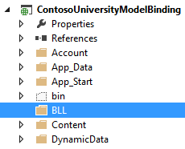

[Edit .md file](C:\Projects\msc\dev\Msc.Www\Web.ASP\App_Data\github\web-forms\overview\presenting-and-managing-data\model-binding\adding-business-logic-layer.md) | [Edit dev content](http://www.aspdev.net/umbraco#/content/content/edit/45590) | [View dev content](http://docs.aspdev.net/tutorials/web-forms/overview/presenting-and-managing-data/model-binding/adding-business-logic-layer.html) | [View prod content](http://www.asp.net/web-forms/overview/presenting-and-managing-data/model-binding/adding-business-logic-layer) | Picker: 45593

Adding business logic layer to a project that uses model binding and web forms
====================
by [Tom FitzMacken](https://github.com/tfitzmac)

> This tutorial series demonstrates basic aspects of using model binding with an ASP.NET Web Forms project. Model binding makes data interaction more straight-forward than dealing with data source objects (such as ObjectDataSource or SqlDataSource). This series starts with introductory material and moves to more advanced concepts in later tutorials.
> 
> This tutorial shows how to use model binding with a business logic layer. You will set the OnCallingDataMethods member to specify that an object other than the current page is used to call the data methods.
> 
> This tutorial builds on the project created in the [earlier](retrieving-data.md) parts of the series.
> 
> You can [download](https://go.microsoft.com/fwlink/?LinkId=286116) the complete project in C# or VB. The downloadable code works with either Visual Studio 2012 or Visual Studio 2013. It uses the Visual Studio 2012 template, which is slightly different than the Visual Studio 2013 template shown in this tutorial.

## What you'll build

Model binding enables you to put your data interaction code in either the code-behind file for a web page or in a separate business logic class. The previous tutorials have shown how to use the code-behind files for data interaction code. This approach works for small sites but it can lead to code repetition and greater difficulty when maintaining a large site. It can also be very difficult to programmatically test code that resides in code behind files because there is no abstraction layer.

To centralize the data interaction code, you can create a business logic layer that contains all of the logic for interacting with data. You then call the business logic layer from your web pages. This tutorial shows how to move all of the code you have written in the previous tutorials into a business logic layer, and then use that code from the pages.

In this tutorial, you'll:

1. Move the code from code-behind files to a business logic layer
2. Change your data bound controls to call the methods in the business logic layer

## Create business logic layer

Now, you will create the class that is called from the web pages. The methods in this class look similar to the methods you used in the previous tutorials and include the value provider attributes.

First, add a new folder called **BLL**.

In the BLL folder, create a new class named **SchoolBL.cs**. It will contain all of the data operations that originally resided in code-behind files. The methods are almost the same as the methods in the code-behind file, but will include some changes.

The most important change to note is that you are no longer executing the code from within an instance of **Page** class. The Page class contains the **TryUpdateModel** method and the **ModelState** property. When this code is moved to a business logic layer, you no longer have an instance of the Page class to call these members. To get around this issue, you must add a **ModelMethodContext** parameter to any method that accesses TryUpdateModel or ModelState. You use this ModelMethodContext parameter to call TryUpdateModel or retrieve ModelState. You do not need to change anything in the web page to account for this new parameter.

Replace the code in SchoolBL.cs with the following code.

    using System;
    using System.Linq;
    using ContosoUniversityModelBinding.Models;
    using System.Web.ModelBinding;
    using System.Web.UI.WebControls;
    using System.Data.Entity;
    using System.Data.Entity.Infrastructure;
    
    namespace ContosoUniversityModelBinding.BLL
    {
        public class SchoolBL : IDisposable
        {
            SchoolContext db = new SchoolContext();
    
            public IQueryable<Student> GetStudents([Control] AcademicYear? displayYear)
            {
                var query = db.Students.Include(s => s.Enrollments.Select(e => e.Course));
    
                if (displayYear != null)
                {
                    query = query.Where(s => s.Year == displayYear);
                }
    
                return query;
            }
    
            public void InsertStudent(ModelMethodContext context)
            {
                var item = new Student();
    
                context.TryUpdateModel(item);
                if (context.ModelState.IsValid)
                {
                    db.Students.Add(item);
                    db.SaveChanges();
                }
            }
    
            public void DeleteStudent(int studentID, ModelMethodContext context)
            {
                var item = new Student { StudentID = studentID };
                db.Entry(item).State = EntityState.Deleted;
                try
                {
                    db.SaveChanges();
                }
                catch (DbUpdateConcurrencyException)
                {
                    context.ModelState.AddModelError("",
                        String.Format("Item with id {0} no longer exists in the database.", studentID));
                }
            }
    
            public void UpdateStudent(int studentID, ModelMethodContext context)
            {
                Student item = null;
                item = db.Students.Find(studentID);
                if (item == null)
                {
                    context.ModelState.AddModelError("", String.Format("Item with id {0} was not found", studentID));
                    return;
                }
    
                context.TryUpdateModel(item);
                if (context.ModelState.IsValid)
                {
                    db.SaveChanges();
                }
            }
    
            public IQueryable<Enrollment> GetCourses([QueryString] int? studentID)
            {
                var query = db.Enrollments.Include(e => e.Course)
                    .Where(e => e.StudentID == studentID);
                return query;
            }
    
            private bool disposedValue = false;
    
            protected virtual void Dispose(bool disposing)
            {
                if (!this.disposedValue)
                {
                    if (disposing)
                    {
                        db.Dispose();
                    }
                }
                this.disposedValue = true;
            }
    
            public void Dispose()
            {
                Dispose(true);
                GC.SuppressFinalize(this);
            }
        }
    }

## Revise existing pages to retrieve data from business logic layer

Finally, you will convert the pages Students.aspx, AddStudent.aspx, and Courses.aspx from using queries in the code-behind file to using the business logic layer.

In the code-behind files for Students, AddStudent, and Courses, delete or comment out the following query methods:

- studentsGrid\_GetData
- studentsGrid\_UpdateItem
- studentsGrid\_DeleteItem
- addStudentForm\_InsertItem
- coursesGrid\_GetData

You now should have no code in the code-behind file that pertains to data operations.

The **OnCallingDataMethods** event handler enables you to specify an object to use for the data methods. In Students.aspx, add a value for that event handler and change the names of the data methods to the names of the methods in the business logic class.

[!code[Main](adding-business-logic-layer/samples/sample1.xml?highlight=3-4,8)]

In the code-behind file for Students.aspx, define the event handler for the CallingDataMethods event. In this event handler, you specify the business logic class for data operations.

    protected void studentsGrid_CallingDataMethods(object sender, CallingDataMethodsEventArgs e)
    {
        e.DataMethodsObject = new ContosoUniversityModelBinding.BLL.SchoolBL();
    }

In AddStudent.aspx, make similar changes.

[!code[Main](adding-business-logic-layer/samples/sample2.xml?highlight=3-4)]

    protected void addStudentForm_CallingDataMethods(object sender, CallingDataMethodsEventArgs e)
    {
        e.DataMethodsObject = new ContosoUniversityModelBinding.BLL.SchoolBL();
    }

In Courses.aspx, make similar changes.

[!code[Main](adding-business-logic-layer/samples/sample3.xml?highlight=3-4)]

    protected void coursesGrid_CallingDataMethods(object sender, CallingDataMethodsEventArgs e)
    {
        e.DataMethodsObject = new ContosoUniversityModelBinding.BLL.SchoolBL();
    }

Run the application and notice that all of the pages function as they had previously. The validation logic also works correctly.

## Conclusion

In this tutorial, you re-structured your application to use a data access layer and business logic layer. You specified that the data controls use an object that is not the current page for data operations.

>[!div class="step-by-step"] [Previous](using-query-string-values-to-retrieve-data.md)