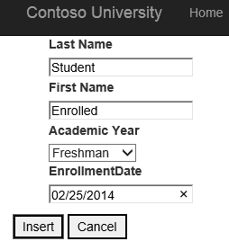
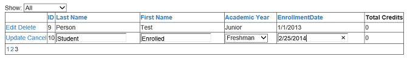
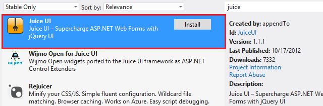
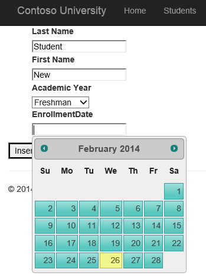
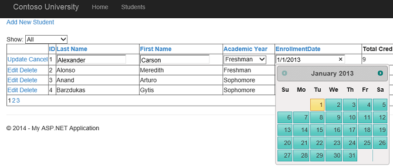

Integrating JQuery UI Datepicker with model binding and web forms
====================
by [Tom FitzMacken](https://github.com/tfitzmac)

> This tutorial series demonstrates basic aspects of using model binding with an ASP.NET Web Forms project. Model binding makes data interaction more straight-forward than dealing with data source objects (such as ObjectDataSource or SqlDataSource). This series starts with introductory material and moves to more advanced concepts in later tutorials.
> 
> This tutorial shows how to add the JQuery UI [Datepicker widget](http://jqueryui.com/datepicker/) to a Web Form, and use model binding to update the database with the selected value.
> 
> This tutorial builds on the project created in the [first](retrieving-data.md) and [second](updating-deleting-and-creating-data.md) parts of the series.
> 
> You can [download](https://go.microsoft.com/fwlink/?LinkId=286116) the complete project in C# or VB. The downloadable code works with either Visual Studio 2012 or Visual Studio 2013. It uses the Visual Studio 2012 template, which is slightly different than the Visual Studio 2013 template shown in this tutorial.

## What you'll build

In this tutorial, you'll:

1. Add a property to your model to record the student's enrollment date
2. Enable the user to select the enrollment date using the JQuery UI Datepicker widget
3. Enforce validation rules for the enrollment date

The JQuery UI Datepicker widget enables users to easily select a date from a calendar that pops up when the user interacts with the field. Using this widget can be more convenient for users than manually typing a date. Integrating the Datepicker widget into a page that uses model binding for data operations requires only a small amount of additional work.

## Add a new property to the model

First, you will add a **Datetime** property to your Student model and migrate that change to the database. Open **UniversityModels.cs**, and add the highlighted code to the Student model.

[!code-csharp[Main](integrating-jquery-ui/samples/sample1.cs?highlight=16-18)]

The **RangeAttribute** is included to enforce validation rules for the property. For this tutorial, we will assume that Contoso University was founded on January 1st, 2013 and therefore earlier enrollment dates are not valid.

In the Package Management window, add a migration by running the command **add-migration AddEnrollmentDate**. Notice that the migration code adds the new Datetime column to the Student table. To match the value you specified in the RangeAttribute, add a default value for the new column, as shown in the highlighted code below.

[!code-csharp[Main](integrating-jquery-ui/samples/sample2.cs?highlight=11)]

Save your change to the migration file.

You do not need to seed the data again. Therefore, open **Configuration.cs** in the Migrations folder and remove or comment out the code in the **Seed** method. Save and close the file.

Now, run the command **update-database**. Notice that the column now exists in the database and all of the existing records have the default value for EnrollmentDate.

## Add dynamic controls for enrollment date

You will now add controls for displaying and editing the enrollment date. At this point, the value is edited through a text box. Later in the tutorial, you will change the text box to the JQuery Datepicker widget.

First, it is important to note that you do not need to make any change to the **AddStudent.aspx** file. The DynamicEntity control will automatically render the new property.

Open **Students.aspx**, and add the following highlighted code.

[!code-aspx[Main](integrating-jquery-ui/samples/sample3.aspx?highlight=13)]

Run the application and notice that you can set the value of the enrollment date by typing a date. When adding a new student:

Or, editing an existing value:

Typing the date works, but it might not be the customer experience you wish to provide. In the next section, you will enable selecting a date through a calendar.

## Install NuGet package to work with JQuery UI

The **Juice UI** NuGet package enables easy integration of the JQuery UI widgets into your web application. To use this package, install it through NuGet.

The version of Juice UI that you install may conflict with the version of JQuery in your application. Before proceeding with this tutorial, try running your application. If you encounter a JavaScript error, you need to reconcile the JQuery version. You can either add the expected version of JQuery to your Scripts folder (version 1.8.2 at time of writing this tutorial), or in Site.master specify the path to the JQuery file.

[!code-aspx[Main](integrating-jquery-ui/samples/sample4.aspx)]

## Customize DateTime template to include Datepicker widget

You will add the Datepicker widget to the dynamic data template for editing a datetime value. By adding the widget to the template, it is automatically rendered in both the form for adding a new student and in the grid view for editing students. Open **DateTime\_Edit.ascx**, and add the following highlighted code.

[!code-aspx[Main](integrating-jquery-ui/samples/sample5.aspx?highlight=3)]

In the code-behind file, you will set the minimum and maximum dates for the DatePicker. By setting these values, you will prevent users from navigating to invalid dates. You will retrieve the minimum and maximum values from the **RangeAttribute** on the DateTime property, if one is provided. Open **DateTime\_Edit.ascx.cs**, and add the following highlighted code to the Page\_Load method.

[!code-csharp[Main](integrating-jquery-ui/samples/sample6.cs?highlight=9-14)]

Run the web application and navigate to the AddStudent page. Provide values for the fields and notice that when you click on the text box for Enrollment Date, the calendar is displayed.

Pick a date, and click **Insert**. The RangeAttribute enforces validation on the server. By setting the minDate property on the Datepicker, you also apply validation on the client. The calendar does not let the user navigate to a date prior to the value of minDate.

When you edit a record in the grid view, the calendar is also displayed.

## Conclusion

In this tutorial, you learned how to incorporate a JQuery widget into a web form that uses model binding.

In the next [tutorial](using-query-string-values-to-retrieve-data.md), you will use a query string value when selecting data.

>[!div class="step-by-step"]
[Previous](sorting-paging-and-filtering-data.md)
[Next](using-query-string-values-to-retrieve-data.md)