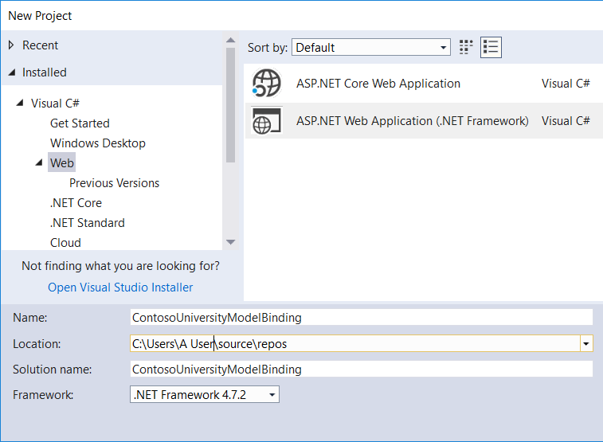
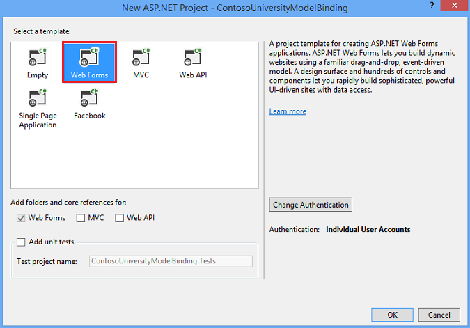
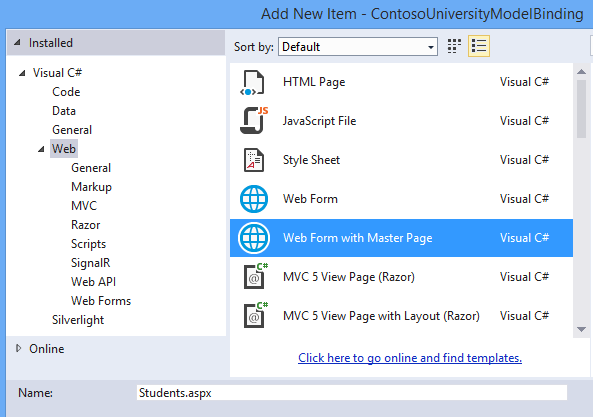
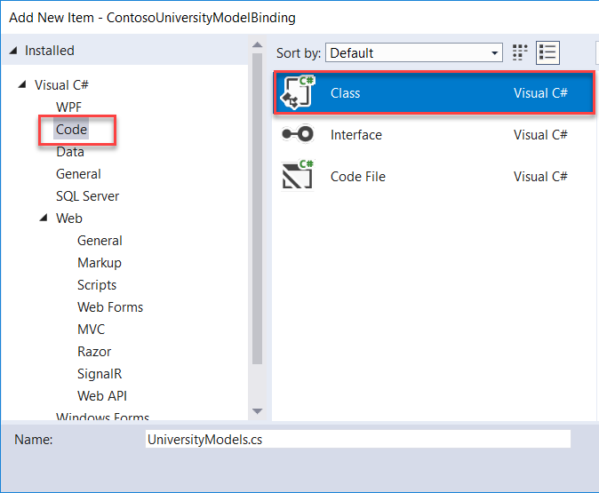
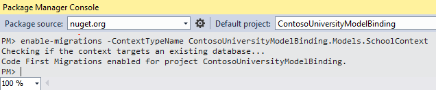
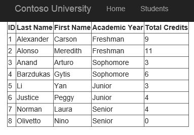

Retrieving and displaying data with model binding and web forms
====================
by [Tom FitzMacken](https://github.com/tfitzmac)

> This tutorial series demonstrates basic model binding in an ASP.NET Web Forms project. With model binding, data interaction is more straight-forward and easier than dealing with data source objects, such as [ObjectDataSource](https://docs.microsoft.com/en-us/dotnet/api/system.web.ui.webcontrols.objectdatasource?view=netframework-4.7.2) or [SqlDataSource](https://docs.microsoft.com/en-us/dotnet/api/system.web.ui.webcontrols.sqldatasource?view=netframework-4.7.2). This series starts with introductory material and moves to more advanced concepts.
> 
> Although this tutorial uses model binding with Entity Framework, you could use it with any data access technology. From a data-bound server control, such as a [GridView](https://docs.microsoft.com/en-us/dotnet/api/system.web.ui.webcontrols.gridview?view=netframework-4.7.2), [ListView](https://docs.microsoft.com/en-us/dotnet/api/system.windows.controls.listview?view=netframework-4.7.2), [DetailsView](https://docs.microsoft.com/en-us/dotnet/api/system.web.ui.webcontrols.detailsview?view=netframework-4.7.2), or [FormView](https://docs.microsoft.com/en-us/dotnet/api/system.web.ui.webcontrols.formview?view=netframework-4.7.2) control, you can specify methods for selecting, updating, deleting, and creating data. In this tutorial, you specify a `SelectMethod`, which provides retrieving data logic. In the next tutorial, you set values for `UpdateMethod`, `DeleteMethod` and `InsertMethod`.
> 
> You can [download](https://go.microsoft.com/fwlink/?LinkId=286116) the complete project in C# or Visual Basic. The downloadable code works with Visual Studio 2012 and later. It uses the Visual Studio 2012 template, which is slightly different than the Visual Studio 2017 template shown in this tutorial.
> 
> In the tutorial. you run the application in Visual Studio. You can also deploy the application to a hosting provider and make it available over the internet. Microsoft offers free web hosting for up to 10 web sites in a  
>  [free Azure trial account](https://azure.microsoft.com/free/?WT.mc_id=A443DD604). For information about how to deploy a Visual Studio web project to Azure App Service Web Apps, see the [ASP.NET Web Deployment using Visual Studio](../../deployment/visual-studio-web-deployment/introduction.md) series. That tutorial also shows how to use Entity Framework Code First Migrations to deploy your SQL Server database to Azure SQL Database.
> 
> ## Software versions used in the tutorial
> 
> 
> - Microsoft Visual Studio 2017 or Microsoft Visual Studio Community 2017
>   
> 
> This tutorial also works with Visual Studio 2012, but there are some differences in the user interface and project template.

## What you'll build

In this tutorial, you:

* Build data objects for a university's students and their courses
* Build database tables from the objects
* Populate the database with test data
* Display data in a web form

## Create the project

1. In Visual Studio 2017, create a **ASP.NET Web Application (.NET Framework)** project called **ContosoUniversityModelBinding**.

   

2. Select **OK**. The dialog box to select a template appears.

   

3. Select the **Web Forms** template. 

4. If necessary, change the authentication to **Individual User Accounts**. 

5. Select **OK** to create the project.

## Modify site appearance

   Make a few changes to customize site appearance. 
   
   1. Open the Site.Master file.
   
   2. Change the title to display **Contoso University** and not **My ASP.NET Application**.

      [!code-aspx-csharp[Main](retrieving-data/samples/sample1.aspx?highlight=1)]

   3. Change the header text from **Application name** to **Contoso University**.

      [!code-aspx-csharp[Main](retrieving-data/samples/sample2.aspx?highlight=7)]

   4. Change the navigation header links to site appropriate ones. 
   
      Remove the links for **About** and **Contact** and, instead, link to a **Students** page, which you will create.

      [!code-aspx-csharp[Main](retrieving-data/samples/sample3.aspx)]

   5. Save Site.Master.

## Add a web form to display student data

   1. In **Solution Explorer**, right-click your project, select **Add** and then **New Item**. 
   
   2. In the **Add New Item** dialog box, select the **Web Form with Master Page** template and name it **Students.aspx**.

      

   3. Select **Add**.
   
   4. For the web form's master page, select **Site.Master**.
   
   5. Select **OK**.
   

## Add the data model

In the **Models** folder, add a class named **UniversityModels.cs**.

   1. Right-click **Models**, select **Add**, and then **New Item**. The **Add New Item** dialog box appears.

   2. From the left navigation menu, select **Code**, then **Class**.

      

   3. Name the class **UniversityModels.cs** and select **Add**.

      In this file, define the `SchoolContext`, `Student`, `Enrollment`, and `Course` classes as follows:

      [!code-csharp[Main](retrieving-data/samples/sample4.cs)]

      The `SchoolContext` class derives from `DbContext`, which manages the database connection and changes in the data.

      In the `Student` class, notice the attributes applied to the `FirstName`, `LastName`, and `Year` properties. This tutorial uses these attributes for data validation. To simplify the code, only these properties are marked with data-validation attributes. In a real project, you would apply validation attributes to all properties needing validation.

   4. Save UniversityModels.cs.

## Set up the database based on classes

This tutorial uses [Code First Migrations](https://docs.microsoft.com/en-us/ef/ef6/modeling/code-first/migrations/) to create objects and database tables. These tables store information about the students and their courses.

   1. Select **Tools** > **NuGet Package Manager** > **Package Manager Console**.

   2. In **Package Manager Console**, run this command:  
      `enable-migrations -ContextTypeName ContosoUniversityModelBinding.Models.SchoolContext`

      If the command completes successfully, a message stating migrations have been enabled appears.

      

      Notice that a file named *Configuration.cs* has been created. The `Configuration` class has a `Seed` method, which can pre-populate the database tables with test data.

## Pre-populate the database

   1. Open Configuration.cs.
   
   2. Add the following code to the `Seed` method. Also, add a `using` statement for the `ContosoUniversityModelBinding. Models` namespace.

      [!code-csharp[Main](retrieving-data/samples/sample5.cs)]

   3. Save Configuration.cs.

   4. In the Package Manager Console, run the command **add-migration initial**.

   5. Run the command **update-database**.

      If you receive an exception when running this command, the `StudentID` and `CourseID` values might be different from the `Seed` method values. Open those database tables and find existing values for `StudentID` and `CourseID`. Add those values to the code for seeding the `Enrollments` table.

## Add a GridView control

With populated database data, you're now ready to retrieve that data and display it. 

1. Open Students.aspx.

2. Locate the `MainContent` placeholder. Within that placeholder, add a **GridView** control that includes this code.

   [!code-aspx-csharp[Main](retrieving-data/samples/sample6.aspx)]

   Things to note:
   * Notice the value set for the `SelectMethod` property in the GridView element. This value specifies the method used to retrieve GridView data, which you create in the next step. 
   
   * The `ItemType` property is set to the `Student` class created earlier. This setting allows you to reference class properties in the markup. For example, the `Student` class has a collection named `Enrollments`. You can use `Item.Enrollments` to retrieve that collection and then use [LINQ syntax](https://docs.microsoft.com/dotnet/csharp/programming-guide/concepts/linq/query-syntax-and-method-syntax-in-linq) to retrieve each student's enrolled credits sum.
   
3. Save Students.aspx.

## Add code to retrieve data

   In the Students.aspx code-behind file, add the method specified for the `SelectMethod` value. 
   
   1. Open Students.aspx.cs.
   
   2. Add `using` statements for the `ContosoUniversityModelBinding. Models` and `System.Data.Entity` namespaces.

      [!code-csharp[Main](retrieving-data/samples/sample7.cs)]

   3. Add the method you specified for `SelectMethod`:

      [!code-csharp[Main](retrieving-data/samples/sample8.cs)]

      The `Include` clause improves query performance but isn't required. Without the `Include` clause, the data is retrieved using [*lazy loading*](https://en.wikipedia.org/wiki/Lazy_loading), which involves sending a separate query to the database each time related data is retrieved. With the `Include` clause, data is retrieved using *eager loading*, which means a single database query retrieves all related data. If related data isn't used, eager loading is less efficient because more data is retrieved. However, in this case, eager loading gives you the best performance because the related data is displayed for each record.

      For more information about performance considerations when loading related data, see the **Lazy, Eager, and Explicit Loading of Related Data** section in the [Reading Related Data with the Entity Framework in an ASP.NET MVC Application](../../../../mvc/overview/getting-started/getting-started-with-ef-using-mvc/reading-related-data-with-the-entity-framework-in-an-asp-net-mvc-application.md) article.

      By default, the data is sorted by the values of the property marked as the key. You can add an `OrderBy` clause to specify a different sort value. In this example, the default `StudentID` property is used for sorting. In the [Sorting, Paging, and Filtering Data](sorting-paging-and-filtering-data.md) article, the user is enabled to select a column for sorting.
 
   4. Save Students.aspx.cs.

## Run your application 

Run your web application (**F5**) and navigate to the **Students** page, which displays the following:

   

## Automatic generation of model binding methods

In this tutorial series, you can copy tutorial code to your project, but there's also a Visual Studio feature to automatically generate code for model binding methods. This feature can save you time and help you gain a sense of operation implementation. It's described here, though it's only informational and doesn't have any code you need to implement in your project.

When setting a value for the `SelectMethod`, `UpdateMethod`, `InsertMethod`, or `DeleteMethod` properties in the markup code, you can select the **Create New Method** option.

Visual Studio not only creates a method in the code-behind with the proper signature, but also generates implementation code to perform the operation. If you first set the `ItemType` property before using the automatic code generation feature, the generated code uses that type for the operations. For example, when setting the `UpdateMethod` property, the following code is automatically generated:

[!code-csharp[Main](retrieving-data/samples/sample9.cs)]

Again, this code doesn't need to be added to your project. In the next tutorial, you'll implement methods for updating, deleting, and adding new data.

## Summary

In this tutorial, you:

1. Created data model classes and generated a database from those classes 

2. Filled the database tables with test data

3. Used model binding to retrieve data from the database and display it in a GridView.

In the next [tutorial](updating-deleting-and-creating-data.md) in this series, you'll enable updating, deleting, and creating data.

> [!div class="step-by-step"]
> [Next](updating-deleting-and-creating-data.md)
