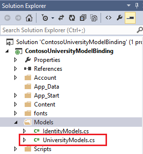
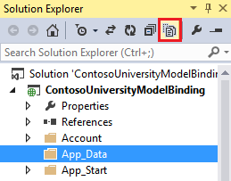
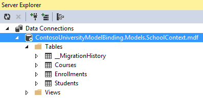

[Edit .md file](C:\Projects\msc\dev\Msc.Www\Web.ASP\App_Data\github\web-forms\overview\presenting-and-managing-data\model-binding\retrieving-data.md) | [Edit dev content](http://www.aspdev.net/umbraco#/content/content/edit/45586) | [View dev content](http://docs.aspdev.net/tutorials/web-forms/overview/presenting-and-managing-data/model-binding/retrieving-data.html) | [View prod content](http://www.asp.net/web-forms/overview/presenting-and-managing-data/model-binding/retrieving-data) | Picker: 45595

Retrieving and displaying data with model binding and web forms
====================
by [Tom FitzMacken](https://github.com/tfitzmac)

> This tutorial series demonstrates basic aspects of using model binding with an ASP.NET Web Forms project. Model binding makes data interaction more straight-forward than dealing with data source objects (such as ObjectDataSource or SqlDataSource). This series starts with introductory material and moves to more advanced concepts in later tutorials.
> 
> The model binding pattern works with any data access technology. In this tutorial, you will use Entity Framework, but you could use the data access technology that is most familiar to you. From a data-bound server control, such as a GridView, ListView, DetailsView, or FormView control, you specify the names of the methods to use for selecting, updating, deleting, and creating data. In this tutorial, you will specify a value for the SelectMethod.
> 
> Within that method, you provide the logic for retrieving the data. In the next tutorial, you will set values for UpdateMethod, DeleteMethod and InsertMethod.
> 
> You can [download](https://go.microsoft.com/fwlink/?LinkId=286116) the complete project in C# or VB. The downloadable code works with either Visual Studio 2012 or Visual Studio 2013. It uses the Visual Studio 2012 template, which is slightly different than the Visual Studio 2013 template shown in this tutorial.
> 
> In the tutorial you run the application in Visual Studio. You can also make the application available over the Internet by deploying it to a hosting provider. Microsoft offers free web hosting for up to 10 web sites in a  
>  [free Azure trial account](https://www.windowsazure.com/en-us/pricing/free-trial/?WT.mc_id=A443DD604). For information about how to deploy a Visual Studio web project to Azure App Service Web Apps, see the [ASP.NET Web Deployment using Visual Studio](../../../../mvc/overview/deployment/visual-studio-web-deployment/introduction.md) series. That tutorial also shows how to use Entity Framework Code First Migrations to deploy your SQL Server database to Azure SQL Database.
> 
> ## Software versions used in the tutorial
> 
> 
> - Microsoft Visual Studio 2013 or Microsoft Visual Studio Express 2013 for Web
>   
> 
> This tutorial also works with Visual Studio 2012 but there will be some differences in the user interface and project template.

## What you'll build

In this tutorial, you'll:

1. Build data objects that reflect a university with students enrolled in courses
2. Build database tables from the objects
3. Populate the database with test data
4. Display data in a web form

## Set up project

In Visual Studio 2013, create a new **ASP.NET Web Application** called **ContosoUniversityModelBinding**.

Select the Web Forms template, and leave the other default options. Click OK to setup the project.

First, you will make a couple of small changes to customize the appearance of the site. Open the **Site.Master** file, and change the title to include Contoso University instead of My ASP.NET Application.

[!code[Main](retrieving-data/samples/sample1.xml?highlight=1)]

Then, change the header text from **Application name** to **Contoso University**.

[!code[Main](retrieving-data/samples/sample2.xml?highlight=7)]

Also in Site.Master, change the navigation links that appear in the header to reflect the pages that are relevant to this site. You will not need either the **About** page or the **Contact** page so those links can be removed. Instead, you will need a link to a page called **Students**. This page has not been created yet.

    <ul class="nav navbar-nav">
        <li><a runat="server" href="~/">Home</a></li>
        <li><a runat="server" href="~/Students">Students</a></li>
    </ul>

Save and close Site.Master.

Now, you'll create the web form for displaying student data. Right-click your project, and **Add** a **New Item**. Select the **Web Form with Master Page** template, and name it **Students.aspx**.

Select **Site.Master** as the master page for the new web form.

## Create the data models and database

You will use Code First Migrations to create objects and the corresponding database tables. These tables will store information about the students and their courses.

In the Models folder, add a new class named **UniversityModels.cs**.

In this file, define the SchoolContext, Student, Enrollment, and Course classes as follows:

    using System;
    using System.Collections.Generic;
    using System.Data.Entity;
    using System.ComponentModel.DataAnnotations;
    
    namespace ContosoUniversityModelBinding.Models
    {
        public class SchoolContext : DbContext
        {
            public DbSet<Student> Students { get; set; }
            public DbSet<Enrollment> Enrollments { get; set; }
            public DbSet<Course> Courses { get; set; }
        }
    
        public class Student
        {
            [Key, Display(Name = "ID")]
            [ScaffoldColumn(false)]
            public int StudentID { get; set; }
    
            [Required, StringLength(40), Display(Name="Last Name")]
            public string LastName { get; set; }
    
            [Required, StringLength(20), Display(Name = "First Name")]
            public string FirstName { get; set; }
    
            [EnumDataType(typeof(AcademicYear)), Display(Name = "Academic Year")]
            public AcademicYear Year { get; set; }
    
            public virtual ICollection<Enrollment> Enrollments { get; set; }
        }
    
        public class Enrollment
        {
            [Key]
            public int EnrollmentID { get; set; }
            public int CourseID { get; set; }
            public int StudentID { get; set; }
            public decimal? Grade { get; set; }
            public virtual Course Course { get; set; }
            public virtual Student Student { get; set; }
        }
    
        public class Course
        {
            [Key]
            public int CourseID { get; set; }
            public string Title { get; set; }
            public int Credits { get; set; }
            public virtual ICollection<Enrollment> Enrollments { get; set; }
        } 
    
        public enum AcademicYear
        {
            Freshman,
            Sophomore,
            Junior,
            Senior
        }
    }

The SchoolContext class derives from DbContext, which manages the database connection and changes in the data.

In the Student class, notice the attributes that have been applied to the **FirstName**, **LastName**, and **Year** properties. These attributes will be used for data validation in this tutorial. To simplify the code for this demonstration project, only these properties were marked with data-validation attributes. In a real project, you would apply validation attributes to all properties that need validated data, such as properties in the Enrollment and Course classes.

Save UniversityModels.cs.

You will use the tools for Code First Migrations to set up a database based on these classes.

In **Package Manager Console**, run the command:  
`enable-migrations -ContextTypeName ContosoUniversityModelBinding.Models.SchoolContext`

If the command completes successfully you will receive a message stating migrations have been enabled,

Notice that a new file named **Configuration.cs** has been created. In Visual Studio, this file is automatically opened after it is created. The Configuration class contains a **Seed** method which enables you to pre-populate the database tables with test data.

Add the following code to the Seed method. You'll need to add a **using** statement for the **ContosoUniversityModelBinding.Models** namespace.

    namespace ContosoUniversityModelBinding.Migrations
    {
        using System;
        using System.Data.Entity;
        using System.Data.Entity.Migrations;
        using System.Linq;
        using ContosoUniversityModelBinding.Models;
    
        internal sealed class Configuration : DbMigrationsConfiguration<SchoolContext>
        {
            public Configuration()
            {
                AutomaticMigrationsEnabled = false;
            }
    
            protected override void Seed(SchoolContext context)
            {
    
                context.Students.AddOrUpdate(
                     new Student { 
                         FirstName = "Carson", 
                         LastName = "Alexander", 
                         Year = AcademicYear.Freshman },
                     new Student { 
                         FirstName = "Meredith", 
                         LastName = "Alonso", 
                         Year = AcademicYear.Freshman },
                     new Student { 
                         FirstName = "Arturo", 
                         LastName = "Anand", 
                         Year = AcademicYear.Sophomore },
                     new Student { 
                         FirstName = "Gytis", 
                         LastName = "Barzdukas", 
                         Year = AcademicYear.Sophomore },
                     new Student { 
                         FirstName = "Yan", 
                         LastName = "Li", 
                         Year = AcademicYear.Junior },
                     new Student { 
                         FirstName = "Peggy", 
                         LastName = "Justice", 
                         Year = AcademicYear.Junior },
                     new Student { 
                         FirstName = "Laura", 
                         LastName = "Norman", 
                         Year = AcademicYear.Senior },
                     new Student { 
                         FirstName = "Nino", 
                         LastName = "Olivetto", 
                         Year = AcademicYear.Senior }
                     );
    
                context.SaveChanges();
    
                context.Courses.AddOrUpdate(
                    new Course { Title = "Chemistry", Credits = 3 },
                    new Course { Title = "Microeconomics", Credits = 3 },
                    new Course { Title = "Macroeconomics", Credits = 3 },
                    new Course { Title = "Calculus", Credits = 4 },
                    new Course { Title = "Trigonometry", Credits = 4 },
                    new Course { Title = "Composition", Credits = 3 },
                    new Course { Title = "Literature", Credits = 4 }
                    );
    
                context.SaveChanges();
    
                context.Enrollments.AddOrUpdate(
                    new Enrollment { StudentID = 1, CourseID = 1, Grade = 1 },
                    new Enrollment { StudentID = 1, CourseID = 2, Grade = 3 },
                    new Enrollment { StudentID = 1, CourseID = 3, Grade = 1 },
                    new Enrollment { StudentID = 2, CourseID = 4, Grade = 2 },
                    new Enrollment { StudentID = 2, CourseID = 5, Grade = 4 },
                    new Enrollment { StudentID = 2, CourseID = 6, Grade = 4 },
                    new Enrollment { StudentID = 3, CourseID = 1 },
                    new Enrollment { StudentID = 4, CourseID = 1 },
                    new Enrollment { StudentID = 4, CourseID = 2, Grade = 4 },
                    new Enrollment { StudentID = 5, CourseID = 3, Grade = 3 },
                    new Enrollment { StudentID = 6, CourseID = 4 },
                    new Enrollment { StudentID = 7, CourseID = 5, Grade = 2 }
                    );
    
                context.SaveChanges();
            }
        }
    }

Save Configuration.cs.

In the Package Manager Console, run the command `add-migration initial`.

Then, run the command `update-database`.

If you receive an exception when running this command, it is possible that the values for StudentID and CourseID have varied from the values in the Seed method. Open those tables in the database and find existing values for StudentID and CourseID. Add those values in the code for seeding the Enrollments table.

The database file has been added, but it is currently hidden in the project. Click **Show All Files** to display the file.

Notice the .mdf file now appears in the App\_Data folder.

Double-click the .mdf file and open the Server Explorer. The tables now exist and are populated with data.

## Display data from Students and related tables

With data in the database, you are now ready to retrieve that data and display it in a web page. You will use a **GridView** control to display the data in columns and rows.

Open Students.aspx, and locate the **MainContent** placeholder. Within that placeholder, add a **GridView** control that includes the following code.

    <asp:Content ID="Content1" ContentPlaceHolderID="MainContent" runat="server">
        <asp:GridView runat="server" ID="studentsGrid"
            ItemType="ContosoUniversityModelBinding.Models.Student" DataKeyNames="StudentID" 
            SelectMethod="studentsGrid_GetData"
            AutoGenerateColumns="false">
            <Columns>
                <asp:DynamicField DataField="StudentID" />
                <asp:DynamicField DataField="LastName" />
                <asp:DynamicField DataField="FirstName" />
                <asp:DynamicField DataField="Year" />          
                <asp:TemplateField HeaderText="Total Credits">
                  <ItemTemplate>
                    <asp:Label Text="<%# Item.Enrollments.Sum(en => en.Course.Credits) %>" 
                        runat="server" />
                  </ItemTemplate>
                </asp:TemplateField>        
            </Columns>
        </asp:GridView>
    </asp:Content>

There are a couple of important concepts in this markup code for you to notice. First, notice that a value is set for the **SelectMethod** property in the GridView element. This value specifies the name of the method that is used for retrieving data for the GridView. You will create this method in the next step. Second, notice that the **ItemType** property is set to the Student class that you created earlier. By setting this value, you can refer to properties of that class in the markup code. For example, the Student class contains a collection named Enrollments. You can use **Item.Enrollments** to retrieve that collection and then use LINQ syntax to retrieve the sum of enrolled credits for each student.

In the code-behind file, you need to add the method that is specified for the **SelectMethod** value. Open **Students.aspx.cs**, and add **using** statements for the **ContosoUniversityModelBinding.Models** and **System.Data.Entity** namespaces.

    using ContosoUniversityModelBinding.Models;
    using System.Data.Entity;

Then, add the following method. Notice that the name of this method matches the name you provided for SelectMethod.

    public IQueryable<Student> studentsGrid_GetData()
    {
        SchoolContext db = new SchoolContext();
        var query = db.Students.Include(s => s.Enrollments.Select(e => e.Course));
        return query;
    }

The **Include** clause improves the performance of this query but is not essential for the query to work. Without the Include clause, the data would be retrieved using lazy loading, which involves sending a separate query to the database each time related data is retrieved. By providing the Include clause, the data is retrieved using eager loading, which means all of the related data is retrieved through a single query of the database. In cases where most of the related data is not be used, eager loading can be less efficient because more data is retrieved. However, in this case, eager loading provides the best performance because the related data is displayed for each record.

For more information about performance consideration when loading related data, see the section titled **Lazy, Eager, and Explicit Loading of Related Data** in the [Reading Related Data with the Entity Framework in an ASP.NET MVC Application](../../../../mvc/overview/getting-started/getting-started-with-ef-using-mvc/reading-related-data-with-the-entity-framework-in-an-asp-net-mvc-application.md) topic.

By default, the data is sorted by the values of the property marked as the key. You can add an OrderBy clause to specify a different value for sorting. In this example, the default StudentID property is used for sorting. In the [Sorting, Paging, and Filtering Data](sorting-paging-and-filtering-data.md) topic, you will enable the user to select a column for sorting.

Run your web application, and navigate to the Students page. The Students page displays the following student information.

## Automatic generation of model binding methods

When working through this tutorial series, you can simply copy the code from the tutorial to your project. However, one disadvantage of this approach is that you may not become aware of the feature provided by Visual Studio to automatically generate code for model binding methods. When working on your own projects, automatic code generation can save you time and help you gain a sense of how to implement an operation. This section describes the automatic code generation feature. This section is only informational and does not contain any code you need to implement in your project.

When setting a value for the **SelectMethod**, **UpdateMethod**, **InsertMethod**, or **DeleteMethod** properties in the markup code, you can select the **Create New Method** option.

Visual Studio not only creates a method in the code-behind with the proper signature, but also generates implementation code to assist you with performing the operation. If you first set the **ItemType** property before using the automatic code generation feature, the generated code will use that type for the operations. For example, when setting the UpdateMethod property, the following code is automatically generated:

    // The id parameter name should match the DataKeyNames value set on the control
    public void studentsGrid_UpdateItem(int id)
    {
        ContosoUniversityModelBinding.Models.Student item = null;
        // Load the item here, e.g. item = MyDataLayer.Find(id);
        if (item == null)
        {
            // The item wasn't found
            ModelState.AddModelError("", String.Format("Item with id {0} was not found", id));
            return;
        }
        TryUpdateModel(item);
        if (ModelState.IsValid)
        {
            // Save changes here, e.g. MyDataLayer.SaveChanges();
    
        }
    }

Again, the above code does not need to be added to your project. In the next tutorial, you will implement methods for updating, deleting and adding new data.

## Conclusion

In this tutorial, you created data model classes and generated a database from those classes. You filled the database tables with test data. You used model binding to retrieve data from the database, and then displayed the data in a GridView.

In the next [tutorial](updating-deleting-and-creating-data.md) in this series, you will enable updating, deleting, and creating data.

>[!div class="step-by-step"] [Next](updating-deleting-and-creating-data.md)