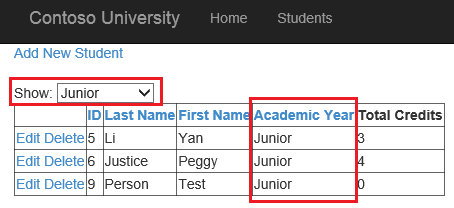

Sorting, paging, and filtering data with model binding and web forms
====================
by [Tom FitzMacken](https://github.com/tfitzmac)

> This tutorial series demonstrates basic aspects of using model binding with an ASP.NET Web Forms project. Model binding makes data interaction more straight-forward than dealing with data source objects (such as ObjectDataSource or SqlDataSource). This series starts with introductory material and moves to more advanced concepts in later tutorials.
> 
> This tutorial shows how to add sorting, paging, and filtering of the data through model binding.
> 
> This tutorial builds on the project created in the first [part](retrieving-data.md) of the series.
> 
> You can [download](https://go.microsoft.com/fwlink/?LinkId=286116) the complete project in C# or VB. The downloadable code works with either Visual Studio 2012 or Visual Studio 2013. It uses the Visual Studio 2012 template, which is slightly different than the Visual Studio 2013 template shown in this tutorial.

## What you'll build

In this tutorial, you'll:

1. Enable sorting and paging of the data
2. Enable filtering of the data based on a selection by the user

## Add sorting

Enabling sorting in the GridView is very easy. In the Student.aspx file, simply set **AllowSorting** to **true** in the GridView. You do not need to set a **SortExpression** value for each column as the DataField is automatically used. The GridView modifies the query to include ordering the data by the selected value. The highlighted code below shows the addition you need to make to enable sorting.

[!code-aspx[Main](sorting-paging-and-filtering-data/samples/sample1.aspx?highlight=5)]

Run the web application, and test sorting student records by the values in different columns.

## Add paging

Enabling paging is also very easy. In the GridView, set the **AllowPaging** property to **true** and set the **PageSize** property to the number of records you wish to display on each page. In this tutorial, you can set it to 4.

[!code-aspx[Main](sorting-paging-and-filtering-data/samples/sample2.aspx?highlight=5)]

Run the web application, and notice that now the records are divided over multiple pages with no more than 4 records displayed on a single page.

Deferred query execution improves the application efficiency. Instead of retrieving the entire data set, the GridView modifies the query to retrieve only the records for the current page.

## Filter records by user selection

Model binding adds several attributes which enable you to designate how to set the value for a parameter in a model binding method. These attributes are in the **System.Web.ModelBinding** namespace. They include:

- Control
- Cookie
- Form
- Profile
- QueryString
- RouteData
- Session
- UserProfile
- ViewState

In this tutorial, you will use a control's value to filter which records are displayed in the GridView. You will add the **Control** attribute to the query method you had created earlier. In a [later](using-query-string-values-to-retrieve-data.md) tutorial, you will apply the **QueryString** attribute to a parameter to specify that the parameter value comes from a query string value.

First, above the ValidationSummary, add a drop down list for filtering which students are shown.

[!code-aspx[Main](sorting-paging-and-filtering-data/samples/sample3.aspx?highlight=3-11)]

In the code-behind file, modify the select method to receive a value from the control, and set the name of the parameter to the name of the control that provides the value.

You must add a **using** statement for the **System.Web.ModelBinding** namespace to resolve the Control attribute.

[!code-csharp[Main](sorting-paging-and-filtering-data/samples/sample4.cs)]

The following code shows the select method re-worked to filter the returned data based on the value of the drop down list. Adding a control attribute before a parameter specifies that the value for this parameter comes from a control with the same name.

[!code-csharp[Main](sorting-paging-and-filtering-data/samples/sample5.cs)]

Run the web application and select different values from the drop down list to filter the list of students.

## Conclusion

In this tutorial, you enabled sorting and paging of the data. You also enabled filtering the data by the value of a control.

In the next [tutorial](integrating-jquery-ui.md) you will enhance the UI by integrating a JQuery UI widget into the dynamic data template.

>[!div class="step-by-step"]
[Previous](updating-deleting-and-creating-data.md)
[Next](integrating-jquery-ui.md)