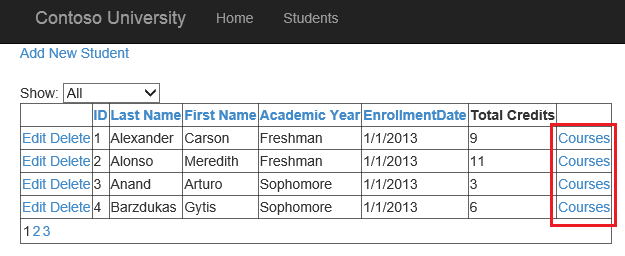

Using query string values to filter data with model binding and web forms
====================
by [Tom FitzMacken](https://github.com/tfitzmac)

> This tutorial series demonstrates basic aspects of using model binding with an ASP.NET Web Forms project. Model binding makes data interaction more straight-forward than dealing with data source objects (such as ObjectDataSource or SqlDataSource). This series starts with introductory material and moves to more advanced concepts in later tutorials.
> 
> This tutorial shows how to pass a value in the query string and use that value to retrieve data through model binding.
> 
> This tutorial builds on the project created in the [earlier](retrieving-data.md) parts of the series.
> 
> You can [download](https://go.microsoft.com/fwlink/?LinkId=286116) the complete project in C# or VB. The downloadable code works with either Visual Studio 2012 or Visual Studio 2013. It uses the Visual Studio 2012 template, which is slightly different than the Visual Studio 2013 template shown in this tutorial.

## What you'll build

In this tutorial, you'll:

1. Add a new page to show the enrolled courses for a student
2. Retrieve the enrolled courses for the selected student based on a value in the query string
3. Add a hyperlink with a query string value from the grid view to the new page

The steps in this tutorial are fairly similar to what you did in the earlier [tutorial](sorting-paging-and-filtering-data.md) to filter the displayed students based on the user selection in a drop down list. In that tutorial, you used the **Control** attribute in the select method to specify that the parameter value comes from a control. In this tutorial, you'll use the **QueryString** attribute in the select method to specify that the parameter value comes from the query string.

## Add new page for displaying a student's courses

Add a new web form that uses the Site.master master page, and name the page **Courses**.

In the **Courses.aspx** file, add a grid view to display the courses for the selected student.

[!code-aspx[Main](using-query-string-values-to-retrieve-data/samples/sample1.aspx)]

## Define the select method

In **Courses.aspx.cs**, you will add the select method with the name you specified in the grid view's **SelectMethod** property. In that method, you'll define the query for retrieving a student's courses, and specify that the parameter comes from a query string value with the same name as the parameter.

First, you must add the following **using** statements.

[!code-csharp[Main](using-query-string-values-to-retrieve-data/samples/sample2.cs)]

Then, add the following code to Courses.aspx.cs:

[!code-csharp[Main](using-query-string-values-to-retrieve-data/samples/sample3.cs)]

The QueryString attribute means that a query string value named StudentID is automatically assigned to the parameter in this method.

## Add hyperlink with query string value

In the grid view on Students.aspx, you will add a hyperlink field that links to your new Courses page. The hyperlink will include a query string value with the student's id.

In Students.aspx, add the following field to the grid view columns just below the field for Total Credits.

[!code-aspx[Main](using-query-string-values-to-retrieve-data/samples/sample4.aspx?highlight=7-8)]

Run the application and notice that the grid view now includes the Courses link.

When you click one of the links, you'll see that student's enrolled courses.

## Conclusion

In this tutorial, you added a link with a query string value. You used that query string value for the parameter value in the select method.

In the next [tutorial](adding-business-logic-layer.md), you will move the code from the code-behind files into a business logic layer and a data access layer.

>[!div class="step-by-step"]
[Previous](integrating-jquery-ui.md)
[Next](adding-business-logic-layer.md)