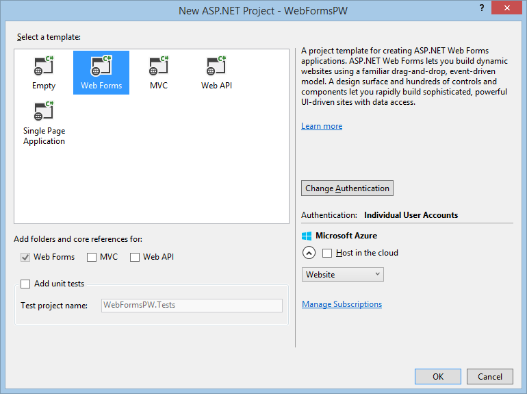
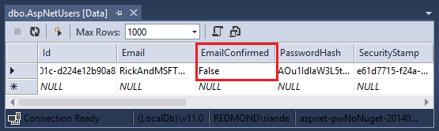
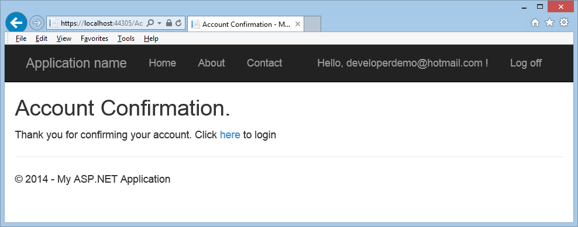

Create a secure ASP.NET Web Forms app with user registration, email confirmation and password reset (C#)
====================
by [Erik Reitan](https://github.com/Erikre)

> This tutorial shows you how to build an ASP.NET Web Forms app with user registration, email confirmation and password reset using the ASP.NET Identity membership system. This tutorial was based on Rick Anderson's [MVC tutorial](../../../mvc/overview/security/create-an-aspnet-mvc-5-web-app-with-email-confirmation-and-password-reset.md).

## Introduction

This tutorial guides you through the steps required to create an ASP.NET Web Forms application using Visual Studio and ASP.NET 4.5 to create a secure Web Forms app with user registration, email confirmation and password reset.

### Tutorial Tasks and Information:

- [Create an ASP.NET Web Forms app](#createWebForms)
- [Hook Up SendGrid](#SG)
- [Require Email Confirmation Before Log In](#require)
- [Password Recovery and Reset](#reset)
- [Resend Email Confirmation Link](#rsend)
- [Troubleshooting the App](#dbg)
- [Additional Resources](#addRes)

## Create an ASP.NET Web Forms App

Start by installing and running [Visual Studio Express 2013 for Web](https://go.microsoft.com/fwlink/?LinkId=299058) or [Visual Studio 2013](https://go.microsoft.com/fwlink/?LinkId=306566). Install [Visual Studio 2013 Update 3](https://go.microsoft.com/fwlink/?LinkId=390465) or higher as well.

> [!NOTE]
> Warning: You must install [Visual Studio 2013 Update 3](https://go.microsoft.com/fwlink/?LinkId=390465) or higher to complete this tutorial.

1. Create a new project (**File** -&gt; **New Project**) and select the **ASP.NET Web Application** template and the latest .NET Framework version from the **New Project** dialog box.
2. From the **New ASP.NET Project** dialog box, select the **Web Forms** template. Leave the default authentication as **Individual User Accounts**. If you'd like to host the app in Azure, leave the **Host in the cloud** check box checked.   
 Then, click **OK** to create the new project.  
    
3. Enable Secure Sockets Layer (SSL) for the project. Follow the steps available in the **Enable SSL for the Project** section of the [Getting Started with Web Forms tutorial series](../getting-started/getting-started-with-aspnet-45-web-forms/checkout-and-payment-with-paypal.md#SSLWebForms).
4. Run the app, click the **Register** link and register a new user. At this point, the only validation on the email is based on the [[EmailAddress]](https://msdn.microsoft.com/en-us/library/system.componentmodel.dataannotations.emailaddressattribute(v=vs.110).aspx) attribute to ensure the email address is well-formed. You will modify the code to add email confirmation. Close the browser window.
5. In **Server Explorer** of Visual Studio (**View** -&gt; **Server Explorer**), navigate to **Data Connections\DefaultConnection\Tables\AspNetUsers**, right click and select **Open table definition**. 

    The following image shows the `AspNetUsers` table schema:

    
6. In **Server Explorer**, right-click on the **AspNetUsers** table and select **Show Table Data**.  
  
      
 At this point the email for the registered user has not been confirmed.
7. Click on the row and select delete to delete the user. You'll add this email again in the next step and send a confirmation message to the email address.

## Email Confirmation

It's a best practice to confirm the email during the registration of a new user to verify they are not impersonating someone else (that is, they haven't registered with someone else's email). Suppose you had a discussion forum, you would want to prevent `"bob@cpandl.com"` from registering as `"joe@contoso.com"`. Without email confirmation, `"joe@contoso.com"` could get unwanted email from your app. Suppose Bob accidently registered as `"bib@cpandl.com"` and hadn't noticed it, he wouldn't be able to use password recovery because the app doesn't have his correct email. Email confirmation provides only limited protection from bots and doesn't provide protection from determined spammers.

You generally want to prevent new users from posting any data to your website before they have been confirmed by either email, an SMS text message or another mechanism. In the sections below, we will enable email confirmation and modify the code to prevent newly registered users from logging in until their email has been confirmed. You'll use the email service SendGrid in this tutorial.

## Hook up SendGrid

Although this tutorial only shows how to add email notification through [SendGrid](http://sendgrid.com/), you can send email using SMTP and other mechanisms (see [additional resources](#addRes)).

1. In Visual Studio, open the **Package Manager Console** (**Tools** -&gt; **NuGet Package Manger** -&gt; **Package Manager Console**), and enter the following command:  
    `Install-Package SendGrid`
2. Go to the [Azure SendGrid sign-up page](https://azure.microsoft.com/en-us/gallery/store/sendgrid/sendgrid-azure/) and register for free SendGrid account. You can also sign-up for a free SendGrid account directly on [SendGrid's site](http://www.sendgrid.com).
3. From **Solution Explorer** open the *IdentityConfig.cs* file in the *App\_Start* folder and add the following code highlighted in yellow to the `EmailService` class to configure **SendGrid**:

    [!code-csharp[Main](create-a-secure-aspnet-web-forms-app-with-user-registration-email-confirmation-and-password-reset/samples/sample1.cs?highlight=3,5,8-37)]
4. Also, add the following `using` statements to the beginning of the *IdentityConfig.cs* file: 

    [!code-csharp[Main](create-a-secure-aspnet-web-forms-app-with-user-registration-email-confirmation-and-password-reset/samples/sample2.cs?highlight=1-4)]
5. To keep this sample simple, you'll store the email service account values in the `appSettings` section of the *web.config* file. Add the following XML highlighted in yellow to the *web.config* file at the root of your project:

    [!code-xml[Main](create-a-secure-aspnet-web-forms-app-with-user-registration-email-confirmation-and-password-reset/samples/sample3.xml?highlight=2-5)]

    > [!WARNING]
    > Security - Never store sensitive data in your source code. In this example, the account and credentials are stored in the **appSetting** section of the *Web.config* file. On Azure, you can securely store these values on the **[Configure](https://blogs.msdn.com/b/webdev/archive/2014/06/04/queuebackgroundworkitem-to-reliably-schedule-and-run-long-background-process-in-asp-net.aspx)** tab in the Azure portal. For related information see Rick Anderson's topic titled [Best practices for deploying passwords and other sensitive data to ASP.NET and Azure](https://go.microsoft.com/fwlink/?LinkId=513141).
6. Add the email service values to reflect your SendGrid authentication values (User Name and Password) so that you can successful send email from your app. Be sure to use your SendGrid account name rather than the email address you provided SendGrid.

### Enable Email Confirmation

 To enable email confirmation, you'll modify the registration code using the following steps.  
 

1. In the *Account* folder, open the *Register.aspx.cs* code-behind and update the `CreateUser_Click` method to enable the following highlighted changes: 

    [!code-csharp[Main](create-a-secure-aspnet-web-forms-app-with-user-registration-email-confirmation-and-password-reset/samples/sample4.cs?highlight=9-11)]
2. In **Solution Explorer**, right-click *Default.aspx* and select **Set As Start Page**.
3. Run the app by pressing **F5.** After the page is displayed, click the **Register** link to display the Register page.
4. Enter your email and password, then click the **Register** button to send an email message via SendGrid.  
 The current state of your project and code will allow the user to log in once they complete the registration form, even though they haven't confirmed their account.
5. Check your email account and click on the link to confirm your email.  
 Once you submit the registration form, you will be logged in.  
    

## Require Email Confirmation Before Log In

Although you have confirmed the email account, at this point you would not need to click on the link contained in the verification email to be fully signed-in. In the following section, you will modify the code requiring new users to have a confirmed email before they are logged in (authenticated).

1. In **Solution Explorer** of Visual Studio, update the `CreateUser_Click` event in the *Register.aspx.cs* code-behind contained in the *Accounts* folder with the following highlighted changes: 

    [!code-csharp[Main](create-a-secure-aspnet-web-forms-app-with-user-registration-email-confirmation-and-password-reset/samples/sample5.cs?highlight=13-14,17-21)]
2. Update the `LogIn` method in the *Login.aspx.cs* code-behind with the following highlighted changes: 

    [!code-csharp[Main](create-a-secure-aspnet-web-forms-app-with-user-registration-email-confirmation-and-password-reset/samples/sample6.cs?highlight=9-19,45-46)]

### Run the Application

 Now that you have implemented the code to check whether a user's email address has been confirmed, you can check the functionality on both the **Register** and **Login** pages. 

1. Delete any accounts in the **AspNetUsers** table that contain the email alias you wish to test.
2. Run the app (**F5**) and verify you cannot register as a user until you have confirmed your email address.
3. Before confirming your new account via the email that was just sent, attempt to log in with the new account.  
 You'll see that you are unable to log in and that you must have a confirmed email account.
4. Once you confirm your email address, log in to the app.

## Password Recovery and Reset

1. In Visual Studio, remove the comment characters from the `Forgot` method in the *Forgot.aspx.cs* code-behind contained in the *Account* folder, so that the method appears as follows: 

    [!code-csharp[Main](create-a-secure-aspnet-web-forms-app-with-user-registration-email-confirmation-and-password-reset/samples/sample7.cs?highlight=16-18)]
2. Open the *Login.aspx* page. Replace the markup near the end of the **loginForm** section as highlighted below: 

    [!code-aspx[Main](create-a-secure-aspnet-web-forms-app-with-user-registration-email-confirmation-and-password-reset/samples/sample8.aspx?highlight=52-53)]
3. Open the *Login.aspx.cs* code-behind and uncomment the following line of code highlighted in yellow from the `Page_Load` event handler: 

    [!code-csharp[Main](create-a-secure-aspnet-web-forms-app-with-user-registration-email-confirmation-and-password-reset/samples/sample9.cs?highlight=5)]
4. Run the app by pressing **F5.** After the page is displayed, click the **Log in** link.
5. Click the **Forgot your password?** link to display the **Forgot Password** page.
6. Enter your email address and click the **Submit** button to send an email to your address which will allow you to reset your password.   
 Check your email account and click on the link to display the **Reset Password** page.
7. On the **Reset Password** page, enter your email, password, and confirmed password. Then, press the **Reset** button.  
 When you successfully reset your password, the **Password Changed** page will be displayed. Now you can log in with your new password.

## Resend Email Confirmation Link

Once a user creates a new local account, they are emailed a confirmation link they are required to use before they can log on. If the user accidently deletes the confirmation email, or the email never arrives, they will need the confirmation link sent again. The following code changes show how to enable this.

1. In Visual Studio, open the **Login.aspx.cs** code-behind and add the following event handler after the `LogIn` event handler:   

    [!code-csharp[Main](create-a-secure-aspnet-web-forms-app-with-user-registration-email-confirmation-and-password-reset/samples/sample10.cs)]
2. Modify the `LogIn` event handler in the *Login.aspx.cs* code-behind by changing the code highlighted in yellow as follows: 

    [!code-csharp[Main](create-a-secure-aspnet-web-forms-app-with-user-registration-email-confirmation-and-password-reset/samples/sample11.cs?highlight=15-17)]
3. Update the *Login.aspx* page by adding the code highlighted in yellow as follows: 

    [!code-aspx[Main](create-a-secure-aspnet-web-forms-app-with-user-registration-email-confirmation-and-password-reset/samples/sample12.aspx?highlight=45-46)]
4. Delete any accounts in the **AspNetUsers** table that contain the email alias you wish to test.
5. Run the app (**F5**) and register your email address.
6. Before confirming your new account via the email that was just sent, attempt to log in with the new account.  
 You'll see that you are unable to log in and that you must have a confirmed email account. In addition, you can now resend a confirmation message to your email account.
7. Enter your email address and password, then press the **Resend confirmation** button.
8. Once you confirm your email address based on the newly sent email message, log in to the app.

## Troubleshooting the App

If you don't receive an email containing the link to verify your credentials:

- Check your junk or spam folder.
- Log into your SendGrid account and click on the [Email Activity link](https://sendgrid.com/logs/index).
- Be certain you used your SendGrid user account name as a *Web.config* value rather than your SendGrid account email address.

## Additional Resources

- [Links to ASP.NET Identity Recommended Resources](../../../identity/overview/getting-started/aspnet-identity-recommended-resources.md)
- [Account Confirmation and Password Recovery with ASP.NET Identity](../../../identity/overview/features-api/account-confirmation-and-password-recovery-with-aspnet-identity.md)
- [ASP.NET Web Forms tutorial series - Add an OAuth 2.0 Provider](../getting-started/getting-started-with-aspnet-45-web-forms/checkout-and-payment-with-paypal.md#OAuthWebForms)
- [Deploy a Secure ASP.NET Web Forms App with Membership, OAuth, and SQL Database to Azure App Service](https://azure.microsoft.com/en-us/documentation/articles/web-sites-dotnet-deploy-aspnet-webforms-app-membership-oauth-sql-database/)
- [ASP.NET Web Forms tutorial series - Enable SSL for the Project](../getting-started/getting-started-with-aspnet-45-web-forms/checkout-and-payment-with-paypal.md#SSLWebForms)