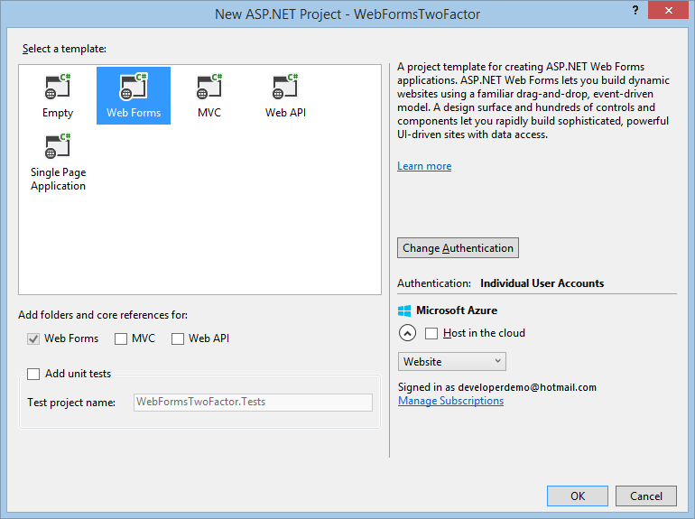
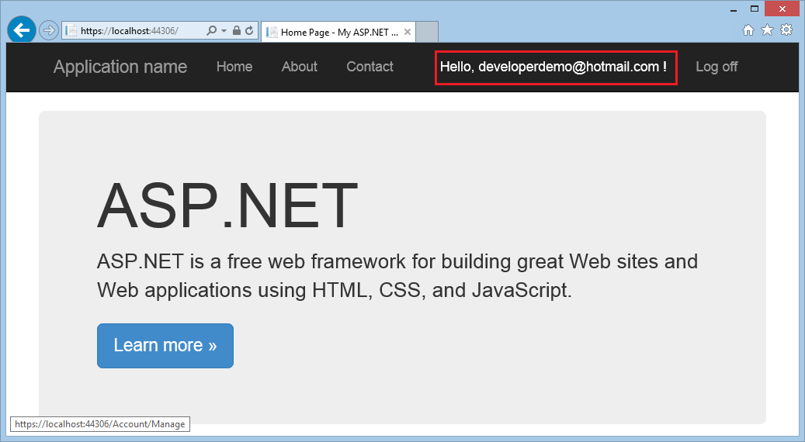
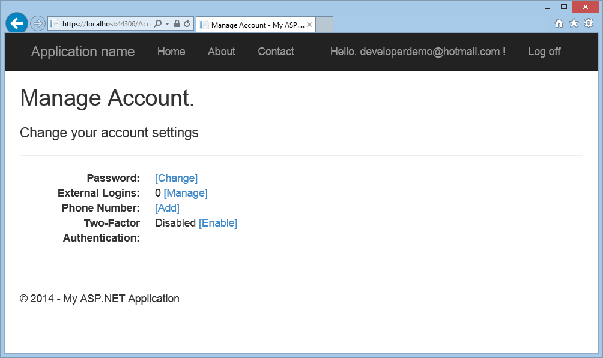
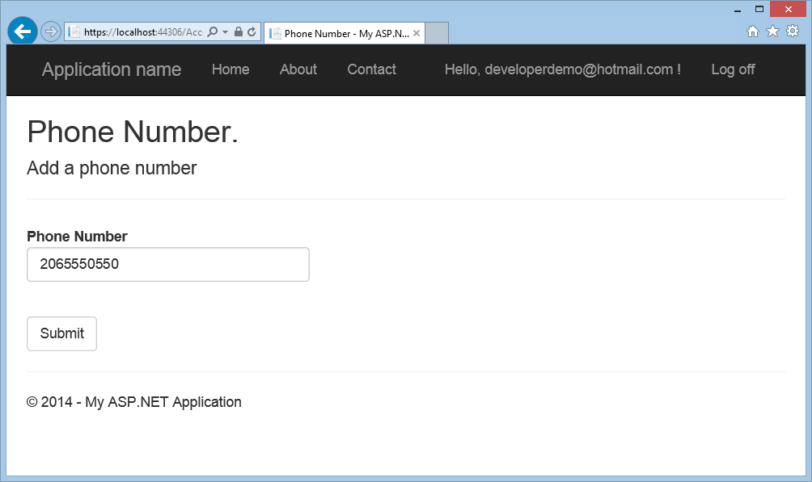
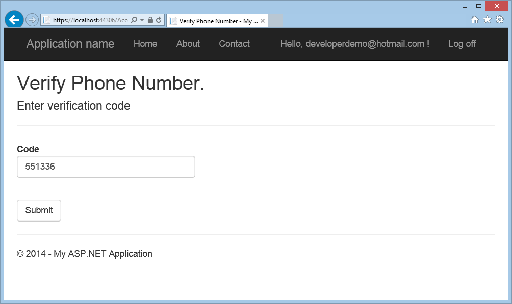
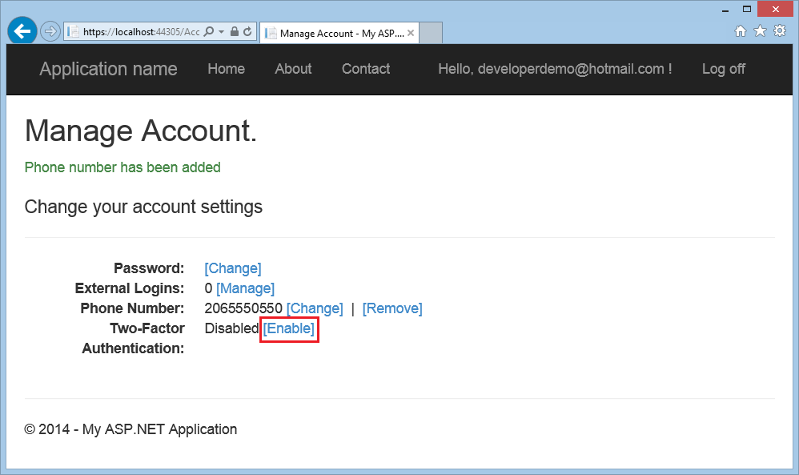
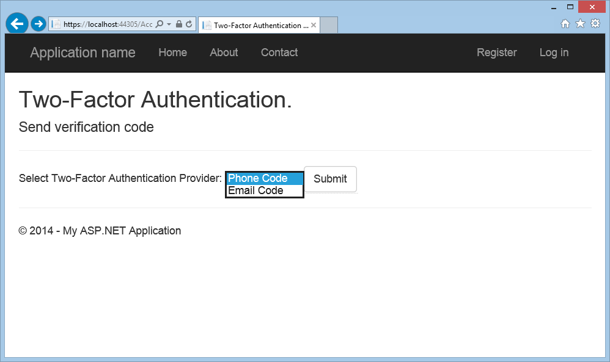
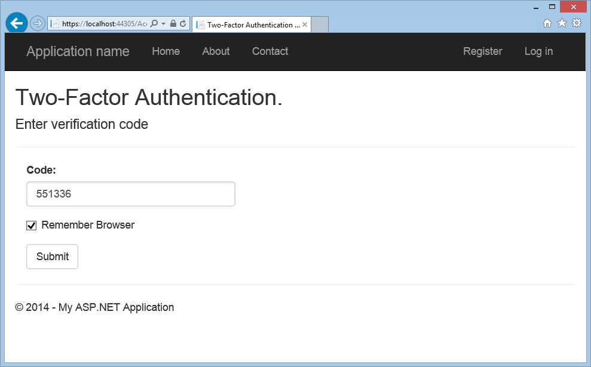

Create an ASP.NET Web Forms app with SMS Two-Factor Authentication (C#)
====================
by [Erik Reitan](https://github.com/Erikre)

[Download ASP.NET Web Forms App with Email and SMS Two-Factor Authentication](https://code.msdn.microsoft.com/ASPNET-Web-Forms-App-with-5a0ff94e)

> This tutorial shows you how to build an ASP.NET Web Forms app with Two-Factor Authentication. This tutorial was designed to complement the tutorial titled [Create a secure ASP.NET Web Forms app with user registration, email confirmation and password reset](create-a-secure-aspnet-web-forms-app-with-user-registration-email-confirmation-and-password-reset.md). In addition, this tutorial was based on Rick Anderson's [MVC tutorial](../../../mvc/overview/security/aspnet-mvc-5-app-with-sms-and-email-two-factor-authentication.md).

## Introduction

This tutorial guides you through the steps required to create an ASP.NET Web Forms application that supports Two-Factor Authentication using Visual Studio. Two-Factor Authentication is an extra user authentication step. This extra step generates a unique personal identification number (PIN) during sign-in. The PIN is commonly sent to the user as an email or SMS message. The user of your app then enters the PIN as an extra authentication measure when signing-in.

### Tutorial Tasks and Information:

- [Create an ASP.NET Web Forms App](#createWebForms)
- [Setup SMS and Two-Factor Authentication](#SMS)
- [Enable Two-Factor Authentication for Registered User](#use2FA)
- [Additional Resources](#addRes)

## Create an ASP.NET Web Forms App

Start by installing and running [Visual Studio Express 2013 for Web](https://go.microsoft.com/fwlink/?LinkId=299058) or [Visual Studio 2013](https://go.microsoft.com/fwlink/?LinkId=306566). Install [Visual Studio 2013 Update 3](https://go.microsoft.com/fwlink/?LinkId=390465) or higher as well. Also, you will need to create a [Twilio](https://www.twilio.com/try-twilio) account, as explained below.

> [!NOTE]
> Important: You must install [Visual Studio 2013 Update 3](https://go.microsoft.com/fwlink/?LinkId=390465) or higher to complete this tutorial.

1. Create a new project (**File** -&gt; **New Project**) and select the **ASP.NET Web Application** template along with the .NET Framework version 4.5.2 from the **New Project** dialog box.
2. From the **New ASP.NET Project** dialog box, select the **Web Forms** template. Leave the default authentication as **Individual User Accounts**. Then, click **OK** to create the new project.  
    
3. Enable Secure Sockets Layer (SSL) for the project. Follow the steps available in the **Enable SSL for the Project** section of the [Getting Started with Web Forms tutorial series](../getting-started/getting-started-with-aspnet-45-web-forms/checkout-and-payment-with-paypal.md#SSLWebForms).
4. In Visual Studio, open the **Package Manager Console** (**Tools** -&gt; **NuGet Package Manger** -&gt; **Package Manager Console**), and enter the following command:  
    `Install-Package Twilio`

## Setup SMS and Two-Factor Authentication

This tutorial uses Twilio, but you can use any SMS provider.

1. Create a [Twilio](https://www.twilio.com/try-twilio) account.
2. From the **Dashboard** tab of your Twilio account, copy the **Account SID** and **Auth Token.** You will add them to your app later.
3. From the **Numbers** tab, copy your Twilio **phone number** as well.
4. Make the Twilio **Account SID**, **Auth Token** and **phone number** available to the app. To keep things simple you will store these values in the *web.config* file. When you deploy to Azure, you can store the values securely in the **appSettings** section on the web site configure tab. Also, when adding the phone number, only use numbers.   
 Notice that you can also add SendGrid credentials. SendGrid is an email notification service. For details about how to enable SendGrid, see the 'Hook Up SendGrid' section of the tutorial titled [Create a Secure ASP.NET Web Forms App with user registration, email confirmation and password reset.](create-a-secure-aspnet-web-forms-app-with-user-registration-email-confirmation-and-password-reset.md)

    [!code-xml[Main](create-an-aspnet-web-forms-app-with-sms-two-factor-authentication/samples/sample1.xml?highlight=2,6-10)]

    > [!WARNING]
    > Security - Never store sensitive data in your source code. In this example, the account and credentials are stored in the **appSettings** section of the *Web.config* file. On Azure, you can securely store these values on the **[Configure](https://blogs.msdn.com/b/webdev/archive/2014/06/04/queuebackgroundworkitem-to-reliably-schedule-and-run-long-background-process-in-asp-net.aspx)** tab in the Azure portal. For related information, see Rick Anderson's topic titled [Best practices for deploying passwords and other sensitive data to ASP.NET and Azure](https://go.microsoft.com/fwlink/?LinkId=513141).
5. Configure the `SmsService` class in the *App\_Start\IdentityConfig.cs* file by making the following changes highlighted in yellow: 

    [!code-csharp[Main](create-an-aspnet-web-forms-app-with-sms-two-factor-authentication/samples/sample2.cs?highlight=5-17)]
6. Add the following `using` statements to the beginning of the *IdentityConfig.cs* file: 

    [!code-csharp[Main](create-an-aspnet-web-forms-app-with-sms-two-factor-authentication/samples/sample3.cs?highlight=1-4)]
7. Update the *Account/Manage.aspx* file by removing the lines highlighted in yellow:  

    [!code-aspx[Main](create-an-aspnet-web-forms-app-with-sms-two-factor-authentication/samples/sample4.aspx?highlight=38,53,57-60,63,66,70,73)]
8. In the `Page_Load` handler of the *Manage.aspx.cs* code-behind, uncomment the line of code highlighted in yellow so that it appears as follows: 

    [!code-csharp[Main](create-an-aspnet-web-forms-app-with-sms-two-factor-authentication/samples/sample5.cs?highlight=8)]
9. In the codebehind of *Account*/*TwoFactorAuthenticationSignIn.aspx.cs*, update the `Page_Load` handler by adding the following code highlighted in yellow: 

    [!code-csharp[Main](create-an-aspnet-web-forms-app-with-sms-two-factor-authentication/samples/sample6.cs?highlight=3-4,13)]

 By making the above code change, the "Providers" DropDownList containing the authentication options will not be reset to the first value. This will allow the user to successfully select all options to use when authenticating, not just the first.
10. In **Solution Explorer**, right-click *Default.aspx* and select **Set As Start Page**.
11. By testing your app, first build the app (**Ctrl**+**Shift**+**B**) and then run the app (**F5**) and either select **Register** to create a new user account or select **Log in** if the user account has already been registered.
12. Once you (as the user) have logged in, click on the User ID (email address) in the navigation bar to display the **Manage Account** page (Manage.aspx).  
    
13. Click **Add** next to **Phone Number** on the **Manage Account** page.  
    
14. Add the phone number where you (as the user) would like to receive SMS messages (text messages) and click the **Submit** button.   
      
 At this point, the app will use the credentials from the *Web.config* to contact Twilio. A SMS message (text message) will be sent to the phone associated with the user account. You can verify that the Twilio message was sent by viewing the Twilio dashboard.
15. In a few seconds, the phone associated with the user account will get a text message containing the verification code. Enter the verification code and press **Submit**.  
     

## Enable Two-Factor Authentication for a Registered User

At this point, you have enabled two-factor authentication for your app. For a user to use two-factor authentication, they can simply change their settings using the UI. 

1. As a user of your app you can enable two-factor authentication for your specific account by clicking on the user ID (email alias) in the navigation bar to display the **Manage Account** page.Then, click on the **Enable** link to enable two-factor authentication for the account.
2. Log off, then log back in. If you've enabled email, you can select either SMS or email for two-factor authentication. If you haven't enabled email, see the tutorial titled [Create a Secure ASP.NET Web Forms App with User Registration, Email Confirmation and Password Reset](create-a-secure-aspnet-web-forms-app-with-user-registration-email-confirmation-and-password-reset.md).
3. The Two-Factor Authentication page is displayed where you can enter the code (from SMS or email).  
 Clicking on the **Remember this browser** check box will exempt you from needing to use two-factor authentication to log in when using the browser and device where you checked the box. As long as malicious users can't gain access to your device, enabling two-factor authentication and clicking on the **Remember this browser** will provide you with convenient one step password access, while still retaining strong two-factor authentication protection for all access from non-trusted devices. You can do this on any private device you regularly use.

## Additional Resources

- [Two-factor authentication using SMS and email with ASP.NET Identity](../../../identity/overview/features-api/two-factor-authentication-using-sms-and-email-with-aspnet-identity.md)
- [Links to ASP.NET Identity Recommended Resources](../../../identity/overview/getting-started/aspnet-identity-recommended-resources.md)
- [Deploy a Secure ASP.NET Web Forms App with Membership, OAuth, and SQL Database to an Azure Website](https://azure.microsoft.com/en-us/documentation/articles/web-sites-dotnet-deploy-aspnet-webforms-app-membership-oauth-sql-database/)
- [ASP.NET Web Forms tutorial series - Add an OAuth 2.0 Provider](../getting-started/getting-started-with-aspnet-45-web-forms/checkout-and-payment-with-paypal.md#OAuthWebForms)
- [ASP.NET Web Forms tutorial series - Enable SSL for the Project](../getting-started/getting-started-with-aspnet-45-web-forms/checkout-and-payment-with-paypal.md#SSLWebForms)
- [Account Confirmation and Password Recovery with ASP.NET Identity](../../../identity/overview/features-api/account-confirmation-and-password-recovery-with-aspnet-identity.md)
- [Creating the app in Facebook and connecting the app to the project](../../../mvc/overview/security/create-an-aspnet-mvc-5-app-with-facebook-and-google-oauth2-and-openid-sign-on.md#fb)