Displaying Data in a Chart with ASP.NET Web Pages (Razor)
====================
by [Microsoft](https://github.com/microsoft)

> This article explains how to use a chart to display data in an ASP.NET Web Pages (Razor) website by using the `Chart` helper.
> 
> **What you'll learn**:
> 
> - How to display data in a chart.
> - How to style charts using built-in themes.
> - How to save charts and how to cache them for better performance.
> 
> These are the ASP.NET programming features introduced in the article:
> 
> - The `Chart` helper.
> 
> > [!NOTE]
> > The information in this article applies to ASP.NET Web Pages 1.0 and Web Pages 2.

## The Chart Helper

When you want to display your data in graphical form, you can use `Chart` helper. The `Chart` helper can render an image that displays data in a variety of chart types. It supports many options for formatting and labeling. The `Chart` helper can render more than 30 types of charts, including all the types of charts that you might be familiar with from Microsoft Excel or other tools &#8212; area charts, bar charts, column charts, line charts, and pie charts, along with more specialized charts like stock charts.

| **Area chart** 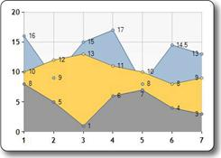 | **Bar chart** 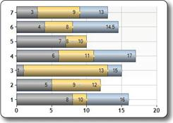 |
| --- | --- |
| **Column chart** 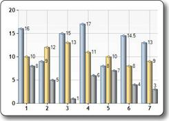 | **Line chart** 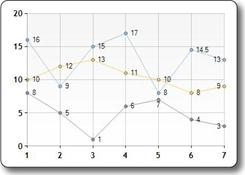 |
| **Pie chart** 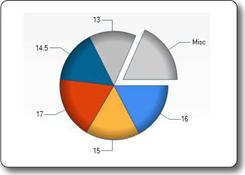 | **Stock chart** 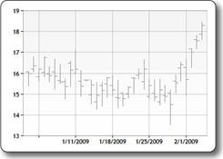 |

### Chart Elements

Charts show data and additional elements like legends, axes, series, and so on. The following picture shows many of the chart elements that you can customize when you use the `Chart` helper. This article shows you how to set some (not all) of these elements.

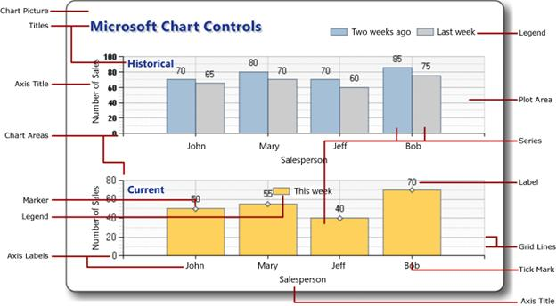

## Creating a Chart from Data

The data you display in a chart can be from an array, from the results returned from a database, or from data that's in an XML file.

### Using an Array

As explained in [Introduction to ASP.NET Web Pages Programming Using the Razor Syntax](https://go.microsoft.com/fwlink/?LinkId=202890), an array lets you store a collection of similar items in a single variable. You can use arrays to contain the data that you want to include in your chart.

This procedure shows how you can create a chart from data in arrays, using the default chart type. It also shows how to display the chart within the page.

1. Create a new file named *ChartArrayBasic.cshtml*.
2. Replace the existing content with the following: 

    [!code-cshtml[Main](7-displaying-data-in-a-chart/samples/sample1.cshtml)]

    The code first creates a new chart and sets its width and height. You specify the chart title by using the `AddTitle` method. To add data, you use the `AddSeries` method. In this example, you use the `name`, `xValue`, and `yValues` parameters of the `AddSeries` method. The `name` parameter is displayed in the chart legend. The `xValue` parameter contains an array of data that's displayed along the horizontal axis of the chart. The `yValues` parameter contains an array of data that's used to plot the vertical points of the chart.

    The `Write` method actually renders the chart. In this case, because you didn't specify a chart type, the `Chart` helper renders its default chart, which is a column chart.
3. Run the page in the browser. The browser displays the chart. 

    

### Using a Database Query for Chart Data

If the information you want to chart is in a database, you can run a database query and then use data from the results to create the chart. This procedure shows you how to read and display the data from the database created in the article [Introduction to Working with a Database in ASP.NET Web Pages Sites](https://go.microsoft.com/fwlink/?LinkId=202893).

1. Add an *App\_Data* folder to the root of the website if the folder does not already exist.
2. In the *App\_Data* folder, add the database file named *SmallBakery.sdf* that's described in [Introduction to Working with a Database in ASP.NET Web Pages Sites](https://go.microsoft.com/fwlink/?LinkId=202893).
3. Create a new file named *ChartDataQuery.cshtml*.
4. Replace the existing content with the following:   

    [!code-cshtml[Main](7-displaying-data-in-a-chart/samples/sample2.cshtml)]

    The code first opens the SmallBakery database and assigns it to a variable named `db`. This variable represents a `Database` object that can be used to read from and write to the database. Next, the code runs a SQL query to get the name and price of each product. The code creates a new chart and passes the database query to it by calling the chart's `DataBindTable` method. This method takes two parameters: the `dataSource` parameter is for the data from the query, and the `xField` parameter lets you set which data column is used for the chart's x-axis.

    As an alternative to using the `DataBindTable` method, you can use the `AddSeries` method of the `Chart` helper. The `AddSeries` method lets you set the `xValue` and `yValues` parameters. For example, instead of using the `DataBindTable` method like this:

    [!code-css[Main](7-displaying-data-in-a-chart/samples/sample3.css)]

    You can use the `AddSeries` method like this:

    [!code-html[Main](7-displaying-data-in-a-chart/samples/sample4.html)]

    Both render the same results. The `AddSeries` method is more flexible because you can specify the chart type and data more explicitly, but the `DataBindTable` method is easier to use if you don't need the extra flexibility.
5. Run the page in a browser. 

    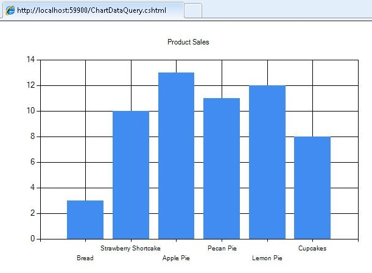

### Using XML Data

The third option for charting is to use an XML file as the data for the chart. This requires that the XML file also have a schema file (*.xsd* file) that describes the XML structure. This procedure shows you how to read data from an XML file.

1. In the *App\_Data* folder, create a new XML file named *data.xml*.
2. Replace the existing XML with the following, which is some XML data about employees in a fictional company. 

    [!code-xml[Main](7-displaying-data-in-a-chart/samples/sample5.xml)]
3. In the *App\_Data* folder, create a new XML file named *data.xsd*. (Note that the extension this time is *.xsd*.)
4. Replace the existing XML with the following: 

    [!code-xml[Main](7-displaying-data-in-a-chart/samples/sample6.xml)]
5. In the root of the website, create a new file named *ChartDataXML.cshtml*.
6. Replace the existing content with the following: 

    [!code-cshtml[Main](7-displaying-data-in-a-chart/samples/sample7.cshtml)]

    The code first creates a `DataSet` object. This object is used to manage the data that's read from the XML file and organize it according to the information in the schema file. (Notice that the top of the code includes the statement `using SystemData`. This is required in order to be able to work with the `DataSet` object. For more information, see [&quot;Using&quot; Statements and Fully Qualified Names](#SB_UsingStatements) later in this article.)

    Next, the code creates a `DataView` object based on the dataset. The data view provides an object that the chart can bind to &#8212; that is, read and plot. The chart binds to the data using the `AddSeries` method, as you saw earlier when charting the array data, except that this time the `xValue` and `yValues` parameters are set to the `DataView` object.

    This example also shows you how to specify a particular chart type. When the data is added in the `AddSeries` method, the `chartType` parameter is also set to display a pie chart.
7. Run the page in a browser. 

    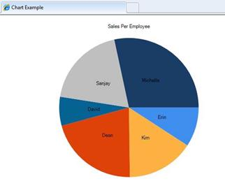

> [!TIP] 
> 
> 
> ### "Using" Statements and Fully Qualified Names
> 
> The .NET Framework that ASP.NET Web Pages with Razor syntax is based on consists of many thousands of components (classes). To make it manageable to work with all these classes, they're organized into *namespaces*, which are somewhat like libraries. For example, the `System.Web` namespace contains classes that support browser/server communication, the `System.Xml` namespace contains classes that are used to create and read XML files, and the `System.Data` namespace contains classes that let you work with data.
> 
> In order to access any given class in the .NET Framework, code needs to know not just the class name, but also the namespace that the class is in. For example, in order to use the `Chart` helper, code needs to find the `System.Web.Helpers.Chart` class, which combines the namespace (`System.Web.Helpers`) with the class name (`Chart`). This is known as the class's *fully-qualified* name &#8212; its complete, unambiguous location within the vastness of the .NET Framework. In code, this would look like the following:
> 
> `var myChart = new System.Web.Helpers.Chart(width: 600, height: 400) // etc.`
> 
> However, it's cumbersome (and error prone) to have to use these long, fully-qualified names every time you want to refer to a class or helper. Therefore, to make it easier to use class names, you can *import* the namespaces you're interested in, which is usually is just a handful from among the many namespaces in the .NET Framework. If you've imported a namespace, you can use just a class name (`Chart`) instead of the fully qualified name (`System.Web.Helpers.Chart`). When your code runs and encounters a class name, it can look in just the namespaces you've imported to find that class.
> 
> When you use ASP.NET Web Pages with Razor syntax to create web pages, you typically use the same set of classes each time, including the `WebPage` class, the various helpers, and so on. To save you the work of importing the relevant namespaces every time you create a website, ASP.NET is configured so it automatically imports a set of core namespaces for every website. That's why you haven't had to deal with namespaces or importing up to now; all the classes you've worked with are in namespaces that are already imported for you.
> 
> However, sometimes you need to work with a class that isn't in a namespace that's automatically imported for you. In that case, you can either use that class's fully-qualified name, or you can manually import the namespace that contains the class. To import a namespace, you use the `using` statement (`import` in Visual Basic), as you saw in an example earlier the article.
> 
> For example, the `DataSet` class is in the `System.Data` namespace. The `System.Data` namespace is not automatically available to ASP.NET Razor pages. Therefore, to work with the `DataSet` class using its fully qualified name, you can use code like this:
> 
> `var dataSet = new System.Data.DataSet();`
> 
> If you have to use the `DataSet` class repeatedly you can import a namespace like this and then use just the class name in code:
> 
> [!code-cshtml[Main](7-displaying-data-in-a-chart/samples/sample8.cshtml)]
> 
> You can add `using` statements for any other .NET Framework namespaces that you want to reference. However, as noted, you won't need to do this often, because most of the classes that you'll work with are in namespaces that are imported automatically by ASP.NET for use in *.cshtml* and *.vbhtml* pages.

## Displaying Charts Inside a Web Page

In the examples you've seen so far, you create a chart and then the chart is rendered directly to the browser as a graphic. In many cases, though, you want to display a chart as part of a page, not just by itself in the browser. To do that requires a two-step process. The first step is to create a page that generates the chart, as you've already seen.

The second step is to display the resulting image in another page. To display the image, you use an HTML `` element, in the same way you would to display any image. However, instead of referencing a *.jpg* or *.png* file, the `` element references the *.cshtml* file that contains the `Chart` helper that creates the chart. When the display page runs, the `` element gets the output of the `Chart` helper and renders the chart.

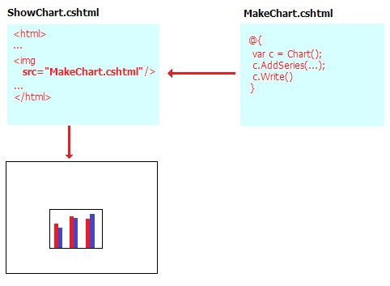

1. Create a file named *ShowChart.cshtml*.
2. Replace the existing content with the following: 

    [!code-html[Main](7-displaying-data-in-a-chart/samples/sample9.html)]

    The code uses the `` element to display the chart that you created earlier in the *ChartArrayBasic.cshtml* file.
3. Run the web page in a browser. The *ShowChart.cshtml* file displays the chart image based on the code contained in the *ChartArrayBasic.cshtml* file.

## Styling a Chart

The `Chart` helper supports a large number of options that let you customize the appearance of the chart. You can set colors, fonts, borders, and so on. An easy way to customize the appearance of a chart is to use a *theme*. Themes are collections of information that specify how to render a chart using fonts, colors, labels, palettes, borders, and effects. (Note that the style of a chart does not indicate the type of chart.)

The following table lists built-in themes.

| Theme | Description |
| --- | --- |
| `Vanilla` | Displays red columns on a white background. |
| `Blue` | Displays blue columns on a blue gradient background. |
| `Green` | Displays blue columns on a green gradient background. |
| `Yellow` | Displays orange columns on a yellow gradient background. |
| `Vanilla3D` | Displays 3-D red columns on a white background. |

You can specify the theme to use when you create a new chart.

1. Create a new file named *ChartStyleGreen.cshtml*.
2. Replace the existing content in the page with the following:

    [!code-cshtml[Main](7-displaying-data-in-a-chart/samples/sample10.cshtml)]

    This code is the same as the earlier example that uses the database for data, but adds the `theme` parameter when it creates the `Chart` object. The following shows the changed code:

    [!code-csharp[Main](7-displaying-data-in-a-chart/samples/sample11.cs)]
3. Run the page in a browser. You see the same data as before, but the chart looks more polished: 

    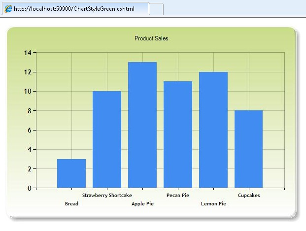

## Saving a Chart

When you use the `Chart` helper as you've seen so far in this article, the helper re-creates the chart from scratch each time it's invoked. If necessary, the code for the chart also re-queries the database or re-reads the XML file to get the data. In some cases, doing this can be a complex operation, such as if the database that you're querying is large, or if the XML file contains a lot of data. Even if the chart doesn't involve a lot of data, the process of dynamically creating an image takes up server resources, and if many people request the page or pages that display the chart, there can be an impact on the performance of your website.

To help you reduce the potential performance impact of creating a chart, you can create a chart the first time you need it and then save it. When the chart is needed again, rather than regenerating it, you can just fetch the saved version and render that.

You can save a chart in these ways:

- Cache the chart in computer memory (on the server).
- Save the chart as an image file.
- Save the chart as an XML file. This option lets you modify the chart before you save it.

### Caching a Chart

After you've created a chart, you can cache it. Caching a chart means that it doesn't have to be re-created if it needs to be displayed again. When you save a chart in the cache, you give it a key that must be unique to that chart.

Charts saved to the cache might be removed if the server runs low on memory. In addition, the cache is cleared if your application restarts for any reason. Therefore, the standard way to work with a cached chart is to always check first whether it's available in the cache, and if not, then to create or re-create it.

1. At the root of your website, create a file named *ShowCachedChart.cshtml*.
2. Replace the existing content with the following: 

    [!code-html[Main](7-displaying-data-in-a-chart/samples/sample12.html)]

    The `` tag includes a `src` attribute that points to the *ChartSaveToCache.cshtml* file and passes a key to the page as a query string. The key contains the value &quot;myChartKey&quot;. The *ChartSaveToCache.cshtml* file contains the `Chart` helper that creates the chart. You'll create this page in a moment.

    At the end of the page there's a link to a page named *ClearCache.cshtml*. That's a page that you'll also create shortly. You need the *ClearCache.cshtml* only to test caching for this example — it's not a link or page that you'd normally include when working with cached charts.
3. At the root of your website, create a new file named *ChartSaveToCache.cshtml*.
4. Replace the existing content with the following:

    [!code-cshtml[Main](7-displaying-data-in-a-chart/samples/sample13.cshtml)]

    The code first checks whether anything was passed as the key value in the query string. If so, the code tries to read a chart out of the cache by calling the `GetFromCache` method and passing it the key. If it turns out that there's nothing in the cache under that key (which would happen the first time that the chart is requested), the code creates the chart as usual. When the chart is finished, the code saves it to the cache by calling `SaveToCache`. That method requires a key (so the chart can be requested later), and the amount of time that the chart should be saved in the cache. (The exact time you'd cache a chart would depend on how often you thought the data it represents might change.) The `SaveToCache` method also requires a `slidingExpiration` parameter &#8212; if this is set to true, the timeout counter is reset each time the chart is accessed. In this case, it in effect means that the chart's cache entry expires 2 minutes after the last time someone accessed the chart. (The alternative to sliding expiration is absolute expiration, meaning that the cache entry would expire exactly 2 minutes after it was put into the cache, no matter how often it had been accessed.)

    Finally, the code uses the `WriteFromCache` method to fetch and render the chart from the cache. Note that this method is outside the `if` block that checks the cache, because it will get the chart from the cache whether the chart was there to begin with or had to be generated and saved in the cache.

    Notice that in the example, the `AddTitle` method includes a timestamp. (It adds the current date and time &#8212; `DateTime.Now` &#8212; to the title.)
5. Create a new page named *ClearCache.cshtml* and replace its content with the following:

    [!code-cshtml[Main](7-displaying-data-in-a-chart/samples/sample14.cshtml)]

    This page uses the `WebCache` helper to remove the chart that's cached in *ChartSaveToCache.cshtml*. As noted earlier, you don't normally have to have a page like this. You're creating it here only to make it easier to test caching.
6. Run the *ShowCachedChart.cshtml* web page in a browser. The page displays the chart image based on the code contained in the *ChartSaveToCache.cshtml* file. Take note of what the timestamp says in the chart title. 

    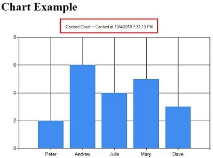
7. Close the browser.
8. Run the *ShowCachedChart.cshtml* again. Notice that the timestamp is the same as before, which indicates that the chart was not regenerated, but was instead read from the cache.
9. In *ShowCachedChart.cshtml*, click the **Clear cache** link. This takes you to *ClearCache.cshtml*, which reports that the cache has been cleared.
10. Click the **Return to ShowCachedChart.cshtml** link, or re-run *ShowCachedChart.cshtml* from WebMatrix. Notice that this time the timestamp has changed, because the cache has been cleared. Therefore, the code had to regenerate the chart and put it back into the cache.

### Saving a Chart as an Image File

You can also save a chart as an image file (for example, as a *.jpg* file) on the server. You can then use the image file the way you would any image. The advantage is the file is stored rather than saved to a temporary cache. You can save a new chart image at different times (for example, every hour) and then keep a permanent record of the changes that occur over time. Note that you must make sure that your web application has permission to save a file to the folder on the server where you want to put the image file.

1. At the root of your website, create a folder named *\_ChartFiles* if it does not already exist.
2. At the root of your website, create a new file named *ChartSave.cshtml*.
3. Replace the existing content with the following:

    [!code-cshtml[Main](7-displaying-data-in-a-chart/samples/sample15.cshtml)]

    The code first checks to see whether the *.jpg* file exists by calling the `File.Exists` method. If the file does not exist, the code creates a new `Chart` from an array. This time, the code calls the `Save` method and passes the `path` parameter to specify the file path and file name of where to save the chart. In the body of the page, an `` element uses the path to point to the *.jpg* file to display.
4. Run the *ChartSave.cshtml* file.
5. Return to WebMatrix. Notice that an image file named *chart01.jpg* has been saved in the *\_ChartFiles* folder.

### Saving a Chart as an XML File

Finally, you can save a chart as an XML file on the server. An advantage of using this method over caching the chart or saving the chart to a file is that you could modify the XML before displaying the chart if you wanted to. Your application has to have read/write permissions for the folder on the server where you want to put the image file.

1. At the root of your website, create a new file named *ChartSaveXml.cshtml*.
2. Replace the existing content with the following:

    [!code-cshtml[Main](7-displaying-data-in-a-chart/samples/sample16.cshtml)]

    This code is similar to the code that you saw earlier for storing a chart in the cache, except that it uses an XML file. The code first checks to see whether the XML file exists by calling the `File.Exists` method. If the file does exist, the code creates a new `Chart` object and passes the file name as the `themePath` parameter. This creates the chart based on whatever's in the XML file. If the XML file doesn't already exist, the code creates a chart like normal and then calls `SaveXml` to save it. The chart is rendered using the `Write` method, as you've seen before.

    As with the page that showed caching, this code includes a timestamp in the chart title.
3. Create a new page named *ChartDisplayXMLChart.cshtml* and add the following markup to it: 

    [!code-html[Main](7-displaying-data-in-a-chart/samples/sample17.html)]
4. Run the *ChartDisplayXMLChart.cshtml* page. The chart is displayed. Take note of the timestamp in the chart's title.
5. Close the browser.
6. In WebMatrix, right-click the *\_ChartFiles* folder, click **Refresh**, and then open the folder. The *XMLChart.xml* file in this folder was created by the `Chart` helper. 

    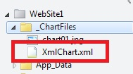
7. Run the *ChartDisplayXMLChart.cshtml* page again. The chart shows the same timestamp as the first time you ran the page. That's because the chart is being generated from the XML you saved earlier.
8. In WebMatrix, open the *\_ChartFiles* folder and delete the *XMLChart.xml* file.
9. Run the *ChartDisplayXMLChart.cshtml* page once more. This time, the timestamp is updated, because the `Chart` helper had to recreate the XML file. If you want, check the *\_ChartFiles* folder and notice that the XML file is back.

## Additional Resources

- [Introduction to Working with a Database in ASP.NET Web Pages Sites](https://go.microsoft.com/fwlink/?LinkId=202893)
- [Using Caching in ASP.NET Web Pages Sites to Improve Performance](https://go.microsoft.com/fwlink/?LinkId=202903)
- [Chart Class](https://msdn.microsoft.com/en-us/library/system.web.helpers.chart(v=vs.99)) (ASP.NET Web Pages API reference on MSDN)