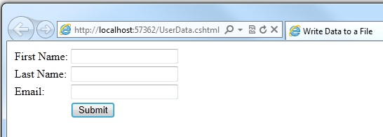

Working with Files in an ASP.NET Web Pages (Razor) Site
====================
by [Tom FitzMacken](https://github.com/tfitzmac)

> This article explains how to read, write, append, delete, and upload files in an ASP.NET Web Pages (Razor) site.
> 
> > [!NOTE]
> > If you want to upload images and manipulate them (for example, flip or resize them), see [Working with Images in an ASP.NET Web Pages Site](https://go.microsoft.com/fwlink/?LinkId=202897).
> 
> 
> **What you'll learn:** 
> 
> - How to create a text file and write data to it.
> - How to append data to an existing file.
> - How to read a file and display from it.
> - How to delete files from a website.
> - How to let users upload one file or multiple files.
> 
> These are the ASP.NET programming features introduced in the article:
> 
> - The `File` object, which provides a way to manage files.
> - The `FileUpload` helper.
> - The `Path` object, which provides methods that let you manipulate path and file names.
>   
> 
> ## Software versions used in the tutorial
> 
> 
> - ASP.NET Web Pages (Razor) 2
> - WebMatrix 2
>   
> 
> This tutorial also works with WebMatrix 3.

## Creating a Text File and Writing Data to It

In addition to using a database in your website, you might work with files. For example, you might use text files as a simple way to store data for the site. (A text file that's used to store data is sometimes called a *flat file*.) Text files can be in different formats, like *.txt*, *.xml*, or *.csv* (comma-delimited values).

If you want to store data in a text file, you can use the `File.WriteAllText` method to specify the file to create and the data to write to it. In this procedure, you'll create a page that contains a simple form with three `input` elements (first name, last name, and email address) and a **Submit** button. When the user submits the form, you'll store the user's input in a text file.

1. Create a new folder named *App\_Data*, if it doesn't exist already.
2. At the root of your website, create a new file named *UserData.cshtml*.
3. Replace the existing content with the following: 

    [!code-cshtml[Main](working-with-files/samples/sample1.cshtml)]

    The HTML markup creates the form with the three text boxes. In the code, you use the `IsPost` property to determine whether the page has been submitted before you start processing.

    The first task is to get the user input and assign it to variables. The code then concatenates the values of the separate variables into one comma-delimited string, which is then stored in a different variable. Notice that the comma separator is a string contained in quotation marks (","), because you're literally embedding a comma into the big string that you're creating. At the end of the data that you concatenate together, you add `Environment.NewLine`. This adds a line break (a newline character). What you're creating with all this concatenation is a string that looks like this:

    [!code-css[Main](working-with-files/samples/sample2.css)]

    (With an invisible line break at the end.)

    You then create a variable (`dataFile`) that contains the location and name of the file to store the data in. Setting the location requires some special handling. In websites, it's a bad practice to refer in code to absolute paths like *C:\Folder\File.txt* for files on the web server. If a website is moved, an absolute path will be wrong. Moreover, for a hosted site (as opposed to on your own computer) you typically don't even know what the correct path is when you're writing the code.

    But sometimes (like now, for writing a file) you do need a complete path. The solution is to use the `MapPath` method of the `Server` object. This returns the complete path to your website. To get the path for the website root, you user the `~` operator (to represen the site's virtual root) to `MapPath`. (You can also pass a subfolder name to it, like *~/App\_Data/*, to get the path for that subfolder.) You can then concatenate additional information onto whatever the method returns in order to create a complete path. In this example, you add a file name. (You can read more about how to work with file and folder paths in [Introduction to ASP.NET Web Pages Programming Using the Razor Syntax](https://go.microsoft.com/fwlink/?LinkId=195205#ID_WorkingWithFileAndFolderPaths).)

    The file is saved in the *App\_Data* folder. This folder is a special folder in ASP.NET that's used to store data files, as described in [Introduction to Working with a Database in ASP.NET Web Pages Sites](https://go.microsoft.com/fwlink/?LinkId=195209).

    The `WriteAllText` method of the `File` object writes the data to the file. This method takes two parameters: the name (with path) of the file to write to, and the actual data to write. Notice that the name of the first parameter has an `@` character as a prefix. This tells ASP.NET that you're providing a verbatim string literal, and that characters like "/" should not be interpreted in special ways. (For more information, see [Introduction to ASP.NET Web Programming Using the Razor Syntax](https://go.microsoft.com/fwlink/?LinkId=195205#ID_WorkingWithFileAndFolderPaths).)

    > [!NOTE]
    > In order for your code to save files in the *App\_Data* folder, the application needs read-write permissions for that folder. On your development computer this is not typically an issue. However, when you publish your site to a hosting provider's web server, you might need to explicitly set those permissions. If you run this code on a hosting provider's server and get errors, check with the hosting provider to find out how to set those permissions.

- Run the page in a browser. 

    
- Enter values into the fields and then click **Submit**.
- Close the browser.
- Return to the project and refresh the view.
- Open the *data.txt* file. The data you submitted in the form is in the file. 

    ![[image]](working-with-files/_static/image2.jpg)
- Close the *data.txt* file.

## Appending Data to an Existing File

In the previous example, you used `WriteAllText` to create a text file that's got just one piece of data in it. If you call the method again and pass it the same file name, the existing file is completely overwritten. However, after you've created a file you often want to add new data to the end of the file. You can do that using the `AppendAllText` method of the `File` object.

1. In the website, make a copy of the *UserData.cshtml* file and name the copy *UserDataMultiple.cshtml*.
2. Replace the code block before the opening `<!DOCTYPE html>` tag with the following code block: 

    [!code-cshtml[Main](working-with-files/samples/sample3.cshtml)]

    This code has one change in it from the previous example. Instead of using `WriteAllText`, it uses `the AppendAllText` method. The methods are similar, except that `AppendAllText` adds the data to the end of the file. As with `WriteAllText`, `AppendAllText` creates the file if it doesn't already exist.
3. Run the page in a browser.
4. Enter values for the fields and then click **Submit**.
5. Add more data and submit the form again.
6. Return to your project, right-click the project folder, and then click **Refresh**.
7. Open the *data.txt* file. It now contains the new data that you just entered. 

    ![[image]](working-with-files/_static/image3.jpg)

## Reading and Displaying Data from a File

Even if you don't need to write data to a text file, you'll probably sometimes need to read data from one. To do this, you can again use the `File` object. You can use the `File` object to read each line individually (separated by line breaks) or to read individual item no matter how they're separated.

This procedure shows you how to read and display the data that you created in the previous example.

1. At the root of your website, create a new file named *DisplayData.cshtml*.
2. Replace the existing content with the following: 

    [!code-cshtml[Main](working-with-files/samples/sample4.cshtml)]

    The code starts by reading the file that you created in the previous example into a variable named `userData`, using this method call:

    [!code-css[Main](working-with-files/samples/sample5.css)]

    The code to do this is inside an `if` statement. When you want to read a file, it's a good idea to use the `File.Exists` method to determine first whether the file is available. The code also checks whether the file is empty.

    The body of the page contains two `foreach` loops, one nested inside the other. The outer `foreach` loop gets one line at a time from the data file. In this case, the lines are defined by line breaks in the file &#8212; that is, each data item is on its own line. The outer loop creates a new item (`<li>` element) inside an ordered list (`<ol>` element).

    The inner loop splits each data line into items (fields) using a comma as a delimiter. (Based on the previous example, this means that each line contains three fields &#8212; the first name, last name, and email address, each separated by a comma.) The inner loop also creates a `<ul>` list and displays one list item for each field in the data line.

    The code illustrates how to use two data types, an array and the `char` data type. The array is required because the `File.ReadAllLines` method returns data as an array. The `char` data type is required because the `Split` method returns an `array` in which each element is of the type `char`. (For information about arrays, see [Introduction to ASP.NET Web Programming Using the Razor Syntax](https://go.microsoft.com/fwlink/?LinkId=202890#ID_CollectionsAndObjects).)
3. Run the page in a browser. The data you entered for the previous examples is displayed. 

    ![[image]](working-with-files/_static/image4.jpg)

> [!TIP] 
> 
> **Displaying Data from a Microsoft Excel Comma-Delimited File**
> 
> You can use Microsoft Excel to save the data contained in a spreadsheet as a comma-delimited file (*.csv* file). When you do, the file is saved in plain text, not in Excel format. Each row in the spreadsheet is separated by a line break in the text file, and each data item is separated by a comma. You can use the code shown in the previous example to read an Excel comma-delimited file just by changing the name of the data file in your code.

## Deleting Files

To delete files from your website, you can use the `File.Delete` method. This procedure shows how to let users delete an image (*.jpg* file) from an *images* folder if they know the name of the file.

> [!NOTE] 
> 
> **Important** In a production website, you typically restrict who's allowed to make changes to the data. For information about how to set up membership and about ways to authorize users to perform tasks on the site, see [Adding Security and Membership to an ASP.NET Web Pages Site](https://go.microsoft.com/fwlink/?LinkId=202904).

1. In the website, create a subfolder named *images*.
2. Copy one or more *.jpg* files into the *images* folder.
3. In the root of the website, create a new file named *FileDelete.cshtml*.
4. Replace the existing content with the following: 

    [!code-cshtml[Main](working-with-files/samples/sample6.cshtml)]

    This page contains a form where users can enter the name of an image file. They don't enter the *.jpg* file-name extension; by restricting the file name like this, you help prevents users from deleting arbitrary files on your site.

    The code reads the file name that the user has entered and then constructs a complete path. To create the path, the code uses the current website path (as returned by the `Server.MapPath` method), the *images* folder name, the name that the user has provided, and ".jpg" as a literal string.

    To delete the file, the code calls the `File.Delete` method, passing it the full path that you just constructed. At the end of the markup, code displays a confirmation message that the file was deleted.
5. Run the page in a browser. 

    ![[image]](working-with-files/_static/image5.jpg)
6. Enter the name of the file to delete and then click **Submit**. If the file was deleted, the name of the file is displayed at the bottom of the page.

## Letting Users Upload a File

The `FileUpload` helper lets users upload files to your website. The procedure below shows you how to let users upload a single file.

1. Add the ASP.NET Web Helpers Library to your website as described in [Installing Helpers in an ASP.NET Web Pages Site](https://go.microsoft.com/fwlink/?LinkId=252372), if you didn't add it previously.
2. In the *App\_Data* folder, create a new a folder and name it *UploadedFiles*.
3. In the root, create a new file named *FileUpload.cshtml*.
4. Replace the existing content in the page with the following: 

    [!code-cshtml[Main](working-with-files/samples/sample7.cshtml)]

    The body portion of the page uses the `FileUpload` helper to create the upload box and buttons that you're probably familiar with:

    ![[image]](working-with-files/_static/image6.jpg)

    The properties that you set for the `FileUpload` helper specify that you want a single box for the file to upload and that you want the submit button to read **Upload**. (You'll add more boxes later in the article.)

    When the user clicks **Upload**, the code at the top of the page gets the file and saves it. The `Request` object that you normally use to get values from form fields also has a `Files` array that contains the file (or files) that have been uploaded. You can get individual files out of specific positions in the array &#8212; for example, to get the first uploaded file, you get `Request.Files[0]`, to get the second file, you get `Request.Files[1]`, and so on. (Remember that in programming, counting usually starts at zero.)

    When you fetch an uploaded file, you put it in a variable (here, `uploadedFile`) so that you can manipulate it. To determine the name of the uploaded file, you just get its `FileName` property. However, when the user uploads a file, `FileName` contains the user's original name, which includes the entire path. It might look like this:

    *C:\Users\Public\Sample.txt*

    You don't want all that path information, though, because that's the path on the user's computer, not for your server. You just want the actual file name (*Sample.txt*). You can strip out just the file from a path by using the `Path.GetFileName` method, like this:

    [!code-csharp[Main](working-with-files/samples/sample8.cs)]

    The `Path` object is a utility that has a number of methods like this that you can use to strip paths, combine paths, and so on.

    Once you've gotten the name of the uploaded file, you can build a new path for where you want to store the uploaded file in your website. In this case, you combine `Server.MapPath`, the folder names (*App\_Data/UploadedFiles*), and the newly stripped file name to create a new path. You can then call the uploaded file's `SaveAs` method to actually save the file.
5. Run the page in a browser. 

    ![[image]](working-with-files/_static/image7.jpg)
6. Click **Browse** and then select a file to upload. 

    ![[image]](working-with-files/_static/image8.jpg)

    The text box next to the **Browse** button will contain the path and file location.

    ![[image]](working-with-files/_static/image9.jpg)
7. Click **Upload**.
8. In the website, right-click the project folder and then click **Refresh**.
9. Open the *UploadedFiles* folder. The file that you uploaded is in the folder. 

    ![[image]](working-with-files/_static/image10.jpg)

## Letting Users Upload Multiple Files

In the previous example, you let users upload one file. But you can use the `FileUpload` helper to upload more than one file at a time. This is handy for scenarios like uploading photos, where uploading one file at a time is tedious. (You can read about uploading photos in [Working with Images in an ASP.NET Web Pages Site](https://go.microsoft.com/fwlink/?LinkId=202897).) This example shows how to let users upload two at a time, although you can use the same technique to upload more than that.

1. Add the ASP.NET Web Helpers Library to your website as described in [Installing Helpers in an ASP.NET Web Pages Site](https://go.microsoft.com/fwlink/?LinkId=252372), if you haven't already.
2. Create a new page named *FileUploadMultiple.cshtml*.
3. Replace the existing content in the page with the following:  

    [!code-cshtml[Main](working-with-files/samples/sample9.cshtml)]

    In this example, the `FileUpload` helper in the body of the page is configured to let users upload two files by default. Because `allowMoreFilesToBeAdded` is set to `true`, the helper renders a link that lets user add more upload boxes:

    ![[image]](working-with-files/_static/image11.jpg)

    To process the files that the user uploads, the code uses the same basic technique that you used in the previous example &#8212; get a file from `Request.Files` and then save it. (Including the various things you need to do to get the right file name and path.) The innovation this time is that the user might be uploading multiple files and you don't know many. To find out, you can get `Request.Files.Count`.

    With this number in hand, you can loop through `Request.Files`, fetch each file in turn, and save it. When you want to loop a known number of times through a collection, you can use a `for` loop, like this:

    [!code-csharp[Main](working-with-files/samples/sample10.cs)]

    The variable `i` is just a temporary counter that will go from zero to whatever upper limit you set. In this case, the upper limit is the number of files. But because the counter starts at zero, as is typical for counting scenarios in ASP.NET, the upper limit is actually one less than the file count. (If three files are uploaded, the count is zero to 2.)

    The `uploadedCount` variable totals all the files that are successfully uploaded and saved. This code accounts for the possibility that an expected file may not be able to be uploaded.
4. Run the page in a browser. The browser displays the page and its two upload boxes.
5. Select two files to upload.
6. Click **Add another file**. The page displays a new upload box. 

    ![[image]](working-with-files/_static/image12.jpg)
7. Click **Upload**.
8. In the website, right-click the project folder and then click **Refresh**.
9. Open the *UploadedFiles* folder to see the successfully uploaded files.

## Additional Resources

[Working with Images in an ASP.NET Web Pages Site](https://go.microsoft.com/fwlink/?LinkId=202897)

[Exporting to a CSV File](https://msdn.microsoft.com/en-us/library/ms155919.aspx)