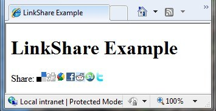
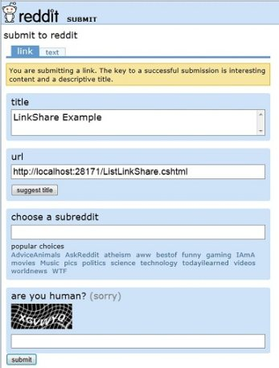
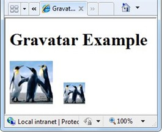
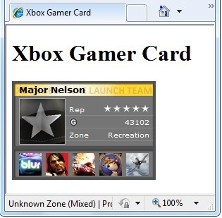

Adding Social Networking to ASP.NET Web Pages (Razor) Sites
====================
by [Tom FitzMacken](https://github.com/tfitzmac)

> This article explains how to add social networking links for Facebook, Twitter, Reddit, and Digg to pages in an ASP.NET Web Pages (Razor) website, and how to include Twitter feeds, Xbox gamer cards, and Gravatar images.
> 
> What you'll learn:
> 
> - How to let people bookmark/link your site.
> - How to add a Twitter feed.
> - How to add a Facebook **Like** button to pages.
> - How to render Gravatar.com images.
> - How to display an Xbox gamer card on your site.
>   
> 
> ## Software versions used in the tutorial
> 
> 
> - ASP.NET Web Pages (Razor) 2
> - ASP.NET Web Helper Library (NuGet package)
>   
> 
> This tutorial also works with ASP.NET Web Pages 3, except for parts that use the ASP.NET Web Helper Library.

## Linking Your Website on Social Networking Sites

If people like something on your site, they often want to share it with friends. You can make this easy by displaying glyphs (icons) that people can click to share a page on Digg, Reddit, Facebook, Twitter, or similar sites.

To display these glyphs, add the `LinkSharecode` helper to a page. People who visit your page can click an individual glyph. If they have an account with that social networking site, they can then post a link to your page on that site.

1. Add the ASP.NET Web Helpers Library to your website as described in [Installing Helpers in an ASP.NET Web Pages Site](https://go.microsoft.com/fwlink/?LinkId=252372), if you haven't already added it.- Create a page named *ListLinkShare.cshtml* and add the following markup:

    [!code-cshtml[Main](13-adding-social-networking-to-your-web-site/samples/sample1.cshtml)]

    In this example, when the `LinkShare` helper runs, the page title is passed as a parameter, which in turn passes the page title to the social networking site. However, you could pass in any string you want. This example also specifies which social networking sites to include in the list. You can specify the social networking sites that are relevant to your site.
- Run the *ListLinkShare.cshtml* page in a browser. (Make sure the page is selected in the **Files** workspace before you run it.)
- Click a glyph for one of the sites that you're signed up for. The link takes you to the page on the selected social network site where you can share a link. For example, if you click the Reddit link, you're taken to the `submit to reddit` page on the Reddit website.

    

## Adding a Twitter Feed

For information about using a Twitter helper that is compatible with the current version of the Twitter API, see [Twitter helper](../ui-layouts-and-themes/twitter-helper.md). This example shows how to write your own helper so you can easily reuse the code from many pages.

## Displaying a Facebook &quot;Like&quot; Button

In some cases, your best option is to get the code directly from the social networking provider rather than relying on a helper. This is especially true if the social network provider updates its options more quickly than the helper is updated.

To add Facebook features (such as the Like button) to your site, you can retrieve code snippets from the [developers.facebook.com](https://developers.facebook.com/) site. On the Facebook site, you use their tools to generate a code snippet that is relevant to your site.

The following highlighted code is the code that was retrieved from the Like Button tool on the developers.facebook.com site. You must provide your own app ID.

[!code-html[Main](13-adding-social-networking-to-your-web-site/samples/sample2.html?highlight=7-14,16-17)]

## Rendering a Gravatar Image

A *Gravatar* (a &quot;globally recognized avatar&quot;) is an image that can be used on multiple websites as your avatar &#8212; that is, an image that represents you. For example, a Gravatar can identify a person in a forum post, in a blog comment, and so on. (You can register your own Gravatar at the Gravatar website at [http://www.gravatar.com/](http://www.gravatar.com/).) If you want to display images next to people's names or email addresses on your website, you can use the Gravatar helper.

In this example, you're using a single Gravatar that represents yourself. Another way to use a Gravatar is to let people specify their Gravatar address when they register on your site. (You can learn how to let people register in [Adding Security and Membership to an ASP.NET Web Pages Site](https://go.microsoft.com/fwlink/?LinkId=202904).) Then whenever you display information for that user, you can just add the Gravatar to where you display the user's name.

1. Add the ASP.NET Web Helpers Library to your website as described in [Installing Helpers in an ASP.NET Web Pages Site](https://go.microsoft.com/fwlink/?LinkId=252372), if you haven't already.
2. Create a new web page named *Gravatar.cshtml*.
3. Add the following markup to the file: 

    [!code-cshtml[Main](13-adding-social-networking-to-your-web-site/samples/sample3.cshtml)]

    The `Gravatar.GetHtml` method displays the Gravatar image on the page. To change the size of the image, you can include a number as a second parameter. The default size is 80. Numbers less than 80 make the image smaller. Numbers greater than 80 make the image larger.
4. In the `Gravatar.GetHtml` methods, replace `<Your Gravatar account here>` with the email address that you use for your Gravatar account. (If you don't have a Gravatar account, you can use the email address of someone who does.)
5. Run the page in your browser. The page displays two Gravatar images for the email address you specified. The second image is smaller than the first. 

    

## Displaying an Xbox Gamer Card

When people play Microsoft Xbox games online, each user has a unique ID. Statistics are kept for each player in the form of a gamer card, which shows their reputation, gamer score, and recently played games. If you're an Xbox gamer, you can show your gamer card on pages in your site by using the `GamerCard` helper.

1. Add the ASP.NET Web Helpers Library to your website as described in [Installing Helpers in an ASP.NET Web Pages Site](https://go.microsoft.com/fwlink/?LinkId=252372), if you haven't already.
2. Create a new page named *XboxGamer.cshtml* and add the following markup.

    [!code-cshtml[Main](13-adding-social-networking-to-your-web-site/samples/sample4.cshtml)]

    You use the `GamerCard.GetHtml` property to specify the alias for the gamer card to be displayed.
3. Run the page in your browser. The page displays the Xbox gamer card that you specified.

    