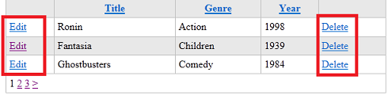
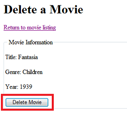

Introducing ASP.NET Web Pages - Deleting Database Data
====================
by [Tom FitzMacken](https://github.com/tfitzmac)

> This tutorial shows you how to delete an individual database entry. It assumes you have completed the series through [Updating Database Data in ASP.NET Web Pages](https://go.microsoft.com/fwlink/?LinkId=251583).
> 
> What you'll learn:
> 
> - How to select an individual record from a listing of records.
> - How to delete a single record from a database.
> - How to check that a specific button was clicked in a form.
>   
> 
> Features/technologies discussed:
> 
> - The `WebGrid` helper.
> - The SQL `Delete` command.
> - The `Database.Execute` method to run a SQL `Delete` command.

## What You'll Build

In the previous tutorial, you learned how to update an existing database record. This tutorial is similar, except that instead of updating the record, you'll delete it. The processes are much the same, except that deleting is simpler, so this tutorial will be short.

In the *Movies* page, you'll update the `WebGrid` helper so that it displays a **Delete** link next to each movie to accompany the **Edit** link you added earlier.

As with editing, when you click the **Delete** link, it takes you to a different page, where the movie information is already in a form:

You can then click the button to delete the record permanently.

## Adding a Delete Link to the Movie Listing

You'll start by adding a **Delete** link to the `WebGrid` helper. This link is similar to the **Edit** link you added in a previous tutorial.

Open the *Movies.cshtml* file.

Change the `WebGrid` markup in the body of the page by adding a column. Here's the modified markup:

[!code-html[Main](deleting-data/samples/sample1.html?highlight=9-10)]

The new column is this one:

[!code-html[Main](deleting-data/samples/sample2.html)]

The way the grid is configured, the **Edit** column is leftmost in the grid and the **Delete** column is rightmost. (There's a comma after the `Year` column now, in case you didn't notice that.) There's nothing special about where these link columns go, and you could as easily put them next to each other. In this case, they're separate to make them harder to get mixed up.

The new column shows a link (`<a>` element) whose text says "Delete". The target of the link (its `href` attribute) is code that ultimately resolves to something like this URL, with the `id` value different for each movie:

[!code-css[Main](deleting-data/samples/sample3.css)]

This link will invoke a page named *DeleteMovie* and pass it the ID of the movie you've selected.

This tutorial won't go into detail about how this link is constructed, because it's almost identical to the **Edit** link from the previous tutorial ([Updating Database Data in ASP.NET Web Pages](https://go.microsoft.com/fwlink/?LinkId=251583)).

## Creating the Delete Page

Now you can create the page that will be the target for the **Delete** link in the grid.

> [!NOTE] 
> 
> **Important** The technique of first selecting a record to delete and then using a separate page and button to confirm the process is extremely important for security. As you've read in previous tutorials, making *any* sort of change to your website should *always* be done using a form &mdash; that is, using an HTTP POST operation. If you made it possible to change the site just by clicking a link (that is, using a GET operation), people could make simple requests to your site and delete your data. Even a search-engine crawler that's indexing your site could inadvertently delete data just by following links.
> 
> When your app lets people change a record, you have to present the record to the user for editing anyway. But you might be tempted to skip this step for deleting a record. Don't skip that step, though. (It's also helpful for users to see the record and confirm that they're deleting the record that they intended.)
> 
> In a subsequent tutorial set, you'll see how to add login functionality so a user would have to log in before deleting a record.

Create a page named *DeleteMovie.cshtml* and replace what's in the file with the following markup:

[!code-cshtml[Main](deleting-data/samples/sample4.cshtml)]

This markup is like the *EditMovie* pages, except that instead of using text boxes (`<input type="text">`), the markup includes `` elements. There's nothing here to edit. All you have to do is display the movie details so that users can make sure that they're deleting the right movie.

The markup already contains a link that lets the user return to the movie listing page.

As in the *EditMovie* page, the ID of the selected movie is stored in a hidden field. (It's passed into the page in the first place as a query string value.) There's an `Html.ValidationSummary` call that will display validation errors. In this case, the error might be that no movie ID was passed to the page or that the movie ID is invalid. This situation could occur if someone ran this page without first selecting a movie in the *Movies* page.

The button caption is **Delete Movie**, and its name attribute is set to `buttonDelete`. The `name` attribute will be used in the code to identify the button that submitted the form.

You'll have to write code to 1) read the movie details when the page is first displayed and 2) actually delete the movie when the user clicks the button.

## Adding Code to Read a Single Movie

At the top of the *DeleteMovie.cshtml* page, add the following code block:

[!code-cshtml[Main](deleting-data/samples/sample5.cshtml)]

This markup is the same as the corresponding code in the *EditMovie* page. It gets the movie ID out of the query string and uses the ID to read a record from the database. The code includes the validation test (`IsInt()` and `row != null`) to make sure that the movie ID being passed to the page is valid.

Remember that this code should only run the first time the page runs. You don't want to re-read the movie record from the database when the user clicks the **Delete Movie** button. Therefore, code to read the movie is inside a test that says `if(!IsPost)` &mdash; that is, *if the request is not a post operation (form submission)*.

## Adding Code to Delete the Selected Movie

To delete the movie when the user clicks the button, add the following code just inside the closing brace of the `@` block:

[!code-csharp[Main](deleting-data/samples/sample6.cs)]

This code is similar to the code for updating an existing record, but simpler. The code basically runs a SQL `Delete` statement.

 As in the *EditMovie* page, the code is in an `if(IsPost)` block. This time, the `if()` condition is a little more complicated: 

[!code-csharp[Main](deleting-data/samples/sample7.cs)]

There are two conditions here. The first is that the page is being submitted, as you've seen before &mdash; `if(IsPost)`.

The second condition is `!Request["buttonDelete"].IsEmpty()`, meaning that the request has an object named `buttonDelete`. Admittedly, it's an indirect way of testing which button submitted the form. If a form contains multiple submit buttons, only the name of the button that was clicked appears in the request. Therefore, logically, if the name of a particular button appears in the request &mdash; or as stated in the code, if that button isn't empty &mdash; that's the button that submitted the form.

The `&&` operator means "and" (logical AND). Therefore the entire `if` condition is ...

*This request is a post (not a first-time request)*  
  
 AND  
  
*The* `buttonDelete`*button was the button that submitted the form.*

This form (in fact, this page) contains only one button, so the additional test for `buttonDelete` is technically not required. Still, you're about to perform an operation that will permanently remove data. So you want to be as sure as possible that you're performing the operation only when the user has explicitly requested it. For example, suppose that you expanded this page later and added other buttons to it. Even then, the code that deletes the movie will run only if the `buttonDelete` button was clicked.

As in the *EditMovie* page, you get the ID from the hidden field and then run the SQL command. The syntax for the `Delete` statement is:

`DELETE FROM table WHERE ID = value`

It's vital to include the `WHERE` clause and the ID. If you leave out the WHERE clause, *all the records in the table will be deleted*. As you have seen, you pass the ID value to the SQL command by using a placeholder.

## Testing the Movie Delete Process

Now you can test. Run the *Movies* page, and click **Delete** next to a movie. When the *DeleteMovie* page appears, click **Delete Movie**.

When you click the button, the code deletes the movies and returns to the movie listing. There you can search for the deleted movie and confirm that it's been deleted.

## Coming Up Next

The next tutorial shows you how to give all the pages on your site a common look and layout.

## Complete Listing for Movie Page (Updated with Delete Links)

[!code-cshtml[Main](deleting-data/samples/sample8.cshtml)]

## Complete Listing for DeleteMovie Page

[!code-cshtml[Main](deleting-data/samples/sample9.cshtml)]

## Additional Resources

- [Introduction to ASP.NET Web Programming by Using the Razor Syntax](https://go.microsoft.com/fwlink/?LinkID=202890)
- [SQL DELETE Statement](http://www.w3schools.com/sql/sql_delete.asp) on the W3Schools site

>[!div class="step-by-step"]
[Previous](updating-data.md)
[Next](layouts.md)