Introducing ASP.NET Web Pages - Displaying Data
====================
by [Tom FitzMacken](https://github.com/tfitzmac)

> This tutorial shows you how to create a database in WebMatrix and how to display database data in a page when you use ASP.NET Web Pages (Razor). It assumes you have completed the series through [Introduction to ASP.NET Web Pages Programming](../introducing-razor-syntax-c.md).
> 
> What you'll learn:
> 
> - How to use WebMatrix tools to create a database and database tables.
> - How to use WebMatrix tools to add data to a database.
> - How to display data from the database on a page.
> - How to run SQL commands in ASP.NET Web Pages.
> - How to customize the `WebGrid` helper to change the data display and to add paging and sorting.
>   
> 
> Features/technologies discussed:
> 
> - WebMatrix database tools.
> - `WebGrid` helper.

## What You'll Build

In the previous tutorial, you were introduced to ASP.NET Web Pages (*.cshtml* files), to the basics of Razor syntax, and to helpers. In this tutorial, you'll begin creating the actual web application that you'll use for the rest of the series. The app is a simple movie application that lets you view, add, change, and delete information about movies.

When you're done with this tutorial, you'll be able to view a movie listing that looks like this page:

But to begin, you have to create a database.

## A Very Brief Introduction to Databases

This tutorial will provide only the briefest introduction to databases. If you have database experience, you can skip this short section.

A database contains one or more tables that contain information &mdash; for example, tables for customers, orders, and vendors, or for students, teachers, classes, and grades. Structurally, a database table is like a spreadsheet. Imagine a typical address book. For each entry in the address book (that is, for each person) you have several pieces of information such as first name, last name, address, email address, and phone number.

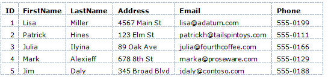

(Rows are sometimes referred to as *records*, and columns are sometimes referred to as *fields*.)

For most database tables, the table has to have a column that contains a unique value, like a customer number, account number, and so on. This value is known as the table's *primary key*, and you use it to identify each row in the table. In the example, the ID column is the primary key for the address book shown in the previous example.

Much of the work you do in web applications consists of reading information out of the database and displaying it on a page. You'll also often gather information from users and add it to a database, or you'll modify records that are already in the database. (We'll cover all of these operations in the course of this tutorial set.)

Database work can be enormously complex and can require specialized knowledge. For this tutorial set, though, you have to understand only basic concepts, which will all be explained as you go.

## Creating a Database

WebMatrix includes tools that make it easy to create a database and to create tables in the database. (The structure of a database is referred to as the database's *schema*.) For this tutorial set, you'll create a database that has only one table in it &mdash; Movies.

Open WebMatrix if you haven't already done so, and open the WebPagesMovies site that you created in the previous tutorial.

In the left pane, click the **Database** workspace.

The ribbon changes to show database-related tasks. In the ribbon, click **New Database**.

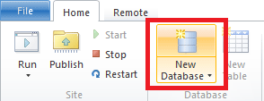

WebMatrix creates a SQL Server CE database (an *.sdf* file) that has the same name as your site &mdash; *WebPagesMovies.sdf*. (You won't do this here, but you can rename the file to anything you like, as long as it has an *.sdf* extension.)

## Creating a Table

In the ribbon, click **New Table**. WebMatrix opens the table designer in a new tab. (If the New Table option isn't available, make sure that the new database is selected in the tree view on the left.)

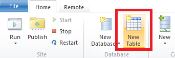

In the text box at the top (where the watermark says "Enter table name"), enter "Movies".

The pane underneath the table name is where you define individual columns. For the *Movies* table in this tutorial, you'll create only a few columns: *ID*, *Title*, *Genre*, and *Year*.

In the **Name** box, enter "ID". Entering a value here activates all the controls for the new column.

Tab to the **Data Type** list and choose **int**. This value specifies that the ID column will contain integer (number) data.

> [!NOTE]
> We won't call it out any more here (much), but you can use standard Windows keyboard gestures to navigate in this grid. For example, you can tab between fields, you can just start typing in order to select an item in a list, and so on.

Tab past the **Default Value** box (that is, leave it blank). Tab to the **Is Primary Key** check box and select it. This option tells the database that the *ID* column will contain the data that identifies individual rows. (That is, each row will have a unique value in the ID column that you can use to find that row.)

Choose the **Is Identity** option. This option tells the database that it should automatically generate the next sequential number for each new row. (The **Is Identity** option works only if you've also selected the **Is Primary Key** option.)

Click in the next grid row, or press Tab twice to finish the current row. Either gesture saves the current row and starts the next one. Notice that the **Default Value** column now says **Null**. (Null is the default value for the default value, so to speak.)

When you've finished defining the new **ID** column, the designer will look like this illustration:

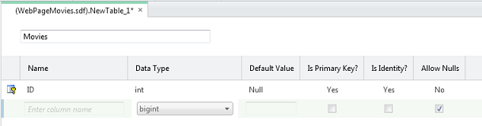

To create the next column, click in the box in the **Name** column. Enter "Title" for the column and then select **nvarchar** for the **Data Type** value. The "var" part of **nvarchar** tells the database that the data for this column will be a string whose size might vary from record to record. (The "n" prefix represents "national," which indicates that the field can hold character data for any alphabet or writing system — that is, the field holds Unicode data.)

When you choose **nvarchar**, another box appears where you can enter the maximum length for the field. Enter 50, on the assumption that no movie title that you'll work with in this tutorial will be longer than 50 characters.

Skip **Default Value** and clear the **Allow Nulls** option. You don't want the database to allow any movies to be entered into the database that don't have a title.

When you're done and move to the next row, the designer looks like this illustration:

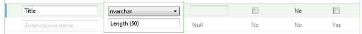

Repeat these steps to create a column named "Genre", except for the length, set it to just 30.

Create another column named "Year." For the data type, choose **nchar** (not **nvarchar**) and set the length to 4. For the year, you're going to use a 4-digit number like "1995" or "2010", so you don't require a variable-sized column.

Here's what the finished design looks like:

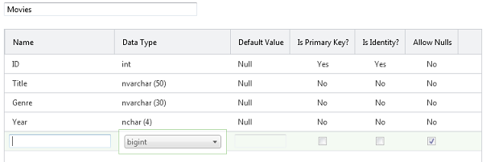

Press Ctrl+S or click the **Save** button in the Quick Access toolbar. Close the database designer by closing the tab.

## Adding Some Example Data

Later in this tutorial series you'll create a page where you can enter new movies in a form. For now, however, you can add some example data that you can then display on a page.

In the **Database** workspace in WebMatrix, notice that there's a tree that shows you the *.sdf* file you created earlier. Open the node for your new *.sdf* file, and then open the **Tables** node.

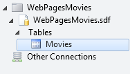

Right-click the **Movies** node and then choose **Data**. WebMatrix opens a grid where you can enter data for the *Movies* table:

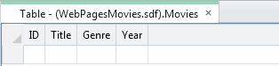

Click the **Title** column and enter "When Harry Met Sally". Move to the **Genre** column (you can use the Tab key) and enter "Romantic Comedy". Move to the **Year** column and enter "1989":

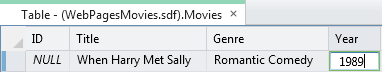

Press Enter, and WebMatrix saves the new movie. Notice that the **ID** column has been filled in.

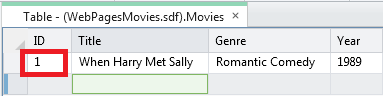

Enter another movie (for example, "Gone with the Wind", "Drama", "1939"). The ID column is filled in again:

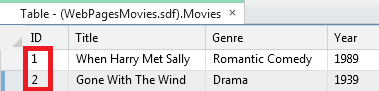

Enter a third movie (for example, "Ghostbusters", "Comedy"). As an experiment, leave the **Year** column blank and then press Enter. Because you unselected the **Allow Nulls** option, the database shows an error:

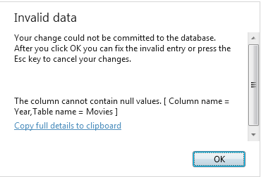

Click **OK** to go back and fix the entry (the year for "Ghostbusters" is 1984), and then press Enter.

Fill in several movies until you have 8 or so. (Entering 8 makes it easier to work with paging later. But if that's too many, enter just a few for now.) The actual data doesn't matter.

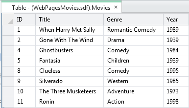

If you entered all the movies without any errors, the ID values are sequential. If you tried to save an incomplete movie record, the ID numbers might not be sequential. If so, that's okay. The numbers don't have any inherent meaning, and the only thing that's important is that they're unique in the *Movies* table.

Close the tab that contains the database designer.

Now you can turn to displaying this data on a web page.

## Displaying Data in a Page by Using the WebGrid Helper

To display data in a page, you're going to use the `WebGrid` helper. This helper produces a display in a grid or table (rows and columns). As you'll see, you'll be able refine the grid with formatting and other features.

To run the grid, you'll have to write a few lines of code. These few lines will serve as a kind of pattern for almost all of the data access that you do in this tutorial.

> [!NOTE]
> You actually have many options for displaying data on a page; the `WebGrid` helper is just one. We chose it for this tutorial because it's the easiest way to display data and because it's reasonably flexible. In the next tutorial set, you'll see how to use a more "manual" way to work with data in the page, which gives you more direct control over how to display the data.

In the left pane in WebMatrix, click the **Files** workspace.

The new database you created is in the *App\_Data* folder. If the folder didn't already exist, WebMatrix created it for your new database. (The folder might have existed if you'd previously installed helpers.)

In the tree view, select the root of the website. You must select the root of the website; otherwise, the new file might be added to the App\_Data folder.

In the ribbon, click **New**. In the **Choose a File Type** box, choose **CSHTML**.

In the **Name** box, name the new page "Movies.cshtml":

Click the **OK** button. WebMatrix opens a new file with some skeleton elements in it. First you'll write some code to go get the data from the database. Then you'll add markup to the page to actually display the data.

### Writing the Data Query Code

At the top of the page, between the `@{` and `}` characters, enter the following code. (Make sure that you enter this code between the opening and closing braces.)

[!code-csharp[Main](displaying-data/samples/sample1.cs)]

The first line opens the database that you created earlier, which is always the first step before doing something with the database. You tell the `Database.Open` method name of the database to open. Notice that you don't include *.sdf* in the name. The `Open` method assumes that it's looking for an *.sdf* file (that is, *WebPagesMovies.sdf*) and that the *.sdf* file is in the *App\_Data* folder. (Earlier we noted that the *App\_Data* folder is reserved; this scenario is one of the places where ASP.NET makes assumptions about that name.)

When the database is opened, a reference to it is put into the variable named `db`. (Which could be named anything.) The `db` variable is how you'll end up interacting with the database.

The second line actually fetches the database data by using the `Query` method. Notice how this code works: the `db` variable has a reference to the opened database, and you invoke the `Query` method by using the `db` variable (`db.Query`).

The query itself is a SQL `Select` statement. (For a little background about SQL, see the explanation later.) In the statement, `Movies` identifies the table to query. The `*` character specifies that the query should return all the columns from the table. (You could also list columns individually, separated by commas.)

The results of the query, if any, are returned and made available in the `selectedData` variable. Again, the variable could be named anything.

Finally, the third line tells ASP.NET that you want to use an instance of the `WebGrid` helper. You create (*instantiate*) the helper object by using the `new` keyword and pass it the query results via the `selectedData` variable. The new `WebGrid` object, along with the results of the database query, are made available in the `grid` variable. You'll need that result in a moment to actually display the data in the page.

At this stage, the database has been opened, you've gotten the data you want, and you've prepared the `WebGrid` helper with that data. Next is to create the markup in the page.

> [!TIP] 
> 
> **Structured Query Language (SQL)**
> 
> SQL is a language that's used in most relational databases for managing data in a database. It includes commands that let you retrieve data and update it, and that let you create, modify, and manage data in database tables. SQL is different than a programming language (like C#). With SQL, you tell the database what you want, and it's the database's job to figure out how to get the data or perform the task. Here are examples of some SQL commands and what they do:
> 
> `Select * From Movies`
> 
> `SELECT ID, Name, Price FROM Product WHERE Price > 10.00 ORDER BY Name`
> 
> The first `Select` statement gets all the columns (specified by `*`) from the *Movies* table.
> 
> The second `Select` statement fetches the ID, Name, and Price columns from records in the *Product* table whose Price column value is more than 10. The command returns the results in alphabetical order based on the values of the Name column. If no records match the price criteria, the command returns an empty set.
> 
> `INSERT INTO Product (Name, Description, Price) VALUES ('Croissant', 'A flaky delight', 1.99)`
> 
> This command inserts a new record into the *Product* table, setting the Name column to "Croissant", the Description column to "A flaky delight", and the price to 1.99.
> 
> Notice that when you're specifying a non-numeric value, the value is enclosed in single quotation marks (not double quotation marks, as in C#). You use these quotation marks around text or date values, but not around numbers.
> 
> `DELETE FROM Product WHERE ExpirationDate < '01/01/2008'`
> 
> This command deletes records in the *Product* table whose expiration date column is earlier than January 1, 2008. (The command assumes that the *Product* table has such a column, of course.) The date is entered here in MM/DD/YYYY format, but it should be entered in the format that's used for your locale.
> 
> The `Insert` and `Delete` commands don't return result sets. Instead, they return a number that tells you how many records were affected by the command.
> 
> For some of these operations (like inserting and deleting records), the process that's requesting the operation has to have appropriate permissions in the database. That's why for production databases you often have to supply a user name and password when you connect to the database.
> 
> There are dozens of SQL commands, but they all follow a pattern like the commands you see here. You can use SQL commands to create database tables, count the number of records in a table, calculate prices, and perform many more operations.

### Adding Markup to Display the Data

Inside the `<head>` element, set contents of the `<title>` element to "Movies":

[!code-html[Main](displaying-data/samples/sample2.html?highlight=3)]

Inside the `<body>` element of the page, add the following:

[!code-html[Main](displaying-data/samples/sample3.html)]

That's it. The `grid` variable is the value you created when you created the `WebGrid` object in code earlier.

In the WebMatrix tree view, right-click the page and select **Launch in browser**. You'll see something like this page:

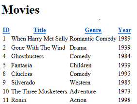

Click a column heading link to sort by that column. Being able to sort by clicking a heading is a feature that's built into the **WebGrid** helper.

The `GetHtml` method, as its name suggests, generates markup that displays the data. By default, the `GetHtml` method generates an HTML `<table>` element. (If you want, you can verify the rendering by looking at the source of the page in the browser.)

## Modifying the Look of the Grid

Using the `WebGrid` helper like you just did is easy, but the resulting display is plain. The `WebGrid` helper has all sorts of options that let you control how the data is displayed. There are far too many to explore in this tutorial, but this section will give you an idea of some of those options. A few additional options will be covered in later tutorials in this series.

### Specifying Individual Columns to Display

To start, you can specify that you want to display only certain columns. By default, as you've seen, the grid shows all four of the columns from the *Movies* table.

In the *Movies.cshtml* file, replace the `@grid.GetHtml()` markup that you just added with the following:

[!code-css[Main](displaying-data/samples/sample4.css)]

To tell the helper which columns to display, you include a `columns` parameter for the `GetHtml` method and pass in a collection of columns. In the collection, you specify each column to include. You specify an individual column to display by including a `grid.Column` object, and pass in the name of the data column you want. (These columns must be included in the SQL query results — the `WebGrid` helper cannot display columns that were not returned by the query.)

Launch the *Movies.cshtml* page in the browser again, and this time you get a display like the following one (notice that no ID column is displayed):

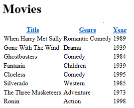

### Changing the Look of the Grid

There are quite a few more options for displaying columns, some of which will be explored in later tutorials in this set. For now, this section will introduce you to ways in which you can style the grid as a whole.

Inside the `<head>` section of the page, just before the closing `</head>` tag, add the following `<style>` element:

[!code-css[Main](displaying-data/samples/sample5.css)]

This CSS markup defines classes named `grid`, `head`, and so on. You could also put these style definitions in a separate *.css* file and link that to the page. (In fact, you'll do that later in this tutorial set.) But to make things easy for this tutorial, they're inside the same page that displays the data.

Now you can get the `WebGrid` helper to use these style classes. The helper has a number of properties (for example, `tableStyle`) for just this purpose — you assign a CSS style class name to them, and that class name is rendered as part of the markup that's rendered by the helper.

Change the `grid.GetHtml` markup so that it now looks like this code:

[!code-css[Main](displaying-data/samples/sample6.css)]

What's new here is that you've added `tableStyle`, `headerStyle`, and `alternatingRowStyle` parameters to the `GetHtml` method. These parameters have been set to the names of the CSS styles that you added a moment ago.

Run the page, and this time you see a grid that looks much less plain than before:

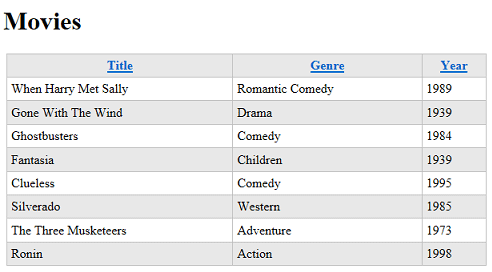

To see what the `GetHtml` method generated, you can look at the source of the page in the browser. We won't go into detail here, but the important point is that by specifying parameters like `tableStyle`, you caused the grid to generate HTML tags like the following:

`<table class="grid">`

The `<table>` tag has had a `class` attribute added to it that references one of the CSS rules that you added earlier. This code shows you the basic pattern &mdash; different parameters for the `GetHtml` method let you reference CSS classes that the method then generates along with the markup. What you do with the CSS classes is up to you.

## Adding Paging

As the last task for this tutorial, you'll add paging to the grid. Right now it's no problem to display all your movies at once. But if you added hundreds of movies, the page display would get long.

In the page code, change the line that creates the `WebGrid` object to the following code:

[!code-csharp[Main](displaying-data/samples/sample7.cs)]

The only difference from before is that you've added a `rowsPerPage` parameter that's set to 3.

Run the page. The grid displays 3 rows at a time, plus navigation links that let you page through the movies in your database:

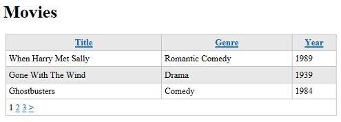

## Coming Up Next

In the next tutorial, you'll learn how to use Razor and C# code to get user input in a form. You'll add a search box to the Movies page so that you can find movies by title or genre.

## Complete Listing for Movies Page

[!code-cshtml[Main](displaying-data/samples/sample8.cshtml)]

## Additional Resources

- [Introduction to ASP.NET Web Programming Using the Razor Syntax](https://go.microsoft.com/fwlink/?LinkID=202890)

>[!div class="step-by-step"]
[Previous](intro-to-web-pages-programming.md)
[Next](form-basics.md)