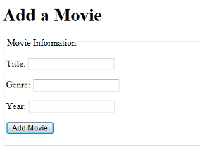
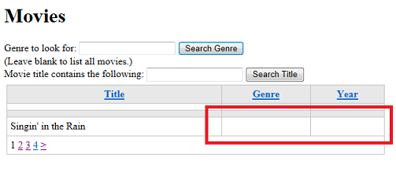
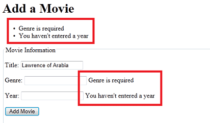
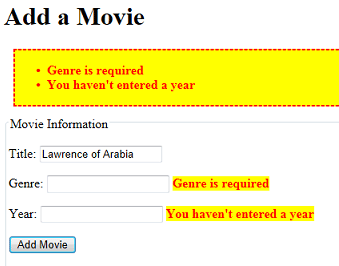

Introducing ASP.NET Web Pages - Entering Database Data by Using Forms
====================
by [Tom FitzMacken](https://github.com/tfitzmac)

> This tutorial shows you how to create an entry form and then enter the data that you get from the form into a database table when you use ASP.NET Web Pages (Razor). It assumes you have completed the series through [Basics of HTML Forms in ASP.NET Web Pages](https://go.microsoft.com/fwlink/?LinkId=251581).
> 
> What you'll learn:
> 
> - More about how to process entry forms.
> - How to add (insert) data in a database.
> - How to make sure that users have entered a required value in a form (how to validate user input).
> - How to display validation errors.
> - How to jump to another page from the current page.
>   
> 
> Features/technologies discussed:
> 
> - The `Database.Execute` method.
> - The SQL `Insert Into` statement
> - The `Validation` helper.
> - The `Response.Redirect` method.

## What You'll Build

In the tutorial earlier that showed you how to create a database, you entered database data by editing the database directly in WebMatrix, working in the **Database** workspace. In most apps, that's not a practical way to put data into the database, though. So in this tutorial, you'll create a web-based interface that lets you or anyone enter data and save it to the database.

You'll create a page where you can enter new movies. The page will contain an entry form that has fields (text boxes) where you can enter a movie title, genre, and year. The page will look like this page:

The text boxes will be HTML `<input>` elements that will look like this markup:

`<input type="text" name="genre" value="" />`

## Creating the Basic Entry Form

Create a page named *AddMovie.cshtml*.

Replace what's in the file with the following markup. Overwrite everything; you'll add a code block at the top shortly.

[!code-cshtml[Main](entering-data/samples/sample1.cshtml)]

This example shows typical HTML for creating a form. It uses `<input>` elements for the text boxes and for the submit button. The captions for the text boxes are created by using standard `<label>` elements. The `<fieldset>` and `<legend>` elements put a nice box around the form.

Notice that in this page, the `<form>` element uses `post` as the value for the `method` attribute. In the previous tutorial, you created a form that used the `get` method. That was correct, because although the form submitted values to the server, the request did not make any changes. All it did was fetch data in different ways. However, in this page you *will* make changes—you're going to add new database records. Therefore, this form should use the `post` method. (For more about the difference between `GET` and `POST` operations, see the[GET, POST, and HTTP Verb Safety](https://go.microsoft.com/fwlink/?LinkId=251581#GET,_POST,_and_HTTP_Verb_Safety) sidebar in the previous tutorial.)

Note that each text box has a `name` element (`title`, `genre`, `year`). As you saw in the previous tutorial, these names are important because you must have those names so you can get the user's input later. You can use any names. It's helpful to use meaningful names that help you remember what data you're working with.

The `value` attribute of each `<input>` element contains a bit of Razor code (for example, `Request.Form["title"]`). You learned a version of this trick in the previous tutorial to preserve the value entered into the text box (if any) after the form has been submitted.

## Getting the Form Values

Next, you add code that processes the form. In outline, you'll do the following:

1. Check whether the page is being posted (was submitted). You want to your code to run only when users have clicked the button, not when the page first runs.
2. Get the values that the user entered into the text boxes. In this case, because the form is using the `POST` verb, you get the form values from the `Request.Form` collection.
3. Insert the values as a new record in the *Movies* database table.

At the top of the file, add the following code:

[!code-cshtml[Main](entering-data/samples/sample2.cshtml)]

The first few lines create variables (`title`, `genre`, and `year`) to hold the values from the text boxes. The line `if(IsPost)` makes sure that the variables are set *only* when users click the **Add Movie** button — that is, when the form has been posted.

As you saw in an earlier tutorial, you get the value of a text box by using an expression like `Request.Form["name"]`, where *name* is the name of the `<input>` element.

The names of the variables (`title`, `genre`, and `year`) are arbitrary. Like the names that you assign to `<input>` elements, you can call them anything you like. (The names of the variables don't have to match the name attributes of `<input>` elements on the form.) But as with the `<input>` elements, it's a good idea to use variable names that reflect the data that they contain. When you write code, consistent names make it easier for you to remember what data you're working with.

## Adding Data to the Database

In the code block you just added, just *inside* the closing brace ( `}` ) of the `if` block (not just inside the code block), add the following code:

[!code-csharp[Main](entering-data/samples/sample3.cs)]

This example is similar to the code you used in a previous tutorial to fetch and display data. The line that starts with `db =` opens the database, like before, and the next line defines a SQL statement, again as you saw before. However, this time it defines a SQL `Insert Into` statement. The following example shows the general syntax of the `Insert Into` statement:

`INSERT INTO table (column1, column2, column3, ...) VALUES (value1, value2, value3, ...)`

In other words, you specify the table to insert into, then list the columns to insert into, and then list the values to insert. (As noted before, SQL is not case sensitive but some people capitalize the keywords to make it easier to read the command.)

The columns that you're inserting into are already listed in the command — `(Title, Genre, Year)`. The interesting part is how you get the values from the text boxes into the `VALUES` part of the command. Instead of actual values, you see `@0`, `@1`, and `@2`, which are of course placeholders. When you run the command (on the `db.Execute` line), you pass the values that you got from the text boxes.

**Important!** Remember that the only way you should ever include data entered online by a user in a SQL statement is to use placeholders, as you see here (`VALUES(@0, @1, @2)`). If you concatenate user input into a SQL statement, you open yourself to a SQL injection attack, as explained in [Form Basics in ASP.NET Web Pages](https://go.microsoft.com/fwlink/?LinkId=251581) (the previous tutorial).

Still inside the `if` block, add the following line after the `db.Execute` line:

[!code-css[Main](entering-data/samples/sample4.css)]

After the new movie has been inserted into the database, this line jumps you (redirects) to the *Movies* page so you can see the movie you just entered. The `~` operator means "root of the website." (The `~` operator works only in ASP.NET pages, not in HTML generally.)

The complete code block looks like this example:

[!code-cshtml[Main](entering-data/samples/sample5.cshtml)]

## Testing the Insert Command (So Far)

You're not done yet, but now is a good time to test.

In the tree view of files in WebMatrix, right-click the *AddMovie.cshtml* page and then click **Launch in browser**.

(If you end up with a different page in the browser, make sure that the URL is `http://localhost:nnnnn/AddMovie`), where *nnnnn* is the port number that you're using.)

Did you get an error page? If so, read it carefully and make sure that the code looks exactly what was listed earlier.

Enter a movie in the form &mdash; for example, use "Citizen Kane", "Drama", and "1941". (Or whatever.) Then click **Add Movie**.

If all goes well, you're redirected to the *Movies* page. Make sure that your new movie is listed.

## Validating User Input

Go back to the *AddMovie* page, or run it again. Enter another movie, but this time, enter only the title &mdash; for example, enter "Singin' in the Rain". Then click **Add Movie**.

You're redirected to the *Movies* page again. You can find the new movie, but it's incomplete.

When you created the *Movies* table, you explicitly said that none of the fields could be null. Here you have an entry form for new movies, and you're leaving fields blank. That's an error.

In this case, the database didn't actually raise (or *throw*) an error. You didn't supply a genre or year, so the code in the *AddMovie* page treated those values as so-called *empty strings*. When the SQL `Insert Into` command ran, the genre and year fields didn't have useful data in them, but they weren't null.

Obviously, you don't want to let users enter half-empty movie information into the database. The solution is to validate the user's input. Initially, the validation will simply make sure that the user has entered a value for all of the fields (that is, that none of them contains an empty string).

> [!TIP] 
> 
> **Null and Empty Strings**
> 
> In programming, there's a distinction between different notions of "no value." In general, a value is *null* if it has never been set or initialized in any way. In contrast, a variable that expects character data (strings) can be set to an *empty string*. In that case, the value is not null; it's just been explicitly set to a string of characters whose length is zero. These two statements show the difference:
> 
> [!code-csharp[Main](entering-data/samples/sample6.cs)]
> 
> It's a little more complicated than that, but the important point is that `null` represents a sort of undetermined state.
> 
> Now and then it's important to understand exactly when a value is null and when it's just an empty string. In the code for the *AddMovie* page, you get the values of the text boxes by using `Request.Form["title"]` and so on. When the page first runs (before you click the button), the value of `Request.Form["title"]` is null. But when you submit the form, `Request.Form["title"]` gets the value of the `title` text box. It's not obvious, but an empty text box is not null; it just has an empty string in it. So when the code runs in response to the button click, `Request.Form["title"]` has an empty string in it.
> 
> Why is this distinction important? When you created the *Movies* table, you explicitly said that none of the fields could be null. But here you have an entry form for new movies, and you're leaving fields blank. You would reasonably expect the database to complain when you tried to save new movies that didn't have values for genre or year. But that's the point &mdash; even if you leave those text boxes blank, the values aren't null; they're empty strings. As a result, you're able to save new movies to the database with these columns empty &mdash; but not null! &mdash; values. Therefore, you have to make sure that users don't submit an empty string, which you can do by validating the user's input.

### The Validation Helper

ASP.NET Web Pages includes a helper &mdash; the `Validation` helper &mdash; that you can use to make sure that users enter data that meets your requirements. The `Validation` helper is one of the helpers that's built in to ASP.NET Web Pages, so you don't have to install it as a package by using NuGet, the way you installed the Gravatar helper in an earlier tutorial.

To validate the user's input, you'll do the following:

- Use code to specify that you want to require values in the text boxes on the page.
- Put a test into the code so that the movie information is added to the database only if everything validates properly.
- Add code into the markup to display error messages.

In the code block in the *AddMovie* page, right up at the top before the variable declarations, add the following code:

[!code-csharp[Main](entering-data/samples/sample7.cs)]

You call `Validation.RequireField` once for each field (`<input>` element) where you want to require an entry. You can also add a custom error message for each call, like you see here. (We varied the messages just to show that you can put anything you like there.)

If there's a problem, you want to prevent the new movie information from being inserted into the database. In the `if(IsPost)` block, use `&&` (logical AND) to add another condition that tests `Validation.IsValid()`. When you're done, the whole `if(IsPost)` block looks like this code:

[!code-csharp[Main](entering-data/samples/sample8.cs)]

If there's a validation error with any of the fields that you registered by using the `Validation` helper, the `Validation.IsValid` method returns false. And in that case, none of the code in that block will run, so no invalid movie entries will be inserted into the database. And of course you're not redirected to the *Movies* page.

The complete code block, including the validation code, now looks like this example:

[!code-cshtml[Main](entering-data/samples/sample9.cshtml?highlight=10)]

## Displaying Validation Errors

The last step is to display any error messages. You can display individual messages for each validation error, or you can display a summary, or both. For this tutorial, you'll do both so that you can see how it works.

Next to each `<input>` element that you're validating, call the `Html.ValidationMessage` method and pass it the name of the `<input>` element you're validating. You put the `Html.ValidationMessage` method right where you want the error message to appear. When the page runs, the `Html.ValidationMessage` method renders a `` element where the validation error will go. (If there's no error, the `` element is rendered, but there's no text in it.)

Change the markup in the page so that it includes an `Html.ValidationMessage` method for each of the three `<input>` elements on the page, like this example:

[!code-cshtml[Main](entering-data/samples/sample10.cshtml?highlight=3,8,13)]

To see how the summary works, also add the following markup and code right after the `<h1>Add a Movie</h1>` element on the page:

[!code-cshtml[Main](entering-data/samples/sample11.cshtml)]

By default, the `Html.ValidationSummary` method displays all the validation messages in a list (a `<ul>` element that's inside a `
` element). As with the `Html.ValidationMessage` method, the markup for the validation summary is always rendered; if there are no errors, no list items are rendered.

The summary can be an alternative way to display validation messages instead of by using the `Html.ValidationMessage` method to display each field-specific error. Or you can use both a summary and the details. Or you can use the `Html.ValidationSummary` method to display a generic error and then use individual `Html.ValidationMessage` calls to display details.

The complete page now looks like this example:

[!code-cshtml[Main](entering-data/samples/sample12.cshtml)]

That's it. You can now test the page by adding a movie but leaving out one or more of the fields. When you do, you see the following error display:

## Styling the Validation Error Messages

You can see that there are error messages, but they don't really stand out very well. There's an easy way to style the error messages, though.

To style the individual error messages that are displayed by `Html.ValidationMessage`, create a CSS style class named `field-validation-error`. To define the look for the validation summary, create a CSS style class named `validation-summary-errors`.

To see how this technique works, add a `<style>` element inside the `<head>` section of the page. Then define style classes named `field-validation-error` and `validation-summary-errors` that contain the following rules:

[!code-cshtml[Main](entering-data/samples/sample13.cshtml?highlight=4-17)]

Normally you'd probably put style information into a separate *.css* file, but for simplicity you can put them in the page for now. (Later in this tutorial set, you'll move the CSS rules to a separate *.css* file.)

If there's a validation error, the `Html.ValidationMessage` method renders a `` element that includes `class="field-validation-error"`. By adding a style definition for that class, you can configure what the message looks like. If there are errors, the `ValidationSummary` method likewise dynamically renders the attribute `class="validation-summary-errors"`.

Run the page again and deliberately leave out a couple of the fields. The errors are now more noticeable. (In fact, they're overdone, but that's just to show what you can do.)

## Adding a Link to the Movies Page

One final step is to make it convenient to get to the *AddMovie* page from the original movie listing.

Open the *Movies* page again. After the closing `
` tag that follows the `WebGrid` helper, add the following markup:

[!code-cshtml[Main](entering-data/samples/sample14.cshtml)]

As you saw before, ASP.NET interprets the `~` operator as the root of the website. You don't have to use the `~` operator; you could use the markup `<a href="./AddMovie">Add a movie</a>` or some other way to define the path that HTML understands. But the `~` operator is a good general approach when you create links for Razor pages, because it makes the site more flexible — if you move the current page to a subfolder, the link will still go to the *AddMovie* page. (Remember that the `~` operator only works in *.cshtml* pages. ASP.NET understands it, but it's not standard HTML.)

When you're done, run the *Movies* page. It will look like this page:

Click the **Add a movie** link to make sure that it goes to the *AddMovie* page.

## Coming Up Next

In the next tutorial, you'll learn how to let users edit data that's already in the database.

## Complete Listing for AddMovie Page

[!code-cshtml[Main](entering-data/samples/sample15.cshtml)]

## Additional Resources

- [Introduction to ASP.NET Web Programming Using the Razor Syntax](https://go.microsoft.com/fwlink/?LinkID=202890)
- [SQL INSERT INTO Statement](http://www.w3schools.com/sql/sql_insert.asp) on the W3Schools site
- [Validating User Input in ASP.NET Web Pages Sites](https://go.microsoft.com/fwlink/?LinkId=253002). More information about working with the `Validation` helper.

>[!div class="step-by-step"]
[Previous](form-basics.md)
[Next](updating-data.md)