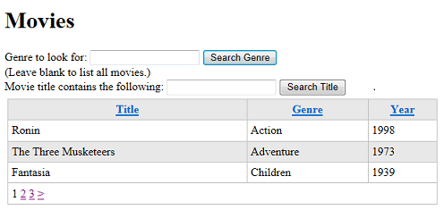
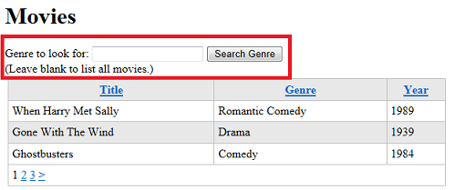
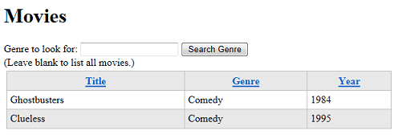
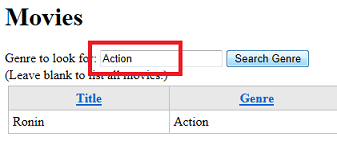
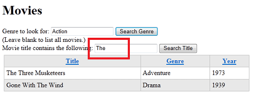

Introducing ASP.NET Web Pages - HTML Form Basics
====================
by [Tom FitzMacken](https://github.com/tfitzmac)

> This tutorial shows you the basics of how to create an input form and how to handle the user's input when you use ASP.NET Web Pages (Razor). And now that you've got a database, you'll use your form skills to let users find specific movies in the database. It assumes you have completed the series through [Introduction to Displaying Data Using ASP.NET Web Pages](/aspnet/web-pages/overview/getting-started/introducing-aspnet-web-pages-2/displaying-data.md).
> 
> What you'll learn:
> 
> - How to create a form by using standard HTML elements.
> - How to read the user's input in a form.
> - How to create a SQL query that selectively gets data by using a search term that the user supplies.
> - How to have fields in the page "remember" what the user entered.
>   
> 
> Features/technologies discussed:
> 
> - The `Request` object.
> - The SQL `Where` clause.

## What You'll Build

In the previous tutorial, you created a database, added data to it, and then used the `WebGrid` helper to display the data. In this tutorial, you'll add a search box that lets you find movies of a specific genre or whose title contains whatever word you enter. (For example, you'll be able to find all movies whose genre is "Action" or whose title contains "Harry" or "Adventure.")

When you're done with this tutorial, you'll have a page like this one:

The listing part of the page is the same as in the last tutorial &mdash; a grid. The difference will be that the grid will show only the movies that you searched for.

## About HTML Forms

(If you've got experience with creating HTML forms and with the difference between `GET` and `POST`, you can skip this section.)

A form has user input elements &mdash; text boxes, buttons, radio buttons, check boxes, drop-down lists, and so on. Users fill in these controls or make selections and then submit the form by clicking a button.

The basic HTML syntax of a form is illustrated by this example:

[!code-html[Main](form-basics/samples/sample1.html)]

When this markup runs in a page, it creates a simple form that looks like this illustration:

The `<form>` element encloses HTML elements to be submitted. (An easy mistake to make is to add elements to the page but then forget to put them inside a `<form>` element. In that case, nothing is submitted.) The `method` attribute tells the browser how to submit the user input. You set this to `post` if you're performing an update on the server or to `get` if you're just fetching data from the server.

> [!TIP] 
> 
> **GET, POST, and HTTP Verb Safety**
> 
> HTTP, the protocol that browsers and servers use to exchange information, is remarkably simple in its basic operations. Browsers use only a few verbs to make requests to servers. When you write code for the web, it's helpful to understand these verbs and how the browser and server use them. Far and away the most commonly used verbs are these:
> 
> - `GET`. The browser uses this verb to fetch something from the server. For example, when you type a URL into your browser, the browser performs a `GET` operation to request the page you want. If the page includes graphics, the browser performs additional `GET` operations to get the images. If the `GET` operation has to pass information to the server, the information is passed as part of the URL in the query string.
> - `POST`. The browser sends a `POST` request in order to submit data to be added or changed on the server. For example, the `POST` verb is used to create records in a database or change existing ones. Most of the time, when you fill in a form and click the submit button, the browser performs a `POST` operation. In a `POST` operation, the data being passed to the server is in the body of the page.
> 
> An important distinction between these verbs is that a `GET` operation is not supposed to change anything on the server — or to put it in a slightly more abstract way, a `GET` operation does not result in a change in state on the server. You can perform a `GET` operation on the same resources as many times as you like, and those resources don't change. (A `GET` operation is often said to be "safe," or to use a technical term, is *idempotent*.) In contrast, of course, a `POST` request changes something on the server each time you perform the operation.
> 
> Two examples will help illustrate this distinction. When you perform a search using an engine like Bing or Google, you fill in a form that consists of one text box, and then you click the search button. The browser performs a `GET` operation, with the value you entered into the box passed as part of the URL. Using a `GET` operation for this type of form is fine, because a search operation doesn't change any resources on the server, it just fetches information.
> 
> Now consider the process of ordering something online. You fill in the order details and then click the submit button. This operation will be a `POST` request, because the operation will result in changes on the server, such as a new order record, a change in your account information, and perhaps many other changes. Unlike the `GET` operation, you cannot repeat your `POST` request — if you did, each time you resubmitted the request, you'd generate a new order on the server. (In cases like this, websites will often warn you not to click a submit button more than once, or will disable the submit button so that you don't resubmit the form accidentally.)
> 
> In the course of this tutorial, you'll use both a `GET` operation and a `POST` operation to work with HTML forms. We'll explain in each case why the verb you use is the appropriate one.
> 
> (To learn more about HTTP verbs, see the [Method Definitions](http://www.w3.org/Protocols/rfc2616/rfc2616-sec9.html) article on the W3C site.)

Most user input elements are HTML `<input>` elements. They look like `<input type="type" name="name">,` where *type* indicates the kind of user input control you want. These elements are the common ones:

- Text box: `<input type="text">`
- Check box: `<input type="check">`
- Radio button: `<input type="radio">`
- Button: `<input type="button">`
- Submit button: `<input type="submit">`

You can also use the `<textarea>` element to create a multiline text box and the `<select>` element to create a drop-down list or scrollable list. (For more about HTML form elements, see [HTML Forms and Input](http://www.w3schools.com/html/html_forms.asp) on the W3Schools site.)

The `name` attribute is very important, because the name is how you'll get the value of the element later, as you'll see shortly.

The interesting part is what you, the page developer, do with the user's input. There's no built-in behavior associated with these elements. Instead, you have to get the values that the user has entered or selected and do something with them. That's what you'll learn in this tutorial.

> [!TIP] 
> 
> **HTML5 and Input Forms**
> 
> As you might know, HTML is in transition and the latest version (HTML5) includes support for more intuitive ways for users to enter information. For example, in HTML5, you (the page developer) can tell the page that you want the user to enter a date. The browser can then automatically display a calendar rather than requiring the user to enter a date manually. However, HTML5 is new and is not supported in all browsers yet.
> 
> ASP.NET Web Pages supports HTML5 input to the extent that the user's browser does. For an idea of the new attributes for the `<input>` element in HTML5, see [HTML &lt;input&gt; type Attribute](http://www.w3schools.com/html/html_form_input_types.asp) on the W3Schools site.

## Creating the Form

In WebMatrix, in the **Files** workspace, open the *Movies.cshtml* page.

After the closing `</h1>` tag and before the opening `
` tag of the `grid.GetHtml` call, add the following markup:

[!code-html[Main](form-basics/samples/sample2.html)]

This markup creates a form that has a text box named `searchGenre` and a submit button. The text box and submit button are enclosed in a `<form>` element whose `method` attribute is set to `get`. (Remember that if you don't put the text box and submit button inside a `<form>` element, nothing will be submitted when you click the button.) You use the `GET` verb here because you're creating a form that does not make any changes on the server — it just results in a search. (In the previous tutorial, you used a `post` method, which is how you submit changes to the server. You'll see that in the next tutorial again.)

Run the page. Although you haven't defined any behavior for the form, you can see what it looks like:

Enter a value into the text box, like "Comedy." Then click **Search Genre**.

Take note of the URL of the page. Because you set the `<form>` element's `method` attribute to `get`, the value you entered is now part of the query string in the URL, like this:

`http://localhost:45661/Movies.cshtml?searchGenre=Comedy`

## Reading Form Values

The page already contains some code that gets database data and displays the results in a grid. Now you have to add some code that reads the value of the text box so you can run a SQL query that includes the search term.

Because you set the form's method to `get`, you can read the value that was entered into the text box by using code like the following:

`var searchTerm = Request.QueryString["searchGenre"];`

The `Request.QueryString` object (the `QueryString` property of the `Request` object) includes the values of elements that were submitted as part of the `GET` operation. The `Request.QueryString` property contains a *collection* (a list) of the values that are submitted in the form. To get any individual value, you specify the name of the element that you want. That's why you have to have a `name` attribute on the `<input>` element (`searchTerm`) that creates the text box. (For more about the `Request` object, see the [sidebar](#BKMK_TheRequestObject) later.)

It's simple enough to read the value of the text box. But if the user didn't enter anything at all in the text box but clicked **Search** anyway, you can ignore that click, since there's nothing to search.

The following code is an example that shows how to implement these conditions. (You don't have to add this code yet; you'll do that in a moment.)

[!code-csharp[Main](form-basics/samples/sample3.cs)]

The test breaks down in this way:

- Get the value of `Request.QueryString["searchGenre"]`, namely the value that was entered into the `<input>` element named `searchGenre`.
- Find out if it's empty by using the `IsEmpty` method. This method is the standard way to determine whether something (for example, a form element) contains a value. But really, you care only if it's *not* empty, therefore ...
- Add the `!` operator in front of the `IsEmpty` test. (The `!` operator means logical NOT).

In plain English, the entire `if` condition translates into the following: *If the form's searchGenre element is not empty, then ...*

This block sets the stage for creating a query that uses the search term. You'll do that in the next section.

> [!TIP] 
> 
> **The Request Object**
> 
> The `Request` object contains all the information that the browser sends to your application when a page is requested or submitted. This object includes any information that the user provides, like text box values or a file to upload. It also includes all sorts of additional information, like cookies, values in the URL query string (if any), the file path of the page that is running, the type of browser that the user is using, the list of languages that are set in the browser, and much more.
> 
> The `Request` object is a *collection* (list) of values. You get an individual value out of the collection by specifying its name:
> 
> `var someValue = Request["name"];`
> 
> The `Request` object actually exposes several subsets. For example:
> 
> - `Request.Form` gives you values from elements inside the submitted `<form>` element if the request is a `POST` request.
> - `Request.QueryString` gives you just the values in the URL's query string. (In a URL like `http://mysite/myapp/page?searchGenre=action&page=2`, the `?searchGenre=action&page=2` section of the URL is the query string.)
> - `Request.Cookies` collection gives you access to cookies that the browser has sent.
> 
> To get a value that you know is in the submitted form, you can use `Request["name"]`. Alternatively, you can use the more specific versions `Request.Form["name"]` (for `POST` requests) or `Request.QueryString["name"]` (for `GET` requests). Of course, *name* is the name of the item to get.
> 
> The name of the item you want to get has to be unique within the collection you're using. That's why the `Request` object provides the subsets like `Request.Form` and `Request.QueryString`. Suppose that your page contains a form element named `userName` and *also* contains a cookie named `userName`. If you get `Request["userName"]`, it's ambiguous whether you want the form value or the cookie. However, if you get `Request.Form["userName"]` or `Request.Cookie["userName"]`, you're being explicit about which value to get.
> 
> It's a good practice to be specific and use the subset of `Request` that you're interested in, like `Request.Form` or `Request.QueryString`. For the simple pages that you're creating in this tutorial, it probably doesn't really make any difference. However, as you create more complex pages, using the explicit version `Request.Form` or `Request.QueryString` can help you avoid problems that can arise when the page contains a form (or multiple forms), cookies, query string values, and so on.

## Creating a Query by Using a Search Term

Now that you know how to get the search term that the user entered, you can create a query that uses it. Remember that to get all the movie items out of the database, you're using a SQL query that looks like this statement:

`SELECT * FROM Movies`

To get only certain movies, you have to use a query that includes a `Where` clause. This clause lets you set a condition on which rows are returned by the query. Here's an example:

`SELECT * FROM Movies WHERE Genre = 'Action'`

The basic format is `WHERE column = value`. You can use different operators besides just `=`, like `>` (greater than), `<` (less than), `<>` (not equal to), `<=` (less than or equal to), etc., depending on what you're looking for.

In case you're wondering, SQL statements are not case sensitive &mdash; `SELECT` is the same as `Select` (or even `select`). However, people often capitalize keywords in a SQL statement, like `SELECT` and `WHERE`, to make it easier to read.

### Passing the search term as a parameter

Searching for a specific genre is easy enough (`WHERE Genre = 'Action'`), but you want to be able to search for any genre that the user enters. To do that, you create as SQL query that includes a placeholder for the value to search. It will look like this command:

`SELECT * FROM Movies WHERE Genre = @0`

The placeholder is the `@` character followed by zero. As you might guess, a query can contain multiple placeholders, and they'd be named `@0`, `@1`, `@2`, etc.

To set up the query and actually pass it the value, you use the code like the following:

[!code-sql[Main](form-basics/samples/sample4.sql)]

This code is similar to what you've already done to display data in the grid. The only differences are:

- The query contains a placeholder (`WHERE Genre = @0"`).
- The query is put into a variable (`selectCommand`); before, you passed the query directly to the `db.Query` method.
- When you call the `db.Query` method, you pass both the query and the value to use for the placeholder. (If the query had multiple placeholders, you'd pass them all as separate values to the method.)

If you put all these elements together, you get the following code:

[!code-csharp[Main](form-basics/samples/sample5.cs)]

> [!NOTE] 
> 
> **Important!** Using placeholders (like `@0`) to pass values to a SQL command is *extremely important* for security. The way you see it here, with placeholders for variable data, is the only way you should construct SQL commands.
> 
> Never construct a SQL statement by putting together (concatenating) literal text and values you get from the user. Concatenating user input into a SQL statement opens your site to a *SQL injection attack* where a malicious user submits values to your page that hack your database. (You can read more in the article [SQL Injection](https://msdn.microsoft.com/en-us/library/ms161953.aspx) the MSDN website.)

## Updating the Movies Page with Search Code

Now you can update the code in the *Movies.cshtml* file. To begin, replace the code in the code block at the top of the page with this code:

[!code-csharp[Main](form-basics/samples/sample6.cs)]

The difference here is that you've put the query into the `selectCommand` variable, which you'll pass to `db.Query` later. Putting the SQL statement into a variable lets you change the statement, which is what you'll do to perform the search.

You've also removed these two lines, which you'll put back in later:

[!code-csharp[Main](form-basics/samples/sample7.cs)]

You don't want to run the query yet (that is, call `db.Query`) and you don't want to initialize the `WebGrid` helper yet either. You'll do those things after you've figured out which SQL statement has to run.

After this rewritten block, you can add the new logic for handling the search. The completed code will look like the following. Update the code in your page so it matches this example:

[!code-cshtml[Main](form-basics/samples/sample8.cshtml)]

The page now works like this. Every time the page runs, the code opens the database and the `selectCommand` variable is set to the SQL statement that gets all the records from the `Movies` table. The code also initializes the `searchTerm` variable.

However, if the current request includes a value for the `searchGenre` element, the code sets `selectCommand` to a different query — namely, to one that includes the `Where` clause to search for a genre. It also sets `searchTerm` to whatever was passed for the search box (which might be nothing).

Regardless of which SQL statement is in `selectCommand`, the code then calls `db.Query` to run the query, passing it whatever is in `searchTerm`. If there's nothing in `searchTerm`, it doesn't matter, because in that case there's no parameter to pass the value to `selectCommand` anyway.

Finally, the code initializes the `WebGrid` helper by using the query results, just like before.

You can see that by putting the SQL statement and the search term into variables, you've added flexibility to the code. As you'll see later in this tutorial, you can use this basic framework and keep adding logic for different types of searches.

## Testing the Search-by-Genre Feature

In WebMatrix, run the *Movies.cshtml* page. You see the page with the text box for genre.

Enter a genre that you've entered for one of your test records, then click **Search**. This time you see a listing of just the movies that match that genre:

Enter a different genre and search again. Try entering the genre by using all lowercase or all uppercase letters so that you can see that the search is not case sensitive.

## "Remembering" What the User Entered

You might have noticed that after you entered a genre and clicked **Search Genre**, you saw a listing for that genre. However, the search text box was empty &mdash; in other words, it didn't remember what you'd entered.

It's important to understand why this behavior occurs. When you submit a page, the browser sends a request to the web server. When ASP.NET gets the request, it creates a brand-new instance of the page, runs the code in it, and then renders the page to the browser again. In effect, though, the page doesn't know that you were just working with a previous version of itself. All it knows is that it got a request that had some form data in it.

Every time you request a page &mdash; whether for the first time or by submitting it &mdash; you're getting a new page. The web server has no memory of your last request. Neither does ASP.NET, and neither does the browser. The only connection between these separate instances of the page is any data that you transmit between them. If you submit a page, for example, the new page instance can get the form data that was sent by the earlier instance. (Another way to pass data between pages is to use cookies.)

A formal way to describe this situation is to say that web pages are *stateless*. Web servers and the pages themselves and the elements in the page do not maintain any information about the previous state of a page. The web was designed this way because maintaining state for individual requests would quickly exhaust the resources of web servers, which often handle thousands, maybe even hundreds of thousands, of requests per second.

So that's why the text box was empty. After you submitted the page, ASP.NET created a new instance of the page and ran through the code and markup. There was nothing in that code that told ASP.NET to put a value into the text box. So ASP.NET didn't do anything, and the text box was rendered without a value in it.

There's actually an easy way to get around this issue. The genre that you entered into the text box *is* available to you in code &mdash; it's in `Request.QueryString["searchGenre"]`.

Update the markup for the text box so that the `value` attribute gets its value from `searchTerm`, like this example:

[!code-html[Main](form-basics/samples/sample9.html?highlight=1)]

In this page, you could have also set the `value` attribute to the `searchTerm` variable, since that variable also contains the genre you entered. But using the `Request` object to set the `value` attribute as shown here is the standard way to accomplish this task. (Assuming you even want to do this &mdash; in some situations, you might want to render the page *without* values in the fields. It all depends on what's going on with your app.)

> [!NOTE]
> You can't "remember" the value of a text box that's used for passwords. It would be a security hole to allow people to fill in a password field by using code.

Run the page again, enter a genre, and click **Search Genre**. This time not only do you see the results of the search, but the text box remembers what you entered last time:

## Searching for Any Word in the Title

You can now search for any genre, but you might also want to search for a title. It's hard to get a title exactly right when you search, so instead you can search for a word that appears anywhere inside a title. To do that in SQL, you use the `LIKE` operator and syntax like the following:

`SELECT * FROM Movies WHERE Title LIKE '%adventure%'`

This command gets all the movies whose titles contain "adventure". When you use the `LIKE` operator, you include the wildcard character `%` as part of the search term. The search `LIKE 'adventure%'` means "starting with 'adventure'". (Technically, it means "The string 'adventure' followed by anything.") Similarly, the search term `LIKE '%adventure'` means "anything followed by the string 'adventure'", which is another way to say "ending with 'adventure'".

The search term `LIKE '%adventure%'` therefore means "with 'adventure' anywhere in the title." (Technically, "anything in the title, followed by 'adventure', followed by anything.")

Inside the `<form>` element, add the following markup right under the closing `
` tag for the genre search (just before the closing `</form>` element):

[!code-html[Main](form-basics/samples/sample10.html)]

The code to handle this search is similar to the code for the genre search, except that you have to assemble the `LIKE` search. Inside the code block at the top of the page, add this `if` block just after the `if` block for the genre search:

[!code-csharp[Main](form-basics/samples/sample11.cs)]

This code uses the same logic you saw earlier, except that the search uses a `LIKE` operator and the code puts "`%`" before and after the search term.

Notice how it was easy to add another search to the page. All you had to do was:

- Create an `if` block that tested to see whether the relevant search box had a value.
- Set the `selectCommand` variable to a new SQL statement.
- Set the `searchTerm` variable to the value to pass to the query.

Here's the complete code block, which contains the new logic for a title search:

[!code-cshtml[Main](form-basics/samples/sample12.cshtml)]

Here's a summary of what this code does:

- The variables `searchTerm` and `selectCommand` are initialized at the top. You're going to set these variables to the appropriate search term (if any) and appropriate SQL command based on what the user does in the page. The default search is the simple case of getting all the movies from the database.
- In the tests for `searchGenre` and `searchTitle`, the code sets `searchTerm` to the value you want to search for. Those code blocks also set `selectCommand` to an appropriate SQL command for that search.
- The `db.Query` method is invoked only once, using whatever SQL command is in `selectedCommand` and whatever value is in `searchTerm`. If there is no search term (no genre and no title word), the value of `searchTerm` is an empty string. However, that doesn't matter, because in that case the query doesn't require a parameter.

## Testing the Title Search Feature

Now you can test your completed search page. Run *Movies.cshtml*.

Enter a genre and click **Search Genre**. The grid displays movies of that genre, like before.

Enter a title word and click **Search Title**. The grid displays movies that have that word in the title.

Leave both text boxes blank and click either button. The grid displays all the movies.

## Combining the Queries

You might notice that the searches you can perform are exclusive. You can't search the title and the genre at the same time, even if both search boxes have values in them. For example, you can't search for all action movies whose title contains "Adventure". (As the page is coded now, if you enter values for both genre and title, the title search gets precedence.) To create a search that combines the conditions, you would have to create a SQL query that has syntax like the following:

`SELECT * FROM Movies WHERE Genre = @0 AND Title LIKE @1`

And you'd have to run the query by using a statement like the following (roughly speaking):

`var selectedData = db.Query(selectCommand, searchGenre, searchTitle);`

Creating logic to allow many permutations of search criteria can get a bit involved, as you can see. Therefore, we'll stop here.

## Coming Up Next

In the next tutorial, you'll create a page that uses a form to let users add movies to the database.

## Complete Listing for Movie Page (Updated with Search)

[!code-cshtml[Main](form-basics/samples/sample13.cshtml)]

## Additional Resources

- [Introduction to ASP.NET Web Programming Using the Razor Syntax](https://go.microsoft.com/fwlink/?LinkID=202890)
- [SQL WHERE Clause](http://www.w3schools.com/sql/sql_where.asp) on the W3Schools site
- [Method Definitions](http://www.w3.org/Protocols/rfc2616/rfc2616-sec9.html) article on the W3C site

>[!div class="step-by-step"]
[Previous](displaying-data.md)
[Next](entering-data.md)
