Introducing ASP.NET Web Pages - Getting Started
====================
by [Tom FitzMacken](https://github.com/tfitzmac)

> > [!NOTE] 
> > 
> > WebMatrix is no longer recommended as an integrated development environment for ASP.NET Web Pages. Use [Visual Studio](../program-asp-net-web-pages-in-visual-studio.md) or [Visual Studio Code](https://code.visualstudio.com/).
> 
> 
> This guidance and application gives you an overview of ASP.NET Web Pages (version 2 or later) and Razor syntax, a lightweight framework for creating dynamic websites. It also introduces WebMatrix, a tool for creating pages and sites.
> 
> **Level**: New to ASP.NET Web Pages.  
> **Skills assumed**: HTML, basic cascading style sheets (CSS).
> 
> What you'll learn in the first tutorial of the set:
> 
> - What ASP.NET Web Pages technology is and what it's for.
> - What WebMatrix is.
> - How to install everything.
> - How to create a website by using WebMatrix.
>   
> 
> Features/technologies discussed:
> 
> - Microsoft Web Platform Installer.
> - WebMatrix.
> - *.cshtml* pages
>   
> 
> Mike Pope originally wrote this tutorial. Tom FitzMacken updated it for Microsoft WebMatrix 3.
> 
> ## Software versions used in the tutorial
> 
> 
> - ASP.NET Web Pages (Razor) 2
> - WebMatrix 3

## What Should You Know?

We're assuming that you're familiar with:

- **HTML**. No in-depth expertise is required. We won't explain HTML, but we also don't use anything complex. We'll provide links to HTML tutorials where we think they're useful.
- **Cascading style sheets (CSS)**. Same as with HTML.
- **Basic database ideas**. If you've used a spreadsheet for data and sorted and filtered the data, that's the level of expertise we're generally assuming for this tutorial set.

We're also assuming that you're interested in learning basic programming. ASP.NET Web Pages use a programming language called C#. You don't have to have any background in programming, just an interest in it. If you've ever written any JavaScript in a web page before, you've got plenty of background.

Note that if you are familiar with programming, you might find that this tutorial set initially moves slowly while we bring new programmers up to speed. As we get past the first few tutorials, though, there will be less basic programming to explain and things will move along at a faster clip.

## What Do You Need?

Here's what you'll need:

- A computer that is running Windows 8, Windows 7, Windows Server 2008, or Windows Server 2012.
- A live internet connection.
- Administrator privileges (required for the installation process).

## What Is ASP.NET Web Pages?

ASP.NET Web Pages is a framework that you can use to create dynamic web pages. A simple HTML web page is static; its content is determined by the fixed HTML markup that's in the page. Dynamic pages like those you create with ASP.NET Web Pages let you create the page content on the fly, by using code.

Dynamic pages let you do all sorts of things. You can ask a user for input by using a form and then change what the page displays or how it looks. You can take information from a user, save it in a database, and then list it later. You can send email from your site. You can interact with other services on the web (for example, a mapping service) and produce pages that integrate information from those sources.

## What is WebMatrix?

WebMatrix is a tool that integrates a web page editor, a database utility, a web server for testing pages, and features for publishing your website to the Internet. WebMatrix is free, and it's easy to install and easy to use. (It also works for just plain HTML pages, as well as for other technologies like PHP.)

You don't actually *have* to use WebMatrix to work with ASP.NET Web Pages. You can create pages by using a text editor, for example, and test pages by using a web server that you have access to. However, WebMatrix makes it all very easy, so these tutorials will use WebMatrix throughout.

## About These Tutorials

This tutorial set is an introduction to how to use ASP.NET Web Pages. There are 9 tutorials total in this introductory tutorial set. It's part of a series of tutorial sets that takes you from ASP.NET Web Pages novice to creating real, professional-looking websites.

This first tutorial set concentrates on showing you the basics of how to work with ASP.NET Web Pages. When you're done, you can work with additional tutorial sets that pick up where this one ends and that explore Web Pages in more depth.

We deliberately go easy on the in-depth explanations. And whenever we show something, for this tutorial set we always choose the way that we think is easiest to understand. Later tutorial sets go into more depth and show you more efficient or more flexible approaches (also more fun). But those tutorials require you to understand the basics first.

The tutorial set you've just started covers these features of ASP.NET Web Pages:

- Introduction and getting everything installed. (That's in the tutorial you're reading.)
- The basics of ASP.NET Web Pages programming.
- Creating a database.
- Creating and processing a user input form.
- Adding, updating, and deleting data in the database.

## What Will You Create?

This tutorial set and subsequent ones revolve around a website where you can list movies that you like. You'll be able to enter movies, edit them, and list them. Here are a couple of the pages you'll create in this tutorial set. The first one shows the movie listing page that you'll create:

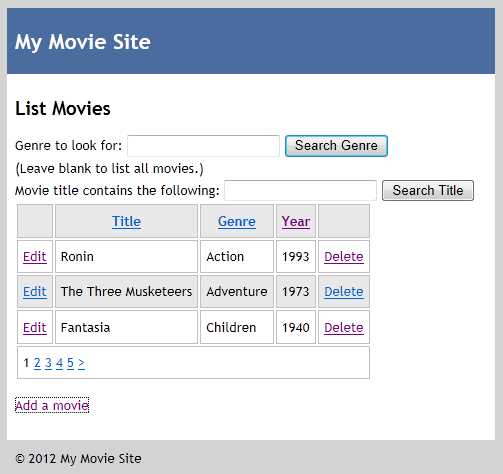

And here's the page that lets you add new movie information to your site:

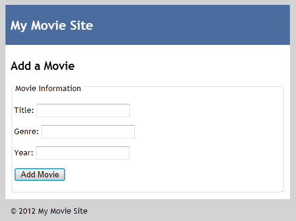

Subsequent tutorial sets build on this set and add more functionality, like uploading pictures, letting people log in, sending email, and integrating with social media.

## See this App Running on Azure

Would you like to see the finished site running as a live web app? You can deploy a complete version of the app to your Azure account by simply clicking the following button.

You need an Azure account to deploy this solution to Azure. If you do not already have an account, you have the following options:

- [Open an Azure account for free](https://azure.microsoft.com/en-us/pricing/free-trial/?WT.mc_id=A443DD604) - You get credits you can use to try out paid Azure services, and even after they're used up you can keep the account and use free Azure services.
- [Activate MSDN subscriber benefits](https://azure.microsoft.com/en-us/pricing/member-offers/msdn-benefits-details/?WT.mc_id=A443DD604) - Your MSDN subscription gives you credits every month that you can use for paid Azure services.

## Installing Everything

You can install everything by using the Web Platform Installer from Microsoft. In effect, you install the installer, and then use it to install everything else.

To use Web Pages, you have to be have at least Windows XP with SP3 installed, or Windows Server 2008 or later.

On the [Web Pages page](../../../index.md) of the ASP.NET website, click **Install**.

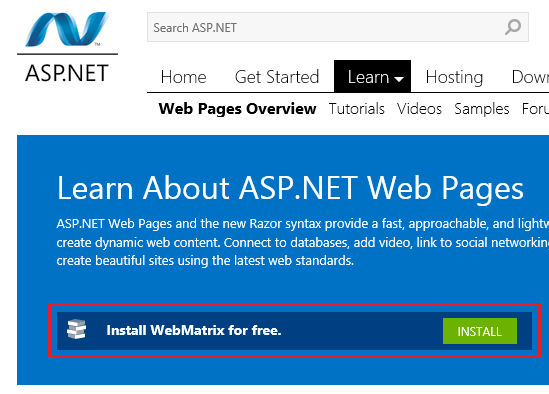

You are asked to accept the license terms and privacy statement before installing WebMatrix.

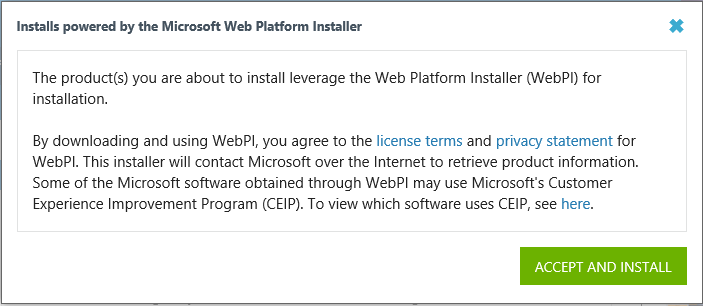

Click **Run** to start the installation. (If you want to save the installer, click **Save** and then run the installer from the folder where you saved it.)

The Web Platform Installer appears, ready to install WebMatrix. Click **Install**.

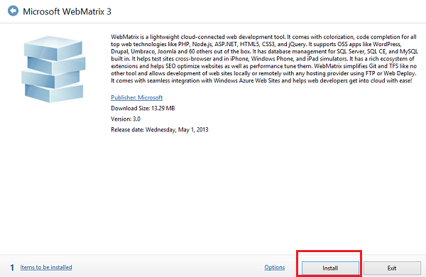

The installation process figures out what it has to install on your computer and starts the process. Depending on what exactly has to be installed, the process can take anywhere from a few moments to several minutes. Select **I Accept** to accept the license terms.

## Hello, WebMatrix

When it's done, the installation process can launch WebMatrix automatically. If it doesn't, in Windows, from the **Start** menu, launch **Microsoft WebMatrix**.

When you launch WebMatrix for the first time, you are given a chance to sign in to Microsoft Azure with your Microsoft account. By signing in, you will receive 10 free web apps through Azure. These free web apps provide a convenient way to test your apps. If you don't already have an Azure account, but you do have an MSDN subscription, you can [activate your MSDN subscription benefits](https://www.windowsazure.com/en-us/pricing/member-offers/msdn-benefits-details/?WT.mc_id=A443DD604). Otherwise, you can create a free trial account in just a couple of minutes. For details, see [Azure Free Trial](https://www.windowsazure.com/en-us/pricing/free-trial/?WT.mc_id=A443DD604).

You do not have to sign in right now to continue with this tutorial. If you do not sign in now, you will still have the option to sign in later. The last [topic](publishing.md) in this tutorial series covers how to deploy your website to Azure; therefore, you would need to sign in to complete that topic.

At this point, either sign in with your Microsoft account or select **Not Now** in the lower right corner.

To begin, you'll create a blank website and add a page. In a later tutorial in this set you'll play with one of the built-in website templates.

In the start window, click **New**.

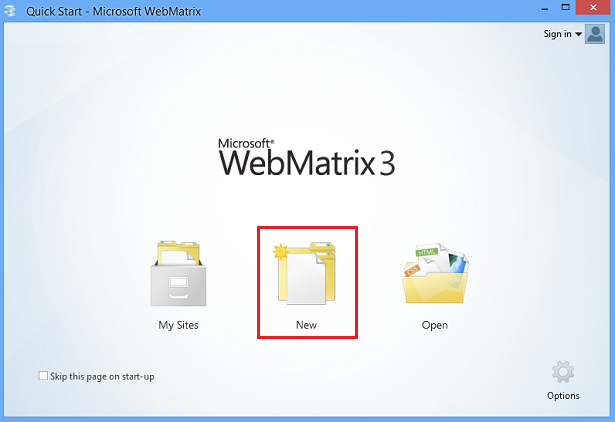

Templates are prebuilt files and pages for different types of websites. To see all of the templates that are available by default, select the Template Gallery option.

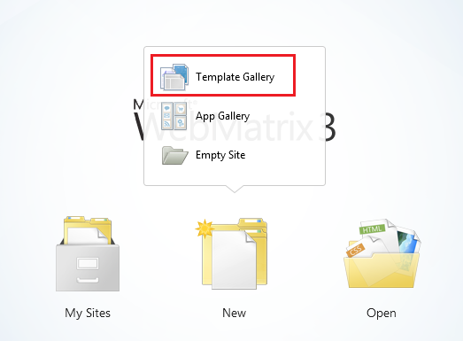

In the **Quick Start** window, select **Empty Site** from the **ASP.NET** group and name the new site "WebPagesMovies".

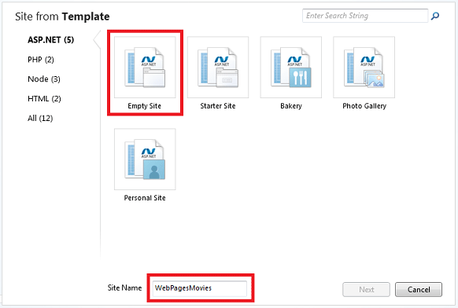

Click **Next**.

If you have signed in to your Microsoft account, you will be given the opportunity to create the site on Azure. Based on the name of your site, the default name of **WebPagesMovies.azurewebsites.net** is suggested; however, the exclamation point indicates that this name is not available on Windows Azure. For simplicity, select **Skip** to bypass creating the web site on Azure right now. Later in this series, we will publish the site to Azure.

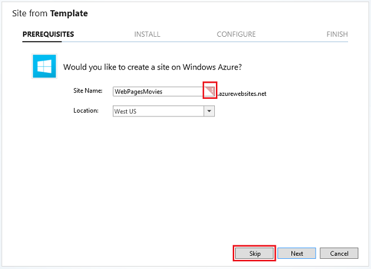

WebMatrix creates and opens the site:

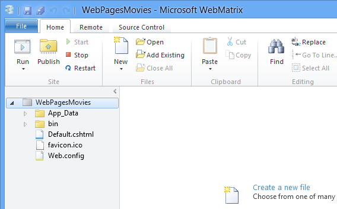

At the top, there's a Quick Access Toolbar and a ribbon. At the bottom left, you see the workspace selector where you switch between tasks (**Site**, **Files**, **Databases**, **Reports**). On the right is the content pane for the editor and for reports. And across the bottom you'll occasionally see a notification bar for messages.

You'll learn more about WebMatrix and its features as you go through these tutorials.

## Creating a Web Page

To become familiar with WebMatrix and ASP.NET Web Pages, you'll create a simple page.

In the workspace selector, select the **Files** workspace. This workspace lets you work with files and folders. The left pane shows the file structure of your site. The ribbon changes to show file-related tasks.

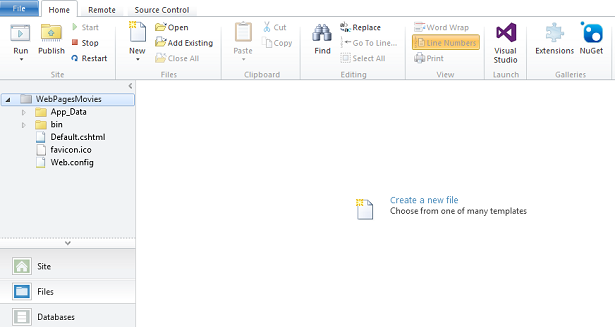

In the ribbon, click the arrow under **New** and then click **New File**.

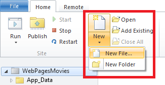

WebMatrix displays a list of file types. Select **CSHTML**, and in the **Name** box, type "HelloWorld". A CSHTML page is an ASP.NET Web Pages page.

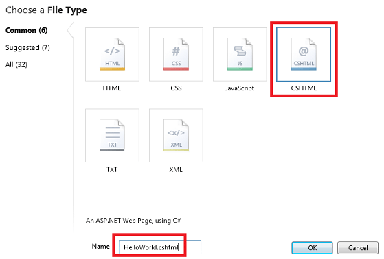

Click **OK**.

WebMatrix creates the page and opens it in the editor.

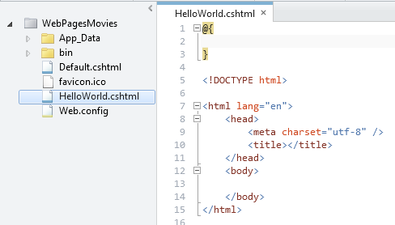

As you can see, the page contains mostly ordinary HTML markup, except for a block at the top that looks like this:

[!code-cshtml[Main](getting-started/samples/sample1.cshtml)]

That's for adding code, as you'll see shortly.

Notice that the different parts of the page &mdash; the element names, attributes, and text, plus the block at the top — are all in different colors. This is called *syntax highlighting*, and it makes it easier to keep everything clear. It's one of the features that makes it easy to work with web pages in WebMatrix.

Add content for the `<head>` and `<body>` elements like in the following example. (If you want, you can just copy the following block and replace the entire existing page with this code.)

[!code-cshtml[Main](getting-started/samples/sample2.cshtml)]

In the Quick Access Toolbar or in the **File** menu, click **Save**.

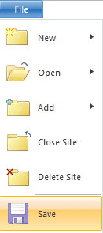

## Testing the Page

In the **Files** workspace, right-click the *HelloWorld.cshtml* page and then click **Launch in browser**.

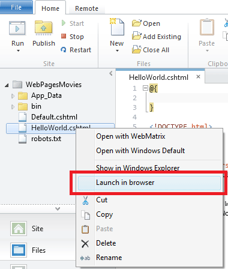

WebMatrix starts a built-in web server (IIS Express) that you can use to test pages on your computer. (Without IIS Express in WebMatrix, you'd have to publish your page to a web server somewhere before you could test it.) The page is displayed in your default browser.

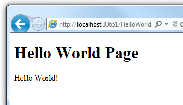

Notice that when you test a page in WebMatrix, the URL in the browser is something like `http://localhost:33651/HelloWorld.cshtml.` The name *localhost* refers to a local server, meaning that the page is served by a web server that's on your own computer. As noted, WebMatrix includes a web server program named IIS Express that runs when you launch a page.

The number after *localhost* (for example, *localhost:33651*) refers to a *port number* on your computer. This is the number of the "channel" that IIS Express uses for this particular website. The port number is selected at random from the range 1024 through 65536 when you create your site, and it's different for every site that you create. (When you test your own site, the port number will almost certainly be a different number than 33561.) By using a different port for each website, IIS Express can keep straight which of your sites it's talking to.

Later when you publish your site to a public web server, you no longer see *localhost* in the URL. At that point, you'll see a more typical URL like `http://myhostingsite/mywebsite/HelloWorld.cshtml` or whatever the page is. You'll learn more about publishing a site later in this tutorial series.

## Adding Some Server-Side Code

Close the browser and go back to the page in WebMatrix.

Add a line to the code block so that it looks like the following code:

[!code-cshtml[Main](getting-started/samples/sample3.cshtml)]

This is a little bit of Razor code. It's probably clear that it gets the current date and time and puts that value into a *variable* named `currentDateTime`. You'll read more about Razor syntax in the next tutorial.

In the body of the page, after the `
Hello World!
` element, add the following:

[!code-html[Main](getting-started/samples/sample4.html)]

This code gets the value that you put into the `currentDateTime` variable at the top and inserts it into the markup of the page. The `@` character marks the ASP.NET Web Pages code in the page.

Run the page again (WebMatrix saves the changes for you before it runs the page). This time you see the date and time in the page.

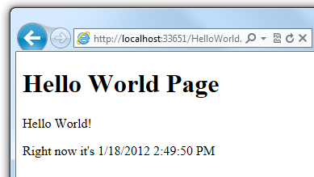

Wait a few moments and then refresh the page in the browser. The date and time display is updated.

In the browser, look at the page source. It looks like the following markup:

[!code-html[Main](getting-started/samples/sample5.html)]

Notice that the `@{ }` block at the top isn't there. Also notice that the date and time display shows an actual string of characters (`1/18/2012 2:49:50 PM` or whatever), not `@currentDateTime` like you had in the *.cshtml* page. What happened here is that when you ran the page, ASP.NET processed all the code (very little in this case) that was marked with `@`. The code produces output, and that output was inserted into the page.

## This Is What ASP.NET Web Pages Are About

When you read that ASP.NET Web Pages produces dynamic web content, what you've seen here is the idea. The page you just created contains the same HTML markup that you've seen before. It can also contain code that can perform all sorts of tasks. In this example, it did the trivial task of getting the current date and time. As you saw, you can intersperse code with the HTML to produce output in the page. When someone requests a *.cshtml* page in the browser, ASP.NET processes the page while it's still in the hands of the web server. ASP.NET inserts the output of the code (if any) into the page as HTML. When the code processing is done, ASP.NET sends the resulting page to the browser. All the browser ever gets is HTML. Here's a diagram:

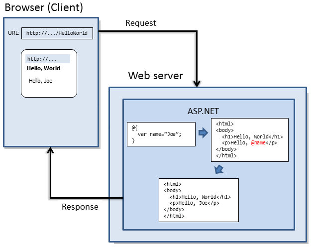

The idea is simple, but there are many interesting tasks that the code can perform, and there are many interesting ways in which you can dynamically add HTML content to the page. And ASP.NET *.cshtml* pages, like any HTML page, can also include code that runs in the browser itself (JavaScript and jQuery code). You'll explore all of these things in this tutorial set and in subsequent ones.

## Coming Up Next

In the next tutorial in this series, you explore ASP.NET Web Pages programming a little more.

## Additional Resources

[Create an ASP.NET website from scratch](https://www.microsoft.com/web/post/create-an-aspnet-website-from-scratch). This is a tutorial that's specifically about using WebMatrix (not ASP.NET Web Pages). It goes into a little more detail about some of the additional features of WebMatrix that we won't cover in this tutorial set.

>[!div class="step-by-step"]
[Next](intro-to-web-pages-programming.md)