Introducing ASP.NET Web Pages - Programming Basics
====================
by [Tom FitzMacken](https://github.com/tfitzmac)

> This tutorial gives you an overview of how to program in ASP.NET Web Pages with Razor syntax.
> 
> What you'll learn:
> 
> - The basic "Razor" syntax that you use for programming in ASP.NET Web Pages.
> - Some basic C#, which is the programming language you'll use.
> - Some fundamental programming concepts for Web Pages.
> - How to install packages (components that contain prebuilt code) to use with your site.
> - How to use *helpers* to perform common programming tasks.
>   
> 
> Features/technologies discussed:
> 
> - NuGet and the package manager.
> - The `Gravatar` helper.

This tutorial is primarily an exercise in introducing you to the programming syntax that you'll use for ASP.NET Web Pages. You'll learn about *Razor syntax* and code that's written in the C# programming language. You got a glimpse of this syntax in the previous tutorial; in this tutorial we'll explain the syntax more.

We promise that this tutorial involves the most programming that you'll see in a single tutorial, and that it's the only tutorial that is *only* about programming. In the remaining tutorials in this set, you'll actually create pages that do interesting things.

You'll also learn about *helpers*. A helper is a component — a packaged-up piece of code — that you can add to a page. The helper performs work for you that otherwise might be tedious or complex to do by hand.

## Creating a Page to Play with Razor

In this section you'll play a bit with Razor so you can get a sense of the basic syntax.

Start WebMatrix if it's not already running. You'll use the website you created in the previous tutorial ([Getting Started With Web Pages](https://go.microsoft.com/fwlink/?LinkId=251578)). To reopen it, click **My Sites** and choose **WebPageMovies**:

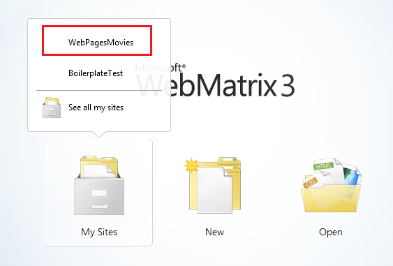

Select the **Files** workspace.

In the ribbon, click **New** to create a page. Select **CSHTML** and name the new page *TestRazor.cshtml*.

Click **OK**.

Copy the following into the file, completely replacing what's there already.

> [!NOTE]
> When you copy code or markup from the examples into a page, the indentation and alignment might not be the same as in the tutorial. Indentation and alignment don't affect how the code runs, though.

[!code-cshtml[Main](intro-to-web-pages-programming/samples/sample1.cshtml)]

## Examining the Example Page

Most of what you see is ordinary HTML. However, at the top there's this code block:

[!code-cshtml[Main](intro-to-web-pages-programming/samples/sample2.cshtml)]

Notice the following things about this code block:

- The @ character tells ASP.NET that what follows is Razor code, not HTML. ASP.NET will treat everything after the @ character as code until it runs into some HTML again. (In this case, that's the &lt;!DOCTYPE&gt; element.
- The braces ( { and } ) enclose a block of Razor code if the code has more than one line. The braces tell ASP.NET where the code for that block starts and ends.
- The // characters mark a comment — that is, a part of the code that won't execute.
- Each statement has to end with a semicolon (;). (Not comments, though.)
- You can store values in *variables*, which you create (*declare*) with the keyword var. When you create a variable, you give it a name, which can include letters, numbers, and underscore (\_). Variable names can't start with a number and can't use the name of a programming keyword (like var).
- You enclose character strings (like "ASP.NET" and "Web Pages") in quotation marks. (They must be double quotation marks.) Numbers are not in quotation marks.
- Whitespace outside of quotation marks doesn't matter. Line breaks mostly don't matter; the exception is that you can't split a string in quotation marks across lines. Indentation and alignment don't matter.

Something that's not obvious from this example is that all code is case sensitive. This means that the variable TheSum is a different variable than variables that might be named theSum or thesum. Similarly, var is a keyword, but Var is not.

### Objects and properties and methods

Then there's the expression DateTime.Now. In simple terms, DateTime is an *object*. An object is a thing that you can program with—a page, a text box, a file, an image, a web request, an email message, a customer record, etc. Objects have one or more *properties* that describe their characteristics. A text box object has a Text property (among others), a request object has a Url property (and others), an email message has a From property and a To property, and so on. Objects also have *methods* that are the "verbs" they can perform. You'll be working with objects a lot.

As you can see from the example, DateTime is an object that lets you program dates and times. It has a property named Now that returns the current date and time.

### Using code to render markup in the page

In the body of the page, notice the following:

[!code-html[Main](intro-to-web-pages-programming/samples/sample3.html)]

Again, the @ character tells ASP.NET that what follows is code, not HTML. In the markup you can add @ followed by a code expression, and ASP.NET will render the value of that expression right at that point. In the example, @a will render whatever the value is of the variable named a, @product renders whatever is in the variable named product, and so on.

You're not limited to variables, though. In a few instances here, the @ character precedes an expression:

- @(a\*b) renders the product of whatever is in the variables a and b. (The \* operator means multiplication.)
- @(technology + " " + product) renders the values in the variables technology and product after concatenating them and adding a space in between. The operator (+) for concatenating strings is the same as the operator for adding numbers. ASP.NET can usually tell whether you're working with numbers or with strings and does the right thing with the + operator.
- @Request.Url renders the Url property of the Request object. The Request object contains information about the current request from the browser, and of course the Url property contains the URL of that current request.

The example is also designed to show you that you can do work in different ways. You can do calculations in the code block at the top, put the results into a variable, and then render the variable in markup. Or you can do calculations in an expression right in the markup. The approach you use depends on what you're doing and, to some extent, on your own preference.

### Seeing the code in action

Right-click the name of the file and then choose **Launch in browser**. You see the page in the browser with all the values and expressions resolved in the page.

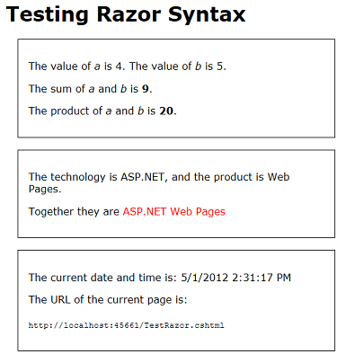

Look at the source in the browser.

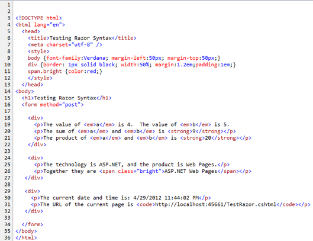

As you expect from your experience in the previous tutorial, none of the Razor code is in the page. All you see are the actual display values. When you run a page, you're actually making a request to the web server that's built into WebMatrix. When the request is received, ASP.NET resolves all the values and expressions and renders their values into the page. It then sends the page to the browser.

> [!TIP] 
> 
> **Razor and C#**
> 
> Up to now we've said that you're working with Razor syntax. That's true, but it's not the complete story. The actual programming language you're using is called *C#*. C# was created by Microsoft over a decade ago and has become one of the primary programming languages for creating Windows apps. All the rules you've seen about how to name a variable and how to create statements and so on are actually all rules of the C# language.
> 
> Razor refers more specifically to the small set of conventions for how you embed this code into a page. For example, the convention of using @ to mark code in the page and using @{ } to embed a code block is the Razor aspect of a page. Helpers are also considered to be part of Razor. Razor syntax is used in more places than just in ASP.NET Web Pages. (For example, it's used in ASP.NET MVC views as well.)
> 
> We mention this because if you look for information about programming ASP.NET Web Pages, you'll find lots of references to Razor. However, a lot of those references don't apply to what you're doing and might therefore be confusing. And in fact, many of your programming questions are really going to be about either working with C# or working with ASP.NET. So if you look specifically for information about Razor, you might not find the answers you need.

## Adding Some Conditional Logic

One of the great features about using code in a page is that you can change what happens based on various conditions. In this part of the tutorial, you'll play around with some ways to change what's displayed in the page.

The example will be simple and somewhat contrived so that we can concentrate on the conditional logic. The page you'll create will do this:

- Show different text on the page depending on whether it's the first time the page is displayed or whether you've clicked a button to submit the page. That will be the first conditional test.
- Display the message only if a certain value is passed in the query string of the URL (http://...?show=true). That will be the second conditional test.

In WebMatrix, create a page and name it *TestRazorPart2.cshtml*. (In the ribbon, click **New**, choose **CSHTML**, name the file, and then click **OK**.)

Replace the contents of that page with the following:

[!code-cshtml[Main](intro-to-web-pages-programming/samples/sample4.cshtml)]

The code block at the top initializes a variable named message with some text. In the body of the page, the contents of the message variable are displayed inside a &lt;p&gt; element. The markup also contains an &lt;input&gt; element to create a **Submit** button.

Run the page to see how it works now. For now, it's basically a static page, even if you click the **Submit** button.

Go back to WebMatrix. Inside the code block, add the following highlighted code *after* the line that initializes message:

[!code-cshtml[Main](intro-to-web-pages-programming/samples/sample5.cshtml?highlight=4-6)]

### The if { } block

What you just added was an if condition. In code, the if condition has a structure like this:

[!code-csharp[Main](intro-to-web-pages-programming/samples/sample6.cs)]

The condition to test is in parentheses. It has to be a value or an expression that returns true or false. If the condition is true, ASP.NET runs the statement or statements that are inside the braces. (Those are the *then* part of the *if-then* logic.) If the condition is false, the block of code is skipped.

Here are a few examples of conditions you can test in an if statement:

[!code-csharp[Main](intro-to-web-pages-programming/samples/sample7.cs)]

You can test variables against values or against expressions by using a *logical operator* or *comparison operator*: equal to (==), greater than (&gt;), less than (&lt;), greater than or equal to (&gt;=), and less than or equal to (&lt;=). The != operator means not equal to — for example, if(a != 0) means *if* *a**is not equal to 0*.

> [!NOTE]
> Make sure you notice that the comparison operator for equals to (==) is not the same as =. The = operator is used only to assign values (var a=2). If you mix these operators up, you'll either get an error or you'll get some strange results.

To test whether something is true, the complete syntax is if(IsDone == true). But you can also use the shortcut if(IsDone). If there's no comparison operator, ASP.NET assumes that you're testing for true.

The ! operator by itself means a logical NOT. For example, the condition if(!IsPost) means *if IsPost is not true*.

You can combine conditions by using a logical AND (&amp;&amp; operator) or logical OR (|| operator). For example, the last of the if conditions in the preceding examples means *if FileProcessingIsDone is not set to true AND displayMessage is set to false*.

### The else block

One final thing about if blocks: an if block can be followed by an else block. An else block is useful is you have to execute different code when the condition is false. Here's a simple example:

[!code-csharp[Main](intro-to-web-pages-programming/samples/sample8.cs)]

You'll see some examples in later tutorials in this series where using an else block is useful.

### Testing whether the request is a submit (post)

There's more, but let's get back to the example, which has the condition if(IsPost){ ... }. IsPost is actually a property of the current page. The first time the page is requested, IsPost returns false. However, if you click a button or otherwise submit the page — that is, you post it — IsPost returns true. So IsPost lets you determine whether you're dealing with a form submission. (In terms of HTTP verbs, if the request is a GET operation, IsPost returns false. If the request is a POST operation, IsPost returns true.) In a later tutorial you'll work with input forms, where this test becomes particularly useful.

Run the page. Because this is the first time you're requested the page, you see "This is the first time you've requested the page". That string is the value that you initialized the message variable to. There's an if(IsPost) test, but that returns false at the moment, so the code inside the if block doesn't run.

Click the **Submit** button. The page is requested again. As before, the message variable is set to "This is the first time ...". But this time, the test if(IsPost) returns true, so the code inside the if block runs. The code changes the value of the message variable to a different value, which is what's rendered in the markup.

Now add an if condition in the markup. Below the &lt;p&gt; element that contains the **Submit** button, add the following markup:

[!code-cshtml[Main](intro-to-web-pages-programming/samples/sample9.cshtml)]

You're adding code inside the markup, so you have to start with @. Then there's an if test similar to the one you added earlier up in the code block. Inside the braces, though, you're adding ordinary HTML — at least, it's ordinary until it gets to @DateTime.Now. This is another little bit of Razor code, so again you have to add @ in front of it.

The point here is that you can add if conditions in both the code block at the top and in the markup. If you use an if condition in the body of the page, the lines inside the block can be markup or code. In that case, and as is true anytime you mix markup and code, you have to use @ to make it clear to ASP.NET where the code is.

Run the page and click **Submit**. This time you not only see a different message when you submit ("Now you've submitted ..."), but you see a new message that lists the date and time.

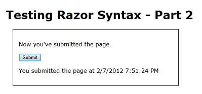

### Testing the value of a query string

One more test. This time, you'll add an if block that tests a value named show that might be passed in the query string. (Like this: ``http://localhost:43097/TestRazorPart2.cshtml`?show=true`) You'll change the page so that the message you've been displaying ("This is the first time ...", etc.) is only displayed if the value of show is true.

At the bottom (but inside) the code block at the top of the page, add the following:

[!code-csharp[Main](intro-to-web-pages-programming/samples/sample10.cs)]

The complete code block now look like the following example. (Remember that when you copy the code into your page, the indentation might look different. But that doesn't affect how the code runs.)

[!code-cshtml[Main](intro-to-web-pages-programming/samples/sample11.cshtml)]

The new code in the block initializes a variable named showMessage to false. It then does an if test to look for a value in the query string. When you first request the page, it has a URL like this one:

`http://localhost:43097/TestRazorPart2.cshtml`

The code determines whether the URL contains a variable named show in the query string, like this version of the URL:

`http://localhost:43097/TestRazorPart2.cshtml`?show=true

The test itself looks at the QueryString property of the Request object. If the query string contains an item named show, and if that item is set to true, the if block runs and sets the showMessage variable to true.

There's a trick here, as you can see. Like the name says, the query string is a string. However, you can only test for true and false if the value you're testing is a Boolean (true/false) value. Before you can test the value of the show variable in the query string, you have to convert it to a Boolean value. That's what the AsBool method does — it takes a string as input and converts it to a Boolean value. Clearly, if the string is "true", the AsBool method converts that value to true. If the value of the string is anything else, AsBool returns false.

> [!TIP] 
> 
> **Data Types and As() Methods**
> 
> We've only said so far that when you create a variable, you use the keyword var. That's not the entire story, though. In order to manipulate values — to add numbers, or concatenate strings, or compare dates, or test for true/false — C# has to work with an appropriate internal representation of the value. C# can *usually* figure out what that representation should be (that is, what *type* the data is) based on what you're doing with the values. Now and then, though, it can't do that. If not, you have to help out by explicitly indicating how C# should represent the data. The AsBool method does that — it tells C# that a string value of "true" or "false" should be treated as a Boolean value. Similar methods exist to represent strings as other types as well, like AsInt (treat as an integer), AsDateTime (treat as a date/time), AsFloat (treat as a floating-point number), and so on. When you use these As( ) methods, if C# can't represent the string value as requested, you'll see an error.

In the markup of the page, remove or comment out this element (here it's shown commented out):

[!code-html[Main](intro-to-web-pages-programming/samples/sample12.html)]

Right where you removed or commented out that text, add the following:

[!code-cshtml[Main](intro-to-web-pages-programming/samples/sample13.cshtml)]

The if test says that if the showMessage variable is true, render a &lt;p&gt; element with the value of the message variable.

### Summary of your conditional logic

In case you're not entirely sure of what you've just done, here's a summary.

- The message variable is initialized to a default string ("This is the first time ...").
- If the page request is the result of a submit (post), the value of message is changed to "Now you've submitted ..."
- The showMessage variable is initialized to false.
- If the query string contains ?show=true, the showMessage variable is set to true.
- In the markup, if showMessage is true, a &lt;p&gt; element is rendered that shows the value of message. (If showMessage is false, nothing is rendered at that point in the markup.)
- In the markup, if the request is a post, a &lt;p&gt; element is rendered that displays the date and time.

Run the page. There's no message, because showMessage is false, so in the markup the if(showMessage) test returns false.

Click **Submit**. You see the date and time, but still no message.

In your browser, go to the URL box and add the following to the end of the URL: ?show=true and then press Enter.

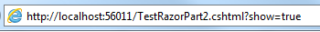

The page is displayed again. (Because you changed the URL, this is a new request, not a submit.) Click **Submit** again. The message is displayed again, as is the date and time.

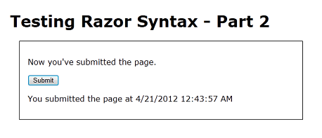

In the URL, change ?show=true to ?show=false and press Enter. Submit the page again. The page is back to how you started — no message.

As noted earlier, the logic of this example is a little contrived. However, if is going to come up in many of your pages, and it will take one or more of the forms you've seen here.

## Installing a Helper (Displaying a Gravatar Image)

Some tasks that people often want to do on web pages require a lot of code or require extra knowledge. Examples: displaying a chart for data; putting a Facebook "Like" button on a page; sending email from your website; cropping or resizing images; using PayPal for your site. To make it easy to do these kinds of things, ASP.NET Web Pages lets you use *helpers*. Helpers are components that you install for a site and that let you perform typical tasks by using just a few lines of Razor code.

ASP.NET Web Pages has a few helpers built in. However, many helpers are available in packages (add-ins) that are provided using the NuGet package manager. NuGet lets you select a package to install and then it takes care of all the details of the installation.

In this part of the tutorial, you'll install a helper that lets you display a Gravatar ("globally recognized avatar") image. You'll learn two things. One is how to find and install a helper. You'll also learn how a helper makes it easy to do something you'd otherwise need to do by using a lot of code you'd have to write yourself.

You can register your own Gravatar at the Gravatar website at [http://www.gravatar.com/](http://www.gravatar.com/), but it is not essential to create a Gravatar account to perform this part of the tutorial.

In WebMatrix, click the **NuGet** button.

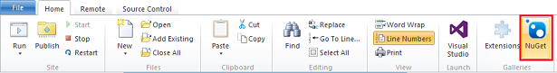

This launches the NuGet package manager and displays available packages. (Not all of the packages are helpers; some add functionality to WebMatrix itself, some are additional templates, and so on.) You may get an error message about version incompatibility. You can ignore this error message by clicking **OK** and proceeding with this tutorial.

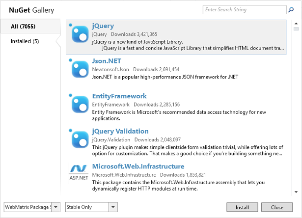

In the search box, enter "asp.net helpers". NuGet shows the packages that match the search terms.

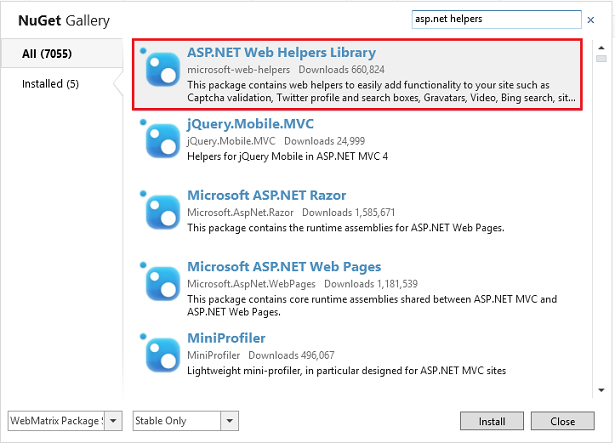

The ASP.NET Web Helpers Library contains code to simplify many common tasks, including the use of Gravatar images. Select the **ASP.NET Web Helpers Library** package and then click **Install** to launch the installer. Select **Yes** when asked if you want to install the package, and accept the terms to complete the installation.

That's it. NuGet downloads and installs everything, including any additional components that might be required (*dependencies*).

If for some reason you have to uninstall a helper, the process is very similar. Click the **NuGet** button, click the **Installed** tab, and pick the package you want to uninstall.

## Using a Helper in a Page

Now you'll use the helper that you just installed. The process for adding a helper to a page is similar for most helpers.

In WebMatrix, create a page and name it *GravatarTest.cshml*. (You're creating a special page to test the helper, but you can use helpers in any page in your site.)

Inside the &lt;body&gt; element, add a &lt;div&gt; element. Inside the &lt;div&gt; element, type this:

@Gravatar.

The @ character is the same character you've been using to mark Razor code. **Gravatar** is the helper object that you're working with.

As soon as you type the period (.), WebMatrix displays a list of *methods* (functions) that the Gravatar helper makes available:

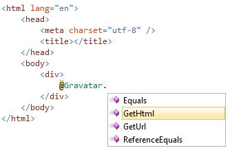

This feature is known as *IntelliSense*. It helps you code by providing context-appropriate choices. IntelliSense works with HTML, CSS, ASP.NET code, JavaScript, and other languages that are supported in WebMatrix. It's another feature that makes it easier to develop web pages in WebMatrix.

Press G on the keyboard, and you see that IntelliSense finds the GetHtml method. Press Tab. IntelliSense inserts the selected method (GetHtml) for you. Type an open parenthesis, and notice that the closing parenthesis is automatically added. Type your email address in quotation marks between the two parenthesis. If you have a Gravatar account, your profile picture will be returned. If you do not have a Gravatar account, a default image is returned. When you're done, the line looks like this:

[!code-css[Main](intro-to-web-pages-programming/samples/sample14.css)]

Now view the page in a browser. Either your picture or the default image is displayed, depending on whether you have a Gravatar account.

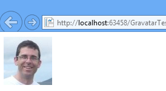 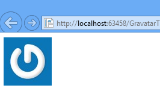

To get an idea of what the helper is doing for you, view the source of the page in the browser. Along with the HTML that you had in your page, you see an image element that includes an identifier. This is code that the helper rendered into the page at the place where you had @Gravatar.GetHtml. The helper took the information you provided and generated the code that talks directly to Gravatar in order to get back the correct image for supplied account.

The GetHtml method also enables you to customize the image by providing other parameters. The following code shows how to request an image has a width and height of 40 pixels, and uses a specified default image named **wavatar** if the specified account does not exist.

[!code-javascript[Main](intro-to-web-pages-programming/samples/sample15.js)]

This code produces something like the following result (the default image will randomly vary).

## Coming Up Next

To keep this tutorial short, we had to focus on only a few basics. Naturally, there's a *lot* more to Razor and C#. You'll learn more as you go through these tutorials. If you're interested in learning more about the programming aspects of Razor and C# right now, you can read a more thorough introduction here: [Introduction to ASP.NET Web Programming Using the Razor Syntax](https://go.microsoft.com/fwlink/?LinkID=202890).

The next tutorial introduces you to working with a database. In that tutorial, you'll begin creating the sample application that lets you list your favorite movies.

## Complete Listing for TestRazor Page

[!code-cshtml[Main](intro-to-web-pages-programming/samples/sample16.cshtml)]

## Complete Listing for TestRazorPart2 Page

[!code-cshtml[Main](intro-to-web-pages-programming/samples/sample17.cshtml)]

## Complete Listing for GravatarTest Page

[!code-cshtml[Main](intro-to-web-pages-programming/samples/sample18.cshtml)]

## Additional Resources

- [Introduction to ASP.NET Web Programming Using the Razor Syntax](https://go.microsoft.com/fwlink/?LinkID=202890)
- [Twitter helper](../../ui-layouts-and-themes/twitter-helper.md)

>[!div class="step-by-step"]
[Previous](getting-started.md)
[Next](displaying-data.md)