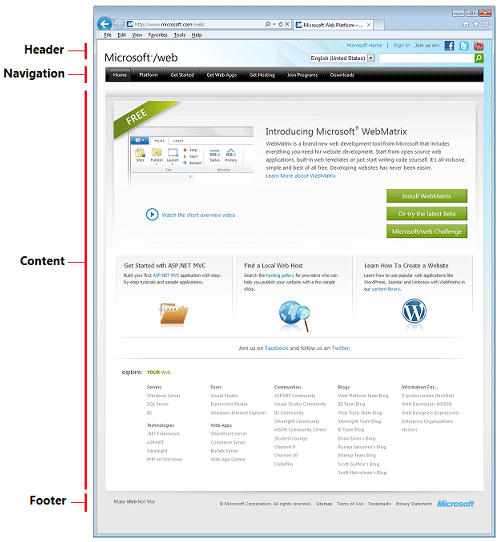
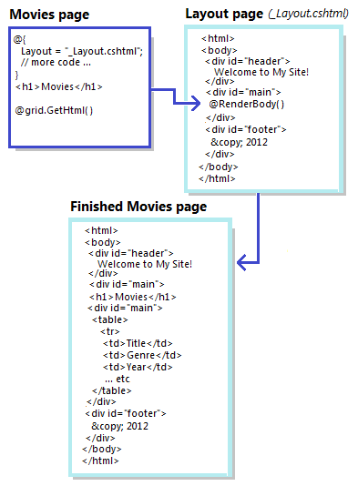
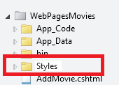
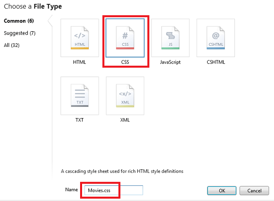
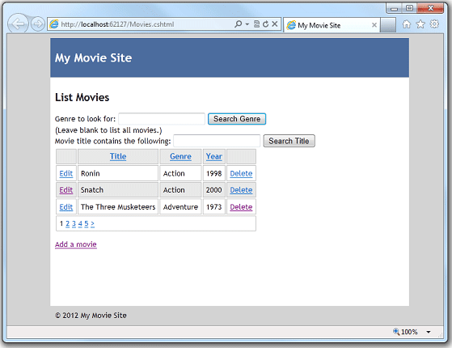
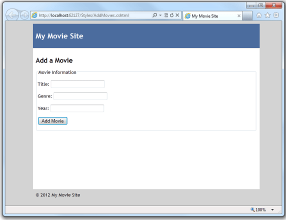
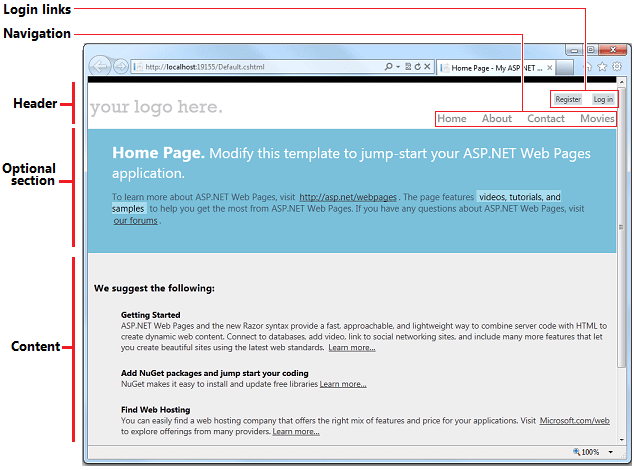

Introducing ASP.NET Web Pages - Creating a Consistent Layout
====================
by [Tom FitzMacken](https://github.com/tfitzmac)

> This tutorial shows you how to use *layouts* to create a consistent look for the pages on a site that uses ASP.NET Web Pages. It assumes you have completed the series through [Deleting Database Data in ASP.NET Web Pages](https://go.microsoft.com/fwlink/?LinkId=251584).
> 
> What you'll learn:
> 
> - What a layout page is.
> - How to combine layout pages with dynamic content.
> - How to pass values to a layout page.

## About Layouts

The pages you've created so far have all been complete, standalone pages. They all belong to the same site, but they don't have any common elements or a standard look.

Most sites do have a consistent look and layout. For example, if you go to the [Microsoft.com/web](https://www.microsoft.com/web/) site and look around, you see that the pages all adhere to an overall layout and to a visual theme:

An *inefficient* way to create this layout would be to define a header, navigation bar, and footer separately on each of your pages. You'd be duplicating the same markup each time. If you wanted to change something (for example, update the footer), you'd have to change each page separately.

That's where *layout pages* come in. In ASP.NET Web Pages, you can define a layout page that provides an overall container for pages on your site. For example, the layout page can contain the header, navigation area, and footer. The layout page includes a placeholder where the main content goes.

You can then define individual content pages that contain the markup and the code for only that page. Content pages don't have to be complete HTML pages; they don't even have to have a `<body>` element. They also have a line of code that tells ASP.NET what layout page you want to display the content in. Here's a picture that shows roughly how this relationship works:

This interaction is easy to understand when you see it in action. In this tutorial, you'll change your movies pages to use a layout.

## Adding a Layout Page

You'll start by creating a layout page that defines a typical page layout with a header, footer, and an area for the main content. In the WebPagesMovies site, add a CSHTML page named *\_Layout.cshtml*.

The leading underscore ( `_` ) character is significant. If a page's name starts with an underscore, ASP.NET won't directly send that page to the browser. This convention lets you define pages that are required for your site but that users shouldn't be able to request directly.

Replace the content in the page with the following:

    <!DOCTYPE html>
    <html>
      <head>
        <title>My Movie Site</title>
        <link href="~/Styles/Movies.css" rel="stylesheet" type="text/css" />
      </head>
      <body>
        

            

              <h1>My Movie Site</h1>
            

            

              @RenderBody()
            

            

              &copy; @DateTime.Now.Year My Movie Site
            

        

      </body>
    </html>

As you can see, this markup is just HTML that uses `
` elements to define three sections in the page plus one more `
` element to hold the three sections. The footer contains a bit of Razor code: `@DateTime.Now.Year`, which will render the current year at that location in the page.

Notice that there's a link to a style sheet named *Movies.css*. The style sheet is where the details of the physical layout of the elements will be defined. You'll create that in a moment.

The only unusual feature in this *\_Layout.cshtml* page is the `@Render.Body()` line. That's the placeholder where the content will go when this layout is merged with another page.

## Adding a .css File

The preferred way to define the actual arrangement (that is, appearance) of elements on the page is to use cascading style sheet (CSS) rules. So you'll create a *.css* file that has the rules for your new layout.

In WebMatrix, select the root of your site. Then in the **Files** tab of the ribbon, click the arrow under the **New** button and then click **New Folder**.

Name the new folder *Styles*.

Inside the new *Styles* folder, create a file named *Movies.css*.

Replace the contents of the new *.css* file with the following:

    html{ height:100%; margin:0; padding:0; }
    
    body {
      height:60%;
      font-family:'Trebuchet MS',  'Arial', 'Helvetica', 'sans-serif';
      font-size:10pt;
      background-color: LightGray;
      line-height:1.6em;
    }
    
    h1{ font-size:1.6em; }
    h2{ font-size:1.4em; }
    
    #container{
       min-height:100%;
       position:relative;
       left:10%;
    }
    
    #header{
      padding:8px;
      width:80%;
      background-color:#4b6c9e;
      color:White;
    }
    
    #main{
      width:80%;
      padding: 8px;
      padding-bottom:4em;
      background-color:White;
    }
    
    #footer{
      width:80%;
      height:2em;
      padding:8px;
      margin-top:-2em;
      background-color:LightGray;
    }
    
    .head { background-color: #E8E8E8; font-weight: bold; color: #FFF; }
    .grid th, .grid td { border: 1px solid #C0C0C0; padding: 5px; }
    .alt { background-color: #E8E8E8; color: #000; }
    .selected {background-color:Yellow;}
    span.caption {width:100px;}
    span.dataDisplay {font-weight:bold;}

We won't say much about these CSS rules, except to note two things. One is that in addition to setting fonts and sizes, the rules use absolute positioning to establish the location of the header, footer, and main content area. If you're new to positioning in CSS, you can read the [CSS Positioning](http://www.w3schools.com/css/css_positioning.asp) tutorial at the W3Schools site.

The other thing to note is that at the bottom, we've copied the style rules that were originally defined individually in the *Movies.cshtml* file. These rules were used in the [Introduction to Displaying Data by Using ASP.NET Web Pages](https://go.microsoft.com/fwlink/?LinkId=251580) tutorial to make the `WebGrid` helper render markup that added stripes to the table. (If you're going to use a *.css* file for style definitions, you might as well put the style rules for the whole site in it.)

## Updating the Movies File to Use the Layout

Now you can update the existing files in your site to use the new layout. Open the *Movies.cshtml* file. At the top, as the first line of code, add the following:

    Layout = "~/_Layout.cshtml";

The page now starts out this way:

[!code[Main](layouts/samples/sample1.xml?highlight=2)]

This one line of code tells ASP.NET that when the *Movies* page runs, it should be merged with the *\_Layout.cshtml* file.

Since the *Movies.cshtml* file now uses a layout page, you can remove the markup from the *Movies.cshtml* page that's taken care of by the *\_Layout.cshtml* file. Take out the `<!DOCTYPE>`, `<html>`, and `<body>` opening and closing tags. Take out the entire `<head>` element and its contents, which includes the style rules for the grid, since you've now got those rules in a *.css* file. While you're at it, change the existing `<h1>` element to an `<h2>` element; you have an `<h1>` element in the layout page already. Change the `<h2>` text to "List Movies".

Normally you wouldn't have to make these sorts of changes in a content page. When you start your site out with a layout page, you create content pages without all these elements to begin with. In this case, though, you're converting a standalone page to one that uses a layout, so there's a bit of cleanup.

When you're finished, the *Movies.cshtml* page will look like the following:

    @{
        Layout = "~/_Layout.cshtml";
    
        var db = Database.Open("WebPagesMovies") ;
        var selectCommand = "SELECT * FROM Movies";
        var searchTerm = "";
    
        if(!Request.QueryString["searchGenre"].IsEmpty() ) {
            selectCommand = "SELECT * FROM Movies WHERE Genre = @0";
            searchTerm = Request.QueryString["searchGenre"];
        }
    
        if(!Request.QueryString["searchTitle"].IsEmpty() ) {
          selectCommand = "SELECT * FROM Movies WHERE Title LIKE @0";
          searchTerm = "%" + Request.QueryString["searchTitle"] + "%";
        }
    
        var selectedData = db.Query(selectCommand, searchTerm);
        var grid = new WebGrid(source: selectedData, defaultSort: "Genre", rowsPerPage:3);
    }
      <h2>List Movies</h2>
      <form method="get">
        

          <label for="searchGenre">Genre to look for:</label>
          <input type="text" name="searchGenre"
             value="@Request.QueryString["searchGenre"]" />
          <input type="Submit" value="Search Genre" /> 
          (Leave blank to list all movies.) 
        

        

           <label for="SearchTitle">Movie title contains the following:</label>
           <input type="text" name="searchTitle" value="@Request.QueryString["searchTitle"]" />
           <input type="Submit" value="Search Title" /> 
        

      </form>
      

        @grid.GetHtml(
            tableStyle: "grid",
            headerStyle: "head",
            alternatingRowStyle: "alt",
            columns: grid.Columns(
                grid.Column(format: @<a href="~/EditMovie?id=@item.ID">Edit</a>),
                grid.Column("Title"),
                grid.Column("Genre"),
                grid.Column("Year"),
                grid.Column(format: @<a href="~/DeleteMovie?id=@item.ID">Delete</a>)
           )
        )
      

      
<a href="~/AddMovie">Add a movie</a>

### Testing the Layout

Now you can see what the layout looks like. In WebMatrix, right-click the *Movies.cshtml* page and select **Launch in browser**. When the browser displays the page, it looks like this page:

ASP.NET has merged the content of the Movies.cshtml page into the *\_Layout.cshtml* page right where the `RenderBody` method is. And of course the *\_Layout.cshtml* page references a *.css* file that defines the look of the page.

## Updating the AddMovie Page to Use the Layout

The real benefit of layouts is that you can use them for all the pages in your site. Open the *AddMovie.cshtml* page.

You might remember that the *AddMovie.cshtml* page originally had some CSS rules in it to define the look of validation error messages. Since you have a *.css* file for your site now, you can move those rules to the *.css* file. Remove them from the *AddMovie.cshtml* file and add them to the bottom of the *Movies.css* file. You are moving the following rules:

    .field-validation-error {
      font-weight:bold;
      color:red;
      background-color:yellow;
     }
    .validation-summary-errors{
      border:2px dashed red;
      color:red;
      background-color:yellow;
      font-weight:bold;
      margin:12px;
    }

Now make the same sorts of changes in *AddMovie.cshtml* that you did for *Movies.cshtml* — add `Layout="~/_Layout.cshtml;` and remove the HTML markup that's now extraneous. Change the `<h1>` element to `<h2>`. When you're done, the page will look like this example:

    @{
        Layout = "~/_Layout.cshtml";
        Validation.RequireField("title", "You must enter a title");
        Validation.RequireField("genre", "Genre is required");
        Validation.RequireField("year", "You haven't entered a year");
    
        var title = "";
        var genre = "";
        var year = "";
    
        if(IsPost){
            if(Validation.IsValid()){
                title = Request.Form["title"];
                genre = Request.Form["genre"];
                year = Request.Form["year"];
    
                var db = Database.Open("WebPagesMovies");
                var insertCommand =
                    "INSERT INTO Movies (Title, Genre, Year) Values(@0, @1, @2)";
                db.Execute(insertCommand, title, genre, year);
                Response.Redirect("~/Movies");
            }
        }
    }
      <h2>Add a Movie</h2>
        @Html.ValidationSummary()
     <form method="post">
      <fieldset>
        <legend>Movie Information</legend>
        
<label for="title">Title:</label>
          <input type="text" name="title" value="@Request.Form["title"]" />
          @Html.ValidationMessage("title")
        

    
        
<label for="genre">Genre:</label>
          <input type="text" name="genre" value="@Request.Form["genre"]" />
          @Html.ValidationMessage("genre")
        

    
        
<label for="year">Year:</label>
          <input type="text" name="year" value="@Request.Form["year"]" />
          @Html.ValidationMessage("year")
        

    
        
<input type="submit" name="buttonSubmit" value="Add Movie" />

      </fieldset>
      </form>

Run the page. Now it looks like this illustration:

You want to make similar changes to the pages in the site — *EditMovie.cshtml* and *DeleteMovie.cshtml*. However, before you do, you can make another change to the layout that makes it a little more flexible.

## Passing Title Information to the Layout Page

The *\_Layout.cshtml* page that you created has a `<title>` element that's set to "My Movie Site". Most browsers display the content of this element as the text on a tab:

This title information is generic. Suppose that you want the title text to be more specific to the current page. (The title text is also used by search engines to determine what your page is about.) You can pass information from a content page like *Movies.cshtml* or *AddMovie.cshtml* to the layout page, and then use that information to customize what the layout page renders.

Open the *Movies.cshtml* page again. In the code at the top, add the following line:

    Page.Title = "List Movies";

The `Page` object is available on all *.cshtml* pages and is for this purpose, namely to share information between a page and its layout.

Open the*\_Layout.cshtml* page. Change the `<title>` element so that it looks like this markup:

    <title>@Page.Title</title>

This code renders whatever is in the `Page.Title` property right at that location in the page.

Run the *Movies.cshtml* page. This time the browser tab shows what you passed as the value of `Page.Title`:

If you want, view the page source in the browser. You can see that the `<title>` element is rendered as `<title>List Movies</title>`.

> [!TIP] 
> 
> ### The Page Object
> 
> A useful feature of `Page` is that it's a dynamic object — the `Title` property is not a fixed or reserved name. You can use *any* name for a value of the `Page` object. For example, you could as easily have passed the title by using a property named `Page.CurrentName` or `Page.MyPage`. The only restriction is that the name has to follow the normal rules for what properties can be named. (For example, the name can't contain a space.)
> 
> You can pass any number of values by using the `Page` object. If you wanted to pass movie information to the layout page, you could pass values by using something like `Page.MovieTitle` and `Page.Genre` and `Page.MovieYear`. (Or any other names that you invented to store the information.) The only requirement — which is probably obvious — is that you have to use the same names in the content page and the layout page.
> 
> The information you pass by using the `Page` object isn't limited to just text to display on the layout page. You can pass a value to the layout page, and then code in the layout page can use the value to decide whether to display a section of the page, what *.css* file to use, and so on. The values you pass in the `Page` object are like any other values that you use in code. It's just that the values originate in the content page and are passed to the layout page.

Open the *AddMovie.cshtml* page and add a line to the top of the code that provides a title for the *AddMovie.cshtml* page:

    Page.Title = "Add a Movie";

Run the *AddMovie.cshtml* page. You see the new title there:

## Updating the Remaining Pages to Use the Layout

Now you can finish the remaining pages in your site so that they use the new layout. Open *EditMovie.cshtml* and *DeleteMovie.cshtml* in turn and make the same changes in each.

Add the line of code that links to the layout page:

    Layout = "~/_Layout.cshtml";

Add a line to set the title of the page:

    Page.Title = "Edit a Movie";

or:

    Page.Title = "Delete a Movie";

Remove all the extraneous HTML markup — basically, leave only the bits that are inside the `<body>` element (plus the code block at the top).

Change the `<h1>` element to be an `<h2>` element.

When you've made these changes, test each and make sure that it's displaying properly and that the title is correct.

## Parting Thoughts About Layout Pages

In this tutorial you created a *\_Layout.cshtml* page and used the `RenderBody` method to merge content from another page. That's the basic pattern for using layouts in Web Pages.

Layout pages have additional features that we didn't cover here. For example, you can nest layout pages — one layout page can in turn reference another. Nested layouts can be useful if you're working with subsections of a site that require different layouts. You can also use additional methods (for example, `RenderSection`) to set up named sections in the layout page.

The combination of layout pages and *.css* files is powerful. As you'll see in the next tutorial series, in WebMatrix you can create a site based on a *template*, which gives you a site that has prebuilt functionality in it. The templates make good use of layout pages and CSS to create sites that look great and that have features like menus. Here's a screenshot of the home page from a site based on a template, showing features that use layout pages and CSS:

## Complete Listing for Movie Page (Updated to Use a Layout Page)

    @{
        Layout = "~/_Layout.cshtml";
        Page.Title = "List Movies";
    
        var db = Database.Open("WebPagesMovies") ;
        var selectCommand = "SELECT * FROM Movies";
        var searchTerm = "";
    
        if(!Request.QueryString["searchGenre"].IsEmpty() ) {
            selectCommand = "SELECT * FROM Movies WHERE Genre = @0";
            searchTerm = Request.QueryString["searchGenre"];
        }
    
        if(!Request.QueryString["searchTitle"].IsEmpty() ) {
            selectCommand = "SELECT * FROM Movies WHERE Title LIKE @0";
            searchTerm = "%" + Request.QueryString["searchTitle"] + "%";
        }
    
        var selectedData = db.Query(selectCommand, searchTerm);
        var grid = new WebGrid(source: selectedData, defaultSort: "Genre", rowsPerPage:3);
    }
    
    <h2>List Movies</h2>
        <form method="get">
          

            <label for="searchGenre">Genre to look for:</label>
            <input type="text" name="searchGenre" value="@Request.QueryString["searchGenre"]" />
            <input type="Submit" value="Search Genre" /> 
            (Leave blank to list all movies.) 
          

    
          

            <label for="SearchTitle">Movie title contains the following:</label>
            <input type="text" name="searchTitle" value="@Request.QueryString["searchTitle"]" />
            <input type="Submit" value="Search Title" /> 
          

        </form>
    
    

        @grid.GetHtml(
            tableStyle: "grid",
            headerStyle: "head",
            alternatingRowStyle: "alt",
            columns: grid.Columns(
        grid.Column(format: @<a href="~/EditMovie?id=@item.ID">Edit</a>),
        grid.Column("Title"),
        grid.Column("Genre"),
        grid.Column("Year"),
        grid.Column(format: @<a href="~/DeleteMovie?id=@item.ID">Delete</a>)
            )
        )
    

    
<a href="~/AddMovie">Add a movie</a>

## Complete Page Listing for Add Movie Page (Updated for Layout)

    @{
        Layout = "~/_Layout.cshtml";
        Page.Title = "Add a Movie";
    
        Validation.RequireField("title", "You must enter a title");
        Validation.RequireField("genre", "Genre is required");
        Validation.RequireField("year", "You haven't entered a year");
    
        var title = "";
        var genre = "";
        var year = "";
    
        if(IsPost){
            if(Validation.IsValid()){
                title = Request.Form["title"];
                genre = Request.Form["genre"];
                year = Request.Form["year"];
    
                var db = Database.Open("WebPagesMovies");
                var insertCommand = "INSERT INTO Movies (Title, Genre, Year) VALUES(@0, @1, @2)";
                db.Execute(insertCommand, title, genre, year);
    
                Response.Redirect("~/Movies");
            }
        }
    }
    
    <h2>Add a Movie</h2>
    @Html.ValidationSummary()
    <form method="post">
    <fieldset>
        <legend>Movie Information</legend>
        
<label for="title">Title:</label>
            <input type="text" name="title" value="@Request.Form["title"]" />
            @Html.ValidationMessage("title")
    
        
<label for="genre">Genre:</label>
            <input type="text" name="genre" value="@Request.Form["genre"]" />
            @Html.ValidationMessage("genre")
    
        
<label for="year">Year:</label>
            <input type="text" name="year" value="@Request.Form["year"]" />
            @Html.ValidationMessage("year")
    
        
<input type="submit" name="buttonSubmit" value="Add Movie" />

    </fieldset>
    </form>

## Complete Page Listing for Delete Movie Page (Updated for Layout)

    @{
        Layout = "~/_Layout.cshtml";
        Page.Title = "Delete a Movie";
    
        var title = "";
        var genre = "";
        var year = "";
        var movieId = "";
    
        if(!IsPost){
            if(!Request.QueryString["ID"].IsEmpty() && Request.QueryString["ID"].AsInt() > 0){
                movieId = Request.QueryString["ID"];
                var db = Database.Open("WebPagesMovies");
                var dbCommand = "SELECT * FROM Movies WHERE ID = @0";
                var row = db.QuerySingle(dbCommand, movieId);
                if(row != null) {
                    title = row.Title;
                    genre = row.Genre;
                    year = row.Year;
                }
                else{
                    Validation.AddFormError("No movie was found for that ID.");
                    // If you are using a version of ASP.NET Web Pages 2 that's
                    // earlier than the RC release, comment out the preceding
                    // statement and uncomment the following one.
                    //ModelState.AddFormError("No movie was found for that ID.");
                }
            }
            else{
                Validation.AddFormError("No movie was found for that ID.");
                // If you are using a version of ASP.NET Web Pages 2 that's
                // earlier than the RC release, comment out the preceding
                // statement and uncomment the following one.
                //ModelState.AddFormError("No movie was found for that ID.");
            }
        }
    
        if(IsPost && !Request["buttonDelete"].IsEmpty()){
            movieId = Request.Form["movieId"];
            var db = Database.Open("WebPagesMovies");
            var deleteCommand = "DELETE FROM Movies WHERE ID = @0";
            db.Execute(deleteCommand, movieId);
            Response.Redirect("~/Movies");
        }
    
    }
    
    <h2>Delete a Movie</h2>
    @Html.ValidationSummary()
    
<a href="~/Movies">Return to movie listing</a>

    
    <form method="post">
    <fieldset>
    <legend>Movie Information</legend>
    
    
Title:
        @title

    
    
Genre:
        @genre

    
    
Year:
        @year

    
    <input type="hidden" name="movieid" value="@movieId" />
    
<input type="submit" name="buttonDelete" value="Delete Movie" />

    </fieldset>
    </form>

## Complete Page Listing for Edit Movie Page (Updated for Layout)

    @{
        Layout = "~/_Layout.cshtml";
        Page.Title = "Edit a Movie";
    
        var title = "";
        var genre = "";
        var year = "";
        var movieId = "";
    
        if(!IsPost){
            if(!Request.QueryString["ID"].IsEmpty() && Request.QueryString["ID"].IsInt()) {
                movieId = Request.QueryString["ID"];
                var db = Database.Open("WebPagesMovies");
                var dbCommand = "SELECT * FROM Movies WHERE ID = @0";
                var row = db.QuerySingle(dbCommand, movieId);
    
                if(row != null) {
                    title = row.Title;
                    genre = row.Genre;
                    year = row.Year;
                }
                else{
                    Validation.AddFormError("No movie was selected.");
                    // If you are using a version of ASP.NET Web Pages 2 that's
                    // earlier than the RC release, comment out the preceding
                    // statement and uncomment the following one.
                    //ModelState.AddFormError("No movie was selected.");
                }
            }
            else{
                Validation.AddFormError("No movie was selected.");
                // If you are using a version of ASP.NET Web Pages 2 that's
                // earlier than the RC release, comment out the preceding
                // statement and uncomment the following one.
                //ModelState.AddFormError("No movie was selected.");
            }
        }
    
        if(IsPost){
            Validation.RequireField("title", "You must enter a title");
            Validation.RequireField("genre", "Genre is required");
            Validation.RequireField("year", "You haven't entered a year");
            Validation.RequireField("movieid", "No movie ID was submitted!");
    
            title = Request.Form["title"];
            genre = Request.Form["genre"];
            year = Request.Form["year"];
            movieId = Request.Form["movieId"];
    
            if(Validation.IsValid()){
                var db = Database.Open("WebPagesMovies");
                var updateCommand = "UPDATE Movies SET Title=@0, Genre=@1, Year=@2 WHERE Id=@3";
                db.Execute(updateCommand, title, genre, year, movieId);
                Response.Redirect("~/Movies");
            }
        }
    }
    
    <h2>Edit a Movie</h2>
    @Html.ValidationSummary()
    <form method="post">
    <fieldset>
        <legend>Movie Information</legend>
    
        
<label for="title">Title:</label>
            <input type="text" name="title" value="@title" />

    
        
<label for="genre">Genre:</label>
            <input type="text" name="genre" value="@genre" />

    
        
<label for="year">Year:</label>
            <input type="text" name="year" value="@year" />

    
        <input type="hidden" name="movieid" value="@movieId" />
    
        
<input type="submit" name="buttonSubmit" value="Submit Changes" />

    </fieldset>
    </form>
    
<a href="~/Movies">Return to movie listing</a>

## Coming Up Next

In the next tutorial, you'll learn how to publish your site to the Internet so everyone can see it.

## Additional Resources

- [Creating a Consistent Look](https://go.microsoft.com/fwlink/?LinkID=202891) — An article that provides some more detail on working with layouts. It also describes how to pass a value to a layout page that shows or hides some of the content.
- [Nested Layout Pages with Razor](http://www.mikesdotnetting.com/Article/164/Nested-Layout-Pages-with-Razor) — Mike Brind blogs an example of how to nest layout pages. (Includes a download of the pages.)

>[!div class="step-by-step"] [Previous](deleting-data.md) [Next](publishing.md)