Introducing ASP.NET Web Pages - Publishing a Site by Using WebMatrix
====================
by [Tom FitzMacken](https://github.com/tfitzmac)

> This tutorial is the final installment in the tutorial set that introduces ASP.NET Web Pages and Microsoft WebMatrix. It discusses how to publish your site to the Internet so that others can work with it. It assumes you have completed the series through [Creating a Consistent Look for ASP.NET Web Pages Sites](https://go.microsoft.com/fwlink/?LinkId=251585).
> 
> You'll learn how to publish your site using:
> 
> - Microsoft Azure
> - Web Hosting Company

## About Publishing Your Site

Up to now, you've done all your work on a local computer, including testing your pages. To run your*.cshtml* pages, you've used the web server that's built into WebMatrix, namely IIS Express. But of course no one can see the site you've created except you. To let others work with your site, you have to publish it to the Internet.

Unless you have access to a public web server already, publishing means that you have to have an account with a *cloud platform* or a *hosting provider*. A cloud platform, such as Microsoft Azure, provides on-demand infrastructure for your applications. A hosting provider is a company that owns publicly accessible web servers and that will rent you space for your site. Hosting plans run from a few dollars a month (or even free) for small sites to many hundreds of dollars a month for high-volume commercial websites.

> [!NOTE]
> You might have access to a public web server via the internet service provider (ISP) that you use to get internet service at home. However, your hosting provider must support ASP.NET Web Pages. Many ISPs don't, but it's always worth checking.

In this tutorial, we'll give you an overview of how to publish. It's not practical to provide exact details for everything, because the process differs a bit for every hosting provider. But you'll get a good idea of how the process works.

This tutorial contains four sections:

1. [Setting up the default page](#defaultpage)
2. Publishing (choose one of the following)  
 a. [Publishing Your Site to Microsoft Azure](#azure)  
 b. [Publishing Your Site to a Web Hosting Company](#host)
3. [Updating the Live Site: Republishing](#update)

## Setting up the default page

When a user navigates to the base address for your web site, the default page for your site is displayed to the user. For example, when Default.htm is set as the default page for the site at www.contoso.com, then navigating to **www.contoso.com** is the same as navigating to **www.contoso.com/Default.htm**.

Currently, your site uses **Default.cshtml** as the default page. This page is fine for your default page, but in this tutorial you have not added any content to that page so it would display a blank page. Open Default.cshtml and replace the content with the following code.

[!code-cshtml[Main](publishing/samples/sample1.cshtml)]

Now your site is ready for publication. First, you will see how to deploy the site to Azure, and then how to deploy it to a web hosting company. Either option works for your web site, and you only need to follow one of the deployment options.

## Publishing Your Site to Microsoft Azure

This tutorial will first show you how to deploy your site to Microsoft Azure. By signing in with a Microsoft account, you can create up to 10 free sites on Azure. These free sites provide a convenient way to test your sites. You can always delete this example site later to avoid using all of your free sites. You can create a free trial account in just a couple of minutes. For details, see [Azure Free Trial](https://www.windowsazure.com/en-us/pricing/free-trial/?WT.mc_id=A443DD604).

In the WebMatrix ribbon, click the **Publish** button.

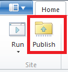

The **Publish Your Site** dialog box is displayed. If you have not signed in to your Microsoft account, the dialog box will contain a **Get started with Azure** link. Click this link.

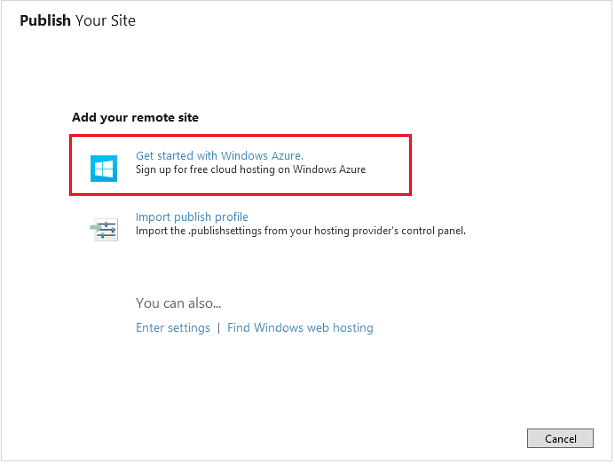

If you have not signed in to a Microsoft account, you are again given the opportunity to sign in. You must sign in to a Microsoft account to publish your site on Azure.

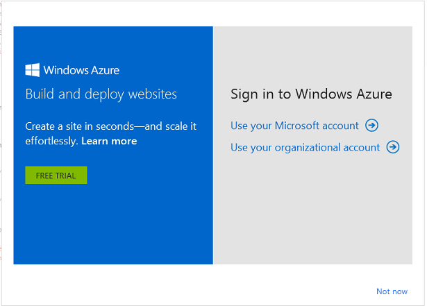

After signing in to your Microsoft account, the dialog box contains links to create a new site on Azure or connect to one of your existing sites on Azure.

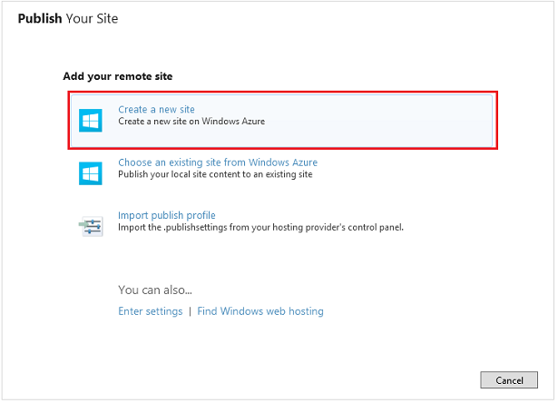

Select **Create a new site**.

If you named your project **WebPagesMovies**, the default name for your site will be **webpagesmovies.azurewebsites.net**. This default name is most likely not available, as indicated by the red exclamation mark.

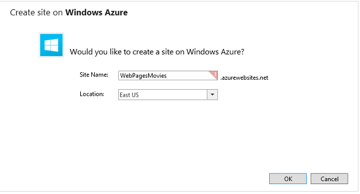

Change the site name to something that is available, and select a location that is close to your location.

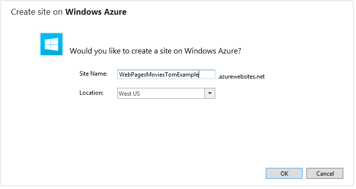

Click **OK**.

WebMatrix performss a test to determine if the server is compatible with your site.

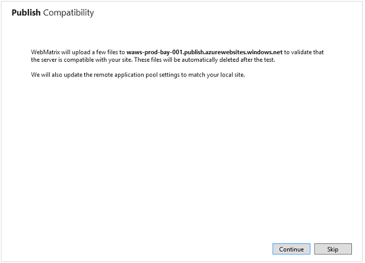

Select **Continue**.

The results of the compatibility test are displayed.

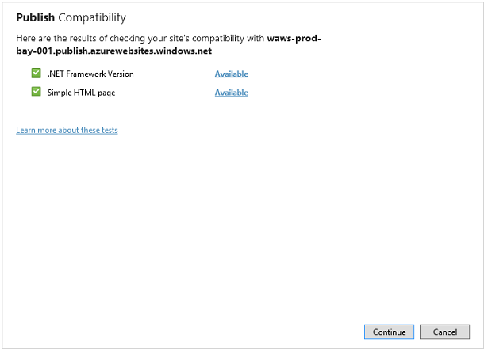

Select **Continue**.

WebMatrix displays the files and databases that will be published to the site. Since this is the first time you are publishing the site, all of the files are listed. You can uncheck a file that is not ready to be published. In the subsequent publications, only the files that have changed will be displayed. See [Updating the Live Site: Republishing](#update).

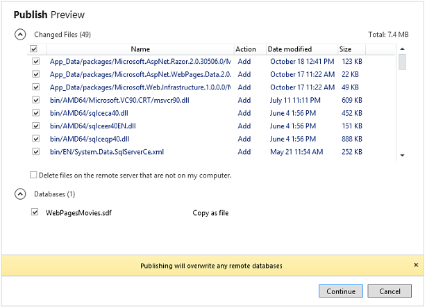

Select **Continue**.

After the site has been deployed to Azure, a message is displayed that indicates the deployment has completed.

Your site and database have been published to Azure, and are now available to the public. Click the link in the message indicating publishing has completed, and you will now see your deployed site. You or anyone with Internet access can add or modify records in the database.

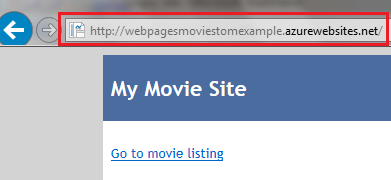

## Publishing Your Site to a Web Hosting Company

If you decide to not publish to Azure, you can instead publish your site to a web hosting company.

Click the **Find web hosting** link.

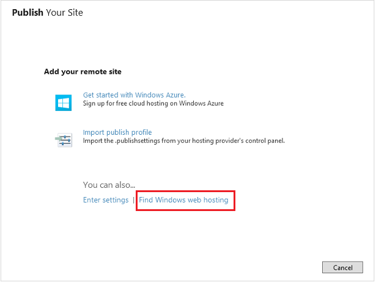

You go to a page on the Microsoft site that lists hosting providers that support ASP.NET.

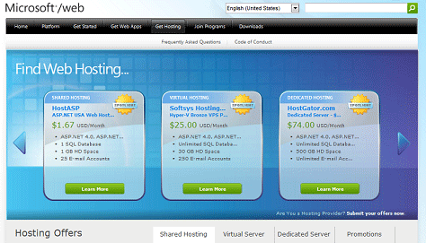

Obviously, it can be difficult to know now exactly what hosting features you might require over the long term. Here are a couple of things to consider:

- For purposes of the WebPagesMovies site, you don't have to have a separate add-on for SQL Server, which often costs extra. In your site, you're using SQL Server Compact Edition, which is self-contained. However, you might need SQL Server access for some future website work you do. If you think you might, make sure that you can add SQL Server capability later.
- Check whether the hosting provider supports the Web Deploy publishing protocol. You can publish by using FTP protocol, but it's more convenient to use Web Deploy.

Some sites offer a free trial period. A free trial is a good way to try publishing and hosting while you're still experimenting with WebMatrix and ASP.NET Web Pages.

Pick one that you like. For this tutorial, we selected DiscountASP.NET, because while we were creating the tutorial, that company had a promotion that let people host a site free for a few months.

> [!NOTE]
> Our choice of a hosting provider for this tutorial shouldn't be interpreted as an endorsement of that company over any other. But we had to pick one for illustration, and DiscountASP.NET is one of the many companies that supports ASP.NET Web Pages and the Web Deploy protocol for publishing.

Typically, after you've signed up with the hosting provider, the company sends you an email that contains a user name and password, the URL of the web server, and so on. If the hosting company supports Web Deploy protocol, they might send you a file that contains publish settings, or let you download one. A publish settings file simplifies the process for you.

When you've signed up and are ready to publish, click the **Publish** button in the WebMatrix ribbon. The **Publish Settings** dialog box is displayed.

If the hosting provider sent you a publish settings file, click the **Import publish settings** link and import the file. If you don't have a publish settings file, fill in the fields by using the values that the hosting company sent you in email. Here's what the **Publish Settings** dialog box might look like when you're done:

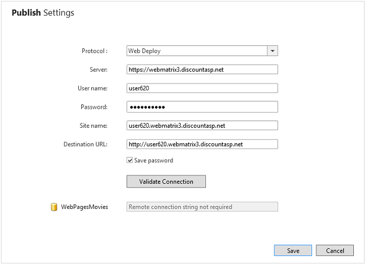

Click **Validate Connection**. If everything is ok, the dialog box reports **Connected successfully**, which means it can communicate with the hosting provider's server.

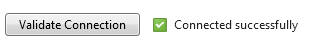

If there's a problem, WebMatrix does its best to tell you what the problem is:

Click **Save** to save your settings. WebMatrix offers to perform a test to make sure that it can communicate correctly with the hosting site:

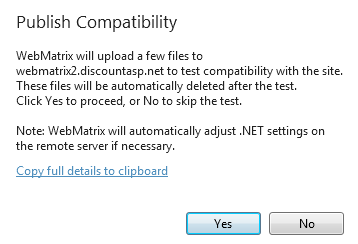

Click **Yes**. WebMatrix uploads some sample files to the hosting provider. When the compatibility test is done, WebMatrix reports the results:

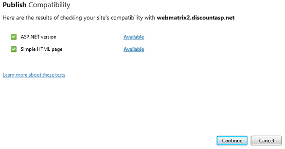

If you're ready to go, go ahead and click **Continue** to start the publish process for real. WebMatrix figures out what files are in your site and are already on the host server (right now, none) and gives you a preview of the publish process:

The list of files to publish includes the web pages that you've created like *Movies.cshtml*. The list also includes files for helpers that you've installed, the files to run SQL Server Compact Edition for your database, and so on. As a result, the initial publish process can be substantial.

Click **Continue**. WebMatrix copies your files to the hosting provider's server. When it's done, the results are reported in the status bar:

To see your live site, click the link in the status bar. Add *Movies* to the URL, and you'll see the *Movies.cshtml* file that you created:

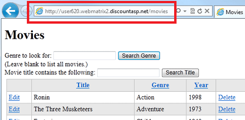

## Updating the Live Site: Republishing

Once you've published your site (to either Azure or a web hosting company), there are two copies of it &mdash; the version on your computer and the version on the service provider. You'll probably want to continue developing the site (if nothing else, as part of the next tutorial set). When you do, you have to republish your site in order to copy changes from your computer to the service provider. The publish process in WebMatrix can determine what files have changed on your site and publish just those files.

To see how republishing works, open the *Movies.cshtml* site, make some small change, and then save the file. For example, change the title to `Movies - Updated`.

Click the **Publish** button in the ribbon. WebMatrix determines what's changed and shows you a preview of the files it will publish.

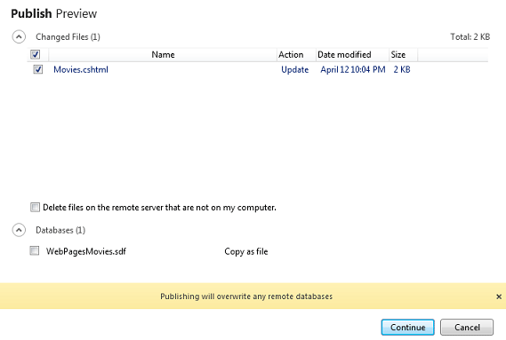

> [!IMPORTANT] 
> 
> By default, WebMatrix publishes your database (*.sdf* file) only the first time you publish the site. Once your site is published and people are interacting with the website, the database on the live site typically has the site's real data. You have to be very careful not to overwrite the live database with the *.sdf* file that's on your computer, which usually contains only test data. That's why you see the warning **Publishing will overwrite any remote databases**, and why the check box for *WebPagesMovies.sdf* is cleared by default.

Click **Continue**. WebMatrix publishes the changed files and shows you a success message, like it did the first time you published.

Go to the live site (you can click the link in the success message if it's still showing) and verify that your change has been published.

> [!TIP] 
> 
> **Editing Files Remotely**
> 
> As an alternative to changing your site and then republishing, you can edit remote files directly in WebMatrix. In this scenario, you open a file that's on the service provider, and WebMatrix downloads a copy of it for you to edit. Every time you save the file, WebMatrix sends the changes to the site.
> 
> Remote editing is an easy way to make changes to your live site. However, the changes you make this way aren't synchronized with the files in your local site. To synchronize the local files with the remote site, you can download the remote files. This process works much like publishing, except in reverse.
> 
> We won't describe more about the remote-editing and remote-download facilities of WebMatrix here. They're quite useful if multiple people have to work on the same site on different computers. For more information, see [Publish and Edit a Remote Site with WebMatrix 2 Beta](https://go.microsoft.com/fwlink/?LinkId=251591).

## Additional Resources

- [ASP.NET WebMatrix ASP.NET Web Pages forum](https://forums.asp.net/1224.aspx/1?WebMatrix+and+ASP+NET+Web+Pages), a great place to post questions and get answers.

>[!div class="step-by-step"]
[Previous](layouts.md)