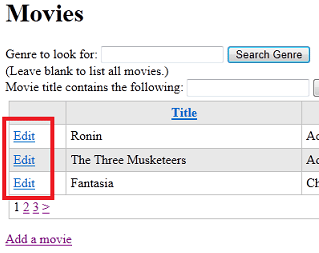
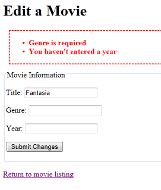

Introducing ASP.NET Web Pages - Updating Database Data
====================
by [Tom FitzMacken](https://github.com/tfitzmac)

> This tutorial shows you how to update (change) an existing database entry when you use ASP.NET Web Pages (Razor). It assumes you have completed the series through [Entering Data by Using Forms Using ASP.NET Web Pages](https://go.microsoft.com/fwlink/?LinkId=251582).
> 
> What you'll learn:
> 
> - How to select an individual record in the `WebGrid` helper.
> - How to read a single record from a database.
> - How to preload a form with values from the database record.
> - How to update an existing record in a database.
> - How to store information in the page without displaying it.
> - How to use a hidden field to store information.
>   
> 
> Features/technologies discussed:
> 
> - The `WebGrid` helper.
> - The SQL `Update` command.
> - The `Database.Execute` method.
> - Hidden fields (`<input type="hidden">`).

## What You'll Build

In the previous tutorial, you learned how to add a record to a database. Here, you'll learn how to display a record for editing. In the *Movies* page, you'll update the `WebGrid` helper so that it displays an **Edit** link next to each movie:

When you click the **Edit** link, it takes you to a different page, where the movie information is already in a form:

You can change any of the values. When you submit the changes, the code in the page updates the database and takes you back to the movie listing.

This part of the process works almost exactly like the *AddMovie.cshtml* page you created in the previous tutorial, so much of this tutorial will be familiar.

There are several ways you could implement a way to edit an individual movie. The approach shown was chosen because it's easy to implement and easy to understand.

## Adding an Edit Link to the Movie Listing

To begin, you'll update the *Movies* page so that each movie listing also contains an **Edit** link.

Open the *Movies.cshtml* file.

In the body of the page, change the `WebGrid` markup by adding a column. Here's the modified markup:

[!code-html[Main](updating-data/samples/sample1.html?highlight=6)]

The new column is this one:

[!code-html[Main](updating-data/samples/sample2.html)]

The point of this column is to show a link (`<a>` element) whose text says "Edit". What we're after is to create a link that looks like the following when the page runs, with the `id` value different for each movie:

[!code-css[Main](updating-data/samples/sample3.css)]

This link will invoke a page named *EditMovie*, and it will pass the query string `?id=7` to that page.

The syntax for the new column might look a bit complex, but that's only because it puts together several elements. Each individual element is straightforward. If you concentrate on just the `<a>` element, you see this markup:

[!code-html[Main](updating-data/samples/sample4.html)]

Some background about how the grid works: the grid displays rows, one for each database record, and it displays columns for each field in the database record. While each grid row is being constructed, the `item` object contains the database record (item) for that row. This arrangement gives you a way in code to get at the data for that row. That's what you see here: the expression `item.ID` is getting the ID value of the current database item. You could get any of the database values (title, genre, or year) the same way by using `item.Title`, `item.Genre`, or `item.Year`.

The expression `"~/EditMovie?id=@item.ID` combines the hard-coded part of the target URL (`~/EditMovie?id=`) with this dynamically derived ID. (You saw the `~` operator in the previous tutorial; it's an ASP.NET operator that represents the current website root.)

The result is that this part of the markup in the column simply produces something like the following markup at run time:

[!code-xml[Main](updating-data/samples/sample5.xml)]

Naturally, the actual value of `id` will be different for each row.

## Creating a Custom Display for a Grid Column

Now back to the grid column. The three columns you originally had in the grid displayed only data values (title, genre, and year). You specified this display by passing the name of the database column &mdash; for example, `grid.Column("Title")`.

This new **Edit** link column is different. Instead of specifying a column name, you're passing a `format` parameter. This parameter lets you define markup that the `WebGrid` helper will render along with the `item` value to display the column data as bold or green or in whatever format that you want. For example, if you wanted the title to appear bold, you could create a column like this example:

[!code-html[Main](updating-data/samples/sample6.html)]

(The various `@` characters you see in the `format` property mark the transition between markup and a code value.)

Once you know about the `format` property, it's easier to understand how the new **Edit** link column is put together:

[!code-html[Main](updating-data/samples/sample7.html)]

The column consists *only* of the markup that renders the link, plus some information (the ID) that's extracted from the database record for the row.

> [!TIP] 
> 
> **Named Parameters and Positional Parameters for a Method**
> 
> Many times when you've called a method and passed parameters to it, you've simply listed the parameter values separated by commas. Here are a couple of examples:
> 
> `db.Execute(insertCommand, title, genre, year)`
> 
> `Validation.RequireField("title", "You must enter a title")`
> 
> We didn't mention the issue when you first saw this code, but in each case, you're passing parameters to the methods in a specific order &mdash; namely, the order in which the parameters are defined in that method. For `db.Execute` and `Validation.RequireFields`, if you mixed up the order of the values you pass, you'd get an error message when the page runs, or at least some strange results. Clearly, you have to know the order to pass the parameters in. (In WebMatrix, IntelliSense can help you learn figure out the name, type, and order of the parameters.)
> 
> As an alternative to passing values in order, you can use *named parameters*. (Passing parameters in order is known as using *positional parameters*.) For named parameters, you explicitly include the name of the parameter when passing its value. You've used named parameters already a number of times in these tutorials. For example:
> 
> [!code-csharp[Main](updating-data/samples/sample8.cs)]
> 
> and
> 
> [!code-css[Main](updating-data/samples/sample9.css)]
> 
> Named parameters are handy for a couple of situations, especially when a method takes many parameters. One is when you want to pass only one or two parameters, but the values you want to pass are not among the first positions in the parameter list. Another situation is when you want to make your code more readable by passing the parameters in the order that makes the most sense to you.
> 
> Obviously, to use named parameters, you have to know the names of the parameters. WebMatrix IntelliSense can *show* you the names, but it cannot currently fill them in for you.

## Creating the Edit Page

Now you can create the *EditMovie* page. When users click the **Edit** link, they'll end up on this page.

Create a page named *EditMovie.cshtml* and replace what's in the file with the following markup:

[!code-cshtml[Main](updating-data/samples/sample10.cshtml)]

This markup and code is similar to what you have in the *AddMovie* page. There's a small difference in the text for the submit button. As with the *AddMovie* page, there's an `Html.ValidationSummary` call that will display validation errors if there are any. This time we're leaving out calls to `Validation.Message`, since errors will be displayed in the validation summary. As noted in the previous tutorial, you can use the validation summary and the individual error messages in various combinations.

Notice again that the `method` attribute of the `<form>` element is set to `post`. As with the *AddMovie.cshtml* page, this page makes changes to the database. Therefore, this form should perform a `POST` operation. (For more about the difference between `GET` and `POST` operations, see the [GET, POST, and HTTP Verb Safety](https://go.microsoft.com/fwlink/?LinkId=251581#GET,_POST,_and_HTTP_Verb_Safety) sidebar in the tutorial on HTML forms.)

As you saw in an earlier tutorial, the `value` attributes of the text boxes are being set with Razor code in order to preload them. This time, though, you're using variables like `title` and `genre` for that task instead of `Request.Form["title"]`:

`<input type="text" name="title" value="@title" />`

As before, this markup will preload the text box values with the movie values. You'll see in a moment why it's handy to use variables this time instead of using the `Request` object.

There's also a `<input type="hidden">` element on this page. This element stores the movie ID without making it visible on the page. The ID is initially passed to the page by using a query string value (`?id=7` or similar in the URL). By putting the ID value into a hidden field, you can make sure that it's available when the form is submitted, even if you no longer have access to the original URL that the page was invoked with.

Unlike the *AddMovie* page, the code for the *EditMovie* page has two distinct functions. The first function is that when the page is displayed for the first time (and *only* then), the code gets the movie ID from the query string. The code then uses the ID to read the corresponding movie out of the database and display (preload) it in the text boxes.

The second function is that when the user clicks the **Submit Changes** button, the code has to read the values of the text boxes and validate them. The code also has to update the database item with the new values. This technique is similar to adding a record, as you saw in *AddMovie*.

## Adding Code to Read a Single Movie

To perform the first function, add this code to the top of the page:

[!code-cshtml[Main](updating-data/samples/sample11.cshtml)]

Most of this code is inside a block that starts `if(!IsPost)`. The `!` operator means "not," so the expression means *if this request is not a post submission*, which is an indirect way of saying *if this request is the first time that this page has been run*. As noted earlier, this code should run *only* the first time the page runs. If you didn't enclose the code in `if(!IsPost)`, it would run every time the page is invoked, whether the first time or in response to a button click.

Notice that the code includes an `else` block this time. As we said when we introduced `if` blocks, sometimes you want to run alternative code if the condition you're testing isn't true. That's the case here. If the condition passes (that is, if the ID passed to the page is ok), you read a row from the database. However, if the condition doesn't pass, the `else` block runs and the code sets an error message.

## Validating a Value Passed to the Page

The code uses `Request.QueryString["id"]` to get the ID that's passed to the page. The code makes sure that a value was actually passed for the ID. If no value was passed, the code sets a validation error.

This code shows a different way to validate information. In the previous tutorial, you worked with the `Validation` helper. You registered fields to validate, and ASP.NET automatically did the validation and displayed errors by using `Html.ValidationMessage` and `Html.ValidationSummary`. In this case, however, you're not really validating user input. Instead, you're validating a value that was passed to the page from elsewhere. The `Validation` helper doesn't do that for you.

Therefore, you check the value yourself, by testing it with `if(!Request.QueryString["ID"].IsEmpty()`). If there's a problem, you can display the error by using `Html.ValidationSummary`, as you did with the `Validation` helper. To do that, you call `Validation.AddFormError` and pass it a message to display. `Validation.AddFormError` is a built-in method that lets you define custom messages that tie in with the validation system you're already familiar with. (Later in this tutorial we'll talk about how to make this validation process a little more robust.)

After making sure that there's an ID for the movie, the code reads the database, looking for only a single database item. (You probably have noticed the general pattern for database operations: open the database, define a SQL statement, and run the statement.) This time, the SQL `Select` statement includes `WHERE ID = @0`. Because the ID is unique, only one record can be returned.

The query is performed by using `db.QuerySingle` (not `db.Query`, as you used for the movie listing), and the code puts the result into the `row` variable. The name `row` is arbitrary; you can name the variables anything you like. The variables initialized at the top are then filled with the movie details so that these values can be displayed in the text boxes.

## Testing the Edit Page (So Far)

If you'd like to test your page, run the *Movies* page now and click an **Edit** link next to any movie. You'll see the *EditMovie* page with the details filled in for the movie you selected:

Notice that the URL of the page includes something like `?id=10` (or some other number). So far you've tested that **Edit** links in the *Movie* page work, that your page is reading the ID from the query string, and that the database query to get a single movie record is working.

You can change the movie information, but nothing happens when you click **Submit Changes**.

## Adding Code to Update the Movie with the User's Changes

In the *EditMovie.cshtml* file, to implement the second function (saving changes), add the following code just inside the closing brace of the `@` block. (If you're not sure exactly where to put the code, you can look at the [complete code listing for the Edit Movie page](#Complete_Page_Listing_for_EditMovie) that appears at the end of this tutorial.)

[!code-csharp[Main](updating-data/samples/sample12.cs)]

Again, this markup and code is similar to the code in *AddMovie*. The code is in an `if(IsPost)` block, because this code runs only when the user clicks the **Submit Changes** button &mdash; that is, when (and only when) the form has been posted. In this case, you're not using a test like `if(IsPost && Validation.IsValid())`— that is, you're not combining both tests by using AND. In this page, you first determine whether there's a form submission (`if(IsPost)`), and only then register the fields for validation. Then you can test the validation results (`if(Validation.IsValid()`). The flow is slightly different than in the *AddMovie.cshtml* page, but the effect is the same.

You get the values of the text boxes by using `Request.Form["title"]` and similar code for the other `<input>` elements. Notice that this time, the code gets the movie ID out of the hidden field (`<input type="hidden">`). When the page ran the first time, the code got the ID out of the query string. You get the value from the hidden field to make sure that you're getting the ID of the movie that was originally displayed, in case the query string was somehow altered since then.

The really important difference between the *AddMovie* code and this code is that in this code you use the SQL `Update` statement instead of the `Insert Into` statement. The following example shows the syntax of the SQL `Update` statement:

`UPDATE table SET col1="value", col2="value", col3="value" ... WHERE ID = value`

You can specify any columns in any order, and you don't necessarily have to update every column during an `Update` operation. (You cannot update the ID itself, because that would in effect save the record as a new record, and that's not allowed for an `Update` operation.)

> [!NOTE] 
> 
> **Important** The `Where` clause with the ID is very important, because that's how the database knows which database record you want to update. If you left off the `Where` clause, the database would update *every* record in the database. In most cases, that would be a disaster.

In the code, the values to update are passed to the SQL statement by using placeholders. To repeat what we've said before: for security reasons, *only* use placeholders to pass values to a SQL statement.

After the code uses `db.Execute` to run the `Update` statement, it redirects back to the listing page, where you can see the changes.

> [!TIP] 
> 
> **Different SQL Statements, Different Methods**
> 
> You might have noticed that you use slightly different methods to run different SQL statements. To run a `Select` query that potentially returns multiple records, you use the `Query` method. To run a `Select` query that you know will return only one database item, you use the `QuerySingle` method. To run commands that make changes but that don't return database items, you use the `Execute` method.
> 
> You have to have different methods because each of them returns different results, as you saw already in the difference between `Query` and `QuerySingle`. (The `Execute` method actually returns a value also &mdash; namely, the number of database rows that were affected by the command &mdash; but you've been ignoring that so far.)
> 
> Of course, the `Query` method might return only one database row. However, ASP.NET always treats the results of the `Query` method as a collection. Even if the method returns just one row, you have to extract that single row from the collection. Therefore, in situations where you *know* you'll get back only one row, it's a bit more convenient to use `QuerySingle`.
> 
> There are a few other methods that perform specific types of database operations. You can find a listing of database methods in the [ASP.NET Web Pages API Quick Reference](https://go.microsoft.com/fwlink/?LinkID=202907#Data).

## Making Validation for the ID More Robust

The first time that the page runs, you get the movie ID from the query string so that you can go get that movie from the database. You made sure that there actually was a value to go look for, which you did by using this code:

[!code-csharp[Main](updating-data/samples/sample13.cs)]

You used this code to make sure that if a user gets to the *EditMovies* page without first selecting a movie in the *Movies* page, the page would display a user-friendly error message. (Otherwise, users would see an error that would probably just confuse them.)

However, this validation isn't very robust. The page might also be invoked with these errors:

- The ID isn't a number. For example, the page could be invoked with a URL like `http://localhost:nnnnn/EditMovie?id=abc`.
- The ID is a number, but it references a movie that doesn't exist (for example, `http://localhost:nnnnn/EditMovie?id=100934`).

If you're curious to see the errors that result from these URLs, run the *Movies* page. Select a movie to edit, and then change the URL of the *EditMovie* page to a URL that contains an alphabetic ID or the ID of a non-existent movie.

So what should you do? The first fix is to make sure that not only is an ID passed to the page, but that the ID is an integer. Change the code for the `!IsPost` test to look like this example:

[!code-csharp[Main](updating-data/samples/sample14.cs)]

You've added a second condition to the `IsEmpty` test, linked with `&&` (logical AND):

[!code-csharp[Main](updating-data/samples/sample15.cs)]

You might remember from the [Introduction to ASP.NET Web Pages Programming](../introducing-razor-syntax-c.md) tutorial that methods like `AsBool` an `AsInt` convert a character string to some other data type. The `IsInt` method (and others, like `IsBool` and `IsDateTime`) are similar. However, they test only whether you *can* convert the string, without actually performing the conversion. So here you're essentially saying *If the query string value can be converted to an integer ...*.

The other potential problem is looking for a movie that doesn't exist. The code to get a movie looks like this code:

[!code-csharp[Main](updating-data/samples/sample16.cs)]

If you pass a `movieId` value to the `QuerySingle` method that doesn't correspond to an actual movie, nothing is returned and the statements that follow (for example, `title=row.Title`) result in errors.

Again there's an easy fix. If the `db.QuerySingle` method returns no results, the `row` variable will be null. So you can check whether the `row` variable is null before you try to get values from it. The following code adds an `if` block around the statements that get the values out of the `row` object:

[!code-csharp[Main](updating-data/samples/sample17.cs)]

With these two additional validation tests, the page becomes more bullet-proof. The complete code for the `!IsPost` branch now looks like this example:

[!code-csharp[Main](updating-data/samples/sample18.cs)]

We'll note once more that this task is a good use for an `else` block. If the tests don't pass, the `else` blocks set error messages.

## Adding a Link to Return to the Movies Page

A final and helpful detail is to add a link back to the *Movies* page. In the ordinary flow of events, users will start at the *Movies* page and click an **Edit** link. That brings them to the *EditMovie* page, where they can edit the movie and click the button. After the code processes the change, it redirects back to the *Movies* page.

However:

- The user might decide not to change anything.
- The user might have gotten to this page without first clicking an **Edit** link in the *Movies* page.

Either way, you want to make it easy for them to return to the main listing. It's an easy fix &mdash; add the following markup just after the closing `</form>` tag in the markup:

[!code-html[Main](updating-data/samples/sample19.html)]

This markup uses the same syntax for an `<a>` element that you've seen elsewhere. The URL includes `~` to mean "root of the website."

## Testing the Movie Update Process

Now you can test. Run the *Movies* page, and click **Edit** next to a movie. When the *EditMovie* page appears, make changes to the movie and click **Submit Changes**. When the movie listing appears, make sure that your changes are shown.

To make sure that validation is working, click **Edit** for another movie. When you get to the *EditMovie* page, clear the **Genre** field (or **Year** field, or both) and try to submit your changes. You'll see an error, as you'd expect:

Click the **Return to movie listing** link to abandon your changes and return to the *Movies* page.

## Coming Up Next

In the next tutorial, you'll see how to delete a movie record.

## Complete Listing for Movie Page (Updated with Edit Links)

[!code-cshtml[Main](updating-data/samples/sample20.cshtml)]

## Complete Page Listing for Edit Movie Page

[!code-cshtml[Main](updating-data/samples/sample21.cshtml)]

## Additional Resources

- [Introduction to ASP.NET Web Programming by Using the Razor Syntax](https://go.microsoft.com/fwlink/?LinkID=202890)
- [SQL UPDATE Statement](http://www.w3schools.com/sql/sql_update.asp) on the W3Schools site

>[!div class="step-by-step"]
[Previous](entering-data.md)
[Next](deleting-data.md)