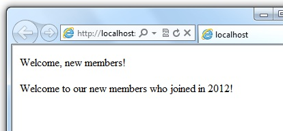
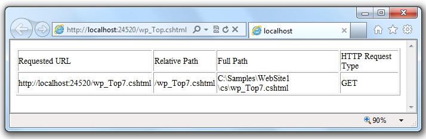
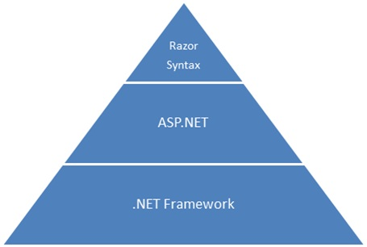
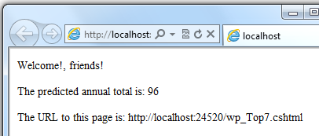
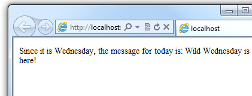
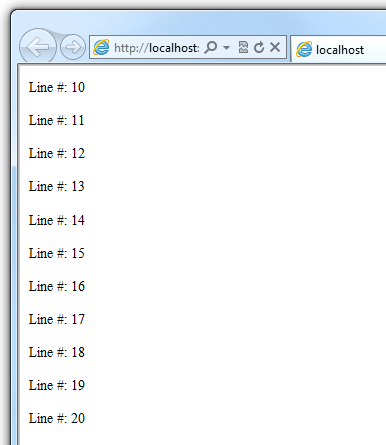
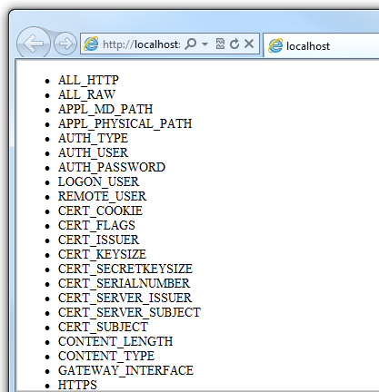
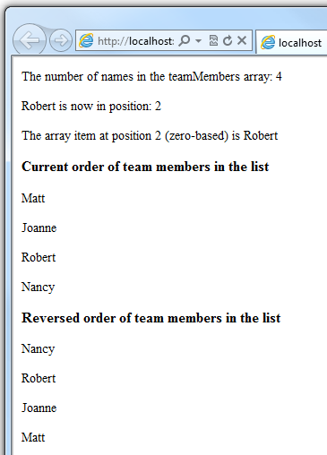
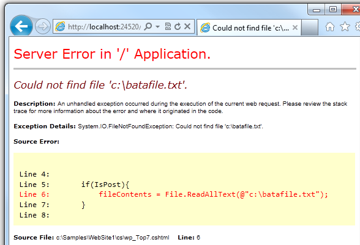

Introduction to ASP.NET Web Programming Using the Razor Syntax (C#)
====================
by [Tom FitzMacken](https://github.com/tfitzmac)

> This article gives you an overview of programming with ASP.NET Web Pages using the Razor syntax. ASP.NET is Microsoft's technology for running dynamic web pages on web servers. This articles focuses on using the C# programming language.
> 
> **What you'll learn**:
> 
> - The top 8 programming tips for getting started with programming ASP.NET Web Pages using Razor syntax.
> - Basic programming concepts you'll need.
> - What ASP.NET server code and the Razor syntax is all about.
>   
> 
> ## Software versions
> 
> 
> - ASP.NET Web Pages (Razor) 3
>   
> 
> This tutorial also works with ASP.NET Web Pages 2.

## The Top 8 Programming Tips

This section lists a few tips that you absolutely need to know as you start writing ASP.NET server code using the Razor syntax.

> [!NOTE]
> The Razor syntax is based on the C# programming language, and that's the language that's used most often with ASP.NET Web Pages. However, the Razor syntax also supports the Visual Basic language, and everything you see you can also do in Visual Basic. For details, see the appendix [Visual Basic Language and Syntax](https://go.microsoft.com/fwlink/?LinkId=202908).

You can find more details about most of these programming techniques later in the article.

### 1. You add code to a page using the @ character

The `@` character starts inline expressions, single statement blocks, and multi-statement blocks:

[!code-html[Main](introducing-razor-syntax-c/samples/sample1.html)]

This is what these statements look like when the page runs in a browser:

> [!TIP] 
> 
> **HTML Encoding**
> 
> When you display content in a page using the `@` character, as in the preceding examples, ASP.NET HTML-encodes the output. This replaces reserved HTML characters (such as `<` and `>` and `&`) with codes that enable the characters to be displayed as characters in a web page instead of being interpreted as HTML tags or entities. Without HTML encoding, the output from your server code might not display correctly, and could expose a page to security risks.
> 
> If your goal is to output HTML markup that renders tags as markup (for example `

` for a paragraph or `<em></em>` to emphasize text), see the section [Combining Text, Markup, and Code in Code Blocks](#BM_CombiningTextMarkupAndCode) later in this article.
> 
> You can read more about HTML encoding in [Working with Forms](https://go.microsoft.com/fwlink/?LinkId=202892).

### 2. You enclose code blocks in braces

A *code block* includes one or more code statements and is enclosed in braces.

[!code-html[Main](introducing-razor-syntax-c/samples/sample2.html)]

The result displayed in a browser:

### 3. Inside a block, you end each code statement with a semicolon

Inside a code block, each complete code statement must end with a semicolon. Inline expressions don't end with a semicolon.

[!code-html[Main](introducing-razor-syntax-c/samples/sample3.html)]

### 4. You use variables to store values

You can store values in a *variable*, including strings, numbers, and dates, etc. You create a new variable using the `var` keyword. You can insert variable values directly in a page using `@`.

[!code-html[Main](introducing-razor-syntax-c/samples/sample4.html)]

The result displayed in a browser:

### 5. You enclose literal string values in double quotation marks

A *string* is a sequence of characters that are treated as text. To specify a string, you enclose it in double quotation marks:

[!code-cshtml[Main](introducing-razor-syntax-c/samples/sample5.cshtml)]

If the string that you want to display contains a backslash character ( `\` ) or double quotation marks ( `"` ), use a *verbatim string literal* that's prefixed with the `@` operator. (In C#, the \ character has special meaning unless you use a verbatim string literal.)

[!code-html[Main](introducing-razor-syntax-c/samples/sample6.html)]

To embed double quotation marks, use a verbatim string literal and repeat the quotation marks:

[!code-html[Main](introducing-razor-syntax-c/samples/sample7.html)]

Here's the result of using both of these examples in a page:

> [!NOTE]
> Notice that the `@` character is used both to mark verbatim string literals in C# and to mark code in ASP.NET pages.

### 6. Code is case sensitive

In C#, keywords (like `var`, `true`, and `if`) and variable names are case sensitive. The following lines of code create two different variables, `lastName` and `LastName.`

[!code-cshtml[Main](introducing-razor-syntax-c/samples/sample8.cshtml)]

If you declare a variable as `var lastName = "Smith";` and if you try to reference that variable in your page as `@LastName`, an error results because `LastName` won't be recognized.

> [!NOTE]
> In Visual Basic, keywords and variables are *not* case sensitive.

### 7. Much of your coding involves objects

An *object* represents a thing that you can program with &#8212; a page, a text box, a file, an image, a web request, an email message, a customer record (database row), etc. Objects have properties that describe their characteristics and that you can read or change &#8212; a text box object has a `Text` property (among others), a request object has a `Url` property, an email message has a `From` property, and a customer object has a `FirstName` property. Objects also have methods that are the &quot;verbs&quot; they can perform. Examples include a file object's `Save` method, an image object's `Rotate` method, and an email object's `Send` method.

You'll often work with the `Request` object, which gives you information like the values of text boxes (form fields) on the page, what type of browser made the request, the URL of the page, the user identity, etc. The following example shows how to access properties of the `Request` object and how to call the `MapPath` method of the `Request` object, which gives you the absolute path of the page on the server:

[!code-html[Main](introducing-razor-syntax-c/samples/sample9.html)]

The result displayed in a browser:

### 8. You can write code that makes decisions

A key feature of dynamic web pages is that you can determine what to do based on conditions. The most common way to do this is with the `if` statement (and optional `else` statement).

[!code-cshtml[Main](introducing-razor-syntax-c/samples/sample10.cshtml)]

The statement `if(IsPost)` is a shorthand way of writing `if(IsPost == true)`. Along with `if` statements, there are a variety of ways to test conditions, repeat blocks of code, and so on, which are described later in this article.

The result displayed in a browser (after clicking **Submit**):

> [!TIP] 
> 
> 
> ### HTTP GET and POST Methods and the IsPost Property
> 
> The protocol used for web pages (HTTP) supports a very limited number of methods (verbs) that are used to make requests to the server. The two most common ones are GET, which is used to read a page, and POST, which is used to submit a page. In general, the first time a user requests a page, the page is requested using GET. If the user fills in a form and then clicks a submit button, the browser makes a POST request to the server.
> 
> In web programming, it's often useful to know whether a page is being requested as a GET or as a POST so that you know how to process the page. In ASP.NET Web Pages, you can use the `IsPost` property to see whether a request is a GET or a POST. If the request is a POST, the `IsPost` property will return true, and you can do things like read the values of text boxes on a form. Many examples you'll see show you how to process the page differently depending on the value of `IsPost`.

## A Simple Code Example

This procedure shows you how to create a page that illustrates basic programming techniques. In the example, you create a page that lets users enter two numbers, then it adds them and displays the result.

1. In your editor, create a new file and name it *AddNumbers.cshtml*.
2. Copy the following code and markup into the page, replacing anything already in the page.  

    [!code-cshtml[Main](introducing-razor-syntax-c/samples/sample11.cshtml)]

    Here are some things for you to note:

    - The `@` character starts the first block of code in the page, and it precedes the `totalMessage` variable that's embedded near the bottom of the page.
    - The block at the top of the page is enclosed in braces.
    - In the block at the top, all lines end with a semicolon.
    - The variables `total`, `num1`, `num2`, and `totalMessage` store several numbers and a string.
    - The literal string value assigned to the `totalMessage` variable is in double quotation marks.
    - Because the code is case-sensitive, when the `totalMessage` variable is used near the bottom of the page, its name must match the variable at the top exactly.
    - The expression `num1.AsInt() + num2.AsInt()` shows how to work with objects and methods. The `AsInt` method on each variable converts the string entered by a user to a number (an integer) so that you can perform arithmetic on it.
    - The `<form>` tag includes a `method="post"` attribute. This specifies that when the user clicks **Add**, the page will be sent to the server using the HTTP POST method. When the page is submitted, the `if(IsPost)` test evaluates to true and the conditional code runs, displaying the result of adding the numbers.
3. Save the page and run it in a browser. (Make sure the page is selected in the **Files** workspace before you run it.) Enter two whole numbers and then click the **Add** button. 

    

## Basic Programming Concepts

This article provides you with an overview of ASP.NET web programming. It isn't an exhaustive examination, just a quick tour through the programming concepts you'll use most often. Even so, it covers almost everything you'll need to get started with ASP.NET Web Pages.

But first, a little technical background.

### The Razor Syntax, Server Code, and ASP.NET

Razor syntax is a simple programming syntax for embedding server-based code in a web page. In a web page that uses the Razor syntax, there are two kinds of content: client content and server code. Client content is the stuff you're used to in web pages: HTML markup (elements), style information such as CSS, maybe some client script such as JavaScript, and plain text.

Razor syntax lets you add server code to this client content. If there's server code in the page, the server runs that code first, before it sends the page to the browser. By running on the server, the code can perform tasks that can be a lot more complex to do using client content alone, like accessing server-based databases. Most importantly, server code can dynamically create client content &#8212; it can generate HTML markup or other content on the fly and then send it to the browser along with any static HTML that the page might contain. From the browser's perspective, client content that's generated by your server code is no different than any other client content. As you've already seen, the server code that's required is quite simple.

ASP.NET web pages that include the Razor syntax have a special file extension (*.cshtml* or *.vbhtml*). The server recognizes these extensions, runs the code that's marked with Razor syntax, and then sends the page to the browser.

### Where does ASP.NET fit in?

Razor syntax is based on a technology from Microsoft called ASP.NET, which in turn is based on the Microsoft .NET Framework. The.NET Framework is a big, comprehensive programming framework from Microsoft for developing virtually any type of computer application. ASP.NET is the part of the .NET Framework that's specifically designed for creating web applications. Developers have used ASP.NET to create many of the largest and highest-traffic websites in the world. (Any time you see the file-name extension *.aspx* as part of the URL in a site, you'll know that the site was written using ASP.NET.)

The Razor syntax gives you all the power of ASP.NET, but using a simplified syntax that's easier to learn if you're a beginner and that makes you more productive if you're an expert. Even though this syntax is simple to use, its family relationship to ASP.NET and the .NET Framework means that as your websites become more sophisticated, you have the power of the larger frameworks available to you.

> [!TIP] 
> 
> **Classes and Instances**
> 
> ASP.NET server code uses objects, which are in turn built on the idea of classes. The class is the definition or template for an object. For example, an application might contain a `Customer` class that defines the properties and methods that any customer object needs.
> 
> When the application needs to work with actual customer information, it creates an instance of (or *instantiates*) a customer object. Each individual customer is a separate instance of the `Customer` class. Every instance supports the same properties and methods, but the property values for each instance are typically different, because each customer object is unique. In one customer object, the `LastName` property might be "Smith"; in another customer object, the `LastName` property might be "Jones."
> 
> Similarly, any individual web page in your site is a `Page` object that's an instance of the `Page` class. A button on the page is a `Button` object that is an instance of the `Button` class, and so on. Each instance has its own characteristics, but they all are based on what's specified in the object's class definition.

## Basic Syntax

Earlier you saw a basic example of how to create an ASP.NET Web Pages page, and how you can add server code to HTML markup. Here you'll learn the basics of writing ASP.NET server code using the Razor syntax &#8212; that is, the programming language rules.

If you're experienced with programming (especially if you've used C, C++, C#, Visual Basic, or JavaScript), much of what you read here will be familiar. You'll probably need to familiarize yourself only with how server code is added to markup in *.cshtml* files.

### Combining Text, Markup, and Code in Code Blocks

In server code blocks, you often want to output text or markup (or both) to the page. If a server code block contains text that's not code and that instead should be rendered as is, ASP.NET needs to be able to distinguish that text from code. There are several ways to do this.

- Enclose the text in an HTML element like `

` or `<em></em>`:   

    [!code-cshtml[Main](introducing-razor-syntax-c/samples/sample12.cshtml)]

    The HTML element can include text, additional HTML elements, and server-code expressions. When ASP.NET sees the opening HTML tag (for example, `
`), it renders everything including the element and its content as is to the browser, resolving server-code expressions as it goes.
- Use the `@:` operator or the `<text>` element. The `@:` outputs a single line of content containing plain text or unmatched HTML tags; the `<text>` element encloses multiple lines to output. These options are useful when you don't want to render an HTML element as part of the output.  

    [!code-cshtml[Main](introducing-razor-syntax-c/samples/sample13.cshtml)]

    If you want to output multiple lines of text or unmatched HTML tags, you can precede each line with `@:`, or you can enclose the line in a `<text>` element. Like the `@:` operator,`<text>` tags are used by ASP.NET to identify text content and are never rendered in the page output.

    [!code-cshtml[Main](introducing-razor-syntax-c/samples/sample14.cshtml)]

    The first example repeats the previous example but uses a single pair of `<text>` tags to enclose the text to render. In the second example, the `<text>` and `</text>` tags enclose three lines, all of which have some uncontained text and unmatched HTML tags (` `), along with server code and matched HTML tags. Again, you could also precede each line individually with the `@:` operator; either way works.

    > [!NOTE]
    > When you output text as shown in this section &#8212; using an HTML element, the `@:` operator, or the `<text>` element &#8212; ASP.NET doesn't HTML-encode the output. (As noted earlier, ASP.NET does encode the output of server code expressions and server code blocks that are preceded by `@`, except in the special cases noted in this section.)

### Whitespace

Extra spaces in a statement (and outside of a string literal) don't affect the statement:

[!code-cshtml[Main](introducing-razor-syntax-c/samples/sample15.cshtml)]

A line break in a statement has no effect on the statement, and you can wrap statements for readability. The following statements are the same:

[!code-cshtml[Main](introducing-razor-syntax-c/samples/sample16.cshtml)]

However, you can't wrap a line in the middle of a string literal. The following example doesn't work:

[!code-cshtml[Main](introducing-razor-syntax-c/samples/sample17.cshtml)]

To combine a long string that wraps to multiple lines like the above code, there are two options. You can use the concatenation operator (`+`), which you'll see later in this article. You can also use the `@` character to create a verbatim string literal, as you saw earlier in this article. You can break verbatim string literals across lines:

[!code-cshtml[Main](introducing-razor-syntax-c/samples/sample18.cshtml)]

### Code (and Markup) Comments

Comments let you leave notes for yourself or others. They also allow you to disable (*comment out*) a section of code or markup that you don't want to run but want to keep in your page for the time being.

There's different commenting syntax for Razor code and for HTML markup. As with all Razor code, Razor comments are processed (and then removed) on the server before the page is sent to the browser. Therefore, the Razor commenting syntax lets you put comments into the code (or even into the markup) that you can see when you edit the file, but that users don't see, even in the page source.

For ASP.NET Razor comments, you start the comment with `@*` and end it with `*@`. The comment can be on one line or multiple lines:

[!code-cshtml[Main](introducing-razor-syntax-c/samples/sample19.cshtml)]

Here is a comment within a code block:

[!code-cshtml[Main](introducing-razor-syntax-c/samples/sample20.cshtml)]

Here is the same block of code, with the line of code commented out so that it won't run:

[!code-cshtml[Main](introducing-razor-syntax-c/samples/sample21.cshtml)]

Inside a code block, as an alternative to using Razor comment syntax, you can use the commenting syntax of the programming language you're using, such as C#:

[!code-cshtml[Main](introducing-razor-syntax-c/samples/sample22.cshtml)]

In C#, single-line comments are preceded by the `//` characters, and multi-line comments begin with `/*` and end with `*/`. (As with Razor comments, C# comments are not rendered to the browser.)

For markup, as you probably know, you can create an HTML comment:

[!code-xml[Main](introducing-razor-syntax-c/samples/sample23.xml)]

HTML comments start with `<!--` characters and end with `-->`. You can use HTML comments to surround not only text, but also any HTML markup that you may want to keep in the page but don't want to render. This HTML comment will hide the entire content of the tags and the text they contain:

[!code-html[Main](introducing-razor-syntax-c/samples/sample24.html)]

Unlike Razor comments, HTML comments *are* rendered to the page and the user can see them by viewing the page source.

Razor has limitations on nested blocks of C#. For more information see [Named C# Variables and Nested Blocks Generate Broken Code](http://aspnetwebstack.codeplex.com/workitem/1914)

## Variables

A variable is a named object that you use to store data. You can name variables anything, but the name must begin with an alphabetic character and it cannot contain whitespace or reserved characters.

### Variables and Data Types

A variable can have a specific data type, which indicates what kind of data is stored in the variable. You can have string variables that store string values (like &quot;Hello world&quot;), integer variables that store whole-number values (like 3 or 79), and date variables that store date values in a variety of formats (like 4/12/2012 or March 2009). And there are many other data types you can use.

However, you generally don't have to specify a type for a variable. Most of the time, ASP.NET can figure out the type based on how the data in the variable is being used. (Occasionally you must specify a type; you'll see examples where this is true.)

You declare a variable using the `var` keyword (if you don't want to specify a type) or by using the name of the type:

[!code-cshtml[Main](introducing-razor-syntax-c/samples/sample25.cshtml)]

The following example shows some typical uses of variables in a web page:

[!code-cshtml[Main](introducing-razor-syntax-c/samples/sample26.cshtml)]

If you combine the previous examples in a page, you see this displayed in a browser:

### Converting and Testing Data Types

Although ASP.NET can usually determine a data type automatically, sometimes it can't. Therefore, you might need to help ASP.NET out by performing an explicit conversion. Even if you don't have to convert types, sometimes it's helpful to test to see what type of data you might be working with.

The most common case is that you have to convert a string to another type, such as to an integer or date. The following example shows a typical case where you must convert a string to a number.

[!code-cshtml[Main](introducing-razor-syntax-c/samples/sample27.cshtml)]

As a rule, user input comes to you as strings. Even if you've prompted users to enter a number, and even if they've entered a digit, when user input is submitted and you read it in code, the data is in string format. Therefore, you must convert the string to a number. In the example, if you try to perform arithmetic on the values without converting them, the following error results, because ASP.NET cannot add two strings:

*Cannot implicitly convert type 'string' to 'int'.*

To convert the values to integers, you call the `AsInt` method. If the conversion is successful, you can then add the numbers.

The following table lists some common conversion and test methods for variables.

| **Method** | **Description** | **Example** |
| --- | --- | --- |
| `AsInt(), IsInt()` | Converts a string that represents a whole number (like "593") to an integer. | [!code-csharp[Main](introducing-razor-syntax-c/samples/sample28.cs)] |
| `AsBool(), IsBool()` | Converts a string like &quot;true&quot; or &quot;false&quot; to a Boolean type. | [!code-csharp[Main](introducing-razor-syntax-c/samples/sample29.cs)] |
| `AsFloat(), IsFloat()` | Converts a string that has a decimal value like &quot;1.3&quot; or &quot;7.439&quot; to a floating-point number. | [!code-csharp[Main](introducing-razor-syntax-c/samples/sample30.cs)] |
| `AsDecimal(), IsDecimal()` | Converts a string that has a decimal value like &quot;1.3&quot; or &quot;7.439&quot; to a decimal number. (In ASP.NET, a decimal number is more precise than a floating-point number.) | [!code-csharp[Main](introducing-razor-syntax-c/samples/sample31.cs)] |
| `AsDateTime(), IsDateTime()` | Converts a string that represents a date and time value to the ASP.NET `DateTime` type. | [!code-csharp[Main](introducing-razor-syntax-c/samples/sample32.cs)] |
| `ToString()` | Converts any other data type to a string. | [!code-javascript[Main](introducing-razor-syntax-c/samples/sample33.js)] |

## Operators

An operator is a keyword or character that tells ASP.NET what kind of command to perform in an expression. The C# language (and the Razor syntax that's based on it) supports many operators, but you only need to recognize a few to get started. The following table summarizes the most common operators.

| **Operator** | **Description** | **Examples** |
| --- | --- | --- |
| `+` `-` `*` `/` | Math operators used in numerical expressions. | [!code-css[Main](introducing-razor-syntax-c/samples/sample34.css)] |
| `=` | Assignment. Assigns the value on the right side of a statement to the object on the left side. | [!code-csharp[Main](introducing-razor-syntax-c/samples/sample35.cs)] |
| `==` | Equality. Returns `true` if the values are equal. (Notice the distinction between the `=` operator and the `==` operator.) | [!code-csharp[Main](introducing-razor-syntax-c/samples/sample36.cs)] |
| `!=` | Inequality. Returns `true` if the values are not equal. | [!code-csharp[Main](introducing-razor-syntax-c/samples/sample37.cs)] |
| `< > <= >=` | Less-than, greater-than, less-than-or-equal, and greater-than-or-equal. | [!code-csharp[Main](introducing-razor-syntax-c/samples/sample38.cs)] |
| `+` | Concatenation, which is used to join strings. ASP.NET knows the difference between this operator and the addition operator based on the data type of the expression. | [!code-csharp[Main](introducing-razor-syntax-c/samples/sample39.cs)] |
| `+=` `-=` | The increment and decrement operators, which add and subtract 1 (respectively) from a variable. | [!code-csharp[Main](introducing-razor-syntax-c/samples/sample40.cs)] |
| `.` | Dot. Used to distinguish objects and their properties and methods. | [!code-csharp[Main](introducing-razor-syntax-c/samples/sample41.cs)] |
| `()` | Parentheses. Used to group expressions and to pass parameters to methods. | [!code-javascript[Main](introducing-razor-syntax-c/samples/sample42.js)] |
| `[]` | Brackets. Used for accessing values in arrays or collections. | [!code-csharp[Main](introducing-razor-syntax-c/samples/sample43.cs)] |
| `!` | Not. Reverses a `true` value to `false` and vice versa. Typically used as a shorthand way to test for `false` (that is, for not `true`). | [!code-csharp[Main](introducing-razor-syntax-c/samples/sample44.cs)] |
| `&&` <code>&#124;&#124;</code> | Logical AND and OR, which are used to link conditions together. | [!code-csharp[Main](introducing-razor-syntax-c/samples/sample45.cs)] |

## Working with File and Folder Paths in Code

You'll often work with file and folder paths in your code. Here is an example of physical folder structure for a website as it might appear on your development computer:

`C:\WebSites\MyWebSite default.cshtml datafile.txt \images Logo.jpg \styles Styles.css`

Here are some essential details about URLs and paths:

- A URL begins with either a domain name (`http://www.example.com`) or a server name (`http://localhost`, `http://mycomputer`).
- A URL corresponds to a physical path on a host computer. For example, `http://myserver` might correspond to the folder *C:\websites\mywebsite* on the server.
- A virtual path is shorthand to represent paths in code without having to specify the full path. It includes the portion of a URL that follows the domain or server name. When you use virtual paths, you can move your code to a different domain or server without having to update the paths.

Here's an example to help you understand the differences:

| Complete URL | `http://mycompanyserver/humanresources/CompanyPolicy.htm` |
| --- | --- |
| Server name | *mycompanyserver* |
| Virtual path | */humanresources/CompanyPolicy.htm* |
| Physical path | *C:\mywebsites\humanresources\CompanyPolicy.htm* |

The virtual root is /, just like the root of your C: drive is \. (Virtual folder paths always use forward slashes.) The virtual path of a folder doesn't have to have the same name as the physical folder; it can be an alias. (On production servers, the virtual path rarely matches an exact physical path.)

When you work with files and folders in code, sometimes you need to reference the physical path and sometimes a virtual path, depending on what objects you're working with. ASP.NET gives you these tools for working with file and folder paths in code: the `Server.MapPath` method, and the `~` operator and `Href` method.

### Converting virtual to physical paths: the Server.MapPath method

The `Server.MapPath` method converts a virtual path (like */default.cshtml*) to an absolute physical path (like *C:\WebSites\MyWebSiteFolder\default.cshtml*). You use this method any time you need a complete physical path. A typical example is when you're reading or writing a text file or image file on the web server.

You typically don't know the absolute physical path of your site on a hosting site's server, so this method can convert the path you do know — the virtual path — to the corresponding path on the server for you. You pass the virtual path to a file or folder to the method, and it returns the physical path:

[!code-cshtml[Main](introducing-razor-syntax-c/samples/sample46.cshtml)]

### Referencing the virtual root: the ~ operator and Href method

In a *.cshtml* or *.vbhtml* file, you can reference the virtual root path using the `~` operator. This is very handy because you can move pages around in a site, and any links they contain to other pages won't be broken. It's also handy in case you ever move your website to a different location. Here are some examples:

[!code-cshtml[Main](introducing-razor-syntax-c/samples/sample47.cshtml)]

If the website is `http://myserver/myapp`, here's how ASP.NET will treat these paths when the page runs:

- `myImagesFolder`: `http://myserver/myapp/images`
- `myStyleSheet` : `http://myserver/myapp/styles/Stylesheet.css`

(You won't actually see these paths as the values of the variable, but ASP.NET will treat the paths as if that's what they were.)

You can use the `~` operator both in server code (as above) and in markup, like this:

[!code-html[Main](introducing-razor-syntax-c/samples/sample48.html)]

In markup, you use the `~` operator to create paths to resources like image files, other web pages, and CSS files. When the page runs, ASP.NET looks through the page (both code and markup) and resolves all the `~` references to the appropriate path.

## Conditional Logic and Loops

ASP.NET server code lets you perform tasks based on conditions and write code that repeats statements a specific number of times (that is, code that runs a loop).

### Testing Conditions

To test a simple condition you use the `if` statement, which returns true or false based on a test you specify:

[!code-cshtml[Main](introducing-razor-syntax-c/samples/sample49.cshtml)]

The `if` keyword starts a block. The actual test (condition) is in parentheses and returns true or false. The statements that run if the test is true are enclosed in braces. An `if` statement can include an `else` block that specifies statements to run if the condition is false:

[!code-cshtml[Main](introducing-razor-syntax-c/samples/sample50.cshtml)]

You can add multiple conditions using an `else if` block:

[!code-cshtml[Main](introducing-razor-syntax-c/samples/sample51.cshtml)]

In this example, if the first condition in the if block is not true, the `else if` condition is checked. If that condition is met, the statements in the `else if` block are executed. If none of the conditions are met, the statements in the `else` block are executed. You can add any number of else if blocks, and then close with an `else` block as the &quot;everything else&quot; condition.

To test a large number of conditions, use a `switch` block:

[!code-cshtml[Main](introducing-razor-syntax-c/samples/sample52.cshtml)]

The value to test is in parentheses (in the example, the `weekday` variable). Each individual test uses a `case` statement that ends with a colon (:). If the value of a `case` statement matches the test value, the code in that case block is executed. You close each case statement with a `break` statement. (If you forget to include break in each `case` block, the code from the next `case` statement will run also.) A `switch` block often has a `default` statement as the last case for an &quot;everything else&quot; option that runs if none of the other cases are true.

The result of the last two conditional blocks displayed in a browser:

### Looping Code

You often need to run the same statements repeatedly. You do this by looping. For example, you often run the same statements for each item in a collection of data. If you know exactly how many times you want to loop, you can use a `for` loop. This kind of loop is especially useful for counting up or counting down:

[!code-html[Main](introducing-razor-syntax-c/samples/sample53.html)]

The loop begins with the `for` keyword, followed by three statements in parentheses, each terminated with a semicolon.

- Inside the parentheses, the first statement (`var i=10;`) creates a counter and initializes it to 10. You don't have to name the counter `i` &#8212; you can use any variable. When the `for` loop runs, the counter is automatically incremented.
- The second statement (`i < 21;`) sets the condition for how far you want to count. In this case, you want it to go to a maximum of 20 (that is, keep going while the counter is less than 21).
- The third statement (`i++` ) uses an increment operator, which simply specifies that the counter should have 1 added to it each time the loop runs.

Inside the braces is the code that will run for each iteration of the loop. The markup creates a new paragraph (`
` element) each time and adds a line to the output, displaying the value of `i` (the counter). When you run this page, the example creates 11 lines displaying the output, with the text in each line indicating the item number.

If you're working with a collection or array, you often use a `foreach` loop. A collection is a group of similar objects, and the `foreach` loop lets you carry out a task on each item in the collection. This type of loop is convenient for collections, because unlike a `for` loop, you don't have to increment the counter or set a limit. Instead, the `foreach` loop code simply proceeds through the collection until it's finished.

For example, the following code returns the items in the `Request.ServerVariables` collection, which is an object that contains information about your web server. It uses a `foreac` h loop to display the name of each item by creating a new `<li>` element in an HTML bulleted list.

[!code-html[Main](introducing-razor-syntax-c/samples/sample54.html)]

The `foreach` keyword is followed by parentheses where you declare a variable that represents a single item in the collection (in the example, `var item`), followed by the `in` keyword, followed by the collection you want to loop through. In the body of the `foreach` loop, you can access the current item using the variable that you declared earlier.

To create a more general-purpose loop, use the `while` statement:

[!code-cshtml[Main](introducing-razor-syntax-c/samples/sample55.cshtml)]

A `while` loop begins with the `while` keyword, followed by parentheses where you specify how long the loop continues (here, for as long as `countNum` is less than 50), then the block to repeat. Loops typically increment (add to) or decrement (subtract from) a variable or object used for counting. In the example, the `+=` operator adds 1 to `countNum` each time the loop runs. (To decrement a variable in a loop that counts down, you would use the decrement operator `-=`).

## Objects and Collections

Nearly everything in an ASP.NET website is an object, including the web page itself. This section discusses some important objects you'll work with frequently in your code.

### Page Objects

The most basic object in ASP.NET is the page. You can access properties of the page object directly without any qualifying object. The following code gets the page's file path, using the `Request` object of the page:

[!code-cshtml[Main](introducing-razor-syntax-c/samples/sample56.cshtml)]

To make it clear that you're referencing properties and methods on the current page object, you can optionally use the keyword `this` to represent the page object in your code. Here is the previous code example, with `this` added to represent the page:

[!code-cshtml[Main](introducing-razor-syntax-c/samples/sample57.cshtml)]

You can use properties of the `Page` object to get a lot of information, such as:

- `Request`. As you've already seen, this is a collection of information about the current request, including what type of browser made the request, the URL of the page, the user identity, etc.
- `Response`. This is a collection of information about the response (page) that will be sent to the browser when the server code has finished running. For example, you can use this property to write information into the response. 

    [!code-cshtml[Main](introducing-razor-syntax-c/samples/sample58.cshtml)]

### Collection Objects (Arrays and Dictionaries)

A *collection* is a group of objects of the same type, such as a collection of `Customer` objects from a database. ASP.NET contains many built-in collections, like the `Request.Files` collection.

You'll often work with data in collections. Two common collection types are the *array* and the *dictionary*. An array is useful when you want to store a collection of similar items but don't want to create a separate variable to hold each item:

[!code-cshtml[Main](introducing-razor-syntax-c/samples/sample59.cshtml)]

With arrays, you declare a specific data type, such as `string`, `int`, or `DateTime`. To indicate that the variable can contain an array, you add brackets to the declaration (such as `string[]` or `int[]`). You can access items in an array using their position (index) or by using the `foreach` statement. Array indexes are zero-based &#8212; that is, the first item is at position 0, the second item is at position 1, and so on.

[!code-cshtml[Main](introducing-razor-syntax-c/samples/sample60.cshtml)]

You can determine the number of items in an array by getting its `Length` property. To get the position of a specific item in the array (to search the array), use the `Array.IndexOf` method. You can also do things like reverse the contents of an array (the `Array.Reverse` method) or sort the contents (the `Array.Sort` method).

The output of the string array code displayed in a browser:

A dictionary is a collection of key/value pairs, where you provide the key (or name) to set or retrieve the corresponding value:

[!code-cshtml[Main](introducing-razor-syntax-c/samples/sample61.cshtml)]

To create a dictionary, you use the `new` keyword to indicate that you're creating a new dictionary object. You can assign a dictionary to a variable using the `var` keyword. You indicate the data types of the items in the dictionary using angle brackets ( `< >` ). At the end of the declaration, you must add a pair of parentheses, because this is actually a method that creates a new dictionary.

To add items to the dictionary, you can call the `Add` method of the dictionary variable (`myScores` in this case), and then specify a key and a value. Alternatively, you can use square brackets to indicate the key and do a simple assignment, as in the following example:

[!code-csharp[Main](introducing-razor-syntax-c/samples/sample62.cs)]

To get a value from the dictionary, you specify the key in brackets:

[!code-csharp[Main](introducing-razor-syntax-c/samples/sample63.cs)]

## Calling Methods with Parameters

As you read earlier in this article, the objects that you program with can have methods. For example, a `Database` object might have a `Database.Connect` method. Many methods also have one or more parameters. A *parameter* is a value that you pass to a method to enable the method to complete its task. For example, look at a declaration for the `Request.MapPath` method, which takes three parameters:

[!code-csharp[Main](introducing-razor-syntax-c/samples/sample64.cs)]

(The line has been wrapped to make it more readable. Remember that you can put line breaks almost any place except inside strings that are enclosed in quotation marks.)

This method returns the physical path on the server that corresponds to a specified virtual path. The three parameters for the method are `virtualPath`, `baseVirtualDir`, and `allowCrossAppMapping`. (Notice that in the declaration, the parameters are listed with the data types of the data that they'll accept.) When you call this method, you must supply values for all three parameters.

The Razor syntax gives you two options for passing parameters to a method: *positional parameters* and *named parameters*. To call a method using positional parameters, you pass the parameters in a strict order that's specified in the method declaration. (You would typically know this order by reading documentation for the method.) You must follow the order, and you can't skip any of the parameters &#8212; if necessary, you pass an empty string (`""`) or `null` for a positional parameter that you don't have a value for.

The following example assumes you have a folder named *scripts* on your website. The code calls the `Request.MapPath` method and passes values for the three parameters in the correct order. It then displays the resulting mapped path.

[!code-cshtml[Main](introducing-razor-syntax-c/samples/sample65.cshtml)]

When a method has many parameters, you can keep your code more readable by using named parameters. To call a method using named parameters, you specify the parameter name followed by a colon (:), and then the value. The advantage of named parameters is that you can pass them in any order you want. (A disadvantage is that the method call is not as compact.)

The following example calls the same method as above, but uses named parameters to supply the values:

[!code-cshtml[Main](introducing-razor-syntax-c/samples/sample66.cshtml)]

As you can see, the parameters are passed in a different order. However, if you run the previous example and this example, they'll return the same value.

## Handling Errors

### Try-Catch Statements

You'll often have statements in your code that might fail for reasons outside your control. For example:

- If your code tries to create or access a file, all sorts of errors might occur. The file you want might not exist, it might be locked, the code might not have permissions, and so on.
- Similarly, if your code tries to update records in a database, there can be permissions issues, the connection to the database might be dropped, the data to save might be invalid, and so on.

In programming terms, these situations are called *exceptions*. If your code encounters an exception, it generates (throws) an error message that's, at best, annoying to users:

In situations where your code might encounter exceptions, and in order to avoid error messages of this type, you can use `try/catch` statements. In the `try` statement, you run the code that you're checking. In one or more `catch` statements, you can look for specific errors (specific types of exceptions) that might have occurred. You can include as many `catch` statements as you need to look for errors that you are anticipating.

> [!NOTE]
> We recommend that you avoid using the `Response.Redirect` method in `try/catch` statements, because it can cause an exception in your page.

The following example shows a page that creates a text file on the first request and then displays a button that lets the user open the file. The example deliberately uses a bad file name so that it will cause an exception. The code includes `catch` statements for two possible exceptions: `FileNotFoundException`, which occurs if the file name is bad, and `DirectoryNotFoundException`, which occurs if ASP.NET can't even find the folder. (You can uncomment a statement in the example in order to see how it runs when everything works properly.)

If your code didn't handle the exception, you would see an error page like the previous screen shot. However, the `try/catch` section helps prevent the user from seeing these types of errors.

[!code-cshtml[Main](introducing-razor-syntax-c/samples/sample67.cshtml)]

## Additional Resources

**Programming with Visual Basic**

[Appendix: Visual Basic Language and Syntax](https://go.microsoft.com/fwlink/?LinkId=202908)

**Reference Documentation**

[ASP.NET](https://msdn.microsoft.com/en-us/library/ee532866.aspx)

[C# Language](https://msdn.microsoft.com/en-us/library/kx37x362.aspx)
