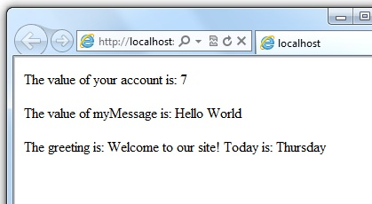
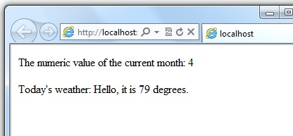
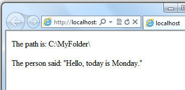
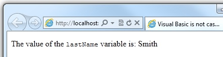
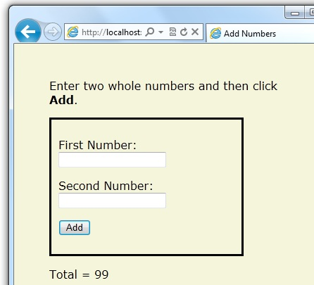
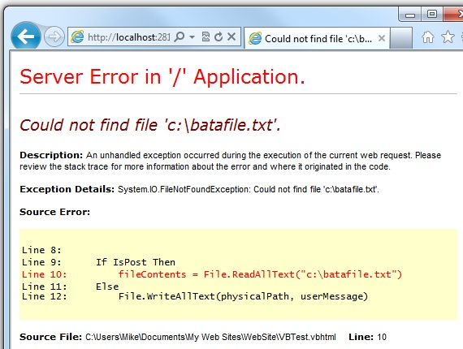

[Edit .md file](C:\Projects\msc\dev\Msc.Www\Web.ASP\App_Data\github\web-pages\overview\getting-started\introducing-razor-syntax-vb.md) | [Edit dev content](http://www.aspdev.net/umbraco#/content/content/edit/38950) | [View dev content](http://docs.aspdev.net/tutorials/web-pages/overview/getting-started/introducing-razor-syntax-vb.html) | [View prod content](http://www.asp.net/web-pages/overview/getting-started/introducing-razor-syntax-vb) | Picker: 38483

Introduction to ASP.NET Web Programming Using the Razor Syntax (Visual Basic)
====================
by [Tom FitzMacken](https://github.com/tfitzmac)

> This article gives you an overview of programming with ASP.NET Web Pages using the Razor syntax and Visual Basic. ASP.NET is Microsoft's technology for running dynamic web pages on web servers.
> 
> **What you'll learn**:
> 
> - The top 8 programming tips for getting started with programming ASP.NET Web Pages using Razor syntax.
> - Basic programming concepts you'll need.
> - What ASP.NET server code and the Razor syntax is all about.
>   
> 
> ## Software versions
> 
> 
> - ASP.NET Web Pages (Razor) 3
>   
> 
> This tutorial also works with ASP.NET Web Pages 2.

Most examples of using ASP.NET Web Pages with Razor syntax use C#. But the Razor syntax also supports Visual Basic. To program an ASP.NET web page in Visual Basic, you create a web page with a *.vbhtml* filename extension, and then add Visual Basic code. This article gives you an overview of working with the Visual Basic language and syntax to create ASP.NET Webpages.

> [!NOTE] The default website templates for Microsoft WebMatrix (**Bakery**, **Photo Gallery**, and **Starter Site**, etc.) are available in C# and Visual Basic versions. You can install the Visual Basic templates by as NuGet packages. Website templates are installed in the root folder of your site in a folder named *Microsoft Templates*.

## The Top 8 Programming Tips

This section lists a few tips that you absolutely need to know as you start writing ASP.NET server code using the Razor syntax.

### 1. You add code to a page using the @ character

The `@` character starts inline expressions, single-statement blocks, and multi-statement blocks:

    <!-- Single statement blocks  -->
    @Code  Dim total = 7  End Code
    @Code  Dim myMessage = "Hello World" End Code
    
    <!-- Inline expressions -->
    
The value of your account is: @total 

    
The value of myMessage is: @myMessage
        
        
    <!-- Multi-statement block -->    
    @Code 
        Dim greeting = "Welcome to our site!"
        Dim weekDay = DateTime.Now.DayOfWeek
        Dim greetingMessage = greeting & " Today is: " & weekDay.ToString()
    End Code 
    
The greeting is: @greetingMessage

The result displayed in a browser:

> [!TIP] 
> 
> ### HTML Encoding
> 
> When you display content in a page using the `@` character, as in the preceding examples, ASP.NET HTML-encodes the output. This replaces reserved HTML characters (such as `<` and `>` and `&`) with codes that enable the characters to be displayed as characters in a web page instead of being interpreted as HTML tags or entities. Without HTML encoding, the output from your server code might not display correctly, and could expose a page to security risks.
> 
> If your goal is to output HTML markup that renders tags as markup (for example `

` for a paragraph or `<em></em>` to emphasize text), see the section [Combining Text, Markup, and Code in Code Blocks](#BM_CombiningTextMarkupAndCode) later in this article.
> 
> You can read more about HTML encoding in [Working with HTML Forms in ASP.NET Web Pages Sites](https://go.microsoft.com/fwlink/?LinkId=202892).

### 2. You enclose code blocks with Code...End Code

A code block includes one or more code statements and is enclosed with the keywords `Code` and `End Code`. Place the opening `Code` keyword immediately after the `@` character &#8212; there can't be whitespace between them.

    <!-- Single statement block.  -->
    @Code
        Dim theMonth = DateTime.Now.Month
    End Code
    
The numeric value of the current month: @theMonth

    
    <!-- Multi-statement block. -->
    @Code
        Dim outsideTemp = 79
        Dim weatherMessage = "Hello, it is " & outsideTemp & " degrees."
    End Code 
    
Today's weather: @weatherMessage

The result displayed in a browser:

### 3. Inside a block, you end each code statement with a line break

In a Visual Basic code block, each statement ends with a line break. (Later in the article you'll see a way to wrap a long code statement into multiple lines if needed.)

    <!-- Single statement block. -->
    @Code
        Dim theMonth = DateTime.Now.Month
    End Code
    
    <!-- Multi-statement block. -->
    @Code
        Dim outsideTemp = 79
        Dim weatherMessage = "Hello, it is " & outsideTemp & " degrees."
    End Code 
    
    <!-- An inline expression, so no line break needed. -->
    
Today's weather: @weatherMessage

### 4. You use variables to store values

You can store values in a *variable*, including strings, numbers, and dates, etc. You create a new variable using the `Dim` keyword. You can insert variable values directly in a page using `@`.

    <!-- Storing a string -->
    @Code 
        Dim welcomeMessage = "Welcome, new members!"
    End Code
    
@welcomeMessage

        
    <!-- Storing a date -->
    @Code 
        Dim year = DateTime.Now.Year
    End Code
    
    <!-- Displaying a variable -->
    
Welcome to our new members who joined in @year!

The result displayed in a browser:

### 5. You enclose literal string values in double quotation marks

A *string* is a sequence of characters that are treated as text. To specify a string, you enclose it in double quotation marks:

    @Code 
        Dim myString = "This is a string literal"
    End Code

To embed double quotation marks within a string value, insert two double quotation mark characters. If you want the double quotation character to appear once in the page output, enter it as `""` within the quoted string, and if you want it to appear twice, enter it as `""""` within the quoted string.

    <!-- Embedding double quotation marks in a string -->
    @Code 
        Dim myQuote = "The person said: ""Hello, today is Monday."""
    End Code
    
@myQuote

The result displayed in a browser:

### 6. Visual Basic code is not case sensitive

The Visual Basic language is not case sensitive. Programming keywords (like `Dim`, `If`, and `True`) and variable names (like `myString`, or `subTotal`) can be written in any case.

The following lines of code assign a value to the variable `lastname` using a lowercase name, and then output the variable value to the page using an uppercase name.

    @Code 
        Dim lastName = "Smith"
        ' Keywords like dim are also not case sensitive.
        DIM someNumber = 7
    End Code
    
The value of the <code>lastName</code> variable is: @LASTNAME

The result displayed in a browser:

### 7. Much of your coding involves working with objects

An object represents a thing that you can program with &#8212; a page, a text box, a file, an image, a web request, an email message, a customer record (database row), etc. Objects have properties that describe their characteristics &#8212; a text box object has a `Text` property, a request object has a `Url` property, an email message has a `From` property, and a customer object has a `FirstName` property. Objects also have methods that are the &quot;verbs&quot; they can perform. Examples include a file object's `Save` method, an image object's `Rotate` method, and an email object's `Send` method.

You'll often work with the `Request` object, which gives you information like the values of form fields on the page (text boxes, etc.), what type of browser made the request, the URL of the page, the user identity, etc. This example shows how to access properties of the `Request` object and how to call the `MapPath` method of the `Request` object, which gives you the absolute path of the page on the server:

    <table border="1"> 
        <tr>
            <td>Requested URL</td>
            <td>Relative Path</td>
            <td>Full Path</td>
            <td>HTTP Request Type</td>
        </tr>
        <tr>
            <td>@Request.Url</td>
            <td>@Request.FilePath</td>
            <td>@Request.MapPath(Request.FilePath)</td>
            <td>@Request.RequestType</td>
        </tr>
    </table>

The result displayed in a browser:

### 8. You can write code that makes decisions

A key feature of dynamic web pages is that you can determine what to do based on conditions. The most common way to do this is with the `If` statement (and optional `Else` statement).

    @Code
       Dim result = ""
       If IsPost Then
          result = "This page was posted using the Submit button."
       Else
          result = "This was the first request for this page."
       End If
    End Code
    <!DOCTYPE html>
    <html lang="en">
        <head>
            <meta charset="utf-8" />
            <title>Write Code that Makes Decisions</title>
        </head>
    <body>
        
        <form method="POST" action="" >
            <input type="Submit" name="Submit" value="Submit"/>
            
@result

        </form>
        
    </body>
    </html>

The statement `If IsPost` is a shorthand way of writing `If IsPost = True`. Along with `If` statements, there are a variety of ways to test conditions, repeat blocks of code, and so on, which are described later in this article.

The result displayed in a browser (after clicking **Submit**):

> [!TIP] 
> 
> ### HTTP GET and POST Methods and the IsPost Property
> 
> The protocol used for web pages (HTTP) supports a very limited number of methods (&quot;verbs&quot;) that are used to make requests to the server. The two most common ones are GET, which is used to read a page, and POST, which is used to submit a page. In general, the first time a user requests a page, the page is requested using GET. If the user fills in a form and then clicks **Submit**, the browser makes a POST request to the server.
> 
> In web programming, it's often useful to know whether a page is being requested as a GET or as a POST so that you know how to process the page. In ASP.NET Web Pages, you can use the `IsPost` property to see whether a request is a GET or a POST. If the request is a POST, the `IsPost` property will return true, and you can do things like read the values of text boxes on a form. Many examples you'll see show you how to process the page differently depending on the value of `IsPost`.

## A Simple Code Example

This procedure shows you how to create a page that illustrates basic programming techniques. In the example, you create a page that lets users enter two numbers, then it adds them and displays the result.

1. In your editor, create a new file and name it *AddNumbers.vbhtml*.
2. Copy the following code and markup into the page, replacing anything already in the page.

        @Code
            Dim total = 0
            Dim totalMessage = ""
            if IsPost Then
                ' Retrieve the numbers that the user entered.
                Dim num1 = Request("text1")
                Dim num2 = Request("text2")
                ' Convert the entered strings into integers numbers and add.
                total = num1.AsInt() + num2.AsInt()
                totalMessage = "Total = " & total
            End If
        End Code
        <!DOCTYPE html>
        <html lang="en">
            <head>
                <meta charset="utf-8" />
                <title>Adding Numbers</title>
                
            </head>
        <body>
            
Enter two whole numbers and click <strong>Add</strong> to display the result.

            

            <form action="" method="post">
            
<label for="text1">First Number:</label>
            <input type="text" name="text1" />
            

            
<label for="text2">Second Number:</label>
            <input type="text" name="text2" />
            

            
<input type="submit" value="Add" />

            </form>
            
@totalMessage

        </body>
        </html>

    Here are some things for you to note:

    - The `@` character starts the first block of code in the page, and it precedes the `totalMessage` variable embedded near the bottom.
    - The block at the top of the page is enclosed in `Code...End Code`.
    - The variables `total`, `num1`, `num2`, and `totalMessage` store several numbers and a string.
    - The literal string value assigned to the `totalMessage` variable is in double quotation marks.
    - Because Visual Basic code is not case sensitive, when the `totalMessage` variable is used near the bottom of the page, its name only needs to match the spelling of the variable declaration at the top of the page. The casing doesn't matter.
    - The expression `num1.AsInt()` + `num2.AsInt()` shows how to work with objects and methods. The `AsInt` method on each variable converts the string entered by a user to a whole number (an integer) that can be added.
    - The `<form>` tag includes a `method="post"` attribute. This specifies that when the user clicks **Add**, the page will be sent to the server using the HTTP POST method. When the page is submitted, the code `If IsPost` evaluates to true and the conditional code runs, displaying the result of adding the numbers.
3. Save the page and run it in a browser. (Make sure the page is selected in the **Files** workspace before you run it.) Enter two whole numbers and then click the **Add** button.

    

## Visual Basic Language and Syntax

Earlier you saw a basic example of how to create an ASP.NET web page, and how you can add server code to HTML markup. Here you'll learn the basics of using Visual Basic to write ASP.NET server code using the Razor syntax &#8212; that is, the programming language rules.

If you're experienced with programming (especially if you've used C, C++, C#, Visual Basic, or JavaScript), much of what you read here will be familiar. You'll probably need to familiarize yourself only with how WebMatrix code is added to markup in *.vbhtml* files.

###   Combining text, markup, and code in code blocks

In server code blocks, you'll often want to output text and markup to the page. If a server code block contains text that's not code and that instead should be rendered as is, ASP.NET needs to be able to distinguish that text from code. There are several ways to do this.

- Enclose the text in an HTML block element like `

` or `<em></em>`:

        @If IsPost Then
            ' This line has all content between matched 
 tags.
            @
Hello, the time is @DateTime.Now and this page is a postback!
 
        Else
            ' All content between matched tags, followed by server code.
            @
Hello, <em>Stranger!</em> today is: 
 @DateTime.Now
        End If

    The HTML element can include text, additional HTML elements, and server-code expressions. When ASP.NET sees the opening HTML tag (for example, `
`), it renders everything the element and its content as is to the browser (and resolves the server-code expressions).

- Use the `@:` operator or the `<text>` element. The `@:` outputs a single line of content containing plain text or unmatched HTML tags; the `<text>` element encloses multiple lines to output. These options are useful when you don't want to render an HTML element as part of the output.

        @If IsPost Then
            ' Plain text followed by an unmatched HTML tag and server code.
            @:The time is:   @DateTime.Now
            ' Server code and then plain text, matched tags, and more text.
            @DateTime.Now @:is the <em>current</em> time.
        End If

    The following example repeats the previous example but uses a single pair of `<text>` tags to enclose the text to render.

        @If IsPost Then
            @<text>
            The time is:   @DateTime.Now
            @DateTime.Now is the <em>current</em> time.
            </text>
        End If

    In the following example, the `<text>` and `</text>` tags enclose three lines, all of which have some uncontained text and unmatched HTML tags (` `), along with server code and matched HTML tags. Again, you could also precede each line individually with the `@:` operator; either way works.

        @Code
            dim minTemp = 75 
            @<text>It is the month of @DateTime.Now.ToString("MMMM"), and  
            it's a <em>great</em> day! 
You can go swimming if it's at 
            least @minTemp degrees.
</text>
        End Code

    > [!NOTE] When you output text as shown in this section &#8212; using an HTML element, the `@:` operator, or the `<text>` element &#8212; ASP.NET doesn't HTML-encode the output. (As noted earlier, ASP.NET does encode the output of server code expressions and server code blocks that are preceded by `@`, except in the special cases noted in this section.)

### Whitespace

Extra spaces in a statement (and outside of a string literal) don't affect the statement:

    @Code Dim personName =    "Smith"    End Code

### Breaking long statements into multiple lines

You can break a long code statement into multiple lines by using the underscore character `_` (which in Visual Basic is called the *continuation character*) after each line of code. To break a statement onto the next line, at the end of the line add a space and then the continuation character. Continue the statement on the next line. You can wrap statements onto as many lines as you need to improve readability. The following statements are the same:

    @Code
        Dim familyName _
        =  "Smith" 
    End Code
    
    @Code
        Dim _
        theName _
        = _
        "Smith"
    End Code

However, you can't wrap a line in the middle of a string literal. The following example doesn't work:

    @Code 
        ' Doesn't work.
        Dim test = "This is a long _
          string"
    End Code

To combine a long string that wraps to multiple lines like the above code, you would need to use the *concatenation operator* (`&`), which you'll see later in this article.

### Code comments

Comments let you leave notes for yourself or others. Razor syntax comments are prefixed with `@*` and end with `*@`.

    @* A single-line comment is added like this example. *@
        
    @*
        This is a multiline code comment. 
        It can continue for any number of lines.
    *@

Within code blocks you can use the Razor syntax comments, or you can use ordinary Visual Basic comment character, which is a single quote (`'`) prefixed to each line.

    @Code
        ' You can make comments in blocks by just using ' before each line.
    End Code
        
    @Code
        ' There is no multi-line comment character in Visual Basic. 
        ' You use a ' before each line you want to comment. 
    End Code

## Variables

A variable is a named object that you use to store data. You can name variables anything, but the name must begin with an alphabetic character and it cannot contain whitespace or reserved characters. In Visual Basic, as you saw earlier, the case of the letters in a variable name doesn't matter.

### Variables and data types

A variable can have a specific data type, which indicates what kind of data is stored in the variable. You can have string variables that store string values (like &quot;Hello world&quot;), integer variables that store whole-number values (like 3 or 79), and date variables that store date values in a variety of formats (like 4/12/2012 or March 2009). And there are many other data types you can use.

However, you don't have to specify a type for a variable. In most cases ASP.NET can figure out the type based on how the data in the variable is being used. (Occasionally you must specify a type; you'll see examples where this is true.)

To declare a variable without specifying a type, use `Dim` plus the variable name (for instance, `Dim myVar`). To declare a variable with a type, use `Dim` plus the variable name, followed by `As` and then the type name (for instance, `Dim myVar As String`).

    @Code
        ' Assigning a string to a variable.
        Dim greeting = "Welcome" 
        
        ' Assigning a number to a variable.
        Dim theCount = 3
        
        ' Assigning an expression to a variable.
        Dim monthlyTotal = theCount + 5
        
        ' Assigning a date value to a variable.
        Dim today = DateTime.Today
        
        ' Assigning the current page's URL to a variable.
        Dim myPath = Request.Url
        
        ' Declaring variables using explicit data types.
        Dim name as String = "Joe"
        Dim count as Integer = 5
        Dim tomorrow as DateTime = DateTime.Now.AddDays(1)
    End Code

The following example shows some inline expressions that use the variables in a web page.

    @Code
        ' Embedding the value of a variable into HTML markup.
        ' Precede the markup with @ because we are in a code block.
        @
@greeting, friends!

    End Code
    
    <!-- Using a variable with an inline expression in HTML. --> 
    
The predicted annual total is: @( monthlyTotal * 12)

    
    <!--  Displaying the page URL with a variable. --> 
    
The URL to this page is:  @myPath

The result displayed in a browser:

### Converting and testing data types

Although ASP.NET can usually determine a data type automatically, sometimes it can't. Therefore, you might need to help ASP.NET out by performing an explicit conversion. Even if you don't have to convert types, sometimes it's helpful to test to see what type of data you might be working with.

The most common case is that you have to convert a string to another type, such as to an integer or date. The following example shows a typical case where you must convert a string to a number.

    @Code
        Dim total = 0
        Dim totalMessage = ""
        if IsPost Then
            ' Retrieve the numbers that the user entered.
            Dim num1 = Request("text1")
            Dim num2 = Request("text2")
            ' Convert the entered strings into integers numbers and add.
            total = num1.AsInt() + num2.AsInt()
            totalMessage = "Total = " & total
        End If
    End Code

As a rule, user input comes to you as strings. Even if you've prompted the user to enter a number, and even if they've entered a digit, when user input is submitted and you read it in code, the data is in string format. Therefore, you must convert the string to a number. In the example, if you try to perform arithmetic on the values without converting them, the following error results, because ASP.NET cannot add two strings:

`Cannot implicitly convert type 'string' to 'int'.`

To convert the values to integers, you call the `AsInt` method. If the conversion is successful, you can then add the numbers.

The following table lists some common conversion and test methods for variables.

| **Method** | **Description** | **Example** |
| --- | --- | --- |
| `AsInt(), IsInt()` | Converts a string that represents a whole number (like &quot;593&quot;) to an integer. | Dim myIntNumber = 0 Dim myStringNum = "539" If myStringNum.IsInt() Then myIntNumber = myStringNum.AsInt() End If |
| `AsBool(), IsBool()` | Converts a string like &quot;true&quot; or &quot;false&quot; to a Boolean type. | Dim myStringBool = "True" Dim myVar = myStringBool.AsBool() |
| `AsFloat(), IsFloat()` | Converts a string that has a decimal value like &quot;1.3&quot; or &quot;7.439&quot; to a floating-point number. | Dim myStringFloat = "41.432895" Dim myFloatNum = myStringFloat.AsFloat() |
| `AsDecimal(), IsDecimal()` | Converts a string that has a decimal value like &quot;1.3&quot; or &quot;7.439&quot; to a decimal number. (In ASP.NET, a decimal number is more precise than a floating-point number.) | Dim myStringDec = "10317.425" Dim myDecNum = myStringDec.AsDecimal() |
| `AsDateTime(), IsDateTime()` | Converts a string that represents a date and time value to the ASP.NET `DateTime` type. | Dim myDateString = "12/27/2012" Dim newDate = myDateString.AsDateTime() |
| `ToString()` | Converts any other data type to a string. | Dim num1 As Integer = 17 Dim num2 As Integer = 76 ' myString is set to 1776 Dim myString as String = num1.ToString() & _ num2.ToString() |

## Operators

An operator is a keyword or character that tells ASP.NET what kind of command to perform in an expression. Visual Basic supports many operators, but you only need to recognize a few to get started developing ASP.NET web pages. The following table summarizes the most common operators.

| **Operator** | **Description** | **Examples** |
| --- | --- | --- |
| `+ - * /` | Math operators used in numerical expressions. | @(5 + 13) Dim netWorth = 150000 Dim newTotal = netWorth * 2 @(newTotal / 2) |
| `=` | Assignment and equality. Depending on context, either assigns the value on the right side of a statement to the object on the left side, or checks the values for equality. | Dim age = 17 Dim income = Request("AnnualIncome") |
| `<>` | Inequality. Returns `True` if the values are not equal. | Dim theNum = 13 If theNum <> 15 Then ' Do something. End If |
| `< > <= >=` | Less than, greater than, less than or equal, and greater than or equal. | If 2 < 3 Then ' Do something. End If Dim currentCount = 12 If currentCount >= 12 Then ' Do something. End If |
| `&` | Concatenation, which is used to join strings. | ' The displayed result is "abcdef". @("abc" & "def") |
| `+= -=` | The increment and decrement operators, which add and subtract 1 (respectively) from a variable. | Dim theCount As Integer = 0 theCount += 1 ' Adds 1 to count |
| `.` | Dot. Used to distinguish objects and their properties and methods. | Dim myUrl = Request.Url Dim count = Request("Count").AsInt() |
| `()` | Parentheses. Used to group expressions, to pass parameters to methods, and to access members of arrays and collections. | @(3 + 7) @Request.MapPath(Request.FilePath) |
| `Not` | Not. Reverses a true value to false and vice versa. Typically used as a shorthand way to test for `False` (that is, for not `True`). | Dim taskCompleted As Boolean = False ' Processing. If Not taskCompleted Then ' Continue processing End If |
| `AndAlso OrElse` | Logical AND and OR, which are used to link conditions together. | Dim myTaskCompleted As Boolean = false Dim totalCount As Integer = 0 ' Processing. If (Not myTaskCompleted) AndAlso _ totalCount < 12 Then ' Continue processing. End If |

## Working with File and Folder Paths in Code

You'll often work with file and folder paths in your code. Here is an example of physical folder structure for a website as it might appear on your development computer:

`C:\WebSites\MyWebSite default.cshtml datafile.txt \images Logo.jpg \styles Styles.css`

Here are some essential details about URLs and paths:

- A URL begins with either a domain name (`http://www.example.com`) or a server name (`http://localhost`, `http://mycomputer`).
- A URL corresponds to a physical path on a host computer. For example, `http://myserver` might correspond to the folder *C:\websites\mywebsite* on the server.
- A virtual path is shorthand to represent paths in code without having to specify the full path. It includes the portion of a URL that follows the domain or server name. When you use virtual paths, you can move your code to a different domain or server without having to update the paths.

Here's an example to help you understand the differences:

| Complete URL | `http://mycompanyserver/humanresources/CompanyPolicy.htm` |
| --- | --- |
| Server name | *mycompanyserver* |
| Virtual path | */humanresources/CompanyPolicy.htm* |
| Physical path | *C:\mywebsites\humanresources\CompanyPolicy.htm* |

The virtual root is /, just like the root of your C: drive is \. (Virtual folder paths always use forward slashes.) The virtual path of a folder doesn't have to have the same name as the physical folder; it can be an alias. (On production servers, the virtual path rarely matches an exact physical path.)

When you work with files and folders in code, sometimes you need to reference the physical path and sometimes a virtual path, depending on what objects you're working with. ASP.NET gives you these tools for working with file and folder paths in code: the `Server.MapPath` method, and the `~` operator and `Href` method.

### Converting virtual to physical paths: the Server.MapPath method

The `Server.MapPath` method converts a virtual path (like */default.cshtml*) to an absolute physical path (like *C:\WebSites\MyWebSiteFolder\default.cshtml*). You use this method any time you need a complete physical path. A typical example is when you're reading or writing a text file or image file on the web server.

You typically don't know the absolute physical path of your site on a hosting site's server, so this method can convert the path you do know — the virtual path — to the corresponding path on the server for you. You pass the virtual path to a file or folder to the method, and it returns the physical path:

    @Code
        Dim dataFilePath = "~/dataFile.txt"
    End Code    
    
    <!-- Displays a physical path C:\Websites\MyWebSite\datafile.txt  --> 
    
@Server.MapPath(dataFilePath)

### Referencing the virtual root: the ~ operator and Href method

In a *.cshtml* or *.vbhtml* file, you can reference the virtual root path using the `~` operator. This is very handy because you can move pages around in a site, and any links they contain to other pages won't be broken. It's also handy in case you ever move your website to a different location. Here are some examples:

    @Code
        Dim myImagesFolder = "~/images"
        Dim myStyleSheet = "~/styles/StyleSheet.css"       
    End Code

If the website is `http://myserver/myapp`, here's how ASP.NET will treat these paths when the page runs:

- `myImagesFolder`: `http://myserver/myapp/images`
- `myStyleSheet` : `http://myserver/myapp/styles/Stylesheet.css`

(You won't actually see these paths as the values of the variable, but ASP.NET will treat the paths as if that's what they were.)

You can use the `~` operator both in server code (as above) and in markup, like this:

    <!-- Examples of using the ~ operator in markup in ASP.NET Web Pages -->
    
    <a href="~/Default">Home</a>
    

In markup, you use the `~` operator to create paths to resources like image files, other web pages, and CSS files. When the page runs, ASP.NET looks through the page (both code and markup) and resolves all the `~` references to the appropriate path.

## Conditional Logic and Loops

ASP.NET server code lets you perform tasks based on conditions and write code that repeats statements a specific number of times that is, code that runs a loop).

### Testing conditions

To test a simple condition you use the `If...Then` statement, which returns `True` or `False` based on a test you specify:

    @Code
        Dim showToday = True
        If showToday Then
            DateTime.Today
        End If
    End Code

The `If` keyword starts a block. The actual test (condition) follows the `If` keyword and returns true or false. The `If` statement ends with `Then`. The statements that will run if the test is true are enclosed by `If` and `End If`. An `If` statement can include an `Else` block that specifies statements to run if the condition is false:

    @Code
        Dim showToday = False
        If showToday Then
            DateTime.Today
        Else
            @<text>Sorry!</text>
        End If
    End Code

If an `If` statement starts a code block, you don't have to use the normal `Code...End Code` statements to include the blocks. You can just add `@` to the block, and it will work. This approach works with `If` as well as other Visual Basic programming keywords that are followed by code blocks, including `For`, `For Each`, `Do While`, etc.

    @If showToday Then
        DateTime.Today
    Else
        @<text>Sorry!</text>
    End If

You can add multiple conditions using one or more `ElseIf` blocks:

    @Code
        Dim theBalance = 4.99
        If theBalance = 0 Then
            @
You have a zero balance.

        ElseIf theBalance > 0 AndAlso theBalance <= 5 Then
            ' If the balance is above 0 but less than
            ' or equal to $5, display this message.
            @
Your balance of $@theBalance is very low.

        Else
            ' For balances greater than $5, display balance.
            @
Your balance is: $@theBalance

        End If    
    End Code

In this example, if the first condition in the `If` block is not true, the `ElseIf` condition is checked. If that condition is met, the statements in the `ElseIf` block are executed. If none of the conditions are met, the statements in the `Else` block are executed. You can add any number of `ElseIf` blocks, and then close with an `Else` block as the &quot;everything else&quot; condition.

To test a large number of conditions, use a `Select Case` block:

    @Code
        Dim weekday = "Wednesday"
        Dim greeting = ""
        
        Select Case weekday
            Case "Monday"
                greeting = "Ok, it's a marvelous Monday."
            Case "Tuesday"
                greeting = "It's a tremendous Tuesday."
            Case "Wednesday"
                greeting = "Wild Wednesday is here!"
            Case Else
                greeting = "It's some other day, oh well."
        End Select
    End Code
    
Since it is @weekday, the message for today is: @greeting

The value to test is in parentheses (in the example, the weekday variable). Each individual test uses a `Case` statement that lists a value. If the value of a `Case` statement matches the test value, the code in that `Case` block is executed.

The result of the last two conditional blocks displayed in a browser:

### Looping code

You often need to run the same statements repeatedly. You do this by looping. For example, you often run the same statements for each item in a collection of data. If you know exactly how many times you want to loop, you can use a `For` loop. This kind of loop is especially useful for counting up or counting down:

    @For i = 10 To 20
        @
Item #: @i

    Next i

The loop begins with the `For` keyword, followed by three elements:

- Immediately after the `For` statement, you declare a counter variable (you don't have to use `Dim`) and then indicate the range, as in `i = 10 to 20`. This means the variable `i` will start counting at 10 and continue until it reaches 20 (inclusive).
- Between the `For` and `Next` statements is the content of the block. This can contain one or more code statements that execute with each loop.
- The `Next i` statement ends the loop. It increments the counter and starts the next iteration of the loop.

The line of code between the `For` and `Next` lines contains the code that runs for each iteration of the loop. The markup creates a new paragraph (`
` element) each time and adds a line to the output, displaying the value of i (the counter). When you run this page, the example creates 11 lines displaying the output, with the text in each line indicating the item number.

If you're working with a collection or array, you often use a `For Each` loop. A collection is a group of similar objects, and the `For Each` loop lets you carry out a task on each item in the collection. This type of loop is convenient for collections, because unlike a `For` loop, you don't have to increment the counter or set a limit. Instead, the `For Each` loop code simply proceeds through the collection until it's finished.

This example returns the items in the `Request.ServerVariables` collection (which contains information about your web server). It uses a `For Each` loop to display the name of each item by creating a new `<li>` element in an HTML bulleted list.

    <ul>
    @For Each myItem In Request.ServerVariables
        @<li>@myItem</li>
    Next myItem
    </ul>

The `For Each` keyword is followed by a variable that represents a single item in the collection (in the example, `myItem`), followed by the `In` keyword, followed by the collection you want to loop through. In the body of the `For Each` loop, you can access the current item using the variable that you declared earlier.

To create a more general-purpose loop, use the `Do While` statement:

    @Code
        Dim countNum = 0
        Do While countNum < 50
            countNum += 1
            @
Line #@countNum: 

        Loop
    End Code

This loop begins with the `Do While` keyword, followed by a condition, followed by the block to repeat. Loops typically increment (add to) or decrement (subtract from) a variable or object used for counting. In the example, the `+=` operator adds 1 to the value of a variable each time the loop runs. (To decrement a variable in a loop that counts down, you would use the decrement operator `-=`.)

## Objects and Collections

Nearly everything in an ASP.NET website is an object, including the web page itself. This section discusses some important objects you'll work with frequently in your code.

### Page objects

The most basic object in ASP.NET is the page. You can access properties of the page object directly without any qualifying object. The following code gets the page's file path, using the `Request` object of the page:

    @Code
        Dim path = Request.FilePath
    End Code

You can use properties of the `Page` object to get a lot of information, such as:

- `Request`. As you've already seen, this is a collection of information about the current request, including what type of browser made the request, the URL of the page, the user identity, etc.
- `Response`. This is a collection of information about the response (page) that will be sent to the browser when the server code has finished running. For example, you can use this property to write information into the response.

        @Code
            ' Access the page's Request object to retrieve the URL.
            Dim pageUrl = Request.Url
        End Code
            <a href="@pageUrl">My page</a>

### Collection objects (arrays and dictionaries)

A collection is a group of objects of the same type, such as a collection of `Customer` objects from a database. ASP.NET contains many built-in collections, like the `Request.Files` collection.

You'll often work with data in collections. Two common collection types are the *array* and the *dictionary*. An array is useful when you want to store a collection of similar items but don't want to create a separate variable to hold each item:

    <h3>Team Members</h3>
    @Code
        Dim teamMembers() As String = {"Matt", "Joanne", "Robert", "Nancy"}
        For Each name In teamMembers
            @
@name

        Next name
    End Code

With arrays, you declare a specific data type, such as `String`, `Integer`, or `DateTime`. To indicate that the variable can contain an array, you add parentheses to the variable name in the declaration (such as `Dim myVar() As String`). You can access items in an array using their position (index) or by using the `For Each` statement. Array indexes are zero-based &#8212; that is, the first item is at position 0, the second item is at position 1, and so on.

    @Code
        Dim teamMembers() As String = {"Matt", "Joanne", "Robert", "Nancy"}
        @
The number of names in the teamMembers array: @teamMembers.Length 

        @
Robert is now in position: @Array.IndexOf(teamMembers, "Robert")

        @
The array item at position 2 (zero-based) is @teamMembers(2)

        @<h3>Current order of team members in the list</h3>
        For Each name In teamMembers
            @
@name

        Next name
        @<h3>Reversed order of team members in the list</h3>
        Array.Reverse(teamMembers)
        For Each reversedItem In teamMembers
            @
@reversedItem

        Next reversedItem
    End Code

You can determine the number of items in an array by getting its `Length` property. To get the position of a specific item in the array (that is, to search the array), use the `Array.IndexOf` method. You can also do things like reverse the contents of an array (the `Array.Reverse` method) or sort the contents (the `Array.Sort` method).

The output of the string array code displayed in a browser:

A dictionary is a collection of key/value pairs, where you provide the key (or name) to set or retrieve the corresponding value:

    @Code
        Dim myScores = New Dictionary(Of String, Integer)()
        myScores.Add("test1", 71)
        myScores.Add("test2", 82)
        myScores.Add("test3", 100)
        myScores.Add("test4", 59)
    End Code
    
My score on test 3 is: @myScores("test3")%

    @Code 
        myScores("test4") = 79
    End Code
    
My corrected score on test 4 is: @myScores("test4")%

To create a dictionary, you use the `New` keyword to indicate that you're creating a new `Dictionary` object. You can assign a dictionary to a variable using the `Dim` keyword. You indicate the data types of the items in the dictionary using parentheses ( `( )` ). At the end of the declaration, you must add another pair of parentheses, because this is actually a method that creates a new dictionary.

To add items to the dictionary, you can call the `Add` method of the dictionary variable (`myScores` in this case), and then specify a key and a value. Alternatively, you can use parentheses to indicate the key and do a simple assignment, as in the following example:

    @Code
        myScores("test4") = 79
    End Code

To get a value from the dictionary, you specify the key in parentheses:

    @myScores("test4")

## Calling Methods with Parameters

As you saw earlier in this article, the objects that you program with have methods. For example, a `Database` object might have a `Database.Connect` method. Many methods also have one or more parameters. A *parameter* is a value that you pass to a method to enable the method to complete its task. For example, look at a declaration for the `Request.MapPath` method, which takes three parameters:

    Public Overridable Function MapPath (virtualPath As String, _
        baseVirtualDir As String, _
        allowCrossAppMapping As Boolean)

This method returns the physical path on the server that corresponds to a specified virtual path. The three parameters for the method are `virtualPath`, `baseVirtualDir`, and `allowCrossAppMapping`. (Notice that in the declaration, the parameters are listed with the data types of the data that they'll accept.) When you call this method, you must supply values for all three parameters.

When you're using Visual Basic with the Razor syntax, you have two options for passing parameters to a method: *positional parameters* or *named parameters*. To call a method using positional parameters, you pass the parameters in a strict order that's specified in the method declaration. (You would typically know this order by reading documentation for the method.) You must follow the order, and you can't skip any of the parameters &#8212; if necessary, you pass an empty string (`""`) or null for a positional parameter that you don't have a value for.

The following example assumes you have a folder named *scripts* on your website. The code calls the `Request.MapPath` method and passes values for the three parameters in the correct order. It then displays the resulting mapped path.

    @Code
        ' Pass parameters to a method using positional parameters.
        Dim myPathPositional = Request.MapPath("/scripts", "/", true)
    End Code
    
@myPathPositional

When there are many parameters for a method, you can keep your code cleaner and more readable by using named parameters. To call a method using named parameters, specify the parameter name followed by `:=` and then provide the value. An advantage of named parameters is that you can add them in any order you want. (A disadvantage is that the method call is not as compact.)

The following example calls the same method as above, but uses named parameters to supply the values:

    @Code
        ' Pass parameters to a method using named parameters.
        Dim myPathNamed = Request.MapPath(baseVirtualDir:= "/", allowCrossAppMapping:= true, virtualPath:= "/scripts")
    End Code
    
@myPathNamed

As you can see, the parameters are passed in a different order. However, if you run the previous example and this example, they'll return the same value.

## Handling Errors

### Try-Catch statements

You'll often have statements in your code that might fail for reasons outside your control. For example:

- If your code tries to open, create, read, or write a file, all sorts of errors might occur. The file you want might not exist, it might be locked, the code might not have permissions, and so on.
- Similarly, if your code tries to update records in a database, there can be permissions issues, the connection to the database might be dropped, the data to save might be invalid, and so on.

In programming terms, these situations are called *exceptions*. If your code encounters an exception, it generates (throws) an error message that is, at best, annoying to users.

In situations where your code might encounter exceptions, and in order to avoid error messages of this type, you can use `Try/Catch` statements. In the `Try` statement, you run the code that you're checking. In one or more `Catch` statements, you can look for specific errors (specific types of exceptions) that might have occurred. You can include as many `Catch` statements as you need to look for errors that you're anticipating.

> [!NOTE] We recommend that you avoid using the `Response.Redirect` method in `Try/Catch` statements, because it can cause an exception in your page.

The following example shows a page that creates a text file on the first request and then displays a button that lets the user open the file. The example deliberately uses a bad file name so that it will cause an exception. The code includes `Catch` statements for two possible exceptions: `FileNotFoundException`, which occurs if the file name is bad, and `DirectoryNotFoundException`, which occurs if ASP.NET can't even find the folder. (You can uncomment a statement in the example in order to see how it runs when everything works properly.)

If your code didn't handle the exception, you would see an error page like the previous screen shot. However, the `Try/Catch` section helps prevent the user from seeing these types of errors.

    @Code
        Dim dataFilePath = "~/dataFile.txt"
        Dim fileContents = ""
        Dim physicalPath = Server.MapPath(dataFilePath)
        Dim userMessage = "Hello world, the time is " + DateTime.Now
        Dim userErrMsg = ""
        Dim errMsg = ""
        
        If IsPost Then
            ' When the user clicks the "Open File" button and posts
            ' the page, try to open the file.
            Try
                ' This code fails because of faulty path to the file.
                fileContents = File.ReadAllText("c:\batafile.txt")
                
                ' This code works. To eliminate error on page, 
                ' comment the above line of code and uncomment this one.
                ' fileContents = File.ReadAllText(physicalPath)
                
            Catch ex As FileNotFoundException
                ' You can use the exception object for debugging, logging, etc.
                errMsg = ex.Message
                ' Create a friendly error message for users.
                userErrMsg = "The file could not be opened, please contact " _
                    & "your system administrator."
                    
            Catch ex As DirectoryNotFoundException
                ' Similar to previous exception.
                errMsg = ex.Message
                userErrMsg = "The file could not be opened, please contact " _
                    & "your system administrator."
            End Try
        Else
            ' The first time the page is requested, create the text file.
            File.WriteAllText(physicalPath, userMessage)
        End If
    End Code
    <!DOCTYPE html>
    <html lang="en">
        <head>
            <meta charset="utf-8" />
            <title>Try-Catch Statements</title>
        </head>
        <body>  
        <form method="POST" action="" >
          <input type="Submit" name="Submit" value="Open File"/>
        </form>
        
        
@fileContents

        
@userErrMsg

        
        </body>
    </html>

## Additional Resources

### Reference Documentation

- [ASP.NET](https://msdn.microsoft.com/en-us/library/ee532866.aspx)
- [Visual Basic Language](https://msdn.microsoft.com/en-us/library/2x7h1hfk.aspx)