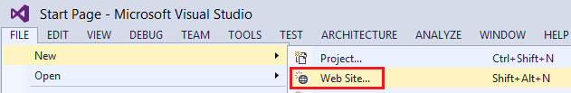
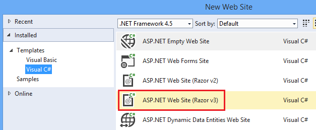
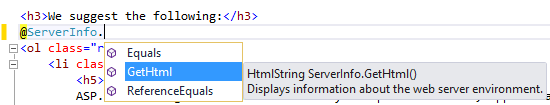
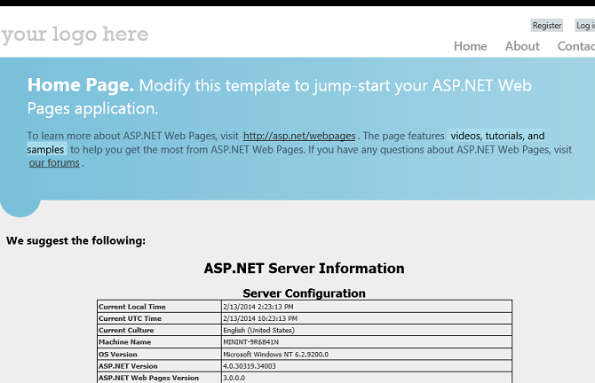
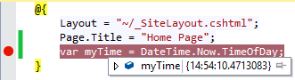
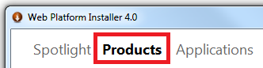
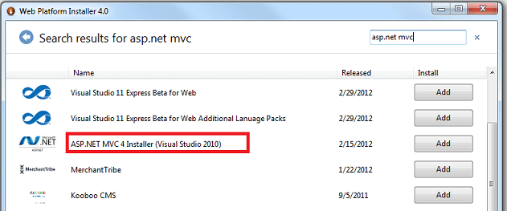

Programming ASP.NET Web Pages (Razor) Using Visual Studio
====================
by [Tom FitzMacken](https://github.com/tfitzmac)

> This article explains how you can use Visual Studio or Visual Web Developer Express to program ASP.NET Web Pages (Razor) websites.
> 
> What you'll learn
> 
> - What you need to install (if anything) to work with ASP.NET Web Pages in your version of Visual Studio.
> - How to add support for ASP.NET Web Pages to Visual Web Developer 2010 Express.
> - How to use features in Visual Studio to work with ASP.NET Razor pages, including IntelliSense and the debugger.
>   
> 
> ## Software versions used in the tutorial
> 
> 
> - ASP.NET Web Pages (Razor) 3
> - Visual Studio 2013
> - WebMatrix 3
>   
> 
> This tutorial also works with ASP.NET Web Pages 2, Visual Studio 2012, Visual Studio 2010, and WebMatrix 2.

You can program ASP.NET Web pages with Razor syntax using WebMatrix or many other code editors. You can also use Microsoft Visual Studio which is a full-featured integrated development environment (IDE) that provides a powerful set of tools for creating many types of applications (not just websites). To work with ASP.NET Razor pages, you can either use one of the full editions of Visual Studio or the free [Visual Studio Express for Web](https://www.visualstudio.com/downloads/download-visual-studio-vs#d-2013-express) edition.

Two particularly useful features that Visual Studio provides for programming with ASP.NET Razor web pages are:

- *IntelliSense*. The IntelliSense feature built into Visual Studio is more comprehensive than IntelliSense in WebMatrix.
- *Debugger*. The debugger lets you troubleshoot your code by stopping a program while it's running, examining variables, and stepping through the code line by line.

## Using Visual Studio with Different Versions of ASP.NET Web Pages

Visual Studio 2012 and Visual Studio 2013 include support for ASP.NET Web Pages. (The packages that are required in order to support ASP.NET Web Pages are installed when you install Visual Studio.)

Visual Studio 2010 does not include support by default for ASP.NET Web Pages. To use ASP.NET Web Pages with Visual Studio 2010, you must install the ASP.NET MVC package. To get ASP.NET Web Pages 2, you install ASP.NET MVC 4.

The following table summarizes the support for ASP.NET Web Pages in different versions of Visual Studio.

|  | Visual Studio 2010 | Visual Studio 2012 | Visual Studio 2013 |
| --- | --- | --- | --- |
| **ASP.NET Web Pages 2** | Install ASP.NET MVC 4 | (Included) | (Included) |
| **ASP.NET Web Pages 3** |  | Update to ASP.NET Web Pages 3 through NuGet | (Included) |

To work with Visual Studio 2010, see [Installing Support for ASP.NET Web Pages in Visual Studio 2010](#vs2010support).

## Launching Visual Studio from WebMatrix

If you have started a project in WebMatrix and want to switch to Visual Studio, WebMatrix provides a button to easily open the project in Visual Studio. You must have Visual Studio installed on your computer for this button to be enabled. The following image shows the button in WebMatrix.

When you click the button, the project is opened in Visual Studio. You can switch back and forth between WebMatrix and Visual Studio without any problems. You will be notified if any files have changed in the other environment and need to be reloaded to get the latest changes.

## Creating ASP.NET Razor Site in Visual Studio

To create an ASP.NET Razor website in Visual Studio:

1. Start Visual Studio or Visual Web Developer.
2. In the **File** menu, click **New Web Site**.

    
3. In the **New Web Site** dialog box, select the language to use (Visual C# or Visual Basic).
4. Select the **ASP.NET Web Site (Razor)** template.

    
5. Click **OK**.

Your new project exists and is populated with some default web pages to help you get started.

### Using IntelliSense

Now that you've created a site, you can see how IntelliSense works in Visual Studio.

1. In the website you just created, open the *Default.cshtml* page.
2. After the `<h3>` tags in the page, type `@ServerInfo.` (including the dot). Notice how IntelliSense displays the available methods for the `ServerInfo` helper in a drop-down list. 

    
3. Select the `GetHtml` method from the list and then press Enter. IntelliSense automatically fills in the method. (As with any method in C#, you must add `()` characters after the method.)  
 The completed code for the `GetHtml` method looks like the following example:  

    [!code-cshtml[Main](program-asp-net-web-pages-in-visual-studio/samples/sample1.cshtml)]
4. Press Ctrl+F5 to run the page. This is what the page looks like when displayed in a browser: 

    
5. Close the browser.

### Using the Debugger

1. At the top of the *Default.cshtml* page, after the line that begins with `Page.Title`, add the following line of code: 

    [!code-csharp[Main](program-asp-net-web-pages-in-visual-studio/samples/sample2.cs)]
2. In the gray margin of the editor to the left of the code, click next to this new line in order to add a *breakpoint*. A breakpoint is a marker that tells the debugger to stop running the program at that point so you can see what's happening.

    
3. Remove the call to the `ServerInfo.GetHtml` method, and add a call to the `@myTime` variable in its place. This call displays the current time value that's returned by the new line of code.
4. Press F5 to run the page in the debugger. The page stops on the breakpoint that you set. The following image shows what the page looks like in the editor with the breakpoint (in yellow). 

    
5. In the Debug toolbar, click the **Step Into** button (or press F11) to run the next line of code. Each time you click this button, you advance the execution to the next line of code.

    
6. Examine the value of the `myTime` variable by holding your mouse pointer over it or by inspecting the values displayed in the **Locals** and **Call Stack** windows. Visual Studio display the value of the variable.

    
7. When you're done examining the variable and stepping through code, press F5 to continue running the page without stopping at each line. When you've finished stepping through all the code, the browser displays the page.

To learn more about the debugger and about how to debug code in Visual Studio, see [Walkthrough: Debugging Web Pages in Visual Web Developer](https://msdn.microsoft.com/library/z9e7w6cs.aspx).

## Using Razor in ASP.NET MVC projects with Visual Studio

The Razor syntax is also used extensively in ASP.NET MVC projects. MVC is a powerful, patterns-based way to build dynamic websites. If your ASP.NET Web Pages site becomes difficult to maintain, you might want to consider converting it to an ASP.NET MVC application. For an example of creating an MVC application, see [Getting Started with ASP.NET MVC 5](../../../mvc/overview/getting-started/introduction/getting-started.md).

## Installing Support for ASP.NET Web Pages in Visual Studio 2010

This section shows how to install Visual Web Developer Express 2010 and the ASP.NET Web Pages Tools for Visual Studio.

1. If you don't already have the Web Platform Installer, download it from the following URL:

    [https://www.microsoft.com/web/downloads/platform.aspx](https://www.microsoft.com/web/downloads/platform.aspx)
2. Run the Web Platform Installer.
3. Click the **Products** tab.

    
4. Search for **ASP.NET MVC 4** (for ASP.NET Web Pages 2) and then click **Add**. These products include Visual Studio tools for building ASP.NET Razor websites.

    
5. Click **Install** to complete the installation.