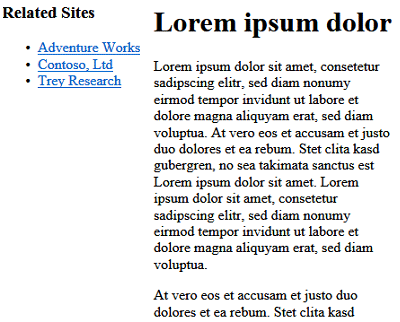

Rendering ASP.NET Web Pages (Razor) Sites for Mobile Devices
====================
by [Tom FitzMacken](https://github.com/tfitzmac)

> This article describes how to create pages in an ASP.NET Web Pages (Razor) site that will render appropriately on mobile devices.
> 
> What you'll learn:
> 
> - How to use a naming convention to specify that a page is designed specifically for mobile devices.
>   
> 
> ## Software versions used in the tutorial
> 
> 
> - ASP.NET Web Pages (Razor) 3
>   
> 
> This tutorial also works with ASP.NET Web Pages 2.

ASP.NET Web Pages lets you create custom displays for rendering content on mobile or other devices.

The simplest way to create device-specific page in an ASP.NET Web Pages site is by using a file-naming pattern like this: *FileName.**Mobile**.cshtml*. You can create two versions of a page (for example, one named *MyFile.cshtml* and one named *MyFile.Mobile.cshtml*). At run time, when a mobile device requests *MyFile.cshtml*, ASP.NET renders the content from *MyFile.Mobile.cshtml*. Otherwise, *MyFile.cshtml* is rendered.

The following example shows how to enable mobile rendering by adding a content page for mobile devices. *Page1.cshtml* contains content plus a navigation sidebar. *Page1.Mobile.cshtml* contains the same content, but omits the sidebar.

1. In an ASP.NET Web Pages site, create a file named *Page1.cshtml* and replace the current content with following markup.

    [!code-html[Main](rendering-aspnet-web-pages-sites-for-mobile-devices/samples/sample1.html)]
2. Create a file named *Page1.Mobile.cshtml* and replace the existing content with the following markup. Notice that the mobile version of the page omits the navigation section for better rendering on a smaller screen.

    [!code-html[Main](rendering-aspnet-web-pages-sites-for-mobile-devices/samples/sample2.html)]
3. Run a desktop browser and browse to *Page1.cshtml*. 
4. Run a mobile browser (or a mobile device emulator) and browse to *Page1.cshtml*. (Notice that you do not include *.mobile.* as part of the URL.) Even though the request is to *Page1.cshtml*, ASP.NET renders *Page1.Mobile.cshtml*.

    

> [!NOTE]
> To test mobile pages, you can use a mobile device simulator that runs on a desktop computer. This tool lets you test web pages as they would look on mobile devices (that is, typically with a much smaller display area). One example of a simulator is the [User Agent Switcher add-on](http://addons.mozilla.org/en-us/firefox/addon/user-agent-switcher/) for Mozilla Firefox, which lets you emulate various mobile browsers from a desktop version of Firefox.

## Additional Resources

[Windows Phone Emulator](https://msdn.microsoft.com/en-us/library/ff402563(v=VS.92).aspx)