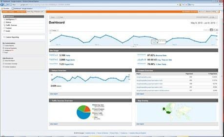

Tracking Visitor Information (Analytics) for an ASP.NET Web Pages (Razor) Site
====================
by [Tom FitzMacken](https://github.com/tfitzmac)

> This article describes how to use a helper to add website analytics to pages in an ASP.NET Web Pages (Razor) website.
> 
> What you'll learn:
> 
> - How to send information about your website traffic to an analytics provider.
> 
> These are the ASP.NET programming features introduced in the article:
> 
> - The `Analytics` helper.
>   
> 
> ## Software versions used in the tutorial
> 
> 
> - ASP.NET Web Pages (Razor) 2
> - ASP.NET Web Helpers Library (NuGet package)

Analytics is a general term for technology that measures traffic on your website so you can understand how people use the site. Many analytics services are available, including services from Google, Yahoo, StatCounter, and others.

The way analytics works is that you sign up for an account with the analytics provider, where you register the site that you want to track. The provider sends you a snippet of JavaScript code that includes an ID or tracking code for your account. You add the JavaScript snippet to the web pages on the site that you want to track. (You typically add the analytics snippet to a footer or layout page or other HTML markup that appears on every page in your site.) When users request a page that contains one of these JavaScript snippets, the snippet sends information about the current page to the analytics provider, who records various details about the page.

When you want to have a look at your site statistics, you log into the analytics provider's website. You can then view all sorts of reports about your site, like:

- The number of page views for individual pages. This tells you (roughly) how many people are visiting the site, and which pages on your site are the most popular.
- How long people spend on specific pages. This can tell you things like whether your home page is keeping people's interest.
- What sites people were on before they visited your site. This helps you understand whether your traffic is coming from links, from searches, and so on.
- When people visit your site and how long they stay.
- What countries your visitors are from.
- What browsers and operating systems your visitors are using.

    

## Using a Helper to Add Analytics to a Page

ASP.NET Web Pages includes several analytics helpers (`Analytics.GetGoogleHtml`, `Analytics.GetYahooHtml`, and `Analytics.GetStatCounterHtml`) that make it easy to manage the JavaScript snippets used for analytics. Instead of figuring out how and where to put the JavaScript code, all you have to do is add the helper to a page. The only information you need to provide is your account name, ID, or tracking code. (For StatCounter, you also have to provide a few additional values.)

In this procedure, you'll create a layout page that uses the `GetGoogleHtml` helper. If you already have an account with one of the other analytics providers, you can use that account instead and make slight adjustments as needed.

> [!NOTE]
> When you create an analytics account, you register the URL of the site that you want to be tracking. If you're testing everything on your local computer, you won't be tracking actual traffic (the only traffic is you), so you won't be able to record and view site statistics. But this procedure shows how you add an analytics helper to a page. When you publish your site, the live site will send information to your analytics provider.

1. Add the ASP.NET Web Helpers Library to your website as described in [Installing Helpers in an ASP.NET Web Pages Site](https://go.microsoft.com/fwlink/?LinkId=252372), if you haven't already added it.
2. Create an account with Google Analytics and record the account name.
3. Create a layout page named *Analytics.cshtml* and add the following markup:

    [!code-cshtml[Main](14-analyzing-traffic/samples/sample1.cshtml)]

    > [!NOTE]
    > You must place the call to the `Analytics` helper in the body of your web page (before the `</body>` tag). Otherwise, the browser will not run the script.

    If you're using a different analytics provider, use one of the following helpers instead:

    - (Yahoo) `@Analytics.GetYahooHtml("myaccount")`
    - (StatCounter) `@Analytics.GetStatCounterHtml("project", "security")`
4. Replace `myaccount` with the name of the account, ID, or tracking code that you created in step 1.
5. Run the page in the browser. (Make sure the page is selected in the **Files** workspace before you run it.)
6. In the browser, view the page source. You'll be able to see the rendered analytics code:

    [!code-html[Main](14-analyzing-traffic/samples/sample2.html)]
7. Log onto the Google Analytics site and examine the statistics for your site. If you're running the page on a live site, you see an entry that logs the visit to your page.

## Additional Resources

- [Google Analytics site](https://www.google.com/analytics/)
- [Yahoo! Web Analytics site](http://help.yahoo.com/l/us/yahoo/ywa/)
- [StatCounter site](http://statcounter.com/)