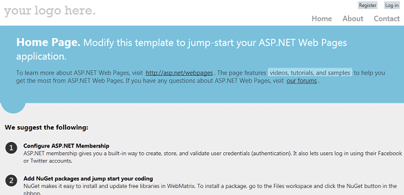
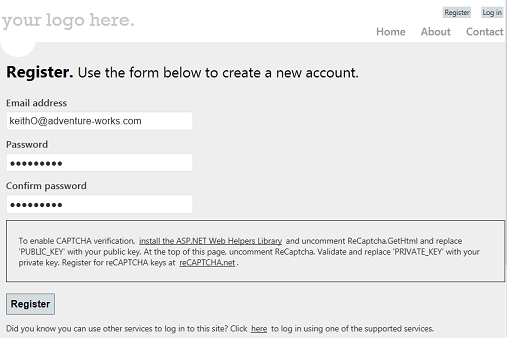
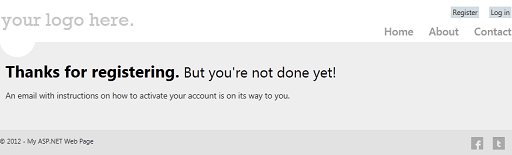
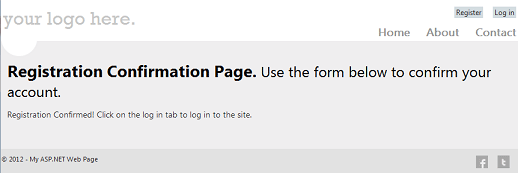
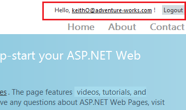
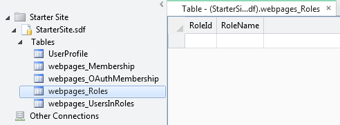
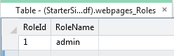
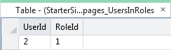
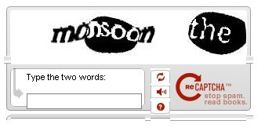
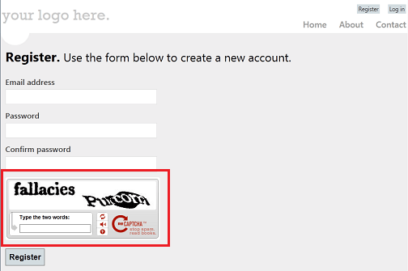

Adding Security and Membership to an ASP.NET Web Pages (Razor) Site
====================
by [Tom FitzMacken](https://github.com/tfitzmac)

> This article explains how to secure an ASP.NET Web Pages (Razor) website so that some of the pages are available only to people who log in. (You'll also see how to create pages that anyone can access.)
> 
> **What you'll learn:** 
> 
> - How to create a website that has a registration page and a login page so that for some pages you can limit access to only members.
> - How to create public and member-only pages.
> - How to define roles, which are groups that have different security permissions on your site, and how to assign users to a role.
> - How to use CAPTCHA to prevent automated programs (bots) from creating member accounts.
>   
> 
> These are the ASP.NET features introduced in the article:
> 
> - The WebMatrix **Starter Site** template.
> - The `WebSecurity` helper and `Roles` class.
> - The `ReCaptcha` helper.
>   
> 
> ## Software versions used in the tutorial
> 
> 
> - ASP.NET Web Pages (Razor) 2
> - WebMatrix 3
> - ASP.NET Web Helpers Library

You can set up your website so that users can log into it &#8212; that is, so that the site supports *membership*. This can be useful for many reasons. For example, your site might have pages that should be available only to members. In some cases, you might require users to log in in order to send you feedback or leave a comment.

Even if your website supports membership, users aren't necessarily required to log in before they use some of the pages on the site. Users who aren't logged in are known as *anonymous users*.

A user can register on your website and can then log in to the site. The website requires a user name (an email address) and a password to confirm that users are who they claim to be. This process of logging in and confirming a user's identity is known as *authentication*.

You can set up security and membership in different ways:

- If you're using WebMatrix, an easy way is to create as new site based on the **Starter Site** template. This template is already configured for security and membership and already has a registration page, a login page, and so on.

    The site created by the template also has an option to let users log in using an external site like Facebook, Google, or Twitter.
- If you want to add security to an existing site, or if you don't want to use the **Starter Site** template, you can create your own registration page, login page, and so on.

This article focuses on the first option &mdash; how to add security by using the **Starter Site** template. It also provides some basic information about how to implement your own security and then provides links to more information about how to do that. There is also information about how to enable external logins, which is described in more detail in a separate article.

## Creating Website Security Using the Starter Site Template

In WebMatrix, you can use the **Starter Site** template to create a website that contains the following:

- A database that's used to store user names and passwords for your members.
- A registration page where anonymous (new) users can register.
- A login and logout page.
- A password recovery and reset page.

The following procedure describes how to create the site and configure it.

1. Start WebMatrix and in the **Quick Start** page, select **Site From Template**.
2. Select the **Starter Site** template and then click **OK**. WebMatrix creates a new site.
3. In the left pane, click the **Files** workspace selector.
4. In the root folder of your website, open the *\_AppStart.cshtml* file, which is a special file that's used to contain global settings. It contains some statements that are commented out using the `//` characters:

    [!code-csharp[Main](16-adding-security-and-membership/samples/sample1.cs)]

    These statements configure the `WebMail` helper, which can be used to send email. The membership system can use email to send confirmation messages when users register or when they want to change their passwords. (For example, after users register, they get an email that includes a link that they can click in order to finish the registration process.)

    Sending email requires access to an SMTP server, as described in [Adding Email to an ASP.NET Web Pages Site](https://go.microsoft.com/fwlink/?LinkId=202899). You'll store the email settings in this central *\_AppStart.cshtml* file so that you don't have to code them repeatedly into each page that can send email. (You don't need to configure SMTP settings to set up a registration database; you only need SMTP settings if you want to validate users from their email alias and let users reset a forgotten password.)
5. Uncomment the statements by removing `//` from in front of each one.

    If you do not want to set up email confirmation, you can skip this step and the next step. If the SMTP values are not set, the new account is immediately available without a confirmation email.
6. Modify the following email-related settings in the code:

    - Set `WebMail.SmtpServer` to the name of the SMTP server that you have access to.
    - Leave `WebMail.EnableSsl` set to `true`. This setting secures the credentials that are sent to the SMTP server by encrypting them.
    - Set `WebMail.UserName` to the user name for your SMTP server account.
    - Set `WebMail.Password` to the password for your SMTP server account.
    - Set `WebMail.From` to your own email address. This is the email address that the message is sent from.

    > [!NOTE] 
    > 
    > **Tip** For additional information about the values for these properties, see [Configuring Email Settings](https://go.microsoft.com/fwlink/?LinkID=202906#configuring_email_settings) in [Customizing Site-Wide Behavior for ASP.NET Web Pages](https://go.microsoft.com/fwlink/?LinkID=202906).
7. Save and close *\_AppStart.cshtml*.
8. Run the *Default.cshtml* page in a browser.

    

    > [!NOTE]
    > If you see an error that tells you that a property must be an instance of `ExtendedMembershipProvider`, the site might not be configured to use the ASP.NET Web Pages membership system (SimpleMembership). This can sometimes occur if a hosting provider's server is configured differently than your local server. To fix this, add the following element to the site's *Web.config* file:
    > 
    > [!code-xml[Main](16-adding-security-and-membership/samples/sample2.xml)]
    > 
    > Add this element as a child of the `<configuration>` element and as a peer of the `<system.web>` element.
9. In the upper-right corner of the page, click the **Register** link. The *Register.cshtml* page is displayed.
10. Enter a user name and password and then click **Register**.

    

    When you created the website from the **Starter Site** template, a database named *StarterSite.sdf* was created in the site's *App\_Data* folder. During registration, your user information is added to the database. If you set the SMTP values, a message is sent to the email address you used so you can finish registering.

    
11. Go to your email program and find the message, which will have your confirmation code and a hyperlink to the site.
12. Click the hyperlink to activate your account. The confirmation hyperlink opens a registration confirmation page.

    
- Click the **Login** link, and then log in using the account that you registered.

    After you log in, the **Login** and **Register** links are replaced by a **Logout** link. Your login name is displayed as a link. (The link lets you go to a page where you can change your password.)

    

    > [!NOTE]
    > By default, ASP.NET web pages send credentials to the server in clear text (as human-readable text). A production site should use secure HTTP (https://, also known as the *secure sockets layer* or SSL) to encrypt sensitive information that's exchanged with the server. You can required email messages to be sent using SSL by setting `WebMail.EnableSsl=true` as in the previous example. For more information about SSL, see [Securing Web Communications: Certificates, SSL, and https://](https://go.microsoft.com/fwlink/?LinkId=208660).

## Additional Membership Functionality in the Site

Your site contains other functionality that lets users manage their accounts. Users can do the following:

- Change their passwords. After logging in, they can click the user name (which is a link). This takes them to a page where they can create a new password (*Account/ChangePassword.cshtml*).
- Recover a forgotten password. On the login page, there's a link (**Did you forget your password?**) that takes users to a page (*Account/ForgotPassword.cshtml*) where they can enter an email address. The site sends them an email message that has a link that they can click in order to set a new password (*Account/PasswordReset.cshtml*).

You can also let users can also log in using an external site, as explained later.

## Creating a Members-Only Page

For the time being, anyone can browse to any page in your website. But you might want to have pages that are available only to people who have logged in (that is, to members). ASP.NET lets you create pages that can be accessed only by logged-in members. Typically, if anonymous users try to access a members-only page, you redirect them to the login page.

In this procedure, you'll create a folder that will contain pages that are available only to logged-in users.

1. At the root of the site, create a new folder. (In the ribbon, click the arrow underneath **New** and then choose **New Folder**.)
2. Name the new folder *Members*.
3. Inside the *Members* folder, create a new page and named it *MembersInformation.cshtml*.
4. Replace the existing content with the following code and markup:

    [!code-cshtml[Main](16-adding-security-and-membership/samples/sample3.cshtml)]

    This code tests the `IsAuthenticated` property of the `WebSecurity` object, which returns `true` if the user has logged in. If the user is not logged in, the code calls `Response.Redirect` to send the user to the *Login.cshtml* page in the *Account* folder.

    The URL of the redirection includes a `returnUrl` query string value that uses `Request.Url.LocalPath` to set the path of the current page. If you set the `returnUrl` value in the query string like this (and if the return URL is a local path), the login page will return users to this page after they log in.

    The code also sets *\_SiteLayout.cshtml* page as its layout page. (For more about layout pages, see [Creating a Consistent Layout in ASP.NET Web Pages Sites](https://go.microsoft.com/fwlink/?LinkId=202891).)
5. Run the site. If you're still logged in, click the **Logout** button at the top of the page.
6. In the browser, request the page */Members/MembersInformation*. For example, the URL might look like this:

    `http://localhost:38366/Members/MembersInformation`

    (The port number (38366) will probably be different in your URL.)

    You're redirected to the *Login.cshtml* page, because you aren't logged in.
- Log in using the account you created earlier. You're redirected back to the *MembersInformation* page. Because you're logged in, this time you see the page contents.

To secure access to multiple pages, you can do this:

- Add the security check to each page.
- Create a *\_PageStart.cshtml* page in the folder where you keep protected pages, and add the security check there. The *\_PageStart.cshtml* page acts as a kind of global page for all the pages in the folder. This technique is explained in more detail in [Customizing Site-Wide Behavior for ASP.NET Web Pages](https://go.microsoft.com/fwlink/?LinkId=202906#Using__PageStart.cshtml_to_Restrict_Folder_Access).

## Creating Security for Groups of Users (Roles)

If your site has a lot of members, it's not efficient to check permission for each user individually before you let them see a page. What you can do instead is to create groups, or *roles*, that individual members belong to. You can then check permissions based on role. In this section, you'll create an &quot;admin&quot; role and then create a page that's accessible to users who are in (who belong to) that role.

The ASP.NET membership system is set up to support roles. However, unlike membership registration and login, the **Starter Site** template does not contain pages that help you manage roles. (Managing roles is an administrative task rather than a user task.) However, you can add groups directly in the membership database in WebMatrix.

1. In WebMatrix, click the **Databases** workspace selector.
2. In the left pane, open the *StarterSite.sdf* node, open the **Tables** node, and then double-click the *webpages\_Roles* table.

    
3. Add a role named &quot;admin&quot;. The *RoleId* field is filled in automatically. (It's the primary key and has been set to be an identify field, as explained in [Introduction to Working with a Database in ASP.NET Web Pages Sites](https://go.microsoft.com/fwlink/?LinkId=202893).)
4. Take note of what the value is for the *RoleId* field. (If this is the first role you're defining, it will be 1.)

    
5. Close the *webpages\_Roles* table.
6. Open the *UserProfile* table.
7. Make a note of the *UserId* value of one or more of the users in the table and then close the table.
8. Open the *webpages\_UserInRoles* table and enter a *UserID* and a *RoleID* value into the table. For example, to put user 2 into the &quot;admin&quot; role, you'd enter these values:

    
9. Close the *webpages\_UsersInRoles* table.

    Now that you have roles defined, you can configure a page that's accessible to users who are in that role.
10. In the website root folder, create a new page named *AdminError.cshtml* and replace the existing content with the following code. This will be the page that users are redirected to if they aren't allowed access to a page.

    [!code-cshtml[Main](16-adding-security-and-membership/samples/sample4.cshtml)]
11. In the website root folder, create a new page named *AdminOnly.cshtml* and replace the existing code with the following code:

    [!code-cshtml[Main](16-adding-security-and-membership/samples/sample5.cshtml)]

    The `Roles.IsUserInRole` method returns `true` if the current user is a member of the specified role (in this case, the "admin" role).
12. Run *Default.cshtml* in a browser, but don't log in. (If you're already logged in, log out.)
13. In the browser's address bar, add *AdminOnly* in the URL. (In other words, request the *AdminOnly.cshtml* file.) You're redirected to the *AdminError.cshtml* page, because you aren't currently logged in as a user in the &quot;admin&quot; role.
14. Return to *Default.cshtml* and log in as the user you added to the &quot;admin&quot; role.
15. Browse to *AdminOnly.cshtml* page. This time you see the page.

## Preventing Automated Programs from Joining Your Website

The login page will not stop automated programs (sometimes referred to as *web robots* or *bots*) from registering with your website. This procedure describes how to enable a ReCaptcha test for the registration page.

1. Register your website at ReCaptcha.Net ([http://recaptcha.net](http://recaptcha.net)). When you've completed registration, you'll get a public key and a private key.
2. Add the ASP.NET Web Helpers Library to your website as described in [Installing Helpers in an ASP.NET Web Pages Site](https://go.microsoft.com/fwlink/?LinkId=252372), if you haven't already.
3. In the *Account* folder, open the file named *Register.cshtml*.
4. In the code at the top of the page, find the following lines and uncomment them by removing the `//` comment characters:

    [!code-csharp[Main](16-adding-security-and-membership/samples/sample6.cs)]
5. Replace `PRIVATE_KEY` with your own ReCaptcha private key.
6. In the markup of the page, remove the `@*` and `*@` commenting characters from around the following lines in the page markup:

    [!code-cshtml[Main](16-adding-security-and-membership/samples/sample7.cshtml)]
7. Replace `PUBLIC_KEY` with your key.
8. If you haven't removed it already, remove the `
` element that contains text that starts with "To enable CAPTCHA verification ...". (Remove the entire `
` element and its contents.)

1. Run *Default.cshtml* in a browser. If you're logged into the site, click the **Logout** link.
2. Click the **Register** link and test the registration using the CAPTCHA test.

    

For more information about the `ReCaptcha` helper, see [Using a CATPCHA to Prevent Automated Programs (Bots) from Using Your ASP.NET Web Site](https://go.microsoft.com/fwlink/?LinkId=251967).

## Letting Users Log In Using an External Site

The **Starter Site** template includes code and markup that lets users log in using Facebook, Windows Live, Twitter, Google, or Yahoo. By default, this functionality is not enabled. The general procedure for using letting users log in using these external providers is this:

- Decide which of the external sites you want to support.
- If required, go to that site and set up a login app. (For example, you have to do this in order to allow Facebook logins.)
- In your site, configure the provider. In most cases, you just have to uncomment some code in the *\_AppStart.cshtml* file.
- Add markup to the registration page that lets people link to the external site for logging in. You can usually copy the markup you need and change the text slightly.

You can find step-by-step instructions in the topic [Enabling Login from External Sites in an ASP.NET Web Pages Site](https://go.microsoft.com/fwlink/?LinkId=251969).

After a user logs in from another site, the user returns to your site and *associates* that login with your site. In effect, this creates a membership entry in your site for the user's external login. This lets you use the normal facilities of membership (such as roles) with the external login.

## Adding Security to an Existing Website

The procedure earlier in this article relies on using the **Starter Site** template as the basis for website security. If it isn't practical for you to start from the **Starter Site** template or to copy the relevant pages from a site based on that template, you can implement the same type of security in your own site by coding it yourself. You create the same types of pages — registration, login, and so on — and then use helpers and classes to set up membership.

The basic process is described in the blog post [THE most basic way to implement ASP.NET Razor security](http://mikepope.com/blog/DisplayBlog.aspx?permalink=2240). Most of the work is done using the following methods and properties of the `WebSecurity` helper:

- [WebSecurty.UserExists](https://msdn.microsoft.com/en-us/library/webmatrix.webdata.websecurity.userexists(v=vs.99).aspx), [WebSecurity.CreateUserAndAccount](https://msdn.microsoft.com/en-us/library/webmatrix.webdata.websecurity.createuserandaccount(v=vs.99).aspx). These methods let you determine whether someone is already registered and to register them.
- [WebSecurty.IsAuthenticated](https://msdn.microsoft.com/en-us/library/webmatrix.webdata.websecurity.isauthenticated(v=vs.99).aspx). This property lets you determine whether the current user is logged in. This is useful to redirect users to a login page if they have not already logged in.
- [WebSecurity.Login](https://msdn.microsoft.com/en-us/library/webmatrix.webdata.websecurity.login(v=vs.99).aspx), [WebSecurity.Logout](https://msdn.microsoft.com/en-us/library/webmatrix.webdata.websecurity.logout(v=vs.99).aspx). These methods log a user in or out.
- [WebSecurity.CurrentUserName](https://msdn.microsoft.com/en-us/library/webmatrix.webdata.websecurity.currentusername(v=vs.99).aspx). This property is useful for displaying the current user's logged-in name (if the user is logged in).
- [WebSecurity.ConfirmAccount](https://msdn.microsoft.com/en-us/library/gg569286(v=vs.99).aspx). This method is useful if you set up email confirmation for registration. (Details are described in the blog post [Using the confirmation feature for ASP.NET Web Pages security](http://mikepope.com/blog/DisplayBlog.aspx?permalink=2267).)

To manage roles, you can use the [Roles](https://msdn.microsoft.com/en-us/library/gg538398(v=vs.99).aspx) and [Membership](https://msdn.microsoft.com/en-us/library/gg569035(v=vs.99).aspx) classes, as described in the blog entry.

## Additional Resources

- [Customizing Site-Wide Behavior](https://go.microsoft.com/fwlink/?LinkId=202906)
- [Securing Web Communications: Certificates, SSL, and https://](https://go.microsoft.com/fwlink/?LinkId=208660)
- [THE most basic way to implement ASP.NET Razor security](http://mikepope.com/blog/DisplayBlog.aspx?permalink=2240) and [Using the confirmation feature for ASP.NET Web Pages security](http://mikepope.com/blog/DisplayBlog.aspx?permalink=2267). These are blog posts that describe how to implement ASP.NET membership features without using the **Starter Site** template.
- [Enabling Login from External Sites in an ASP.NET Web Pages Site](https://go.microsoft.com/fwlink/?LinkId=251969)
- [WebSecurity Class API reference](https://msdn.microsoft.com/en-us/library/webmatrix.webdata.websecurity(v=vs.99)) (MSDN)
- [SimpleRoleProvider Class API reference](https://msdn.microsoft.com/en-us/library/webmatrix.webdata.simpleroleprovider(v=vs.99)) (MSDN)
- [SimpleMembershipProvider Class API reference](https://msdn.microsoft.com/en-us/library/webmatrix.webdata.simplemembershipprovider(v=vs.99)) (MSDN)