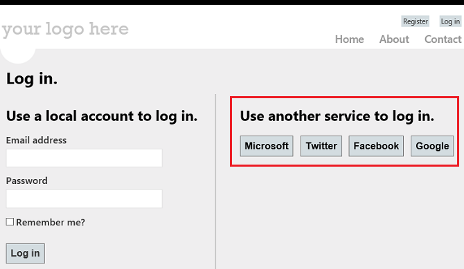
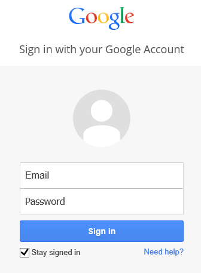
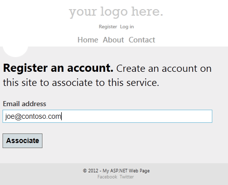
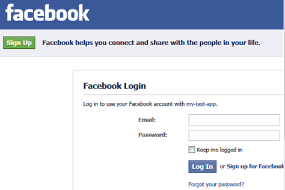
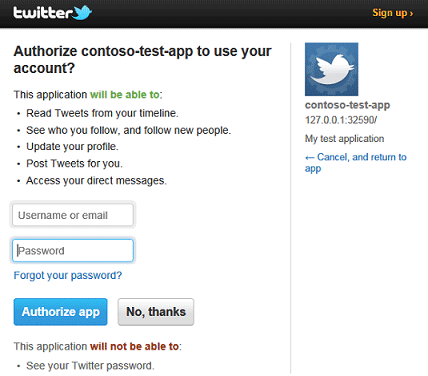

Logging In Using External Sites in an ASP.NET Web Pages (Razor) Site
====================
by [Tom FitzMacken](https://github.com/tfitzmac)

> This article explains how to log in to your ASP.NET Web Pages (Razor) site using Facebook, Google, Twitter, Yahoo, and other sites — that is, how to support OAuth and OpenID in your site.
> 
> What you'll learn:
> 
> - How to enable login from other sites when you use the WebMatrix Starter Site template.
> 
> This is the ASP.NET feature introduced in the article:
> 
> - The `OAuthWebSecurity` helper.
>   
> 
> ## Software versions used in the tutorial
> 
> 
> - ASP.NET Web Pages (Razor) 2
> - WebMatrix 3

ASP.NET Web Pages includes support for [OAuth](http://oauth.net/) and [OpenID](http://openid.net/) providers. Using these providers, you can let users log into your site using their existing credentials from Facebook, Twitter, Microsoft, and Google. For example, to log in using a Facebook account, users can just choose a Facebook icon, which redirects them to the Facebook login page where they enter their user information. They can then associate the Facebook login with their account on your site. A related enhancement to the Web Pages membership features is that users can associate multiple logins (including logins from social networking sites) with a single account on your website.

This image shows the Login page from the **Starter Site** template, where a user can choose a Facebook, Twitter, Google or Microsoft icon to enable logging in with an external account:

You can enable OAuth and OpenID membership by uncommenting a few lines of code in the **Starter Site** template. The methods and properties you use to work with the OAuth and OpenID providers are in the `WebMatrix.Security.OAuthWebSecurity` class. The **Starter Site** template includes a full membership infrastructure, complete with a login page, a membership database, and all the code you need to let users log into your site using either local credentials or those from another site.

This section provides an example of how to let users log in from external sites to a site that's based on the **Starter Site** template. After creating a starter site, you do this (details follow):

- For the sites that use an OAuth provider (Facebook, Twitter, and Microsoft), you create an application on the external site. This gives you application keys that you'll need in order to invoke the login feature for those sites.
- For sites that use an OpenID provider (Google), you do not have to create an application. For all of these sites, you must have an account in order to log in and to create developer applications.

    > [!NOTE]
    > Microsoft applications only accept a live URL for a working website, so you cannot use a local website URL for testing logins.
- Edit a few files in your website in order to specify the appropriate authentication provider and to submit a login to the site you want to use.

This article provides separate instructions for the following tasks:

- [Enabling Google logins](#To_enable_Google_logins)
- [Enabling Facebook logins](#To_enable_Facebook_logins)
- [Enabling Twitter logins](#To_enable_Twitter_logins)

## Enabling Google Logins

1. Create or open an ASP.NET Web Pages site that's based on the WebMatrix Starter Site template.
2. Open the *\_AppStart.cshtml* page and uncomment the following line of code. 

    [!code-css[Main](enabling-login-from-external-sites-in-an-aspnet-web-pages-site/samples/sample1.css)]

### Testing Google login

1. Run the *default.cshtml* page of your site and choose the **Log in** button.
2. On the *Login* page, in the **Use another service to log in** section, choose either the **Google** or **Yahoo** submit button. This example uses the Google login. 

    The web page redirects the request to the Google login page.

    
3. Enter credentials for an existing Google account.
4. If Google asks you whether you want to allow *Localhost* to use information from the account, click **Allow**.

    The code uses the Google token to authenticate the user, and then returns to this page on your website. This page lets users associate their Google login with an existing account on your website, or they can register a new account on your site to associate the external login with.

    
5. Choose the **Associate** button. The browser returns to your application's home page.

## Enabling Facebook Logins

1. Go to the [Facebook developers site](https://developers.facebook.com/apps) (log in if you're not already logged in).
2. Choose the **Create New App** button, and then follow the prompts to name and create the new application.
3. In the section **Select how your app will integrate with Facebook**, choose the **Website** section.
4. Fill in the **Site URL** field with the URL of your site (for example, `http://www.example.com`). The **Domain** field is optional; you can use this to provide authentication for an entire domain (such as *example.com*). 

    > [!NOTE]
    > If you are running a site on your local computer with a URL like `http://localhost:12345` (where the number is a local port number), you can add this value to the **Site URL** field for testing your site. However, any time the port number of your local site changes, you will need to update the **Site URL** field of your application.
5. Choose the **Save Changes** button.
6. Choose the **Apps** tab again, and then view the start page for your application.
7. Copy the **App ID** and **App Secret** values for your application and paste them into a temporary text file. You will pass these values to the Facebook provider in your website code.
8. Exit the Facebook developer site.

Now you make changes to two pages in your website so that users will able to log into the site using their Facebook accounts.

1. Create or open an ASP.NET Web Pages site that's based on the WebMatrix Starter Site template.
2. Open the *\_AppStart.cshtml* page and uncomment the code for the Facebook OAuth provider. The uncommented code block looks like the following: 

    [!code-csharp[Main](enabling-login-from-external-sites-in-an-aspnet-web-pages-site/samples/sample2.cs)]
3. Copy the **App ID** value from the Facebook application as the value of the `appId` parameter (inside the quotation marks).
4. Copy **App Secret** value from the Facebook application as the `appSecret` parameter value.
5. Save and close the file.

### Testing Facebook login

1. Run the site's *default.cshtml* page and choose the **Login** button.
2. On the *Login* page, in the **Use another service to log in** section, choose the **Facebook** icon. 

    The web page redirects the request to the Facebook login page.

    
3. Log into a Facebook account. 

    The code uses the Facebook token to authenticate you and then returns to a page where you can associate your Facebook login with your site's login. Your user name or email address is filled into the **Email** field on the form.

    
4. Choose the **Associate** button. 

    The browser returns to the home page and you are logged in.

## Enabling Twitter Logins

1. Browse to the [Twitter developers site](https://dev.twitter.com/).
2. Choose the **Create an App** link and then log into the site.
3. On the **Create an Application** form, fill in the **Name** and **Description** fields.
4. In the **WebSite** field, enter the URL of your site (for example, `http://www.example.com`). 

    > [!NOTE]
    > If you're testing your site locally (using a URL like `http://localhost:12345`), Twitter might not accept the URL. However, you might be able to use the local loopback IP address (for example `http://127.0.0.1:12345`). This simplifies the process of testing your application locally. However, every time the port number of your local site changes, you'll need to update the **WebSite** field of your application.
5. In the **Callback URL** field, enter a URL for the page in your website that you want users to return to after logging into Twitter. For example, to send users to the home page of the Starter Site (which will recognize their logged-in status), enter the same URL that you entered in the **WebSite** field.
6. Accept the terms and choose the **Create your Twitter application** button.
7. On the **My Applications** landing page, choose the application you created.
8. On the **Details** tab, scroll to the bottom and choose the **Create My Access Token** button.
9. On the **Details** tab, copy the **Consumer Key** and **Consumer Secret** values for your application and paste them into a temporary text file. You'll pass these values to the Twitter provider in your website code.
10. Exit the Twitter site.

Now you make changes to two pages in your website so that users will be able to log into the site using their Twitter accounts.

1. Create or open an ASP.NET Web Pages site that's based on the WebMatrix Starter Site template.
2. Open the *\_AppStart.cshtml* page and uncomment the code for the Twitter OAuth provider. The uncommented code block looks like this: 

    [!code-csharp[Main](enabling-login-from-external-sites-in-an-aspnet-web-pages-site/samples/sample3.cs)]
3. Copy the **Consumer Key** value from the Twitter application as the value of the `consumerKey` parameter (inside the quotation marks).
4. Copy the **Consumer Secret** value from the Twitter application as the value of the `consumerSecret` parameter.
5. Save and close the file.

### Testing Twitter login

1. Run the *default.cshtml* page of your site and choose the **Login** button.
2. On the *Login* page, in the **Use another service to log in** section, choose the **Twitter** icon. 

    The web page redirects the request to a Twitter login page for the application you created.

    
3. Log into a Twitter account.
4. The code uses the Twitter token to authenticate the user and then returns you to a page where you can associate your login with your website account. Your name or email address is filled into the **Email** field on the form.

    
5. Choose the **Associate** button. 

    The browser returns to the home page and you are logged in.

## Additional Resources

- [Customizing Site-Wide Behavior](https://go.microsoft.com/fwlink/?LinkId=202906)
- [Adding Security and Membership to an ASP.NET Web Pages Site](https://go.microsoft.com/fwlink/?LinkID=202904)