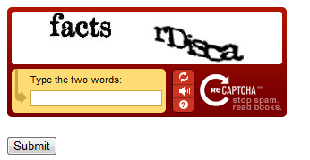

Using a CAPTCHA to Prevent Bots from Using Your ASP.NET Web Razor) Site
====================
by [Microsoft](https://github.com/microsoft)

> This article explains how to use ReCaptcha (a security measure) to prevent automated programs (bots) from performing tasks in an ASP.NET Web Pages (Razor) website.
> 
> **What you'll learn:** 
> 
> - How to add a CAPTCHA test to your site.
> 
> These are the ASP.NET features introduced in the article:
> 
> - The `ReCaptcha` helper.
> 
> > [!NOTE]
> > The information in this article applies to ASP.NET Web Pages 1.0 and Web Pages 2.

## About CAPTCHAs

Any time you let people register in your site, or even just enter a name and URL (like for a blog comment), you might get a flood of fake names. These are often left by automated programs (bots) that try to leave URLs in every website they can find. (A common motivation is to post the URLs of products for sale.)

You can help make sure that a user is real person and not a computer program by using a *CAPTCHA* to validate users when they register or otherwise enter their name and site. CAPTCHA stands for Completely Automated Public Turing test to tell Computers and Humans Apart. A CAPTCHA is a *challenge-response* test in which the user is asked to do something that is easy for a person to do but hard for an automated program to do. The most common type of CAPTCHA is one where you see some distorted letters and are asked to type them. (The distortion is supposed to make it hard for bots to decipher the letters.)

## Adding a ReCaptcha Test

In ASP.NET pages, you can use the `ReCaptcha` helper to render a CAPTCHA test that is based on the ReCaptcha service ([http://recaptcha.net](http://recaptcha.net)). The `ReCaptcha` helper displays an image of two distorted words that users have to enter correctly before the page is validated. The user response is validated by the ReCaptcha.Net service.

1. Register your website at ReCaptcha.Net ([http://recaptcha.net](http://recaptcha.net)). When you've completed registration, you'll get a public key and a private key.
2. Add the ASP.NET Web Helpers Library to your website as described in [Installing Helpers in an ASP.NET Web Pages Site](https://go.microsoft.com/fwlink/?LinkId=252372), if you haven't already.
3. If you don't already have a *\_AppStart.cshtml* file, in the root folder of a website create a file named *\_AppStart.cshtml*.
4. Add the following `Recaptcha` helper settings in the *\_AppStart.cshtml* file: 

    [!code-cshtml[Main](using-a-catpcha-to-prevent-automated-programs-bots-from-using-your-aspnet-web-site/samples/sample1.cshtml?highlight=6-7)]
5. Set the `PublicKey` and `PrivateKey` properties using your own public and private keys.
6. Save the *\_AppStart.cshtml* file and close it.
7. In the root folder of a website, create new page named *Recaptcha.cshtml*.
8. Replace the existing content with the following: 

    [!code-cshtml[Main](using-a-catpcha-to-prevent-automated-programs-bots-from-using-your-aspnet-web-site/samples/sample2.cshtml)]
9. Run the *Recaptcha.cshtml* page in a browser. If the `PrivateKey` value is valid, the page displays the ReCaptcha control and a button. If you had not set the keys globally in *\_AppStart.html*, the page would display an error. 

    
10. Enter the words for the test. If you pass the ReCaptcha test, you see a message to that effect. Otherwise you see an error message and the ReCaptcha control is redisplayed.

> [!NOTE]
> If your computer is on a domain that uses proxy server, you might need to configure the `defaultproxy` element of the *Web.config* file. The following example shows a *Web.config* file with the `defaultproxy` element configured to enable the ReCaptcha service to work.
> 
> [!code-xml[Main](using-a-catpcha-to-prevent-automated-programs-bots-from-using-your-aspnet-web-site/samples/sample3.xml)]

## Additional Resources

- [Customizing Site-Wide Behavior for ASP.NET Web Pages Sites](https://go.microsoft.com/fwlink/?LinkId=202906)
- [ReCaptcha site](https://www.google.com/recaptcha)