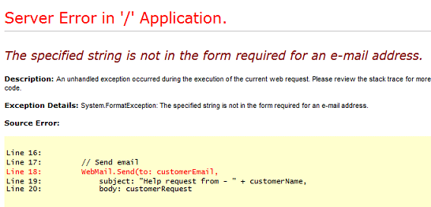

ASP.NET Web Pages (Razor) Troubleshooting Guide
====================
by [Tom FitzMacken](https://github.com/tfitzmac)

> This article describes issues that you might have when working with ASP.NET Web Pages (Razor) and some suggested solutions.
> 
> ## Software versions
> 
> 
> - ASP.NET Web Pages (Razor) 3
>   
> 
> This tutorial also works with ASP.NET Web Pages 2 and ASP.NET Web Pages 1.0.

This topic contains the following sections:

- [Issues with Running Pages](#Issues_Running_.cshtml_Pages)
- [Issues with Razor Code](#IssuesWithRazorCode)
- [Issues with Security and Membership](#membership)
- [Issues with Sending Email](#email)
- [Additional Resources](#AdditionalResources)

For general questions, see [ASP.NET Web Pages (Razor) FAQ](https://go.microsoft.com/fwlink/?LinkId=253000).

## Issues with Running Pages

A variety of issues can prevent *.cshtml* and *.vbhtml* pages from running properly. This section lists common error messages and likely causes.

### HTTP Error 403 - Forbidden: Access is denied

*You do not have permission to view this directory or page using the credentials that you supplied.*

This error can occur if the server is not running the correct version of the .NET Framework. Make sure that the computer that's running the server (locally or remotely) has at least the .NET Framework 4 installed. Also make sure that the application itself is configured to run the right version.

If you see this problem locally while working in WebMatrix, click the **Site** workspace, and then in the treeview click **Settings**. In the **Select .NET Framework Version** list, select **.NET 4 (Integrated)**. If this version is already set, try running WebMatrix as an administrator.

Make sure that the root of your website has at least one *.cshtml* file in it.

If you see this error when the web server is on a remote server, contact the server administrator. Make sure that the server has the .NET Framework 4 or later installed. Also make sure that the application is running in an application pool that's configured to use that version of the.NET Framework.

If you have control over the server, make sure it's running the correct version of the .NET Framework. You might also try repairing the installation by running the `aspnet_regiis -iru` command. (For example, if you install IIS after you install the .NET Framework, IIS will not be correctly configured to run ASP.NET pages.) For more information, see [ASP.NET IIS Registration Tool (Aspnet\_regiis.exe)](https://msdn.microsoft.com/en-US/library/k6h9cz8h(v=vs.100).aspx).

### HTTP Error 403.14 - Forbidden

*The Web server is configured to not list the contents of this directory.*

This error can occur if you request a resource that's protected (like the *Web.config* file) or that's in a folder that's protected (like *App\_Data* or *App\_Code*).

### HTTP Error 404.17 - Not Found

*The requested content appears to be script and will not be served by the static file handler.*

This error can occur if the server is not configured correctly to use the .NET Framework 4 or later, and therefore does not recognize the code in `@{ }` blocks. See the description earlier for *HTTP Error 403 - Forbidden: Access is denied*.

### HTTP Error 404.7 - Not Found

*The request filtering module is configured to deny the file extension*

This error can occur if *.cshtml* or *.vbhtml* extensions have been explicitly blocked on the server. A symptom of this problem is that URLs work when they do not include the extension, but URLs that include *.cshtml* or *.vbhtml* do not work. A possible solution is to re-enable the extensions in the site's *Web.config* file. The following example shows how to enable the *.cshtml* extension.

[!code-xml[Main](aspnet-web-pages-razor-troubleshooting-guide/samples/sample1.xml?highlight=5-6)]

### HTTP Error 404.8 - Not Found

*The request filtering module is configured to deny a path in the URL that contains a hiddenSegment section.*

This error can occur if you request a resource that's protected (like the *Web.config* file) or that's in a folder that's protected (like *App\_Data* or *App\_Code*).

### This type of page is not served (Server Error in '/' Application)

See the description earlier for HTTP Error 404.17.

## Issues with Razor code

### The name '*class*' does not exist in the current context

Often, a reason you see this error is that `class` references a helper, but the helper is not installed. For example, if you try to use a helper, but if you haven't installed the package from NuGet, you'll see this error. Use the Gallery in WebMatrix to find and install the helper.

If the helper is installed, but the page still doesn't recognize it, try adding add a `using` statement to the code. In the `using` statement, reference the namespace that includes the helper. For example, the basic helpers that are in the ASP.NET Web Helpers package are in the `System.Web.Helpers` namespace. At the top of the page where you want to use the helper, add this line:

`@using Microsoft.Web.Helpers;`

## Issues with Security and Membership

If you are using the built-in security (membership) system in ASP.NET Web Pages (Razor), you might encounter the following issues.

### To call this method, the "Membership.Provider" property must be an instance of "ExtendedMembershipProvider"

This error can indicate that no `AspNetSqlMembershipProvider` class is configured. (A symptom is that the site works fine locally but throws this error when you publish it to a hosting provider's server.) One fix for this problem is to explicitly enable simple membership by adding the following to the site's *Web.config* file:

[!code-xml[Main](aspnet-web-pages-razor-troubleshooting-guide/samples/sample2.xml?highlight=6)]

## Issues with Sending Email

Problems with sending email can be challenging to debug. An initial problem can be that you can't connect to the SMTP server. If the connection is successful, ASP.NET hands the message off to the SMTP server. However, there can be problems with the message itself that prevents the SMTP server from sending it.

If your application does not successfully send email, try the following:

- The SMTP server name is often something like `smtp.provider.com` or `smtp.provider.net`. However, if you publish your site to a hosting provider, the SMTP server name at that point might be `localhost`. This situation occurs because after you've published and your site is running on the provider's server, the SMTP server might be local from the perspective of your application. This change in server names might mean that you have to change the SMTP server name as part of your publishing process.
- The port number is usually 25. However, some providers require you to use port 587 or some other port. Check with the owner of the SMTP server what port number they expect you to use.
- Make sure that you use the right credentials. If you've published your site to a hosting provider, use the credentials that the provider has specifically indicated are for email. These credentials might be different from the credentials you use to publish.
- Sometimes you don't need credentials at all. If you're sending email by using your personal ISP, your email provider might already know your credentials. After you publish, you might need to use different credentials than when you test on your local computer.
- If your email provider uses encryption, set `WebMail.EnableSsl` to `true`.

If there is an error sending email, you might see a standard ASP.NET error message, which looks like this:

You can also debug problems with sending email by using a `try-catch` block, as in the following example. When you use a `try-catch` block, ASP.NET does not display its standard error messages. Instead, you can capture the error in the `catch` portion of the block.

[!code-cshtml[Main](aspnet-web-pages-razor-troubleshooting-guide/samples/sample3.cshtml)]

Substitute the appropriate values for `your-SMTP-server-name`, and so on. Some of the error messages you might see this way include the following:

- *Failure sending mail.*

    -or-

    *A connection attempt failed because the connected party did not properly respond after a period of time, or established connection failed because connected host has failed to respond*

    This error usually means that the application could not connect to the SMTP server. Check the server name and port number.
- *Mailbox unavailable. The server response was: 5.1.0 &lt;someuser@invaliddomain&gt; sender rejected : invalid sender domain*

    This message can indicate that the `From` address is not correct or is missing.
- *The specified string is not in the form required for an e-mail address.*

    This error might indicate that the value of the `To` or `From` properties are not recognized as email addresses. (ASP.NET cannot check that the email address is valid, only that it's in the correct format, like *name@domain.com*.)

> [!NOTE]
> Remove the markup that displays the error (`@errorMessage`) before you publish the page to a live site. It's not a good idea to let users see error messages that you get from a server.

## Additional Resources

[ASP.NET Web Pages (Razor) FAQ](https://go.microsoft.com/fwlink/?LinkId=253000)

[WebMatrix and ASP.NET Web Pages](https://forums.asp.net/1224.aspx/1?WebMatrix) forum on the ASP.NET website