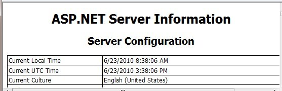
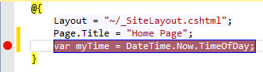
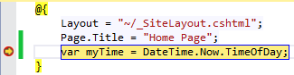

Introduction to Debugging ASP.NET Web Pages (Razor) Sites
====================
by [Tom FitzMacken](https://github.com/tfitzmac)

> This article explains various ways to debug pages in an ASP.NET Web Pages (Razor) website. Debugging is the process of finding and fixing errors in your code pages.
> 
> **What you'll learn:** 
> 
> - How to display information that helps analyze and debug pages.
> - How to use debugging tools in Visual Studio.
>   
> 
> These are the ASP.NET features introduced in the article:
> 
> - The `ServerInfo` helper.
> - `ObjectInfo` helper.
>   
> 
> ## Software versions
> 
> 
> - ASP.NET Web Pages (Razor) 3
> - Visual Studio 2013
>   
> 
> This tutorial also works with ASP.NET Web Pages 2. You can use WebMatrix 3 but the integrated debugger is not supported.

An important aspect of troubleshooting errors and problems in your code is to avoid them in the first place. You can do that by putting sections of your code that are likely to cause errors into `try/catch` blocks. For more information, see the section on handling errors in [Introduction to ASP.NET Web Programming Using the Razor Syntax](https://go.microsoft.com/fwlink/?LinkId=202890).

The `ServerInfo` helper is a diagnostic tool that gives you an overview of information about the web server environment that hosts your page. It also shows you HTTP request information that's sent when a browser requests the page. The `ServerInfo` helper displays the current user identity, the type of browser that made the request, and so on. This kind of information can help you troubleshoot common issues.

1. Create a new web page named *ServerInfo.cshtml*.
2. At the end of the page, just before the closing `</body>` tag, add `@ServerInfo.GetHtml()`:

    [!code-cshtml[Main](introduction-to-debugging/samples/sample1.cshtml)]

    You can add the `ServerInfo` code anywhere in the page. But adding it at the end will keep its output separate from your other page content, which makes it easier to read.

    > [!NOTE] 
    > 
    > **Important** You should remove any diagnostic code from your web pages before you move web pages to a production server. This applies to the `ServerInfo` helper as well as the other diagnostic techniques in this article that involve adding code to a page. You don't want your website visitors to see information about your server name, user names, paths on your server, and similar details, because this type of information might be useful to people with malicious intent.
3. Save the page and run it in a browser.

    

    The `ServerInfo` helper displays four tables of information in the page:

    - Server Configuration. This section provides information about the hosting web server, including computer name, the version of ASP.NET you're running, the domain name, and server time.
    - ASP.NET Server Variables. This section provides details about the many HTTP protocol details (called HTTP variables) and values that are part of each web page request.
    - HTTP Runtime Information. This section provides details about that the version of the Microsoft .NET Framework that your web page is running under, the path, details about the cache, and so on. (As you learned in [Introduction to ASP.NET Web Programming Using the Razor Syntax](https://go.microsoft.com/fwlink/?LinkId=202890), ASP.NET Web Pages using the Razor syntax are built on Microsoft's ASP.NET web server technology, which is itself built on an extensive software development library called the .NET Framework.)
    - Environment Variables. This section provides a list of all the local environment variables and their values on the web server.

    A full description of all the server and request information is beyond the scope of this article, but you can see that the `ServerInfo` helper returns a lot of diagnostic information. For more information about the values that `ServerInfo` returns, see [Recognized Environment Variables](https://technet.microsoft.com/en-us/library/dd560744(WS.10).aspx) on the Microsoft TechNet website and [IIS Server Variables](https://msdn.microsoft.com/en-us/library/ms524602(VS.90).aspx) on the MSDN website.

## Embedding Output Expressions to Display Page Values

Another way to see what's happening in your code is to embed output expressions in the page. As you know, you can directly output the value of a variable by adding something like `@myVariable` or `@(subTotal * 12)` to the page. For debugging, you can place these output expressions at strategic points in your code. This enables you to see the value of key variables or the result of calculations when your page runs. When you're done debugging, you can remove the expressions or comment them out. This procedure illustrates a typical way to use embedded expressions to help debug a page.

1. Create a new WebMatrix page that's named *OutputExpression.cshtml*.
2. Replace the page content with the following:

    [!code-html[Main](introduction-to-debugging/samples/sample2.html)]

    The example uses a `switch` statement to check the value of the `weekday` variable and then display a different output message depending on which day of the week it is. In the example, the `if` block within the first code block arbitrarily changes the day of the week by adding one day to the current weekday value. This is an error introduced for illustration purposes.
3. Save the page and run it in a browser.

    The page displays the message for the wrong day of the week. Whatever day of the week it actually is, you'll see the message for one day later. Although in this case you know why the message is off (because the code deliberately sets the incorrect day value), in reality it's often hard to know where things are going wrong in the code. To debug, you need to find out what's happening to the value of key objects and variables such as `weekday`.
4. Add output expressions by inserting `@weekday` as shown in the two places indicated by comments in the code. These output expressions will display the values of the variable at that point in the code execution.

    [!code-csharp[Main](introduction-to-debugging/samples/sample3.cs?highlight=2-3,15-16)]
5. Save and run the page in a browser.

    The page displays the real day of the week first, then the updated day of the week that results from adding one day, and then the resulting message from the `switch` statement. The output from the two variable expressions (`@weekday`) has no spaces between the days because you didn't add any HTML `
` tags to the output; the expressions are just for testing.

    

    Now you can see where the error is. When you first display the `weekday` variable in the code, it shows the correct day. When you display it the second time, after the `if` block in the code, the day is off by one. So you know that something has happened between the first and second appearance of the weekday variable. If this were a real bug, this kind of approach would help you narrow down the location of the code that's causing the problem.
6. Fix the code in the page by removing the two output expressions you added, and removing the code that changes the day of the week. The remaining, complete block of code looks like the following example:

    [!code-cshtml[Main](introduction-to-debugging/samples/sample4.cshtml)]
7. Run the page in a browser. This time you see the correct message displayed for the actual day of the week.

## Using the ObjectInfo Helper to Display Object Values

The `ObjectInfo` helper displays the type and the value of each object you pass to it. You can use it to view the value of variables and objects in your code (like you did with output expressions in the previous example), plus you can see data type information about the object.

1. Open the file named *OutputExpression.cshtml* that you created earlier.
2. Replace all code in the page with the following block of code:

    [!code-html[Main](introduction-to-debugging/samples/sample5.html)]
3. Save and run the page in a browser.

    

    In this example, the `ObjectInfo` helper displays two items:

    - The type. For the first variable, the type is `DayOfWeek`. For the second variable, the type is `String`.
    - The value. In this case, because you already display the value of the greeting variable in the page, the value is displayed again when you pass the variable to `ObjectInfo`.

    For more complex objects, the `ObjectInfo` helper can display more information &#8212; basically, it can display the types and values of all of an object's properties.

## Using Debugging Tools in Visual Studio

For a more comprehensive debugging experience, use Visual Studio 2013 or the free [Visual Studio Express 2013 for Web](https://www.visualstudio.com/downloads/download-visual-studio-vs#d-2013-express). With Visual Studio, you can set a breakpoint in your code at the line that you want to inspect.

When you test the web site, the executing code halts at the breakpoint.

You can examine the current values of the variables, and step through the code line-by-line.

For information about using the integrated debugger in Visual Studio to debug ASP.NET Razor pages, see [Programming ASP.NET Web Pages (Razor) Using Visual Studio](https://go.microsoft.com/fwlink/?LinkId=205854).

## Additional Resources

- [Programming ASP.NET Web Pages (Razor) Using Visual Studio](https://go.microsoft.com/fwlink/?LinkId=205854)
- [IIS Server Variables](https://msdn.microsoft.com/en-us/library/ms524602(VS.90).aspx) (MSDN)
- [Recognized Environment Variables](https://technet.microsoft.com/en-us/library/dd560744(WS.10).aspx) (TechNet)