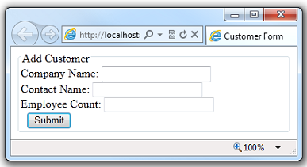
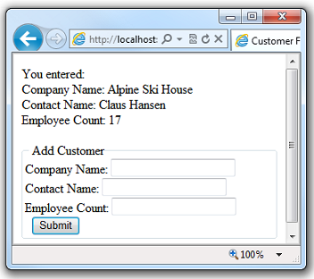
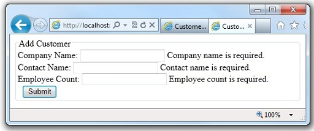
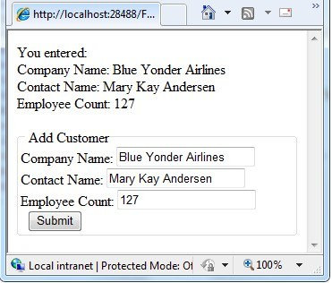

Working with HTML Forms in ASP.NET Web Pages (Razor) Sites
====================
by [Tom FitzMacken](https://github.com/tfitzmac)

> This article describes how to process an HTML form (with text boxes and buttons) when you are working in an ASP.NET Web Pages (Razor) website.
> 
> **What you'll learn:** 
> 
> - How to create an HTML form.
> - How to read user input from the form.
> - How to validate user input.
> - How to restore form values after the page is submitted.
> 
> These are the ASP.NET programming concepts introduced in the article:
> 
> - The `Request` object.
> - Input validation.
> - HTML encoding.
>   
> 
> ## Software versions used in the tutorial
> 
> 
> - ASP.NET Web Pages (Razor) 3
>   
> 
> This tutorial also works with ASP.NET Web Pages 2.

## Creating a Simple HTML Form

1. Create a new website.
2. In the root folder, create a web page named *Form.cshtml* and enter the following markup:

    [!code-html[Main](4-working-with-forms/samples/sample1.html)]
3. Launch the page in your browser. (In WebMatrix, in the **Files** workspace, right-click the file and then select **Launch in browser**.) A simple form with three input fields and a **Submit** button is displayed.

    

    At this point, if you click the **Submit** button, nothing happens. To make the form useful, you have to add some code that will run on the server.

## Reading User Input from the Form

To process the form, you add code that reads the submitted field values and does something with them. This procedure shows you how to read the fields and display the user input on the page. (In a production application, you generally do more interesting things with user input. You'll do that in the article about working with databases.)

1. At the top of the *Form.cshtml* file, enter the following code:

    [!code-cshtml[Main](4-working-with-forms/samples/sample2.cshtml)]

    When the user first requests the page, only the empty form is displayed. The user (which will be you) fills in the form and then clicks **Submit**. This submits (posts) the user input to the server. By default, the request goes to the same page (namely, *Form.cshtml*).

    When you submit the page this time, the values you entered are displayed just above the form:

    

    Look at the code for the page. You first use the `IsPost` method to determine whether the page is being posted &#8212; that is, whether a user clicked the **Submit** button. If this is a post, `IsPost` returns true. This is the standard way in ASP.NET Web Pages to determine whether you're working with an initial request (a GET request) or a postback (a POST request). (For more information about GET and POST, see the sidebar "HTTP GET and POST and the IsPost Property" in [Introduction to ASP.NET Web Pages Programming Using the Razor Syntax](https://go.microsoft.com/fwlink/?LinkId=202890#SB_HttpGetPost).)

    Next, you get the values that the user filled in from the `Request.Form` object, and you put them in variables for later. The `Request.Form` object contains all the values that were submitted with the page, each identified by a key. The key is the equivalent to the `name` attribute of the form field that you want to read. For example, to read the `companyname` field (text box), you use `Request.Form["companyname"]`.

    Form values are stored in the `Request.Form` object as strings. Therefore, when you have to work with a value as a number or a date or some other type, you have to convert it from a string to that type. In the example, the `AsInt` method of the `Request.Form` is used to convert the value of the employees field (which contains an employee count) to an integer.
2. Launch the page in your browser, fill in the form fields, and click **Submit**. The page displays the values you entered.

> [!TIP] 
> 
> 
> ### HTML Encoding for Appearance and Security
> 
> HTML has special uses for characters like `<`, `>`, and `&`. If these special characters appear where they're not expected, they can ruin the appearance and functionality of your web page. For example, the browser interprets the `<` character (unless it's followed by a space) as the beginning of an HTML element, like `<b>` or `<input ...>`. If the browser doesn't recognize the element, it simply discards the string that begins with `<` until it reaches something that it again recognizes. Obviously, this can result in some weird rendering in the page.
> 
> HTML encoding replaces these reserved characters with a code that browsers interpret as the correct symbol. For example, the `<` character is replaced with `&lt;` and the `>` character is replaced with `&gt;`. The browser renders these replacement strings as the characters that you want to see.
> 
> It's a good idea to use HTML encoding any time you display strings (input) that you got from a user. If you don't, a user can try to get your web page to run a malicious script or do something else that compromises your site security or that's just not what you intend. (This is particularly important if you take user input, store it someplace, and then display it later &#8212; for example, as a blog comment, user review, or something like that.)
> 
> To help prevent these problems, ASP.NET Web Pages automatically HTML-encodes any text content that you output from your code. For example, when you display the content of a variable or an expression using code such as `@MyVar`, ASP.NET Web Pages automatically encodes the output.

## Validating User Input

Users make mistakes. You ask them to fill in a field, and they forget to, or you ask them to enter the number of employees and they type a name instead. To make sure that a form has been filled in correctly before you process it, you validate the user's input.

This procedure shows how to validate all three form fields to make sure the user didn't leave them blank. You also check that the employee count value is a number. If there are errors, you'll display an error message that tells the user what values didn't pass validation.

1. In the *Form.cshtml* file, replace the first block of code with the following code: 

    [!code-cshtml[Main](4-working-with-forms/samples/sample3.cshtml)]

    To validate user input, you use the `Validation` helper. You register required fields by calling `Validation.RequireField`. You register other types of validation by calling `Validation.Add` and specifying the field to validate and the type of validation to perform.

    When the page runs, ASP.NET does all the validation for you. You can check the results by calling `Validation.IsValid`, which returns true if everything passed and false if any field failed validation. Typically, you call `Validation.IsValid` before you perform any processing on the user input.
2. Update the `<body>` element by adding three calls to the `Html.ValidationMessage` method, like this:

    [!code-cshtml[Main](4-working-with-forms/samples/sample4.cshtml?highlight=8,13,18)]

    To display validation error messages, you can call Html.`ValidationMessage` and pass it the name of the field that you want the message for.
3. Run the page. Leave the fields blank and click **Submit**. You see error messages.

    
4. Add a string (for example, "ABC") to the **Employee Count** field and click **Submit** again. This time you see an error that indicates that the string isn't in the right format, namely, an integer.

    

ASP.NET Web Pages provides more options for validating user input, including the ability to automatically perform validation using client script, so that users get immediate feedback in the browser. See the [Additional Resources](#Additional_Resources) section later for more information.

## Restoring Form Values After Postbacks

When you tested the page in the previous section, you might have noticed that if you had a validation error, everything you entered (not just the invalid data) was gone, and you had to re-enter values for all the fields. This illustrates an important point: when you submit a page, process it, and then render the page again, the page is re-created from scratch. As you saw, this means that any values that were in the page when it was submitted are lost.

You can fix this easily, however. You have access to the values that were submitted (in the `Request.Form` object, so you can fill those values back into the form fields when the page is rendered.

1. In the *Form.cshtml* file, replace the `value` attributes of the `<input>` elements using the `value` attribute.: 

    [!code-cshtml[Main](4-working-with-forms/samples/sample5.cshtml?highlight=13,19,25)]

    The `value` attribute of the `<input>` elements has been set to dynamically read the field value out of the `Request.Form` object. The first time that the page is requested, the values in the `Request.Form` object are all empty. This is fine, because that way the form is blank.
2. Launch the page in your browser, fill in the form fields or leave them blank, and click **Submit**. A page that shows the submitted values is displayed.

    

## Additional Resources

- [1,001 Ways to Get Input from Web Users](https://msdn.microsoft.com/en-us/library/ms971057.aspx)
- [Using Forms and Processing User Input](https://msdn.microsoft.com/en-us/library/ms525182(VS.90).aspx)
- [Validating User Input in ASP.NET Web Pages Sites](https://go.microsoft.com/fwlink/?LinkId=253002)
- [Using AutoComplete in HTML Forms](https://msdn.microsoft.com/en-us/library/ms533032(VS.85).aspx)