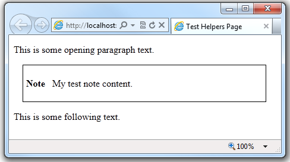

Creating and Using a Helper in an ASP.NET Web Pages (Razor) Site
====================
by [Tom FitzMacken](https://github.com/tfitzmac)

> This article describes how to create a helper in an ASP.NET Web Pages (Razor) website. A *helper* is a reusable component that includes code and markup to perform a task that might be tedious or complex.
> 
> **What you'll learn:** 
> 
> - How to create and use a simple helper.
> 
> These are the ASP.NET features introduced in the article:
> 
> - The `@helper` syntax.
>   
> 
> ## Software versions used in the tutorial
> 
> 
> - ASP.NET Web Pages (Razor) 3
>   
> 
> This tutorial also works with ASP.NET Web Pages 2.

## Overview of Helpers

If you need to perform the same tasks on different pages in your site, you can use a helper. ASP.NET Web Pages includes a number of helpers, and there are many more that you can download and install. (A list of the built-in helpers in ASP.NET Web Pages is listed in the [ASP.NET API Quick Reference](https://go.microsoft.com/fwlink/?LinkId=202907).) If none of the existing helpers meet your needs, you can create your own helper.

A helper lets you use a common block of code across multiple pages. Suppose that in your page you often want to create a note item that's set apart from normal paragraphs. Perhaps the note is created as a `
` element that's styled as a box with a border. Rather than add this same markup to a page every time you want to display a note, you can package the markup as a helper. You can then insert the note with a single line of code anywhere you need it.

Using a helper like this makes the code in each of your pages simpler and easier to read. It also makes it easier to maintain your site, because if you need to change how the notes look, you can change the markup in one place.

## Creating a Helper

This procedure shows you how to create the helper that creates the note, as just described. This is a simple example, but the custom helper can include any markup and ASP.NET code that you need.

1. In the root folder of the website, create a folder named *App\_Code*. This is a reserved folder name in ASP.NET where you can put code for components like helpers.
2. In the *App\_Code* folder create a new *.cshtml* file and name it *MyHelpers.cshtml*.
3. Replace the existing content with the following:

    [!code-cshtml[Main](creating-and-using-a-helper-in-an-aspnet-web-pages-site/samples/sample1.cshtml)]

    The code uses the `@helper` syntax to declare a new helper named `MakeNote`. This particular helper lets you pass a parameter named `content` that can contain a combination of text and markup. The helper inserts the string into the note body using the `@content` variable.

    Notice that the file is named *MyHelpers.cshtml*, but the helper is named `MakeNote`. You can put multiple custom helpers into a single file.
4. Save and close the file.

## Using the Helper in a Page

1. In the root folder, create a new blank file called *TestHelper.cshtml*.
2. Add the following code to the file:

    [!code-html[Main](creating-and-using-a-helper-in-an-aspnet-web-pages-site/samples/sample2.html)]

    To call the helper you created, use `@` followed by the file name where the helper is, a dot, and then the helper name. (If you had multiple folders in the *App\_Code* folder, you could use the syntax `@FolderName.FileName.HelperName` to call your helper within any nested folder level). The text that you add in quotation marks within the parentheses is the text that the helper will display as part of the note in the web page.
3. Save the page and run it in a browser. The helper generates the note item right where you called the helper: between the two paragraphs.

    

## Additional Resources

[Horizontal menu as a Razor helper](http://mikepope.com/blog/DisplayBlog.aspx?permalink=2341). This blog entry by Mike Pope shows how to create a horizontal menu as a helper using markup, CSS, and code.

[Leveraging HTML5 in ASP.Net Web Pages Helpers for WebMatrix and ASP.Net MVC3](http://geekswithblogs.net/wildturtle/archive/2010/11/08/html5-in-asp.net-web-pages-helpers-for-webmatrix-and_aspnet_mvc3.aspx). This blog entry by Sam Abraham shows a helper that renders an HTML5 `Canvas` element.

[The Difference Between @Helpers and @Functions in WebMatrix](http://www.mikesdotnetting.com/Article/173/The-Difference-Between-@Helpers-and-@Functions-In-WebMatrix). This blog entry by Mike Brind describes `@helper` syntax and `@function` syntax and when to use each.