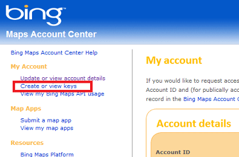
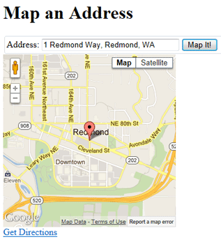
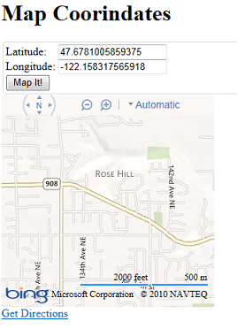

Displaying Maps in an ASP.NET Web Pages (Razor) Site
====================
by [Tom FitzMacken](https://github.com/tfitzmac)

> This article explains how to display interactive maps on pages in an ASP.NET Web Pages (Razor) website based on mapping services provided by Bing, Google, MapQuest, and Yahoo.
> 
> What you'll learn:
> 
> - How to generate a map based on an address.
> - How to generate a map based on latitude and longitude coordinates.
> - How to register a Bing Maps Developer Account and get a key to use with Bing Maps.
> 
> This is the ASP.NET feature introduced in the article:
> 
> - The `Maps` helper.
>   
> 
> ## Software versions used in the tutorial
> 
> 
> - ASP.NET Web Pages (Razor) 2
> - WebMatrix 2
>   
> 
> This tutorial also works with WebMatrix 3.

In Web Pages, you can display maps on a page by using `Maps` helper. You can generate maps based either on an address or on a set of longitude and latitude coordinates. The `Maps` class lets you call into popular map engines including Bing, Google, MapQuest, and Yahoo.

The steps for adding mapping to a page are the same regardless of which of the map engines you call. You just add a JavaScript file reference that makes available methods to display the map, and then you call methods of the `Maps` helper.

You choose a map service based on which `Maps` helper method you use. You can use any of these:

- `Maps.GetBingHtml`
- `Maps.GetGoogleHtml`
- `Maps.GetYahooHtml`
- `Maps.GetMapQuestHtml`

## Installing the Pieces You Need

To display maps, you need these pieces:

- The `Maps` helper. This helper is in version 2 of the ASP.NET Web Helpers Library. If you haven't already added the library, you can install it in your site as a NuGet package. For details, see [Installing Helpers in an ASP.NET Web Pages Site](https://go.microsoft.com/fwlink/?LinkId=252372). (In the Gallery, search for the `microsoft-web-helpers` package.)
- The jQuery library. Several of the WebMatrix site templates already include jQuery libraries in their *Script* folders. If you do not have these libraries, you can download the latest jQuery library directly from the [jQuery.org](http://jQuery.org) site. Or you can create a new site using a template (for example, the **Starter Site** template) and then copy the jQuery files from that site to your current site.

Finally, if you want to use Bing maps, you must first create a (free) account and get a key. To get a key, follow these steps:

1. Create an account on the [Bing Maps Developer Account](https://www.microsoft.com/maps/developers/web.aspx). You must have a Microsoft account (Windows Live ID) as well.

    You can specify that you want to use the key for **Evaluation/Test**. If you are testing the mapping function on your own computer using WebMatrix and IIS Express, go the **Site** workspace and note the URL of your site (for example, `http://localhost:50408`, although your port number will probably be different). You can use this *localhost* address as the site when you register.
2. After you have registered for an account, go to the Bing Maps Account Center and click **Create or view keys**:

    
3. Record the key that Bing creates.

## Creating a Map Based on an Address (Using Google)

The following example shows how to create a page that renders a map based on an address. This example shows how to use Google Maps.

1. Create a file named *MapAddress.cshtml* in the root of the site. This page will generate a map based on an address that you pass to it.
2. Copy the following code into the file, overwriting the existing content.

    [!code-cshtml[Main](displaying-maps-in-an-aspnet-web-pages-site/samples/sample1.cshtml)]

    Notice the following features of the page:

    - The `<script>` element in the `<head>` element. In the example, the `<script>` element references the *jquery-1.6.4.min.js* file, which is a minified (compressed) version of the jQuery library, version 1.6.4. Note that the reference assumes that the *.js* file is in the *Scripts* folder of your site. 

        > [!NOTE]
        > If you're using a different version of the jQuery library, just make sure that you're pointing to that version correctly.
    - The call to the `@Maps.GetGoogleHtml` in the body of the page. To map an address, you must pass an address string. The methods for the other map engines work in a similar way (`@Maps.GetYahooHtml`, `@Maps.GetMapQuestHtml`).
- Run the page and enter an address. The page displays a map, based on Google Maps, that shows the location that you specified.

    

## Creating a Map Based on Latitude and Longitude Coordinates (Using Bing)

This example shows how to create a map based on coordinates. This example shows how to use Bing maps and how to include your Bing key. (You can create a map based on coordinates using the other map engines also, without using a Bing key.)

1. Create a file named *MapCoordinates.cshtml* in the root of the site and replace the existing content with the following code and markup:

    [!code-cshtml[Main](displaying-maps-in-an-aspnet-web-pages-site/samples/sample2.cshtml)]
2. Replace `your-key-here` with the Bing Maps key that you generated earlier.
3. Run the *MapCoordinates.cshtml* page, enter latitude and longitude coordinates, and then click the **Map It!** button. (If you don't know any coordinates, try the following. This is a location on the Microsoft Redmond campus.)

    - Latitude: 47.6781005859375
    - Longitude: -122.158317565918

    The page is displayed using the coordinates that you specified.

    

## Additional Resources

[Microsoft.Maps API Reference](https://msdn.microsoft.com/en-us/library/gg427611.aspx)