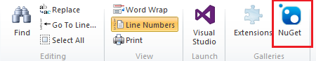

Installing a Helper in an ASP.NET Web Pages (Razor) Site
====================
by [Tom FitzMacken](https://github.com/tfitzmac)

> This article describes how to install a helper in an ASP.NET Web Pages (Razor) website. A *helper* is a reusable component that includes code and markup to perform a task that might be tedious or complex.
> 
> What you'll learn:
> 
> - How to install a helper in a website created using WebMatrix 3.
>   
> 
> ## Software versions used in the tutorial
> 
> 
> - WebMatrix 3

## Overview of Helpers

Some tasks that people often want to do on web pages require a lot of code or require extra knowledge. Examples include displaying a chart for data; putting a Twitter "Follow" button on a page; sending email from your website; cropping or resizing images; using PayPal for your site. To make it easy to do these kinds of things, ASP.NET Web Pages lets you use *helpers*. Helpers are components that you install for a site and that let you perform typical tasks by using just a line or two of Razor code.

ASP.NET Web Pages has a few helpers built in. However, many helpers are available in packages (add-ins) that are provided using the NuGet package manager. NuGet lets you select a package to install and then it takes care of all the details of the installation.

## Installing a Helper in WebMatrix 3

1. In WebMatrix 3, click the **NuGet** button.

    
2. This launches the NuGet package manager and displays available packages. In the search box, enter a keyword for the helper you want to install.

    
- Select the package and then click **Install**. Click **Yes** when asked if you want to install the package and indicate that you accept the terms.

    If this is the first time you've installed a helper, NuGet creates folders in your website for the code that makes up the helper.
- To uninstall a helper, click the **Gallery** button, click the **Installed** tab, and pick the package you want to uninstall.

## Installing the Twitter helper

The latest version of the Twitter API is not compatible with the Twitter helper you install through NuGet. Instead, see the [Twitter Helper with WebMatrix](twitter-helper.md) topic for information about how to set up the Twitter helper in your project.

## Additional Resources

[Introducing ASP.NET Web Pages 2 - Programming Basics](../getting-started/introducing-razor-syntax-c.md)

[Twitter Helper with WebMatrix](twitter-helper.md)