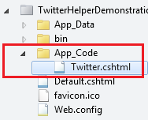

Twitter Helper with ASP.NET Web Pages
====================
by [Tom FitzMacken](https://github.com/tfitzmac)

> This topic and application show how to add a Twitter Helper to your WebMatrix 3 project. It contains the Twitter Helper code and shows how to call the helper methods.
> 
> This code for the Twitter.cshtml file was developed by **Tian Pan** of Microsoft.
> 
> ## Software versions used in the tutorial
> 
> 
> - ASP.NET Web Pages (Razor) 3
>   
> 
> This tutorial also works with ASP.NET Web Pages 2.

## Introduction

This topic demonstrates how to add a Twitter Helper to your application and use Razor syntax to call the helper methods. The Twitter Helper makes it easy to incorporate Twitter buttons and widgets in your application. To use a Twitter widget, such as a user's timeline or the search results for a hashtag, you must first create the [widget on Twitter](https://twitter.com/settings/widgets). After creating your widget, you will receive a widget id. You pass this widget id as a parameter when calling the helper methods that show widget.

This topic was written for version 1.1 of the Twitter API. By directly adding the Twitter Helper code to your project, you can update the helper code if the Twitter API changes.

For information about installing WebMatrix, see [Introducing ASP.NET Web Pages 2 - Getting Started](../getting-started/introducing-aspnet-web-pages-2/getting-started.md).

## Add Twitter Helper to your project

To add the Twitter Helper, first, add a folder named **App\_Code** to your project. Then, create a file named **Twitter.cshtml**.

Replace the default code in Twitter.cshtml with the following code.

[!code-cshtml[Main](twitter-helper/samples/sample1.cshtml)]

## Call Twitter methods from your web pages

The following example shows how to use the Twitter Helper methods from a page in your project. In your project, you will want to replace the parameter values with values that are relevant to your needs. You can use the provided widget ids to explore how the methods work, but you will want to generate your own widgets for your project.

Not all of the parameters shown below are required. The optional parameters are used to customize how the button or widget is displayed. For example, the Follow Button only requires the user name to follow, but the example shows how to include the number of followers, and how specify the size of the button and the language.

[!code-html[Main](twitter-helper/samples/sample2.html)]

## See the results

The above code produces the following buttons and widgets. These buttons and widgets are fully-functional, not screenshots. The Follow Button is displayed in Spanish because the language parameter was set to **es**.

### Follow Button

[Follow @aspnet)](https://twitter.com/aspnet)

### Tweet Button

[Tweet](https://twitter.com/share)

### User Timeline (Profile)

[Tweets by @aspnet](https://twitter.com/aspnet)

### Favorites

[Favorite Tweets by @Microsoft](https://twitter.com/Microsoft/favorites)

### List

[Tweets from @Microsoft/MS\_Consumer\_Bands](https://twitter.com/microsoft/ms-consumer-brands/)

### Search

[Tweets about &quot;#asp.net&quot;](https://twitter.com/search?q=%23asp.net)